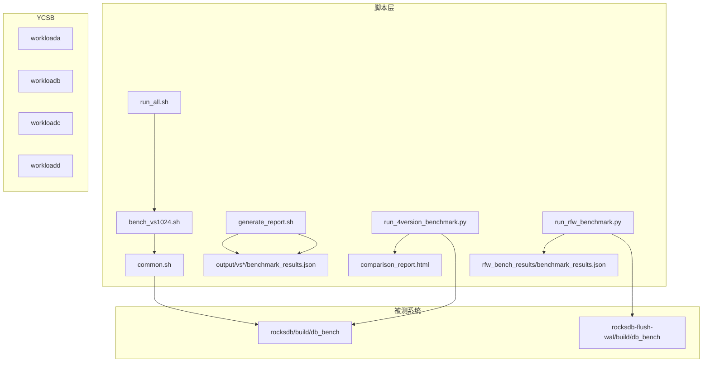
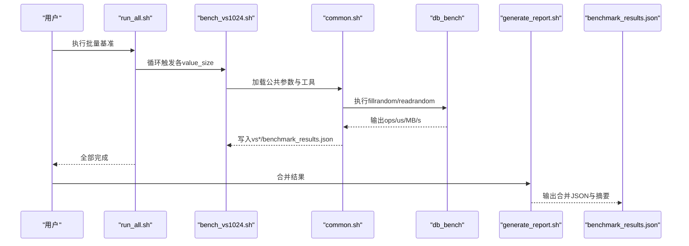
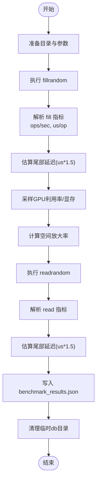
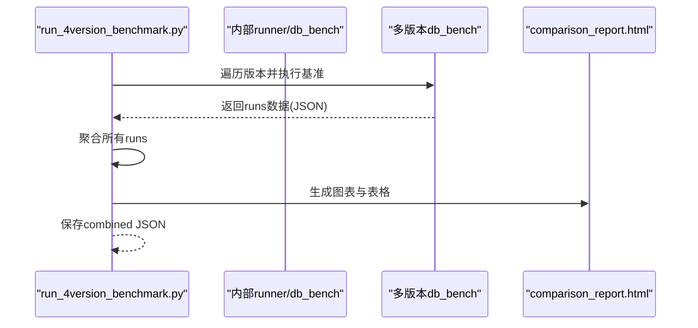
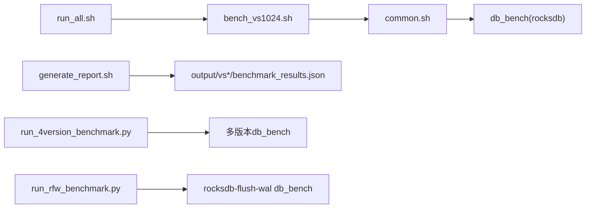

# 性能分析方法

<cite>
**本文引用的文件**   
- [run_4version_benchmark.py](file://script/run_4version_benchmark.py)
- [generate_report.sh](file://script/generate_report.sh)
- [common.sh](file://script/common.sh)
- [bench_vs1024.sh](file://script/bench_vs1024.sh)
- [run_all.sh](file://script/run_all.sh)
- [run_rfw_benchmark.py](file://script/run_rfw_benchmark.py)
- [workloada](file://source/YCSB/workloads/workloada)
- [workloadb](file://source/YCSB/workloads/workloadb)
- [workloadc](file://source/YCSB/workloads/workloadc)
- [workloadd](file://source/YCSB/workloads/workloadd)
</cite>

## 目录
1. [简介](#简介)
2. [项目结构](#项目结构)
3. [核心组件](#核心组件)
4. [架构总览](#架构总览)
5. [详细组件分析](#详细组件分析)
6. [依赖关系分析](#依赖关系分析)
7. [性能考量与指标计算](#性能考量与指标计算)
8. [故障排查指南](#故障排查指南)
9. [结论](#结论)
10. [附录：使用示例与最佳实践](#附录使用示例与最佳实践)

## 简介
本文件面向性能工程师与研究人员，系统化阐述本项目中的性能分析方法与工具链。内容覆盖：
- 基准测试框架使用方法（db_bench、YCSB）
- YCSB工作负载配置与自定义场景设计
- 直方图窗口化统计、延迟分布分析与吞吐量计算方法
- 多版本对比（rocksdb及其变体）的自动化流程与报告生成
- 瓶颈识别、热点定位与资源利用率分析
- 常见问题诊断与调优建议

## 项目结构
脚本层负责编排与数据汇总，YCSB提供标准工作负载定义，底层数据库通过db_bench执行填充与读取操作并输出关键指标。

图表来源 
- [run_all.sh:1-19](file://script/run_all.sh#L1-L19)
- [bench_vs1024.sh:1-10](file://script/bench_vs1024.sh#L1-L10)
- [common.sh:1-196](file://script/common.sh#L1-L196)
- [generate_report.sh:1-59](file://script/generate_report.sh#L1-L59)
- [run_4version_benchmark.py:1-358](file://script/run_4version_benchmark.py#L1-L358)
- [run_rfw_benchmark.py:1-311](file://script/run_rfw_benchmark.py#L1-L311)
- [workloada:1-38](file://source/YCSB/workloads/workloada#L1-L38)
- [workloadb:1-37](file://source/YCSB/workloads/workloadb#L1-L37)
- [workloadc:1-39](file://source/YCSB/workloads/workloadc#L1-L39)
- [workloadd:1-42](file://source/YCSB/workloads/workloadd#L1-L42)

章节来源
- [run_all.sh:1-19](file://script/run_all.sh#L1-L19)
- [bench_vs1024.sh:1-10](file://script/bench_vs1024.sh#L1-L10)
- [common.sh:1-196](file://script/common.sh#L1-L196)
- [generate_report.sh:1-59](file://script/generate_report.sh#L1-L59)
- [run_4version_benchmark.py:1-358](file://script/run_4version_benchmark.py#L1-L358)
- [run_rfw_benchmark.py:1-311](file://script/run_rfw_benchmark.py#L1-L311)
- [workloada:1-38](file://source/YCSB/workloads/workloada#L1-L38)
- [workloadb:1-37](file://source/YCSB/workloads/workloadb#L1-L37)
- [workloadc:1-39](file://source/YCSB/workloads/workloadc#L1-L39)
- [workloadd:1-42](file://source/YCSB/workloads/workloadd#L1-L42)

## 核心组件
- 统一基准入口与参数：common.sh定义键值大小、线程数、压缩策略、缓存等，并提供解析ops/sec与us/op、MB/s换算、硬件信息采集、GPU采样等工具函数。
- 单值尺寸基准：bench_vs1024.sh调用common.sh执行fillrandom/readrandom，输出JSON结果。
- 批量执行：run_all.sh顺序遍历不同value_size，生成各子目录结果。
- 多版本对比：run_4version_benchmark.py驱动多个版本的db_bench，汇总为HTML对比报告。
- RFW专项基准：run_rfw_benchmark.py针对rocksdb-flush-wal变体，支持多种读写组合场景。
- 结果合并与汇总：generate_report.sh合并各value_size的结果，打印摘要并输出合并JSON。
- YCSB工作负载：workloada~d定义读/写/扫描比例与请求分布，便于扩展业务型负载。

章节来源
- [common.sh:1-196](file://script/common.sh#L1-L196)
- [bench_vs1024.sh:1-10](file://script/bench_vs1024.sh#L1-L10)
- [run_all.sh:1-19](file://script/run_all.sh#L1-L19)
- [run_4version_benchmark.py:1-358](file://script/run_4version_benchmark.py#L1-L358)
- [run_rfw_benchmark.py:1-311](file://script/run_rfw_benchmark.py#L1-L311)
- [generate_report.sh:1-59](file://script/generate_report.sh#L1-L59)
- [workloada:1-38](file://source/YCSB/workloads/workloada#L1-L38)
- [workloadb:1-37](file://source/YCSB/workloads/workloadb#L1-L37)
- [workloadc:1-39](file://source/YCSB/workloads/workloadc#L1-L39)
- [workloadd:1-42](file://source/YCSB/workloads/workloadd#L1-L42)

## 架构总览
下图展示从脚本到被测系统的端到端流程，包括数据收集、指标解析、报告生成与跨版本对比。

图表来源 
- [run_all.sh:1-19](file://script/run_all.sh#L1-L19)
- [bench_vs1024.sh:1-10](file://script/bench_vs1024.sh#L1-L10)
- [common.sh:1-196](file://script/common.sh#L1-L196)
- [generate_report.sh:1-59](file://script/generate_report.sh#L1-L59)

## 详细组件分析

### common.sh：基准执行与指标采集
- 功能要点
  - 统一参数：KEY_SIZE、NUM_OPS、COMPRESSION、THREADS、WRITE_BUFFER_SIZE、SEED等。
  - 解析器：parse_ops_per_sec、parse_us_per_op从db_bench输出提取ops/sec与us/op。
  - 吞吐换算：calc_mbps基于ops/sec与kv_size计算MB/s。
  - 硬件信息：collect_hw_json采集CPU/GPU/内存/内核等信息。
  - GPU采样：sample_gpu在fill后采样GPU利用率与显存占用。
  - 基准执行：run_bench执行fillrandom与readrandom，记录延迟、吞吐、空间放大率，并输出结构化JSON。
- 数据处理流程
  - 清理环境→构建db_dir→执行fillrandom→解析指标→估算尾部延迟→采样GPU→计算空间放大率→执行readrandom→解析指标→输出JSON→清理db_dir。

图表来源 
- [common.sh:68-196](file://script/common.sh#L68-L196)

章节来源
- [common.sh:1-196](file://script/common.sh#L1-L196)

### bench_vs1024.sh：单值尺寸基准
- 作用：以value_size=1024为例，调用common.sh执行基准，输出对应JSON结果。
- 适用性：可复制该脚本适配其他value_size（如32、128、512、4096、16384）。

章节来源
- [bench_vs1024.sh:1-10](file://script/bench_vs1024.sh#L1-L10)

### run_all.sh：批量执行
- 作用：顺序遍历指定value_size集合，逐个调用对应bench脚本，最终汇总至output目录。
- 输出：每个value_size一个子目录，包含benchmark_results.json。

章节来源
- [run_all.sh:1-19](file://script/run_all.sh#L1-L19)

### generate_report.sh：结果合并与摘要
- 作用：合并各value_size的benchmark_results.json，生成统一的combined JSON，并打印摘要表。
- 关键点：按value_size排序；保留metadata与hardware信息；公式提示MB/s与ops/sec的关系。

章节来源
- [generate_report.sh:1-59](file://script/generate_report.sh#L1-L59)

### run_4version_benchmark.py：多版本对比
- 作用：对多个RocksDB版本（含flush-gpu、flush-wal、flush-wal-0.2）执行基准，生成HTML对比报告。
- 流程：
  - 校验二进制存在
  - 逐版本运行基准（调用内部runner或db_bench）
  - 收集runs列表（包含value_size、吞吐、延迟等）
  - 生成HTML（Chart.js可视化：吞吐、ops/sec、延迟柱状图）
  - 输出combined JSON与终端摘要

图表来源 
- [run_4version_benchmark.py:1-358](file://script/run_4version_benchmark.py#L1-L358)

章节来源
- [run_4version_benchmark.py:1-358](file://script/run_4version_benchmark.py#L1-L358)

### run_rfw_benchmark.py：RFW专项基准
- 作用：针对rocksdb-flush-wal变体，支持三种读写组合场景（随机/顺序/混合），输出JSON与可选HTML报告。
- 关键点：处理db_bench输出的回车符；解析micros/op与MB/s；采样GPU；计算空间放大率；分组打印摘要。

章节来源
- [run_rfw_benchmark.py:1-311](file://script/run_rfw_benchmark.py#L1-L311)

### YCSB工作负载配置
- workloada：更新密集（读/写=50/50），zipfian分布
- workloadb：读为主（读/写=95/5），zipfian分布
- workloadc：只读（读=100%），zipfian分布
- workloadd：读最新（读/插入=95/5），latest分布
- 用途：用于模拟真实业务访问模式，结合YCSB客户端驱动目标存储进行压测。

章节来源
- [workloada:1-38](file://source/YCSB/workloads/workloada#L1-L38)
- [workloadb:1-37](file://source/YCSB/workloads/workloadb#L1-L37)
- [workloadc:1-39](file://source/YCSB/workloads/workloadc#L1-L39)
- [workloadd:1-42](file://source/YCSB/workloads/workloadd#L1-L42)

## 依赖关系分析
- 脚本依赖
  - bench_vs1024.sh依赖common.sh
  - run_all.sh依赖bench_vs*.sh
  - generate_report.sh依赖output下各vs*/benchmark_results.json
  - run_4version_benchmark.py依赖各版本db_bench二进制
  - run_rfw_benchmark.py依赖rocksdb-flush-wal的db_bench
- 外部依赖
  - nvidia-smi（GPU采样）
  - Chart.js（HTML报告可视化）
  - Python3与常用库（json、subprocess、re等）

图表来源 
- [run_all.sh:1-19](file://script/run_all.sh#L1-L19)
- [bench_vs1024.sh:1-10](file://script/bench_vs1024.sh#L1-L10)
- [common.sh:1-196](file://script/common.sh#L1-L196)
- [generate_report.sh:1-59](file://script/generate_report.sh#L1-L59)
- [run_4version_benchmark.py:1-358](file://script/run_4version_benchmark.py#L1-L358)
- [run_rfw_benchmark.py:1-311](file://script/run_rfw_benchmark.py#L1-L311)

章节来源
- [run_all.sh:1-19](file://script/run_all.sh#L1-L19)
- [bench_vs1024.sh:1-10](file://script/bench_vs1024.sh#L1-L10)
- [common.sh:1-196](file://script/common.sh#L1-L196)
- [generate_report.sh:1-59](file://script/generate_report.sh#L1-L59)
- [run_4version_benchmark.py:1-358](file://script/run_4version_benchmark.py#L1-L358)
- [run_rfw_benchmark.py:1-311](file://script/run_rfw_benchmark.py#L1-L311)

## 性能考量与指标计算
- 吞吐计算
  - MB/s = ops/sec × (key_size + value_size) / (1024×1024)
  - 当未直接输出MB/s时，可通过us/op反推吞吐
- 延迟分析
  - 平均延迟：us/op
  - 尾部延迟估计：us/op × 1.5（脚本中采用经验系数）
  - 直方图窗口化统计：启用--histogram=true，由db_bench输出延迟分布；可按分位点（P50/P95/P99）评估长尾
- 空间放大率
  - space_amplification = 磁盘实际大小 / 逻辑数据量
  - 反映存储开销与压缩/索引/元数据影响
- 资源利用率
  - CPU核数、内存总量、GPU利用率与显存占用（nvidia-smi采样）
- 多版本对比方法
  - 固定key_size、threads、compression_type、seed等参数
  - 遍历value_size集合，比较fill/read吞吐与延迟
  - 使用HTML报告直观对比趋势与拐点

章节来源
- [common.sh:34-39](file://script/common.sh#L34-L39)
- [common.sh:103-154](file://script/common.sh#L103-L154)
- [generate_report.sh:45-59](file://script/generate_report.sh#L45-L59)
- [run_4version_benchmark.py:75-150](file://script/run_4version_benchmark.py#L75-L150)
- [run_rfw_benchmark.py:81-105](file://script/run_rfw_benchmark.py#L81-L105)

## 故障排查指南
- 二进制缺失
  - 现象：run_4version_benchmark.py报错缺少db_bench
  - 处理：确认各版本build产物路径正确，LD_LIBRARY_PATH设置无误
- 输出解析失败
  - 现象：ops/sec或us/op为空
  - 处理：检查db_bench输出格式；确保启用--statistics与--histogram；必要时调整正则解析
- 超时
  - 现象：run_rfw_benchmark.py捕获TimeoutExpired
  - 处理：增大timeout或减少num_keys；检查磁盘IO瓶颈
- GPU采样失败
  - 现象：GPU指标为0或None
  - 处理：确认nvidia-smi可用且权限足够；在无GPU环境下忽略该指标
- 结果合并异常
  - 现象：generate_report.sh找不到vs*/benchmark_results.json
  - 处理：确保run_all.sh已完整执行；核对output目录结构与文件名

章节来源
- [run_4version_benchmark.py:298-320](file://script/run_4version_benchmark.py#L298-L320)
- [run_rfw_benchmark.py:163-176](file://script/run_rfw_benchmark.py#L163-L176)
- [generate_report.sh:10-42](file://script/generate_report.sh#L10-L42)
- [common.sh:41-66](file://script/common.sh#L41-L66)

## 结论
本项目提供了从基准执行、指标采集、结果合并到多版本对比的完整性能分析链路。通过common.sh标准化参数与解析，配合run_all.sh与generate_report.sh实现批量化与可重复性；run_4version_benchmark.py与run_rfw_benchmark.py分别支撑横向对比与专项场景。结合YCSB工作负载，可进一步贴近业务特征进行压测。建议在每次迭代中固定实验条件、关注吞吐与延迟趋势、利用直方图定位长尾问题，并通过资源采样定位瓶颈。

## 附录：使用示例与最佳实践
- 快速开始
  - 执行全量基准：bash script/run_all.sh
  - 合并结果并查看摘要：bash script/generate_report.sh
  - 多版本对比：python3 script/run_4version_benchmark.py
  - RFW专项基准：python3 script/run_rfw_benchmark.py
- 自定义工作负载
  - 修改YCSB workloada~d中的readproportion/updateproportion/insertproportion与requestdistribution，以匹配业务模型
- 直方图与延迟分析
  - 保持--histogram=true，结合P95/P99观察长尾；若db_bench输出不包含MB/s，使用us/op反推
- 瓶颈识别技巧
  - 关注space_amplification突增（可能压缩/索引/元数据膨胀）
  - GPU利用率低但吞吐下降（可能CPU或IO受限）
  - 尾部延迟显著高于均值（锁竞争、GC/Compaction抖动）
- 调优建议
  - 调整write_buffer_size与cache_size平衡内存与IO
  - 关闭压缩或选择轻量压缩降低CPU压力
  - 增加并发线程（需评估锁与IO饱和）
  - 优化key/value大小分布，避免热点key

章节来源
- [run_all.sh:1-19](file://script/run_all.sh#L1-L19)
- [generate_report.sh:1-59](file://script/generate_report.sh#L1-L59)
- [run_4version_benchmark.py:1-358](file://script/run_4version_benchmark.py#L1-L358)
- [run_rfw_benchmark.py:1-311](file://script/run_rfw_benchmark.py#L1-L311)
- [workloada:1-38](file://source/YCSB/workloads/workloada#L1-L38)
- [workloadb:1-37](file://source/YCSB/workloads/workloadb#L1-L37)
- [workloadc:1-39](file://source/YCSB/workloads/workloadc#L1-L39)
- [workloadd:1-42](file://source/YCSB/workloads/workloadd#L1-L42)