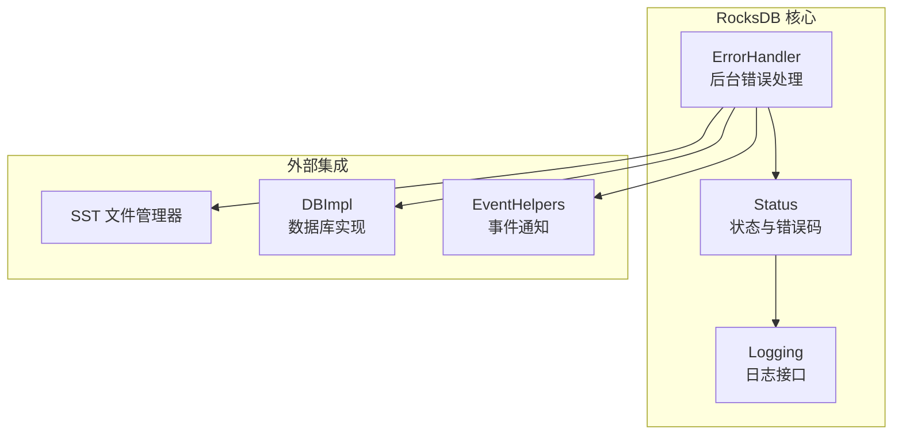
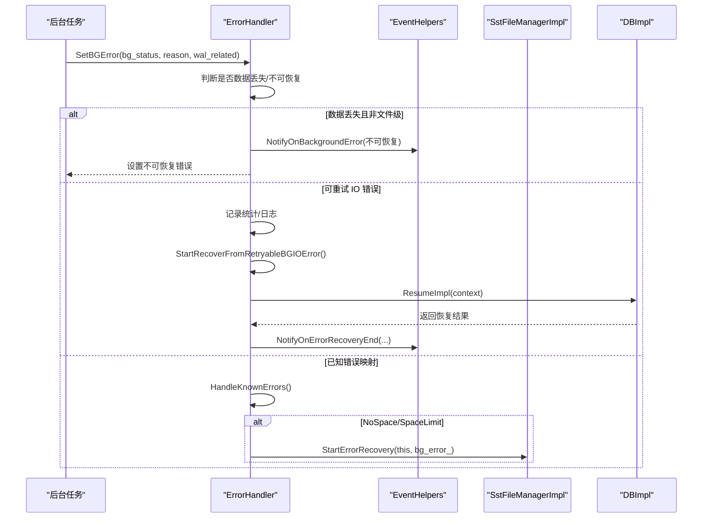
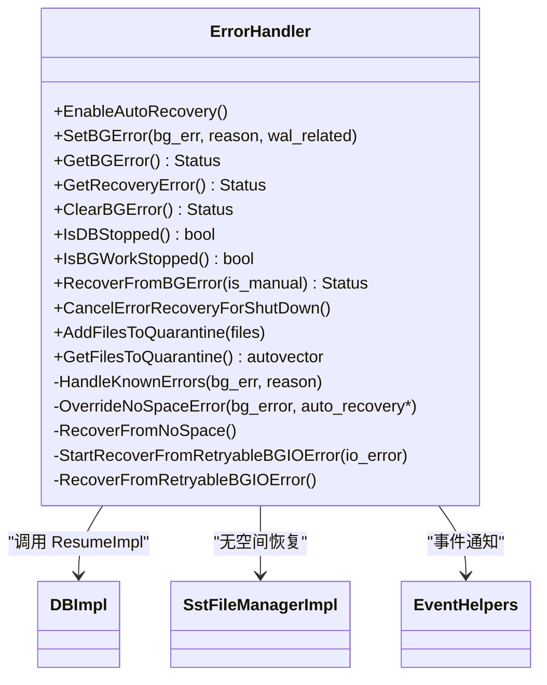
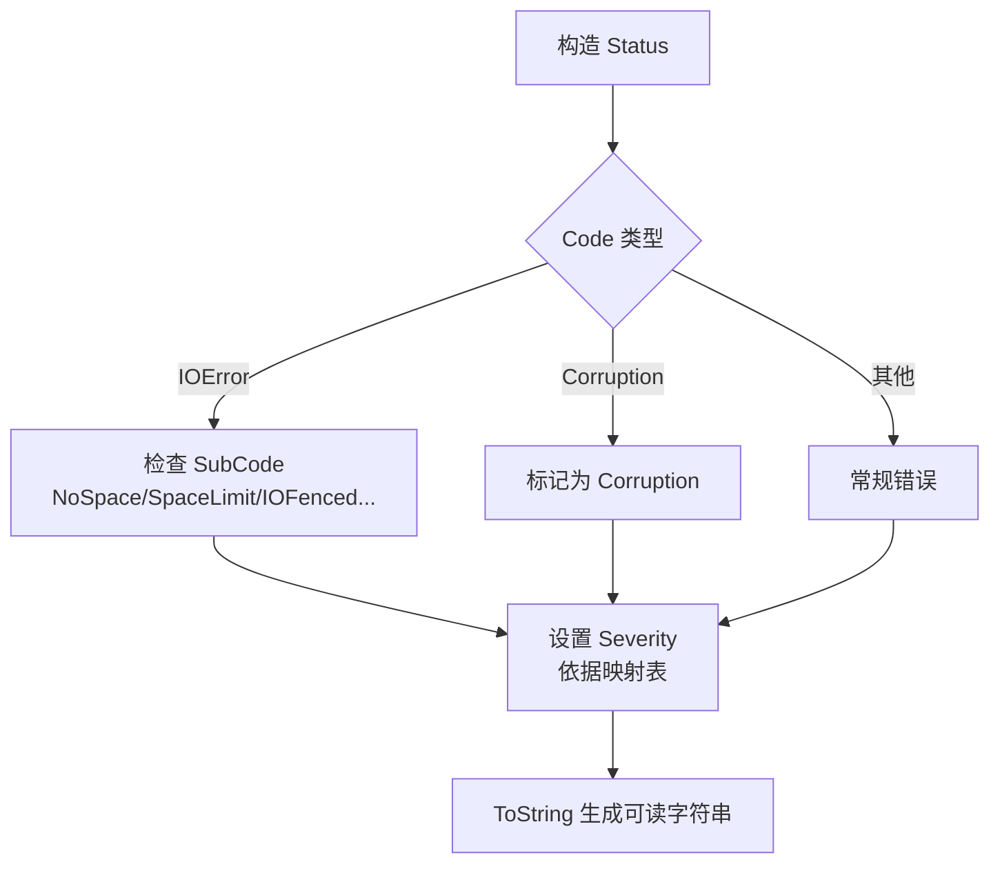
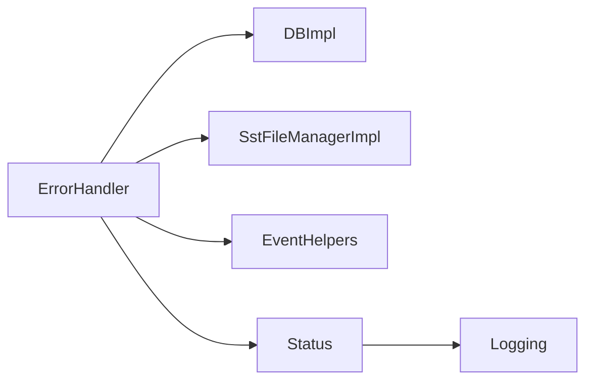

# 故障排查指南

<cite>
**本文引用的文件**   
- [error_handler.cc](file://source/rocksdb/db/error_handler.cc)
- [error_handler.h](file://source/rocksdb/db/error_handler.h)
- [status.cc](file://source/rocksdb/util/status.cc)
- [logging.h](file://source/rocksdb/logging/logging.h)
</cite>

## 目录
1. [简介](#简介)
2. [项目结构](#项目结构)
3. [核心组件](#核心组件)
4. [架构总览](#架构总览)
5. [详细组件分析](#详细组件分析)
6. [依赖关系分析](#依赖关系分析)
7. [性能考量](#性能考量)
8. [故障排查指南](#故障排查指南)
9. [结论](#结论)
10. [附录](#附录)

## 简介
本指南面向运维工程师与开发人员，聚焦 RocksDB 在 metadata offload 场景下的错误处理与故障排查。内容涵盖：
- 错误处理机制的实现原理（异常捕获、错误码分类、恢复策略）
- 常见故障模式识别与诊断步骤（内存泄漏、I/O 阻塞、压缩失败等）
- 日志级别配置、调试信息输出与堆栈跟踪分析方法
- 性能退化问题的排查流程与优化建议
- 生产环境紧急故障处理与回滚策略

## 项目结构
围绕错误处理的核心代码位于 RocksDB 的 db 与 util 层：
- db/error_handler.{h,cc}：后台错误处理、自动恢复、隔离文件清单、无空间恢复等
- util/status.cc：Status 状态对象实现，包含错误码、子码、严重等级与消息格式化
- logging/logging.h：日志宏与日志接口定义

图表来源 
- [error_handler.cc:1-120](file://source/rocksdb/db/error_handler.cc#L1-L120)
- [error_handler.h:1-166](file://source/rocksdb/db/error_handler.h#L1-L166)
- [status.cc:1-167](file://source/rocksdb/util/status.cc#L1-L167)
- [logging.h:1-200](file://source/rocksdb/logging/logging.h#L1-L200)

章节来源
- [error_handler.cc:1-120](file://source/rocksdb/db/error_handler.cc#L1-L120)
- [error_handler.h:1-166](file://source/rocksdb/db/error_handler.h#L1-L166)
- [status.cc:1-167](file://source/rocksdb/util/status.cc#L1-L167)
- [logging.h:1-200](file://source/rocksdb/logging/logging.h#L1-L200)

## 核心组件
- ErrorHandler：集中处理后台操作（压缩、刷写、Manifest 写入、异步打开文件等）的错误，决定严重等级，触发自动恢复或停止 DB，协调 SST 文件管理器进行无空间恢复，维护隔离文件清单，提供手动/自动恢复入口。
- Status：统一的错误状态封装，包含 Code、SubCode、Severity、重试性、数据丢失标记、作用域等，并提供 ToString 用于可读输出。
- Logging：提供不同级别的日志宏（如 ROCKS_LOG_INFO、ROCKS_LOG_WARN），便于定位问题。

章节来源
- [error_handler.h:34-166](file://source/rocksdb/db/error_handler.h#L34-L166)
- [error_handler.cc:254-387](file://source/rocksdb/db/error_handler.cc#L254-L387)
- [status.cc:29-167](file://source/rocksdb/util/status.cc#L29-L167)
- [logging.h:1-200](file://source/rocksdb/logging/logging.h#L1-L200)

## 架构总览
下图展示了后台 IO 错误进入 ErrorHandler 后的主流程：分类严重等级、决定是否自动恢复、调用监听器回调、必要时委托 SST 文件管理器执行无空间恢复，或在可重试 IO 错误时启动自动恢复线程。

图表来源 
- [error_handler.cc:413-532](file://source/rocksdb/db/error_handler.cc#L413-L532)
- [error_handler.cc:559-599](file://source/rocksdb/db/error_handler.cc#L559-L599)
- [error_handler.cc:688-800](file://source/rocksdb/db/error_handler.cc#L688-L800)

## 详细组件分析

### ErrorHandler 类与关键方法
- 严重等级判定：通过 ErrorSeverityMap、DefaultErrorSeverityMap、DefaultReasonMap 三级映射，结合 BackgroundErrorReason、Status::Code、Status::SubCode 与 paranoid_checks 决定 Severity。
- 自动恢复控制：根据 max_bgerror_resume_count、bgerror_resume_retry_interval 等选项控制自动恢复次数与间隔；对致命错误禁用自动恢复。
- 无空间恢复：当出现 NoSpace/SpaceLimit 时，委托 SstFileManagerImpl 开始错误恢复流程。
- 隔离文件清单：在 Manifest 写入错误期间，将可能处于歧义状态的版本编辑涉及的文件加入隔离列表，避免误删。
- 恢复上下文：记录 FlushReason、是否恢复后刷写等上下文，供 ResumeImpl 使用。

图表来源 
- [error_handler.h:34-166](file://source/rocksdb/db/error_handler.h#L34-L166)
- [error_handler.cc:254-387](file://source/rocksdb/db/error_handler.cc#L254-L387)
- [error_handler.cc:559-599](file://source/rocksdb/db/error_handler.cc#L559-L599)
- [error_handler.cc:688-800](file://source/rocksdb/db/error_handler.cc#L688-L800)

章节来源
- [error_handler.h:34-166](file://source/rocksdb/db/error_handler.h#L34-L166)
- [error_handler.cc:254-387](file://source/rocksdb/db/error_handler.cc#L254-L387)
- [error_handler.cc:559-599](file://source/rocksdb/db/error_handler.cc#L559-L599)
- [error_handler.cc:688-800](file://source/rocksdb/db/error_handler.cc#L688-L800)

### Status 状态与错误码
- Code：OK、NotFound、Corruption、NotSupported、InvalidArgument、IOError、MergeInProgress、Incomplete、ShutdownInProgress、TimedOut、Aborted、Busy、Expired、TryAgain、CompactionTooLarge、ColumnFamilyDropped 等。
- SubCode：包括 kNoSpace、kSpaceLimit、kIOFenced、kMemoryLimit 等，用于细化错误原因。
- Severity：NoError、SoftError、HardError、FatalError、UnrecoverableError，影响自动恢复与 DB 行为。
- ToString：组合 Code、SubCode 与消息文本，便于日志与监控展示。

图表来源 
- [status.cc:29-167](file://source/rocksdb/util/status.cc#L29-L167)

章节来源
- [status.cc:29-167](file://source/rocksdb/util/status.cc#L29-L167)

### 日志与监控
- 日志宏：ROCKS_LOG_INFO、ROCKS_LOG_WARN 等，用于记录错误处理过程与决策。
- 统计计数器：ERROR_HANDLER_BG_ERROR_COUNT、ERROR_HANDLER_BG_IO_ERROR_COUNT、ERROR_HANDLER_AUTORESUME_COUNT 等，便于量化错误与恢复行为。

章节来源
- [error_handler.cc:369-387](file://source/rocksdb/db/error_handler.cc#L369-L387)
- [error_handler.cc:422-427](file://source/rocksdb/db/error_handler.cc#L422-L427)
- [error_handler.cc:706-710](file://source/rocksdb/db/error_handler.cc#L706-L710)
- [logging.h:1-200](file://source/rocksdb/logging/logging.h#L1-L200)

## 依赖关系分析
- ErrorHandler 依赖 DBImpl 的 ResumeImpl 进行恢复，依赖 SstFileManagerImpl 进行无空间恢复，依赖 EventHelpers 进行事件通知。
- Status 作为通用错误载体，贯穿所有模块，确保错误语义一致。
- Logging 提供统一日志输出，便于问题追踪。

图表来源 
- [error_handler.h:34-166](file://source/rocksdb/db/error_handler.h#L34-L166)
- [status.cc:1-167](file://source/rocksdb/util/status.cc#L1-L167)
- [logging.h:1-200](file://source/rocksdb/logging/logging.h#L1-L200)

章节来源
- [error_handler.h:34-166](file://source/rocksdb/db/error_handler.h#L34-L166)
- [status.cc:1-167](file://source/rocksdb/util/status.cc#L1-L167)
- [logging.h:1-200](file://source/rocksdb/logging/logging.h#L1-L200)

## 性能考量
- 自动恢复开销：频繁自动恢复可能导致额外 CPU 与 I/O 压力，需合理设置 max_bgerror_resume_count 与 bgerror_resume_retry_interval。
- 压缩路径重试：压缩过程中的可重试 IO 错误被映射为软错误，由压缩线程自行重调度，避免阻塞整体写入。
- 无空间恢复：依赖 SST 文件管理器清理或迁移文件，需关注磁盘空间回收效率与延迟。
- 日志与统计：高频率日志与统计计数会增加系统开销，建议在问题定位阶段临时提升日志级别。

[本节为通用指导，不直接分析具体文件]

## 故障排查指南

### 错误处理机制与恢复策略
- 严重等级判定：基于背景错误原因、Status::Code、Status::SubCode 与 paranoid_checks 综合判定，决定 Soft/Hard/Fatal/Unrecoverable。
- 自动恢复：对可重试 IO 错误启用自动恢复线程，按最大次数与间隔重试；致命错误禁止自动恢复。
- 无空间恢复：NoSpace/SpaceLimit 错误委托 SST 文件管理器执行恢复，必要时隔离文件并等待空间释放。
- 监听器回调：通过 EventHelpers 通知上层应用，允许自定义处理逻辑（如降级、告警）。

章节来源
- [error_handler.cc:254-387](file://source/rocksdb/db/error_handler.cc#L254-L387)
- [error_handler.cc:413-532](file://source/rocksdb/db/error_handler.cc#L413-L532)
- [error_handler.cc:559-599](file://source/rocksdb/db/error_handler.cc#L559-L599)
- [error_handler.cc:688-800](file://source/rocksdb/db/error_handler.cc#L688-L800)

### 常见故障模式与诊断步骤
- 内存泄漏
  - 现象：进程内存持续增长，GC/压缩线程活跃但内存未回落。
  - 诊断：观察统计计数器与内存指标；检查 memtable 大小与 SST 文件大小；确认是否有未释放的句柄或缓存。
  - 处理：调整内存限制参数；检查应用侧引用；必要时重启服务并收集堆转储。
- I/O 阻塞
  - 现象：写入延迟飙升，后台任务停滞，出现 IO 错误。
  - 诊断：查看 IO 错误日志与 SubCode（如 NoSpace、IOFenced）；检查磁盘健康与队列深度；确认文件系统挂载参数。
  - 处理：扩容磁盘或清理无用文件；调整 I/O 并发与限速；必要时切换存储后端。
- 压缩失败
  - 现象：压缩线程频繁重试，吞吐下降，延迟增加。
  - 诊断：检查压缩相关错误码与统计；确认目标路径可用性与权限；评估压缩级别与并行度。
  - 处理：降低压缩级别或并行度；修复底层存储问题；监控压缩队列长度。

[本节为通用指导，不直接分析具体文件]

### 日志级别配置与调试输出
- 日志级别：使用 ROCKS_LOG_INFO、ROCKS_LOG_WARN 等宏输出关键路径与错误信息。
- 调试输出：在问题定位阶段提高日志级别，记录错误处理决策与恢复过程。
- 堆栈跟踪：结合操作系统工具（如 gdb、perf）与应用层日志，定位崩溃或死锁位置。

章节来源
- [error_handler.cc:369-387](file://source/rocksdb/db/error_handler.cc#L369-L387)
- [logging.h:1-200](file://source/rocksdb/logging/logging.h#L1-L200)

### 性能退化问题排查流程
- 指标采集：统计后台错误计数、自动恢复次数、重试次数等。
- 根因分析：区分是 I/O 瓶颈、压缩过载还是内存不足导致。
- 优化建议：调整压缩策略、I/O 限速、内存上限；必要时分片或扩容。

[本节为通用指导，不直接分析具体文件]

### 生产环境紧急故障处理与回滚策略
- 紧急处理：立即暂停写入或降级服务，防止错误扩散；记录现场日志与指标。
- 回滚策略：若为新版本引入的问题，快速回滚到稳定版本；验证数据一致性后再恢复服务。
- 恢复验证：确认无空间恢复完成、后台任务正常、错误计数不再增长。

[本节为通用指导，不直接分析具体文件]

## 结论
RocksDB 的错误处理体系以 ErrorHandler 为核心，结合 Status 错误语义与 Logging 输出，实现了从错误分类、自动恢复到无空间处理的完整闭环。运维与开发应充分利用日志、统计与事件回调，建立完善的监控与告警体系，快速定位与恢复故障，保障系统稳定性与性能。

[本节为总结，不直接分析具体文件]

## 附录
- 关键术语：BackgroundErrorReason、Status::Code/SubCode/Severity、SST 文件管理器、自动恢复、隔离文件清单。
- 参考文件：error_handler.{h,cc}、status.cc、logging.h。

[本节为附录，不直接分析具体文件]