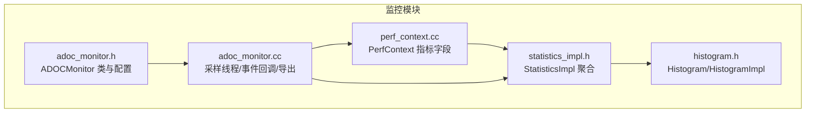
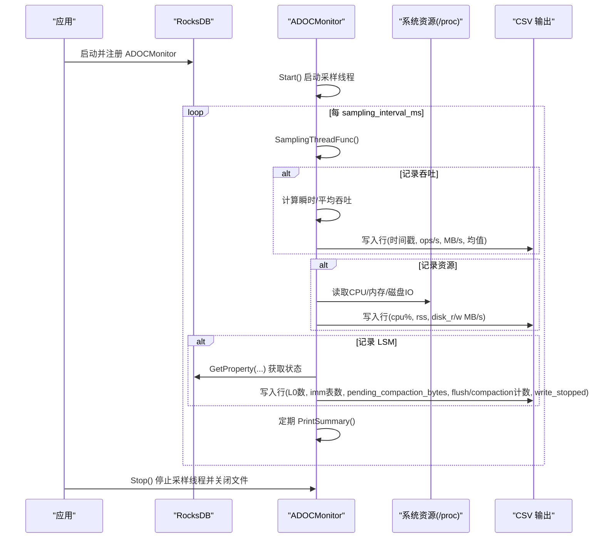
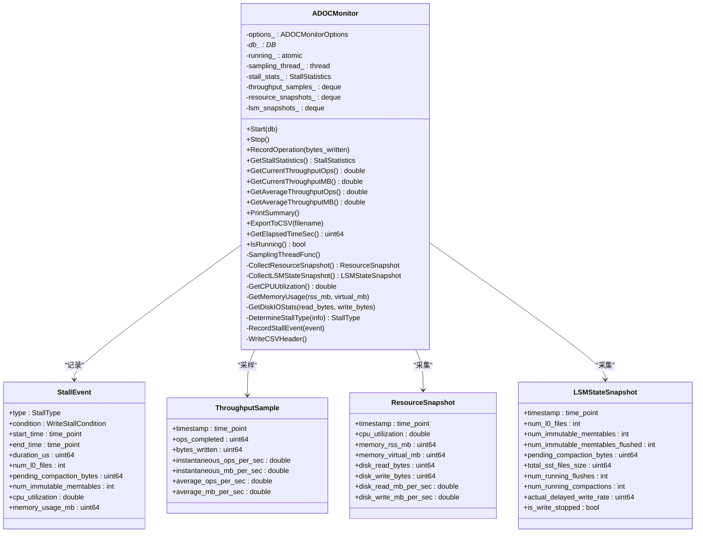
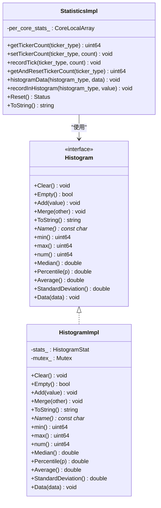
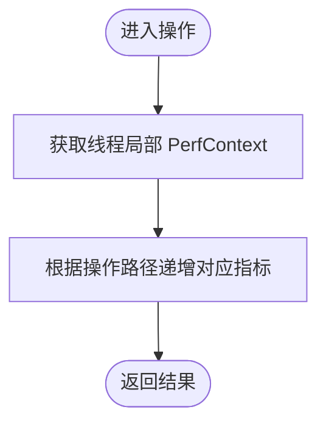
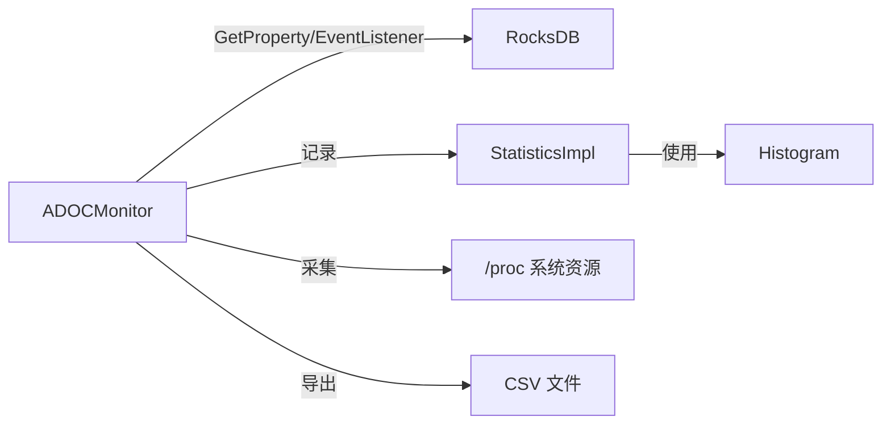

# 监控和诊断

<cite>
**本文引用的文件**   
- [adoc_monitor.h](file://source/rocksdb_adoc_monitor/monitoring/adoc_monitor.h)
- [adoc_monitor.cc](file://source/rocksdb_adoc_monitor/monitoring/adoc_monitor.cc)
- [statistics_impl.h](file://source/rocksdb_adoc_monitor/monitoring/statistics_impl.h)
- [perf_context.cc](file://source/rocksdb_adoc_monitor/monitoring/perf_context.cc)
- [histogram.h](file://source/rocksdb_adoc_monitor/monitoring/histogram.h)
</cite>

## 目录
1. [简介](#简介)
2. [项目结构](#项目结构)
3. [核心组件](#核心组件)
4. [架构总览](#架构总览)
5. [详细组件分析](#详细组件分析)
6. [依赖关系分析](#依赖关系分析)
7. [性能考量](#性能考量)
8. [故障排查指南](#故障排查指南)
9. [结论](#结论)
10. [附录](#附录)

## 简介
本章节面向运维与研发人员，系统化阐述 RocksDB ADOC Monitor 的监控与诊断能力。内容覆盖：
- 实时监控工具的实现原理（采样线程、事件监听、资源快照）
- 性能分析方法（吞吐、延迟分布、LSM 状态、写停顿）
- 统计信息收集机制（计数器、直方图、PerfContext）
- 指标导出接口（CSV 输出、属性查询）
- 监控配置选项、告警规则建议与可视化仪表板设置
- 与 Prometheus/Grafana 集成思路
- 常见性能问题诊断与解决方案

## 项目结构
监控相关代码集中在 monitoring 目录下，关键文件包括：
- adoc_monitor.{h,cc}：ADOC 监控器主实现，负责采样、事件处理、数据导出
- statistics_impl.h：统计计数器与直方图的聚合实现
- perf_context.cc：按操作路径的性能上下文指标定义与线程局部存储
- histogram.h：直方图数据结构与统计方法

图表来源
- [adoc_monitor.h:119-202](file://source/rocksdb_adoc_monitor/monitoring/adoc_monitor.h#L119-L202)
- [adoc_monitor.cc:31-133](file://source/rocksdb_adoc_monitor/monitoring/adoc_monitor.cc#L31-L133)
- [statistics_impl.h:42-112](file://source/rocksdb_adoc_monitor/monitoring/statistics_impl.h#L42-L112)
- [perf_context.cc:167-179](file://source/rocksdb_adoc_monitor/monitoring/perf_context.cc#L167-L179)
- [histogram.h:88-141](file://source/rocksdb_adoc_monitor/monitoring/histogram.h#L88-L141)

章节来源
- [adoc_monitor.h:119-202](file://source/rocksdb_adoc_monitor/monitoring/adoc_monitor.h#L119-L202)
- [adoc_monitor.cc:31-133](file://source/rocksdb_adoc_monitor/monitoring/adoc_monitor.cc#L31-L133)

## 核心组件
- ADOCMonitor：基于 EventListener 的监控器，周期性采样吞吐、系统资源、LSM 状态，记录写停顿事件，支持 CSV 导出与摘要打印
- StatisticsImpl：线程本地统计聚合，提供计数器与直方图读写、重置与字符串化
- PerfContext：按操作路径细粒度的性能上下文指标集合，线程局部存储
- Histogram/HistogramImpl：高并发友好的直方图统计，支持分位数、均值、标准差等

章节来源
- [adoc_monitor.h:119-202](file://source/rocksdb_adoc_monitor/monitoring/adoc_monitor.h#L119-L202)
- [statistics_impl.h:42-112](file://source/rocksdb_adoc_monitor/monitoring/statistics_impl.h#L42-L112)
- [perf_context.cc:167-179](file://source/rocksdb_adoc_monitor/monitoring/perf_context.cc#L167-L179)
- [histogram.h:88-141](file://source/rocksdb_adoc_monitor/monitoring/histogram.h#L88-L141)

## 架构总览
ADOC Monitor 通过 RocksDB 的事件回调与属性查询，结合系统级资源采集，形成“事件驱动 + 周期采样”的双通道监控体系。

图表来源
- [adoc_monitor.cc:31-133](file://source/rocksdb_adoc_monitor/monitoring/adoc_monitor.cc#L31-L133)
- [adoc_monitor.cc:154-170](file://source/rocksdb_adoc_monitor/monitoring/adoc_monitor.cc#L154-L170)
- [adoc_monitor.cc:172-200](file://source/rocksdb_adoc_monitor/monitoring/adoc_monitor.cc#L172-L200)

## 详细组件分析

### ADOCMonitor：实时监控与事件处理
- 功能要点
  - 启动/停止采样线程，控制采样间隔
  - 记录吞吐样本（瞬时与平均值），限制队列长度
  - 采集系统资源（CPU 利用率、RSS/虚拟内存、磁盘 IO 速率）
  - 采集 LSM 状态（L0 文件数、不可变 memtable 数量、待合并字节、运行中 flush/compaction、实际延迟写入速率、是否停止写入）
  - 记录写停顿事件（类型、条件、持续时间、上下文指标）
  - 周期性打印摘要，支持 CSV 导出
- 关键数据结构
  - StallEvent/StallStatistics：写停顿事件与统计
  - ThroughputSample：吞吐采样点
  - ResourceSnapshot：系统资源快照
  - LSMStateSnapshot：LSM 层状态快照
  - ADOCMonitorOptions：监控配置项（输出文件、采样间隔、开关、上限、摘要间隔）

图表来源
- [adoc_monitor.h:26-117](file://source/rocksdb_adoc_monitor/monitoring/adoc_monitor.h#L26-L117)
- [adoc_monitor.h:119-202](file://source/rocksdb_adoc_monitor/monitoring/adoc_monitor.h#L119-L202)

章节来源
- [adoc_monitor.h:26-117](file://source/rocksdb_adoc_monitor/monitoring/adoc_monitor.h#L26-L117)
- [adoc_monitor.h:119-202](file://source/rocksdb_adoc_monitor/monitoring/adoc_monitor.h#L119-L202)
- [adoc_monitor.cc:31-133](file://source/rocksdb_adoc_monitor/monitoring/adoc_monitor.cc#L31-L133)
- [adoc_monitor.cc:154-170](file://source/rocksdb_adoc_monitor/monitoring/adoc_monitor.cc#L154-L170)
- [adoc_monitor.cc:172-200](file://source/rocksdb_adoc_monitor/monitoring/adoc_monitor.cc#L172-L200)

### 统计信息收集机制：StatisticsImpl 与 Histogram
- StatisticsImpl
  - 使用 CoreLocalArray 存储 per-core 的 tickers 与 histograms，降低竞争
  - 提供 get/set/reset 接口，支持聚合与字符串化
- Histogram/HistogramImpl
  - 原子操作的统计量（min/max/num/sum/sum_squares/buckets）
  - 支持分位数、均值、标准差计算与数据导出

图表来源
- [statistics_impl.h:42-112](file://source/rocksdb_adoc_monitor/monitoring/statistics_impl.h#L42-L112)
- [histogram.h:88-141](file://source/rocksdb_adoc_monitor/monitoring/histogram.h#L88-L141)

章节来源
- [statistics_impl.h:42-112](file://source/rocksdb_adoc_monitor/monitoring/statistics_impl.h#L42-L112)
- [histogram.h:88-141](file://source/rocksdb_adoc_monitor/monitoring/histogram.h#L88-L141)

### 性能上下文监控：PerfContext
- 定义大量细粒度指标（缓存命中/缺失、块读/写、压缩/解压、锁等待、环境调用耗时等）
- 线程局部存储，避免跨核竞争
- 通过宏生成字段偏移校验，保证外部接口与内部结构一致

图表来源
- [perf_context.cc:167-179](file://source/rocksdb_adoc_monitor/monitoring/perf_context.cc#L167-L179)

章节来源
- [perf_context.cc:167-179](file://source/rocksdb_adoc_monitor/monitoring/perf_context.cc#L167-L179)

### 指标导出与 CSV 格式
- 采样线程在每次循环中写入一行 CSV，包含：
  - 时间戳、瞬时/平均吞吐、CPU%、RSS、磁盘 I/O 速率、LSM 状态
- 支持限制最大样本数，避免内存无限增长
- 提供 ExportToCSV 与 PrintSummary 接口

章节来源
- [adoc_monitor.cc:86-123](file://source/rocksdb_adoc_monitor/monitoring/adoc_monitor.cc#L86-L123)

## 依赖关系分析
- ADOCMonitor 依赖 RocksDB 的 DB 属性查询与 EventListener 回调
- StatisticsImpl 依赖 Histogram 与 CoreLocalArray 进行高性能聚合
- PerfContext 为线程局部指标容器，被上层操作路径使用

图表来源
- [adoc_monitor.cc:154-170](file://source/rocksdb_adoc_monitor/monitoring/adoc_monitor.cc#L154-L170)
- [statistics_impl.h:42-112](file://source/rocksdb_adoc_monitor/monitoring/statistics_impl.h#L42-L112)

章节来源
- [adoc_monitor.cc:154-170](file://source/rocksdb_adoc_monitor/monitoring/adoc_monitor.cc#L154-L170)
- [statistics_impl.h:42-112](file://source/rocksdb_adoc_monitor/monitoring/statistics_impl.h#L42-L112)

## 性能考量
- 采样频率与开销平衡：采样间隔过小会增加 CPU 与 I/O 压力；过大则丢失细节
- 队列长度限制：吞吐与资源快照队列需限制最大长度，防止 OOM
- 原子与无锁设计：StatisticsImpl 使用 per-core 数据减少锁竞争
- 系统资源采集：CPU 利用率与磁盘 IO 通过 /proc 统计，注意频繁读取的开销
- 写停顿检测：基于事件回调与属性查询，避免轮询热点路径

[本节为通用指导，不直接分析具体文件]

## 故障排查指南
- 写停顿（Stall）定位
  - 关注 StallType（MT/L0/PS）与条件，结合 num_l0_files、pending_compaction_bytes、num_immutable_memtables 判断瓶颈
  - 检查 is_write_stopped 与 actual_delayed_write_rate，评估是否触发背压
- 吞吐下降
  - 对比瞬时与平均吞吐，观察 L0 文件数与 compaction 数量是否异常
  - 查看 block_cache_hit_count、bloom_filter_useful 等指标判断缓存命中率
- 延迟升高
  - 通过 PerfContext 中的 get_from_table_nanos、write_wal_time、key_lock_wait_time 等定位热点阶段
- 资源瓶颈
  - CPU 利用率接近饱和或磁盘 I/O 持续高位，考虑调整参数或扩容
- 常见问题与解决
  - L0 过多：增大 max_levels 或调整 level_compaction_dynamic_level_bytes
  - Memtable 过大：调优 write_buffer_size 与 max_write_buffer_number
  - Compaction 过频：调整目标文件大小与 compaction 策略

章节来源
- [adoc_monitor.h:26-117](file://source/rocksdb_adoc_monitor/monitoring/adoc_monitor.h#L26-L117)
- [adoc_monitor.cc:154-170](file://source/rocksdb_adoc_monitor/monitoring/adoc_monitor.cc#L154-L170)
- [perf_context.cc:167-179](file://source/rocksdb_adoc_monitor/monitoring/perf_context.cc#L167-L179)

## 结论
ADOC Monitor 提供了以事件驱动与周期采样为核心的 RocksDB 监控方案，覆盖吞吐、资源、LSM 状态与写停顿等关键维度。配合 StatisticsImpl 与 PerfContext，可实现细粒度的性能分析与问题定位。通过合理的配置与告警规则，可快速发现并解决性能瓶颈。

[本节为总结性内容，不直接分析具体文件]

## 附录

### 监控配置选项（来自 ADOCMonitorOptions）
- output_file：CSV 输出文件名
- sampling_interval_ms：采样间隔（毫秒）
- record_stall_events：是否记录写停顿事件
- record_throughput：是否记录吞吐
- record_resources：是否记录系统资源
- record_lsm_state：是否记录 LSM 状态
- max_stall_events：停顿事件队列最大长度
- max_throughput_samples：吞吐样本队列最大长度
- print_periodic_summary：是否打印周期性摘要
- summary_interval_sec：摘要打印间隔（秒）

章节来源
- [adoc_monitor.h:106-117](file://source/rocksdb_adoc_monitor/monitoring/adoc_monitor.h#L106-L117)

### 告警规则建议
- 写停顿
  - mt_stall_count/l0_stall_count/ps_stall_count 突增
  - total_stall_duration_us 超过阈值
- 吞吐
  - instantaneous_ops_per_sec 低于基线 50% 持续 N 分钟
  - average_mb_per_sec 持续下降
- 资源
  - cpu_utilization > 90% 持续
  - memory_rss_mb 持续增长且未回落
  - disk_read_mb_per_sec/disk_write_mb_per_sec 持续高位
- LSM
  - num_l0_files > 阈值
  - pending_compaction_bytes 持续增长
  - is_write_stopped = true

[本节为通用建议，不直接分析具体文件]

### 可视化仪表板设置（Grafana）
- 数据源：CSV 文件或通过 exporter 接入 Prometheus
- 面板建议
  - 时序图：ops/s、MB/s、CPU%、RSS、磁盘 I/O
  - 柱状图：L0 文件数、imm 表数、运行中 flush/compaction
  - 热力图：延迟分布（来自 Histogram 的分位数）
- 告警联动：当上述规则触发时，推送通知

[本节为通用建议，不直接分析具体文件]

### 与 Prometheus/Grafana 集成思路
- 将 CSV 输出转换为 Prometheus Textfile 抓取格式，或使用自定义 exporter
- 暴露关键指标：
  - adoc_throughput_ops_per_sec、adoc_throughput_mb_per_sec
  - adoc_cpu_utilization、adoc_memory_rss_mb
  - adoc_disk_read_mb_per_sec、adoc_disk_write_mb_per_sec
  - adoc_l0_files、adoc_pending_compaction_bytes
  - adoc_stall_total_count、adoc_stall_total_duration_us
- Grafana 面板绑定这些指标，构建统一监控视图

[本节为通用建议，不直接分析具体文件]