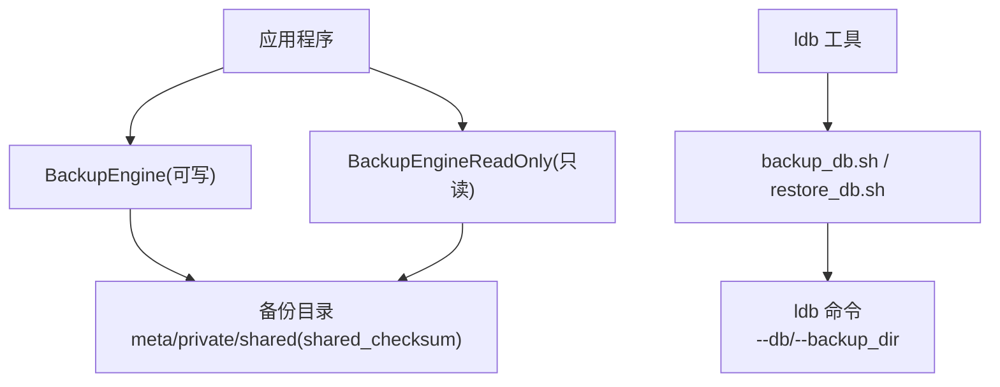
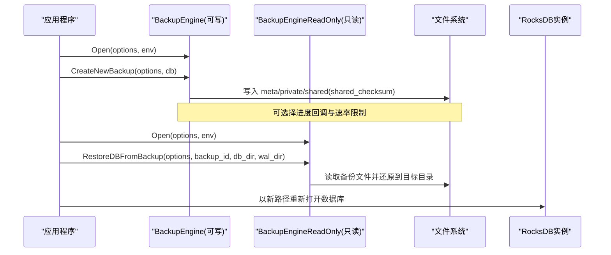
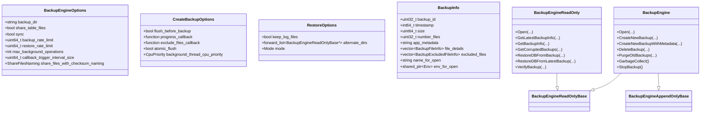
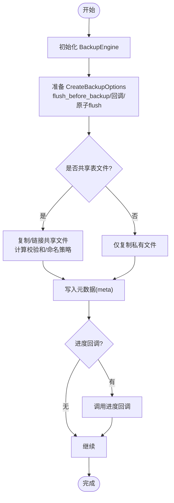
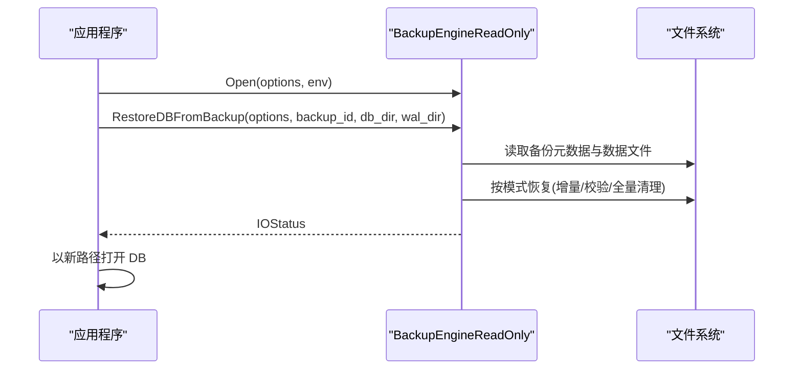

# 备份工具

<cite>
**本文引用的文件**   
- [backup_engine.h](file://source/rocksdb/include/rocksdb/utilities/backup_engine.h)
- [backup_engine.cc](file://source/rocksdb/utilities/backup/backup_engine.cc)
- [rocksdb_backup_restore_example.cc](file://source/rocksdb/examples/rocksdb_backup_restore_example.cc)
- [backup_db.sh](file://source/rocksdb/tools/backup_db.sh)
- [restore_db.sh](file://source/rocksdb/tools/restore_db.sh)
- [ldb.cc](file://source/rocksdb/tools/ldb.cc)
</cite>

## 目录
1. [简介](#简介)
2. [项目结构](#项目结构)
3. [核心组件](#核心组件)
4. [架构总览](#架构总览)
5. [详细组件分析](#详细组件分析)
6. [依赖关系分析](#依赖关系分析)
7. [性能考虑与调优建议](#性能考虑与调优建议)
8. [故障排查指南](#故障排查指南)
9. [结论](#结论)
10. [附录：命令行使用与示例](#附录命令行使用与示例)

## 简介
本指南面向需要在应用或运维流程中集成 RocksDB 备份能力的工程师，系统说明 Backup API 的编程接口（初始化、创建备份、删除备份、恢复等），并给出命令行工具的使用方法与参数说明。文档同时覆盖异步与同步备份的差异与选择建议、错误处理与异常场景、备份状态监控与日志查看方法，以及性能调优与最佳实践。

## 项目结构
RocksDB 的备份能力位于 utilities/backup 模块，对外暴露 C++ 头文件 backup_engine.h；实现位于 backup_engine.cc；示例程序在 examples/rocksdb_backup_restore_example.cc；命令行入口由 ldb 工具提供，并通过 tools 下的 shell 脚本封装常用操作。

图表来源 
- [backup_engine.h:1-755](file://source/rocksdb/include/rocksdb/utilities/backup_engine.h#L1-L755)
- [backup_engine.cc:1-200](file://source/rocksdb/utilities/backup/backup_engine.cc#L1-L200)
- [rocksdb_backup_restore_example.cc:1-99](file://source/rocksdb/examples/rocksdb_backup_restore_example.cc#L1-L99)
- [backup_db.sh:1-16](file://source/rocksdb/tools/backup_db.sh#L1-L16)
- [restore_db.sh:1-16](file://source/rocksdb/tools/restore_db.sh#L1-L16)
- [ldb.cc:1-13](file://source/rocksdb/tools/ldb.cc#L1-L13)

章节来源
- [backup_engine.h:1-755](file://source/rocksdb/include/rocksdb/utilities/backup_engine.h#L1-L755)
- [backup_engine.cc:1-200](file://source/rocksdb/utilities/backup/backup_engine.cc#L1-L200)
- [rocksdb_backup_restore_example.cc:1-99](file://source/rocksdb/examples/rocksdb_backup_restore_example.cc#L1-L99)
- [backup_db.sh:1-16](file://source/rocksdb/tools/backup_db.sh#L1-L16)
- [restore_db.sh:1-16](file://source/rocksdb/tools/restore_db.sh#L1-L16)
- [ldb.cc:1-13](file://source/rocksdb/tools/ldb.cc#L1-L13)

## 核心组件
- BackupEngineOptions：配置备份目录、是否共享表文件、速率限制、后台线程数、回调触发间隔、校验和命名策略等。
- CreateBackupOptions：控制是否先 flush、进度回调、排除文件回调、后台线程 CPU 优先级、原子 flush 等。
- RestoreOptions：恢复模式（增量/校验/全量清理）、是否保留 WAL、备用目录列表等。
- BackupInfo：备份元数据（ID、时间戳、大小、文件数、应用元数据、可选的文件详情与只读打开所需 Env）。
- BackupEngine：可写引擎，支持 Open、CreateNewBackup/CreateNewBackupWithMetadata、DeleteBackup、PurgeOldBackups、GarbageCollect、StopBackup 等。
- BackupEngineReadOnly：只读引擎，支持 GetLatestBackupInfo/GetBackupInfo/GetCorruptedBackups、RestoreDBFromBackup/RestoreDBFromLatestBackup、VerifyBackup 等。

章节来源
- [backup_engine.h:34-265](file://source/rocksdb/include/rocksdb/utilities/backup_engine.h#L34-L265)
- [backup_engine.h:308-358](file://source/rocksdb/include/rocksdb/utilities/backup_engine.h#L308-L358)
- [backup_engine.h:360-413](file://source/rocksdb/include/rocksdb/utilities/backup_engine.h#L360-L413)
- [backup_engine.h:419-472](file://source/rocksdb/include/rocksdb/utilities/backup_engine.h#L419-L472)
- [backup_engine.h:712-737](file://source/rocksdb/include/rocksdb/utilities/backup_engine.h#L712-L737)
- [backup_engine.h:741-752](file://source/rocksdb/include/rocksdb/utilities/backup_engine.h#L741-L752)

## 架构总览
下图展示典型备份与恢复流程中的对象交互与数据流向。

图表来源 
- [backup_engine.h:712-737](file://source/rocksdb/include/rocksdb/utilities/backup_engine.h#L712-L737)
- [backup_engine.h:741-752](file://source/rocksdb/include/rocksdb/utilities/backup_engine.h#L741-L752)
- [backup_engine.cc:1-200](file://source/rocksdb/utilities/backup/backup_engine.cc#L1-L200)

## 详细组件分析

### 编程接口与生命周期
- 初始化
  - 可写引擎：Open(options, env, &engine_ptr)
  - 只读引擎：Open(options, env, &engine_ptr)
- 创建备份
  - CreateNewBackup(options, db, &new_backup_id)
  - CreateNewBackupWithMetadata(options, db, app_metadata, &new_backup_id)
- 删除与清理
  - DeleteBackup(backup_id)
  - PurgeOldBackups(num_backups_to_keep)
  - GarbageCollect()
- 停止备份
  - StopBackup()（单向操作，后续创建将返回 Incomplete）
- 查询与验证
  - GetLatestBackupInfo/GetBackupInfo/GetBackupInfo(vector)
  - GetCorruptedBackups()
  - VerifyBackup(backup_id, verify_with_checksum)
- 恢复
  - RestoreDBFromBackup(options, backup_id, db_dir, wal_dir)
  - RestoreDBFromLatestBackup(options, db_dir, wal_dir)

章节来源
- [backup_engine.h:712-737](file://source/rocksdb/include/rocksdb/utilities/backup_engine.h#L712-L737)
- [backup_engine.h:741-752](file://source/rocksdb/include/rocksdb/utilities/backup_engine.h#L741-L752)
- [backup_engine.h:504-582](file://source/rocksdb/include/rocksdb/utilities/backup_engine.h#L504-L582)
- [backup_engine.h:587-660](file://source/rocksdb/include/rocksdb/utilities/backup_engine.h#L587-L660)

### 关键数据结构与语义
- BackupEngineOptions
  - 关键字段：backup_dir、share_table_files、sync、backup_rate_limit/restore_rate_limit、max_background_operations、callback_trigger_interval_size、share_files_with_checksum_naming 等。
  - 影响点：I/O 缓冲、限速、并发拷贝与校验、共享文件命名策略、是否包含日志文件等。
- CreateBackupOptions
  - 关键字段：flush_before_backup、progress_callback、exclude_files_callback、decrease_background_thread_cpu_priority/background_thread_cpu_priority、atomic_flush。
  - 影响点：一致性保障（WAL 或原子 flush）、进度上报、选择性排除共享文件、后台线程优先级。
- RestoreOptions
  - 关键字段：keep_log_files、alternate_dirs、mode(kKeepLatestDbSessionIdFiles/kVerifyChecksum/kPurgeAllFiles)。
  - 影响点：增量恢复、校验恢复、全量清理恢复、WAL 保留策略、跨目录文件补齐。
- BackupInfo
  - 关键字段：backup_id、timestamp、size、number_files、app_metadata、file_details、excluded_files、name_for_open、env_for_open。
  - 用途：审计、统计、只读打开、文件级细节检查。

章节来源
- [backup_engine.h:34-265](file://source/rocksdb/include/rocksdb/utilities/backup_engine.h#L34-L265)
- [backup_engine.h:308-358](file://source/rocksdb/include/rocksdb/utilities/backup_engine.h#L308-L358)
- [backup_engine.h:360-413](file://source/rocksdb/include/rocksdb/utilities/backup_engine.h#L360-L413)
- [backup_engine.h:419-472](file://source/rocksdb/include/rocksdb/utilities/backup_engine.h#L419-L472)

### 类关系图（代码级）

图表来源 
- [backup_engine.h:34-265](file://source/rocksdb/include/rocksdb/utilities/backup_engine.h#L34-L265)
- [backup_engine.h:308-358](file://source/rocksdb/include/rocksdb/utilities/backup_engine.h#L308-L358)
- [backup_engine.h:360-413](file://source/rocksdb/include/rocksdb/utilities/backup_engine.h#L360-L413)
- [backup_engine.h:419-472](file://source/rocksdb/include/rocksdb/utilities/backup_engine.h#L419-L472)
- [backup_engine.h:712-737](file://source/rocksdb/include/rocksdb/utilities/backup_engine.h#L712-L737)
- [backup_engine.h:741-752](file://source/rocksdb/include/rocksdb/utilities/backup_engine.h#L741-L752)

### 备份创建流程图（算法视角）

图表来源 
- [backup_engine.cc:1-200](file://source/rocksdb/utilities/backup/backup_engine.cc#L1-L200)
- [backup_engine.h:308-358](file://source/rocksdb/include/rocksdb/utilities/backup_engine.h#L308-L358)

### 恢复流程时序（API 调用链）

图表来源 
- [backup_engine.h:504-582](file://source/rocksdb/include/rocksdb/utilities/backup_engine.h#L504-L582)
- [backup_engine.cc:1-200](file://source/rocksdb/utilities/backup/backup_engine.cc#L1-L200)

### 示例程序要点
- 打开 DB 并写入数据
- 通过 BackupEngine::Open 初始化可写引擎并创建备份
- 通过 BackupEngineReadOnly::Open 打开只读引擎并执行恢复
- 再次打开 DB 验证数据一致性

章节来源
- [rocksdb_backup_restore_example.cc:1-99](file://source/rocksdb/examples/rocksdb_backup_restore_example.cc#L1-L99)

## 依赖关系分析
- 头文件依赖
  - backup_engine.h 依赖 rocksdb/env.h、options.h、status.h、metadata.h、io_status.h 等基础类型与状态。
- 实现依赖
  - backup_engine.cc 依赖 logging、rate_limiter、filesystem、filename、sequence_file_reader、writable_file_writer 等 I/O 与工具库。
- 外部工具
  - ldb 工具作为命令行入口，shell 脚本封装了常用的 backup/restore 命令。

章节来源
- [backup_engine.h:1-33](file://source/rocksdb/include/rocksdb/utilities/backup_engine.h#L1-L33)
- [backup_engine.cc:1-55](file://source/rocksdb/utilities/backup/backup_engine.cc#L1-L55)
- [ldb.cc:1-13](file://source/rocksdb/tools/ldb.cc#L1-L13)
- [backup_db.sh:1-16](file://source/rocksdb/tools/backup_db.sh#L1-L16)
- [restore_db.sh:1-16](file://source/rocksdb/tools/restore_db.sh#L1-L16)

## 性能考虑与调优建议
- 并发与吞吐
  - 通过 max_background_operations 控制拷贝与校验的并发度；根据磁盘与 CPU 能力调整。
  - 使用 backup_rate_limit/restore_rate_limit 或 RateLimiter 限制 I/O 带宽，避免影响业务。
- 一致性与时延
  - sync=true 保证崩溃一致性但降低速度；sync=false 提升性能但需接受更弱的一致性保证。
  - flush_before_backup 或 atomic_flush 确保跨列族一致性，代价是额外刷盘开销。
- 存储效率
  - share_table_files=true 启用增量与共享文件，显著节省空间；配合 share_files_with_checksum_naming 提高唯一性与兼容性。
  - io_buffer_size 可按后端存储特性优化拷贝缓冲。
- 回调与监控
  - 设置 callback_trigger_interval_size 与 progress_callback 获取进度；结合 info_log 输出关键信息。
- 恢复模式
  - kKeepLatestDbSessionIdFiles 高效且能容忍部分缺失；kVerifyChecksum 适合怀疑损坏时精准替换；kPurgeAllFiles 最保守但最慢。

章节来源
- [backup_engine.h:34-265](file://source/rocksdb/include/rocksdb/utilities/backup_engine.h#L34-L265)
- [backup_engine.h:308-358](file://source/rocksdb/include/rocksdb/utilities/backup_engine.h#L308-L358)
- [backup_engine.h:360-413](file://source/rocksdb/include/rocksdb/utilities/backup_engine.h#L360-L413)
- [backup_engine.cc:107-126](file://source/rocksdb/utilities/backup/backup_engine.cc#L107-L126)

## 故障排查指南
- 常见错误与状态
  - Status::Aborted：回调抛出异常导致操作中止。
  - Status::Incomplete：StopBackup 后继续创建备份会返回该状态。
  - NotFound/Corruption：备份 ID 不存在或备份损坏。
- 诊断步骤
  - 使用 VerifyBackup(backup_id, verify_with_checksum=true) 进行强校验。
  - 通过 GetCorruptedBackups 收集损坏备份 ID 列表。
  - 开启 info_log 并检查备份目录结构（meta/private/shared(shared_checksum)）完整性。
- 恢复策略
  - 优先尝试 kKeepLatestDbSessionIdFiles；若仍失败，切换至 kVerifyChecksum；最后考虑 kPurgeAllFiles。
  - 对于 exclude_files_callback 创建的备份，使用 alternate_dirs 指定包含被排除文件的目录。

章节来源
- [backup_engine.h:504-582](file://source/rocksdb/include/rocksdb/utilities/backup_engine.h#L504-L582)
- [backup_engine.h:587-660](file://source/rocksdb/include/rocksdb/utilities/backup_engine.h#L587-L660)
- [backup_engine.cc:107-126](file://source/rocksdb/utilities/backup/backup_engine.cc#L107-L126)

## 结论
RocksDB Backup API 提供了完善的备份与恢复能力，涵盖一致性、增量共享、限速、回调、校验与多种恢复模式。通过合理配置 BackupEngineOptions/CreateBackupOptions/RestoreOptions，可在性能与可靠性之间取得平衡。结合 ldb 工具与 shell 脚本，可实现从开发到运维的全链路备份方案。

## 附录：命令行使用与示例
- 备份脚本
  - 用法：backup_db.sh <DB Path> <Backup Dir>
  - 内部调用：./ldb backup --db=<DB Path> --backup_dir=<Backup Dir>
- 恢复脚本
  - 用法：restore_db.sh <Backup Dir> <DB Path>
  - 内部调用：./ldb restore --db=<DB Path> --backup_dir=<Backup Dir>
- 示例程序
  - 参考 rocksdb_backup_restore_example.cc，演示完整生命周期：打开 DB、写入、创建备份、只读恢复、验证数据。

章节来源
- [backup_db.sh:1-16](file://source/rocksdb/tools/backup_db.sh#L1-L16)
- [restore_db.sh:1-16](file://source/rocksdb/tools/restore_db.sh#L1-L16)
- [ldb.cc:1-13](file://source/rocksdb/tools/ldb.cc#L1-L13)
- [rocksdb_backup_restore_example.cc:1-99](file://source/rocksdb/examples/rocksdb_backup_restore_example.cc#L1-L99)