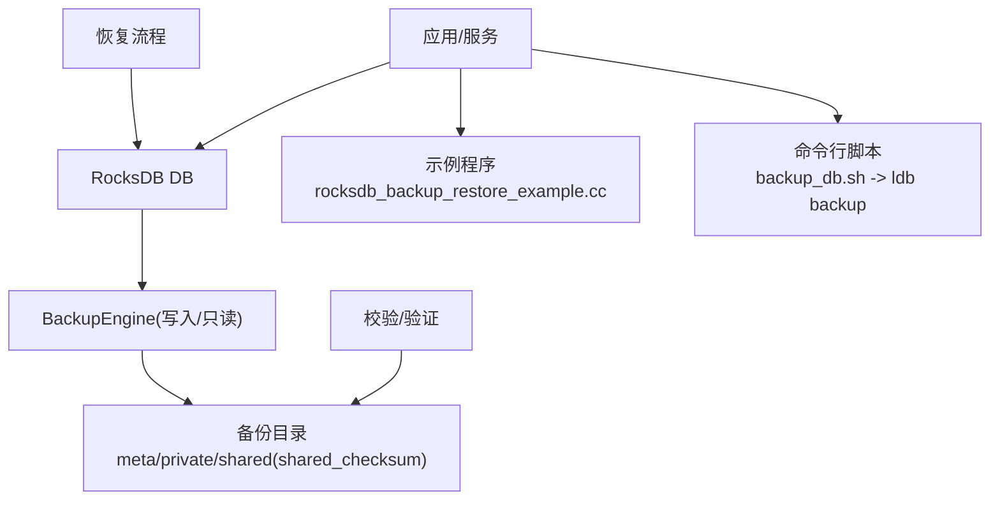
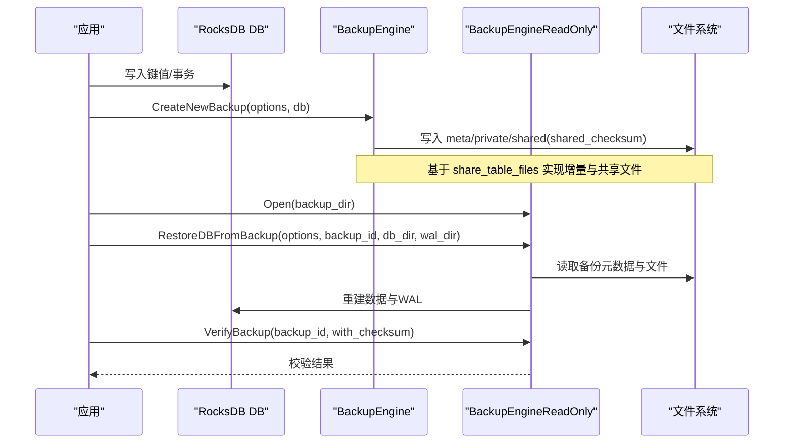
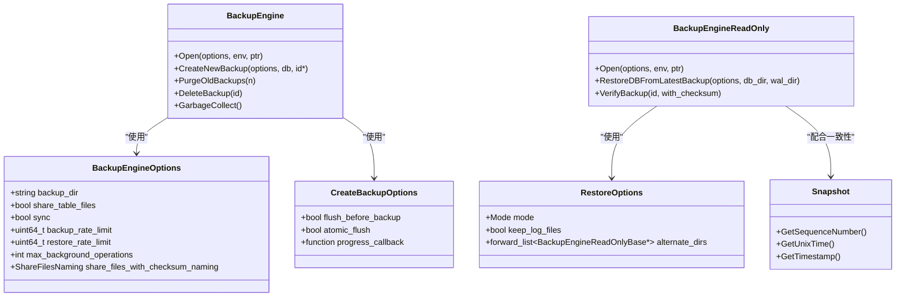
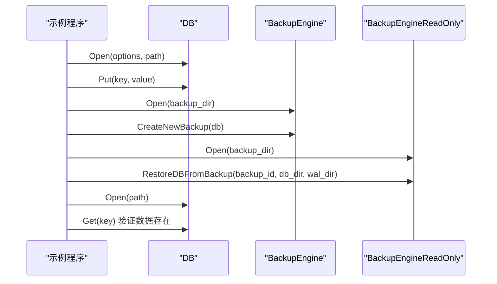
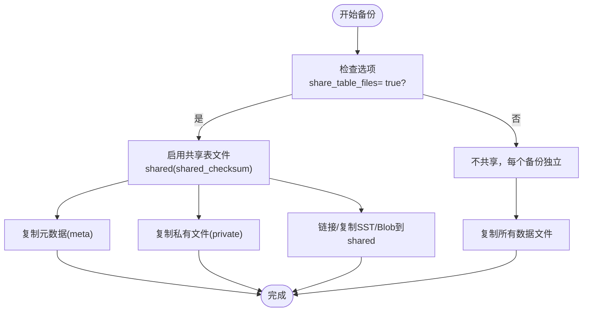
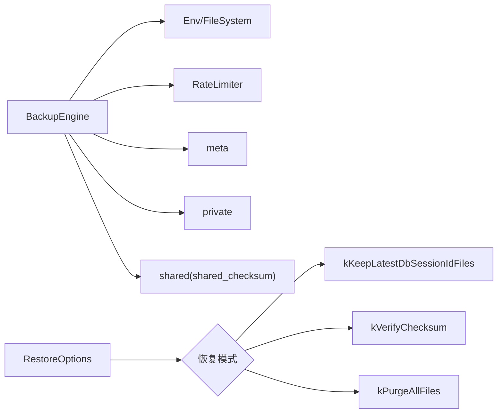

# 备份恢复

<cite>
**本文引用的文件**   
- [backup_engine.h](file://source/rocksdb/include/rocksdb/utilities/backup_engine.h)
- [backup_engine.cc](file://source/rocksdb/utilities/backup/backup_engine.cc)
- [rocksdb_backup_restore_example.cc](file://source/rocksdb/examples/rocksdb_backup_restore_example.cc)
- [snapshot.h](file://source/rocksdb/include/rocksdb/snapshot.h)
- [backup_db.sh](file://source/rocksdb/tools/backup_db.sh)
</cite>

## 目录
1. [简介](#简介)
2. [项目结构](#项目结构)
3. [核心组件](#核心组件)
4. [架构总览](#架构总览)
5. [详细组件分析](#详细组件分析)
6. [依赖关系分析](#依赖关系分析)
7. [性能考量](#性能考量)
8. [故障排查指南](#故障排查指南)
9. [结论](#结论)
10. [附录](#附录)

## 简介
本指南面向使用 RocksDB 的备份与恢复实践，覆盖策略选择（全量、增量、实时）、API 与命令行工具用法、恢复流程与一致性保证、灾难恢复计划与业务连续性保障、数据验证与完整性检查、跨平台迁移与同步、自动化脚本与调度配置、存储最佳实践与安全考虑等。文档以 RocksDB Backup Engine API 为核心，结合示例与工具脚本，提供从入门到生产落地的完整操作手册。

## 项目结构
围绕备份恢复的关键代码与资源分布如下：
- 备份引擎接口与选项定义：include/rocksdb/utilities/backup_engine.h
- 备份引擎实现：utilities/backup/backup_engine.cc
- 示例程序：examples/rocksdb_backup_restore_example.cc
- 快照接口：include/rocksdb/snapshot.h
- 命令行备份脚本：tools/backup_db.sh

图表来源 
- [backup_engine.h:34-265](file://source/rocksdb/include/rocksdb/utilities/backup_engine.h#L34-L265)
- [backup_engine.cc:77-86](file://source/rocksdb/utilities/backup/backup_engine.cc#L77-L86)
- [rocksdb_backup_restore_example.cc:32-98](file://source/rocksdb/examples/rocksdb_backup_restore_example.cc#L32-L98)
- [backup_db.sh:6-16](file://source/rocksdb/tools/backup_db.sh#L6-L16)

章节来源
- [backup_engine.h:34-265](file://source/rocksdb/include/rocksdb/utilities/backup_engine.h#L34-L265)
- [backup_engine.cc:77-86](file://source/rocksdb/utilities/backup/backup_engine.cc#L77-L86)
- [rocksdb_backup_restore_example.cc:32-98](file://source/rocksdb/examples/rocksdb_backup_restore_example.cc#L32-L98)
- [backup_db.sh:6-16](file://source/rocksdb/tools/backup_db.sh#L6-L16)

## 核心组件
- BackupEngineOptions：备份参数配置，包括备份目录、是否共享表文件（增量基础）、是否同步落盘、速率限制、后台线程数、命名策略等。
- CreateBackupOptions：创建备份时的行为控制，如是否先 flush、进度回调、原子 flush、后台线程优先级等。
- RestoreOptions：恢复模式（保留最新会话文件、校验和验证、全量清理）、是否保留 WAL、备用目录等。
- BackupEngine / BackupEngineReadOnly：备份与恢复的主入口，支持创建备份、删除/清理、查询信息、恢复、校验等。
- Snapshot：数据库快照抽象，用于一致性读取与辅助一致性策略设计。

章节来源
- [backup_engine.h:34-265](file://source/rocksdb/include/rocksdb/utilities/backup_engine.h#L34-L265)
- [backup_engine.h:308-358](file://source/rocksdb/include/rocksdb/utilities/backup_engine.h#L308-L358)
- [backup_engine.h:360-413](file://source/rocksdb/include/rocksdb/utilities/backup_engine.h#L360-L413)
- [backup_engine.h:712-737](file://source/rocksdb/include/rocksdb/utilities/backup_engine.h#L712-L737)
- [backup_engine.h:741-752](file://source/rocksdb/include/rocksdb/utilities/backup_engine.h#L741-L752)
- [snapshot.h:14-53](file://source/rocksdb/include/rocksdb/snapshot.h#L14-L53)

## 架构总览
下图展示备份与恢复的整体交互：应用通过 DB 进行读写；BackupEngine 负责将数据状态持久化为可恢复的备份集；只读备份引擎用于恢复与校验；命令行工具与脚本作为外部触发点。

图表来源 
- [backup_engine.h:612-625](file://source/rocksdb/include/rocksdb/utilities/backup_engine.h#L612-L625)
- [backup_engine.h:538-560](file://source/rocksdb/include/rocksdb/utilities/backup_engine.h#L538-L560)
- [backup_engine.h:577-578](file://source/rocksdb/include/rocksdb/utilities/backup_engine.h#L577-L578)
- [backup_engine.cc:77-86](file://source/rocksdb/utilities/backup/backup_engine.cc#L77-L86)

## 详细组件分析

### 备份引擎类图

图表来源 
- [backup_engine.h:34-265](file://source/rocksdb/include/rocksdb/utilities/backup_engine.h#L34-L265)
- [backup_engine.h:308-358](file://source/rocksdb/include/rocksdb/utilities/backup_engine.h#L308-L358)
- [backup_engine.h:360-413](file://source/rocksdb/include/rocksdb/utilities/backup_engine.h#L360-L413)
- [backup_engine.h:712-737](file://source/rocksdb/include/rocksdb/utilities/backup_engine.h#L712-L737)
- [backup_engine.h:741-752](file://source/rocksdb/include/rocksdb/utilities/backup_engine.h#L741-L752)
- [snapshot.h:14-53](file://source/rocksdb/include/rocksdb/snapshot.h#L14-L53)

章节来源
- [backup_engine.h:34-265](file://source/rocksdb/include/rocksdb/utilities/backup_engine.h#L34-L265)
- [backup_engine.h:308-358](file://source/rocksdb/include/rocksdb/utilities/backup_engine.h#L308-L358)
- [backup_engine.h:360-413](file://source/rocksdb/include/rocksdb/utilities/backup_engine.h#L360-L413)
- [backup_engine.h:712-737](file://source/rocksdb/include/rocksdb/utilities/backup_engine.h#L712-L737)
- [backup_engine.h:741-752](file://source/rocksdb/include/rocksdb/utilities/backup_engine.h#L741-L752)
- [snapshot.h:14-53](file://source/rocksdb/include/rocksdb/snapshot.h#L14-L53)

### 备份与恢复序列图（示例）

图表来源 
- [rocksdb_backup_restore_example.cc:32-98](file://source/rocksdb/examples/rocksdb_backup_restore_example.cc#L32-L98)
- [backup_engine.h:612-625](file://source/rocksdb/include/rocksdb/utilities/backup_engine.h#L612-L625)
- [backup_engine.h:538-560](file://source/rocksdb/include/rocksdb/utilities/backup_engine.h#L538-L560)

章节来源
- [rocksdb_backup_restore_example.cc:32-98](file://source/rocksdb/examples/rocksdb_backup_restore_example.cc#L32-L98)

### 备份目录结构与增量机制流程图

图表来源 
- [backup_engine.cc:77-86](file://source/rocksdb/utilities/backup/backup_engine.cc#L77-L86)
- [backup_engine.h:46-55](file://source/rocksdb/include/rocksdb/utilities/backup_engine.h#L46-L55)

章节来源
- [backup_engine.cc:77-86](file://source/rocksdb/utilities/backup/backup_engine.cc#L77-L86)
- [backup_engine.h:46-55](file://source/rocksdb/include/rocksdb/utilities/backup_engine.h#L46-L55)

### 命令行备份脚本
- 脚本功能：接收 DB 路径与备份目录，调用 ldb 工具的 backup 子命令执行备份。
- 适用场景：快速集成到系统级任务或 CI/CD 流水线中。

章节来源
- [backup_db.sh:6-16](file://source/rocksdb/tools/backup_db.sh#L6-L16)

## 依赖关系分析
- BackupEngine 依赖 Env/FileSystem 进行 I/O，依赖 RateLimiter 控制备份/恢复带宽。
- 备份目录组织包含 meta、private、shared、shared_checksum 四个逻辑目录，支撑增量与共享文件命名策略。
- 恢复过程依赖备份元数据与文件集合，可选择不同恢复模式（保留最新会话文件、校验和验证、全量清理）。

图表来源 
- [backup_engine.cc:77-86](file://source/rocksdb/utilities/backup/backup_engine.cc#L77-L86)
- [backup_engine.h:360-413](file://source/rocksdb/include/rocksdb/utilities/backup_engine.h#L360-L413)

章节来源
- [backup_engine.cc:77-86](file://source/rocksdb/utilities/backup/backup_engine.cc#L77-L86)
- [backup_engine.h:360-413](file://source/rocksdb/include/rocksdb/utilities/backup_engine.h#L360-L413)

## 性能考量
- 增量备份：开启 share_table_files 后，仅复制新增/变更的文件，显著降低 I/O 与存储空间占用。
- 并发与限速：通过 max_background_operations 控制拷贝与校验的并发度；使用 backup_rate_limit/restore_rate_limit 或 RateLimiter 限制带宽。
- 同步与一致性：sync=true 确保崩溃恢复一致性，但会牺牲部分吞吐；根据业务容忍度权衡。
- 原子 flush：atomic_flush 在多列族场景下可避免依赖 WAL 获得跨 CF 一致性。
- 命名策略：share_files_with_checksum_naming 影响共享文件的唯一性与重算开销，推荐默认策略。

章节来源
- [backup_engine.h:46-55](file://source/rocksdb/include/rocksdb/utilities/backup_engine.h#L46-L55)
- [backup_engine.h:89-113](file://source/rocksdb/include/rocksdb/utilities/backup_engine.h#L89-L113)
- [backup_engine.h:129-132](file://source/rocksdb/include/rocksdb/utilities/backup_engine.h#L129-L132)
- [backup_engine.h:154-216](file://source/rocksdb/include/rocksdb/utilities/backup_engine.h#L154-L216)
- [backup_engine.h:350-357](file://source/rocksdb/include/rocksdb/utilities/backup_engine.h#L350-L357)

## 故障排查指南
- 备份失败：检查备份目录权限、磁盘空间、RateLimiter 配置；确认未与其他进程同时写入同一备份目录。
- 恢复不一致：优先使用 kVerifyChecksum 模式定位损坏文件；必要时采用 kPurgeAllFiles 彻底重建。
- 校验失败：使用 VerifyBackup(backup_id, verify_with_checksum=true) 进行强校验；关注 shared_checksum 目录中的文件。
- 并发干扰：避免多个 BackupEngine 实例对同一备份目录进行写操作；遵循文档中的并发语义。
- 日志与统计：启用 info_log 并查看 BackupStatistics 输出，定位成功/失败次数。

章节来源
- [backup_engine.h:577-578](file://source/rocksdb/include/rocksdb/utilities/backup_engine.h#L577-L578)
- [backup_engine.h:474-499](file://source/rocksdb/include/rocksdb/utilities/backup_engine.h#L474-L499)
- [backup_engine.cc:107-126](file://source/rocksdb/utilities/backup/backup_engine.cc#L107-L126)

## 结论
RocksDB Backup Engine 提供了完善的全量与增量备份能力，结合合理的选项配置与恢复模式，可满足高一致性与高性能的生产需求。建议在生产环境采用“定期全量 + 频繁增量”的策略，辅以严格的校验与异地容灾，确保数据安全与业务连续性。

## 附录

### 备份策略选择
- 全量备份：适用于首次初始化或周期性归档，恢复速度快，存储成本高。
- 增量备份：基于 share_table_files，仅复制差异文件，适合高频更新场景。
- 实时备份：结合 WAL 与原子 flush，在关闭 WAL 备份时仍可获得一致性；或通过流式导出与 CDC 方案实现近实时。

章节来源
- [backup_engine.h:46-55](file://source/rocksdb/include/rocksdb/utilities/backup_engine.h#L46-L55)
- [backup_engine.h:350-357](file://source/rocksdb/include/rocksdb/utilities/backup_engine.h#L350-L357)

### 工具使用方法
- API：参考示例程序，演示打开 DB、创建备份、只读恢复与校验。
- 命令行：使用 tools/backup_db.sh 调用 ldb backup，传入 DB 路径与备份目录。

章节来源
- [rocksdb_backup_restore_example.cc:32-98](file://source/rocksdb/examples/rocksdb_backup_restore_example.cc#L32-L98)
- [backup_db.sh:6-16](file://source/rocksdb/tools/backup_db.sh#L6-L16)

### 恢复流程与一致性保证
- 恢复步骤：打开只读备份引擎 -> 指定备份 ID -> 恢复至目标 DB/WAL 目录 -> 重新打开 DB 验证。
- 一致性：通过 sync、atomic_flush、校验模式与快照配合，确保恢复点一致且可重现。

章节来源
- [rocksdb_backup_restore_example.cc:71-92](file://source/rocksdb/examples/rocksdb_backup_restore_example.cc#L71-L92)
- [backup_engine.h:538-560](file://source/rocksdb/include/rocksdb/utilities/backup_engine.h#L538-L560)
- [snapshot.h:14-53](file://source/rocksdb/include/rocksdb/snapshot.h#L14-L53)

### 灾难恢复计划与业务连续性
- 多副本与异地容灾：将备份目录复制到远端存储，定期演练恢复。
- RPO/RTO 规划：依据业务 SLA 设定备份频率与恢复时间目标。
- 回滚与灰度：利用多版本备份进行安全回滚与灰度发布。

[本节为概念性内容，不直接分析具体文件]

### 备份数据验证与完整性检查
- 使用 VerifyBackup 进行存在性与大小校验，或启用 checksum 强校验。
- 结合 kVerifyChecksum 恢复模式自动比对并替换损坏文件。

章节来源
- [backup_engine.h:577-578](file://source/rocksdb/include/rocksdb/utilities/backup_engine.h#L577-L578)
- [backup_engine.h:380-392](file://source/rocksdb/include/rocksdb/utilities/backup_engine.h#L380-L392)

### 跨平台迁移与数据同步
- 跨平台：保持 schema_version 兼容，统一命名策略，确保 shared_checksum 文件可被目标环境识别。
- 数据同步：通过增量备份与 alternate_dirs 机制，结合远程备份目录实现跨站点同步。

章节来源
- [backup_engine.h:218-232](file://source/rocksdb/include/rocksdb/utilities/backup_engine.h#L218-L232)
- [backup_engine.h:401-404](file://source/rocksdb/include/rocksdb/utilities/backup_engine.h#L401-L404)

### 自动化备份脚本与调度配置
- 脚本：使用 backup_db.sh 封装 ldb backup 调用，便于 cron/systemd 定时任务触发。
- 调度：结合系统调度器设置周期任务，记录日志与告警。

章节来源
- [backup_db.sh:6-16](file://source/rocksdb/tools/backup_db.sh#L6-L16)

### 备份存储最佳实践与安全考虑
- 存储位置：备份目录应与 DB 目录分离，建议使用独立磁盘或对象存储。
- 访问控制：严格限制备份目录权限，最小化访问主体。
- 加密与传输安全：在传输层启用 TLS，静态数据启用加密（由上层存储提供）。
- 生命周期管理：定期清理旧备份，保留足够数量的历史版本。

[本节为通用指导，不直接分析具体文件]