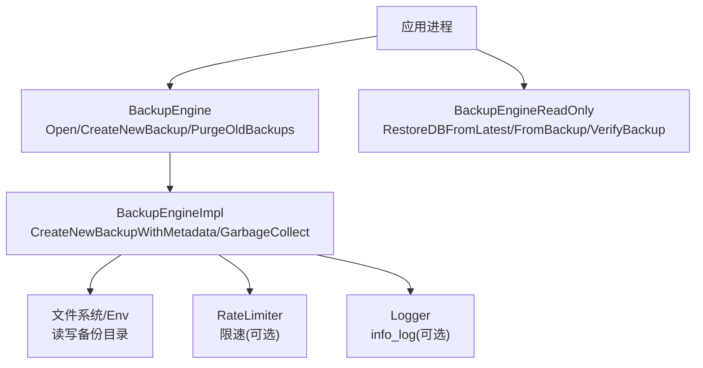
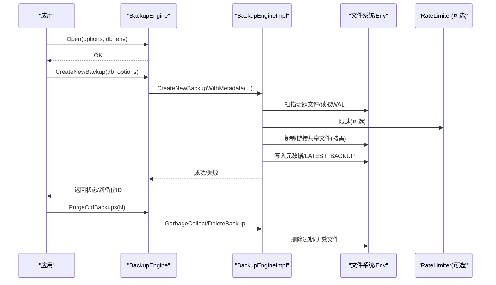
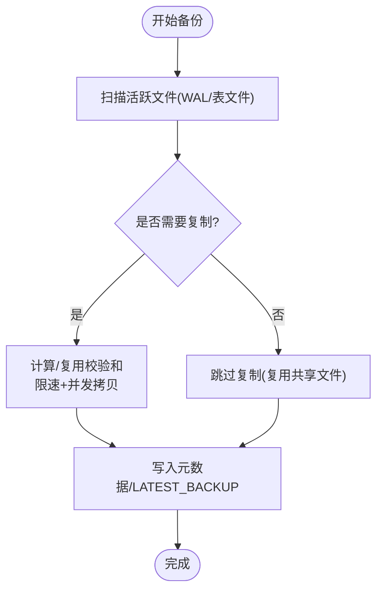
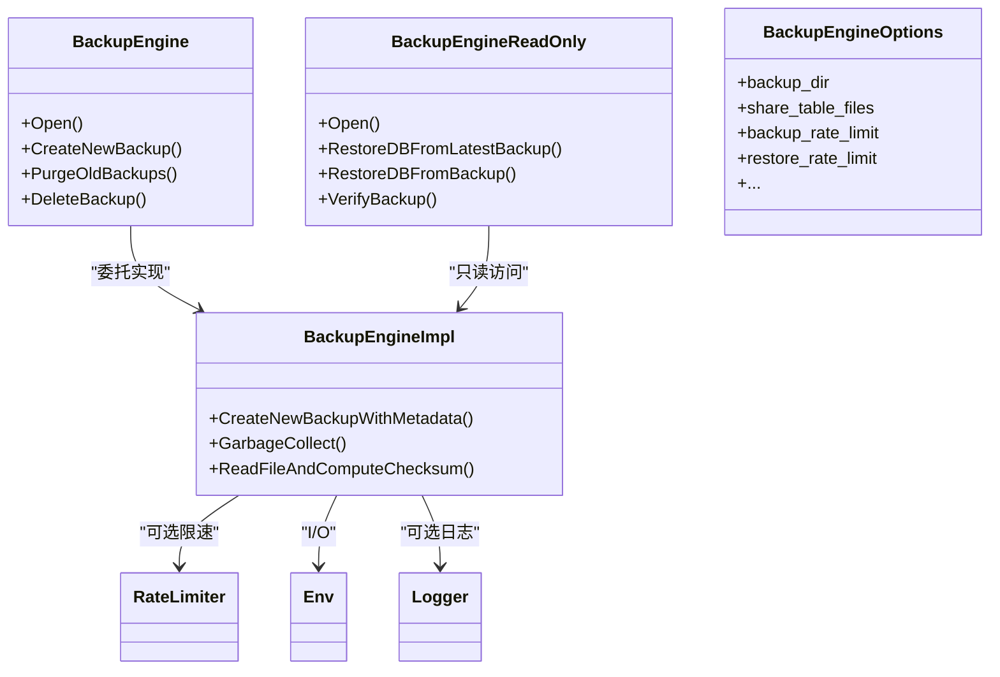

# 备份策略

<cite>
**本文引用的文件**   
- [backup_engine.h](file://source/rocksdb/include/rocksdb/utilities/backup_engine.h)
- [backup_engine.cc](file://source/rocksdb/utilities/backup/backup_engine.cc)
- [backup_engine_impl.h](file://source/rocksdb/utilities/backup/backup_engine_impl.h)
- [rocksdb_backup_restore_example.cc](file://source/rocksdb/examples/rocksdb_backup_restore_example.cc)
- [how-to-backup-rocksdb.markdown](file://source/rocksdb/docs/_posts/2014-03-27-how-to-backup-rocksdb.markdown)
</cite>

## 目录
1. [简介](#简介)
2. [项目结构](#项目结构)
3. [核心组件](#核心组件)
4. [架构总览](#架构总览)
5. [详细组件分析](#详细组件分析)
6. [依赖关系分析](#依赖关系分析)
7. [性能考量](#性能考量)
8. [故障排查指南](#故障排查指南)
9. [结论](#结论)
10. [附录](#附录)

## 简介
本文件面向 RocksDB 的备份子系统，系统化阐述全量备份、增量备份与“实时”（近似）备份的实现原理与适用场景；详解 BackupEngine 的配置选项（备份频率、保留策略、存储空间管理）、不同策略的性能影响与资源消耗；提供基于数据量、更新频率、RPO/RTO 等指标的备份策略选择决策指南；并说明备份压缩、加密与安全配置选项、备份链管理与版本控制机制。内容严格依据仓库中的头文件、实现与示例文档进行归纳与解读。

## 项目结构
与备份相关的关键代码位于 utilities/backup 与 include/rocksdb/utilities 下，示例与博客文档提供了使用方式与内部机制概览：
- 接口定义：include/rocksdb/utilities/backup_engine.h
- 实现逻辑：utilities/backup/backup_engine.cc
- 测试/实验辅助：utilities/backup/backup_engine_impl.h
- 示例程序：examples/rocksdb_backup_restore_example.cc
- 官方博客：docs/_posts/2014-03-27-how-to-backup-rocksdb.markdown

图示来源 
- [backup_engine.h:34-265](file://source/rocksdb/include/rocksdb/utilities/backup_engine.h#L34-L265)
- [backup_engine.cc:128-176](file://source/rocksdb/utilities/backup/backup_engine.cc#L128-L176)

章节来源
- [backup_engine.h:34-265](file://source/rocksdb/include/rocksdb/utilities/backup_engine.h#L34-L265)
- [backup_engine.cc:128-176](file://source/rocksdb/utilities/backup/backup_engine.cc#L128-L176)
- [rocksdb_backup_restore_example.cc:32-98](file://source/rocksdb/examples/rocksdb_backup_restore_example.cc#L32-L98)
- [how-to-backup-rocksdb.markdown:96-136](file://source/rocksdb/docs/_posts/2014-03-27-how-to-backup-rocksdb.markdown#L96-L136)

## 核心组件
- BackupEngineOptions：备份引擎配置，包含备份目录、是否共享表文件、日志开关、同步策略、I/O缓冲、备份/恢复速率限制、后台线程数、回调间隔、命名策略、schema_version 等。
- CreateBackupOptions：创建备份时的参数，如是否先 flush、进度回调、排除文件回调、后台线程 CPU 优先级、原子 flush 等。
- RestoreOptions：恢复模式（保留最新会话ID文件、校验和验证、清空全部）、是否保留 WAL、备用目录列表等。
- BackupInfo/BackupStatistics：备份元信息（ID、时间戳、大小、文件数、应用元数据、文件详情、被排除文件、只读打开所需 Env 等）与统计。
- BackupEngine / BackupEngineReadOnly：可写与只读两类引擎，分别提供创建备份、清理、删除、恢复、校验等操作。

章节来源
- [backup_engine.h:34-265](file://source/rocksdb/include/rocksdb/utilities/backup_engine.h#L34-L265)
- [backup_engine.h:308-358](file://source/rocksdb/include/rocksdb/utilities/backup_engine.h#L308-L358)
- [backup_engine.h:360-413](file://source/rocksdb/include/rocksdb/utilities/backup_engine.h#L360-L413)
- [backup_engine.h:419-472](file://source/rocksdb/include/rocksdb/utilities/backup_engine.h#L419-L472)
- [backup_engine.h:474-499](file://source/rocksdb/include/rocksdb/utilities/backup_engine.h#L474-L499)
- [backup_engine.h:712-737](file://source/rocksdb/include/rocksdb/utilities/backup_engine.h#L712-L737)
- [backup_engine.h:741-752](file://source/rocksdb/include/rocksdb/utilities/backup_engine.h#L741-L752)

## 架构总览
备份引擎通过“共享文件 + 增量拷贝 + 元数据记录”的方式实现高效备份与恢复。核心流程包括：
- 创建备份：扫描活跃文件，计算/复用校验和，决定是否复制；支持共享 SST/Blob 文件以减少重复存储；必要时复制 WAL；写入元数据与 LATEST_BACKUP 标记。
- 恢复备份：根据模式选择增量恢复或全量覆盖；支持校验和比对与从备用目录补齐缺失文件；可选择保留现有 WAL。
- 清理与保留：按数量或 ID 删除旧备份；GC 清理未完成操作残留与不可用共享文件。

图示来源 
- [backup_engine.cc:2600-2761](file://source/rocksdb/utilities/backup/backup_engine.cc#L2600-L2761)
- [backup_engine.h:712-737](file://source/rocksdb/include/rocksdb/utilities/backup_engine.h#L712-L737)

章节来源
- [how-to-backup-rocksdb.markdown:96-136](file://source/rocksdb/docs/_posts/2014-03-27-how-to-backup-rocksdb.markdown#L96-L136)
- [backup_engine.cc:2600-2761](file://source/rocksdb/utilities/backup/backup_engine.cc#L2600-L2761)

## 详细组件分析

### 全量备份与增量备份
- 全量备份：首次备份会复制所有活跃表文件与必要日志，生成完整元数据。后续备份若启用共享文件，则仅复制新增/变更文件，形成“增量”。
- 增量备份：通过共享目录与校验和/会话ID去重，避免重复拷贝；对未变更文件直接复用已有副本，显著降低 I/O 与空间占用。
- 一致性保证：可通过 flush_before_backup 或 atomic_flush 确保跨列族一致性；WAL 备份开关控制是否包含未落盘日志。

图示来源 
- [backup_engine.cc:2600-2761](file://source/rocksdb/utilities/backup/backup_engine.cc#L2600-L2761)

章节来源
- [how-to-backup-rocksdb.markdown:96-136](file://source/rocksdb/docs/_posts/2014-03-27-how-to-backup-rocksdb.markdown#L96-L136)
- [backup_engine.h:308-358](file://source/rocksdb/include/rocksdb/utilities/backup_engine.h#L308-L358)
- [backup_engine.cc:2600-2761](file://source/rocksdb/utilities/backup/backup_engine.cc#L2600-L2761)

### 实时（近似）备份
- “实时”并非流式持续备份，而是通过高频触发 CreateNewBackup 并结合 WAL 备份与快速增量，达到接近实时的 RPO。
- 关键要点：开启 backup_log_files 以捕获 WAL；合理设置 flush_before_backup/atomic_flush 减少不一致窗口；利用 RateLimiter 控制对在线负载的影响。

章节来源
- [how-to-backup-rocksdb.markdown:73-93](file://source/rocksdb/docs/_posts/2014-03-27-how-to-backup-rocksdb.markdown#L73-L93)
- [backup_engine.h:308-358](file://source/rocksdb/include/rocksdb/utilities/backup_engine.h#L308-L358)

### BackupEngine 配置选项详解
- 备份目录与独立 Env：backup_dir、backup_env
- 共享与去重：share_table_files、share_files_with_checksum、share_files_with_checksum_naming
- 日志与一致性：backup_log_files、sync、flush_before_backup、atomic_flush
- I/O 与并发：io_buffer_size、max_background_operations、callback_trigger_interval_size
- 限速：backup_rate_limit、restore_rate_limit、backup_rate_limiter、restore_rate_limiter
- 元数据与兼容性：schema_version、current_temperatures_override_manifest
- 只读打开限制：max_valid_backups_to_open

章节来源
- [backup_engine.h:34-265](file://source/rocksdb/include/rocksdb/utilities/backup_engine.h#L34-L265)
- [backup_engine.h:308-358](file://source/rocksdb/include/rocksdb/utilities/backup_engine.h#L308-L358)
- [backup_engine.h:360-413](file://source/rocksdb/include/rocksdb/utilities/backup_engine.h#L360-L413)

### 备份链管理与版本控制
- 备份 ID 单调递增，LATEST_BACKUP 指向最新一致备份；崩溃恢复时清理比 LATEST_BACKUP 更新的碎片。
- 共享文件命名策略：支持 legacy CRC32c+size 与基于 DB session_id 的新命名，兼顾兼容性与碰撞安全。
- schema_version 控制元数据格式，向后兼容读取与恢复。

章节来源
- [how-to-backup-rocksdb.markdown:128-136](file://source/rocksdb/docs/_posts/2014-03-27-how-to-backup-rocksdb.markdown#L128-L136)
- [backup_engine.h:150-216](file://source/rocksdb/include/rocksdb/utilities/backup_engine.h#L150-L216)
- [backup_engine.h:218-232](file://source/rocksdb/include/rocksdb/utilities/backup_engine.h#L218-L232)

### 恢复与校验
- 恢复模式：kKeepLatestDbSessionIdFiles（高效增量恢复）、kVerifyChecksum（校验现存文件）、kPurgeAllFiles（零信任全量覆盖）。
- 校验：VerifyBackup 支持按校验和或仅尺寸检查；恢复过程可结合 alternate_dirs 从其他备份目录补齐缺失文件。

章节来源
- [backup_engine.h:360-413](file://source/rocksdb/include/rocksdb/utilities/backup_engine.h#L360-L413)
- [backup_engine.h:577-578](file://source/rocksdb/include/rocksdb/utilities/backup_engine.h#L577-L578)

### 示例用法
- 示例展示了 Open、CreateNewBackup、GetBackupInfo、VerifyBackup、RestoreDBFromBackup 的基本流程。

章节来源
- [rocksdb_backup_restore_example.cc:32-98](file://source/rocksdb/examples/rocksdb_backup_restore_example.cc#L32-L98)

## 依赖关系分析
- BackupEngine 依赖 Env/FileSystem 进行 I/O，可选依赖 RateLimiter 进行限速，可选 Logger 输出 info_log。
- 实现层通过工作队列与后台线程并行拷贝与校验，确保高吞吐与可控延迟。

图示来源 
- [backup_engine.h:712-737](file://source/rocksdb/include/rocksdb/utilities/backup_engine.h#L712-L737)
- [backup_engine.h:741-752](file://source/rocksdb/include/rocksdb/utilities/backup_engine.h#L741-L752)
- [backup_engine.cc:128-176](file://source/rocksdb/utilities/backup/backup_engine.cc#L128-L176)

章节来源
- [backup_engine.h:712-737](file://source/rocksdb/include/rocksdb/utilities/backup_engine.h#L712-L737)
- [backup_engine.cc:128-176](file://source/rocksdb/utilities/backup/backup_engine.cc#L128-L176)

## 性能考量
- 共享文件与去重：开启 share_table_files 与合适的命名策略可显著降低 I/O 与空间占用，提升增量备份速度。
- 并发与限速：max_background_operations 控制拷贝与校验并发；RateLimiter 限制带宽，避免影响在线事务。
- 同步与一致性：sync=true 保障断电一致性但降低吞吐；flush_before_backup/atomic_flush 可减少 WAL 体积与提升一致性。
- 恢复模式：kKeepLatestDbSessionIdFiles 在健康库上最快；kVerifyChecksum 适合局部损坏修复；kPurgeAllFiles 最慢但最彻底。
- 元数据与校验：校验和计算带来额外 CPU 开销，但能检测介质错误与命名冲突风险。

[本节为通用指导，不直接分析具体文件]

## 故障排查指南
- 备份中断或不完整：StopBackup 后需新建 BackupEngine 实例继续；GC 会清理未完成操作的临时文件。
- 校验失败：使用 VerifyBackup 检查备份完整性；必要时切换到 kVerifyChecksum 模式定位损坏文件。
- 恢复缺少文件：通过 RestoreOptions::alternate_dirs 指定其他备份目录补齐缺失文件。
- 空间不足：及时调用 PurgeOldBackups(N) 或 DeleteBackup(id) 释放空间；监控备份目录大小与共享文件引用计数。

章节来源
- [backup_engine.h:627-660](file://source/rocksdb/include/rocksdb/utilities/backup_engine.h#L627-L660)
- [backup_engine.h:360-413](file://source/rocksdb/include/rocksdb/utilities/backup_engine.h#L360-L413)
- [backup_engine.h:577-578](file://source/rocksdb/include/rocksdb/utilities/backup_engine.h#L577-L578)

## 结论
RocksDB 备份引擎通过共享文件与增量拷贝机制，在保证一致性的前提下实现了高效的全量与增量备份。合理的配置（共享策略、限速、并发、WAL 备份开关）与恢复模式选择，可在不同数据规模与更新频率下取得平衡。建议结合业务 RPO/RTO、存储成本与在线性能约束，制定分层备份策略（例如：每日全量 + 小时级增量 + 频繁 WAL 捕获），并通过定期 VerifyBackup 与 PurgeOldBackups 维护备份链健康。

[本节为总结性内容，不直接分析具体文件]

## 附录

### 备份策略选择决策指南
- 数据量小、更新低频：全量备份为主，周期性地 PurgeOldBackups 保留最近 N 份。
- 数据量大、更新中频：首份全量 + 周期性增量（共享文件开启），配合 WAL 备份缩短 RPO。
- 数据量大、更新高频：全量 + 高频增量 + WAL 捕获；使用 RateLimiter 限流，避免影响主链路。
- 恢复时间敏感：优先 kKeepLatestDbSessionIdFiles 模式；必要时准备多套备份目录作为 alternate_dirs。

[本节为通用指导，不直接分析具体文件]

### 压缩、加密与安全配置
- 压缩：备份本身不直接提供压缩开关，通常依赖底层 FileSystem/Env 或外部存储后端实现。
- 加密：同压缩，依赖 Env/FileSystem 或上层存储方案；如需端到端加密，建议在 Env 层集成。
- 安全：启用 sync 保障幂等与一致性；谨慎使用 destroy_old_data；通过 info_log 审计备份行为。

[本节为通用指导，不直接分析具体文件]

### 备份链与版本控制要点
- 备份 ID 单调递增，LATEST_BACKUP 指向最新一致点；崩溃后自动清理异常片段。
- 命名策略：推荐使用基于 DB session_id 的新命名，避免大规模下的碰撞风险。
- schema_version：保持向后兼容，升级时需评估元数据差异与恢复路径。

章节来源
- [how-to-backup-rocksdb.markdown:128-136](file://source/rocksdb/docs/_posts/2014-03-27-how-to-backup-rocksdb.markdown#L128-L136)
- [backup_engine.h:150-216](file://source/rocksdb/include/rocksdb/utilities/backup_engine.h#L150-L216)
- [backup_engine.h:218-232](file://source/rocksdb/include/rocksdb/utilities/backup_engine.h#L218-L232)