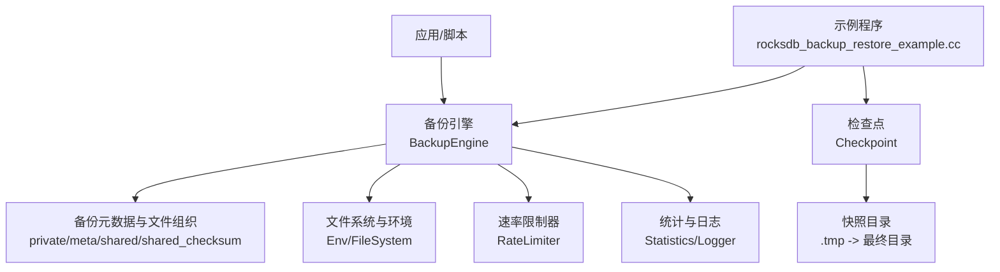
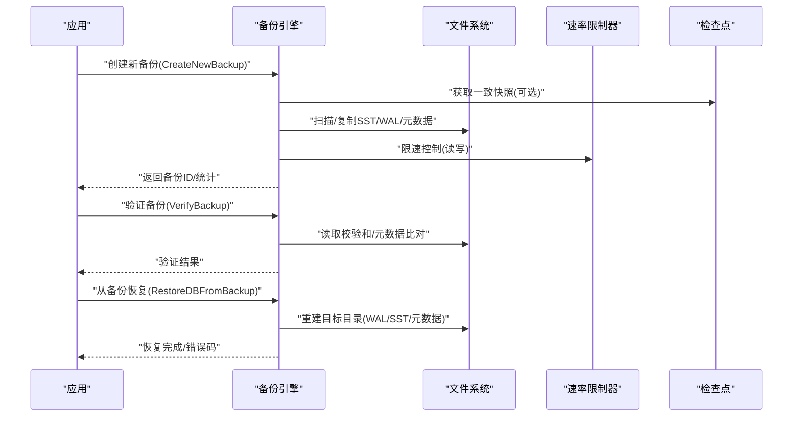
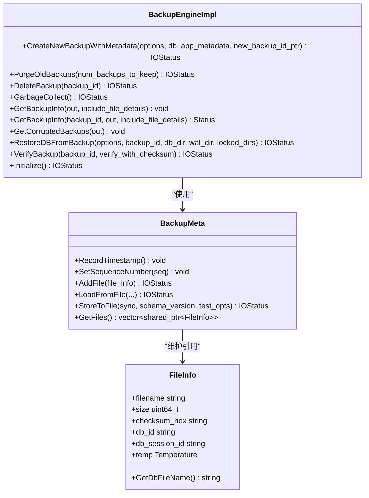
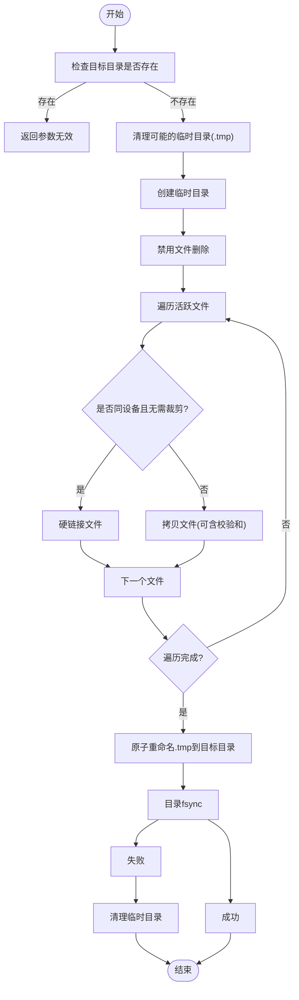
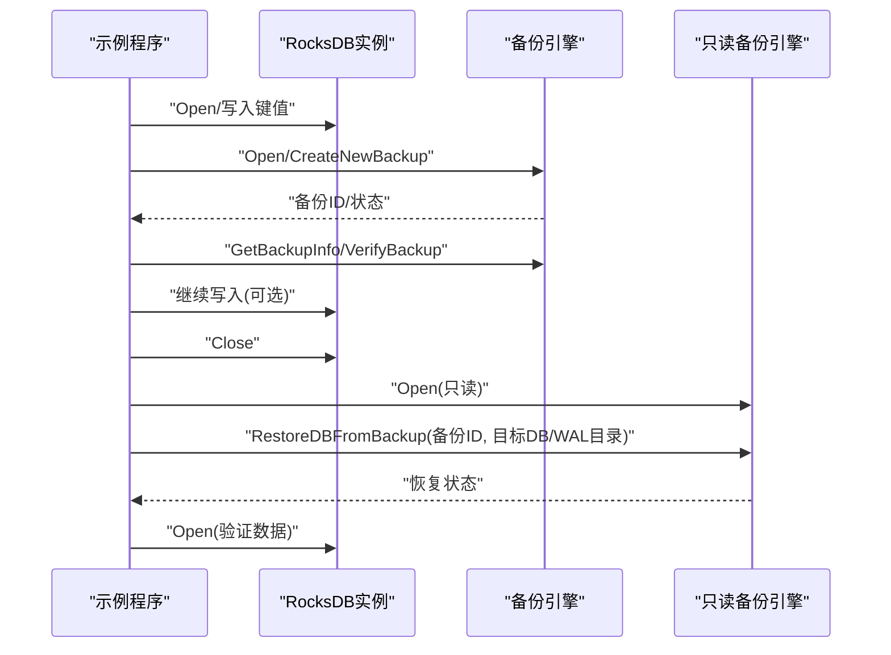
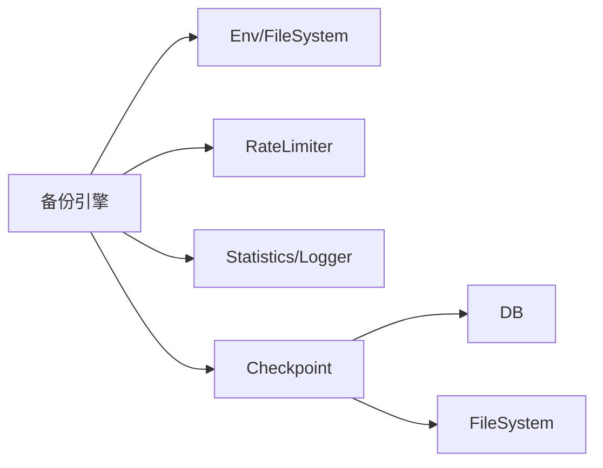

# 恢复流程

<cite>
**本文引用的文件**   
- [backup_engine.cc](file://source/rocksdb/utilities/backup/backup_engine.cc)
- [rocksdb_backup_restore_example.cc](file://source/rocksdb/examples/rocksdb_backup_restore_example.cc)
- [checkpoint_impl.cc](file://source/rocksdb/utilities/checkpoint/checkpoint_impl.cc)
- [backup_engine_test.cc](file://source/rocksdb/utilities/backup/backup_engine_test.cc)
</cite>

## 目录
1. [简介](#简介)
2. [项目结构](#项目结构)
3. [核心组件](#核心组件)
4. [架构总览](#架构总览)
5. [详细组件分析](#详细组件分析)
6. [依赖关系分析](#依赖关系分析)
7. [性能考虑](#性能考虑)
8. [故障排查指南](#故障排查指南)
9. [结论](#结论)
10. [附录](#附录)

## 简介
本操作指南面向RocksDB数据恢复，覆盖从备份到恢复的完整流程：备份文件验证、数据一致性检查、恢复过程监控；解释部分恢复与完全恢复的区别与适用场景；记录校验和与完整性保证机制；提供网络中断、磁盘故障等异常处理的最佳实践；给出恢复性能优化与资源管理建议；说明跨版本恢复与数据迁移方法；并给出恢复测试与验证的具体步骤。

## 项目结构
围绕RocksDB备份与恢复的关键代码位于utilities/backup与utilities/checkpoint两个子模块，以及examples中的示例程序。核心实现包括：
- 备份引擎（BackupEngine）：负责创建、删除、清理、验证备份，以及从备份恢复数据库。
- 检查点（Checkpoint）：用于生成可打开的一致性快照，支持硬链接或拷贝策略。
- 示例程序：演示如何创建备份、验证备份、读取备份信息、从备份恢复数据库。

图表来源 
- [backup_engine.cc:130-170](file://source/rocksdb/utilities/backup/backup_engine.cc#L130-L170)
- [checkpoint_impl.cc:92-120](file://source/rocksdb/utilities/checkpoint/checkpoint_impl.cc#L92-L120)
- [rocksdb_backup_restore_example.cc:50-80](file://source/rocksdb/examples/rocksdb_backup_restore_example.cc#L50-L80)

章节来源
- [backup_engine.cc:130-170](file://source/rocksdb/utilities/backup/backup_engine.cc#L130-L170)
- [checkpoint_impl.cc:92-120](file://source/rocksdb/utilities/checkpoint/checkpoint_impl.cc#L92-L120)
- [rocksdb_backup_restore_example.cc:50-80](file://source/rocksdb/examples/rocksdb_backup_restore_example.cc#L50-L80)

## 核心组件
- 备份引擎（BackupEngine/BackupEngineImpl）
  - 功能：创建增量/全量备份、列出备份信息、删除/清理旧备份、验证备份完整性、从备份恢复数据库。
  - 关键能力：共享文件命名（含校验和/会话ID）、可选校验和存储、速率限制、后台任务队列、进度回调。
- 检查点（Checkpoint）
  - 功能：在一致状态下生成快照，支持硬链接优先、跨设备回退拷贝、原子重命名与目录fsync。
- 示例程序
  - 功能：展示Open备份引擎、CreateNewBackup、VerifyBackup、RestoreDBFromBackup的标准调用顺序。

章节来源
- [backup_engine.cc:130-170](file://source/rocksdb/utilities/backup/backup_engine.cc#L130-L170)
- [checkpoint_impl.cc:92-120](file://source/rocksdb/utilities/checkpoint/checkpoint_impl.cc#L92-L120)
- [rocksdb_backup_restore_example.cc:50-80](file://source/rocksdb/examples/rocksdb_backup_restore_example.cc#L50-L80)

## 架构总览
下图展示了备份与恢复的核心交互：应用通过备份引擎接口进行备份与恢复；备份引擎内部协调文件复制/链接、校验和计算、元数据写入与恢复时的目标目录重建；检查点作为一致性快照源，确保恢复起点一致。

图表来源 
- [backup_engine.cc:158-170](file://source/rocksdb/utilities/backup/backup_engine.cc#L158-L170)
- [checkpoint_impl.cc:92-120](file://source/rocksdb/utilities/checkpoint/checkpoint_impl.cc#L92-L120)
- [rocksdb_backup_restore_example.cc:50-80](file://source/rocksdb/examples/rocksdb_backup_restore_example.cc#L50-L80)

## 详细组件分析

### 备份引擎（BackupEngine/BackupEngineImpl）
- 备份目录结构
  - private：每个备份的私有文件（按备份ID分目录）。
  - meta：备份元数据文件（包含时间戳、序列号、文件大小、文件名列表等）。
  - shared：共享的SST文件（去重）。
  - shared_checksum：带校验和命名的共享文件（便于校验与跨会话区分）。
- 备份流程要点
  - 工作项队列：CopyOrCreate与ComputeChecksum两类任务并行执行，支持进度回调与速率限制。
  - 共享文件命名：支持基于CRC32c+大小或基于DB SessionId+大小的命名策略，提升去重与校验效率。
  - 校验和：可选择对共享文件计算并存储校验和，用于后续VerifyBackup。
  - 速率限制：备份与恢复分别配置独立限速器，避免影响在线服务。
- 恢复流程要点
  - RestoreDBFromBackup根据备份元数据重建目标目录，必要时映射共享文件为私有路径以便只读打开。
  - 支持多种恢复模式（例如增量/全量），推断需要保留的目标文件集合，减少不必要I/O。
- 验证与垃圾回收
  - VerifyBackup：读取元数据与文件校验和，确认一致性。
  - GarbageCollect/DeleteBackup：清理过期备份与无用共享文件。

图表来源 
- [backup_engine.cc:130-170](file://source/rocksdb/utilities/backup/backup_engine.cc#L130-L170)
- [backup_engine.cc:369-501](file://source/rocksdb/utilities/backup/backup_engine.cc#L369-L501)
- [backup_engine.cc:203-250](file://source/rocksdb/utilities/backup/backup_engine.cc#L203-L250)

章节来源
- [backup_engine.cc:130-170](file://source/rocksdb/utilities/backup/backup_engine.cc#L130-L170)
- [backup_engine.cc:369-501](file://source/rocksdb/utilities/backup/backup_engine.cc#L369-L501)
- [backup_engine.cc:203-250](file://source/rocksdb/utilities/backup/backup_engine.cc#L203-L250)

### 检查点（Checkpoint）
- 一致性快照
  - CreateCheckpoint：创建临时目录，禁用文件删除，遍历活跃文件，优先硬链接，跨设备回退拷贝，完成后原子重命名为最终目录并fsync目录。
  - 支持导出列族文件（ExportColumnFamily）与自定义检查点（CreateCustomCheckpoint），便于迁移与离线处理。
- 校验与完整性
  - 可在获取活跃文件信息时包含校验和（include_checksum_info），辅助后续校验。
  - 失败时自动清理临时目录，保证环境整洁。

图表来源 
- [checkpoint_impl.cc:92-120](file://source/rocksdb/utilities/checkpoint/checkpoint_impl.cc#L92-L120)
- [checkpoint_impl.cc:219-309](file://source/rocksdb/utilities/checkpoint/checkpoint_impl.cc#L219-L309)

章节来源
- [checkpoint_impl.cc:92-120](file://source/rocksdb/utilities/checkpoint/checkpoint_impl.cc#L92-L120)
- [checkpoint_impl.cc:219-309](file://source/rocksdb/utilities/checkpoint/checkpoint_impl.cc#L219-L309)

### 示例程序（备份与恢复流程）
- 标准流程
  - Open DB并写入数据。
  - Open BackupEngine并CreateNewBackup。
  - GetBackupInfo列出备份，VerifyBackup校验备份。
  - 关闭DB后，Open BackupEngineReadOnly并RestoreDBFromBackup到目标目录。
  - 重新Open DB并验证数据一致性（期望键存在/缺失）。

图表来源 
- [rocksdb_backup_restore_example.cc:50-80](file://source/rocksdb/examples/rocksdb_backup_restore_example.cc#L50-L80)

章节来源
- [rocksdb_backup_restore_example.cc:50-80](file://source/rocksdb/examples/rocksdb_backup_restore_example.cc#L50-L80)

## 依赖关系分析
- 备份引擎依赖
  - Env/FileSystem：文件枚举、读写、硬链接、目录操作。
  - RateLimiter：备份与恢复的I/O限速。
  - Statistics/Logger：统计与日志输出。
  - Checkpoint：一致性快照（可选）。
- 检查点依赖
  - DB：获取活跃文件信息、禁用/启用文件删除、FlushWAL（按需）。
  - FileSystem：硬链接/拷贝、目录fsync。

图表来源 
- [backup_engine.cc:130-170](file://source/rocksdb/utilities/backup/backup_engine.cc#L130-L170)
- [checkpoint_impl.cc:92-120](file://source/rocksdb/utilities/checkpoint/checkpoint_impl.cc#L92-L120)

章节来源
- [backup_engine.cc:130-170](file://source/rocksdb/utilities/backup/backup_engine.cc#L130-L170)
- [checkpoint_impl.cc:92-120](file://source/rocksdb/utilities/checkpoint/checkpoint_impl.cc#L92-L120)

## 性能考虑
- 备份阶段
  - 启用共享文件与校验和命名，最大化去重与校验效率。
  - 合理设置backup_rate_limit，避免影响在线写放大。
  - 利用后台任务队列与进度回调，实现平滑I/O与可观测性。
- 恢复阶段
  - 设置restore_rate_limit，控制恢复带宽占用。
  - 选择合适恢复模式（增量/全量），减少不必要的文件拷贝。
  - 若目标与源在同一文件系统，优先硬链接以减少I/O与空间占用。
- 资源管理
  - 调整max_background_operations，平衡并发与系统负载。
  - 使用独立的backup_env/restore_env隔离I/O路径，降低争用。
  - 定期GarbageCollect，释放无用共享文件，防止存储膨胀。

[本节为通用指导，不直接分析具体文件]

## 故障排查指南
- 常见错误与定位
  - 备份失败：检查Env/FileSystem权限、磁盘空间、速率限制器配置、共享文件命名冲突。
  - 验证失败：核对shared_checksum中校验和与文件内容是否一致，检查元数据schema版本兼容性。
  - 恢复失败：确认目标目录为空或可写，WAL与SST路径正确，恢复模式与备份集匹配。
- 异常处理最佳实践
  - 网络中断：启用重试与断点续传（通过进度回调与任务队列），记录失败文件清单，局部重试。
  - 磁盘故障：切换备用存储路径，校验源文件可用性，必要时回滚到上一可用备份。
  - 进程崩溃：检查临时目录（.tmp）残留，清理后再重试；确保目录fsync成功。
- 监控与诊断
  - 观察Statistics指标（I/O吞吐、延迟、错误计数）。
  - 查看Logger输出，定位具体失败阶段（扫描、复制、校验、重建）。
  - 使用GetCorruptedBackups识别损坏备份，结合VerifyBackup精确定位问题文件。

章节来源
- [backup_engine.cc:130-170](file://source/rocksdb/utilities/backup/backup_engine.cc#L130-L170)
- [backup_engine_test.cc:1-200](file://source/rocksdb/utilities/backup/backup_engine_test.cc#L1-200)

## 结论
RocksDB的备份与恢复体系以BackupEngine为核心，配合Checkpoint提供一致性快照，辅以校验和与共享文件去重，形成高可靠、高性能的数据保护方案。通过合理的速率限制、后台任务与监控，可在生产环境中安全高效地完成备份、验证与恢复。针对异常场景，应建立完善的重试、回滚与清理策略，确保业务连续性。

[本节为总结，不直接分析具体文件]

## 附录

### 备份文件验证与数据一致性检查
- 使用VerifyBackup对指定备份进行校验，可选择开启校验和验证。
- 通过GetBackupInfo获取备份详情（文件数量、大小、时间戳等），结合校验和判断一致性。
- 对于共享文件，优先使用shared_checksum目录中的校验和命名进行快速比对。

章节来源
- [backup_engine.cc:158-170](file://source/rocksdb/utilities/backup/backup_engine.cc#L158-L170)
- [backup_engine.cc:369-501](file://source/rocksdb/utilities/backup/backup_engine.cc#L369-L501)

### 部分恢复与完全恢复
- 完全恢复：将备份集中所有文件恢复到目标目录，适用于整库重建或迁移。
- 部分恢复：仅恢复指定的列族或文件集合，适用于选择性恢复或增量修复。
- 选择依据：业务需求（是否需要全部数据）、存储空间与时间约束、目标库当前状态。

章节来源
- [backup_engine.cc:158-170](file://source/rocksdb/utilities/backup/backup_engine.cc#L158-L170)
- [checkpoint_impl.cc:313-450](file://source/rocksdb/utilities/checkpoint/checkpoint_impl.cc#L313-L450)

### 校验和与完整性保证机制
- 共享文件命名策略支持包含CRC32c校验和或SessionId，便于唯一标识与校验。
- VerifyBackup可读取校验和并与实际文件比对，发现损坏或不一致。
- Checkpoint在拷贝时可携带校验和信息，增强端到端一致性保障。

章节来源
- [backup_engine.cc:203-250](file://source/rocksdb/utilities/backup/backup_engine.cc#L203-L250)
- [checkpoint_impl.cc:219-309](file://source/rocksdb/utilities/checkpoint/checkpoint_impl.cc#L219-L309)

### 恢复性能优化与资源管理
- 备份/恢复速率限制：分别配置backup_rate_limit与restore_rate_limit，避免拥塞。
- 后台并发：调整max_background_operations，平衡I/O与CPU。
- 存储路径：尽量同文件系统硬链接，减少拷贝与空间占用。
- 定期清理：GarbageCollect释放无用共享文件，保持备份集精简。

章节来源
- [backup_engine.cc:130-170](file://source/rocksdb/utilities/backup/backup_engine.cc#L130-L170)
- [checkpoint_impl.cc:92-120](file://source/rocksdb/utilities/checkpoint/checkpoint_impl.cc#L92-L120)

### 跨版本恢复与数据迁移
- 版本兼容：确保备份元数据schema与目标RocksDB版本兼容，必要时升级或降级工具链。
- 迁移方法：使用Checkpoint导出活跃文件，结合ExportColumnFamily进行列族级迁移。
- 校验与回滚：迁移前后执行VerifyBackup与一致性校验，失败时回滚至前一稳定状态。

章节来源
- [checkpoint_impl.cc:313-450](file://source/rocksdb/utilities/checkpoint/checkpoint_impl.cc#L313-L450)
- [backup_engine.cc:369-501](file://source/rocksdb/utilities/backup/backup_engine.cc#L369-L501)

### 恢复测试与验证步骤
- 准备阶段：创建测试DB，写入基准数据，生成备份。
- 验证阶段：调用VerifyBackup，检查返回状态与统计信息。
- 恢复阶段：执行RestoreDBFromBackup，重启DB并读取关键键值验证一致性。
- 压力测试：在高并发写入下触发备份/恢复，观察延迟与吞吐变化。
- 异常注入：模拟网络中断、磁盘错误，验证重试与清理逻辑。

章节来源
- [rocksdb_backup_restore_example.cc:50-80](file://source/rocksdb/examples/rocksdb_backup_restore_example.cc#L50-L80)
- [backup_engine_test.cc:1-200](file://source/rocksdb/utilities/backup/backup_engine_test.cc#L1-200)