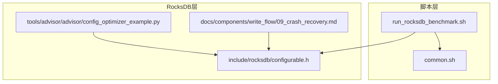
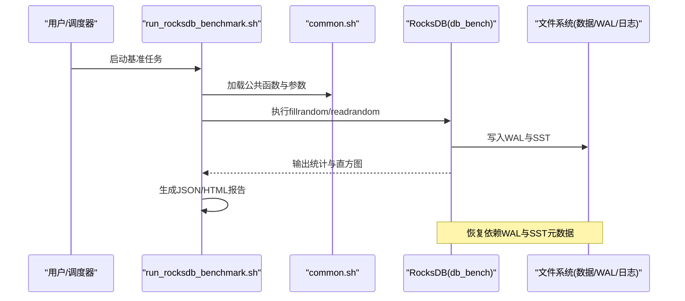
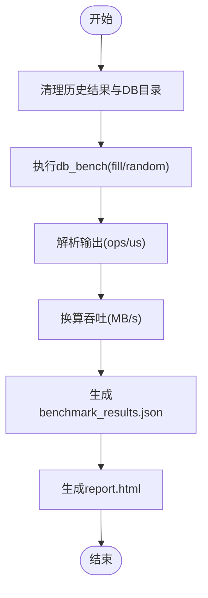
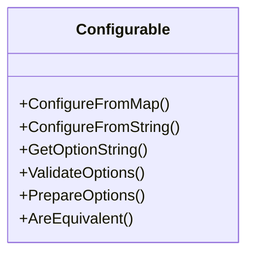
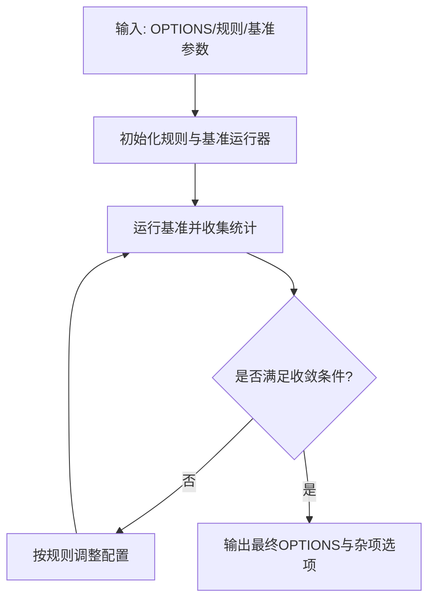
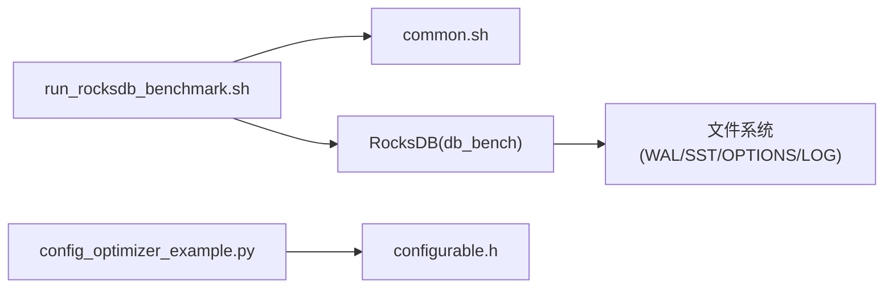

# 灾难恢复

<cite>
**本文引用的文件**   
- [run_rocksdb_benchmark.sh](file://script/run_rocksdb_benchmark.sh)
- [common.sh](file://script/common.sh)
- [configurable.h](file://source/rocksdb/include/rocksdb/configurable.h)
- [config_optimizer_example.py](file://source/rocksdb/tools/advisor/advisor/config_optimizer_example.py)
- [09_crash_recovery.md](file://source/rocksdb/docs/components/write_flow/09_crash_recovery.md)
</cite>

## 目录
1. [引言](#引言)
2. [项目结构](#项目结构)
3. [核心组件](#核心组件)
4. [架构总览](#架构总览)
5. [详细组件分析](#详细组件分析)
6. [依赖关系分析](#依赖关系分析)
7. [性能考量](#性能考量)
8. [故障排查指南](#故障排查指南)
9. [结论](#结论)
10. [附录](#附录) 

## 引言
本文件面向RocksDB的灾难恢复计划，结合仓库中的基准脚本、配置与文档，给出可落地的RTO/RPO定义、多站点备份与同步策略、灾备场景分类与恢复流程、自动化脚本与应急预案、业务连续性保障与最小停机策略，以及演练与测试方法。同时解释跨区域复制与高可用架构设计要点，确保在硬件故障、软件错误、人为误操作等场景下快速恢复并降低数据丢失。

## 项目结构
本项目包含：
- 基准与工具脚本：用于运行RocksDB db_bench、生成报告、采集硬件信息、计算吞吐与时延等指标。
- RocksDB源码与文档：提供崩溃恢复机制说明与配置优化示例。
- YCSB与其他数据库绑定：用于对比或扩展评测（与本DR计划关联度较低）。

图表来源 
- [run_rocksdb_benchmark.sh:1-50](file://script/run_rocksdb_benchmark.sh#L1-L50)
- [common.sh:1-196](file://script/common.sh#L1-L196)
- [configurable.h:1-395](file://source/rocksdb/include/rocksdb/configurable.h#L1-L395)
- [config_optimizer_example.py:1-141](file://source/rocksdb/tools/advisor/advisor/config_optimizer_example.py#L1-L141)
- [09_crash_recovery.md](file://source/rocksdb/docs/components/write_flow/09_crash_recovery.md)

章节来源
- [run_rocksdb_benchmark.sh:1-50](file://script/run_rocksdb_benchmark.sh#L1-L50)
- [common.sh:1-196](file://script/common.sh#L1-L196)

## 核心组件
- 基准执行脚本：封装db_bench调用、参数化值大小、线程、压缩、WAL开关、统计与直方图输出，并生成JSON与HTML报告。
- 公共函数库：解析ops/sec与us/op、换算MB/s、采集CPU/GPU/内核/OS信息，统一输出JSON结构。
- RocksDB配置抽象：Configurable基类提供选项注册、序列化、校验与准备能力，支撑一致性配置管理。
- 配置优化示例：基于规则与基准的自动调优入口，便于为不同负载生成稳健的配置集。
- 崩溃恢复文档：阐述写路径与崩溃恢复机制，指导WAL与快照策略。

章节来源
- [run_rocksdb_benchmark.sh:1-50](file://script/run_rocksdb_benchmark.sh#L1-L50)
- [common.sh:1-196](file://script/common.sh#L1-L196)
- [configurable.h:1-395](file://source/rocksdb/include/rocksdb/configurable.h#L1-L395)
- [config_optimizer_example.py:1-141](file://source/rocksdb/tools/advisor/advisor/config_optimizer_example.py#L1-L141)
- [09_crash_recovery.md](file://source/rocksdb/docs/components/write_flow/09_crash_recovery.md)

## 架构总览
下图展示从基准脚本到RocksDB引擎的关键交互，以及恢复相关的数据流与产物（WAL、SST、OPTIONS、日志与统计）。

图表来源 
- [run_rocksdb_benchmark.sh:1-50](file://script/run_rocksdb_benchmark.sh#L1-L50)
- [common.sh:1-196](file://script/common.sh#L1-L196)

## 详细组件分析

### 基准与报告流水线
- 功能要点
  - 清理历史结果与数据库目录，避免污染。
  - 通过Python脚本驱动db_bench，设置总数据量、压缩类型、引擎、环境变量。
  - 生成JSON与HTML报告，汇总吞吐、时延、放大率等关键指标。
- 恢复关联
  - 基准过程中开启WAL与统计，有助于事后定位问题与验证恢复效果。
  - 报告产物可作为恢复后回归测试的基线。

图表来源 
- [run_rocksdb_benchmark.sh:1-50](file://script/run_rocksdb_benchmark.sh#L1-L50)
- [common.sh:1-196](file://script/common.sh#L1-L196)

章节来源
- [run_rocksdb_benchmark.sh:1-50](file://script/run_rocksdb_benchmark.sh#L1-L50)
- [common.sh:1-196](file://script/common.sh#L1-L196)

### RocksDB配置与一致性
- Configurable基类提供统一的选项注册、序列化、校验与准备接口，保证跨对象的一致性配置管理。
- 对恢复的意义
  - 通过GetOptionString/ToString导出当前配置，便于迁移与回滚。
  - ValidateOptions/PrepareOptions确保配置在重启/恢复前有效且一致。

图表来源 
- [configurable.h:1-395](file://source/rocksdb/include/rocksdb/configurable.h#L1-L395)

章节来源
- [configurable.h:1-395](file://source/rocksdb/include/rocksdb/configurable.h#L1-L395)

### 配置优化示例
- 该脚本以规则驱动的方式，结合基准运行与日志统计，迭代优化RocksDB配置，输出最终OPTIONS文件。
- 对恢复的价值
  - 在灾难恢复后，使用相同规则与负载进行回归验证，确保配置稳定。
  - 将“最终配置”纳入版本控制，作为恢复基线。

图表来源 
- [config_optimizer_example.py:1-141](file://source/rocksdb/tools/advisor/advisor/config_optimizer_example.py#L1-L141)

章节来源
- [config_optimizer_example.py:1-141](file://source/rocksdb/tools/advisor/advisor/config_optimizer_example.py#L1-L141)

### 崩溃恢复机制参考
- 官方文档描述了写路径与崩溃恢复流程，强调WAL与SST的协同作用，以及在异常退出后的恢复顺序与一致性保证。
- 实践建议
  - 保持WAL开启与合理刷盘策略，减少数据丢失窗口。
  - 定期快照与增量备份，缩短RTO。
  - 恢复后执行一致性校验与回归基准，确认服务可用性。

章节来源
- [09_crash_recovery.md](file://source/rocksdb/docs/components/write_flow/09_crash_recovery.md)

## 依赖关系分析
- 脚本层依赖系统命令（如nvidia-smi、awk、bc）与RocksDB构建产物（db_bench）。
- 公共函数被多个基准脚本复用，形成稳定的数据处理与采集管线。
- RocksDB配置与恢复逻辑由源码与文档共同约束，确保跨版本一致性。

图表来源 
- [run_rocksdb_benchmark.sh:1-50](file://script/run_rocksdb_benchmark.sh#L1-L50)
- [common.sh:1-196](file://script/common.sh#L1-L196)
- [config_optimizer_example.py:1-141](file://source/rocksdb/tools/advisor/advisor/config_optimizer_example.py#L1-L141)
- [configurable.h:1-395](file://source/rocksdb/include/rocksdb/configurable.h#L1-L395)

章节来源
- [run_rocksdb_benchmark.sh:1-50](file://script/run_rocksdb_benchmark.sh#L1-L50)
- [common.sh:1-196](file://script/common.sh#L1-L196)

## 性能考量
- WAL与压缩：关闭压缩可降低写放大与时延，但会增加存储占用；根据RPO与磁盘成本权衡。
- 缓存与缓冲：write_buffer_size与cache_size影响吞吐与内存占用，需在恢复后回归验证。
- 统计与直方图：启用statistics与histogram有助于定位瓶颈与评估恢复后性能。
- 空间放大率：通过space_amplification衡量存储效率，指导compaction策略。

[本节为通用指导，不直接分析具体文件]

## 故障排查指南
- 常见问题
  - WAL未刷盘导致数据丢失：检查disable_wal与刷盘策略，确保关键事务持久化。
  - 配置不一致导致恢复失败：使用GetOptionString/ToString导出并比对OPTIONS。
  - 基准结果异常：核对parse_ops_per_sec与parse_us_per_op解析逻辑，确认输出格式。
- 排查步骤
  - 查看LOG与STATISTICS，定位异常点。
  - 使用config_optimizer_example重新生成配置并回归基准。
  - 校验SST与WAL完整性，必要时执行修复流程。

章节来源
- [common.sh:1-196](file://script/common.sh#L1-L196)
- [configurable.h:1-395](file://source/rocksdb/include/rocksdb/configurable.h#L1-L395)
- [09_crash_recovery.md](file://source/rocksdb/docs/components/write_flow/09_crash_recovery.md)

## 结论
本计划以现有基准脚本与RocksDB配置/恢复文档为基础，构建了可操作的灾难恢复框架。通过明确RTO/RPO、完善备份与同步策略、规范恢复流程与自动化脚本、强化演练与回归测试，可在多种故障场景下实现快速恢复与业务连续性保障。

[本节为总结性内容，不直接分析具体文件]

## 附录

### RTO与RPO定义与实现
- RTO（恢复时间目标）
  - 定义：从灾难发生到服务恢复可用的最大允许时间。
  - 实现要点：预置备用节点、热备数据、自动化切换脚本、恢复后快速回归基准。
- RPO（恢复点目标）
  - 定义：允许的最大数据丢失窗口。
  - 实现要点：开启WAL、合理刷盘频率、增量备份、跨站复制延迟控制。

[本节为概念性内容，不直接分析具体文件]

### 多站点备份与数据同步方案
- 主从复制
  - 主库实时写入，从库异步/同步复制，故障时提升从库为主。
- 快照+增量
  - 定期全量快照，配合WAL增量，缩短恢复时间。
- 跨区域复制
  - 考虑网络延迟与带宽，采用异步复制与冲突解决策略。

[本节为概念性内容，不直接分析具体文件]

### 灾难场景分类与恢复流程
- 硬件故障（磁盘损坏、节点宕机）
  - 检测与隔离 -> 切换备用节点 -> 恢复数据（快照/WAL）-> 回归验证。
- 软件错误（配置错误、升级失败）
  - 回滚配置/版本 -> 恢复数据 -> 验证一致性。
- 人为误操作（误删、批量错误更新）
  - 定位时间点 -> 恢复到最近一致快照 -> 重放增量WAL -> 校验数据。

[本节为概念性内容，不直接分析具体文件]

### 自动化恢复脚本与应急预案
- 自动化脚本
  - 一键恢复：拉取最新快照、应用增量WAL、启动服务、执行健康检查。
  - 回归基准：运行基准脚本，对比指标阈值，失败则告警。
- 应急预案
  - 角色分工、沟通渠道、升级路径、回退策略、复盘改进。

[本节为概念性内容，不直接分析具体文件]

### 业务连续性与最小停机策略
- 灰度发布与蓝绿部署，降低变更风险。
- 读写分离与只读副本，故障时快速切换。
- 限流与降级，保护核心链路。

[本节为概念性内容，不直接分析具体文件]

### 恢复演练与测试方法
- 演练类型
  - 桌面推演、模拟故障注入、真实环境切换演练。
- 测试指标
  - RTO/RPO达成率、数据一致性校验通过率、基准回归通过率。
- 持续改进
  - 演练后复盘，更新预案与脚本，定期复测。

[本节为概念性内容，不直接分析具体文件]

### 跨区域复制与高可用架构设计
- 多活架构
  - 分片路由、冲突检测与合并、一致性协议选择。
- 监控与告警
  - 复制延迟、队列积压、错误率、资源利用率。
- 容量规划
  - 峰值预估、扩容策略、冷热分层。

[本节为概念性内容，不直接分析具体文件]