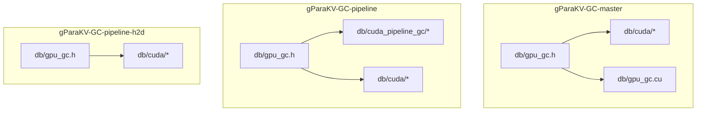
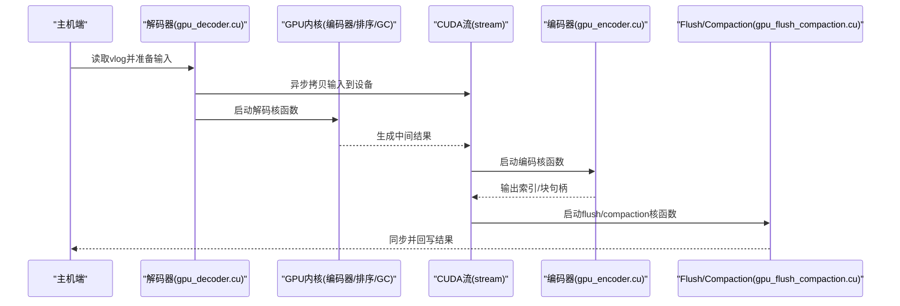
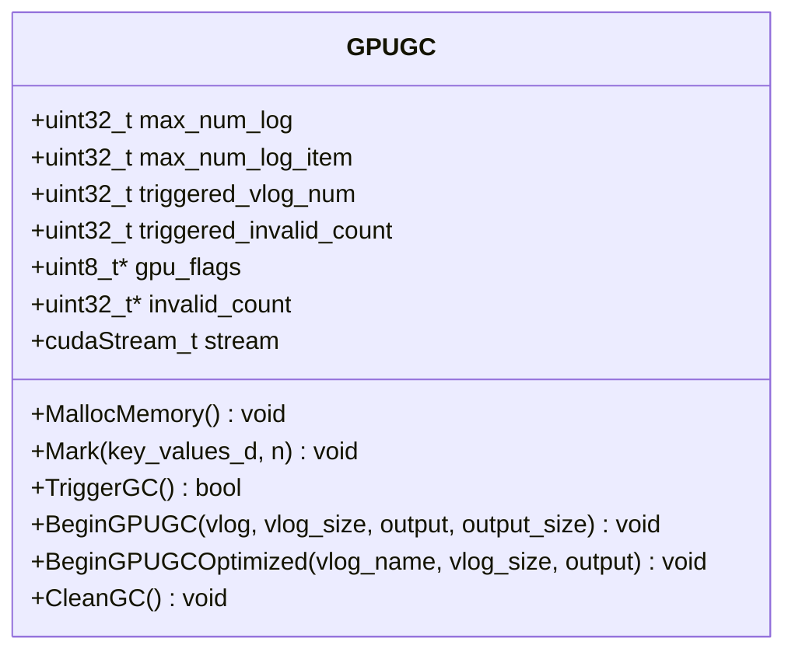
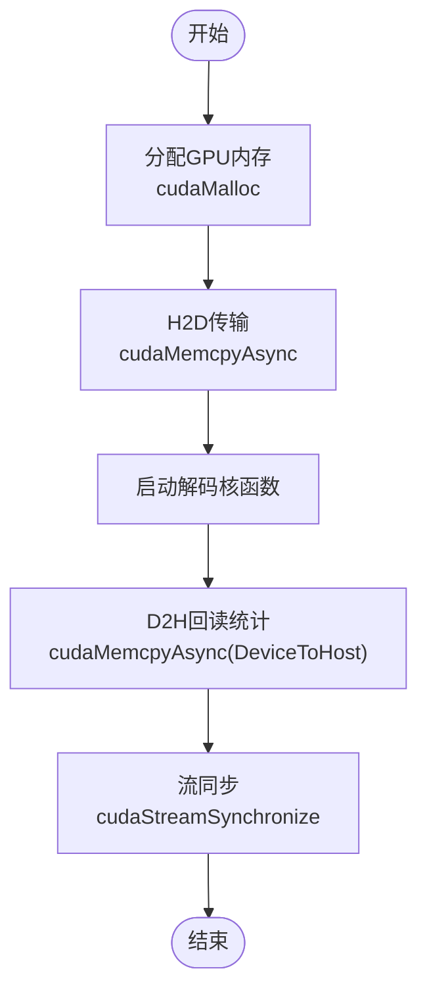
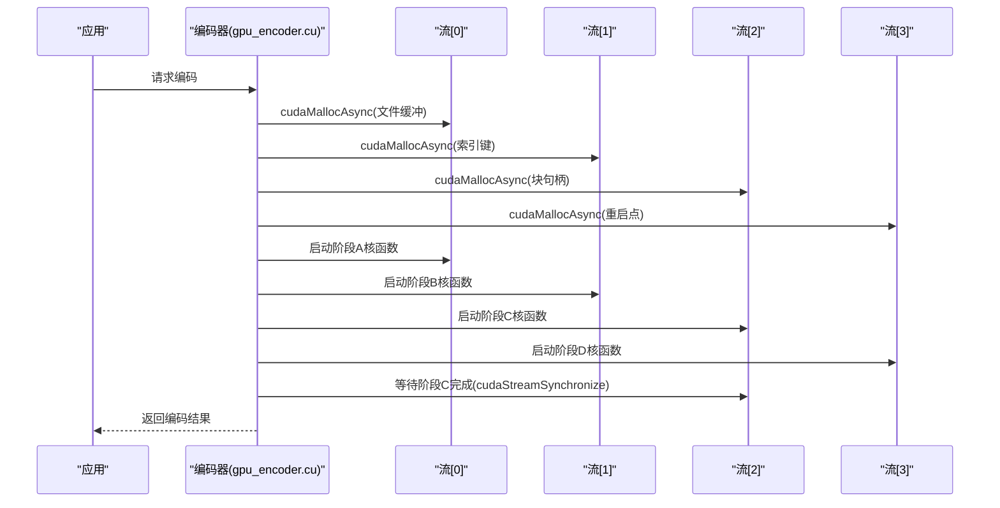
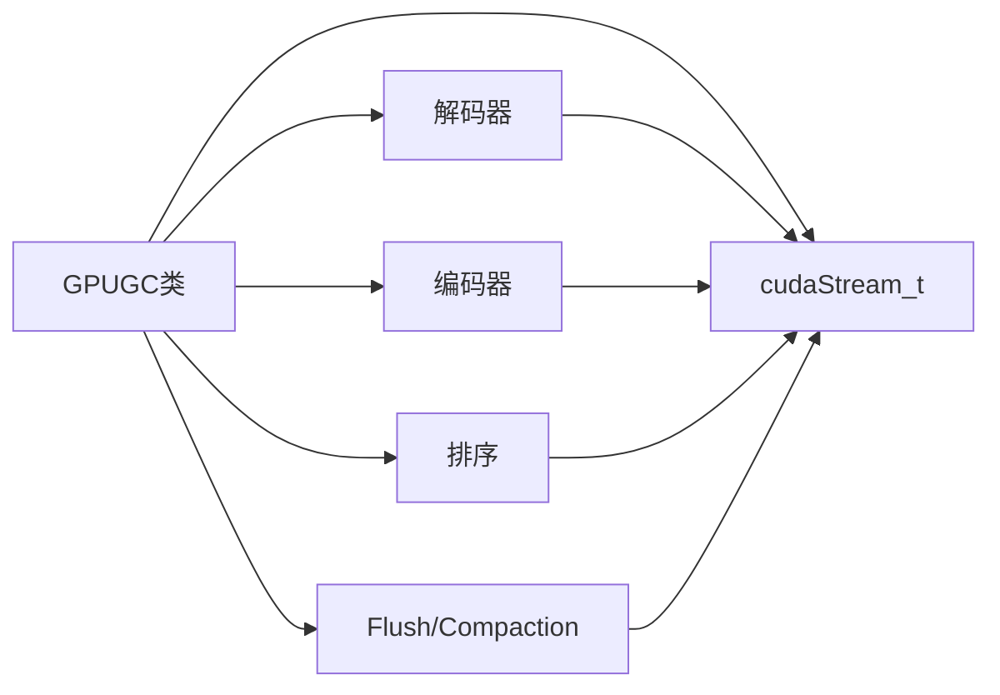

# GPU加速调优

<cite>
**本文档引用的文件**   
- [gpu_gc.h](file://source/gParaKV-GC-master/db/gpu_gc.h)
- [gpu_decoder.cu](file://source/gParaKV-GC-master/db/cuda/gpu_decoder.cu)
- [gpu_encoder.cu](file://source/gParaKV-GC-master/db/cuda/gpu_encoder.cu)
- [gpu_flush_compaction.cu](file://source/gParaKV-GC-master/db/cuda/gpu_flush_compaction.cu)
- [gpu_sort.cu](file://source/gParaKV-GC-master/db/cuda/gpu_sort.cu)
- [gpu_struct.cu](file://source/gParaKV-GC-master/db/cuda/gpu_struct.cu)
- [gpu_coding.cu](file://source/gParaKV-GC-master/db/cuda/gpu_coding.cu)
- [gpu_gc.cu](file://source/gParaKV-GC-master/db/gpu_gc.cu)
- [gc_pipeline_bench.cu](file://source/gParaKV-GC-pipeline/db/cuda_pipeline_gc/gc_pipeline_bench.cu)
- [gc_pipeline_db_bench.cu](file://source/gParaKV-GC-pipeline/db/cuda_pipeline_gc/gc_pipeline_db_bench.cu)
- [gc_pipeline_vlog.cu](file://source/gParaKV-GC-pipeline/db/cuda_pipeline_gc/gc_pipeline_vlog.cu)
- [gc_real_db_bench.cu](file://source/gParaKV-GC-pipeline/db/cuda_pipeline_gc/gc_real_db_bench.cu)
- [gpu_gc.h (pipeline)](file://source/gParaKV-GC-pipeline/db/gpu_gc.h)
- [gpu_gc.h (h2d)](file://source/gParaKV-GC-pipeline-h2d/db/gpu_gc.h)
</cite>

## 目录
1. [简介](#简介)
2. [项目结构](#项目结构)
3. [核心组件](#核心组件)
4. [架构总览](#架构总览)
5. [详细组件分析](#详细组件分析)
6. [依赖关系分析](#依赖关系分析)
7. [性能考虑](#性能考虑)
8. [故障排查指南](#故障排查指南)
9. [结论](#结论)
10. [附录](#附录)

## 简介
本指南面向GPU加速的元数据卸载与垃圾回收（GC）场景，聚焦于CUDA流配置、内存传输优化、流水线并行设置、不同GPU硬件的调优模板与基准、GPU利用率监控与CUDA错误诊断，以及瓶颈分析与调优策略。内容基于仓库中gParaKV-GC系列实现与基准脚本，提供可操作的配置建议与排障方法。

## 项目结构
仓库包含多个版本的gParaKV-GC实现与基准：
- gParaKV-GC-master：基础GPU GC实现与CUDA内核
- gParaKV-GC-pipeline：引入流水线并行的版本，含多组基准
- gParaKV-GC-pipeline-h2d：针对H2D优化的流水线版本
- 各版本均包含db/cuda下的CUDA内核与头文件，以及db层封装类GPUGC

图表来源
- [gpu_gc.h:1-53](file://source/gParaKV-GC-master/db/gpu_gc.h#L1-L53)
- [gpu_decoder.cu:1-200](file://source/gParaKV-GC-master/db/cuda/gpu_decoder.cu#L1-L200)
- [gpu_encoder.cu:1-800](file://source/gParaKV-GC-master/db/cuda/gpu_encoder.cu#L1-L800)
- [gpu_gc.cu:1-200](file://source/gParaKV-GC-master/db/gpu_gc.cu#L1-L200)
- [gc_pipeline_bench.cu:1-200](file://source/gParaKV-GC-pipeline/db/cuda_pipeline_gc/gc_pipeline_bench.cu#L1-L200)
- [gc_pipeline_db_bench.cu:1-200](file://source/gParaKV-GC-pipeline/db/cuda_pipeline_gc/gc_pipeline_db_bench.cu#L1-L200)
- [gc_pipeline_vlog.cu:1-200](file://source/gParaKV-GC-pipeline/db/cuda_pipeline_gc/gc_pipeline_vlog.cu#L1-L200)
- [gc_real_db_bench.cu:1-200](file://source/gParaKV-GC-pipeline/db/cuda_pipeline_gc/gc_real_db_bench.cu#L1-L200)

章节来源
- [gpu_gc.h:1-53](file://source/gParaKV-GC-master/db/gpu_gc.h#L1-L53)
- [gpu_decoder.cu:1-200](file://source/gParaKV-GC-master/db/cuda/gpu_decoder.cu#L1-L200)
- [gpu_encoder.cu:1-800](file://source/gParaKV-GC-master/db/cuda/gpu_encoder.cu#L1-L800)
- [gpu_gc.cu:1-200](file://source/gParaKV-GC-master/db/gpu_gc.cu#L1-L200)
- [gc_pipeline_bench.cu:1-200](file://source/gParaKV-GC-pipeline/db/cuda_pipeline_gc/gc_pipeline_bench.cu#L1-L200)
- [gc_pipeline_db_bench.cu:1-200](file://source/gParaKV-GC-pipeline/db/cuda_pipeline_gc/gc_pipeline_db_bench.cu#L1-L200)
- [gc_pipeline_vlog.cu:1-200](file://source/gParaKV-GC-pipeline/db/cuda_pipeline_gc/gc_pipeline_vlog.cu#L1-L200)
- [gc_real_db_bench.cu:1-200](file://source/gParaKV-GC-pipeline/db/cuda_pipeline_gc/gc_real_db_bench.cu#L1-L200)

## 核心组件
- GPUGC类：封装GPU侧GC生命周期管理，包括内存分配、标记、触发GC、清理等；持有cudaStream_t用于异步执行与同步控制。
- CUDA内核模块：解码器、编码器、排序、结构体处理、编码/解码、flush与compaction等，分别承担数据解析、转换、排序与落盘合并任务。
- 流水线基准模块：提供流水线GC的基准测试入口，便于评估不同配置下的吞吐与延迟。

章节来源
- [gpu_gc.h:1-53](file://source/gParaKV-GC-master/db/gpu_gc.h#L1-L53)
- [gpu_decoder.cu:1-200](file://source/gParaKV-GC-master/db/cuda/gpu_decoder.cu#L1-L200)
- [gpu_encoder.cu:1-800](file://source/gParaKV-GC-master/db/cuda/gpu_encoder.cu#L1-L800)
- [gpu_sort.cu:1-200](file://source/gParaKV-GC-master/db/cuda/gpu_sort.cu#L1-L200)
- [gpu_struct.cu:1-200](file://source/gParaKV-GC-master/db/cuda/gpu_struct.cu#L1-L200)
- [gpu_coding.cu:1-200](file://source/gParaKV-GC-master/db/cuda/gpu_coding.cu#L1-L200)
- [gpu_flush_compaction.cu:1-200](file://source/gParaKV-GC-master/db/cuda/gpu_flush_compaction.cu#L1-L200)
- [gpu_gc.cu:1-200](file://source/gParaKV-GC-master/db/gpu_gc.cu#L1-L200)
- [gc_pipeline_bench.cu:1-200](file://source/gParaKV-GC-pipeline/db/cuda_pipeline_gc/gc_pipeline_bench.cu#L1-L200)
- [gc_pipeline_db_bench.cu:1-200](file://source/gParaKV-GC-pipeline/db/cuda_pipeline_gc/gc_pipeline_db_bench.cu#L1-L200)
- [gc_pipeline_vlog.cu:1-200](file://source/gParaKV-GC-pipeline/db/cuda_pipeline_gc/gc_pipeline_vlog.cu#L1-L200)
- [gc_real_db_bench.cu:1-200](file://source/gParaKV-GC-pipeline/db/cuda_pipeline_gc/gc_real_db_bench.cu#L1-L200)

## 架构总览
整体流程围绕“数据解码→GPU处理（编码/排序/GC）→结果回写”展开，使用多CUDA流进行重叠计算与数据传输，并通过GPUGC统一管理流与资源。

图表来源
- [gpu_decoder.cu:1-200](file://source/gParaKV-GC-master/db/cuda/gpu_decoder.cu#L1-L200)
- [gpu_encoder.cu:1-800](file://source/gParaKV-GC-master/db/cuda/gpu_encoder.cu#L1-L800)
- [gpu_flush_compaction.cu:1-200](file://source/gParaKV-GC-master/db/cuda/gpu_flush_compaction.cu#L1-L200)
- [gpu_gc.h:1-53](file://source/gParaKV-GC-master/db/gpu_gc.h#L1-L53)

## 详细组件分析

### GPUGC类与流管理
- 职责：维护GPU侧位图与无效计数统计，提供MallocMemory、Mark、TriggerGC、BeginGPUGC、CleanGC等方法；持有cudaStream_t用于异步执行。
- 关键点：stream字段用于统一调度；标记阶段将GPUKeyValue指针传入；触发GC后需清理资源避免泄漏。

图表来源
- [gpu_gc.h:1-53](file://source/gParaKV-GC-master/db/gpu_gc.h#L1-L53)

章节来源
- [gpu_gc.h:1-53](file://source/gParaKV-GC-master/db/gpu_gc.h#L1-L53)

### 解码器与内存传输（H2D/D2H）
- 解码器负责从vlog读取并构建GPU侧数据结构，使用cudaMalloc与cudaMemcpyAsync进行H2D传输，使用cudaMemcpyAsync进行D2H回读统计。
- 关键路径：输入文件信息拷贝、索引块与footers分配、全局计数回读、流创建与同步。

图表来源
- [gpu_decoder.cu:1-200](file://source/gParaKV-GC-master/db/cuda/gpu_decoder.cu#L1-L200)

章节来源
- [gpu_decoder.cu:1-200](file://source/gParaKV-GC-master/db/cuda/gpu_decoder.cu#L1-L200)

### 编码器与多流并发
- 编码器在多个流上执行不同阶段的核函数，通过cudaStreamCreate创建独立流，并使用cudaMallocAsync进行异步内存分配，减少阻塞。
- 关键路径：估算文件大小、分配索引键与块句柄、重启点数组、流同步确保顺序正确。

图表来源
- [gpu_encoder.cu:1-800](file://source/gParaKV-GC-master/db/cuda/gpu_encoder.cu#L1-L800)

章节来源
- [gpu_encoder.cu:1-800](file://source/gParaKV-GC-master/db/cuda/gpu_encoder.cu#L1-L800)

### Flush/Compaction与排序
- flush与compaction核函数负责将GPU侧结果持久化或合并，排序核函数对键值进行高效排序以支持后续合并。
- 典型操作：批量写入、块级压缩、跨批次合并、排序稳定性保证。

章节来源
- [gpu_flush_compaction.cu:1-200](file://source/gParaKV-GC-master/db/cuda/gpu_flush_compaction.cu#L1-L200)
- [gpu_sort.cu:1-200](file://source/gParaKV-GC-master/db/cuda/gpu_sort.cu#L1-L200)

### 编码/结构与通用工具
- 编码核函数处理数据序列化与压缩，结构体核函数定义GPU侧数据结构布局，通用工具提供辅助功能。
- 关注点：内存对齐、共享内存使用、寄存器压力控制。

章节来源
- [gpu_coding.cu:1-200](file://source/gParaKV-GC-master/db/cuda/gpu_coding.cu#L1-L200)
- [gpu_struct.cu:1-200](file://source/gParaKV-GC-master/db/cuda/gpu_struct.cu#L1-L200)

### 流水线基准与DB集成
- 流水线基准提供端到端评估入口，包括纯基准、数据库集成基准、vlog处理与真实DB负载。
- 用途：对比不同流水线深度、批大小、线程数对吞吐与延迟的影响。

章节来源
- [gc_pipeline_bench.cu:1-200](file://source/gParaKV-GC-pipeline/db/cuda_pipeline_gc/gc_pipeline_bench.cu#L1-L200)
- [gc_pipeline_db_bench.cu:1-200](file://source/gParaKV-GC-pipeline/db/cuda_pipeline_gc/gc_pipeline_db_bench.cu#L1-L200)
- [gc_pipeline_vlog.cu:1-200](file://source/gParaKV-GC-pipeline/db/cuda_pipeline_gc/gc_pipeline_vlog.cu#L1-L200)
- [gc_real_db_bench.cu:1-200](file://source/gParaKV-GC-pipeline/db/cuda_pipeline_gc/gc_real_db_bench.cu#L1-L200)

## 依赖关系分析
- GPUGC依赖CUDA流与GPU内存分配接口，解码器/编码器/排序/flush等核函数通过流进行异步编排。
- 流水线版本在原有基础上增加pipeline相关入口，便于调节深度与并发度。

图表来源
- [gpu_gc.h:1-53](file://source/gParaKV-GC-master/db/gpu_gc.h#L1-L53)
- [gpu_decoder.cu:1-200](file://source/gParaKV-GC-master/db/cuda/gpu_decoder.cu#L1-L200)
- [gpu_encoder.cu:1-800](file://source/gParaKV-GC-master/db/cuda/gpu_encoder.cu#L1-L800)
- [gpu_sort.cu:1-200](file://source/gParaKV-GC-master/db/cuda/gpu_sort.cu#L1-L200)
- [gpu_flush_compaction.cu:1-200](file://source/gParaKV-GC-master/db/cuda/gpu_flush_compaction.cu#L1-L200)

章节来源
- [gpu_gc.h:1-53](file://source/gParaKV-GC-master/db/gpu_gc.h#L1-L53)
- [gpu_decoder.cu:1-200](file://source/gParaKV-GC-master/db/cuda/gpu_decoder.cu#L1-L200)
- [gpu_encoder.cu:1-800](file://source/gParaKV-GC-master/db/cuda/gpu_encoder.cu#L1-L800)
- [gpu_sort.cu:1-200](file://source/gParaKV-GC-master/db/cuda/gpu_sort.cu#L1-L200)
- [gpu_flush_compaction.cu:1-200](file://source/gParaKV-GC-master/db/cuda/gpu_flush_compaction.cu#L1-L200)

## 性能考虑
- CUDA流配置
  - 合理划分阶段对应的流数量，避免过多流导致上下文切换开销。
  - 使用cudaStreamCreate创建专用流，并在关键节点调用cudaStreamSynchronize保证顺序。
  - 参考实现中的多流设计，为编码阶段的不同子任务分配独立流以提升重叠度。
- 内存限制与分配
  - 使用cudaMallocAsync进行异步分配，减少同步阻塞。
  - 预估最大内存需求，避免频繁分配/释放造成碎片与抖动。
- H2D/D2H传输优化
  - 批量传输以减少PCIe往返次数，结合异步拷贝与核函数执行重叠。
  - 控制单次传输大小，避免超过设备带宽饱和阈值。
- 流水线并行
  - 调整流水线深度以匹配核函数粒度与内存带宽，避免过深导致队列拥塞。
  - 批大小与线程数需根据GPU算力与显存容量平衡。
- 监控与诊断
  - 使用nvprof/nvtx标注关键阶段，观察GPU利用率、内存带宽与流占用。
  - 检查cudaError返回值，定位失败点与资源不足问题。

[本节为通用指导，不直接分析具体文件]

## 故障排查指南
- 常见问题
  - 流未同步导致数据竞争：确认关键阶段前后调用cudaStreamSynchronize。
  - 内存分配失败：检查cudaMalloc/cudaMallocAsync返回值与设备剩余显存。
  - H2D/D2H超时或错误：核对传输方向与大小，确保源/目标地址有效。
- 诊断步骤
  - 启用CUDA错误检查宏，捕获异常并打印堆栈。
  - 使用nsight compute分析核函数耗时与内存访问模式。
  - 逐步缩小批大小与流水线深度，定位瓶颈阶段。

章节来源
- [gpu_decoder.cu:1-200](file://source/gParaKV-GC-master/db/cuda/gpu_decoder.cu#L1-L200)
- [gpu_encoder.cu:1-800](file://source/gParaKV-GC-master/db/cuda/gpu_encoder.cu#L1-L800)

## 结论
通过对GPUGC类与CUDA内核的深入分析，结合多流编排与流水线并行设计，可在不同GPU硬件上实现高效的元数据卸载与GC。建议依据实际负载特征调整流数量、批大小与流水线深度，并利用监控工具持续优化内存传输与核函数执行效率。

[本节为总结性内容，不直接分析具体文件]

## 附录

### CUDA流配置参数建议
- cuda_stream_count
  - 建议值：根据核函数阶段数量与GPU SM数量设定，通常等于主要阶段数（如解码、编码、排序、flush）。
  - 调优方法：逐步增加流数，观察GPU利用率与吞吐变化，找到拐点。
- cuda_memory_limit
  - 建议值：不超过设备显存的70%-80%，预留系统与其他进程空间。
  - 调优方法：监控显存峰值，避免OOM；必要时分块处理降低峰值。

章节来源
- [gpu_encoder.cu:1-800](file://source/gParaKV-GC-master/db/cuda/gpu_encoder.cu#L1-L800)
- [gpu_decoder.cu:1-200](file://source/gParaKV-GC-master/db/cuda/gpu_decoder.cu#L1-L200)

### 内存传输优化策略
- H2D/D2H策略
  - 批量聚合：将多次小传输合并为大块传输，减少PCIe开销。
  - 异步重叠：在传输期间启动核函数，最大化利用带宽。
- 批处理配置
  - 批大小：根据核函数粒度与内存带宽选择，过大导致内存压力，过小降低吞吐。
  - 线程块维度：调整block size与grid size以匹配GPU架构。

章节来源
- [gpu_decoder.cu:1-200](file://source/gParaKV-GC-master/db/cuda/gpu_decoder.cu#L1-L200)
- [gpu_encoder.cu:1-800](file://source/gParaKV-GC-master/db/cuda/gpu_encoder.cu#L1-L800)

### 流水线并行设置
- pipeline_depth
  - 建议值：3-5层较为常见，需根据核函数粒度与内存访问模式调整。
  - 调优方法：逐层添加流水线阶段，观察延迟与吞吐变化。
- gpu_compaction_threads
  - 建议值：与GPU SM数量及核函数并行度匹配，避免过度线程竞争。
  - 调优方法：通过nvprof分析线程占用率，调整至饱和但不溢出。

章节来源
- [gc_pipeline_bench.cu:1-200](file://source/gParaKV-GC-pipeline/db/cuda_pipeline_gc/gc_pipeline_bench.cu#L1-L200)
- [gc_pipeline_db_bench.cu:1-200](file://source/gParaKV-GC-pipeline/db/cuda_pipeline_gc/gc_pipeline_db_bench.cu#L1-L200)

### 不同GPU硬件的优化模板
- 入门级GPU（如T4）
  - 流数量：2-3个
  - 批大小：中等（根据显存调整）
  - 流水线深度：3层
- 高性能GPU（如A100/H100）
  - 流数量：4-6个
  - 批大小：较大（充分利用带宽）
  - 流水线深度：4-5层
- 调优方法
  - 使用基准脚本运行不同配置，记录吞吐与延迟。
  - 结合nsight compute分析热点核函数与内存访问。

[本节为通用指导，不直接分析具体文件]

### 性能基准与监控
- 基准脚本
  - 使用gc_pipeline_bench与gc_pipeline_db_bench进行端到端评估。
  - 对比不同配置下的吞吐、延迟与GPU利用率。
- 监控工具
  - nvprof：采集核函数耗时、内存带宽与流占用。
  - nsight compute：深入分析核函数性能与内存访问模式。
  - nvidia-smi：实时观察GPU利用率与显存使用。

章节来源
- [gc_pipeline_bench.cu:1-200](file://source/gParaKV-GC-pipeline/db/cuda_pipeline_gc/gc_pipeline_bench.cu#L1-L200)
- [gc_pipeline_db_bench.cu:1-200](file://source/gParaKV-GC-pipeline/db/cuda_pipeline_gc/gc_pipeline_db_bench.cu#L1-L200)

### 性能瓶颈分析与调优策略
- 常见瓶颈
  - PCIe带宽饱和：优化H2D/D2H批大小与频率。
  - 核函数效率低：调整线程块维度与共享内存使用。
  - 内存碎片：减少频繁分配，使用池化或预分配。
- 调优策略
  - 分层优化：先解决数据传输，再优化核函数，最后调整流水线。
  - 渐进式验证：每次只调整一个参数，记录效果并回溯。

[本节为通用指导，不直接分析具体文件]