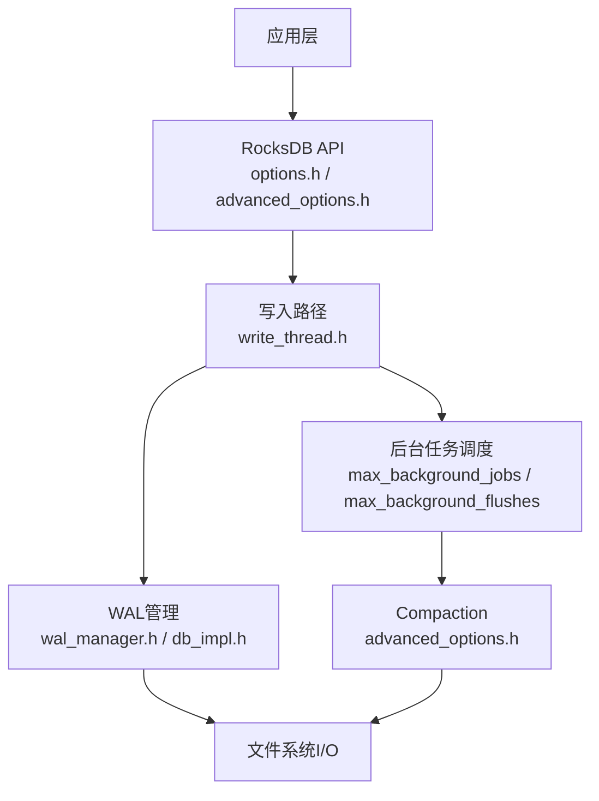
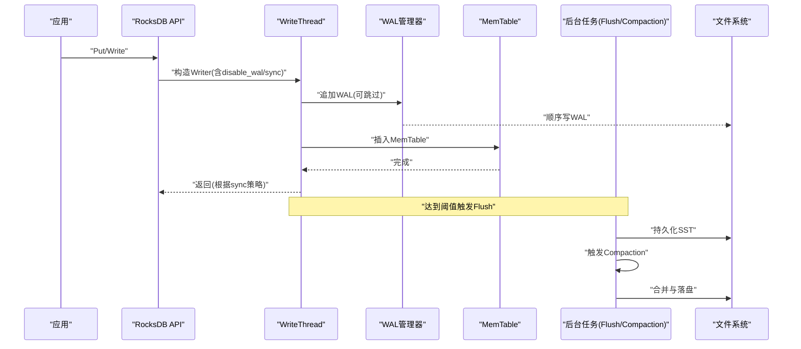
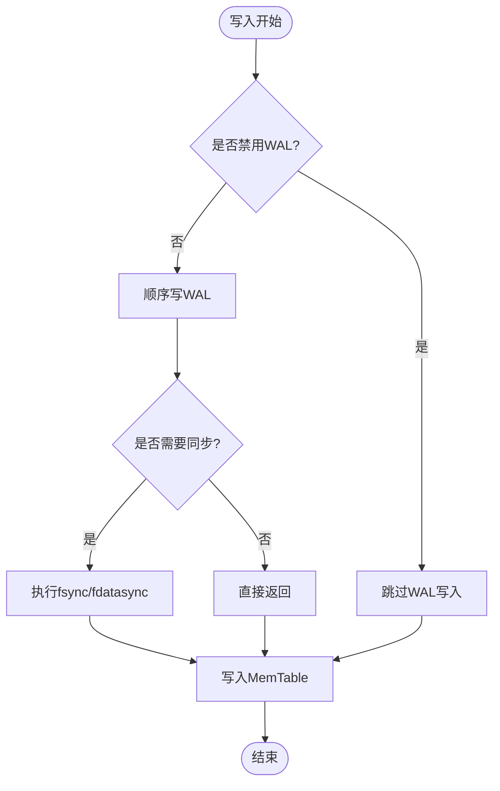
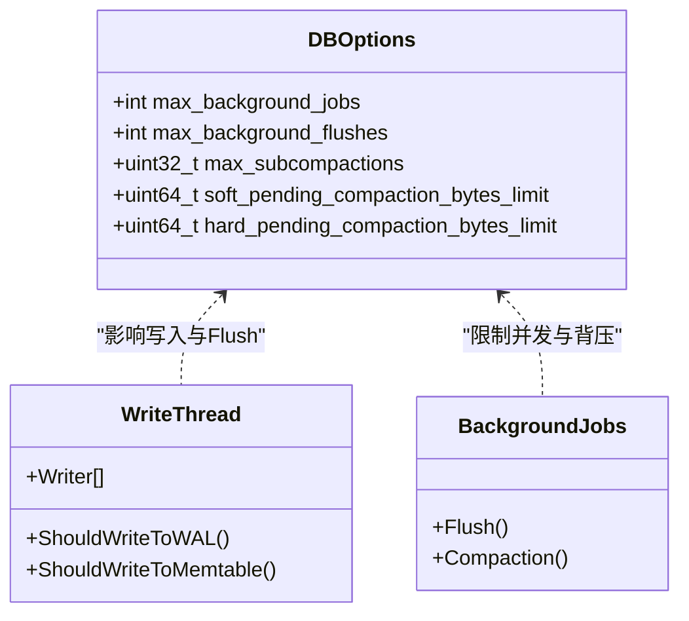
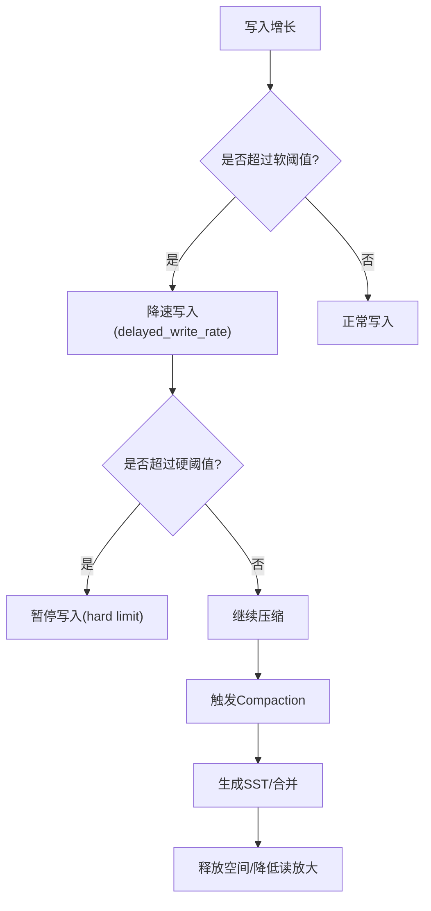
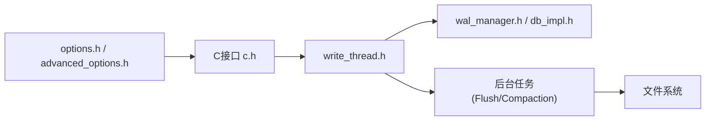

# I/O优化

<cite>
**本文引用的文件**   
- [options.h](file://source/rocksdb/include/rocksdb/options.h)
- [advanced_options.h](file://source/rocksdb/include/rocksdb/advanced_options.h)
- [write_thread.h](file://source/rocksdb/db/write_thread.h)
- [db_impl.h](file://source/rocksdb/db/db_impl/db_impl.h)
- [wal_manager.h](file://source/rocksdb/db/wal_manager.h)
- [c.h](file://source/rocksdb/include/rocksdb/c.h)
- [10_prefetching_and_async_io.md](file://source/rocksdb/docs/components/read_flow/10_prefetching_and_async_io.md)
</cite>

## 目录
1. [简介](#简介)
2. [项目结构](#项目结构)
3. [核心组件](#核心组件)
4. [架构总览](#架构总览)
5. [详细组件分析](#详细组件分析)
6. [依赖关系分析](#依赖关系分析)
7. [性能考量](#性能考量)
8. [故障排查指南](#故障排查指南)
9. [结论](#结论)
10. [附录](#附录)

## 简介
本指南面向RocksDB的I/O性能调优，聚焦WAL（预写日志）配置、Flush调度机制与Compaction参数。内容涵盖：
- WAL路径与同步策略（wal_dir、wal_sync_policy、disable_wal等）
- Flush线程与后台任务（flush_thread_num、max_background_flushes）
- Compaction风格与动态级别大小（compaction_style、level_compaction_dynamic_level_bytes等）
- 不同介质（SSD、HDD、NVMe）的配置模板
- I/O监控指标与瓶颈识别方法
- 常见问题诊断与解决策略

## 项目结构
仓库包含多个RocksDB分支与工具集，I/O相关的关键选项定义集中在include/rocksdb/options.h与include/rocksdb/advanced_options.h；WAL与写入路径在db/write_thread.h、db/db_impl/db_impl.h与db/wal_manager.h中实现；C接口在include/rocksdb/c.h中暴露；文档参考见docs/components/read_flow下的异步I/O说明。

图表来源 
- [options.h:870-950](file://source/rocksdb/include/rocksdb/options.h#L870-L950)
- [advanced_options.h:640-740](file://source/rocksdb/include/rocksdb/advanced_options.h#L640-L740)
- [write_thread.h:120-319](file://source/rocksdb/db/write_thread.h#L120-L319)
- [db_impl.h:870-950](file://source/rocksdb/db/db_impl/db_impl.h#L870-L950)
- [wal_manager.h:40-130](file://source/rocksdb/db/wal_manager.h#L40-L130)

章节来源
- [options.h:870-1069](file://source/rocksdb/include/rocksdb/options.h#L870-L1069)
- [advanced_options.h:640-839](file://source/rocksdb/include/rocksdb/advanced_options.h#L640-L839)
- [write_thread.h:120-319](file://source/rocksdb/db/write_thread.h#L120-L319)
- [db_impl.h:870-950](file://source/rocksdb/db/db_impl/db_impl.h#L870-L950)
- [wal_manager.h:40-130](file://source/rocksdb/db/wal_manager.h#L40-L130)

## 核心组件
- WAL配置与路径
  - wal_dir：指定WAL独立目录，便于与数据目录分离，降低竞争并提升吞吐。
  - recycle_log_file_num：复用WAL文件减少inode更新开销。
  - WAL_ttl_seconds/WAL_size_limit_MB：归档与清理策略。
- Flush与后台任务
  - max_background_jobs：后台任务总数（compactions + flushes）。
  - max_background_flushes：并发flush线程数（默认由max_background_jobs推导）。
  - max_subcompactions：子compaction并行度。
- Compaction策略
  - compaction_style：Level/Universal/FIFO。
  - level_compaction_dynamic_level_bytes：按写负载自适应调整各级目标大小。
  - max_bytes_for_level_multiplier、max_compaction_bytes、soft/hard_pending_compaction_bytes_limit：控制压缩规模与背压。

章节来源
- [options.h:870-1069](file://source/rocksdb/include/rocksdb/options.h#L870-L1069)
- [advanced_options.h:640-839](file://source/rocksdb/include/rocksdb/advanced_options.h#L640-L839)

## 架构总览
下图展示一次写入从应用到WAL与MemTable，再到后台Flush与Compaction的整体流程，以及关键I/O点。

图表来源 
- [write_thread.h:120-319](file://source/rocksdb/db/write_thread.h#L120-L319)
- [db_impl.h:870-950](file://source/rocksdb/db/db_impl/db_impl.h#L870-L950)
- [wal_manager.h:40-130](file://source/rocksdb/db/wal_manager.h#L40-L130)
- [options.h:870-1069](file://source/rocksdb/include/rocksdb/options.h#L870-L1069)
- [advanced_options.h:640-839](file://source/rocksdb/include/rocksdb/advanced_options.h#L640-L839)

## 详细组件分析

### WAL配置优化
- wal_dir
  - 作用：将WAL与数据文件分目录存放，避免同盘竞争，利于独立调优与备份。
  - 建议：高吞吐写入场景优先使用独立高速盘（如NVMe），或至少与数据盘物理隔离。
- wal_sync_policy（通过sync与need_wal_dir_sync体现）
  - 写入时是否对WAL进行fsync/fdatasync，影响延迟与持久性权衡。
  - need_wal_dir_sync用于目录级同步，确保元数据一致性。
- disable_wal
  - 作用：跳过WAL写入，极致降低写放大与延迟，但失去崩溃恢复能力。
  - 适用：一次性批量导入、可容忍数据丢失的场景。
- recycle_log_file_num
  - 作用：复用WAL文件，减少inode更新与fdatasync开销，提升吞吐。
  - 建议：在高写入吞吐且磁盘空间充足时启用。
- WAL清理
  - WAL_ttl_seconds/WAL_size_limit_MB：控制归档与删除频率与上限，避免WAL膨胀。

图表来源 
- [write_thread.h:120-319](file://source/rocksdb/db/write_thread.h#L120-L319)
- [db_impl.h:870-950](file://source/rocksdb/db/db_impl/db_impl.h#L870-L950)
- [options.h:870-1069](file://source/rocksdb/include/rocksdb/options.h#L870-L1069)

章节来源
- [options.h:870-1069](file://source/rocksdb/include/rocksdb/options.h#L870-L1069)
- [write_thread.h:120-319](file://source/rocksdb/db/write_thread.h#L120-L319)
- [db_impl.h:870-950](file://source/rocksdb/db/db_impl/db_impl.h#L870-L950)
- [wal_manager.h:40-130](file://source/rocksdb/db/wal_manager.h#L40-L130)

### Flush调度机制
- max_background_jobs与max_background_flushes
  - RocksDB自动根据两者关系计算实际并发度；若仅设置其一，另一项会被推导。
  - 建议：在高并发写入与SSD/NVMe上适当提高max_background_flushes，以加速MemTable落盘。
- flush_thread_num
  - 通常由后台线程池配置决定；可通过Env::SetBackgroundThreads调整HIGH优先级线程池大小。
- 背压与限流
  - soft/hard_pending_compaction_bytes_limit：当待压缩字节超过阈值时降速或停止写入，防止积压。
  - max_subcompactions：子compaction并行度，有助于利用多核与高带宽存储。

图表来源 
- [options.h:870-1069](file://source/rocksdb/include/rocksdb/options.h#L870-L1069)
- [write_thread.h:120-319](file://source/rocksdb/db/write_thread.h#L120-L319)

章节来源
- [options.h:870-1069](file://source/rocksdb/include/rocksdb/options.h#L870-L1069)
- [write_thread.h:120-319](file://source/rocksdb/db/write_thread.h#L120-L319)

### Compaction参数调优
- compaction_style
  - Level：通用场景，读放大可控，适合随机读较多。
  - Universal：适合高写入吞吐、低读放大需求。
  - FIFO：简单淘汰策略，适合只写不读或近似FIFO的数据。
- level_compaction_dynamic_level_bytes
  - 开启后根据写负载自适应调整各级目标大小，缓解突发写导致的积压。
  - 迁移建议：升级后可直接启用，RocksDB会自动处理非空级别。
- 其他关键项
  - max_bytes_for_level_multiplier：层级间大小倍增因子。
  - max_compaction_bytes：单次压缩目标大小。
  - soft/hard_pending_compaction_bytes_limit：背压阈值，保护系统不被压缩积压拖垮。

图表来源 
- [advanced_options.h:640-839](file://source/rocksdb/include/rocksdb/advanced_options.h#L640-L839)

章节来源
- [advanced_options.h:640-839](file://source/rocksdb/include/rocksdb/advanced_options.h#L640-L839)

### 不同存储介质的I/O优化模板
- SSD（本地或云盘）
  - WAL：wal_dir指向独立SSD；recycle_log_file_num>0；sync适度放宽（结合业务容忍度）。
  - Flush：提高max_background_flushes与max_background_jobs；合理设置soft/hard_pending_compaction_bytes_limit。
  - Compaction：compaction_style=Level；level_compaction_dynamic_level_bytes=true；max_bytes_for_level_multiplier≈10。
- HDD（机械盘）
  - WAL：尽量与数据盘分离，减少寻道；recycle_log_file_num>0；谨慎开启sync。
  - Flush：降低并发以避免磁头抖动；增大max_manifest_file_size以减少manifest频繁滚动。
  - Compaction：compaction_style=Universal或Level；增大max_compaction_bytes以提升顺序吞吐。
- NVMe（高性能闪存）
  - WAL：wal_dir单独挂载；recycle_log_file_num较大值；sync可按需关闭或低频同步。
  - Flush：最大化max_background_flushes与max_subcompactions；关注CPU与内存带宽。
  - Compaction：compaction_style=Level或Universal；启用level_compaction_dynamic_level_bytes；监控pending压缩字节。

[本节为概念性指导，无需代码来源]

### I/O性能监控指标与瓶颈识别
- 关键指标
  - WAL写入吞吐与延迟、fsync次数与耗时。
  - MemTable大小与Flush频率、SST文件大小分布。
  - Compaction活跃任务数、输入/输出字节数、压缩比。
  - pending_compaction_bytes（软/硬阈值）、delayed_write_rate触发次数。
- 监控手段
  - RocksDB统计接口（GetStats/GetHistogramData）与monitoring模块。
  - 系统工具：iostat/iotop查看队列长度、%util、await；perf追踪内核IO路径。
- 瓶颈定位
  - 高延迟+低吞吐：可能受限于sync或磁盘IOPS不足。
  - 高延迟+高吞吐：可能受限于CPU或内存带宽（压缩/编码）。
  - 写入被暂停：检查hard_pending_compaction_bytes_limit与磁盘空间。

章节来源
- [10_prefetching_and_async_io.md:180-195](file://source/rocksdb/docs/components/read_flow/10_prefetching_and_async_io.md#L180-L195)

### 常见I/O问题诊断与解决策略
- WAL目录未分离导致数据与日志争用
  - 现象：随机读写冲突，延迟升高。
  - 解决：设置wal_dir独立路径，必要时使用更快介质。
- 频繁fsync导致延迟尖刺
  - 现象：P99/P999延迟突增。
  - 解决：评估业务对持久性的要求，适当降低sync频率或关闭disable_wal（仅限可丢数据场景）。
- 压缩积压导致写入暂停
  - 现象：出现hard limit触发，写入阻塞。
  - 解决：提高max_background_jobs/max_background_flushes，扩大磁盘容量，或降低写入速率。
- Manifest频繁滚动
  - 现象：小文件过多，元数据写放大。
  - 解决：调整max_manifest_file_size与max_manifest_space_amp_pct。

章节来源
- [options.h:870-1069](file://source/rocksdb/include/rocksdb/options.h#L870-L1069)
- [advanced_options.h:640-839](file://source/rocksdb/include/rocksdb/advanced_options.h#L640-L839)

## 依赖关系分析
- 选项定义与API
  - options.h与advanced_options.h提供DBOptions与ColumnFamilyOptions的核心字段。
  - c.h暴露C接口以便外部语言绑定与工具调用。
- 写入路径与WAL
  - write_thread.h中的Writer结构体携带disable_wal、sync等标志，驱动WAL与MemTable写入决策。
  - db_impl.h与wal_manager.h负责WAL生命周期与目录同步。
- 后台任务与Compaction
  - 后台任务数量由max_background_jobs与max_background_flushes共同决定；Compaction策略由advanced_options.h控制。

图表来源 
- [options.h:870-1069](file://source/rocksdb/include/rocksdb/options.h#L870-L1069)
- [advanced_options.h:640-839](file://source/rocksdb/include/rocksdb/advanced_options.h#L640-L839)
- [c.h:1600-2060](file://source/rocksdb/include/rocksdb/c.h#L1600-L2060)
- [write_thread.h:120-319](file://source/rocksdb/db/write_thread.h#L120-L319)
- [db_impl.h:870-950](file://source/rocksdb/db/db_impl/db_impl.h#L870-L950)
- [wal_manager.h:40-130](file://source/rocksdb/db/wal_manager.h#L40-L130)

章节来源
- [c.h:1600-2060](file://source/rocksdb/include/rocksdb/c.h#L1600-L2060)
- [options.h:870-1069](file://source/rocksdb/include/rocksdb/options.h#L870-L1069)
- [advanced_options.h:640-839](file://source/rocksdb/include/rocksdb/advanced_options.h#L640-L839)
- [write_thread.h:120-319](file://source/rocksdb/db/write_thread.h#L120-L319)
- [db_impl.h:870-950](file://source/rocksdb/db/db_impl/db_impl.h#L870-L950)
- [wal_manager.h:40-130](file://source/rocksdb/db/wal_manager.h#L40-L130)

## 性能考量
- 写入路径
  - 顺序写WAL优于随机写；禁用WAL可显著降低延迟但牺牲持久性。
  - 复用WAL文件可减少inode更新与同步成本。
- 后台任务
  - 合理分配max_background_jobs与max_background_flushes，避免与前台写入争抢资源。
  - 子compaction并行度应与CPU核数与存储带宽匹配。
- 压缩策略
  - 动态级别大小能更好适应突发写；过大的max_compaction_bytes可能导致长尾延迟。
- 介质差异
  - SSD/NVMe更受益于高并发与低同步；HDD需要顺序化与更大的批处理。

[本节为通用指导，无需代码来源]

## 故障排查指南
- 现象：延迟尖刺
  - 检查sync策略与fsync耗时；评估是否可放宽同步或关闭WAL。
- 现象：写入暂停
  - 检查pending_compaction_bytes是否超过硬阈值；扩容或提升后台任务。
- 现象：磁盘空间不足
  - 检查WAL归档策略与过期清理；确认Manifest与SST文件占用。
- 现象：读取放大过高
  - 调整compaction_style与层级倍数；启用level_compaction_dynamic_level_bytes。

章节来源
- [options.h:870-1069](file://source/rocksdb/include/rocksdb/options.h#L870-L1069)
- [advanced_options.h:640-839](file://source/rocksdb/include/rocksdb/advanced_options.h#L640-L839)

## 结论
I/O优化需要在WAL、Flush与Compaction之间取得平衡：通过wal_dir与sync策略保障持久性与吞吐；通过后台任务与背压机制避免积压；通过合适的compaction_style与动态级别大小应对不同负载。结合监控指标与介质特性，持续迭代配置，方能获得稳定且高效的I/O性能。

[本节为总结，无需代码来源]

## 附录
- 常用C接口参考
  - rocksdb_options_set_wal_dir、rocksdb_options_set_max_background_flushes、rocksdb_options_set_compaction_style、rocksdb_options_set_level_compaction_dynamic_level_bytes等。

章节来源
- [c.h:1600-2060](file://source/rocksdb/include/rocksdb/c.h#L1600-L2060)