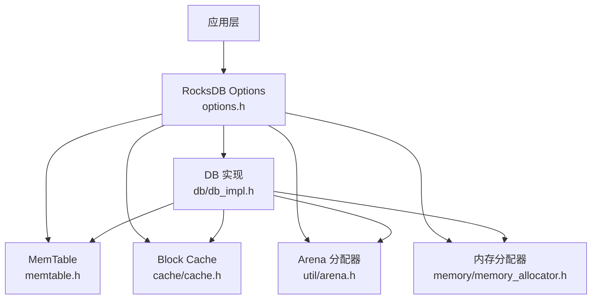
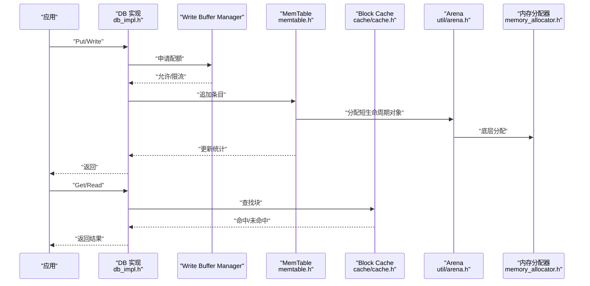
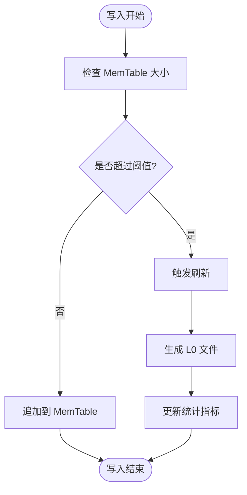
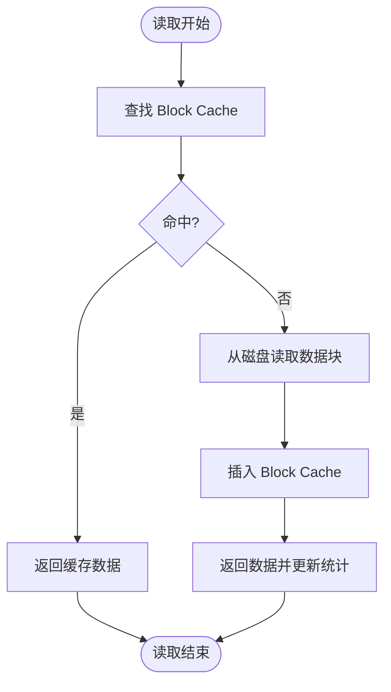
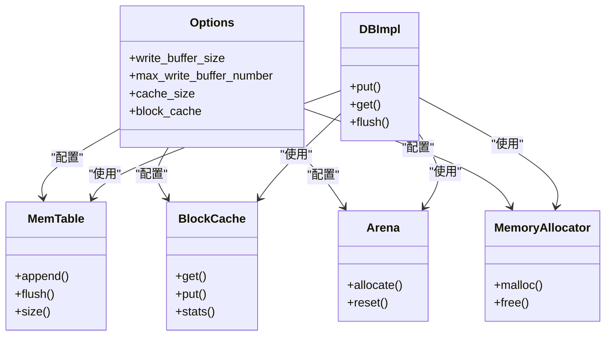

# 内存优化

<cite>
**本文引用的文件**   
- [rocksdb/include/rocksdb/options.h](file://source/rocksdb/include/rocksdb/options.h)
- [rocksdb/db/memtable.h](file://source/rocksdb/db/memtable.h)
- [rocksdb/cache/cache.h](file://source/rocksdb/cache/cache.h)
- [rocksdb/util/arena.h](file://source/rocksdb/util/arena.h)
- [rocksdb/memory/memory_allocator.h](file://source/rocksdb/memory/memory_allocator.h)
- [rocksdb/monitoring/metrics.h](file://source/rocksdb/monitoring/metrics.h)
- [rocksdb/db/db_impl.h](file://source/rocksdb/db/db_impl.h)
- [rocksdb/util/options_helper.cc](file://source/rocksdb/util/options_helper.cc)
</cite>

## 目录
1. [简介](#简介)
2. [项目结构](#项目结构)
3. [核心组件](#核心组件)
4. [架构总览](#架构总览)
5. [详细组件分析](#详细组件分析)
6. [依赖关系分析](#依赖关系分析)
7. [性能考量](#性能考量)
8. [故障排查指南](#故障排查指南)
9. [结论](#结论)
10. [附录](#附录)

## 简介
本指南面向在 RocksDB 上进行内存优化的工程师与运维人员，围绕 MemTable、Block Cache、Write Buffer Manager、Arena 分配器等关键内存子系统，提供参数调优策略、工作负载模板、监控指标与泄漏检测方法。文档内容基于仓库中的 RocksDB 源码与头文件定义进行提炼，确保可操作性与可追溯性。

## 项目结构
本项目包含多个数据库引擎与工具，但内存优化相关的关键实现集中在 RocksDB 子模块中：
- 选项与配置：include/rocksdb/options.h
- MemTable 实现：db/memtable.h
- Block Cache：cache/cache.h
- Arena 分配器：util/arena.h
- 内存分配器抽象：memory/memory_allocator.h
- 指标与监控：monitoring/metrics.h
- DB 实现入口（用于理解各组件协作）：db/db_impl.h
- 选项解析与默认值处理：util/options_helper.cc

图表来源 
- [rocksdb/include/rocksdb/options.h](file://source/rocksdb/include/rocksdb/options.h)
- [rocksdb/db/memtable.h](file://source/rocksdb/db/memtable.h)
- [rocksdb/cache/cache.h](file://source/rocksdb/cache/cache.h)
- [rocksdb/util/arena.h](file://source/rocksdb/util/arena.h)
- [rocksdb/memory/memory_allocator.h](file://source/rocksdb/memory/memory_allocator.h)
- [rocksdb/db/db_impl.h](file://source/rocksdb/db/db_impl.h)

章节来源
- [rocksdb/include/rocksdb/options.h](file://source/rocksdb/include/rocksdb/options.h)
- [rocksdb/db/memtable.h](file://source/rocksdb/db/memtable.h)
- [rocksdb/cache/cache.h](file://source/rocksdb/cache/cache.h)
- [rocksdb/util/arena.h](file://source/rocksdb/util/arena.h)
- [rocksdb/memory/memory_allocator.h](file://source/rocksdb/memory/memory_allocator.h)
- [rocksdb/db/db_impl.h](file://source/rocksdb/db/db_impl.h)

## 核心组件
- MemTable：写入路径的内存表，受 write_buffer_size、max_write_buffer_number 等参数控制，影响写放大、刷新频率与内存占用。
- Block Cache：读路径的数据块缓存，由 cache_size 或自定义 block_cache 决定命中率和内存使用。
- Write Buffer Manager：统一管控 MemTable 与 WAL 的内存配额，避免 OOM，保障稳定性。
- Arena 分配器：为短生命周期对象提供高效分配，减少碎片与系统调用开销。
- 内存分配器：底层分配策略（如 jemalloc/tcmalloc），影响分配速度与内存碎片。
- 指标与监控：通过 metrics 暴露内存用量、命中率、刷新次数等关键指标。

章节来源
- [rocksdb/db/memtable.h](file://source/rocksdb/db/memtable.h)
- [rocksdb/cache/cache.h](file://source/rocksdb/cache/cache.h)
- [rocksdb/util/arena.h](file://source/rocksdb/util/arena.h)
- [rocksdb/memory/memory_allocator.h](file://source/rocksdb/memory/memory_allocator.h)
- [rocksdb/monitoring/metrics.h](file://source/rocksdb/monitoring/metrics.h)

## 架构总览
下图展示写路径与读路径中内存组件的交互：写请求进入 MemTable，达到阈值后触发刷新；读请求经 Block Cache 加速；Arena 与内存分配器贯穿对象生命周期管理。

图表来源 
- [rocksdb/db/db_impl.h](file://source/rocksdb/db/db_impl.h)
- [rocksdb/db/memtable.h](file://source/rocksdb/db/memtable.h)
- [rocksdb/cache/cache.h](file://source/rocksdb/cache/cache.h)
- [rocksdb/util/arena.h](file://source/rocksdb/util/arena.h)
- [rocksdb/memory/memory_allocator.h](file://source/rocksdb/memory/memory_allocator.h)

## 详细组件分析

### MemTable 大小与刷新策略
- 关键参数
  - write_buffer_size：单个 MemTable 的大小上限，影响单次刷新的数据量与延迟。
  - max_write_buffer_number：最大并发 MemTable 数量，限制内存峰值与写放大。
- 调优要点
  - 写吞吐优先：增大 write_buffer_size 可减少刷新频率，降低写放大；需结合 max_write_buffer_number 控制内存峰值。
  - 低延迟优先：减小 write_buffer_size 可降低单次写入放大，但可能增加刷新次数与尾部延迟。
  - 热点键场景：适当提高 max_write_buffer_number 以容纳更多并发写入，避免阻塞。
- 复杂度与影响
  - MemTable 内部通常采用跳表等结构，插入均摊 O(1)，查询 O(log N)。
  - 刷新触发条件与阈值直接影响 I/O 压力与 CPU 占用。

章节来源
- [rocksdb/db/memtable.h](file://source/rocksdb/db/memtable.h)
- [rocksdb/include/rocksdb/options.h](file://source/rocksdb/include/rocksdb/options.h)

#### MemTable 刷新流程（概念图）

[此图为概念流程图，不直接映射具体代码文件]

### Block Cache 配置与优化
- 关键参数
  - cache_size：全局块缓存大小，建议设置为可用内存的合理比例。
  - block_cache：可替换为自定义 Cache 实例，支持更细粒度的控制与监控。
- 调优要点
  - 读密集型：增大 cache_size 提升命中率，减少磁盘 I/O。
  - 混合负载：结合 LRUCacheOptions 调整容量、淘汰策略与采样率。
  - 多实例隔离：通过不同 block_cache 实例隔离不同数据集或租户。
- 命中率与内存
  - 命中率越高，读延迟越低；过高可能导致频繁换入换出，需平衡容量与访问模式。

章节来源
- [rocksdb/cache/cache.h](file://source/rocksdb/cache/cache.h)
- [rocksdb/include/rocksdb/options.h](file://source/rocksdb/include/rocksdb/options.h)

#### Block Cache 读取流程（概念图）

[此图为概念流程图，不直接映射具体代码文件]

### Write Buffer Manager 使用方法与最佳实践
- 作用
  - 统一管理 MemTable 与 WAL 的内存配额，防止 OOM 与资源争用。
- 使用建议
  - 设置合理的 total_memory_quota，确保进程稳定运行。
  - 配合 rate limiter 控制写速率，避免突发流量导致抖动。
  - 监控配额使用率与等待时间，动态调整阈值。
- 典型问题
  - 配额过小导致频繁限流与写放大；过大则可能引发 OOM。

章节来源
- [rocksdb/include/rocksdb/options.h](file://source/rocksdb/include/rocksdb/options.h)
- [rocksdb/db/db_impl.h](file://source/rocksdb/db/db_impl.h)

### Arena 内存分配器的配置与性能影响
- 作用
  - 为短生命周期对象提供连续内存分配，减少系统调用与碎片。
- 配置要点
  - 合理设置 arena_block_size，平衡分配效率与内存浪费。
  - 在高并发写入时，Arena 能显著降低锁竞争与分配开销。
- 性能影响
  - 合适的 Arena 配置可降低 GC 压力与内存碎片，提升整体吞吐。

章节来源
- [rocksdb/util/arena.h](file://source/rocksdb/util/arena.h)

### 内存分配器选择与调优
- 常见选择
  - jemalloc、tcmalloc 等，具备更好的多线程分配性能与碎片控制。
- 调优建议
  - 根据工作负载特征选择分配器，并进行基准测试验证。
  - 监控分配失败与碎片率，必要时调整分配器参数。

章节来源
- [rocksdb/memory/memory_allocator.h](file://source/rocksdb/memory/memory_allocator.h)

### 监控指标与泄漏检测
- 关键指标
  - MemTable 大小与数量、Block Cache 命中率、Arena 分配统计、内存配额使用率。
- 监控方法
  - 通过 metrics 接口获取实时指标，结合外部监控系统进行告警。
- 泄漏检测
  - 使用内存分析工具（如 Valgrind、AddressSanitizer）定位异常增长。
  - 关注对象生命周期与释放路径，确保无悬挂引用。

章节来源
- [rocksdb/monitoring/metrics.h](file://source/rocksdb/monitoring/metrics.h)

## 依赖关系分析
RocksDB 的内存子系统通过 options 统一配置，各组件在 db_impl 中协调工作。下图展示主要依赖关系：

图表来源 
- [rocksdb/include/rocksdb/options.h](file://source/rocksdb/include/rocksdb/options.h)
- [rocksdb/db/memtable.h](file://source/rocksdb/db/memtable.h)
- [rocksdb/cache/cache.h](file://source/rocksdb/cache/cache.h)
- [rocksdb/util/arena.h](file://source/rocksdb/util/arena.h)
- [rocksdb/memory/memory_allocator.h](file://source/rocksdb/memory/memory_allocator.h)
- [rocksdb/db/db_impl.h](file://source/rocksdb/db/db_impl.h)

章节来源
- [rocksdb/include/rocksdb/options.h](file://source/rocksdb/include/rocksdb/options.h)
- [rocksdb/db/db_impl.h](file://source/rocksdb/db/db_impl.h)

## 性能考量
- 写路径优化
  - 增大 write_buffer_size 减少刷新频率，但需评估内存峰值。
  - 合理设置 max_write_buffer_number 避免过多并发 MemTable。
- 读路径优化
  - 调整 cache_size 提升命中率，避免过度占用内存。
  - 使用自定义 block_cache 实现特定淘汰策略。
- 分配器选择
  - 高并发场景优先选择 jemalloc/tcmalloc。
  - 监控分配失败与碎片率，及时调整。

[本节为通用指导，无需特定文件来源]

## 故障排查指南
- 常见问题
  - OOM：检查 write_buffer_size 与 max_write_buffer_number 是否过大。
  - 高延迟：确认 Block Cache 命中率与 MemTable 刷新频率。
  - 内存泄漏：使用内存分析工具定位未释放对象。
- 诊断步骤
  - 收集 metrics 指标，观察内存使用趋势。
  - 分析写放大与刷新日志，定位瓶颈。
  - 逐步调整参数并验证效果。

章节来源
- [rocksdb/monitoring/metrics.h](file://source/rocksdb/monitoring/metrics.h)
- [rocksdb/include/rocksdb/options.h](file://source/rocksdb/include/rocksdb/options.h)

## 结论
通过合理配置 MemTable、Block Cache、Write Buffer Manager 与 Arena，可在不同工作负载下实现内存使用的最优平衡。结合监控指标与泄漏检测方法，可有效识别与解决内存相关问题。建议在生产环境中持续监控与调优，确保系统稳定与高性能。

[本节为总结性内容，无需特定文件来源]

## 附录
- 工作负载模板
  - 写密集型：增大 write_buffer_size，适度提高 max_write_buffer_number，启用高效分配器。
  - 读密集型：增大 cache_size，优化 Block Cache 淘汰策略。
  - 混合负载：平衡 MemTable 与 Block Cache 大小，监控命中率与刷新频率。
- 推荐值参考
  - 根据可用内存与工作负载特征，逐步调整参数并验证效果。
  - 使用基准测试工具评估不同配置下的性能表现。

[本节为通用指导，无需特定文件来源]