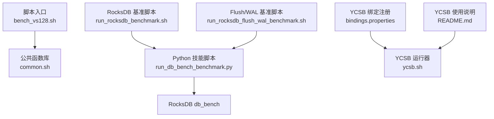
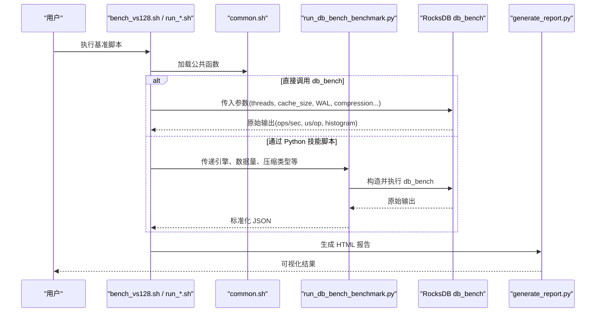
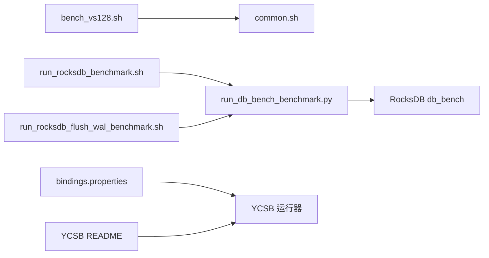

# 工作负载特定配置

<cite>
**本文引用的文件**   
- [YCSB README](file://source/YCSB/README.md)
- [bindings.properties](file://source/YCSB/bin/bindings.properties)
- [common.sh](file://script/common.sh)
- [bench_vs128.sh](file://script/bench_vs128.sh)
- [run_rocksdb_benchmark.sh](file://script/run_rocksdb_benchmark.sh)
- [run_rocksdb_flush_wal_benchmark.sh](file://script/run_rocksdb_flush_wal_benchmark.sh)
</cite>

## 目录
1. [简介](#简介)
2. [项目结构](#项目结构)
3. [核心组件](#核心组件)
4. [架构总览](#架构总览)
5. [详细组件分析](#详细组件分析)
6. [依赖关系分析](#依赖关系分析)
7. [性能考量](#性能考量)
8. [故障排查指南](#故障排查指南)
9. [结论](#结论)
10. [附录](#附录)

## 简介
本文件面向不同工作负载（读多写少、写多读少、混合、大规模数据处理）提供专门的工作负载配置模板与优化指南。结合仓库中的基准脚本与工具链，给出可操作的参数建议、调优路径与容量规划方法，帮助读者在 RocksDB 与 YCSB 生态下快速落地实践。

## 项目结构
仓库包含三类关键内容：
- 基准测试脚本：用于驱动 RocksDB db_bench 的批量压测与结果汇总
- YCSB 绑定与说明：用于以统一接口对多种数据库进行工作负载建模与执行
- 通用工具函数：封装了解析输出、计算吞吐、采集硬件信息、生成 JSON 报告等能力

图表来源 
- [bench_vs128.sh:1-10](file://script/bench_vs128.sh#L1-L10)
- [common.sh:1-196](file://script/common.sh#L1-L196)
- [run_rocksdb_benchmark.sh:1-50](file://script/run_rocksdb_benchmark.sh#L1-L50)
- [run_rocksdb_flush_wal_benchmark.sh:1-50](file://script/run_rocksdb_flush_wal_benchmark.sh#L1-L50)
- [bindings.properties:1-77](file://source/YCSB/bin/bindings.properties#L1-L77)
- [YCSB README:1-135](file://source/YCSB/README.md#L1-L135)

章节来源
- [bench_vs128.sh:1-10](file://script/bench_vs128.sh#L1-L10)
- [common.sh:1-196](file://script/common.sh#L1-L196)
- [run_rocksdb_benchmark.sh:1-50](file://script/run_rocksdb_benchmark.sh#L1-L50)
- [run_rocksdb_flush_wal_benchmark.sh:1-50](file://script/run_rocksdb_flush_wal_benchmark.sh#L1-L50)
- [bindings.properties:1-77](file://source/YCSB/bin/bindings.properties#L1-L77)
- [YCSB README:1-135](file://source/YCSB/README.md#L1-L135)

## 核心组件
- 公共基准函数库 common.sh
  - 负责解析 db_bench 输出、计算吞吐与尾部延迟、采集硬件信息、生成结构化 JSON 结果
  - 默认参数包括 key_size、num_ops、compression_type、threads、write_buffer_size、seed、cache_size、WAL 开关等
- 值大小维度基准脚本 bench_vs128.sh
  - 调用 run_bench 对指定 value_size 执行 fillrandom 与 readrandom 两阶段压测
- RocksDB 基准脚本 run_rocksdb_benchmark.sh
  - 通过 Python 技能脚本统一驱动 db_bench，并生成 HTML 报告
- Flush/WAL 专项基准脚本 run_rocksdb_flush_wal_benchmark.sh
  - 针对 RocksDB-Flush-WAL 变体执行相同流程，便于对比
- YCSB 绑定与使用
  - bindings.properties 声明各数据库绑定类名
  - README 提供运行方式、百分位统计与 HDR 直方图处理建议

章节来源
- [common.sh:1-196](file://script/common.sh#L1-L196)
- [bench_vs128.sh:1-10](file://script/bench_vs128.sh#L1-L10)
- [run_rocksdb_benchmark.sh:1-50](file://script/run_rocksdb_benchmark.sh#L1-L50)
- [run_rocksdb_flush_wal_benchmark.sh:1-50](file://script/run_rocksdb_flush_wal_benchmark.sh#L1-L50)
- [bindings.properties:1-77](file://source/YCSB/bin/bindings.properties#L1-L77)
- [YCSB README:1-135](file://source/YCSB/README.md#L1-L135)

## 架构总览
下图展示了从脚本入口到 RocksDB db_bench 的执行链路，以及 YCSB 绑定的角色定位。

图表来源 
- [bench_vs128.sh:1-10](file://script/bench_vs128.sh#L1-L10)
- [common.sh:1-196](file://script/common.sh#L1-L196)
- [run_rocksdb_benchmark.sh:1-50](file://script/run_rocksdb_benchmark.sh#L1-L50)
- [run_rocksdb_flush_wal_benchmark.sh:1-50](file://script/run_rocksdb_flush_wal_benchmark.sh#L1-L50)

## 详细组件分析

### 读多写少场景配置策略（缓存命中率与压缩算法）
目标
- 提升读吞吐与降低读延迟
- 提高缓存命中率，减少磁盘访问
- 选择合适压缩算法平衡 CPU 与 IO

关键参数与建议
- 缓存与内存
  - cache_size：根据热点数据集大小设置，尽量使热数据常驻内存
  - write_buffer_size：控制 MemTable 大小，避免频繁 flush 影响读放大
- 压缩算法
  - none：读延迟最低，CPU 占用低，适合纯读或读远大于写的场景
  - snappy/zstd：在可读性与压缩率之间折中；zstd 压缩率更高但 CPU 开销更大
- WAL
  - disable_wal=false：保持持久化语义；若读多写少且允许丢失少量写入，可考虑关闭以提升读性能
- 线程与并发
  - threads：按 CPU 核数与磁盘队列深度调整，避免过度并行导致抖动
- 统计与直方图
  - statistics=true, histogram=true：观察 P99/P99.9 尾部延迟，指导缓存与压缩调优

参考实现位置
- 公共函数中默认参数与 db_bench 调用参数
- YCSB README 关于百分位与 HDR 直方图的说明

章节来源
- [common.sh:1-196](file://script/common.sh#L1-L196)
- [YCSB README:1-135](file://source/YCSB/README.md#L1-L135)

### 写多读少场景调优（WAL 与 Flush 策略）
目标
- 最大化写入吞吐，降低写放大
- 合理设置 WAL 与 flush 频率，避免阻塞写入路径

关键参数与建议
- WAL
  - disable_wal=false：确保崩溃恢复；若极致吞吐优先且可接受数据丢失风险，可评估关闭
  - WAL 文件大小与同步策略：增大 WAL 文件可减少 fsync 次数，提升吞吐
- Flush 策略
  - write_buffer_size：增大以减少 MemTable 切换与 flush 频率
  - level_compaction_style：配合 flush 频率控制 LSM 层级合并节奏
- 压缩
  - 写入路径可选择更快的压缩（如 snappy），或在后台异步压缩以降低写时 CPU 压力
- 并发与限流
  - threads：适度增加并行度，同时关注磁盘队列与 CPU 利用率
  - rate limiter：在高并发写入时限制速率，避免抖尾

参考实现位置
- 公共函数中 write_buffer_size、disable_wal、statistics/histogram 的使用
- 专项脚本 run_rocksdb_flush_wal_benchmark.sh 用于对比不同版本/配置的 Flush/WAL 行为

章节来源
- [common.sh:1-196](file://script/common.sh#L1-L196)
- [run_rocksdb_flush_wal_benchmark.sh:1-50](file://script/run_rocksdb_flush_wal_benchmark.sh#L1-L50)

### 混合工作负载的平衡配置（资源分配与优先级）
目标
- 在读写比例接近的场景下取得稳定吞吐与延迟
- 合理分配内存与 IO 资源，避免写放大与读放大叠加

关键参数与建议
- 内存分配
  - cache_size：为热点读预留足够空间
  - write_buffer_size：平衡写入缓冲与 flush 频率
- 压缩与合并
  - 压缩算法：snappy 作为默认折中；若读放大明显，可降低压缩强度
  - compaction 策略：避免写放大过高，必要时引入分区或分桶
- 优先级与隔离
  - 将读与写任务分配到不同线程池或进程，避免相互抢占
  - 使用 YCSB 的 workload 定义读写比例，动态调整客户端并发

参考实现位置
- 公共函数中 threads、cache_size、compression_type 的统一设置
- YCSB bindings.properties 支持多种后端，便于在不同系统上验证混合负载

章节来源
- [common.sh:1-196](file://script/common.sh#L1-L196)
- [bindings.properties:1-77](file://source/YCSB/bin/bindings.properties#L1-L77)

### 大规模数据处理配置模板（分片与负载均衡）
目标
- 支撑海量数据的写入与读取
- 通过分片与负载均衡提升整体吞吐与可扩展性

关键参数与建议
- 分片策略
  - 按 key 前缀或哈希分片，保证均匀分布
  - 每个分片独立 MemTable 与 SST 文件，避免热点单点
- 负载均衡
  - 客户端侧分片路由，避免单节点过载
  - 服务端侧水平扩展，结合一致性哈希或范围分片
- 监控与容量规划
  - 基于空间放大率与吞吐曲线，估算磁盘与内存需求
  - 持续观测 P99/P99.9 延迟，识别瓶颈

参考实现位置
- 基准脚本输出包含 space_amplification、throughput、latency 等指标，可用于容量规划
- YCSB README 提供多实例与直方图合并的方法，辅助分布式评估

章节来源
- [common.sh:1-196](file://script/common.sh#L1-L196)
- [YCSB README:1-135](file://source/YCSB/README.md#L1-L135)

### 不同数据规模下的性能基准与容量规划
目标
- 建立从小到大的性能基线，指导扩容与资源配置
- 依据吞吐与延迟曲线制定容量计划

关键步骤
- 多值大小基准
  - 使用 bench_vs128.sh 等脚本覆盖典型 value_size 集合
  - 记录 fill 与 read 的 MB/s、us/op、P99 延迟
- 容量估算
  - 逻辑数据量 = num_keys × (key_size + value_size)
  - 空间放大率 = 实际磁盘占用 / 逻辑数据量
  - 内存需求 ≈ cache_size + write_buffer_size × 并发度
- 报告与可视化
  - 通过 generate_report.py 生成 HTML 报告，便于横向对比

参考实现位置
- common.sh 中 parse_us_per_op、parse_ops_per_sec、calc_mbps、collect_hw_json 等函数
- run_rocksdb_benchmark.sh 与 run_rocksdb_flush_wal_benchmark.sh 的报告生成流程

章节来源
- [bench_vs128.sh:1-10](file://script/bench_vs128.sh#L1-L10)
- [common.sh:1-196](file://script/common.sh#L1-L196)
- [run_rocksdb_benchmark.sh:1-50](file://script/run_rocksdb_benchmark.sh#L1-L50)
- [run_rocksdb_flush_wal_benchmark.sh:1-50](file://script/run_rocksdb_flush_wal_benchmark.sh#L1-L50)

### 工作负载特征分析与自适应配置
目标
- 基于运行时指标自动调整参数，适应动态变化
- 构建闭环优化：采集→分析→决策→应用

关键思路
- 指标采集
  - 吞吐、延迟（P99/P99.9）、空间放大率、GPU/CPU/内存利用率
- 分析模型
  - 阈值触发：当 P99 超过阈值或空间放大率异常升高时触发重配
  - 回归预测：基于历史数据预测最优 cache_size 与 write_buffer_size
- 自适应策略
  - 动态调整 threads、cache_size、compression_type
  - 在写多读少时增大 write_buffer_size，在读多写少时增大 cache_size

参考实现位置
- common.sh 的硬件采样与 JSON 输出可作为自动化采集基础
- YCSB README 的 HDR 直方图处理可用于更精细的延迟分析

章节来源
- [common.sh:1-196](file://script/common.sh#L1-L196)
- [YCSB README:1-135](file://source/YCSB/README.md#L1-L135)

## 依赖关系分析
- 脚本层依赖
  - bench_vs128.sh 依赖 common.sh 提供的 run_bench 与解析函数
  - run_rocksdb_benchmark.sh 与 run_rocksdb_flush_wal_benchmark.sh 依赖 Python 技能脚本与 db_bench
- YCSB 层依赖
  - bindings.properties 声明各数据库绑定类，供 YCSB 运行器加载
  - README 提供运行方法与统计建议

图表来源 
- [bench_vs128.sh:1-10](file://script/bench_vs128.sh#L1-L10)
- [common.sh:1-196](file://script/common.sh#L1-L196)
- [run_rocksdb_benchmark.sh:1-50](file://script/run_rocksdb_benchmark.sh#L1-L50)
- [run_rocksdb_flush_wal_benchmark.sh:1-50](file://script/run_rocksdb_flush_wal_benchmark.sh#L1-L50)
- [bindings.properties:1-77](file://source/YCSB/bin/bindings.properties#L1-L77)
- [YCSB README:1-135](file://source/YCSB/README.md#L1-L135)

章节来源
- [bench_vs128.sh:1-10](file://script/bench_vs128.sh#L1-L10)
- [common.sh:1-196](file://script/common.sh#L1-L196)
- [run_rocksdb_benchmark.sh:1-50](file://script/run_rocksdb_benchmark.sh#L1-L50)
- [run_rocksdb_flush_wal_benchmark.sh:1-50](file://script/run_rocksdb_flush_wal_benchmark.sh#L1-L50)
- [bindings.properties:1-77](file://source/YCSB/bin/bindings.properties#L1-L77)
- [YCSB README:1-135](file://source/YCSB/README.md#L1-L135)

## 性能考量
- 读多写少
  - 优先提升缓存命中率，选择合适的压缩算法，降低读放大
- 写多读少
  - 优化 WAL 与 flush 策略，减少 fsync 与合并开销
- 混合负载
  - 平衡内存与 IO，避免写放大与读放大叠加
- 大规模数据
  - 分片与负载均衡，持续监控空间放大率与延迟分布

[本节为通用指导，不直接分析具体文件]

## 故障排查指南
- 输出解析失败
  - 检查 db_bench 输出格式是否与 parse_us_per_op/parse_ops_per_sec 匹配
- 吞吐异常低
  - 确认 threads、cache_size、write_buffer_size 是否合理
  - 检查压缩算法是否过强导致 CPU 瓶颈
- WAL 相关
  - 若写入延迟高，评估 WAL 同步策略与文件大小
  - 在允许数据丢失的前提下，尝试关闭 WAL 对比效果
- 直方图与百分位
  - 使用 YCSB README 推荐的 HDR 工具合并与提取百分位，避免平均值的误导

章节来源
- [common.sh:1-196](file://script/common.sh#L1-L196)
- [YCSB README:1-135](file://source/YCSB/README.md#L1-L135)

## 结论
通过仓库中的基准脚本与工具链，可以为不同工作负载提供可操作、可复现的配置模板与优化路径。读多写少侧重缓存与压缩，写多读少聚焦 WAL 与 flush，混合负载需平衡资源与优先级，大规模数据则强调分片与负载均衡。借助统一的采集与报告机制，可实现从基准到容量规划的闭环优化。

[本节为总结性内容，不直接分析具体文件]

## 附录
- 常用参数速查
  - cache_size：读缓存大小
  - write_buffer_size：MemTable 大小
  - compression_type：压缩算法（none/snappy/zstd）
  - threads：并发线程数
  - disable_wal：是否禁用 WAL
  - statistics/histogram：开启统计与直方图
- 基准执行建议
  - 先跑小数据量验证参数，再逐步放大
  - 记录 P99/P99.9 延迟与空间放大率，形成基线

[本节为补充信息，不直接分析具体文件]