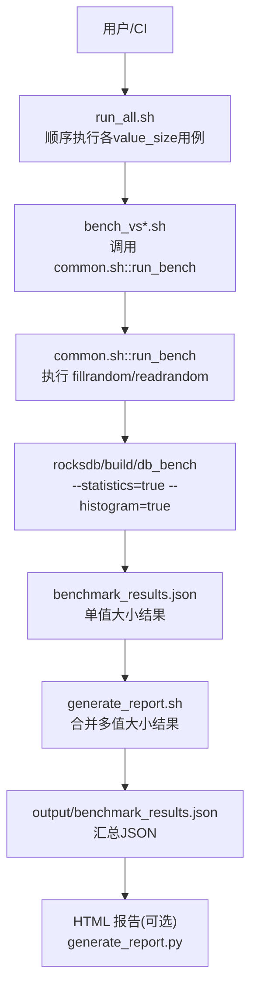
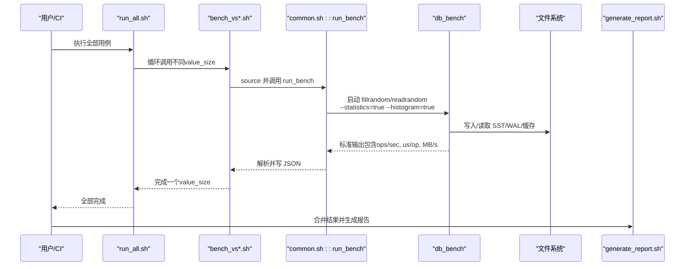
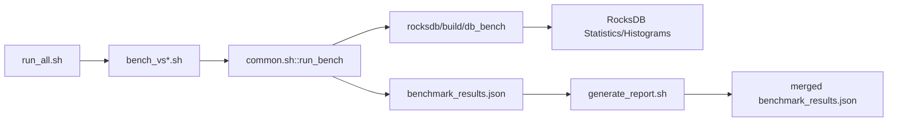

# 性能监控

<cite>
**本文引用的文件**   
- [YCSB/README.md](file://source/YCSB/README.md)
- [common.sh](file://script/common.sh)
- [generate_report.sh](file://script/generate_report.sh)
- [run_rocksdb_benchmark.sh](file://script/run_rocksdb_benchmark.sh)
- [bench_vs128.sh](file://script/bench_vs128.sh)
- [run_all.sh](file://script/run_all.sh)
- [run_rfw_benchmark.py](file://script/run_rfw_benchmark.py)
- [statistics.h](file://source/rocksdb/include/rocksdb/statistics.h)
</cite>

## 目录
1. [简介](#简介)
2. [项目结构](#项目结构)
3. [核心组件](#核心组件)
4. [架构总览](#架构总览)
5. [详细组件分析](#详细组件分析)
6. [依赖关系分析](#依赖关系分析)
7. [性能考量](#性能考量)
8. [故障排查指南](#故障排查指南)
9. [结论](#结论)
10. [附录](#附录)

## 简介
本指南面向 RocksDB 与相关基准工具的性能监控与分析，覆盖关键指标（QPS、延迟、吞吐）、实时监控与外部集成、慢查询与热点识别、基线与回归检测、告警规则与自动化流程，以及常见问题诊断策略。内容基于仓库中的脚本与 RocksDB 统计接口实现，确保可落地执行与复现。

## 项目结构
本项目围绕 RocksDB 的 db_bench 与自定义脚本构建了一套端到端的性能采集与报告体系：
- 脚本层：统一参数解析、硬件信息采集、db_bench 调用、结果解析与 JSON 输出、HTML 报告生成。
- 数据层：按 value_size 维度产出 benchmark_results.json，并合并为汇总结果。
- 引擎层：RocksDB statistics/histogram 提供细粒度计数器与时序分布，用于深入分析。

**图表来源** 
- [run_all.sh:1-19](file://script/run_all.sh#L1-L19)
- [bench_vs128.sh:1-10](file://script/bench_vs128.sh#L1-L10)
- [common.sh:68-196](file://script/common.sh#L68-L196)
- [generate_report.sh:1-59](file://script/generate_report.sh#L1-L59)

**章节来源**
- [run_all.sh:1-19](file://script/run_all.sh#L1-L19)
- [bench_vs128.sh:1-10](file://script/bench_vs128.sh#L1-L10)
- [common.sh:68-196](file://script/common.sh#L68-L196)
- [generate_report.sh:1-59](file://script/generate_report.sh#L1-L59)

## 核心组件
- 统一运行器与公共函数
  - run_all.sh：顺序触发不同 value_size 的基准测试。
  - bench_vs*.sh：针对特定 value_size 的入口脚本，调用 common.sh 的 run_bench。
  - common.sh：封装 db_bench 调用、参数、日志解析、MB/s 换算、GPU 采样、空间放大率计算与 JSON 输出。
- 结果聚合与报告
  - generate_report.sh：合并多个 value_size 的结果，打印摘要表，输出汇总 JSON。
  - 可选 HTML 报告：通过 generate_report.py（由 Python 脚本调用）生成可视化报告。
- 扩展场景
  - run_rfw_benchmark.py：支持 rocksdb-flush-wal 变体，覆盖随机/顺序/混合读写场景，输出结构化 JSON 与 HTML。

**章节来源**
- [run_all.sh:1-19](file://script/run_all.sh#L1-L19)
- [bench_vs128.sh:1-10](file://script/bench_vs128.sh#L1-L10)
- [common.sh:16-196](file://script/common.sh#L16-L196)
- [generate_report.sh:1-59](file://script/generate_report.sh#L1-L59)
- [run_rfw_benchmark.py:1-311](file://script/run_rfw_benchmark.py#L1-L311)

## 架构总览
下图展示了从命令行到 RocksDB 引擎再到结果落盘的完整链路，包括指标采集点与产物位置。

**图表来源** 
- [run_all.sh:1-19](file://script/run_all.sh#L1-L19)
- [bench_vs128.sh:1-10](file://script/bench_vs128.sh#L1-L10)
- [common.sh:68-196](file://script/common.sh#L68-L196)
- [generate_report.sh:1-59](file://script/generate_report.sh#L1-L59)

## 详细组件分析

### 指标定义与采集
- QPS（ops/sec）
  - 来源：db_bench 输出行中 “ops/sec” 字段；脚本 parse_ops_per_sec 提取。
  - 用途：衡量吞吐能力，结合 value_size 换算 MB/s。
- 延迟（us/op）
  - 来源：db_bench 输出行中 “micros/op” 字段；脚本 parse_us_per_op 提取。
  - 用途：评估请求时延，尾延迟可按 us/op × 1.5 估算。
- 吞吐（MB/s）
  - 公式：MB/s = ops/sec × (key_size + value_size) / (1024×1024)。
  - 用途：反映实际带宽利用情况，便于跨规模对比。
- 空间放大率（space_amplification）
  - 计算：db_dir 磁盘占用 / 逻辑字节数（num_keys × (key_size + value_size)）。
  - 用途：评估存储膨胀程度，辅助调优压缩与 compaction。
- GPU 指标（可选）
  - 采集：nvidia-smi 查询利用率与显存使用。
  - 用途：在 GPU 加速路径下观察资源占用。

**章节来源**
- [common.sh:16-39](file://script/common.sh#L16-L39)
- [common.sh:41-66](file://script/common.sh#L41-L66)
- [common.sh:117-125](file://script/common.sh#L117-L125)
- [common.sh:156-189](file://script/common.sh#L156-L189)

### 实时监控与外部集成
- 内置统计接口（RocksDB）
  - 启用方式：db_bench 启动时添加 --statistics=true --histogram=true。
  - 指标类型：
    - Tickers：累计计数器（如 BYTES_WRITTEN、BYTES_READ、STALL_MICROS、WAL_FILE_BYTES 等）。
    - Histograms：延迟与时序分布（如 DB_GET、DB_WRITE、COMPACTION_TIME、SST_READ_MICROS 等）。
  - 级别控制：StatsLevel 可裁剪开销（kExceptTimers、kAll 等）。
- 外部监控集成建议
  - 将 benchmark_results.json 推送至时序数据库（如 Prometheus/Grafana），以 value_size、engine、timestamp 为标签。
  - 对 QPS、延迟、MB/s、space_amplification 建立面板与告警。
  - 若需更细粒度，可在 RocksDB 侧导出统计快照（statistics_impl.h/in_memory_stats_history/persistent_stats_history）并接入采集器。

**章节来源**
- [statistics.h:31-604](file://source/rocksdb/include/rocksdb/statistics.h#L31-L604)
- [statistics.h:621-756](file://source/rocksdb/include/rocksdb/statistics.h#L621-L756)
- [statistics.h:774-797](file://source/rocksdb/include/rocksdb/statistics.h#L774-L797)

### 性能分析工具用法
- 慢查询分析
  - 关注 Histograms 中的 DB_GET、DB_WRITE、FILE_READ_*、SST_READ_MICROS 等，定位长尾来源。
  - 结合 stalls（STALL_MICROS）、WAL 同步（WAL_FILE_SYNC_MICROS）判断阻塞点。
- 热点数据识别
  - 通过 BLOCK_CACHE_HIT/MISS、READ_AMP_* 评估缓存命中与读放大。
  - 使用 LAST_LEVEL_SEEK_* 与非最后层 Seek 统计，识别扫描热点与过滤效果。
- 吞吐瓶颈定位
  - 比较 MB/s 与磁盘/网络带宽上限，检查 compression/decompression 时间（COMPRESSION_TIMES_NANOS）。
  - 观察 COMPACT_READ_BYTES/COMPACT_WRITE_BYTES 与 FLUSH_WRITE_BYTES，评估后台任务影响。

**章节来源**
- [statistics.h:31-604](file://source/rocksdb/include/rocksdb/statistics.h#L31-L604)
- [statistics.h:621-756](file://source/rocksdb/include/rocksdb/statistics.h#L621-L756)

### 基线建立与回归检测
- 基线建立
  - 固定 key_size=20、value_size∈{32,128,512,1024,4096,16384}，NUM_OPS=1M，threads=1，compression=none。
  - 运行 run_all.sh 或 run_rfw_benchmark.py，保存 benchmark_results.json 作为基线。
- 回归检测
  - 每次变更重新运行，对比 QPS、us/op、MB/s、space_amplification 相对基线的变化。
  - 阈值建议：QPS 下降 >5%、P99 延迟上升 >10%、MB/s 下降 >5% 触发回归告警。
  - 自动比对：在 CI 中解析 JSON 并输出 diff 报告。

**章节来源**
- [common.sh:5-13](file://script/common.sh#L5-L13)
- [run_all.sh:1-19](file://script/run_all.sh#L1-L19)
- [run_rfw_benchmark.py:22-31](file://script/run_rfw_benchmark.py#L22-L31)

### 告警规则配置与自动化流程
- 指标与阈值
  - QPS：低于基线 95% 告警。
  - 延迟：us/op 超过基线 110% 告警。
  - 吞吐：MB/s 低于基线 95% 告警。
  - 空间放大率：高于基线 10% 告警。
- 自动化流程
  - CI 触发 run_all.sh 或 run_rfw_benchmark.py。
  - 解析 JSON，计算同比/环比，生成报告并推送告警。
  - 保留历史 JSON 用于趋势分析与回溯。

[本节为通用实践说明，不直接分析具体文件]

### 常见性能问题诊断流程
- 现象：QPS 下降但 MB/s 稳定
  - 可能原因：CPU 密集（压缩/解压）、锁竞争（STALL_MICROS）、WAL 同步频繁。
  - 排查：查看 COMPRESSION_TIMES_NANOS、STALL_MICROS、WAL_FILE_BYTES。
- 现象：延迟尖刺
  - 可能原因：Compaction 突发、GC 回收、IO 抖动。
  - 排查：COMPACTION_TIME、FLUSH_TIME、BLOCK_CHECKSUM_MISMATCH_COUNT。
- 现象：空间放大率升高
  - 可能原因：压缩比低、碎片化、TTL 过期键堆积。
  - 排查：BYTES_COMPRESSED_FROM/TO、MEMTABLE_GARBAGE_BYTES_AT_FLUSH。

[本节为通用实践说明，不直接分析具体文件]

## 依赖关系分析
脚本与 RocksDB 的依赖关系如下：

**图表来源** 
- [run_all.sh:1-19](file://script/run_all.sh#L1-L19)
- [bench_vs128.sh:1-10](file://script/bench_vs128.sh#L1-L10)
- [common.sh:68-196](file://script/common.sh#L68-L196)
- [generate_report.sh:1-59](file://script/generate_report.sh#L1-L59)

**章节来源**
- [run_all.sh:1-19](file://script/run_all.sh#L1-L19)
- [bench_vs128.sh:1-10](file://script/bench_vs128.sh#L1-L10)
- [common.sh:68-196](file://script/common.sh#L68-L196)
- [generate_report.sh:1-59](file://script/generate_report.sh#L1-L59)

## 性能考量
- 指标不可平均：延迟百分位不能简单平均，应使用直方图合并与分位提取。
- 多实例合并：YCSB 支持 HDR 直方图合并，适合多加载器场景。
- 统计开销：按需选择 StatsLevel，避免在高并发写路径引入额外开销。
- 硬件差异：记录 CPU、内存、GPU、内核与 OS，确保可比性。

**章节来源**
- [YCSB/README.md:82-135](file://source/YCSB/README.md#L82-L135)
- [statistics.h:774-797](file://source/rocksdb/include/rocksdb/statistics.h#L774-L797)

## 故障排查指南
- 常见问题
  - db_bench 二进制缺失：确认 LD_LIBRARY_PATH 与路径设置。
  - 输出解析失败：检查 RocksDB 输出格式是否匹配正则表达式。
  - 超时：适当增加 timeout，或降低 NUM_OPS。
  - GPU 信息为空：确认 nvidia-smi 可用且权限正确。
- 处理步骤
  - 清理临时目录后重试。
  - 单独运行单个 value_size 用例定位问题。
  - 查看 benchmark_results.json 与 stdout 日志。

**章节来源**
- [run_rocksdb_benchmark.sh:1-50](file://script/run_rocksdb_benchmark.sh#L1-L50)
- [run_rfw_benchmark.py:71-79](file://script/run_rfw_benchmark.py#L71-L79)
- [run_rfw_benchmark.py:206-215](file://script/run_rfw_benchmark.py#L206-L215)

## 结论
通过统一的脚本链路与 RocksDB 统计接口，本项目实现了从数据采集、解析、合并到报告生成的完整闭环。借助 QPS、延迟、吞吐与空间放大率等核心指标，配合直方图与计数器，可有效定位慢查询与热点，建立基线并进行回归检测。建议在 CI 中固化流程，结合外部监控系统形成持续性能保障。

## 附录
- 快速命令参考
  - 运行全部用例：bash script/run_all.sh
  - 运行 RocksDB 2GB 基准：bash script/run_rocksdb_benchmark.sh
  - 运行 flush-wal 多场景：python3 script/run_rfw_benchmark.py
  - 合并结果并生成摘要：bash script/generate_report.sh

[本节为操作指引，不直接分析具体文件]