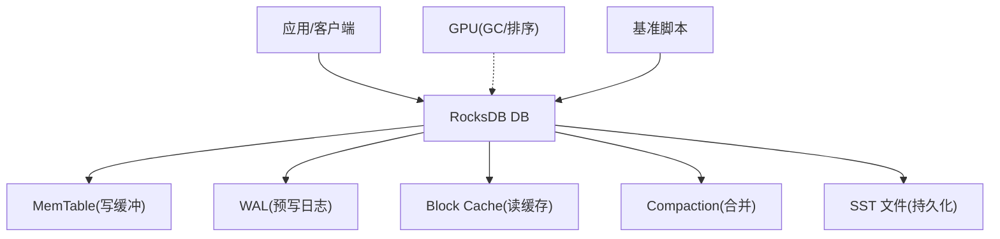
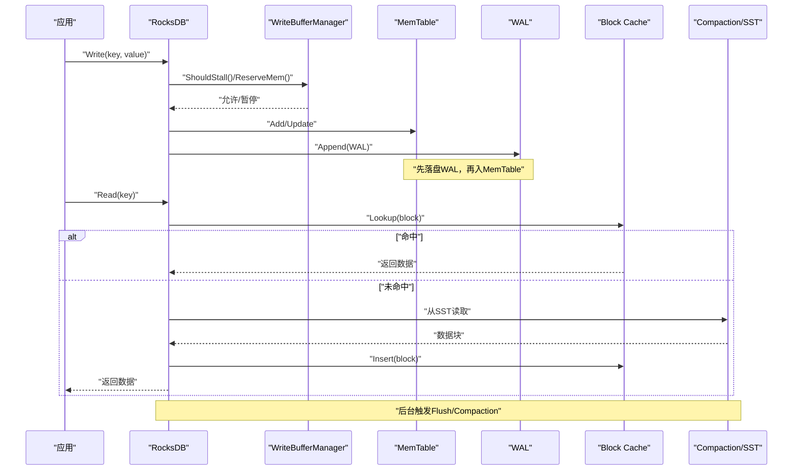
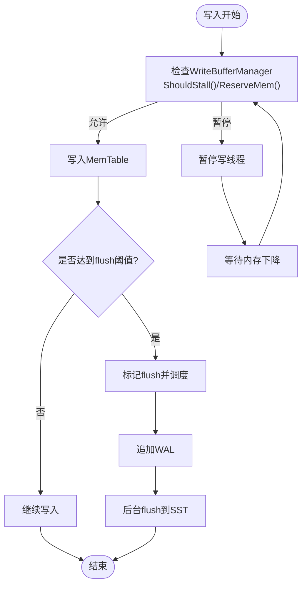
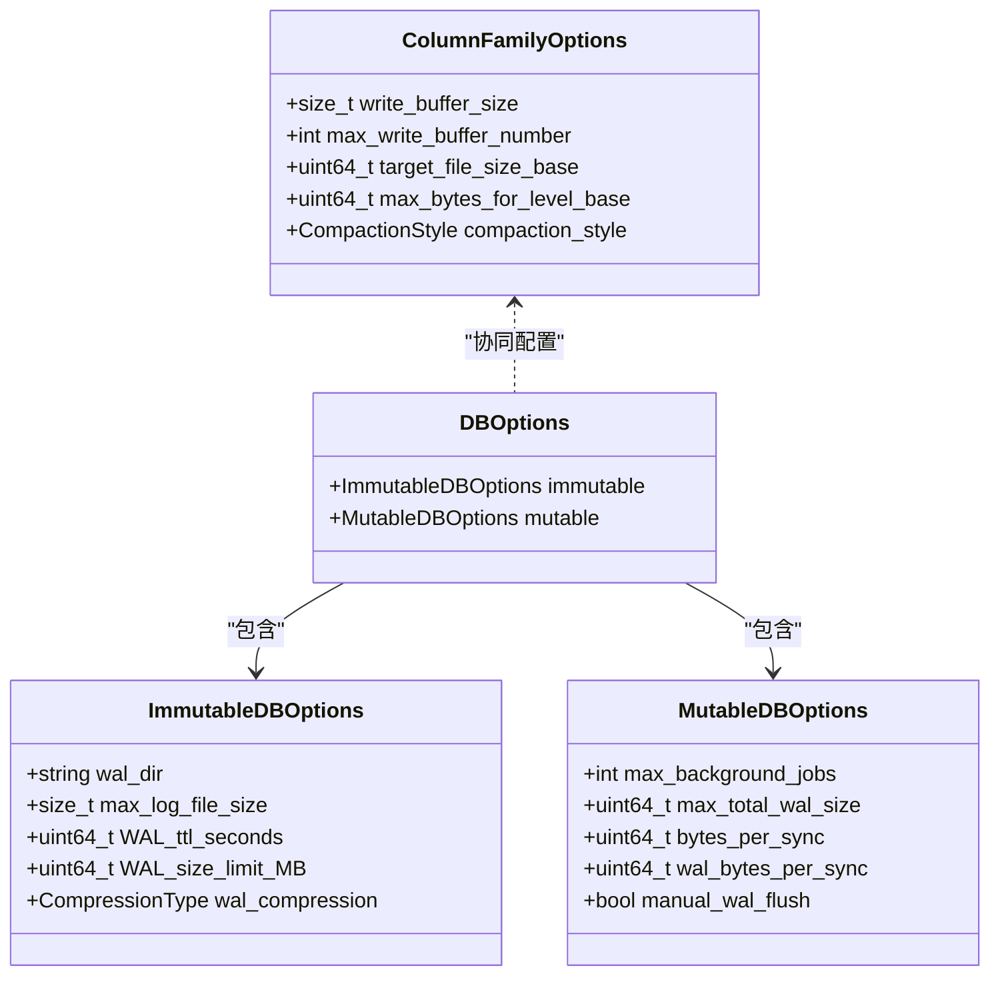
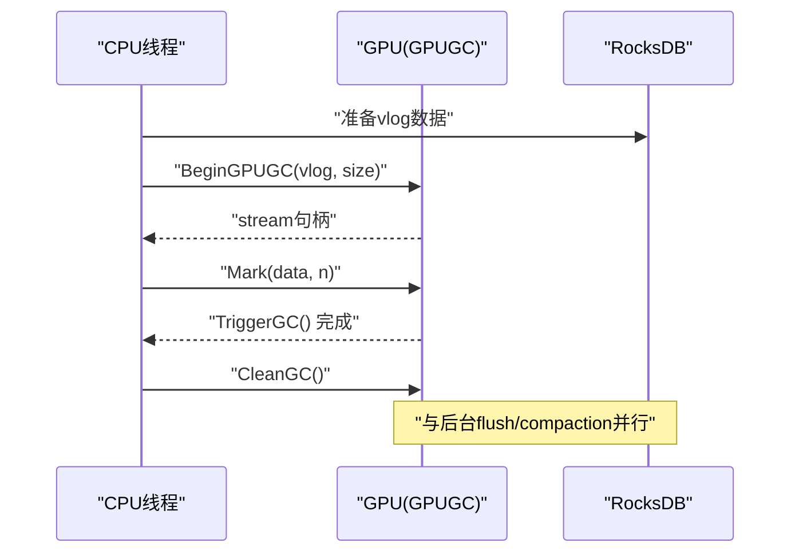
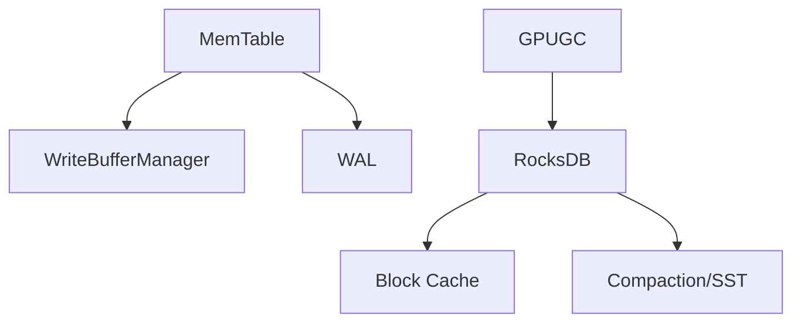

# 性能调优

<cite>
**本文引用的文件**   
- [options.cc](file://source/rocksdb/options/options.cc)
- [memtable.h](file://source/rocksdb/db/memtable.h)
- [cache.h](file://source/rocksdb/include/rocksdb/cache.h)
- [db_options.h](file://source/rocksdb/options/db_options.h)
- [write_buffer_manager.h](file://source/rocksdb/include/rocksdb/write_buffer_manager.h)
- [run_rocksdb_benchmark.sh](file://source/script/run_rocksdb_benchmark.sh)
- [bench_vs1024.sh](file://source/script/bench_vs1024.sh)
- [gpu_gc.h](file://source/gParaKV-GC-master/db/gpu_gc.h)
</cite>

## 目录
1. [简介](#简介)
2. [项目结构](#项目结构)
3. [核心组件](#核心组件)
4. [架构总览](#架构总览)
5. [详细组件分析](#详细组件分析)
6. [依赖关系分析](#依赖关系分析)
7. [性能考虑](#性能考虑)
8. [故障排查指南](#故障排查指南)
9. [结论](#结论)
10. [附录](#附录)

## 简介
本指南面向 RocksDB 及其衍生实现的性能调优，聚焦以下方面：
- 内存管理优化：MemTable 大小、Block Cache 配置、Write Buffer Manager 设置
- I/O 优化策略：WAL 配置、Flush 调度、Compaction 参数调优
- GPU 加速：CUDA 流配置、内存传输优化、流水线并行
- 不同工作负载的推荐配置模板
- 性能监控指标与基准测试方法
- 常见性能瓶颈识别与解决方法
- 容量规划与扩展建议
- 性能回归检测与持续优化流程

## 项目结构
仓库包含 RocksDB 源码及多种变体（如 gParaKV-GC、pipeline 等），以及脚本化的基准测试工具。关键路径：
- source/rocksdb：RocksDB 核心选项、缓存、MemTable、WAL、后台任务等
- source/script：基准测试脚本与报告生成
- source/gParaKV-GC-*：GPU 相关 GC 与流水线实现

[无图表来源，因为该图为概念性结构示意]

## 核心组件
- MemTable：写入路径上的内存表，控制 flush 触发与并发插入
- Block Cache：读路径上的块级缓存，LRU/HyperClockCache 等
- WriteBufferManager：全局写缓冲管理器，统一限制并协调 MemTable 内存使用
- WAL：保证崩溃恢复的预写日志
- Compaction：将 L0/L1... 层数据合并，减少读取放大与空间放大
- GPU 加速：在 GC/排序等阶段利用 CUDA 流提升吞吐

**章节来源**
- [memtable.h:49-72](file://source/rocksdb/db/memtable.h#L49-L72)
- [cache.h:222-276](file://source/rocksdb/include/rocksdb/cache.h#L222-L276)
- [write_buffer_manager.h:37-184](file://source/rocksdb/include/rocksdb/write_buffer_manager.h#L37-L184)
- [db_options.h:16-122](file://source/rocksdb/options/db_options.h#L16-L122)

## 架构总览
下图展示写路径与读路径的关键交互，包括 MemTable、WAL、Block Cache、Compaction 与 SST 文件的关系。

**图表来源**
- [write_buffer_manager.h:100-132](file://source/rocksdb/include/rocksdb/write_buffer_manager.h#L100-L132)
- [memtable.h:676-748](file://source/rocksdb/db/memtable.h#L676-L748)
- [db_options.h:16-122](file://source/rocksdb/options/db_options.h#L16-L122)

## 详细组件分析

### 内存管理优化：MemTable、Block Cache、Write Buffer Manager
- MemTable 大小与刷新
  - write_buffer_size 决定单 MemTable 大小；max_write_buffer_number 控制并发 MemTable 数量
  - 通过 memtable_op_scan_flush_trigger 与 memtable_avg_op_scan_flush_trigger 可基于操作扫描阈值触发 flush
  - ShouldScheduleFlush/MarkFlushScheduled 用于并发场景下的 flush 调度
- Block Cache 配置
  - LRUCacheOptions：容量、分片数、优先级池比例、自适应互斥锁
  - HyperClockCacheOptions：无锁替代方案，在高并发下 CPU 效率更高，支持 estimated_entry_charge 与 eviction_effort_cap
  - TieredCacheOptions：两级缓存（主+压缩二级）与动态更新接口 UpdateTieredCache
- Write Buffer Manager
  - buffer_size 限制 MemTable 总内存；memory_usage() 与 mutable_memtable_memory_usage() 提供用量
  - ShouldFlush()/ShouldStall() 控制何时触发 flush 或暂停写线程
  - ReserveMem/FreeMem 配合 cache 记账，避免内存超配

**图表来源**
- [write_buffer_manager.h:100-132](file://source/rocksdb/include/rocksdb/write_buffer_manager.h#L100-L132)
- [memtable.h:625-648](file://source/rocksdb/db/memtable.h#L625-L648)

**章节来源**
- [memtable.h:49-72](file://source/rocksdb/db/memtable.h#L49-L72)
- [memtable.h:625-648](file://source/rocksdb/db/memtable.h#L625-L648)
- [cache.h:222-276](file://source/rocksdb/include/rocksdb/cache.h#L222-L276)
- [cache.h:392-477](file://source/rocksdb/include/rocksdb/cache.h#L392-L477)
- [cache.h:526-562](file://source/rocksdb/include/rocksdb/cache.h#L526-L562)
- [write_buffer_manager.h:37-184](file://source/rocksdb/include/rocksdb/write_buffer_manager.h#L37-L184)

### I/O 优化策略：WAL、Flush 调度、Compaction
- WAL 配置
  - ImmutableDBOptions 中 wal_dir、max_log_file_size、keep_log_file_num、recycle_log_file_num、wal_compression 等
  - MutableDBOptions 中 max_total_wal_size、bytes_per_sync、wal_bytes_per_sync、manual_wal_flush 等
- Flush 调度
  - MemTable 的 MarkFlushScheduled/HasFlushScheduled 控制并发 flush 调度
  - WriteBufferManager 的 ShouldFlush 与 ShouldStall 影响 flush 频率与写暂停
- Compaction 参数
  - options.cc 中的 PrepareForBulkLoad/OptimizeLevelStyleCompaction/OptimizeUniversalStyleCompaction 提供批量加载与不同 compaction 风格的优化
  - level0_file_num_compaction_trigger、target_file_size_base、max_bytes_for_level_base 等影响 L0 触发与文件大小

**图表来源**
- [db_options.h:16-122](file://source/rocksdb/options/db_options.h#L16-L122)
- [options.cc:503-540](file://source/rocksdb/options/options.cc#L503-L540)
- [options.cc:662-695](file://source/rocksdb/options/options.cc#L662-L695)

**章节来源**
- [db_options.h:16-122](file://source/rocksdb/options/db_options.h#L16-L122)
- [options.cc:503-540](file://source/rocksdb/options/options.cc#L503-L540)
- [options.cc:662-695](file://source/rocksdb/options/options.cc#L662-L695)

### GPU 加速：CUDA 流、内存传输、流水线并行
- GPUGC 类封装了 GPU 侧的标记、触发与清理逻辑，暴露 cudaStream_t stream 供异步执行
- BeginGPUGC/BeginGPUGCOptimized 接受 vlog 输入并输出结果，适合在 GC/排序阶段利用 GPU 加速
- 建议结合 RocksDB 的后台任务机制，将 GPU 任务与 flush/compaction 流水线并行，减少 CPU/GPU 空闲

**图表来源**
- [gpu_gc.h:18-52](file://source/gParaKV-GC-master/db/gpu_gc.h#L18-L52)

**章节来源**
- [gpu_gc.h:18-52](file://source/gParaKV-GC-master/db/gpu_gc.h#L18-L52)

### 基准测试与监控
- 脚本化基准
  - run_rocksdb_benchmark.sh：调用 db_bench 进行 2GB 工作负载测试，生成 JSON 与 HTML 报告
  - bench_vs1024.sh：针对 1KB value 的 fillrandom/readrandom 基准
- 监控指标
  - 通过 DB::Properties 与 statistics 获取 block cache 命中率、compaction 吞吐、WAL 写入延迟等
  - 关注 WriteBufferManager 的 memory_usage() 与 ShouldStall() 状态，评估写暂停频率

**章节来源**
- [run_rocksdb_benchmark.sh:1-50](file://source/script/run_rocksdb_benchmark.sh#L1-L50)
- [bench_vs1024.sh:1-10](file://source/script/bench_vs1024.sh#L1-L10)

## 依赖关系分析
- MemTable 依赖 WriteBufferManager 进行内存限额与 flush 决策
- Block Cache 由 TableFactory 与 TableOptions 配置，LRU/HyperClockCache 作为主要实现
- WAL 与 Compaction 受 DBOptions 与 ColumnFamilyOptions 共同影响
- GPU 模块与 RocksDB 后台任务解耦，通过 stream 与回调集成

**图表来源**
- [memtable.h:676-748](file://source/rocksdb/db/memtable.h#L676-L748)
- [write_buffer_manager.h:37-184](file://source/rocksdb/include/rocksdb/write_buffer_manager.h#L37-L184)
- [cache.h:222-276](file://source/rocksdb/include/rocksdb/cache.h#L222-L276)
- [db_options.h:16-122](file://source/rocksdb/options/db_options.h#L16-L122)
- [gpu_gc.h:18-52](file://source/gParaKV-GC-master/db/gpu_gc.h#L18-L52)

**章节来源**
- [memtable.h:676-748](file://source/rocksdb/db/memtable.h#L676-L748)
- [write_buffer_manager.h:37-184](file://source/rocksdb/include/rocksdb/write_buffer_manager.h#L37-L184)
- [cache.h:222-276](file://source/rocksdb/include/rocksdb/cache.h#L222-L276)
- [db_options.h:16-122](file://source/rocksdb/options/db_options.h#L16-L122)
- [gpu_gc.h:18-52](file://source/gParaKV-GC-master/db/gpu_gc.h#L18-L52)

## 性能考虑
- 内存管理
  - 合理设置 write_buffer_size 与 max_write_buffer_number，避免过多小 MemTable 导致频繁 flush
  - 使用 HyperClockCache 替代 LRU 在高并发场景降低锁竞争
  - 启用 WriteBufferManager 并绑定 block cache 记账，防止内存超配
- I/O 优化
  - 调整 level0_file_num_compaction_trigger 与 target_file_size_base，平衡 L0 触发与文件大小
  - 开启 use_direct_io_for_flush_and_compaction 与 allow_mmap_reads/writes 提升 I/O 效率
  - 根据工作负载选择 Level 或 Universal compaction 风格
- GPU 加速
  - 为 GPUGC 分配独立 cudaStream，避免与 CPU 任务争用
  - 将 GPU 任务与 flush/compaction 流水线并行，提高整体吞吐

[本节为通用指导，不直接分析具体文件]

## 故障排查指南
- 写暂停频繁
  - 检查 WriteBufferManager 的 memory_usage() 与 buffer_size 设置
  - 观察 ShouldStall() 返回值，确认是否因内存超限导致暂停
- 读延迟升高
  - 查看 Block Cache 命中率，必要时增大 capacity 或切换 HyperClockCache
  - 检查 index_type 与 filter_policy 配置是否合理
- Compaction 阻塞
  - 调整 max_background_jobs 与 max_background_compactions
  - 检查 soft/hard pending compaction bytes limit 是否过小

**章节来源**
- [write_buffer_manager.h:100-132](file://source/rocksdb/include/rocksdb/write_buffer_manager.h#L100-L132)
- [cache.h:222-276](file://source/rocksdb/include/rocksdb/cache.h#L222-L276)
- [db_options.h:124-155](file://source/rocksdb/options/db_options.h#L124-L155)

## 结论
通过系统性地优化 MemTable、Block Cache、WriteBufferManager、WAL 与 Compaction，并结合 GPU 加速与基准测试，可以显著提升 RocksDB 的吞吐与延迟表现。建议在生产环境中建立持续的监控与回归检测流程，确保配置变更带来的性能收益稳定可靠。

[本节为总结，不直接分析具体文件]

## 附录
- 推荐配置模板（按工作负载）
  - 点查为主：OptimizePointLookup，增大 block_cache，启用 Bloom Filter
  - 批量加载：PrepareForBulkLoad，关闭自动 compaction，增大目标文件大小
  - 高并发写：Level Style Compaction，增加 max_write_buffer_number，调整 level0 触发
- 监控指标清单
  - Block Cache 命中率、UsedBytes、OccupancyCount
  - WriteBufferManager memory_usage()、ShouldStall() 频率
  - Compaction 吞吐、L0 文件数、Pending Bytes
  - WAL 写入延迟、bytes_per_sync 效果
- 容量规划
  - 估算平均 block 大小，设置 HyperClockCache estimated_entry_charge
  - 根据峰值写入速率与磁盘带宽，计算 WAL 与 SST 文件增长速率
- 持续优化流程
  - 基准回归：每次配置变更后运行 bench_vs*.sh 与 run_rocksdb_benchmark.sh
  - 指标对比：JSON/HTML 报告对比吞吐与延迟变化
  - 回滚策略：若性能退化，快速回滚至上一稳定版本配置

[本节为补充信息，不直接分析具体文件]