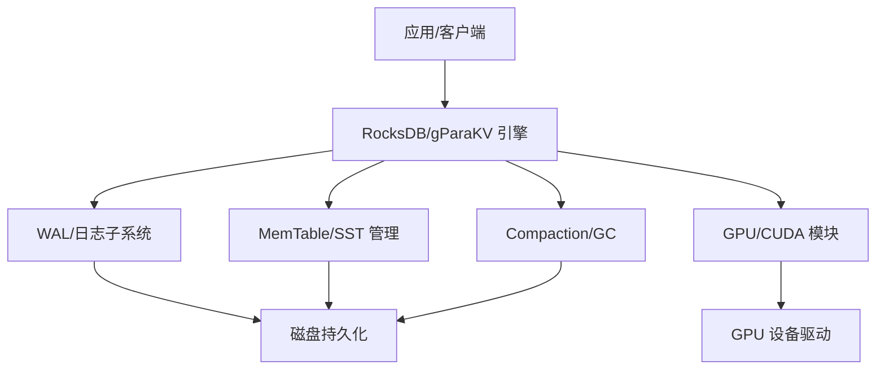
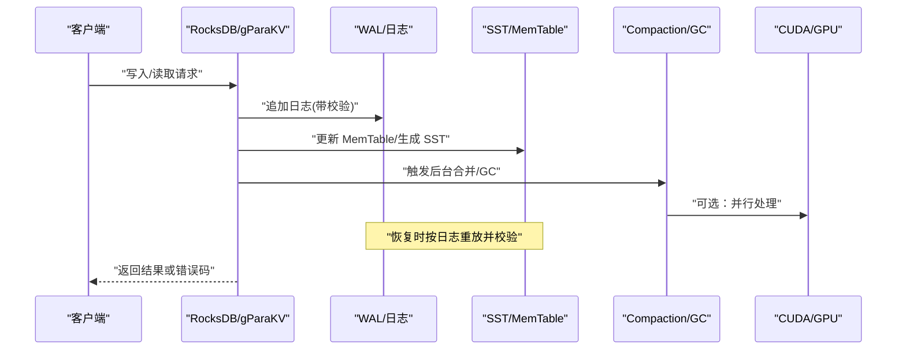
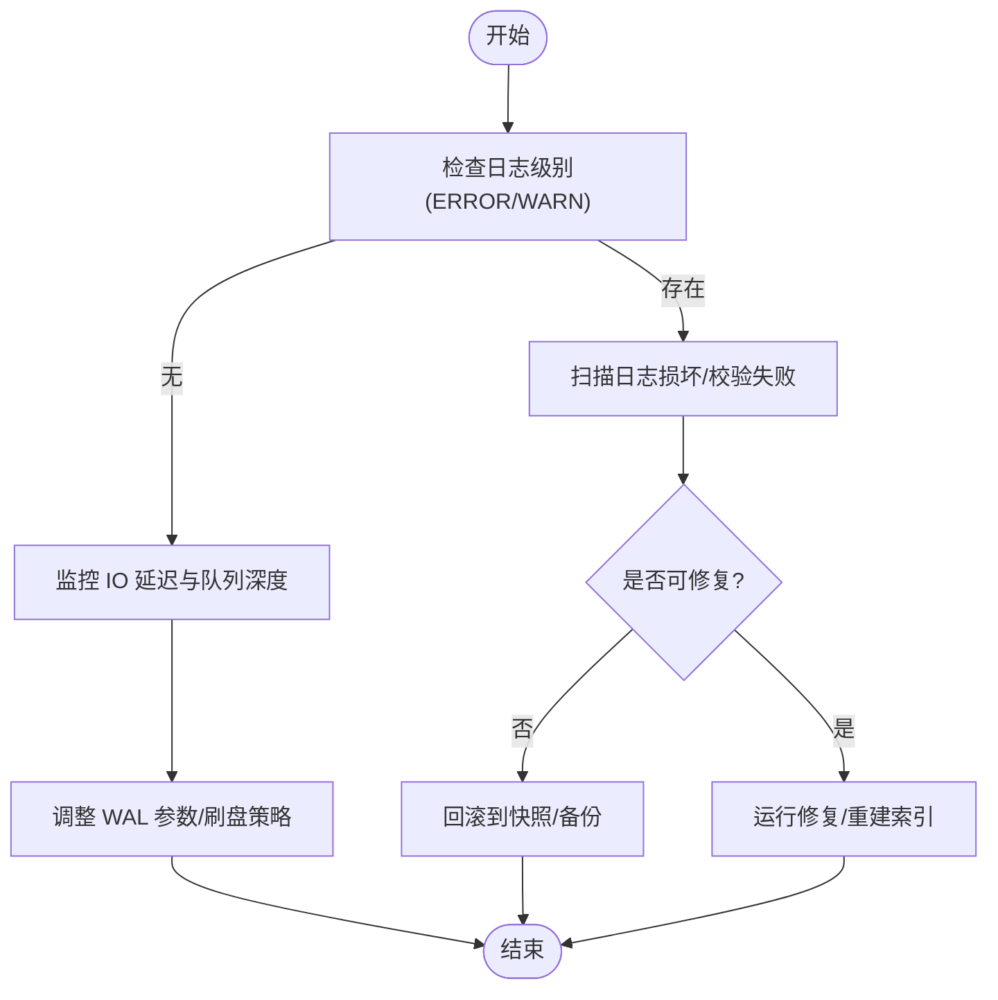
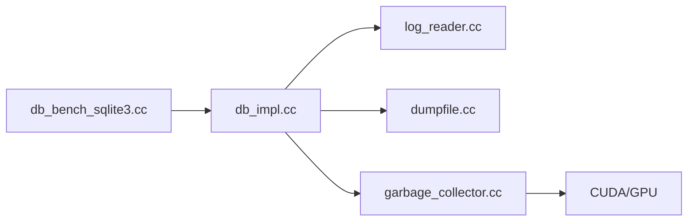
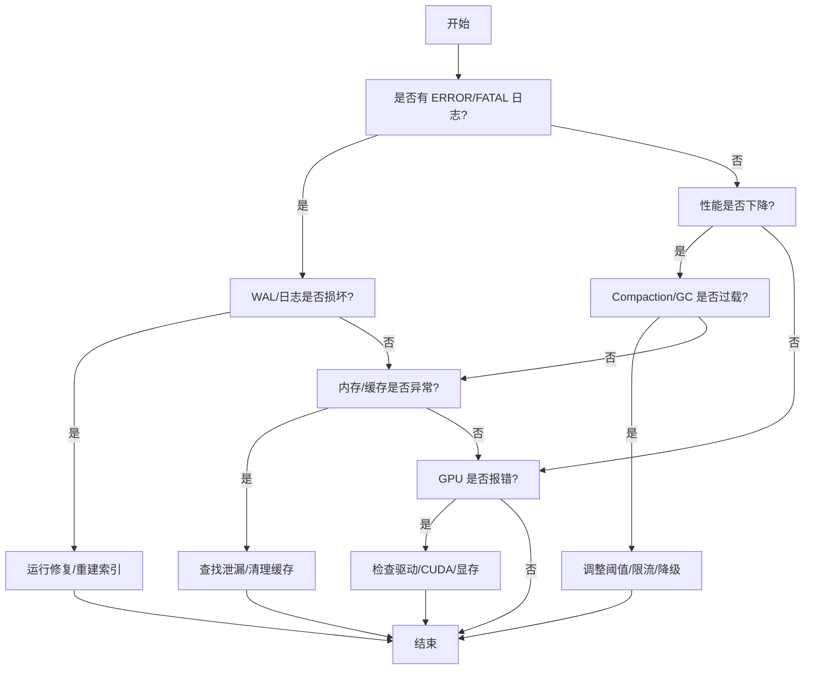

# 常见问题识别

<cite>
**本文引用的文件**   
- [rocksdb/README.md](file://source/rocksdb/README.md)
- [gParaKV-GC-master/README.md](file://source/gParaKV-GC-master/README.md)
- [logging.h](file://source/rocksdb/logging/logging.h)
- [db_impl.cc](file://source/gParaKV-GC-master/db/db_impl.cc)
- [log_reader.cc](file://source/gParaKV-GC-master/db/log_reader.cc)
- [dumpfile.cc](file://source/gParaKV-GC-master/db/dumpfile.cc)
- [garbage_collector.cc](file://source/gParaKV-GC-master/db/garbage_collector.cc)
- [db_bench_sqlite3.cc](file://source/gParaKV-GC-master/benchmarks/db_bench_sqlite3.cc)
</cite>

## 目录
1. [简介](#简介)
2. [项目结构](#项目结构)
3. [核心组件](#核心组件)
4. [架构总览](#架构总览)
5. [详细组件分析](#详细组件分析)
6. [依赖关系分析](#依赖关系分析)
7. [性能注意事项](#性能注意事项)
8. [故障排查指南](#故障排查指南)
9. [结论](#结论)
10. [附录](#附录)

## 简介
本指南面向生产与测试环境中的 RocksDB/gParaKV 存储系统，聚焦常见问题的快速识别与定位，包括：
- 性能下降（吞吐降低、延迟升高、抖动增大）
- 数据不一致（读回异常、校验失败、版本不一致）
- 内存泄漏（进程内存持续增长、GC 回收异常）
- WAL/日志损坏（恢复失败、读取中断）
- GPU 相关问题（CUDA 错误、显存溢出、计算异常）

文档提供问题分类与优先级判定方法、复现与环境检查步骤、GPU 问题识别要点、错误级别含义与影响范围，以及快速定位的 Checklist 和决策树，帮助在生产环境中迅速锁定关键问题。

## 项目结构
仓库包含多个子项目与基准脚本，重点涉及：
- RocksDB 主库与日志子系统
- gParaKV-GC（含 CUDA/GPU 加速的垃圾回收实现）
- 基准测试与脚本（YCSB、RocksDB 基准等）

图表来源
- [rocksdb/README.md:1-30](file://source/rocksdb/README.md#L1-L30)
- [gParaKV-GC-master/README.md:10-36](file://source/gParaKV-GC-master/README.md#L10-L36)

章节来源
- [rocksdb/README.md:1-30](file://source/rocksdb/README.md#L1-L30)
- [gParaKV-GC-master/README.md:10-36](file://source/gParaKV-GC-master/README.md#L10-L36)

## 核心组件
- 日志与 WAL：负责写入顺序日志、校验与恢复，是数据一致性与崩溃恢复的关键。
- MemTable/SST：内存表与不可变 SST 文件，影响读写路径与压缩行为。
- Compaction/GC：后台合并与垃圾回收，直接影响空间放大与写放大。
- GPU/CUDA：并行 GC 与可能的数据搬运/计算，带来新的错误面（显存、内核执行）。
- 监控与日志：统一的日志宏与级别，便于问题定位与分级告警。

章节来源
- [logging.h:28-48](file://source/rocksdb/logging/logging.h#L28-L48)
- [db_impl.cc:456-466](file://source/gParaKV-GC-master/db/db_impl.cc#L456-L466)
- [db_impl.cc:1487-1492](file://source/gParaKV-GC-master/db/db_impl.cc#L1487-L1492)
- [db_impl.cc:1725-1726](file://source/gParaKV-GC-master/db/db_impl.cc#L1725-L1726)
- [db_impl.cc:2040-2041](file://source/gParaKV-GC-master/db/db_impl.cc#L2040-L2041)

## 架构总览
下图展示从客户端请求到落盘与恢复的关键路径，并标注可能出错的环节。

图表来源
- [db_impl.cc:456-466](file://source/gParaKV-GC-master/db/db_impl.cc#L456-L466)
- [db_impl.cc:1487-1492](file://source/gParaKV-GC-master/db/db_impl.cc#L1487-L1492)
- [db_impl.cc:1725-1726](file://source/gParaKV-GC-master/db/db_impl.cc#L1725-L1726)
- [db_impl.cc:2040-2041](file://source/gParaKV-GC-master/db/db_impl.cc#L2040-L2041)

## 详细组件分析

### 日志与 WAL 子系统
- 功能要点：顺序写入、校验、断点续写、崩溃恢复；VLog/Reader 用于特定日志流。
- 典型症状：
  - 启动恢复失败、读取中断、校验错误
  - 写入卡顿（WAL 刷盘阻塞）、恢复时间过长
- 定位要点：
  - 关注日志级别 ERROR/FATAL 与文件行号信息
  - 使用 dumpfile 工具扫描日志损坏位置
  - 检查 VLog Reader 初始化与读取流程

图表来源
- [logging.h:28-48](file://source/rocksdb/logging/logging.h#L28-L48)
- [db_impl.cc:456-466](file://source/gParaKV-GC-master/db/db_impl.cc#L456-L466)
- [dumpfile.cc:38-64](file://source/gParaKV-GC-master/db/dumpfile.cc#L38-L64)

章节来源
- [logging.h:28-48](file://source/rocksdb/logging/logging.h#L28-L48)
- [db_impl.cc:456-466](file://source/gParaKV-GC-master/db/db_impl.cc#L456-L466)
- [db_impl.cc:1487-1492](file://source/gParaKV-GC-master/db/db_impl.cc#L1487-L1492)
- [dumpfile.cc:38-64](file://source/gParaKV-GC-master/db/dumpfile.cc#L38-L64)

### 垃圾回收与 Compaction
- 功能要点：后台清理过期键值、减少空间放大；在 gParaKV-GC 中引入 GPU 加速。
- 典型症状：
  - 空间放大持续上升、读放大增加
  - 后台任务长期占用 CPU/IO，前台延迟抖动
- 定位要点：
  - 观察 GC 线程与任务队列
  - 检查 GPU 利用率与显存占用
  - 结合统计指标（如 my_stats）判断回收效率

章节来源
- [garbage_collector.cc:16](file://source/gParaKV-GC-master/db/garbage_collector.cc#L16-L16)
- [gParaKV-GC-master/README.md:10-18](file://source/gParaKV-GC-master/README.md#L10-L18)

### GPU/CUDA 相关
- 功能要点：并行 GC、数据搬运与计算，需正确配置驱动与 CUDA 工具链。
- 典型症状：
  - CUDA 错误码、内核启动失败
  - 显存溢出（OOM）、设备通信超时
  - 计算结果异常（精度/一致性）
- 定位要点：
  - 检查驱动版本与 CUDA Toolkit 匹配
  - 监控 nvidia-smi 与 CUDA 错误 API 返回值
  - 隔离最小复现场景，逐步关闭 GPU 特性验证

章节来源
- [gParaKV-GC-master/README.md:25-36](file://source/gParaKV-GC-master/README.md#L25-L36)

### 基准与 WAL 开关
- 功能要点：基准测试中可通过参数控制 WAL 行为，便于对比不同模式下的稳定性与性能。
- 典型症状：
  - WAL 开启导致写入延迟升高但恢复更快
  - WAL 关闭提升吞吐但丢失最近写入风险
- 定位要点：
  - 通过命令行参数切换 WAL 模式
  - 对比不同模式的延迟分布与恢复时间

章节来源
- [db_bench_sqlite3.cc:80-109](file://source/gParaKV-GC-master/benchmarks/db_bench_sqlite3.cc#L80-L109)
- [db_bench_sqlite3.cc:456-465](file://source/gParaKV-GC-master/benchmarks/db_bench_sqlite3.cc#L456-L465)
- [db_bench_sqlite3.cc:705-707](file://source/gParaKV-GC-master/benchmarks/db_bench_sqlite3.cc#L705-L707)

## 依赖关系分析
- 日志子系统被 db_impl、dumpfile、garbage_collector 等多处引用，承担恢复与诊断职责。
- GPU 模块与 GC 耦合，需在编译与运行时确保依赖可用。
- 基准脚本依赖命令行参数与 WAL 配置，影响测试场景的可重复性。

图表来源
- [db_impl.cc:456-466](file://source/gParaKV-GC-master/db/db_impl.cc#L456-L466)
- [db_impl.cc:1487-1492](file://source/gParaKV-GC-master/db/db_impl.cc#L1487-L1492)
- [db_impl.cc:1725-1726](file://source/gParaKV-GC-master/db/db_impl.cc#L1725-L1726)
- [db_impl.cc:2040-2041](file://source/gParaKV-GC-master/db/db_impl.cc#L2040-L2041)
- [log_reader.cc:5](file://source/gParaKV-GC-master/db/log_reader.cc#L5-L5)
- [dumpfile.cc:38-64](file://source/gParaKV-GC-master/db/dumpfile.cc#L38-L64)
- [garbage_collector.cc:16](file://source/gParaKV-GC-master/db/garbage_collector.cc#L16-L16)
- [db_bench_sqlite3.cc:80-109](file://source/gParaKV-GC-master/benchmarks/db_bench_sqlite3.cc#L80-L109)

章节来源
- [db_impl.cc:456-466](file://source/gParaKV-GC-master/db/db_impl.cc#L456-L466)
- [log_reader.cc:5](file://source/gParaKV-GC-master/db/log_reader.cc#L5-L5)
- [dumpfile.cc:38-64](file://source/gParaKV-GC-master/db/dumpfile.cc#L38-L64)
- [garbage_collector.cc:16](file://source/gParaKV-GC-master/db/garbage_collector.cc#L16-L16)
- [db_bench_sqlite3.cc:80-109](file://source/gParaKV-GC-master/benchmarks/db_bench_sqlite3.cc#L80-L109)

## 性能注意事项
- 写放大与读放大平衡：合理设置 compaction 阈值与层级大小，避免过度合并。
- WAL 策略：根据业务对延迟与恢复时间的要求选择同步/异步刷盘与 WAL 开关。
- 内存与缓存：监控 MemTable 大小、Block Cache 命中率，防止频繁换页。
- GPU 资源：限制并发内核、避免显存碎片，必要时降级为 CPU 路径。
- 监控指标：吞吐、P95/P99 延迟、后台任务耗时、IO 队列长度、CPU/GPU 利用率。

## 故障排查指南

### 问题分类与优先级
- P0（致命）：服务不可用、数据损坏无法恢复、严重安全漏洞
- P1（高）：显著性能退化、间歇性错误、部分数据不可读
- P2（中）：非关键功能异常、偶发错误、可降级运行
- P3（低）：优化建议、界面提示、不影响核心功能

### 症状与特征速查
- 性能下降
  - 现象：吞吐下降、延迟升高、抖动明显
  - 可能原因：compaction 风暴、WAL 刷盘阻塞、锁竞争、GPU 过载
- 数据不一致
  - 现象：读回异常、校验失败、版本跳跃
  - 可能原因：日志损坏、并发写入未序列化、快照不一致
- 内存泄漏
  - 现象：进程内存持续增长、GC 回收无效
  - 可能原因：对象未释放、缓存未清理、GPU 显存未释放
- WAL 损坏
  - 现象：恢复失败、读取中断、校验错误
  - 可能原因：磁盘 I/O 错误、断电、文件系统异常
- GPU 问题
  - 现象：CUDA 错误、显存溢出、计算异常
  - 可能原因：驱动不兼容、内核越界、资源不足

### 复现与环境检查步骤
- 环境检查
  - 操作系统与内核版本、驱动与 CUDA 工具链版本
  - 磁盘健康状态、文件系统挂载选项、I/O 调度器
  - 进程资源限制（ulimit、cgroup）
- 复现步骤
  - 使用基准脚本构造稳定负载（YCSB/RocksDB 基准）
  - 固定参数集，记录延迟分布与吞吐曲线
  - 逐步变更可疑参数，定位回归点

### GPU 问题识别方法
- 检查 nvidia-smi 与 dmesg 输出，确认驱动与设备状态
- 捕获 CUDA 错误码与堆栈，缩小至最小复现场例
- 临时禁用 GPU 路径，验证是否为 GPU 相关

### 错误级别含义与影响范围
- HEADER_LEVEL/INFO_LEVEL：一般信息与调试辅助，影响小
- WARN_LEVEL：潜在问题，需关注但不一定阻断
- ERROR_LEVEL：功能异常，可能导致部分请求失败
- FATAL_LEVEL：致命错误，通常终止进程或进入不可恢复状态

章节来源
- [logging.h:28-48](file://source/rocksdb/logging/logging.h#L28-L48)

### 快速定位 Checklist
- 是否出现 ERROR/FATAL 日志？定位文件与行号
- WAL 是否损坏？使用 dumpfile 扫描并尝试修复
- 后台任务是否阻塞？观察 compaction/GC 队列与耗时
- 内存与缓存是否正常？检查 MemTable、Block Cache 命中率
- GPU 是否可用？核对驱动/CUDA 版本与设备状态
- 基准是否可复现？固定参数与数据集进行回归测试

### 决策树（简化版）

## 结论
通过统一日志级别、WAL 校验与恢复机制、GPU 资源监控与基准复现，能够快速识别与定位 RocksDB/gParaKV 系统中的常见问题。建议在生产环境建立完善的监控与告警体系，结合本指南的 Checklist 与决策树，缩短 MTTR，保障服务稳定性与数据一致性。

## 附录
- 参考文档与构建说明见各 README，确保环境与依赖满足要求。
- 基准脚本与 workload 配置可用于压力测试与回归验证。