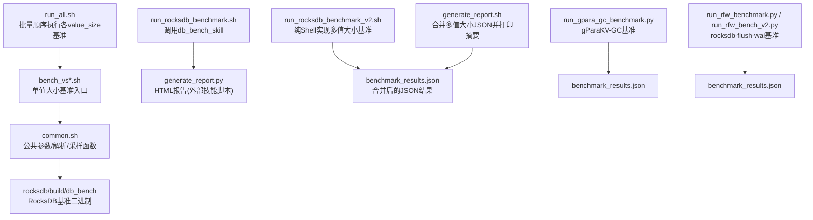
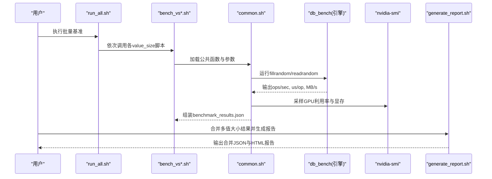
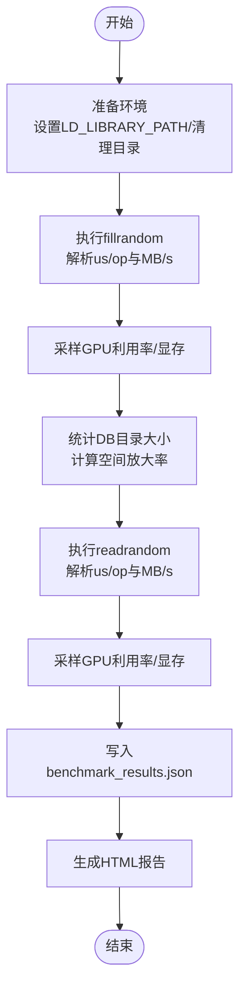
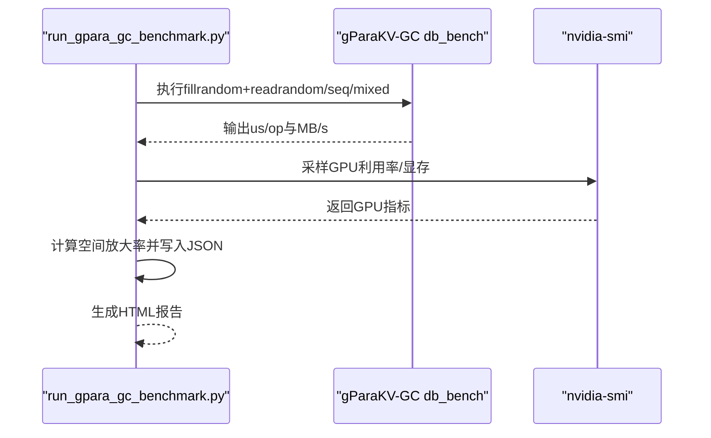
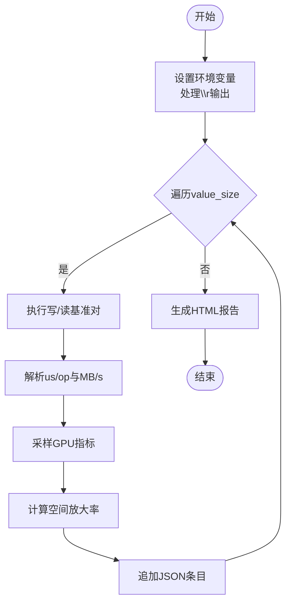
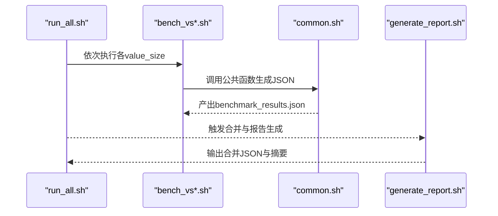
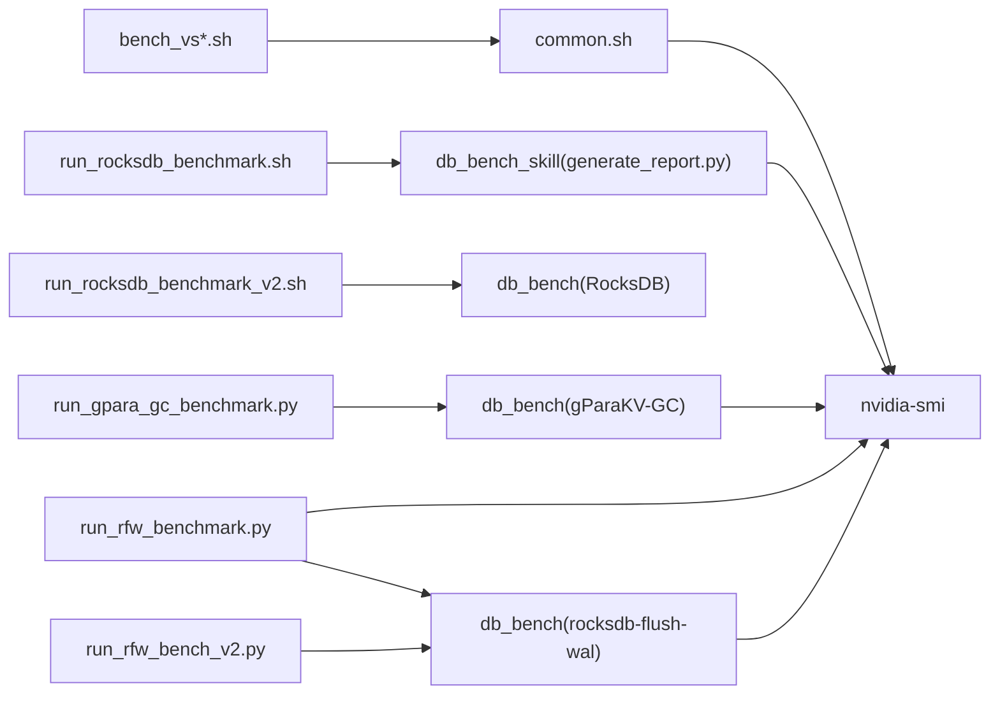

# 性能诊断

<cite>
**本文引用的文件**   
- [script/run_all.sh](file://script/run_all.sh)
- [script/common.sh](file://script/common.sh)
- [script/generate_report.sh](file://script/generate_report.sh)
- [script/bench_vs32.sh](file://script/bench_vs32.sh)
- [script/bench_vs128.sh](file://script/bench_vs128.sh)
- [script/bench_vs512.sh](file://script/bench_vs512.sh)
- [script/run_rocksdb_benchmark.sh](file://script/run_rocksdb_benchmark.sh)
- [script/run_rocksdb_benchmark_v2.sh](file://script/run_rocksdb_benchmark_v2.sh)
- [script/run_rocksdb_flush_wal_benchmark.sh](file://script/run_rocksdb_flush_wal_benchmark.sh)
- [script/run_gpara_gc_benchmark.py](file://script/run_gpara_gc_benchmark.py)
- [script/run_rfw_benchmark.py](file://script/run_rfw_benchmark.py)
- [script/run_rfw_bench_v2.py](file://script/run_rfw_bench_v2.py)
</cite>

## 目录
1. [引言](#引言)
2. [项目结构](#项目结构)
3. [核心组件](#核心组件)
4. [架构总览](#架构总览)
5. [详细组件分析](#详细组件分析)
6. [依赖关系分析](#依赖关系分析)
7. [性能考量与优化建议](#性能考量与优化建议)
8. [故障排查指南](#故障排查指南)
9. [结论](#结论)
10. [附录：指标定义与解读](#附录指标定义与解读)

## 引言
本文件面向性能诊断与基准测试，系统化阐述如何识别CPU、内存、I/O、GPU等资源的瓶颈，记录基准框架的使用方法与结果解读，提供性能回归检测与对比分析方法，解释关键指标的收集与可视化流程，并给出GPU加速效果评估方法、调优最佳实践以及自动化持续集成配置建议。本项目围绕RocksDB、gParaKV-GC与rocksdb-flush-wal三类引擎的2GB规模基准场景，覆盖随机/顺序读写与混合负载，形成可复用的性能诊断流水线。

## 项目结构
脚本层负责编排不同引擎的基准执行、硬件信息采集、指标解析与报告生成；数据输出以JSON为主，辅以HTML报告便于快速审阅。整体采用“Shell驱动 + Python增强”的组合模式，兼顾易用性与可扩展性。

图表来源 
- [script/run_all.sh:1-19](file://script/run_all.sh#L1-L19)
- [script/common.sh:1-196](file://script/common.sh#L1-L196)
- [script/generate_report.sh:1-59](file://script/generate_report.sh#L1-L59)
- [script/run_rocksdb_benchmark.sh:1-50](file://script/run_rocksdb_benchmark.sh#L1-L50)
- [script/run_rocksdb_benchmark_v2.sh:1-168](file://script/run_rocksdb_benchmark_v2.sh#L1-L168)
- [script/run_rocksdb_flush_wal_benchmark.sh:1-50](file://script/run_rocksdb_flush_wal_benchmark.sh#L1-L50)
- [script/run_gpara_gc_benchmark.py:1-304](file://script/run_gpara_gc_benchmark.py#L1-L304)
- [script/run_rfw_benchmark.py:1-311](file://script/run_rfw_benchmark.py#L1-L311)
- [script/run_rfw_bench_v2.py:1-320](file://script/run_rfw_bench_v2.py#L1-L320)

章节来源
- [script/run_all.sh:1-19](file://script/run_all.sh#L1-L19)
- [script/common.sh:1-196](file://script/common.sh#L1-L196)
- [script/generate_report.sh:1-59](file://script/generate_report.sh#L1-L59)

## 核心组件
- 批量执行器：按value_size顺序触发各子基准，统一产出JSON结果，便于后续合并与对比。
- 公共工具库：封装ops/sec与us/op解析、MB/s换算、硬件信息采集（CPU/内存/GPU）、nvidia-smi采样、空间放大率计算等。
- 引擎基准脚本：分别针对RocksDB、gParaKV-GC、rocksdb-flush-wal三种引擎，覆盖随机/顺序/混合读写场景。
- 报告生成：将多组JSON合并为单一结果集，并生成HTML报告与文本摘要，支持快速定位趋势与异常。

章节来源
- [script/common.sh:16-53](file://script/common.sh#L16-L53)
- [script/common.sh:68-196](file://script/common.sh#L68-L196)
- [script/run_gpara_gc_benchmark.py:188-304](file://script/run_gpara_gc_benchmark.py#L188-L304)
- [script/run_rfw_benchmark.py:199-311](file://script/run_rfw_benchmark.py#L199-L311)
- [script/run_rfw_bench_v2.py:205-320](file://script/run_rfw_bench_v2.py#L205-L320)

## 架构总览
下图展示从入口脚本到基准执行、指标采集、结果落盘与报告生成的端到端流程。

图表来源 
- [script/run_all.sh:1-19](file://script/run_all.sh#L1-L19)
- [script/common.sh:68-196](file://script/common.sh#L68-L196)
- [script/generate_report.sh:1-59](file://script/generate_report.sh#L1-L59)

## 详细组件分析

### RocksDB基准套件
- 入口脚本
  - run_rocksdb_benchmark.sh：通过db_bench_skill调用Python脚本执行2GB基准，随后生成HTML报告。
  - run_rocksdb_benchmark_v2.sh：纯Shell实现，遍历多个value_size，直接调用db_bench并解析输出，写入JSON后生成HTML报告。
- 指标解析与采样
  - common.sh提供ops/sec与us/op解析、MB/s换算、GPU采样、空间放大率计算等通用能力。
- 典型工作流
  - fillrandom → readrandom，固定key_size与write_buffer_size，开启statistics/histogram，统计吞吐与时延，采样GPU状态，计算空间放大率。

图表来源 
- [script/run_rocksdb_benchmark.sh:1-50](file://script/run_rocksdb_benchmark.sh#L1-L50)
- [script/run_rocksdb_benchmark_v2.sh:53-144](file://script/run_rocksdb_benchmark_v2.sh#L53-L144)
- [script/common.sh:68-196](file://script/common.sh#L68-L196)

章节来源
- [script/run_rocksdb_benchmark.sh:1-50](file://script/run_rocksdb_benchmark.sh#L1-L50)
- [script/run_rocksdb_benchmark_v2.sh:1-168](file://script/run_rocksdb_benchmark_v2.sh#L1-L168)
- [script/common.sh:16-53](file://script/common.sh#L16-L53)

### gParaKV-GC基准
- 特点
  - 支持三组场景：随机读写、顺序读写、混合读写。
  - 因GPU GC内存限制，对num_keys进行上限控制（约2M键）。
  - 输出包含us/op、MB/s、空间放大率、GPU利用率与显存占用。
- 流程
  - 遍历value_size，组合写/读基准成对执行，解析LevelDB风格输出，采样GPU，计算空间放大率，汇总JSON并生成HTML报告。

图表来源 
- [script/run_gpara_gc_benchmark.py:122-186](file://script/run_gpara_gc_benchmark.py#L122-L186)
- [script/run_gpara_gc_benchmark.py:188-304](file://script/run_gpara_gc_benchmark.py#L188-L304)

章节来源
- [script/run_gpara_gc_benchmark.py:1-304](file://script/run_gpara_gc_benchmark.py#L1-L304)

### rocksdb-flush-wal基准
- 特点
  - 处理RocksDB进度行中的回车符，确保输出解析稳定。
  - 针对compaction阶段崩溃问题，按value_size设定最大键数上限，避免SIGSEGV。
  - 同样覆盖随机/顺序/混合读写场景，输出标准JSON与HTML报告。
- 流程
  - 遍历value_size，执行写/读基准对，解析RocksDB输出，采样GPU，计算空间放大率，汇总结果。

图表来源 
- [script/run_rfw_benchmark.py:71-105](file://script/run_rfw_benchmark.py#L71-L105)
- [script/run_rfw_benchmark.py:135-196](file://script/run_rfw_benchmark.py#L135-L196)
- [script/run_rfw_bench_v2.py:75-109](file://script/run_rfw_bench_v2.py#L75-L109)
- [script/run_rfw_bench_v2.py:139-202](file://script/run_rfw_bench_v2.py#L139-L202)

章节来源
- [script/run_rfw_benchmark.py:1-311](file://script/run_rfw_benchmark.py#L1-L311)
- [script/run_rfw_bench_v2.py:1-320](file://script/run_rfw_bench_v2.py#L1-L320)

### 报告与合并
- generate_report.sh：合并各value_size的JSON结果，输出统一的benchmark_results.json，并打印摘要表格。
- run_all.sh：顺序执行所有value_size基准，保证结果一致性。

图表来源 
- [script/run_all.sh:1-19](file://script/run_all.sh#L1-L19)
- [script/generate_report.sh:1-59](file://script/generate_report.sh#L1-L59)

章节来源
- [script/run_all.sh:1-19](file://script/run_all.sh#L1-L19)
- [script/generate_report.sh:1-59](file://script/generate_report.sh#L1-L59)

## 依赖关系分析
- 脚本间依赖
  - bench_vs*.sh依赖common.sh提供的解析与采样函数。
  - run_rocksdb_benchmark.sh依赖外部db_bench_skill脚本（由SKILL_DIR指定）。
  - run_rocksdb_benchmark_v2.sh不依赖外部脚本，完全自包含。
  - gParaKV-GC与rocksdb-flush-wal基准脚本各自独立，但共享GPU采样与JSON结构约定。
- 外部依赖
  - nvidia-smi用于GPU利用率与显存采样。
  - RocksDB/gParaKV-GC/db_bench二进制需正确构建且路径可用。
  - Python3用于报告生成与JSON处理。

图表来源 
- [script/common.sh:16-53](file://script/common.sh#L16-L53)
- [script/run_rocksdb_benchmark.sh:1-50](file://script/run_rocksdb_benchmark.sh#L1-L50)
- [script/run_rocksdb_benchmark_v2.sh:1-168](file://script/run_rocksdb_benchmark_v2.sh#L1-L168)
- [script/run_gpara_gc_benchmark.py:1-304](file://script/run_gpara_gc_benchmark.py#L1-L304)
- [script/run_rfw_benchmark.py:1-311](file://script/run_rfw_benchmark.py#L1-L311)
- [script/run_rfw_bench_v2.py:1-320](file://script/run_rfw_bench_v2.py#L1-L320)

章节来源
- [script/common.sh:16-53](file://script/common.sh#L16-L53)
- [script/run_rocksdb_benchmark.sh:1-50](file://script/run_rocksdb_benchmark.sh#L1-L50)
- [script/run_rocksdb_benchmark_v2.sh:1-168](file://script/run_rocksdb_benchmark_v2.sh#L1-L168)
- [script/run_gpara_gc_benchmark.py:1-304](file://script/run_gpara_gc_benchmark.py#L1-L304)
- [script/run_rfw_benchmark.py:1-311](file://script/run_rfw_benchmark.py#L1-L311)
- [script/run_rfw_bench_v2.py:1-320](file://script/run_rfw_bench_v2.py#L1-L320)

## 性能考量与优化建议
- CPU
  - 关注us/op与ops/sec变化，结合线程数与缓存大小调整，避免上下文切换开销过大。
- 内存
  - write_buffer_size与cache_size直接影响吞吐与时延，过小会导致频繁刷盘，过大会增加GC压力。
- I/O
  - 空间放大率反映磁盘占用与逻辑数据量的比例，过高可能意味着碎片化或压缩策略不当。
- GPU
  - 使用nvidia-smi采样利用率与显存，评估GPU加速收益；注意显存上限导致的键数限制与CUDA错误。
- 参数优化建议
  - 根据负载类型选择合适的工作集大小与压缩策略；在随机读场景下适当增大cache_size以降低磁盘访问。
  - 对于rocksdb-flush-wal，按value_size限制最大键数以规避compaction崩溃风险。
- 监控与可视化
  - 统一输出JSON结构，便于跨版本对比；HTML报告用于快速审阅趋势与异常点。

[本节为通用指导，不直接分析具体文件]

## 故障排查指南
- 常见错误
  - CUDA错误：gParaKV-GC基准检测到CUDA错误时提示警告，检查GPU驱动与显存限制。
  - SIGSEGV：rocksdb-flush-wal在compaction阶段可能崩溃，需降低num_keys或调整参数。
  - 超时：基准执行超时，检查系统资源与磁盘IO瓶颈。
- 定位步骤
  - 查看原始输出与JSON字段，确认us/op、MB/s、空间放大率是否合理。
  - 检查nvidia-smi采样结果，确认GPU利用率与显存占用是否符合预期。
  - 核对LD_LIBRARY_PATH与db_bench路径是否正确。

章节来源
- [script/run_gpara_gc_benchmark.py:155-157](file://script/run_gpara_gc_benchmark.py#L155-L157)
- [script/run_rfw_bench_v2.py:26-29](file://script/run_rfw_bench_v2.py#L26-L29)
- [script/run_rfw_benchmark.py:71-78](file://script/run_rfw_benchmark.py#L71-L78)

## 结论
本项目提供了覆盖多引擎、多负载类型的完整性能诊断流水线。通过标准化JSON输出与HTML报告，能够快速发现性能瓶颈并进行回归对比。结合CPU、内存、I/O与GPU的多维监控，配合合理的参数调优与自动化执行，可实现系统性性能问题的定位与解决。

[本节为总结，不直接分析具体文件]

## 附录：指标定义与解读
- ops/sec：每秒操作数，衡量吞吐能力。
- us/op：每次操作的微秒时延，衡量延迟特性。
- MB/s：吞吐带宽，由ops/sec与键值大小换算得到。
- 空间放大率：磁盘实际占用与逻辑数据量之比，反映存储效率。
- GPU利用率与显存：评估GPU加速效果与资源占用。
- 尾延迟估算：通常取平均us/op的1.5倍作为近似尾延迟参考。

章节来源
- [script/common.sh:34-39](file://script/common.sh#L34-L39)
- [script/common.sh:118-125](file://script/common.sh#L118-L125)
- [script/common.sh:157-189](file://script/common.sh#L157-L189)