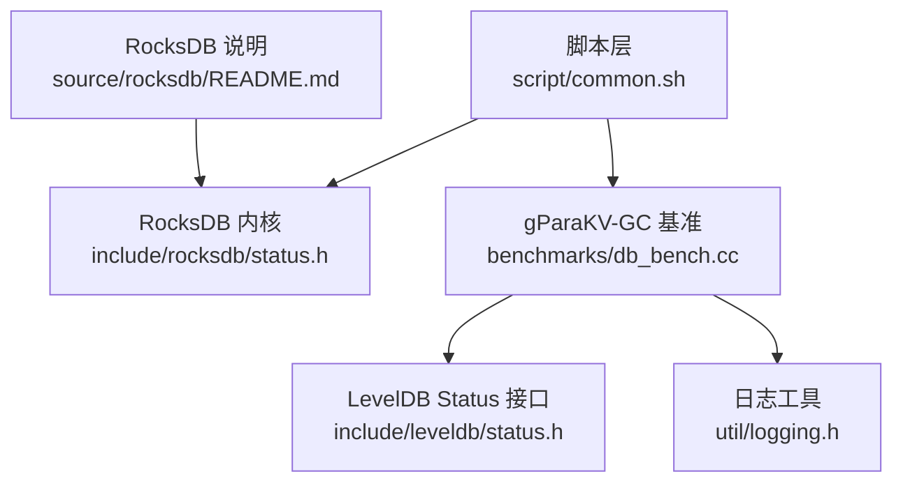
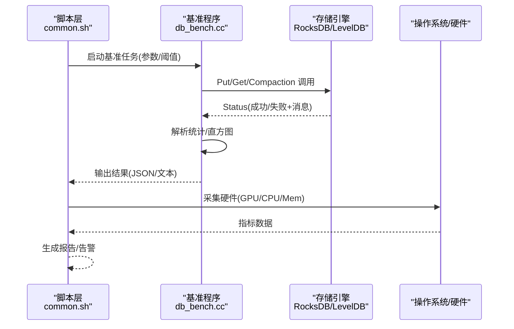
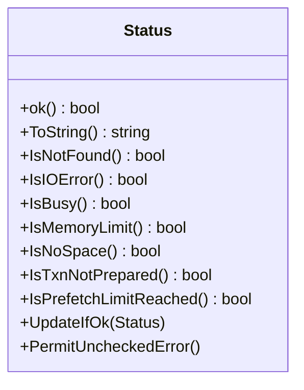
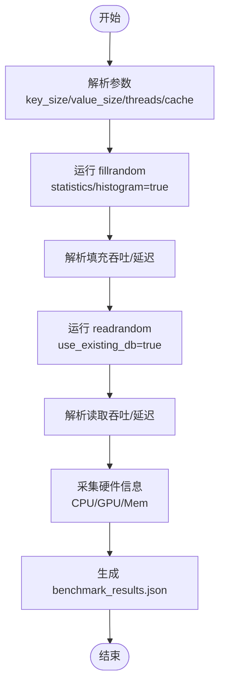

# 故障排查

<cite>
**本文档引用的文件**   
- [source/rocksdb/README.md](file://source/rocksdb/README.md)
- [source/rocksdb/include/rocksdb/status.h](file://source/rocksdb/include/rocksdb/status.h)
- [source/gParaKV-GC-master/include/leveldb/status.h](file://source/gParaKV-GC-master/include/leveldb/status.h)
- [source/gParaKV-GC-master/util/logging.h](file://source/gParaKV-GC-master/util/logging.h)
- [source/gParaKV-GC-master/benchmarks/db_bench.cc](file://source/gParaKV-GC-master/benchmarks/db_bench.cc)
- [script/common.sh](file://script/common.sh)
</cite>

## 目录
1. [简介](#简介)
2. [项目结构](#项目结构)
3. [核心组件](#核心组件)
4. [架构总览](#架构总览)
5. [详细组件分析](#详细组件分析)
6. [依赖关系分析](#依赖关系分析)
7. [性能注意事项](#性能注意事项)
8. [故障排查指南](#故障排查指南)
9. [结论](#结论)
10. [附录](#附录)

## 简介
本指南面向生产环境中的 RocksDB/gParaKV 相关系统，聚焦于快速定位与解决性能下降、数据不一致、内存泄漏、网络与连接异常、GPU 相关问题等常见故障。文档结合仓库中的状态码定义、日志接口、基准脚本与工具链，提供从现象到根因的完整诊断流程，并给出回滚与恢复操作建议。

## 项目结构
仓库包含多个数据库内核与基准测试代码：
- RocksDB 主工程与监控增强分支
- gParaKV-GC 系列（含 GPU 相关实现）
- YCSB 基准套件
- 脚本层用于统一执行基准、采集指标与生成报告

图表来源
- [script/common.sh:1-196](file://script/common.sh#L1-L196)
- [source/rocksdb/include/rocksdb/status.h:1-636](file://source/rocksdb/include/rocksdb/status.h#L1-L636)
- [source/gParaKV-GC-master/benchmarks/db_bench.cc:1-1200](file://source/gParaKV-GC-master/benchmarks/db_bench.cc#L1-L1200)
- [source/gParaKV-GC-master/include/leveldb/status.h:1-124](file://source/gParaKV-GC-master/include/leveldb/status.h#L1-L124)
- [source/gParaKV-GC-master/util/logging.h:1-45](file://source/gParaKV-GC-master/util/logging.h#L1-L45)
- [source/rocksdb/README.md:1-30](file://source/rocksdb/README.md#L1-L30)

章节来源
- [source/rocksdb/README.md:1-30](file://source/rocksdb/README.md#L1-L30)
- [script/common.sh:1-196](file://script/common.sh#L1-L196)

## 核心组件
- 错误与状态模型
  - RocksDB 的 Status 类型定义了丰富的错误码与子码，涵盖 IO、锁、内存、事务、压缩等场景，并提供 Is* 判定方法与 ToString 输出，便于统一错误处理与日志记录。
  - LevelDB Status 为更基础的错误模型，适用于 gParaKV-GC 的早期或兼容路径。
- 日志与可观测性
  - util/logging.h 提供字符串格式化与转义能力，支撑日志输出与调试信息构造。
- 基准与数据采集
  - db_bench.cc 暴露多种基准模式（如 fillrandom/readrandom），支持统计与直方图输出，便于定位延迟与吞吐瓶颈。
  - script/common.sh 封装了参数解析、结果解析、硬件信息采集（CPU/GPU/Mem）、JSON 报告生成，以及 nvidia-smi 采样。

章节来源
- [source/rocksdb/include/rocksdb/status.h:1-636](file://source/rocksdb/include/rocksdb/status.h#L1-L636)
- [source/gParaKV-GC-master/include/leveldb/status.h:1-124](file://source/gParaKV-GC-master/include/leveldb/status.h#L1-L124)
- [source/gParaKV-GC-master/util/logging.h:1-45](file://source/gParaKV-GC-master/util/logging.h#L1-L45)
- [source/gParaKV-GC-master/benchmarks/db_bench.cc:1-1200](file://source/gParaKV-GC-master/benchmarks/db_bench.cc#L1-L1200)
- [script/common.sh:1-196](file://script/common.sh#L1-L196)

## 架构总览
下图展示了从脚本驱动到内核的状态流转与错误传播路径，帮助理解问题在系统中的传播与定位点。

图表来源
- [script/common.sh:1-196](file://script/common.sh#L1-L196)
- [source/gParaKV-GC-master/benchmarks/db_bench.cc:1-1200](file://source/gParaKV-GC-master/benchmarks/db_bench.cc#L1-L1200)
- [source/rocksdb/include/rocksdb/status.h:1-636](file://source/rocksdb/include/rocksdb/status.h#L1-L636)

## 详细组件分析

### 错误与状态模型（RocksDB Status）
- 关键特性
  - 错误码枚举：NotFound、Corruption、IOError、Busy、TimedOut、Aborted、Expired、TryAgain、CompactionTooLarge、ColumnFamilyDropped 等。
  - 子码枚举：MutexTimeout、LockTimeout、NoSpace、MemoryLimit、PathNotFound、ManualCompactionPaused、CompactionAborted、PrefetchLimitReached 等。
  - 严重级别：Soft/Hard/Fatal/Unrecoverable。
  - 便捷方法：IsNotFound/IsIOError/IsBusy/IsMemoryLimit/IsNoSpace/IsTxnNotPrepared/IsPrefetchLimitReached 等。
- 使用建议
  - 所有返回 Status 的 API 必须检查 ok() 或使用 Is* 方法判断。
  - 对重试类错误（TryAgain/Busy/TimedOut）实施退避与限流。
  - 对资源限制类错误（NoSpace/MemoryLimit/LockLimit）触发扩容或降级策略。
  - 通过 ToString() 将错误信息写入日志，便于回溯。

图表来源
- [source/rocksdb/include/rocksdb/status.h:1-636](file://source/rocksdb/include/rocksdb/status.h#L1-L636)

章节来源
- [source/rocksdb/include/rocksdb/status.h:1-636](file://source/rocksdb/include/rocksdb/status.h#L1-L636)

### 日志与可观测性（LevelDB logging）
- 功能要点
  - 数字与字符串格式化、转义输出，避免日志污染与解析困难。
  - 配合 Status.ToString() 输出结构化错误上下文。
- 使用建议
  - 在关键路径（打开/关闭、写放大、压缩、WAL 落盘）增加日志。
  - 控制日志级别与滚动策略，避免磁盘空间耗尽。

章节来源
- [source/gParaKV-GC-master/util/logging.h:1-45](file://source/gParaKV-GC-master/util/logging.h#L1-L45)

### 基准与数据采集（db_bench 与 common.sh）
- db_bench.cc
  - 支持多基准模式（fillrandom/readrandom），开启 statistics/histogram 输出。
  - 提供 WAL、缓存、线程数、键值大小等参数，便于复现问题。
- common.sh
  - 解析 ops/sec 与 us/op，计算 MB/s，生成 JSON 报告。
  - 采集 CPU/GPU/Mem/Kernel/OS 信息，辅助定位硬件瓶颈。
  - 通过 nvidia-smi 采样 GPU 利用率与显存占用。

图表来源
- [source/gParaKV-GC-master/benchmarks/db_bench.cc:1-1200](file://source/gParaKV-GC-master/benchmarks/db_bench.cc#L1-L1200)
- [script/common.sh:1-196](file://script/common.sh#L1-L196)

章节来源
- [source/gParaKV-GC-master/benchmarks/db_bench.cc:1-1200](file://source/gParaKV-GC-master/benchmarks/db_bench.cc#L1-L1200)
- [script/common.sh:1-196](file://script/common.sh#L1-L196)

## 依赖关系分析
- 脚本层依赖基准程序与系统命令（nvidia-smi、du、awk、bc）。
- 基准程序依赖存储引擎（RocksDB/LevelDB）提供的 API 与状态模型。
- 存储引擎依赖操作系统 I/O、内存管理与并发原语。

图表来源
- [script/common.sh:1-196](file://script/common.sh#L1-L196)
- [source/gParaKV-GC-master/benchmarks/db_bench.cc:1-1200](file://source/gParaKV-GC-master/benchmarks/db_bench.cc#L1-L1200)
- [source/rocksdb/include/rocksdb/status.h:1-636](file://source/rocksdb/include/rocksdb/status.h#L1-L636)

章节来源
- [script/common.sh:1-196](file://script/common.sh#L1-L196)
- [source/gParaKV-GC-master/benchmarks/db_bench.cc:1-1200](file://source/gParaKV-GC-master/benchmarks/db_bench.cc#L1-L1200)

## 性能注意事项
- 写放大与读放大
  - 关注 space_amplification 与 read_amplification，调整 write_buffer_size、压缩策略与 compaction 参数。
- 延迟与吞吐
  - 通过 histogram 与 us/op 定位尾部延迟；对比不同 value_size 下的吞吐变化。
- 资源限制
  - NoSpace/MemoryLimit/LockLimit 错误需及时扩容或降低并发。
- GPU 利用
  - 使用 nvidia-smi 采样 GPU 利用率与显存，识别 GPU 瓶颈或显存不足。

[本节为通用指导，不直接分析具体文件]

## 故障排查指南

### 常见问题识别与解决方法
- 性能下降
  - 现象：ops/sec 下降、us/op 上升、尾部延迟升高。
  - 排查步骤：
    - 启用 statistics/histogram，观察热点路径与锁竞争。
    - 检查磁盘 I/O 与缓存命中率，调整 cache_size 与 write_buffer_size。
    - 查看压缩与 WAL 频率，必要时降低压缩或增大 vlog size。
    - 使用脚本生成的 JSON 报告对比历史基线。
  - 参考：
    - [source/gParaKV-GC-master/benchmarks/db_bench.cc:1-1200](file://source/gParaKV-GC-master/benchmarks/db_bench.cc#L1-L1200)
    - [script/common.sh:1-196](file://script/common.sh#L1-L196)

- 数据不一致
  - 现象：读取到过期或损坏数据、校验失败。
  - 排查步骤：
    - 检查 Corruption 错误与 Manifest/WAL 完整性。
    - 使用修复工具重建索引或校验表格式。
    - 回滚到最近一致快照，验证恢复流程。
  - 参考：
    - [source/rocksdb/include/rocksdb/status.h:1-636](file://source/rocksdb/include/rocksdb/status.h#L1-L636)

- 内存泄漏
  - 现象：进程内存持续增长、频繁 GC 或 OOM。
  - 排查步骤：
    - 使用 Valgrind/AddressSanitizer 检测泄漏与越界。
    - 检查 Status.IsMemoryLimit 与锁超时，评估并发与批大小。
    - 审查自定义对象生命周期与缓存清理策略。
  - 参考：
    - [source/rocksdb/include/rocksdb/status.h:1-636](file://source/rocksdb/include/rocksdb/status.h#L1-L636)

- 网络问题与连接异常
  - 现象：超时、连接断开、重试风暴。
  - 排查步骤：
    - 检查 TimedOut/Busy/ShutdownInProgress 错误码。
    - 配置合理的重试退避与熔断策略。
    - 监控网络栈与远端服务健康度。
  - 参考：
    - [source/rocksdb/include/rocksdb/status.h:1-636](file://source/rocksdb/include/rocksdb/status.h#L1-L636)

- GPU 相关问题
  - 现象：GPU 利用率低、显存溢出、CUDA 错误。
  - 排查步骤：
    - 使用 nvidia-smi 采样 GPU 利用率与显存占用。
    - 检查 CUDA 错误码与设备状态，必要时重启驱动。
    - 调整批大小与并行度，避免显存争用。
  - 参考：
    - [script/common.sh:1-196](file://script/common.sh#L1-L196)

- 性能瓶颈定位与优化
  - 步骤：
    - 使用 perf/火焰图定位热点函数。
    - 分析压缩与合并阶段，调整 compaction 参数。
    - 减少跨节点同步与锁竞争，优化批处理。
  - 参考：
    - [source/gParaKV-GC-master/benchmarks/db_bench.cc:1-1200](file://source/gParaKV-GC-master/benchmarks/db_bench.cc#L1-L1200)

- 回滚与恢复操作
  - 步骤：
    - 停止写入，备份当前数据目录。
    - 使用修复工具重建索引或校验表格式。
    - 从最近一致快照恢复，验证数据一致性。
  - 参考：
    - [source/rocksdb/include/rocksdb/status.h:1-636](file://source/rocksdb/include/rocksdb/status.h#L1-L636)

### 调试工具与技术使用方法
- gdb 调试
  - 附加到进程，设置断点到关键函数（Put/Get/Compaction）。
  - 打印 Status 对象与堆栈，定位异常路径。
- 性能分析器
  - perf 采集 CPU 热点与火焰图。
  - 使用 rocksdb 内置统计与直方图分析延迟分布。
- 内存检测工具
  - Valgrind/AddressSanitizer 检测泄漏与越界。
  - 监控 RSS/Heap 增长趋势，定位增长源。
- 日志分析与错误码含义
  - 使用 Status.ToString() 输出错误详情。
  - 根据错误码分类处理（重试/降级/告警）。
- 数据库状态检查与修复工具
  - 检查 Manifest/WAL 完整性，必要时重建索引。
  - 使用修复工具校验表格式与元数据一致性。
- 网络问题与连接异常排查
  - 监控超时与重试次数，调整超时与退避策略。
  - 检查远端服务健康与资源使用情况。

[本节为通用指导，不直接分析具体文件]

## 结论
通过统一的错误模型、完善的日志与基准工具，结合系统级监控与调试手段，可以快速定位并解决 RocksDB/gParaKV 在生产环境中的各类问题。建议建立标准化的故障排查流程与自动化报告机制，提升问题响应效率与系统稳定性。

[本节为总结性内容，不直接分析具体文件]

## 附录
- 常用命令与脚本
  - 运行基准：参考 script/common.sh 的参数与输出格式。
  - 采集 GPU 指标：使用 nvidia-smi 查询利用率与显存。
  - 生成报告：解析基准输出并生成 JSON 报告。
- 错误码速查
  - NotFound/Corruption/IOError/Busy/TimedOut/Aborted/Expired/TryAgain/CompactionTooLarge/ColumnFamilyDropped 等。
  - 子码：NoSpace/MemoryLimit/LockTimeout/PrefetchLimitReached 等。

章节来源
- [script/common.sh:1-196](file://script/common.sh#L1-L196)
- [source/rocksdb/include/rocksdb/status.h:1-636](file://source/rocksdb/include/rocksdb/status.h#L1-L636)
- [source/gParaKV-GC-master/benchmarks/db_bench.cc:1-1200](file://source/gParaKV-GC-master/benchmarks/db_bench.cc#L1-L1200)