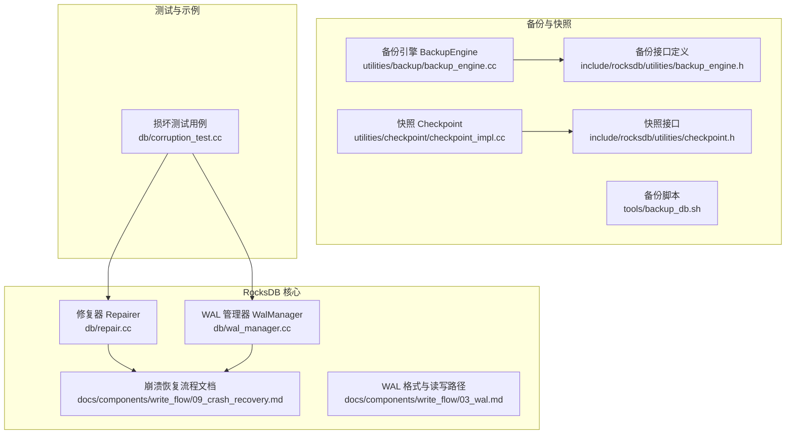
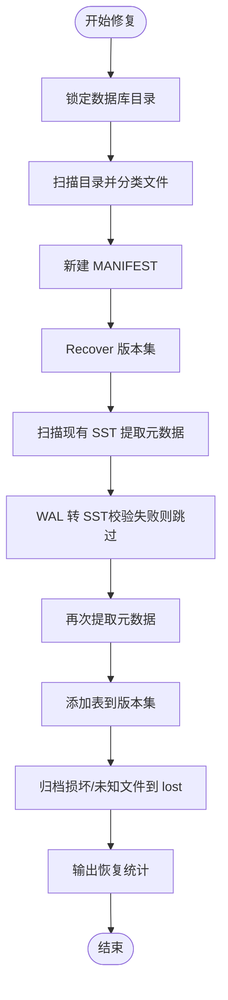
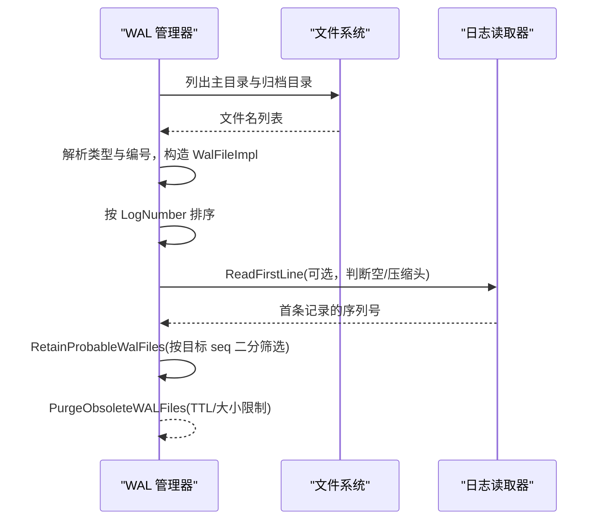
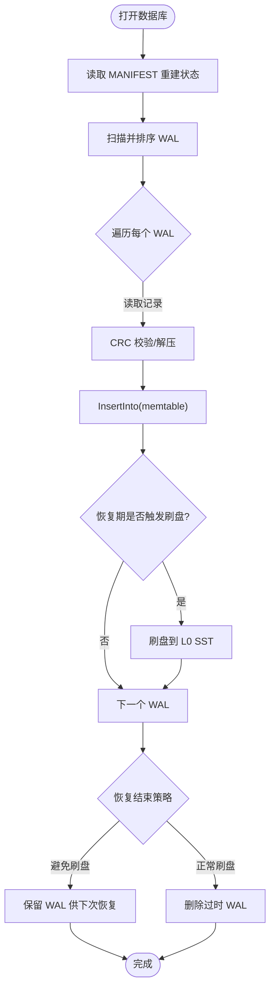
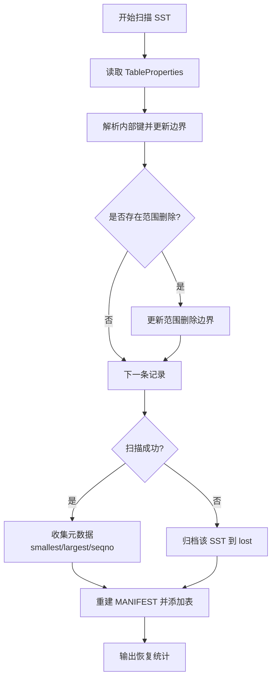
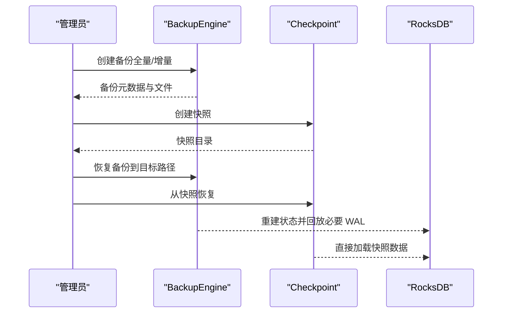
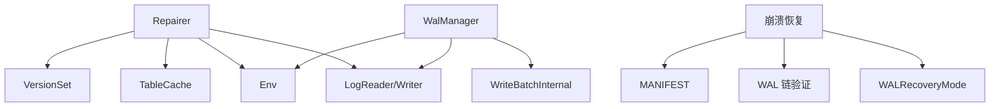

# 数据恢复

<cite>
**本文引用的文件**   
- [repair.cc](file://source/rocksdb/db/repair.cc)
- [wal_manager.cc](file://source/rocksdb/db/wal_manager.cc)
- [09_crash_recovery.md](file://source/rocksdb/docs/components/write_flow/09_crash_recovery.md)
- [03_wal.md](file://source/rocksdb/docs/components/write_flow/03_wal.md)
- [corruption_test.cc](file://source/rocksdb/db/corruption_test.cc)
- [backup_engine.h](file://source/rocksdb/include/rocksdb/utilities/backup_engine.h)
- [backup_engine.cc](file://source/rocksdb/utilities/backup/backup_engine.cc)
- [checkpoint_impl.cc](file://source/rocksdb/utilities/checkpoint/checkpoint_impl.cc)
- [checkpoint.h](file://source/rocksdb/include/rocksdb/utilities/checkpoint.h)
- [tools/backup_db.sh](file://source/rocksdb/tools/backup_db.sh)
</cite>

## 目录
1. [引言](#引言)
2. [项目结构](#项目结构)
3. [核心组件](#核心组件)
4. [架构总览](#架构总览)
5. [详细组件分析](#详细组件分析)
6. [依赖关系分析](#依赖关系分析)
7. [性能考量](#性能考量)
8. [故障排查指南](#故障排查指南)
9. [结论](#结论)
10. [附录](#附录)

## 引言
本指南面向在 RocksDB 环境下进行数据恢复与灾难恢复的工程师，提供从损坏检测、WAL 重放、SST 检查修复到备份恢复策略的完整操作手册。内容基于仓库中的实现与文档，覆盖 WAL 恢复模式、一致性校验、工具使用与最佳实践，帮助在数据损坏场景下快速恢复服务并降低 RPO/RTO。

## 项目结构
本项目包含多个 RocksDB 分支与配套脚本，其中与数据恢复直接相关的核心代码集中在 rocksdb 源码目录：
- 修复器（Repairer）：负责扫描数据库目录、转换 WAL 为 SST、重建元数据与描述符
- WAL 管理器：负责 WAL 文件生命周期、归档、清理与按序列号定位
- 崩溃恢复文档：说明打开数据库时的 WAL 回放流程与一致性保证
- 备份与快照：BackupEngine 与 Checkpoint 用于离线备份与快速恢复
- 损坏测试用例：验证 WAL/SST 损坏处理与恢复行为



**图示来源** 
- [repair.cc:1-800](file://source/rocksdb/db/repair.cc#L1-L800)
- [wal_manager.cc:1-547](file://source/rocksdb/db/wal_manager.cc#L1-L547)
- [09_crash_recovery.md:1-79](file://source/rocksdb/docs/components/write_flow/09_crash_recovery.md#L1-L79)
- [03_wal.md:1-132](file://source/rocksdb/docs/components/write_flow/03_wal.md#L1-L132)
- [backup_engine.cc:1-200](file://source/rocksdb/utilities/backup/backup_engine.cc#L1-L200)
- [backup_engine.h:1-200](file://source/rocksdb/include/rocksdb/utilities/backup_engine.h#L1-L200)
- [checkpoint_impl.cc:1-200](file://source/rocksdb/utilities/checkpoint/checkpoint_impl.cc#L1-L200)
- [checkpoint.h:1-200](file://source/rocksdb/include/rocksdb/utilities/checkpoint.h#L1-L200)
- [corruption_test.cc:1-200](file://source/rocksdb/db/corruption_test.cc#L1-L200)

**章节来源**
- [repair.cc:1-800](file://source/rocksdb/db/repair.cc#L1-L800)
- [wal_manager.cc:1-547](file://source/rocksdb/db/wal_manager.cc#L1-L547)
- [09_crash_recovery.md:1-79](file://source/rocksdb/docs/components/write_flow/09_crash_recovery.md#L1-L79)
- [03_wal.md:1-132](file://source/rocksdb/docs/components/write_flow/03_wal.md#L1-L132)
- [corruption_test.cc:1-200](file://source/rocksdb/db/corruption_test.cc#L1-L200)

## 核心组件
- 修复器（Repairer）：将 WAL 转换为 SST，提取表元数据，重建 MANIFEST，归档不可用文件，输出恢复统计信息
- WAL 管理器（WalManager）：管理 WAL 文件排序、归档、过期清理、按序列号检索更新、读取首条记录以判断空文件或压缩头
- 崩溃恢复流程：打开数据库时回放 WAL 到 memtable，根据选项决定是否刷新或保留 WAL 以供后续恢复
- 备份与快照：通过 BackupEngine 创建增量/全量备份，或通过 Checkpoint 生成一致快照用于快速恢复
- 损坏测试：模拟 WAL/SST 损坏，验证恢复模式与错误容忍行为

**章节来源**
- [repair.cc:1-800](file://source/rocksdb/db/repair.cc#L1-L800)
- [wal_manager.cc:1-547](file://source/rocksdb/db/wal_manager.cc#L1-L547)
- [09_crash_recovery.md:1-79](file://source/rocksdb/docs/components/write_flow/09_crash_recovery.md#L1-L79)
- [backup_engine.cc:1-200](file://source/rocksdb/utilities/backup/backup_engine.cc#L1-L200)
- [checkpoint_impl.cc:1-200](file://source/rocksdb/utilities/checkpoint/checkpoint_impl.cc#L1-L200)

## 架构总览
RocksDB 的数据恢复由“WAL 回放 + 表扫描 + 版本重建”构成；备份与快照提供离线一致性点，便于快速回滚与迁移。

```mermaid
sequenceDiagram
participant App as "应用"
participant DB as "RocksDB"
participant WAL as "WAL 管理器"
participant Log as "日志读取器"
participant Mem as "MemTable"
participant SST as "SST 构建器"
participant Ver as "版本集 VersionSet"
App->>DB : 打开数据库
DB->>Ver : 读取 MANIFEST 重建状态
DB->>WAL : 获取排序后的 WAL 列表
loop 按 log_number 顺序
WAL->>Log : 读取记录(含CRC校验/解压)
Log-->>WAL : WriteBatch
WAL->>Mem : InsertInto(多CF路由)
opt : 恢复中触发刷盘
Mem->>SST : Flush 到 L0
end
alt 避免恢复期刷盘
DB->>WAL : 保留WAL供下次恢复
else 正常恢复
DB->>WAL : 删除过时WAL
end
DB-->>App : 恢复完成
```

**图示来源** 
- [09_crash_recovery.md:1-79](file://source/rocksdb/docs/components/write_flow/09_crash_recovery.md#L1-L79)
- [wal_manager.cc:103-130](file://source/rocksdb/db/wal_manager.cc#L103-L130)
- [03_wal.md:55-83](file://source/rocksdb/docs/components/write_flow/03_wal.md#L55-L83)

**章节来源**
- [09_crash_recovery.md:1-79](file://source/rocksdb/docs/components/write_flow/09_crash_recovery.md#L1-L79)
- [wal_manager.cc:103-130](file://source/rocksdb/db/wal_manager.cc#L103-L130)
- [03_wal.md:55-83](file://source/rocksdb/docs/components/write_flow/03_wal.md#L55-L83)

## 详细组件分析

### 修复器（Repairer）分析与操作流程
- 功能要点
  - 扫描数据库目录与 WAL 目录，分类文件（descriptor、wal、table）
  - 将 WAL 转换为 SST（跳过校验失败段，优先一致性）
  - 扫描现有 SST 计算边界、最大序列号、最老 blob 引用等元数据
  - 重建 MANIFEST，设置 next-file-number、last-sequence-number，清空 compaction pointers
  - 归档无法识别或损坏的文件至 lost 目录，输出恢复统计

- 操作步骤（建议）
  1) 停止写入并锁定数据库目录
  2) 执行修复流程（调用修复入口），观察日志输出与归档文件
  3) 验证 MANIFEST 与 SST 元数据完整性
  4) 启动数据库并检查读路径是否可用



**图示来源** 
- [repair.cc:197-247](file://source/rocksdb/db/repair.cc#L197-L247)
- [repair.cc:286-338](file://source/rocksdb/db/repair.cc#L286-L338)
- [repair.cc:340-354](file://source/rocksdb/db/repair.cc#L340-L354)
- [repair.cc:514-532](file://source/rocksdb/db/repair.cc#L514-L532)
- [repair.cc:669-771](file://source/rocksdb/db/repair.cc#L669-L771)

**章节来源**
- [repair.cc:197-247](file://source/rocksdb/db/repair.cc#L197-L247)
- [repair.cc:286-338](file://source/rocksdb/db/repair.cc#L286-L338)
- [repair.cc:340-354](file://source/rocksdb/db/repair.cc#L340-L354)
- [repair.cc:514-532](file://source/rocksdb/db/repair.cc#L514-L532)
- [repair.cc:669-771](file://source/rocksdb/db/repair.cc#L669-L771)

### WAL 管理与重放（WAL 恢复与重放）
- 关键能力
  - 获取排序后的 WAL 文件（主目录与归档目录合并，去重）
  - 按目标序列号二分查找并保留可能包含更新的 WAL 集合
  - 读取首条记录判断空文件或压缩头，支持缓存加速
  - 归档与清理过期/空 WAL，支持 TTL 与大小限制

- 操作步骤（建议）
  1) 确认 WAL 目录与归档目录存在且可访问
  2) 使用 GetSortedWalFiles 获取有序 WAL 列表
  3) 若需从某序列号恢复，使用 RetainProbableWalFiles 筛选
  4) 通过 ReadFirstLine 快速判断空文件或压缩头
  5) 清理过期/空 WAL 后重启恢复流程



**图示来源** 
- [wal_manager.cc:45-101](file://source/rocksdb/db/wal_manager.cc#L45-L101)
- [wal_manager.cc:368-392](file://source/rocksdb/db/wal_manager.cc#L368-L392)
- [wal_manager.cc:468-544](file://source/rocksdb/db/wal_manager.cc#L468-L544)
- [wal_manager.cc:140-285](file://source/rocksdb/db/wal_manager.cc#L140-L285)

**章节来源**
- [wal_manager.cc:45-101](file://source/rocksdb/db/wal_manager.cc#L45-L101)
- [wal_manager.cc:368-392](file://source/rocksdb/db/wal_manager.cc#L368-L392)
- [wal_manager.cc:468-544](file://source/rocksdb/db/wal_manager.cc#L468-L544)
- [wal_manager.cc:140-285](file://source/rocksdb/db/wal_manager.cc#L140-L285)

### 崩溃恢复流程（WAL 重放与一致性）
- 打开数据库时的标准流程
  - 读取 MANIFEST 重建 LSM 状态
  - 扫描 WAL 目录并按 log_number 顺序回放
  - CRC 校验、解压、WriteBatch 插入 memtable
  - 根据选项决定是否在恢复期间刷盘或保留 WAL

- 恢复模式（WALRecoveryMode）
  - kPointInTimeRecovery：遇到首个损坏即停止
  - kTolerateCorruptedTailRecords：容忍尾部不完整记录
  - kAbsoluteConsistency：任何损坏均报错
  - kSkipAnyCorruptedRecords：跳过损坏记录继续（谨慎使用）



**图示来源** 
- [09_crash_recovery.md:9-31](file://source/rocksdb/docs/components/write_flow/09_crash_recovery.md#L9-L31)
- [09_crash_recovery.md:50-60](file://source/rocksdb/docs/components/write_flow/09_crash_recovery.md#L50-L60)

**章节来源**
- [09_crash_recovery.md:9-31](file://source/rocksdb/docs/components/write_flow/09_crash_recovery.md#L9-L31)
- [09_crash_recovery.md:50-60](file://source/rocksdb/docs/components/write_flow/09_crash_recovery.md#L50-L60)

### SST 文件检查与修复（工具与方法）
- 检查方法
  - 使用修复器扫描 SST，提取元数据并报告不可解析键或列族不一致
  - 对范围删除（Range Tombstones）进行边界更新与校验
  - 归档无法扫描的 SST 文件至 lost 目录

- 修复方法
  - 通过修复器重建 MANIFEST，将所有有效 SST 加入 Level 0
  - 设置 next-file-number 与 last-sequence-number，清空 compaction pointers
  - 输出恢复统计（恢复文件数与字节数），提示可能存在数据丢失



**图示来源** 
- [repair.cc:514-532](file://source/rocksdb/db/repair.cc#L514-L532)
- [repair.cc:534-667](file://source/rocksdb/db/repair.cc#L534-L667)
- [repair.cc:669-771](file://source/rocksdb/db/repair.cc#L669-L771)

**章节来源**
- [repair.cc:514-532](file://source/rocksdb/db/repair.cc#L514-L532)
- [repair.cc:534-667](file://source/rocksdb/db/repair.cc#L534-L667)
- [repair.cc:669-771](file://source/rocksdb/db/repair.cc#L669-L771)

### 备份与恢复策略（BackupEngine 与 Checkpoint）
- 备份策略
  - 使用 BackupEngine 创建增量/全量备份，结合 WAL 链与 MANIFEST 保证一致性
  - 使用 Checkpoint 生成一致的快照，适合快速复制与迁移

- 恢复策略
  - 通过 BackupEngine 恢复到指定时间点或最新状态
  - 使用 Checkpoint 快速拉起副本，减少 WAL 回放时间



**图示来源** 
- [backup_engine.cc:1-200](file://source/rocksdb/utilities/backup/backup_engine.cc#L1-L200)
- [backup_engine.h:1-200](file://source/rocksdb/include/rocksdb/utilities/backup_engine.h#L1-L200)
- [checkpoint_impl.cc:1-200](file://source/rocksdb/utilities/checkpoint/checkpoint_impl.cc#L1-L200)
- [checkpoint.h:1-200](file://source/rocksdb/include/rocksdb/utilities/checkpoint.h#L1-L200)

**章节来源**
- [backup_engine.cc:1-200](file://source/rocksdb/utilities/backup/backup_engine.cc#L1-L200)
- [backup_engine.h:1-200](file://source/rocksdb/include/rocksdb/utilities/backup_engine.h#L1-L200)
- [checkpoint_impl.cc:1-200](file://source/rocksdb/utilities/checkpoint/checkpoint_impl.cc#L1-L200)
- [checkpoint.h:1-200](file://source/rocksdb/include/rocksdb/utilities/checkpoint.h#L1-L200)

### 数据一致性验证与修复技术
- WAL 链验证
  - track_and_verify_wals_in_manifest：MANIFEST 中记录已关闭 WAL 的同步大小
  - track_and_verify_wals：WAL 内嵌前驱信息，形成可验证链，检测缺失或截断

- 损坏检测
  - CRC 校验、log number 匹配、分片顺序校验、压缩头处理
  - 恢复模式控制容忍度（如容忍尾部不完整记录）

- 修复技术
  - 修复器跳过损坏记录，重建 MANIFEST
  - 归档损坏文件，输出统计，提示潜在数据丢失

**章节来源**
- [03_wal.md:97-115](file://source/rocksdb/docs/components/write_flow/03_wal.md#L97-L115)
- [09_crash_recovery.md:39-60](file://source/rocksdb/docs/components/write_flow/09_crash_recovery.md#L39-L60)
- [repair.cc:197-247](file://source/rocksdb/db/repair.cc#L197-L247)

### 灾难恢复完整流程与最佳实践
- 灾难恢复步骤
  1) 隔离受损实例，保存现场（WAL、SST、MANIFEST）
  2) 尝试 WAL 回放恢复（调整 WALRecoveryMode）
  3) 若失败，运行修复器重建 MANIFEST 与表元数据
  4) 使用最近备份或快照进行恢复
  5) 验证数据一致性与业务可用性

- 最佳实践
  - 定期创建备份与快照，保留多代历史
  - 启用 WAL 链验证与 MANIFEST 跟踪
  - 监控 WAL 大小与归档目录空间，避免溢出
  - 演练恢复流程，缩短 RTO

**章节来源**
- [09_crash_recovery.md:9-31](file://source/rocksdb/docs/components/write_flow/09_crash_recovery.md#L9-L31)
- [backup_engine.cc:1-200](file://source/rocksdb/utilities/backup/backup_engine.cc#L1-L200)
- [checkpoint_impl.cc:1-200](file://source/rocksdb/utilities/checkpoint/checkpoint_impl.cc#L1-L200)

### 数据迁移与版本升级注意事项
- 迁移注意事项
  - 确保目标环境兼容当前 MANIFEST 与 SST 格式
  - 使用 Checkpoint 生成快照进行跨实例迁移
  - 迁移后验证列族名称与比较器一致性

- 版本升级
  - 先升级只读副本，验证兼容性后再切换主库
  - 关注 WAL 回收与压缩模式的兼容性
  - 升级后运行修复器扫描，确保元数据一致

**章节来源**
- [repair.cc:584-597](file://source/rocksdb/db/repair.cc#L584-L597)
- [03_wal.md:127-132](file://source/rocksdb/docs/components/write_flow/03_wal.md#L127-L132)

## 依赖关系分析
- 组件耦合
  - Repairer 依赖 VersionSet、TableCache、Env、LogReader/Writer
  - WalManager 依赖 Env、LogReader、WriteBatchInternal
  - 崩溃恢复依赖 MANIFEST、WAL 链验证、WALRecoveryMode

- 外部依赖
  - 文件系统（Env/FileSystem）
  - 日志与压缩（log::Reader/Writer）
  - 备份与快照（BackupEngine、Checkpoint）



**图示来源** 
- [repair.cc:197-247](file://source/rocksdb/db/repair.cc#L197-L247)
- [wal_manager.cc:103-130](file://source/rocksdb/db/wal_manager.cc#L103-L130)
- [09_crash_recovery.md:9-31](file://source/rocksdb/docs/components/write_flow/09_crash_recovery.md#L9-L31)

**章节来源**
- [repair.cc:197-247](file://source/rocksdb/db/repair.cc#L197-L247)
- [wal_manager.cc:103-130](file://source/rocksdb/db/wal_manager.cc#L103-L130)
- [09_crash_recovery.md:9-31](file://source/rocksdb/docs/components/write_flow/09_crash_recovery.md#L9-L31)

## 性能考量
- WAL 回放性能
  - 启用 WAL 压缩可减少 IO 但增加 CPU
  - 恢复期刷盘受 WriteBufferManager 控制，可能触发中间刷盘
- 修复器扫描
  - SST 扫描与元数据提取为 IO 密集，建议低峰期执行
- 备份与快照
  - 增量备份减少 IO 压力；快照适合快速复制

[本节为通用指导，不直接分析具体文件]

## 故障排查指南
- 常见损坏类型与处理
  - CRC 不匹配：记录丢弃并上报错误
  - 回收文件中的陈旧数据：log number 不匹配则忽略
  - 分片顺序错误：报告错误并丢弃部分记录
  - 尾部截断：根据 WALRecoveryMode 决定行为

- 排查步骤
  1) 查看 info_log 中的错误与警告
  2) 检查 WAL 链与 MANIFEST 一致性
  3) 运行修复器并归档损坏文件
  4) 使用备份或快照恢复

**章节来源**
- [09_crash_recovery.md:39-60](file://source/rocksdb/docs/components/write_flow/09_crash_recovery.md#L39-L60)
- [corruption_test.cc:140-143](file://source/rocksdb/db/corruption_test.cc#L140-L143)

## 结论
通过系统化的 WAL 回放、修复器重建、备份与快照机制，RocksDB 能够在数据损坏场景下提供强一致性的恢复能力。结合 WAL 链验证与 MANIFEST 跟踪，可有效检测与防御文件系统级损坏。建议在生产环境中建立完善的备份与演练流程，确保快速恢复与业务连续性。

[本节为总结性内容，不直接分析具体文件]

## 附录
- 工具与脚本
  - 备份脚本：tools/backup_db.sh
  - 备份接口：include/rocksdb/utilities/backup_engine.h
  - 备份实现：utilities/backup/backup_engine.cc
  - 快照接口：include/rocksdb/utilities/checkpoint.h
  - 快照实现：utilities/checkpoint/checkpoint_impl.cc

**章节来源**
- [tools/backup_db.sh:1-200](file://source/rocksdb/tools/backup_db.sh#L1-L200)
- [backup_engine.h:1-200](file://source/rocksdb/include/rocksdb/utilities/backup_engine.h#L1-L200)
- [backup_engine.cc:1-200](file://source/rocksdb/utilities/backup/backup_engine.cc#L1-L200)
- [checkpoint.h:1-200](file://source/rocksdb/include/rocksdb/utilities/checkpoint.h#L1-L200)
- [checkpoint_impl.cc:1-200](file://source/rocksdb/utilities/checkpoint/checkpoint_impl.cc#L1-L200)