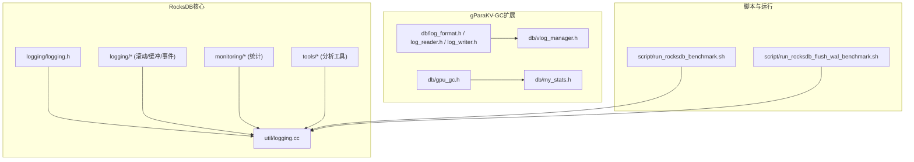
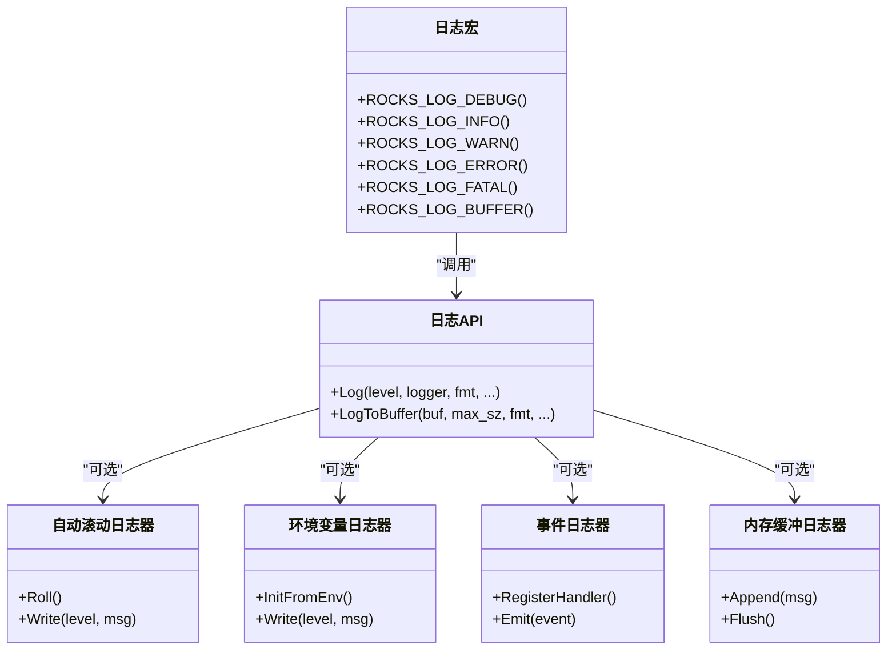
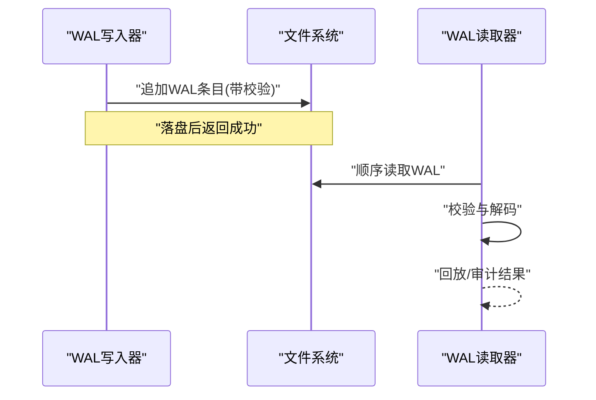
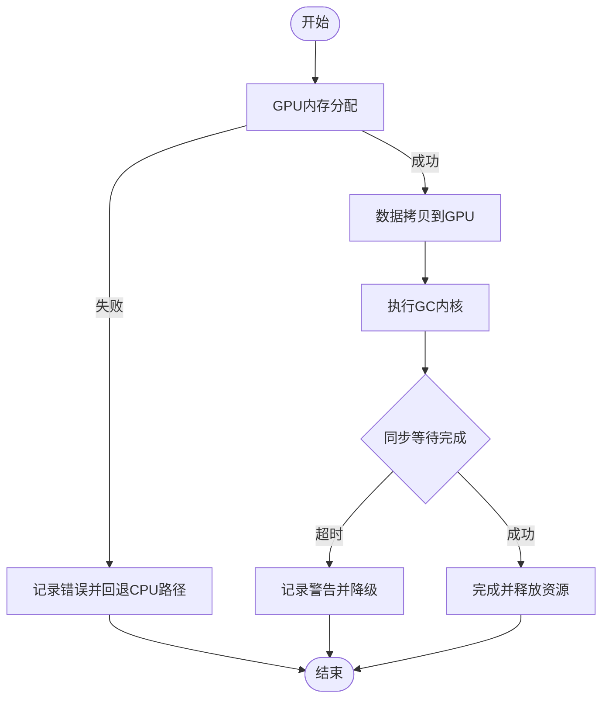
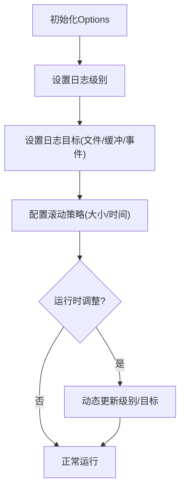
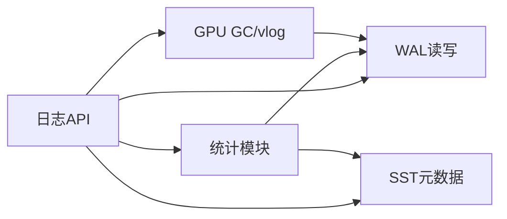

# 日志分析

<cite>
**本文引用的文件**   
- [logging.h](file://source/rocksdb/logging/logging.h)
- [auto_roll_logger.cc](file://source/rocksdb/logging/auto_roll_logger.cc)
- [env_logger.h](file://source/rocksdb/logging/env_logger.h)
- [event_logger.cc](file://source/rocksdb/logging/event_logger.cc)
- [log_buffer.cc](file://source/rocksdb/logging/log_buffer.cc)
- [options.h](file://source/rocksdb/include/rocksdb/options.h)
- [logging.cc](file://source/rocksdb/util/logging.cc)
- [log_format.h](file://source/gParaKV-GC-master/db/log_format.h)
- [log_reader.h](file://source/gParaKV-GC-master/db/log_reader.h)
- [log_writer.h](file://source/gParaKV-GC-master/db/log_writer.h)
- [my_stats.h](file://source/gParaKV-GC-master/db/my_stats.h)
- [vlog_manager.h](file://source/gParaKV-GC-master/db/vlog_manager.h)
- [gpu_gc.h](file://source/gParaKV-GC-master/db/gpu_gc.h)
- [run_rocksdb_benchmark.sh](file://script/run_rocksdb_benchmark.sh)
- [run_rocksdb_flush_wal_benchmark.sh](file://script/run_rocksdb_flush_wal_benchmark.sh)
</cite>

## 目录
1. [简介](#简介)
2. [项目结构](#项目结构)
3. [核心组件](#核心组件)
4. [架构总览](#架构总览)
5. [详细组件分析](#详细组件分析)
6. [依赖关系分析](#依赖关系分析)
7. [性能考量](#性能考量)
8. [故障排查指南](#故障排查指南)
9. [结论](#结论)
10. [附录](#附录)

## 简介
本操作指南面向RocksDB及其衍生实现（含gParaKV-GC与自定义flush/WAL增强分支）的日志分析与问题定位。内容覆盖：
- RocksDB日志体系：WAL日志、SST元数据、统计信息、事件日志等
- 日志级别配置与动态调整方法
- 日志过滤与分析工具使用
- 常见日志模式与问题关联
- GPU相关日志分析方法
- 性能指标日志解读与优化建议
- 自动化日志分析与告警配置，快速定位根因

## 项目结构
本项目包含多个RocksDB相关源码与脚本：
- source/rocksdb：官方RocksDB源码，含logging、util/logging、monitoring、tools等
- source/gParaKV-GC-*：基于LevelDB/RocksDB的GPU加速与垃圾回收扩展，含vlog、gpu_gc、my_stats等
- script：基准测试与运行脚本，常用于生成并收集日志

图表来源
- [logging.h:1-63](file://source/rocksdb/logging/logging.h#L1-L63)
- [logging.cc](file://source/rocksdb/util/logging.cc)
- [log_format.h](file://source/gParaKV-GC-master/db/log_format.h)
- [vlog_manager.h](file://source/gParaKV-GC-master/db/vlog_manager.h)
- [gpu_gc.h](file://source/gParaKV-GC-master/db/gpu_gc.h)
- [my_stats.h](file://source/gParaKV-GC-master/db/my_stats.h)
- [run_rocksdb_benchmark.sh](file://script/run_rocksdb_benchmark.sh)
- [run_rocksdb_flush_wal_benchmark.sh](file://script/run_rocksdb_flush_wal_benchmark.sh)

章节来源
- [logging.h:1-63](file://source/rocksdb/logging/logging.h#L1-L63)
- [options.h:1-200](file://source/rocksdb/include/rocksdb/options.h#L1-L200)

## 核心组件
- 日志宏与API：ROCKS_LOG_*系列宏定义统一输出格式与文件行号信息，便于定位
- 日志后端：自动滚动日志、环境变量日志、事件日志、内存缓冲日志
- 统计与监控：全局统计、压缩/写入/读放大、I/O吞吐、延迟分布
- WAL与SST：WAL记录写路径一致性；SST文件元数据用于版本管理与恢复
- GPU与vlog：GPU侧GC与异步日志管理，辅助定位GPU资源与任务调度问题

章节来源
- [logging.h:15-63](file://source/rocksdb/logging/logging.h#L15-L63)
- [auto_roll_logger.cc](file://source/rocksdb/logging/auto_roll_logger.cc)
- [env_logger.h](file://source/rocksdb/logging/env_logger.h)
- [event_logger.cc](file://source/rocksdb/logging/event_logger.cc)
- [log_buffer.cc](file://source/rocksdb/logging/log_buffer.cc)
- [my_stats.h](file://source/gParaKV-GC-master/db/my_stats.h)
- [vlog_manager.h](file://source/gParaKV-GC-master/db/vlog_manager.h)
- [gpu_gc.h](file://source/gParaKV-GC-master/db/gpu_gc.h)

## 架构总览
RocksDB日志系统由“宏层→API层→后端层”构成，支持多目标输出（文件、缓冲区、事件），并与统计模块联动。

图表来源
- [logging.h:15-63](file://source/rocksdb/logging/logging.h#L15-L63)
- [auto_roll_logger.cc](file://source/rocksdb/logging/auto_roll_logger.cc)
- [env_logger.h](file://source/rocksdb/logging/env_logger.h)
- [event_logger.cc](file://source/rocksdb/logging/event_logger.cc)
- [log_buffer.cc](file://source/rocksdb/logging/log_buffer.cc)

## 详细组件分析

### WAL日志结构与解析
- WAL（预写日志）保证原子性与崩溃恢复，按顺序追加写入，包含事务边界与校验
- gParaKV-GC提供log_format、log_reader、log_writer以适配自定义WAL语义
- 解析流程：打开WAL→读取条目→校验→回放或审计

图表来源
- [log_format.h](file://source/gParaKV-GC-master/db/log_format.h)
- [log_reader.h](file://source/gParaKV-GC-master/db/log_reader.h)
- [log_writer.h](file://source/gParaKV-GC-master/db/log_writer.h)

章节来源
- [log_format.h](file://source/gParaKV-GC-master/db/log_format.h)
- [log_reader.h](file://source/gParaKV-GC-master/db/log_reader.h)
- [log_writer.h](file://source/gParaKV-GC-master/db/log_writer.h)

### SST文件元数据与版本管理
- SST文件为不可变排序表，包含块索引、过滤器、元数据（如最小/最大键、压缩类型）
- 版本集维护SST集合与Compaction策略，确保一致读与高效查找
- 通过工具dump SST元数据进行离线分析

章节来源
- [options.h:1-200](file://source/rocksdb/include/rocksdb/options.h#L1-L200)

### 统计信息与监控
- 统计项涵盖：写放大、读放大、压缩率、I/O吞吐、延迟分位、缓存命中率
- 可通过API导出或集成到监控系统，结合阈值触发告警

章节来源
- [my_stats.h](file://source/gParaKV-GC-master/db/my_stats.h)

### GPU相关日志与异步处理
- GPU GC与vlog管理负责GPU侧任务调度、内存迁移与异步完成
- 日志需关注：设备分配失败、拷贝超时、队列积压、同步等待

图表来源
- [gpu_gc.h](file://source/gParaKV-GC-master/db/gpu_gc.h)
- [vlog_manager.h](file://source/gParaKV-GC-master/db/vlog_manager.h)

章节来源
- [gpu_gc.h](file://source/gParaKV-GC-master/db/gpu_gc.h)
- [vlog_manager.h](file://source/gParaKV-GC-master/db/vlog_manager.h)

### 日志级别配置与动态调整
- 通过Options设置日志级别、目标文件、滚动策略
- 运行时可动态调整日志级别与输出目标，避免重启影响

图表来源
- [options.h:1-200](file://source/rocksdb/include/rocksdb/options.h#L1-L200)
- [auto_roll_logger.cc](file://source/rocksdb/logging/auto_roll_logger.cc)

章节来源
- [options.h:1-200](file://source/rocksdb/include/rocksdb/options.h#L1-L200)
- [auto_roll_logger.cc](file://source/rocksdb/logging/auto_roll_logger.cc)

### 日志过滤与分析工具
- 使用grep/awk/sed进行关键字过滤（如ERROR、WARN、WAL、SST、GPU）
- 使用RocksDB工具（如db_dump、sst_dump、log_parser）解析二进制与结构化日志
- 结合统计导出与可视化（Prometheus/Grafana）进行趋势分析

章节来源
- [logging.h:15-63](file://source/rocksdb/logging/logging.h#L15-L63)
- [log_buffer.cc](file://source/rocksdb/logging/log_buffer.cc)

### 常见日志模式与问题关联
- 频繁WAL滚动：可能由于write_ahead_log_size过小或写入突发
- SST膨胀与Compaction滞后：检查compaction参数与磁盘I/O瓶颈
- GPU队列积压：关注vlog日志中的等待时间与设备利用率
- 统计异常：读放大升高通常意味着热点key过多或索引失效

章节来源
- [my_stats.h](file://source/gParaKV-GC-master/db/my_stats.h)
- [vlog_manager.h](file://source/gParaKV-GC-master/db/vlog_manager.h)

## 依赖关系分析
日志系统与统计、WAL/SST、GPU模块存在紧密耦合，需关注接口契约与线程安全。

图表来源
- [logging.h:15-63](file://source/rocksdb/logging/logging.h#L15-L63)
- [my_stats.h](file://source/gParaKV-GC-master/db/my_stats.h)
- [log_format.h](file://source/gParaKV-GC-master/db/log_format.h)
- [gpu_gc.h](file://source/gParaKV-GC-master/db/gpu_gc.h)

章节来源
- [logging.h:15-63](file://source/rocksdb/logging/logging.h#L15-L63)
- [my_stats.h](file://source/gParaKV-GC-master/db/my_stats.h)

## 性能考量
- 日志级别过高会增加I/O与CPU开销，建议生产环境使用INFO及以上
- 滚动策略需平衡文件大小与检索效率，避免过小导致频繁切换
- 统计导出频率不宜过高，避免干扰主路径性能
- GPU日志应异步化，减少同步等待对延迟的影响

[本节为通用指导，不直接分析具体文件]

## 故障排查指南
- 快速定位：使用关键字过滤ERROR/FATAL，结合时间戳与线程ID
- WAL问题：检查WAL完整性与回放状态，必要时启用详细WAL日志
- SST问题：使用sst_dump分析元数据，确认版本一致性与Compaction进度
- GPU问题：查看vlog与gpu_gc日志，定位内存分配与拷贝瓶颈
- 统计异常：对比历史基线，识别突增项并追溯上游变更

章节来源
- [logging.h:15-63](file://source/rocksdb/logging/logging.h#L15-L63)
- [auto_roll_logger.cc](file://source/rocksdb/logging/auto_roll_logger.cc)
- [event_logger.cc](file://source/rocksdb/logging/event_logger.cc)
- [log_buffer.cc](file://source/rocksdb/logging/log_buffer.cc)
- [my_stats.h](file://source/gParaKV-GC-master/db/my_stats.h)
- [vlog_manager.h](file://source/gParaKV-GC-master/db/vlog_manager.h)
- [gpu_gc.h](file://source/gParaKV-GC-master/db/gpu_gc.h)

## 结论
通过系统化理解RocksDB日志体系、配置方法与工具链，结合统计与GPU日志，可高效定位问题根因并优化性能。建议建立自动化采集与分析流水线，实现实时告警与趋势洞察。

[本节为总结性内容，不直接分析具体文件]

## 附录
- 常用命令示例（参考脚本）：
  - 运行基准并收集日志：见脚本文件
  - 解析WAL与SST：使用RocksDB内置工具
  - 统计导出与可视化：集成监控系统

章节来源
- [run_rocksdb_benchmark.sh](file://script/run_rocksdb_benchmark.sh)
- [run_rocksdb_flush_wal_benchmark.sh](file://script/run_rocksdb_flush_wal_benchmark.sh)