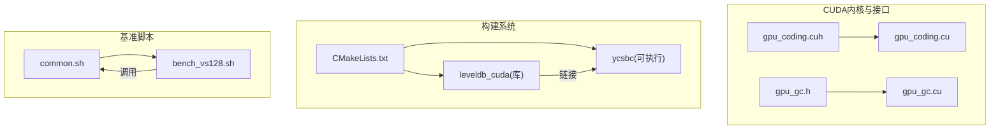
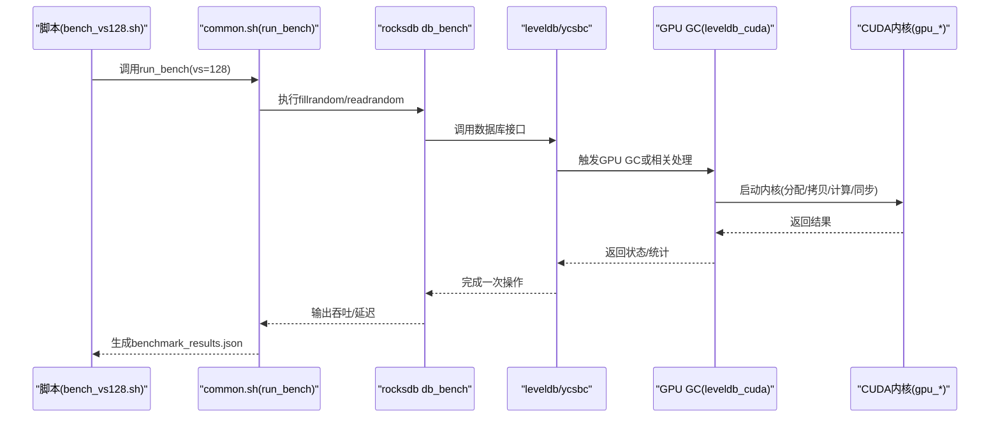
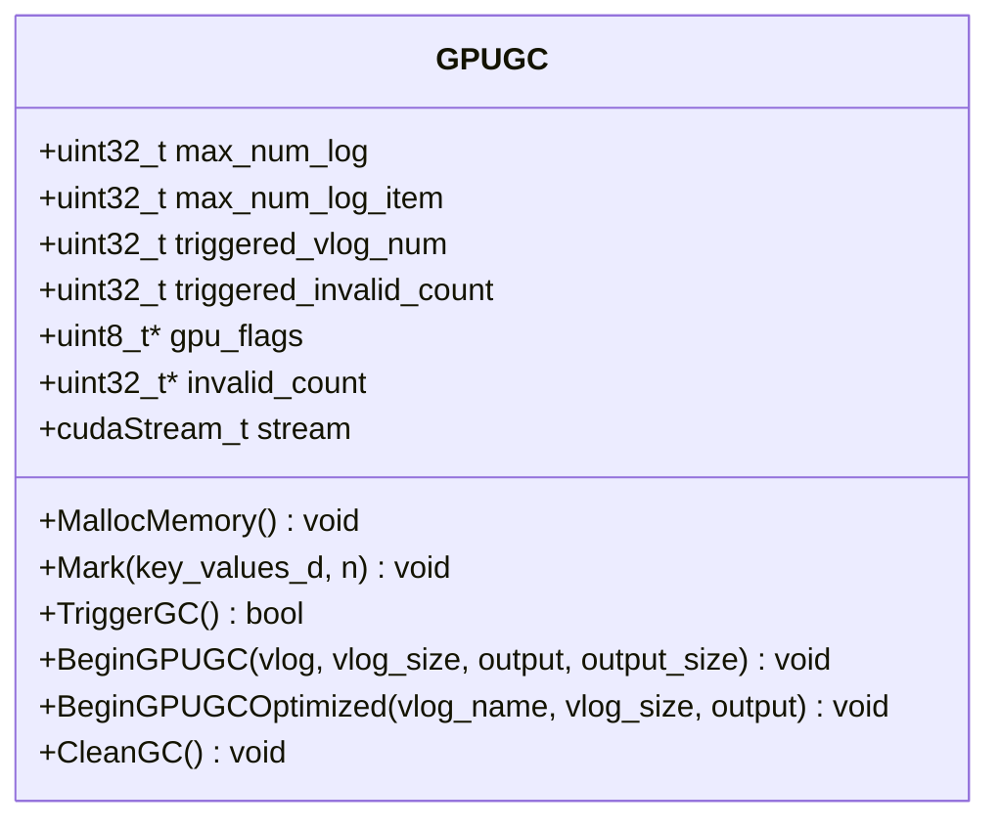
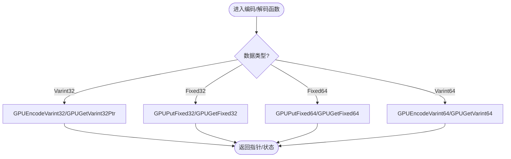
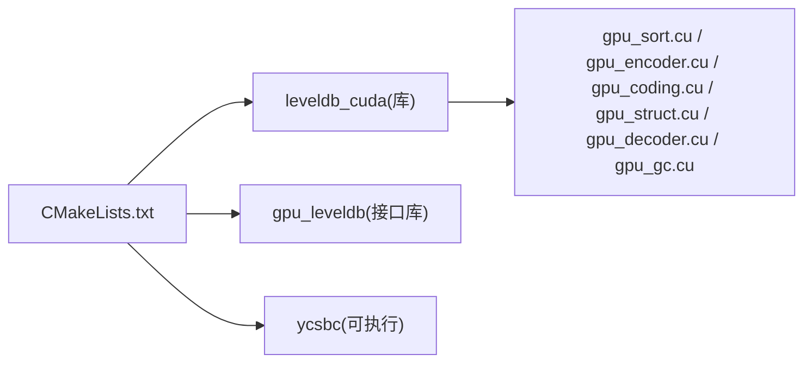
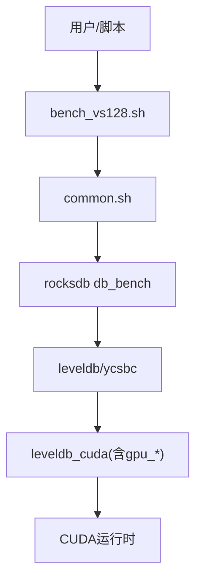

# CUDA调试工具

<cite>
**本文引用的文件**   
- [gpu_gc.cu](file://source/gParaKV-GC-master/db/cuda/gpu_gc.cu)
- [gpu_gc.h](file://source/gParaKV-GC-master/db/gpu_gc.h)
- [gpu_coding.cuh](file://source/gParaKV-GC-master/db/cuda/gpu_coding.cuh)
- [gpu_coding.cu](file://source/gParaKV-GC-master/db/cuda/gpu_coding.cu)
- [CMakeLists.txt](file://source/gParaKV-GC-master/CMakeLists.txt)
- [common.sh](file://script/common.sh)
- [bench_vs128.sh](file://script/bench_vs128.sh)
</cite>

## 目录
1. [简介](#简介)
2. [项目结构](#项目结构)
3. [核心组件](#核心组件)
4. [架构总览](#架构总览)
5. [详细组件分析](#详细组件分析)
6. [依赖关系分析](#依赖关系分析)
7. [性能与调试工具使用指南](#性能与调试工具使用指南)
8. [常见问题与排错](#常见问题与排错)
9. [结论](#结论)
10. [附录](#附录)

## 简介
本文件面向CUDA调试与性能分析，结合仓库中的GPU垃圾回收（GC）实现与基准脚本，提供一套可操作的使用文档。内容涵盖：
- cuda-gdb的配置与使用要点（内核断点、设备内存查看、线程块调试）
- nvprof的性能分析方法（内核剖析、内存访问模式、并行度评估）
- Nsight Compute与Nsight Systems的图形化分析流程
- 常见CUDA问题定位（内存越界、同步、性能瓶颈）
- GPU内存泄漏检测与优化建议
- 单元测试与集成测试策略（基于现有CMake与脚本）

说明：本仓库未直接包含cuda-gdb/nvprof/Nsight的源码，但提供了CUDA内核与构建/基准脚本，可作为上述工具的输入目标与上下文。

## 项目结构
本项目在gParaKV-GC-master中实现了GPU侧的编码/解码、排序、结构体处理以及GPU GC逻辑，并通过CMake统一构建；benchmark脚本用于驱动rocksdb的db_bench并采集结果。

图表来源
- [gpu_coding.cuh:1-80](file://source/gParaKV-GC-master/db/cuda/gpu_coding.cuh#L1-L80)
- [gpu_coding.cu:1-200](file://source/gParaKV-GC-master/db/cuda/gpu_coding.cu#L1-L200)
- [gpu_gc.h:1-53](file://source/gParaKV-GC-master/db/gpu_gc.h#L1-L53)
- [gpu_gc.cu:1-73](file://source/gParaKV-GC-master/db/cuda/gpu_gc.cu#L1-L73)
- [CMakeLists.txt:512-556](file://source/gParaKV-GC-master/CMakeLists.txt#L512-L556)
- [common.sh:1-196](file://script/common.sh#L1-L196)
- [bench_vs128.sh:1-10](file://script/bench_vs128.sh#L1-L10)

章节来源
- [CMakeLists.txt:1-557](file://source/gParaKV-GC-master/CMakeLists.txt#L1-L557)
- [common.sh:1-196](file://script/common.sh#L1-L196)
- [bench_vs128.sh:1-10](file://script/bench_vs128.sh#L1-L10)

## 核心组件
- GPU编码/解码工具集：提供变长整数与固定长度数据的编解码函数，供内核高效读写数据。
- GPU GC类与内核：封装GPU侧标记、触发GC、流式处理等能力，暴露BeginGPUGC/BegingGPUGCOptimized等入口。
- 构建与基准：CMake定义CUDA编译选项与目标；脚本统一参数、运行fillrandom/readrandom并输出JSON指标。

章节来源
- [gpu_coding.cuh:1-80](file://source/gParaKV-GC-master/db/cuda/gpu_coding.cuh#L1-L80)
- [gpu_gc.h:1-53](file://source/gParaKV-GC-master/db/gpu_gc.h#L1-L53)
- [CMakeLists.txt:512-556](file://source/gParaKV-GC-master/CMakeLists.txt#L512-L556)
- [common.sh:1-196](file://script/common.sh#L1-L196)

## 架构总览
下图展示从基准脚本到CUDA内核的调用链路与数据流向，便于理解调试切入点。

图表来源
- [bench_vs128.sh:1-10](file://script/bench_vs128.sh#L1-L10)
- [common.sh:68-196](file://script/common.sh#L68-L196)
- [CMakeLists.txt:512-556](file://source/gParaKV-GC-master/CMakeLists.txt#L512-L556)
- [gpu_gc.h:18-52](file://source/gParaKV-GC-master/db/gpu_gc.h#L18-L52)
- [gpu_gc.cu:1-73](file://source/gParaKV-GC-master/db/cuda/gpu_gc.cu#L1-L73)

## 详细组件分析

### GPU GC类与接口
- 职责：管理GPU位图、无效计数、流对象，提供标记、触发GC、开始处理与清理等方法。
- 关键成员：stream、max_num_log、max_num_log_item、gpu_flags、invalid_count等。
- 典型流程：准备设备内存→拷贝主机数据→配置线程块/网格→启动内核→同步→释放资源。

图表来源
- [gpu_gc.h:18-52](file://source/gParaKV-GC-master/db/gpu_gc.h#L18-L52)

章节来源
- [gpu_gc.h:1-53](file://source/gParaKV-GC-master/db/gpu_gc.h#L1-L53)
- [gpu_gc.cu:1-73](file://source/gParaKV-GC-master/db/cuda/gpu_gc.cu#L1-L73)

### GPU编码/解码工具
- 提供变长整数与固定宽度类型的编解码函数，支持host/device双端调用。
- 在内核中常用于序列化/反序列化键值对、元数据解析。

图表来源
- [gpu_coding.cuh:27-79](file://source/gParaKV-GC-master/db/cuda/gpu_coding.cuh#L27-L79)
- [gpu_coding.cu:1-200](file://source/gParaKV-GC-master/db/cuda/gpu_coding.cu#L1-L200)

章节来源
- [gpu_coding.cuh:1-80](file://source/gParaKV-GC-master/db/cuda/gpu_coding.cuh#L1-L80)
- [gpu_coding.cu:1-200](file://source/gParaKV-GC-master/db/cuda/gpu_coding.cu#L1-L200)

### 构建系统与CUDA编译选项
- CMake启用CUDA语言，设置-O3、fast_math、lineinfo等优化与调试信息开关。
- 定义leveldb_cuda库，聚合多个.cu源；创建gpu_leveldb接口库；构建ycsbc可执行。

图表来源
- [CMakeLists.txt:512-556](file://source/gParaKV-GC-master/CMakeLists.txt#L512-L556)

章节来源
- [CMakeLists.txt:1-557](file://source/gParaKV-GC-master/CMakeLists.txt#L1-L557)

## 依赖关系分析
- 组件内聚性：gpu_coding.cuh/.cu为纯工具层，被上层内核广泛复用；gpu_gc.h/.cu作为高层接口组织内核调用。
- 外部依赖：CMake依赖CUDA工具链；基准脚本依赖nvidia-smi与rocksdb的db_bench。
- 潜在循环：当前未见循环依赖；CMake将CUDA源归并为单一库，避免多目标重复编译。

图表来源
- [bench_vs128.sh:1-10](file://script/bench_vs128.sh#L1-L10)
- [common.sh:1-196](file://script/common.sh#L1-L196)
- [CMakeLists.txt:512-556](file://source/gParaKV-GC-master/CMakeLists.txt#L512-L556)

章节来源
- [CMakeLists.txt:1-557](file://source/gParaKV-GC-master/CMakeLists.txt#L1-L557)
- [common.sh:1-196](file://script/common.sh#L1-L196)

## 性能与调试工具使用指南

### cuda-gdb：配置与使用
- 环境准备
  - 确保已安装NVIDIA驱动与CUDA Toolkit，且cuda-gdb可用。
  - 编译时保留行号信息（CMake已开启-lineinfo），便于断点映射到源码。
- 启动与断点
  - 以cuda-gdb运行程序：cuda-gdb ./ycsbc 或 ./db_bench（根据实际可执行）。
  - 设置内核断点：break <kernel_name> 或在特定行设置断点。
  - 设置条件断点：例如按tid或索引过滤，减少无关中断。
- 设备内存查看
  - 使用print或examine命令查看设备指针指向的内容。
  - 通过cuda-memcheck辅助检查越界与未初始化访问。
- 线程块调试
  - 使用info threads查看线程状态。
  - 利用printf调试（谨慎使用，可能影响时序）或__syncthreads后打印关键变量。
- 常用技巧
  - 先在小规模数据上复现问题，再放大规模。
  - 使用cudaDeviceSynchronize定位异步错误。

章节来源
- [CMakeLists.txt:10](file://source/gParaKV-GC-master/CMakeLists.txt#L10)
- [gpu_gc.cu:1-73](file://source/gParaKV-GC-master/db/cuda/gpu_gc.cu#L1-L73)

### nvprof：性能剖析
- 基本用法
  - 运行nvprof --profile-from-start off ./ycsbc，在需要处插入同步点或使用API事件。
  - 使用--metrics获取显存带宽、SM利用率、指令吞吐等指标。
- 内核剖析
  - 关注内核执行时间、占用率、寄存器/共享内存使用。
  - 对比不同value size下的吞吐变化，识别热点内核。
- 内存访问模式
  - 观察全局内存合并访问、缓存命中率、原子操作开销。
  - 结合编码/解码路径，评估序列化带来的额外开销。
- 并行度评估
  - 检查活跃warp数、调度效率、阻塞原因（如同步或依赖）。

章节来源
- [common.sh:1-196](file://script/common.sh#L1-L196)
- [CMakeLists.txt:512-556](file://source/gParaKV-GC-master/CMakeLists.txt#L512-L556)

### Nsight Compute与Nsight Systems
- Nsight Compute
  - 选择目标进程/内核，查看执行统计、内存事务、分支发散、寄存器压力。
  - 针对GPU GC相关内核进行热点定位与优化建议。
- Nsight Systems
  - 绘制CPU-GPU时间线，观察主机与设备间的拷贝、同步、内核排队。
  - 识别CPU侧瓶颈（如I/O、锁竞争）与GPU空闲时段。

章节来源
- [CMakeLists.txt:512-556](file://source/gParaKV-GC-master/CMakeLists.txt#L512-L556)
- [common.sh:1-196](file://script/common.sh#L1-L196)

## 常见问题与排错

### 内存越界
- 现象：崩溃、脏读、数据损坏。
- 排查：cuda-memcheck定位非法访问；核对边界条件与数组索引；检查变长编码读取是否越界。
- 预防：增加边界检查；使用assert或日志记录关键索引。

章节来源
- [gpu_coding.cuh:27-79](file://source/gParaKV-GC-master/db/cuda/gpu_coding.cuh#L27-L79)
- [gpu_coding.cu:1-200](file://source/gParaKV-GC-master/db/cuda/gpu_coding.cu#L1-L200)

### 同步问题
- 现象：数据竞争、结果不确定、死锁。
- 排查：检查__syncthreads使用位置；确认跨块同步是否必要；验证异步流顺序。
- 预防：最小化同步范围；使用原子操作替代竞态写；合理划分任务粒度。

章节来源
- [gpu_gc.cu:1-73](file://source/gParaKV-GC-master/db/cuda/gpu_gc.cu#L1-L73)

### 性能瓶颈
- 现象：吞吐低、延迟高、SM利用率不足。
- 排查：Nsight Compute分析热点内核；nvprof查看内存带宽与指令级瓶颈；检查内核启动参数（block/grid）。
- 优化：合并内存访问；减少分支发散；提升寄存器/共享内存复用；批量化处理。

章节来源
- [CMakeLists.txt:512-556](file://source/gParaKV-GC-master/CMakeLists.txt#L512-L556)
- [common.sh:1-196](file://script/common.sh#L1-L196)

### GPU内存泄漏检测与优化
- 检测：cuda-memcheck报告未释放内存；自定义计数器跟踪分配/释放次数。
- 优化：RAII封装cudaMalloc/cudaFree；使用池化分配减少频繁分配；及时释放中间缓冲区。

章节来源
- [gpu_gc.h:18-52](file://source/gParaKV-GC-master/db/gpu_gc.h#L18-L52)
- [gpu_gc.cu:1-73](file://source/gParaKV-GC-master/db/cuda/gpu_gc.cu#L1-L73)

### 单元测试与集成测试策略
- 单元测试
  - 使用GoogleTest对编码/解码函数进行边界用例覆盖（空串、最大/最小值、非法输入）。
  - 针对GPU GC的标记与计数逻辑编写小规模验证用例。
- 集成测试
  - 通过CMake启用LEVELDB_BUILD_TESTS，批量运行db_*_test等用例。
  - 使用脚本驱动db_bench，校验吞吐与延迟是否在预期范围内。

章节来源
- [CMakeLists.txt:299-396](file://source/gParaKV-GC-master/CMakeLists.txt#L299-L396)
- [common.sh:68-196](file://script/common.sh#L68-L196)

## 结论
本仓库提供了GPU侧编码/解码与GC的核心实现，配合CMake与基准脚本，形成完整的开发与评测闭环。借助cuda-gdb、nvprof、Nsight Compute/Systems，可有效定位与优化CUDA内核问题。建议在开发过程中持续引入单测与集成测试，确保正确性与稳定性。

## 附录
- 快速上手
  - 构建：在gParaKV-GC-master目录下执行cmake与make，生成leveldb_cuda与ycsbc。
  - 运行基准：执行script/bench_vs128.sh，查看output/vs128/benchmark_results.json。
  - 调试：使用cuda-gdb运行ycsbc或db_bench，设置内核断点与设备内存查看。

章节来源
- [CMakeLists.txt:512-556](file://source/gParaKV-GC-master/CMakeLists.txt#L512-L556)
- [bench_vs128.sh:1-10](file://script/bench_vs128.sh#L1-L10)
- [common.sh:1-196](file://script/common.sh#L1-L196)