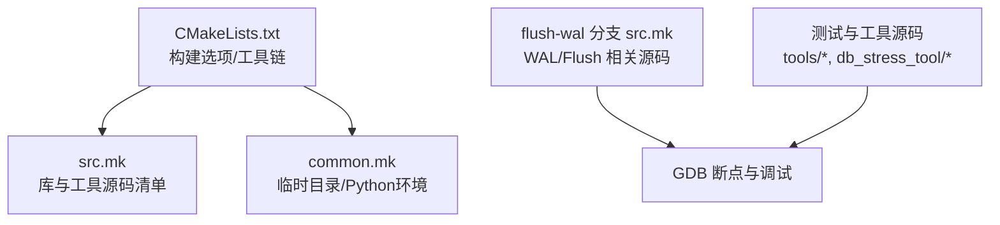
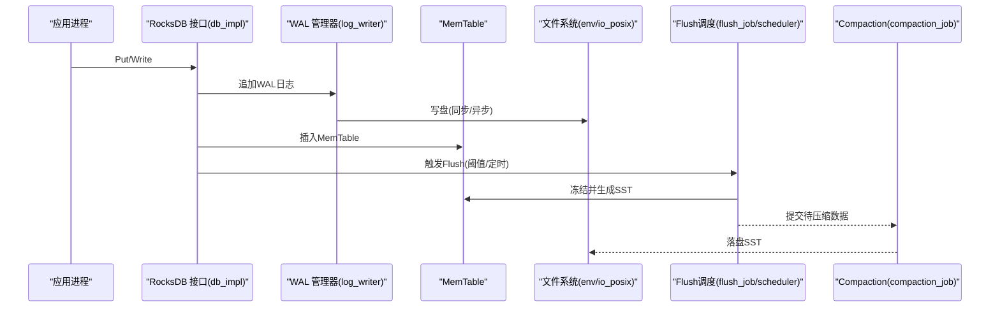
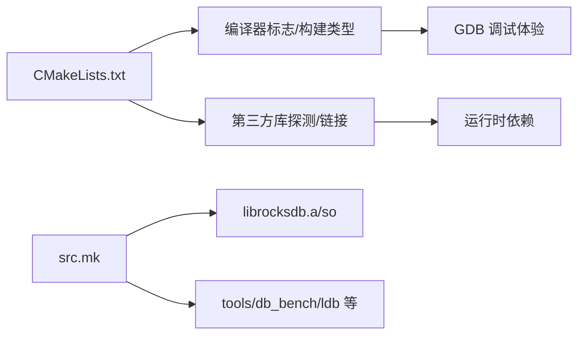

# GDB调试器使用

<cite>
**本文引用的文件**   
- [CMakeLists.txt](file://source/rocksdb/CMakeLists.txt)
- [src.mk](file://source/rocksdb/src.mk)
- [common.mk](file://source/rocksdb/common.mk)
- [src.mk（flush-wal分支）](file://source/rocksdb-flush-wal-0.2/src.mk)
- [common.mk（flush-wal分支）](file://source/rocksdb-flush-wal-0.2/common.mk)
</cite>

## 目录
1. [简介](#简介)
2. [项目结构](#项目结构)
3. [核心组件](#核心组件)
4. [架构总览](#架构总览)
5. [详细组件分析](#详细组件分析)
6. [依赖关系分析](#依赖关系分析)
7. [性能注意事项](#性能注意事项)
8. [故障排查指南](#故障排查指南)
9. [结论](#结论)
10. [附录](#附录)

## 简介
本文件面向需要在 RocksDB 上进行深度调试的工程师，系统性地说明如何使用 GDB 对 RocksDB 进行编译配置、断点设置、变量与内存状态检查、堆栈跟踪、多线程与死锁定位、内存泄漏排查以及性能瓶颈分析。文档结合仓库中的构建脚本与源码组织，给出可操作的步骤与最佳实践，帮助快速定位 WAL 写入、Flush 流程、GPU 内核调用等关键路径问题。

## 项目结构
RocksDB 在仓库中以多版本形式存在，本次调试以标准版与 flush-wal 分支为主。关键构建与源码清单如下：
- CMake 构建入口与编译器选项：CMakeLists.txt
- Makefile 源码清单：src.mk
- 通用构建辅助：common.mk
- flush-wal 分支的对应构建清单：src.mk、common.mk

图表来源 
- [CMakeLists.txt](file://source/rocksdb/CMakeLists.txt)
- [src.mk](file://source/rocksdb/src.mk)
- [common.mk](file://source/rocksdb/common.mk)
- [src.mk（flush-wal分支）](file://source/rocksdb-flush-wal-0.2/src.mk)

章节来源
- [CMakeLists.txt](file://source/rocksdb/CMakeLists.txt)
- [src.mk](file://source/rocksdb/src.mk)
- [common.mk](file://source/rocksdb/common.mk)
- [src.mk（flush-wal分支）](file://source/rocksdb-flush-wal-0.2/src.mk)
- [common.mk（flush-wal分支）](file://source/rocksdb-flush-wal-0.2/common.mk)

## 核心组件
- 构建系统与调试符号
  - CMake 默认在非 Git 环境下使用 RelWithDebInfo，Git 环境下使用 Debug；可通过 CMAKE_BUILD_TYPE 控制是否包含调试信息。
  - 非 Release 模式默认保留帧指针 -fno-omit-frame-pointer，利于堆栈回溯。
- 源码组织与关键模块
  - db/*：数据库核心实现（WAL、MemTable、Compaction、Flush、Snapshot、VersionSet 等）。
  - util/*、monitoring/*：线程池、统计、性能上下文、线程状态等。
  - tools/*、db_stress_tool/*：基准与压力工具，便于构造复现场景。
- 可选 Sanitizer 支持
  - ASan、TSan、UBSan 通过 CMake 选项启用，用于内存与并发问题定位。

章节来源
- [CMakeLists.txt](file://source/rocksdb/CMakeLists.txt)
- [src.mk](file://source/rocksdb/src.mk)

## 架构总览
下图展示从应用调用到 RocksDB 内部关键路径（WAL 写入、Flush、Compaction）的概览，并标注 GDB 常用断点位置。

图表来源 
- [src.mk](file://source/rocksdb/src.mk)
- [CMakeLists.txt](file://source/rocksdb/CMakeLists.txt)

## 详细组件分析

### 编译与调试符号配置
- 选择构建类型
  - 使用 Debug 或 RelWithDebInfo 确保生成调试符号。
  - 在 Linux/GCC 下，非 Release 默认开启 -fno-omit-frame-pointer，提升堆栈可读性。
- 启用 Sanitizer（按需）
  - WITH_ASAN：地址错误检测（不建议与 JeMalloc 同时使用）。
  - WITH_TSAN：线程竞争检测（不建议与 JeMalloc 同时使用）。
  - WITH_UBSAN：未定义行为检测。
- 其他建议
  - 保持 -g 与 -O0/-Og 组合，避免过度优化导致行号错位。
  - 若需更快链接，可使用 lld（CMake 已自动探测）。

章节来源
- [CMakeLists.txt](file://source/rocksdb/CMakeLists.txt)

### 断点策略（WAL 写入、Flush、GPU 内核）
- WAL 写入路径
  - 建议在 log_writer 相关函数处设置断点，观察日志落盘过程。
  - 关注 fsync/fdatasync 调用，验证持久化语义。
- Flush 路径
  - 在 flush_job、flush_scheduler 与 MemTable 冻结逻辑处设置断点，观察触发条件与执行顺序。
- GPU 内核调用（如存在）
  - 在 CUDA 内核启动前（如 __cudaLaunchKernel 或自定义封装）设置断点，确认参数与设备上下文。
  - 结合 nvprof/nsys 与 GDB 交叉验证。

章节来源
- [src.mk](file://source/rocksdb/src.mk)

### 常用 GDB 命令速查
- 基本运行与控制
  - run / r：启动程序
  - break / b：设置断点（按函数名或源文件+行号）
  - continue / c：继续执行
  - step / s：单步进入函数
  - next / n：单步步过
  - finish / fin：执行到当前函数返回
- 查看与修改
  - print / p：打印变量值
  - display / disp：每次暂停时显示表达式
  - set var：修改变量（谨慎使用）
- 堆栈与线程
  - bt / backtrace：查看调用栈
  - thread / t：切换线程
  - info threads：列出所有线程
  - thread apply all bt：全线程堆栈
- 内存与对象
  - x / xg：查看内存内容
  - info proc mappings：查看映射段
  - watch：设置内存断点
- 性能与诊断
  - info registers：寄存器状态
  - disassemble：反汇编当前函数
  - catch throw / catch signal：捕获异常/信号

### 多线程调试与死锁定位
- 线程快照
  - 在疑似死锁处收集全线程堆栈（thread apply all bt），记录锁持有者与等待者。
- 锁与互斥
  - 针对 pthread_mutex 加锁点设置断点，观察获取/释放顺序。
  - 使用 TSan 构建快速发现数据竞争与潜在死锁。
- 常见模式
  - 长事务持有锁期间触发 IO/阻塞，导致下游线程饥饿。
  - 后台任务（Compaction/Flush）与前台写入争用资源。

章节来源
- [src.mk](file://source/rocksdb/src.mk)

### 内存泄漏排查
- 使用 ASan
  - 启用 WITH_ASAN 构建，运行后根据报告定位分配/释放不匹配。
- 手动追踪
  - 使用 watch 监控可疑指针，结合 print/x 观察生命周期。
  - 利用 memory/* 与 util/arena 相关代码路径，检查 Arena 分配与回收。

章节来源
- [CMakeLists.txt](file://source/rocksdb/CMakeLists.txt)
- [src.mk](file://source/rocksdb/src.mk)

### 性能瓶颈分析
- 热点定位
  - 使用 perf + GDB 联合分析，先 perf record 再 attach 到热点函数。
- 关键指标
  - WAL 落盘延迟、Flush 频率与耗时、Compaction 占用 CPU/IO。
- 调优方向
  - 调整 write_buffer_size、max_write_buffer_number、compaction 策略。
  - 评估直接 I/O、异步 I/O 与缓存命中率。

章节来源
- [src.mk](file://source/rocksdb/src.mk)

### 针对 RocksDB 特定问题的调试技巧
- WAL 相关问题
  - 断点 log_writer 写入路径，检查磁盘同步策略与错误码。
  - 关注日志轮转与损坏恢复路径。
- Flush 相关问题
  - 断点 flush_job 与 memtable 冻结逻辑，检查阈值与调度。
  - 观察 SST 生成与表缓存命中情况。
- GPU 内核相关问题
  - 断点内核启动前后，核对参数、流与事件。
  - 结合设备端日志与主机端堆栈定位。

章节来源
- [src.mk](file://source/rocksdb/src.mk)

## 依赖关系分析
- 构建依赖
  - CMake 负责工具链、编译器标志、第三方库探测与链接。
  - src.mk 提供库与工具的源码清单，决定最终产物包含哪些模块。
- 运行时依赖
  - 线程库、可选压缩库、可选内存分配器（JeMalloc）、可选异步 I/O（liburing）。
- 调试依赖
  - 调试符号、Sanitizer、perf 等外部工具。

图表来源 
- [CMakeLists.txt](file://source/rocksdb/CMakeLists.txt)
- [src.mk](file://source/rocksdb/src.mk)

章节来源
- [CMakeLists.txt](file://source/rocksdb/CMakeLists.txt)
- [src.mk](file://source/rocksdb/src.mk)

## 性能注意事项
- 构建优化级别
  - Debug/RelWithDebInfo 平衡调试与性能；Release 可能隐藏部分细节。
- 帧指针与内联
  - 保留帧指针有助于堆栈；过度内联会模糊调用边界。
- 线程与 IO
  - 合理配置线程池大小与队列长度，避免过多上下文切换。
- 存储子系统
  - 评估 SSD/NVMe 特性与队列深度，减少抖动与拥塞。

[本节为通用指导，无需具体文件引用]

## 故障排查指南
- 崩溃与段错误
  - 使用 core dump 与 bt 定位；必要时附加到运行进程。
- 死锁与竞态
  - 使用 TSan 与全线程堆栈；检查锁粒度与持有时间。
- 内存问题
  - 使用 ASan 与 watch；关注 Arena 与缓存分配。
- 性能退化
  - 使用 perf 与 RocksDB 统计接口；聚焦 WAL/Flush/Compaction。

章节来源
- [CMakeLists.txt](file://source/rocksdb/CMakeLists.txt)
- [src.mk](file://source/rocksdb/src.mk)

## 结论
通过合理的构建配置（Debug/RelWithDebInfo、Sanitizer）、精准的断点策略（WAL/Flush/GPU）、系统的 GDB 命令使用与多线程/内存/性能分析方法，可以高效定位 RocksDB 的关键问题。结合仓库中的构建脚本与源码组织，建议优先从 db_impl、log_writer、flush_job 与 compaction_job 入手，逐步深入到具体模块与底层 IO。

[本节为总结，无需具体文件引用]

## 附录
- 常用断点建议（按模块）
  - WAL：log_writer 写入与同步路径
  - Flush：flush_job、flush_scheduler、memtable 冻结
  - Compaction：compaction_job 调度与执行
  - GPU：内核启动封装函数与 CUDA API
- 常用命令速记
  - b/p/c/n/s/bt/thread/watch/info threads
- 参考构建选项
  - CMAKE_BUILD_TYPE、WITH_ASAN、WITH_TSAN、WITH_UBSAN

[本节为补充信息，无需具体文件引用]