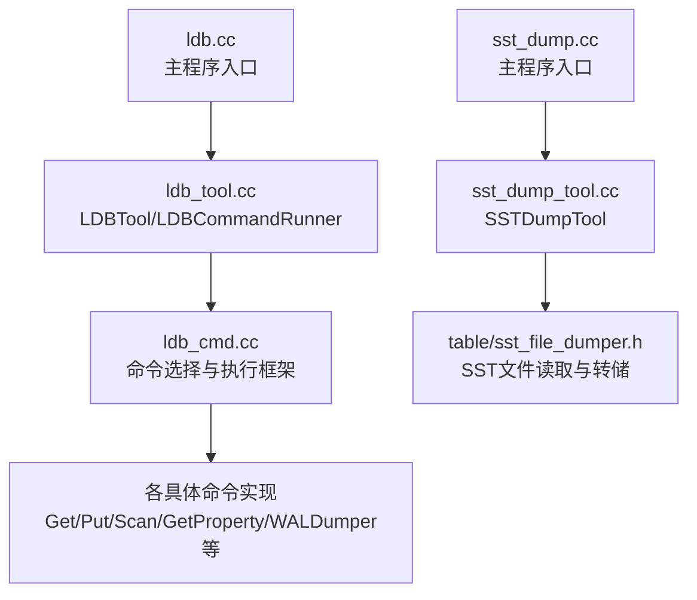
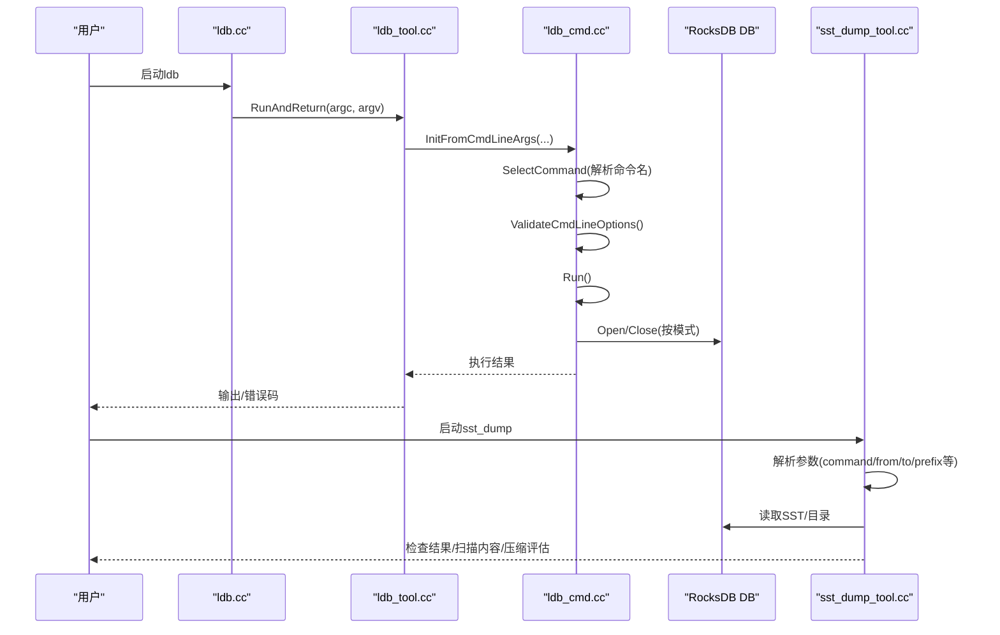
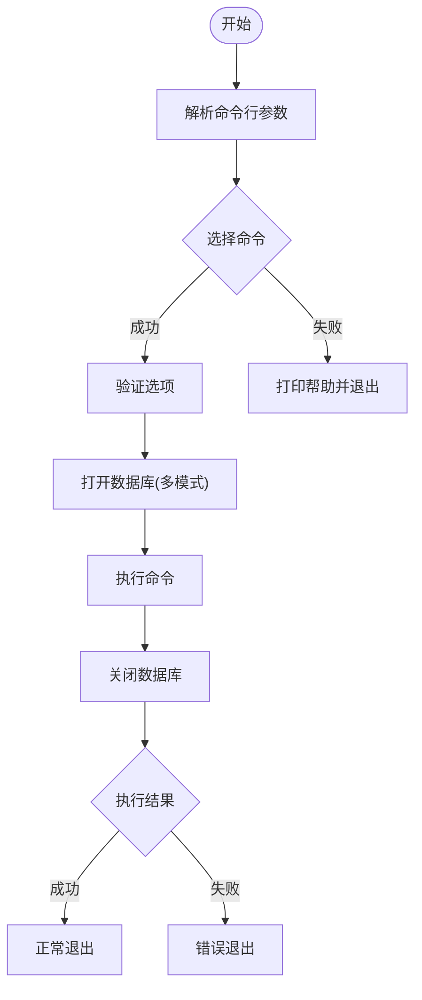
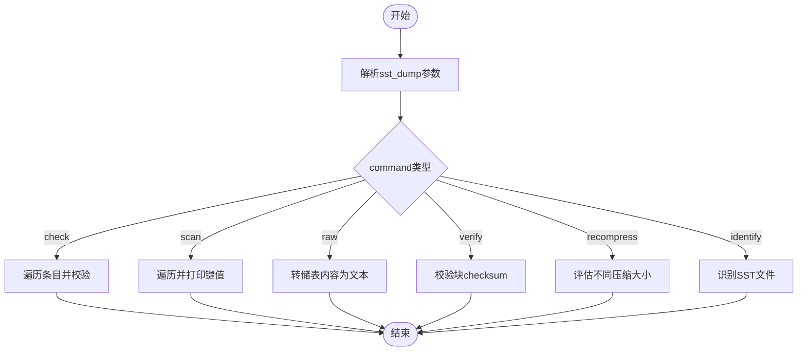
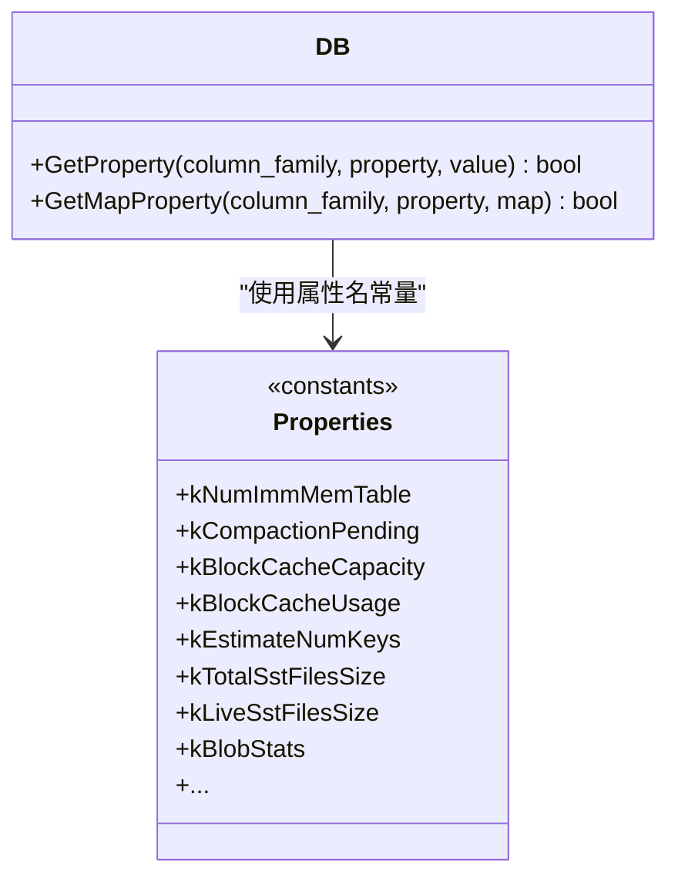
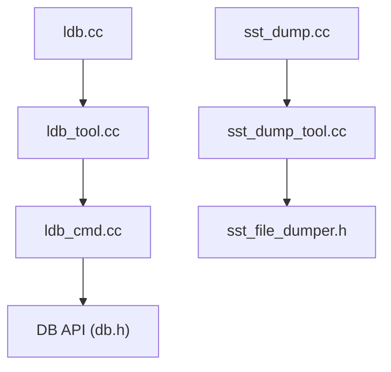

# RocksDB内置工具

<cite>
**本文引用的文件**   
- [ldb.cc](file://source/rocksdb/tools/ldb.cc)
- [ldb_tool.cc](file://source/rocksdb/tools/ldb_tool.cc)
- [ldb_cmd.cc](file://source/rocksdb/tools/ldb_cmd.cc)
- [sst_dump.cc](file://source/rocksdb/tools/sst_dump.cc)
- [sst_dump_tool.cc](file://source/rocksdb/tools/sst_dump_tool.cc)
- [db.h](file://source/rocksdb/include/rocksdb/db.h)
</cite>

## 目录
1. [简介](#简介)
2. [项目结构](#项目结构)
3. [核心组件](#核心组件)
4. [架构总览](#架构总览)
5. [详细组件分析](#详细组件分析)
6. [依赖关系分析](#依赖关系分析)
7. [性能考量](#性能考量)
8. [故障排查指南](#故障排查指南)
9. [结论](#结论)
10. [附录](#附录)

## 简介
本文件面向RocksDB内置调试与诊断工具，重点覆盖：
- ldb命令行工具：数据库结构查看、键值对查询、WAL/SST/Blob文件分析、属性与统计获取等。
- sst_dump工具：SST文件扫描、校验、压缩评估、元数据查看等。
- 运行时监控与问题诊断：通过C API的GetProperty接口获取统计信息、压缩状态、内存使用等；结合ldb命令进行快速定位。
- 批量操作的性能分析与优化建议。
- 日志级别动态调整方法（基于RocksDB通用日志机制）。

## 项目结构
RocksDB工具位于tools目录下，关键入口如下：
- ldb：统一命令行入口，解析参数并调度具体命令实现。
- sst_dump：专门用于SST文件的检查、扫描、还原与压缩评估。
- 其他辅助工具：如dump、trace_analyzer、io_tracer_parser等（不在本文重点范围）。

**图表来源** 
- [ldb.cc:1-13](file://source/rocksdb/tools/ldb.cc#L1-L13)
- [ldb_tool.cc:1-200](file://source/rocksdb/tools/ldb_tool.cc#L1-L200)
- [ldb_cmd.cc:260-440](file://source/rocksdb/tools/ldb_cmd.cc#L260-L440)
- [sst_dump.cc:1-13](file://source/rocksdb/tools/sst_dump.cc#L1-L13)
- [sst_dump_tool.cc:1-200](file://source/rocksdb/tools/sst_dump_tool.cc#L1-L200)

**章节来源**
- [ldb.cc:1-13](file://source/rocksdb/tools/ldb.cc#L1-L13)
- [ldb_tool.cc:1-200](file://source/rocksdb/tools/ldb_tool.cc#L1-L200)
- [ldb_cmd.cc:260-440](file://source/rocksdb/tools/ldb_cmd.cc#L260-L440)
- [sst_dump.cc:1-13](file://source/rocksdb/tools/sst_dump.cc#L1-L13)
- [sst_dump_tool.cc:1-200](file://source/rocksdb/tools/sst_dump_tool.cc#L1-L200)

## 核心组件
- LDBTool与LDBCommandRunner：负责帮助信息打印、参数解析、命令分发与结果输出。
- LDBCommand基类与各具体命令：封装了Open/Close DB、ColumnFamily处理、选项解析、命令执行流程。
- SSTDumpTool：解析sst_dump参数，调用SST文件读取器完成check/scan/raw/recompress/identify等操作。

关键职责：
- 参数解析：支持--db、--env_uri、--fs_uri、--cf_name、--hex/--key_hex/--value_hex、--ttl、--use_txn等。
- 数据库打开模式：普通读写、只读、Secondary/Follower、TransactionDB、TTL DB。
- 命令路由：SelectCommand根据命令名实例化对应命令对象。
- 执行生命周期：Run()中准备Env、打开DB、执行DoCommand()、关闭DB。

**章节来源**
- [ldb_tool.cc:15-193](file://source/rocksdb/tools/ldb_tool.cc#L15-L193)
- [ldb_cmd.cc:213-297](file://source/rocksdb/tools/ldb_cmd.cc#L213-L297)
- [ldb_cmd.cc:441-480](file://source/rocksdb/tools/ldb_cmd.cc#L441-L480)
- [ldb_cmd.cc:563-684](file://source/rocksdb/tools/ldb_cmd.cc#L563-L684)

## 架构总览
下图展示了ldb命令从入口到执行的完整调用链，以及sst_dump的独立入口。

**图表来源** 
- [ldb.cc:9-12](file://source/rocksdb/tools/ldb.cc#L9-L12)
- [ldb_tool.cc:152-193](file://source/rocksdb/tools/ldb_tool.cc#L152-L193)
- [ldb_cmd.cc:260-440](file://source/rocksdb/tools/ldb_cmd.cc#L260-L440)
- [sst_dump_tool.cc:167-200](file://source/rocksdb/tools/sst_dump_tool.cc#L167-L200)

## 详细组件分析

### ldb命令行工具
- 功能概览
  - 数据访问：get、put、batchput、scan、delete、single_delete、delete_range、approx_size、db_querier等。
  - 管理维护：wal_dumper、compactor、reduce_levels、change_compaction_style、db_dumper、db_loader、manifest_dump、file_checksum_dump、internal_dump、live_files_metadata_dumper、repair、backup、restore、checkpoint、write_external_sst、ingest_external_sst、unsafe_remove_sst、update_manifest等。
  - 属性与统计：get_property、list_column_families、create/drop column family。
- 常用参数
  - --db=PATH：指定数据库路径。
  - --env_uri/--fs_uri：指定底层环境或文件系统URI。
  - --secondary_path/--leader_path：以Secondary/Follower模式打开。
  - --cf_name：列族名称。
  - --hex/--key_hex/--value_hex：键值十六进制输入输出。
  - --ttl/--use_txn/--txn_write_policy：TTL/事务相关开关。
  - --try_load_options/--disable_consistency_checks/--ignore_unknown_options：加载选项与一致性检查控制。
  - 压缩与块大小：--compression_type、--block_size、--db_write_buffer_size、--write_buffer_size、--file_size等。
  - BlobDB：--enable_blob_files、--min_blob_size、--blob_file_size、--blob_compression_type、GC相关参数。
  - 时间戳读取：--read_timestamp。
- 执行流程
  - 解析参数→选择命令→验证选项→打开DB（多种模式）→执行命令→关闭DB→返回结果。

**图表来源** 
- [ldb_tool.cc:152-193](file://source/rocksdb/tools/ldb_tool.cc#L152-L193)
- [ldb_cmd.cc:260-440](file://source/rocksdb/tools/ldb_cmd.cc#L260-L440)
- [ldb_cmd.cc:441-480](file://source/rocksdb/tools/ldb_cmd.cc#L441-L480)
- [ldb_cmd.cc:563-684](file://source/rocksdb/tools/ldb_cmd.cc#L563-L684)

**章节来源**
- [ldb_tool.cc:15-150](file://source/rocksdb/tools/ldb_tool.cc#L15-L150)
- [ldb_cmd.cc:213-297](file://source/rocksdb/tools/ldb_cmd.cc#L213-L297)
- [ldb_cmd.cc:299-439](file://source/rocksdb/tools/ldb_cmd.cc#L299-L439)
- [ldb_cmd.cc:441-480](file://source/rocksdb/tools/ldb_cmd.cc#L441-L480)
- [ldb_cmd.cc:563-684](file://source/rocksdb/tools/ldb_cmd.cc#L563-L684)

### sst_dump工具
- 功能概览
  - command=check：遍历条目，默认不打印，仅在错误时报告；可与read_num/from/to/prefix组合。
  - command=scan：遍历并打印键值；支持output_hex、decode_blob_index、show_sequence_number_type。
  - command=raw：将表内容转储到文本文件；可显示内部键序列号与类型。
  - command=verify：校验所有块的checksum，检测损坏。
  - command=recompress：对不同压缩算法评估文件大小；支持compression_types、compression_level_from/to、parallel_threads等。
  - command=identify：识别有效SST文件或列出目录下的有效SST。
- 常用参数
  - --file：SST文件或目录路径。
  - --from/--to/--prefix：范围与前缀过滤。
  - --read_num：限制读取条目数。
  - --verify_checksum：校验checksum。
  - --show_properties：迭代后打印表属性。
  - --parse_internal_key：解析内部键。
  - 压缩相关：compression_types、compression_manager、enable_index_compression、compression_max_dict_bytes、compression_parallel_threads、zstd相关参数。
- 执行流程
  - 解析参数→构建读取器→按command执行→输出结果。

**图表来源** 
- [sst_dump_tool.cc:26-145](file://source/rocksdb/tools/sst_dump_tool.cc#L26-L145)
- [sst_dump_tool.cc:167-200](file://source/rocksdb/tools/sst_dump_tool.cc#L167-L200)

**章节来源**
- [sst_dump.cc:1-13](file://source/rocksdb/tools/sst_dump.cc#L1-L13)
- [sst_dump_tool.cc:26-145](file://source/rocksdb/tools/sst_dump_tool.cc#L26-L145)
- [sst_dump_tool.cc:167-200](file://source/rocksdb/tools/sst_dump_tool.cc#L167-L200)

### 运行时监控与问题诊断（C API）
- GetProperty接口
  - 字符串属性：如rocksdb.num-immutable-mem-table、rocksdb.compaction-pending、rocksdb.block-cache-capacity、rocksdb.block-cache-usage、rocksdb.options-statistics等。
  - Map属性：如aggregated table properties等。
  - 整数属性：部分属性可通过整型API获取。
- 典型用途
  - 监控压缩状态：compaction-pending、estimate-pending-compaction-bytes。
  - 内存使用：block-cache-capacity、block-cache-usage、block-cache-pinned-usage。
  - 数据规模估计：estimate-num-keys、estimate-live-data-size、total-sst-files-size、live-sst-files-size。
  - WAL与快照：num-snapshots、oldest-snapshot-time、oldest-snapshot-sequence。
  - BlobDB统计：num-blob-files、blob-stats、total-blob-file-size、live-blob-file-size、blob-cache-*。
- 在ldb中的使用
  - get_property命令可直接查询上述属性，便于快速诊断。

**图表来源** 
- [db.h:1200-1400](file://source/rocksdb/include/rocksdb/db.h#L1200-L1400)
- [db.h:1372-1392](file://source/rocksdb/include/rocksdb/db.h#L1372-L1392)

**章节来源**
- [db.h:1200-1400](file://source/rocksdb/include/rocksdb/db.h#L1200-L1400)
- [db.h:1372-1392](file://source/rocksdb/include/rocksdb/db.h#L1372-L1392)

### 批量操作的性能分析与优化建议
- 使用场景
  - batchput：适合高吞吐写入，减少系统调用开销。
  - write_batch：在应用层组装批量写入，配合合适的WriteOptions。
- 优化要点
  - 合理设置write_buffer_size与db_write_buffer_size，避免频繁flush。
  - 启用预分配与顺序写，提升磁盘吞吐。
  - 针对热点键设计合理的比较器与分片策略，降低热点竞争。
  - 监控compaction-pending与estimate-pending-compaction-bytes，及时调优压缩策略。
  - 对于大值场景，启用BlobDB以减少索引与块缓存压力。

[本节为通用指导，不直接分析具体文件]

### 日志级别动态调整的方法
- RocksDB提供通用的日志接口与日志级别控制，通常通过配置options.statistics与logger实现。
- 在ldb/sst_dump等工具中，可通过环境变量或配置文件调整日志行为（例如设置ROCKSDB_LOG_LEVEL等），具体取决于构建与部署方式。
- 建议在运行工具时开启适当级别的日志，并结合外部日志采集系统进行聚合与分析。

[本节为通用指导，不直接分析具体文件]

## 依赖关系分析
- ldb依赖
  - 命令解析与执行：ldb_cmd.cc中的LDBCommand与SelectCommand。
  - 数据库打开：多种模式（普通、只读、Secondary/Follower、TransactionDB、TTL）。
  - 属性与统计：通过DB::GetProperty接口获取。
- sst_dump依赖
  - SST文件读取：table/sst_file_dumper.h。
  - 压缩评估：compression manager与支持的压缩类型列表。

**图表来源** 
- [ldb.cc:1-13](file://source/rocksdb/tools/ldb.cc#L1-L13)
- [ldb_tool.cc:1-200](file://source/rocksdb/tools/ldb_tool.cc#L1-L200)
- [ldb_cmd.cc:260-440](file://source/rocksdb/tools/ldb_cmd.cc#L260-L440)
- [db.h:1372-1392](file://source/rocksdb/include/rocksdb/db.h#L1372-L1392)
- [sst_dump.cc:1-13](file://source/rocksdb/tools/sst_dump.cc#L1-L13)
- [sst_dump_tool.cc:1-200](file://source/rocksdb/tools/sst_dump_tool.cc#L1-L200)

**章节来源**
- [ldb.cc:1-13](file://source/rocksdb/tools/ldb.cc#L1-L13)
- [ldb_tool.cc:1-200](file://source/rocksdb/tools/ldb_tool.cc#L1-L200)
- [ldb_cmd.cc:260-440](file://source/rocksdb/tools/ldb_cmd.cc#L260-L440)
- [db.h:1372-1392](file://source/rocksdb/include/rocksdb/db.h#L1372-L1392)
- [sst_dump.cc:1-13](file://source/rocksdb/tools/sst_dump.cc#L1-L13)
- [sst_dump_tool.cc:1-200](file://source/rocksdb/tools/sst_dump_tool.cc#L1-L200)

## 性能考量
- 写入性能
  - 调整write_buffer_size与db_write_buffer_size，平衡内存与I/O。
  - 合理使用自动压缩与手动压缩策略，避免在线查询抖动。
- 读取性能
  - 利用filter与bloom filter减少不必要的磁盘访问。
  - 合理设置block_size与index_block_size，提高缓存命中率。
- 压缩与存储
  - 使用recompress评估不同压缩算法的权衡。
  - 对于大值场景启用BlobDB，降低索引与块缓存压力。
- 监控指标
  - compaction-pending、estimate-pending-compaction-bytes、block-cache-usage、num-immutable-mem-table等。

[本节为通用指导，不直接分析具体文件]

## 故障排查指南
- 常见问题
  - 无法打开数据库：检查路径、权限、是否以正确模式打开（只读/Secondary/Follower）。
  - 属性查询失败：确认属性名是否正确，某些属性仅适用于特定CF或版本。
  - SST文件损坏：使用sst_dump verify/check进行校验，必要时恢复备份。
  - 压缩堆积：监控compaction-pending与estimate-pending-compaction-bytes，调整压缩策略。
- 排查步骤
  - 使用ldb get_property获取关键指标。
  - 使用sst_dump scan/verify检查SST完整性。
  - 使用wal_dumper检查WAL记录，定位未提交或异常写入。
  - 结合日志与外部监控系统，定位瓶颈与异常。

**章节来源**
- [ldb_cmd.cc:441-480](file://source/rocksdb/tools/ldb_cmd.cc#L441-L480)
- [sst_dump_tool.cc:26-145](file://source/rocksdb/tools/sst_dump_tool.cc#L26-L145)

## 结论
RocksDB内置工具为数据库运维与开发提供了强大的诊断能力。ldb与sst_dump覆盖了从数据访问、文件分析到压缩评估的全链路需求。结合C API的GetProperty接口，可实现细粒度的运行时监控与问题定位。在实际使用中，应结合业务场景选择合适的参数与策略，并通过持续监控与优化保障系统稳定性与性能。

[本节为总结性内容，不直接分析具体文件]

## 附录
- 常用命令速查
  - ldb get/put/scan/delete/batchput
  - ldb wal_dumper/manifest_dump/file_checksum_dump
  - ldb get_property/list_column_families
  - sst_dump check/scan/raw/verify/recompress/identify
- 关键属性参考
  - 压缩：compaction-pending、estimate-pending-compaction-bytes
  - 内存：block-cache-capacity、block-cache-usage、block-cache-pinned-usage
  - 数据规模：estimate-num-keys、total-sst-files-size、live-sst-files-size
  - BlobDB：num-blob-files、blob-stats、blob-cache-*

[本节为补充信息，不直接分析具体文件]