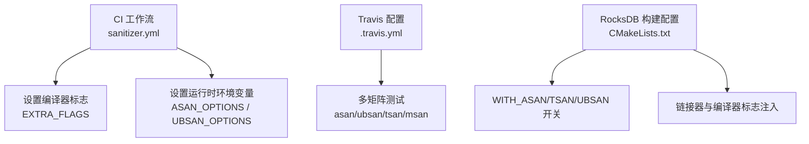
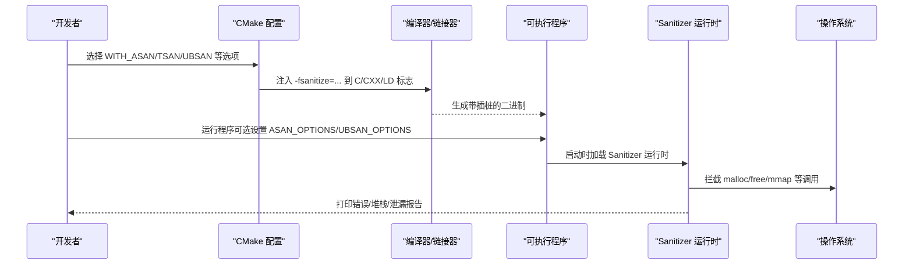
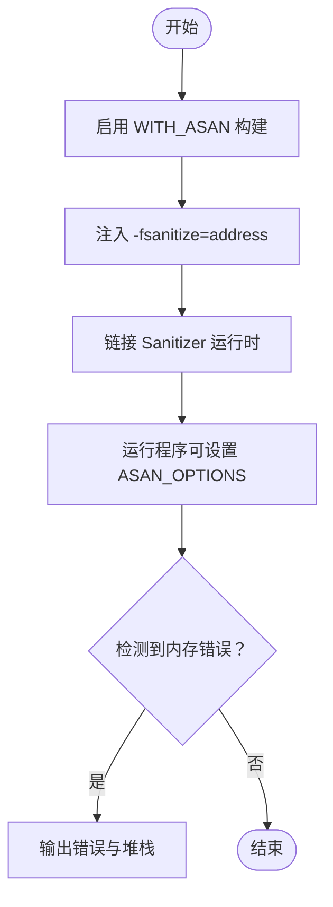
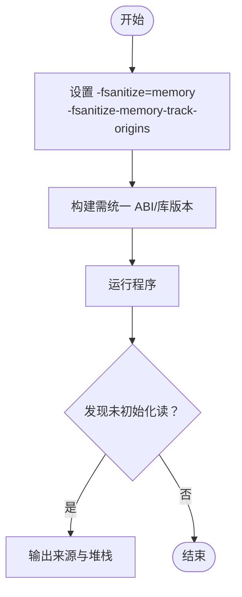
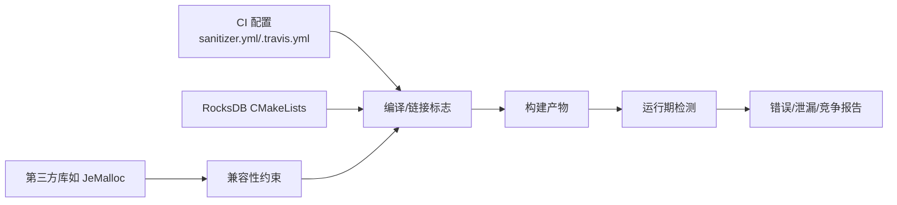

# 内存调试工具

<cite>
**本文引用的文件**   
- [sanitizer.yml](file://source/gParaKV-GC-master/third_party/benchmark/.github/workflows/sanitizer.yml)
- [.travis.yml](file://source/gParaKV-GC-master/third_party/benchmark/.travis.yml)
- [CMakeLists.txt](file://source/rocksdb/CMakeLists.txt)
</cite>

## 目录
1. [简介](#简介)
2. [项目结构](#项目结构)
3. [核心组件](#核心组件)
4. [架构总览](#架构总览)
5. [详细组件分析](#详细组件分析)
6. [依赖关系分析](#依赖关系分析)
7. [性能考量](#性能考量)
8. [故障排查指南](#故障排查指南)
9. [结论](#结论)
10. [附录](#附录)

## 简介
本指南面向需要在 C/C++ 项目中定位与修复内存问题的工程师，系统介绍以下工具的用法与最佳实践：
- AddressSanitizer（ASan）：检测越界访问、释放后使用、重复释放等内存错误。
- MemorySanitizer（MSan）：检测未初始化内存的读取。
- LeakSanitizer（LSan）：检测内存泄漏。
- Valgrind：memcheck、helgrind 等工具的使用场景与技巧。
- 自定义内存分配器的调试技巧。
- 内存使用模式分析与优化建议。
- 快速定位内存相关问题的方法。

本项目在构建与 CI 中已集成 ASan、UBSan、TSan 以及 MSan 的配置示例，并在 RocksDB 的 CMake 中提供了开关以启用 ASan/TSan/UBSan 构建。这些内容将作为本指南的实践基础。

## 项目结构
仓库包含多个子项目与脚本，其中与内存调试直接相关的配置主要位于：
- benchmark 的 CI 工作流与 Travis 配置：展示了如何为不同 Sanitizer 设置编译选项与环境变量。
- RocksDB 的 CMakeLists：提供 WITH_ASAN、WITH_TSAN、WITH_UBSAN 等构建选项，便于在本地或 CI 中开启相应检测。

**图表来源** 
- [sanitizer.yml:1-107](file://source/gParaKV-GC-master/third_party/benchmark/.github/workflows/sanitizer.yml#L1-L107)
- [.travis.yml:98-140](file://source/gParaKV-GC-master/third_party/benchmark/.travis.yml#L98-L140)
- [CMakeLists.txt:384-413](file://source/rocksdb/CMakeLists.txt#L384-L413)

**章节来源**
- [sanitizer.yml:1-107](file://source/gParaKV-GC-master/third_party/benchmark/.github/workflows/sanitizer.yml#L1-L107)
- [.travis.yml:98-140](file://source/gParaKV-GC-master/third_party/benchmark/.travis.yml#L98-L140)
- [CMakeLists.txt:384-413](file://source/rocksdb/CMakeLists.txt#L384-L413)

## 核心组件
- ASan：通过 -fsanitize=address 注入检查点，捕获堆栈越界、UAF、双重释放等。
- MSan：通过 -fsanitize=memory 与跟踪来源 -fsanitize-memory-track-origins 检测未初始化读。
- LSan：通常随 ASan 启用，用于报告进程退出时的泄漏。
- TSan：线程数据竞争检测（-fsanitize=thread）。
- UBSan：未定义行为检测（-fsanitize=undefined）。
- Valgrind：运行时动态分析工具，memcheck 用于内存错误与泄漏，helgrind 用于数据竞争。

上述能力在本仓库中的体现：
- sanitizer.yml 演示了如何在 GitHub Actions 中为 asan/ubsan/tsan/msan 分别设置 EXTRA_FLAGS 与 LIBCXX_SANITIZER，并针对 clang+asan 设置 ASAN_OPTIONS 忽略特定误报。
- .travis.yml 展示了多矩阵组合（编译器、构建类型、Sanitizer），包括 MSan 与 ThreadSanitizer 的完整流程。
- RocksDB CMakeLists 暴露了 WITH_ASAN、WITH_TSAN、WITH_UBSAN 选项，自动注入 -fsanitize=... 到 C/CXX 与链接器标志，并给出与 JeMalloc 的兼容性提示。

**章节来源**
- [sanitizer.yml:24-52](file://source/gParaKV-GC-master/third_party/benchmark/.github/workflows/sanitizer.yml#L24-L52)
- [.travis.yml:113-140](file://source/gParaKV-GC-master/third_party/benchmark/.travis.yml#L113-L140)
- [CMakeLists.txt:384-413](file://source/rocksdb/CMakeLists.txt#L384-L413)

## 架构总览
下图展示从“代码编译”到“运行期检测”的整体流程，以及各 Sanitizer 的作用域与交互。

**图表来源** 
- [CMakeLists.txt:384-413](file://source/rocksdb/CMakeLists.txt#L384-L413)
- [sanitizer.yml:36-52](file://source/gParaKV-GC-master/third_party/benchmark/.github/workflows/sanitizer.yml#L36-L52)

## 详细组件分析

### AddressSanitizer（ASan）
- 适用问题：堆/栈越界、释放后使用（UAF）、重复释放、缓冲区溢出等。
- 启用方式：
  - 在 RocksDB 构建中启用 WITH_ASAN，会自动注入 -fsanitize=address 到 C/CXX/链接器标志。
  - 在 CI 中通过 EXTRA_FLAGS 设置 -fsanitize=address，并配合 -fno-omit-frame-pointer 提升堆栈可读性。
- 运行时配置：
  - 可通过 ASAN_OPTIONS 控制行为，例如忽略某些不期望的错误（如 alloc_dealloc_mismatch）。
- 注意事项：
  - 与某些分配器（如 JeMalloc）存在兼容性问题，构建时会给出警告或失败提示。
  - 建议在 Debug 或 RelWithDebInfo 下运行以获得更清晰的堆栈信息。

**图表来源** 
- [CMakeLists.txt:384-392](file://source/rocksdb/CMakeLists.txt#L384-L392)
- [sanitizer.yml:36-52](file://source/gParaKV-GC-master/third_party/benchmark/.github/workflows/sanitizer.yml#L36-L52)

**章节来源**
- [CMakeLists.txt:384-392](file://source/rocksdb/CMakeLists.txt#L384-L392)
- [sanitizer.yml:36-52](file://source/gParaKV-GC-master/third_party/benchmark/.github/workflows/sanitizer.yml#L36-L52)

### MemorySanitizer（MSan）
- 适用问题：未初始化内存的读取。
- 启用方式：
  - 在 CI 中通过 EXTRA_FLAGS 设置 -fsanitize=memory 与 -fsanitize-memory-track-origins，并设置 LIBCXX_SANITIZER=MemoryWithOrigins。
- 特点与建议：
  - 需要完整的未初始化标记传播，对第三方库与标准库的构建要求较高。
  - 建议配合 libc++ 构建，确保符号与 ABI 一致。
  - 由于开销较大，适合在开发阶段的小规模用例上验证。

**图表来源** 
- [.travis.yml:113-126](file://source/gParaKV-GC-master/third_party/benchmark/.travis.yml#L113-L126)
- [sanitizer.yml:24-28](file://source/gParaKV-GC-master/third_party/benchmark/.github/workflows/sanitizer.yml#L24-L28)

**章节来源**
- [.travis.yml:113-126](file://source/gParaKV-GC-master/third_party/benchmark/.travis.yml#L113-L126)
- [sanitizer.yml:24-28](file://source/gParaKV-GC-master/third_party/benchmark/.github/workflows/sanitizer.yml#L24-L28)

### LeakSanitizer（LSan）
- 适用问题：进程退出时仍存在未释放的内存块。
- 启用方式：
  - 通常与 ASan 一起启用，无需额外开关；在 RocksDB 中启用 WITH_ASAN 即可同时获得 LSan。
- 使用建议：
  - 结合 ASAN_OPTIONS 过滤已知非问题路径（如框架内部分配）。
  - 在单元测试或最小复现用例上优先运行，减少噪声。

**章节来源**
- [CMakeLists.txt:384-392](file://source/rocksdb/CMakeLists.txt#L384-L392)

### ThreadSanitizer（TSan）
- 适用问题：多线程数据竞争、锁顺序不一致等。
- 启用方式：
  - 在 CI 中通过 EXTRA_FLAGS 设置 -fsanitize=thread，并设置 LIBCXX_SANITIZER=Thread。
  - 在 RocksDB 中启用 WITH_TSAN，自动注入 -fsanitize=thread 与 PIE 链接选项。
- 注意事项：
  - 与 JeMalloc 存在兼容性问题，构建时会提示失败。
  - 适用于并发模块的回归测试与持续集成。

**章节来源**
- [.travis.yml:127-140](file://source/gParaKV-GC-master/third_party/benchmark/.travis.yml#L127-L140)
- [CMakeLists.txt:394-402](file://source/rocksdb/CMakeLists.txt#L394-L402)

### UndefinedBehaviorSanitizer（UBSan）
- 适用问题：未定义行为（如整数溢出、空指针解引用、类型双关等）。
- 启用方式：
  - 在 CI 中通过 EXTRA_FLAGS 设置 -fsanitize=undefined，并设置 UBSAN_OPTIONS 打印堆栈。
  - 在 RocksDB 中启用 WITH_UBSAN，自动注入 -fsanitize=undefined。
- 使用建议：
  - 建议与 ASan 并行运行，覆盖更多边界条件。

**章节来源**
- [sanitizer.yml:30-34](file://source/gParaKV-GC-master/third_party/benchmark/.github/workflows/sanitizer.yml#L30-L34)
- [CMakeLists.txt:404-413](file://source/rocksdb/CMakeLists.txt#L404-L413)

### Valgrind
- memcheck：
  - 用途：检测内存错误（越界、UAF、重复释放）与泄漏。
  - 使用场景：在无法使用 Sanitizer 的环境（如某些生产镜像或受限平台）进行离线分析。
  - 建议：先跑最小复现用例，再逐步扩大范围；结合 --leak-check=full 与 --show-leak-kinds=all。
- helgrind：
  - 用途：检测数据竞争与锁使用问题。
  - 使用场景：并发模块的稳定性验证。
- 性能与精度：
  - 相比 Sanitizer，Valgrind 开销更大，但能提供更详细的运行时轨迹。

[本节为通用指导，不直接分析具体文件]

### 自定义内存分配器的调试技巧
- 常见问题：
  - 自定义分配器可能绕过标准分配接口，导致 Sanitizer 无法正确追踪。
  - 与 ASan/TSan 的内置检查存在冲突（如分配/释放不匹配）。
- 建议做法：
  - 在开发阶段暂时替换为标准分配器，确认问题是否由自定义分配器引入。
  - 若必须使用自定义分配器，确保其实现与 Sanitizer 的探测点兼容（如包装 malloc/free/realloc/calloc）。
  - 在 RocksDB 中，启用 WITH_ASAN/TSAN/UBSAN 时会提示与 JeMalloc 的兼容性问题，可作为参考。

**章节来源**
- [CMakeLists.txt:389-412](file://source/rocksdb/CMakeLists.txt#L389-L412)

### 内存使用模式分析与优化建议
- 常见模式：
  - 频繁小对象分配：考虑对象池或 Arena 分配器以减少碎片与系统调用。
  - 长生命周期大对象：注意释放时机，避免持有过久导致峰值内存升高。
  - 并发热点路径：关注锁粒度与缓存行对齐，降低竞争与伪共享。
- 分析方法：
  - 使用 ASan/LSan 定位错误与泄漏。
  - 使用 Valgrind memcheck/helgrind 做深度分析。
  - 结合性能计数器与火焰图定位热点分配路径。
- 优化方向：
  - 合并小分配、复用缓冲、延迟释放。
  - 调整阈值与批处理策略，减少分配频率。
  - 合理设置缓存大小与淘汰策略，避免抖动。

[本节为通用指导，不直接分析具体文件]

## 依赖关系分析
- 构建系统与 CI：
  - sanitizer.yml 与 .travis.yml 定义了不同 Sanitizer 的编译与运行环境。
  - RocksDB CMakeLists 提供统一的开关，简化本地与 CI 的构建差异。
- 外部依赖：
  - 部分 Sanitizer 与第三方库（如 JeMalloc）存在兼容限制，需在构建时显式处理。

**图表来源** 
- [sanitizer.yml:1-107](file://source/gParaKV-GC-master/third_party/benchmark/.github/workflows/sanitizer.yml#L1-L107)
- [.travis.yml:98-140](file://source/gParaKV-GC-master/third_party/benchmark/.travis.yml#L98-L140)
- [CMakeLists.txt:384-413](file://source/rocksdb/CMakeLists.txt#L384-L413)

**章节来源**
- [sanitizer.yml:1-107](file://source/gParaKV-GC-master/third_party/benchmark/.github/workflows/sanitizer.yml#L1-L107)
- [.travis.yml:98-140](file://source/gParaKV-GC-master/third_party/benchmark/.travis.yml#L98-L140)
- [CMakeLists.txt:384-413](file://source/rocksdb/CMakeLists.txt#L384-L413)

## 性能考量
- 启用 Sanitizer 会显著增加运行时开销（通常数倍至数十倍），建议仅在开发与测试阶段使用。
- 选择合适的优化级别与调试符号（-O2/-g -fno-omit-frame-pointer）有助于平衡性能与诊断质量。
- 对于大规模基准测试，建议先用无 Sanitizer 的版本定位热点，再用 Sanitizer 在小样本上验证问题。

[本节为通用指导，不直接分析具体文件]

## 故障排查指南
- 常见报错与处理：
  - ASan 报告 alloc_dealloc_mismatch：可在 clang+asan 环境下通过 ASAN_OPTIONS 忽略该误报（见 CI 配置）。
  - 与 JeMalloc 冲突：构建时禁用 JeMalloc 或切换到兼容分配器。
  - MSan 无法传播未初始化标记：确保所有依赖均以相同 Sanitizer 构建，并使用匹配的 libc++。
- 快速定位步骤：
  - 最小化复现：构造最小用例，关闭非必要功能。
  - 分层启用：先 ASan，再 UBSan/TSan，最后 MSan。
  - 日志增强：打开堆栈打印与详细选项（如 UBSAN_OPTIONS=print_stacktrace=1）。
  - 工具辅助：Valgrind memcheck/helgrind 作为补充手段。

**章节来源**
- [sanitizer.yml:48-52](file://source/gParaKV-GC-master/third_party/benchmark/.github/workflows/sanitizer.yml#L48-L52)
- [.travis.yml:98-140](file://source/gParaKV-GC-master/third_party/benchmark/.travis.yml#L98-L140)
- [CMakeLists.txt:389-412](file://source/rocksdb/CMakeLists.txt#L389-L412)

## 结论
本指南基于仓库中的 CI 与构建配置，总结了 ASan、MSan、LSan、TSan、UBSan 与 Valgrind 的使用方法与实践要点。通过合理的构建开关与环境变量配置，可以在开发与测试阶段高效定位内存错误、未初始化访问、数据竞争与泄漏问题。对于自定义分配器与复杂依赖，应特别注意兼容性与一致性。建议将 Sanitizer 纳入持续集成，形成稳定的质量门禁。

[本节为总结性内容，不直接分析具体文件]

## 附录
- 常用命令与环境变量（概念性说明）：
  - 编译标志：-fsanitize=address, -fsanitize=memory, -fsanitize=thread, -fsanitize=undefined
  - 运行时选项：ASAN_OPTIONS, UBSAN_OPTIONS
  - 构建开关：WITH_ASAN, WITH_TSAN, WITH_UBSAN
- 推荐工作流：
  - 开发阶段：启用 ASan + UBSan，快速定位问题。
  - 并发模块：启用 TSan，验证数据竞争。
  - 内存泄漏：启用 LSan（随 ASan），并结合 Valgrind memcheck。
  - 未初始化读：启用 MSan，确保依赖库一致构建。

[本节为通用指导，不直接分析具体文件]