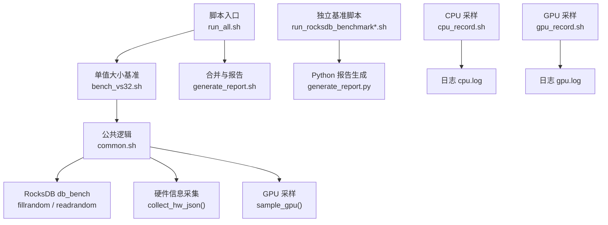
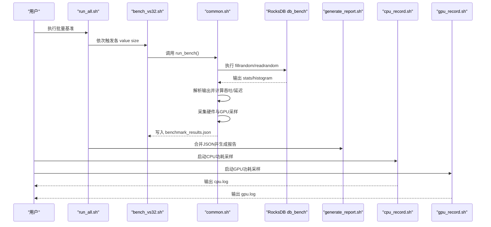
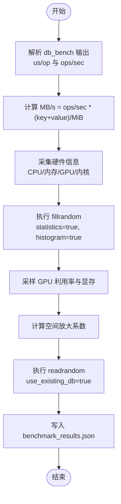
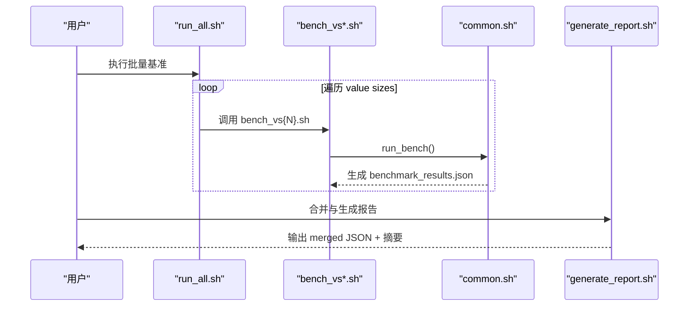
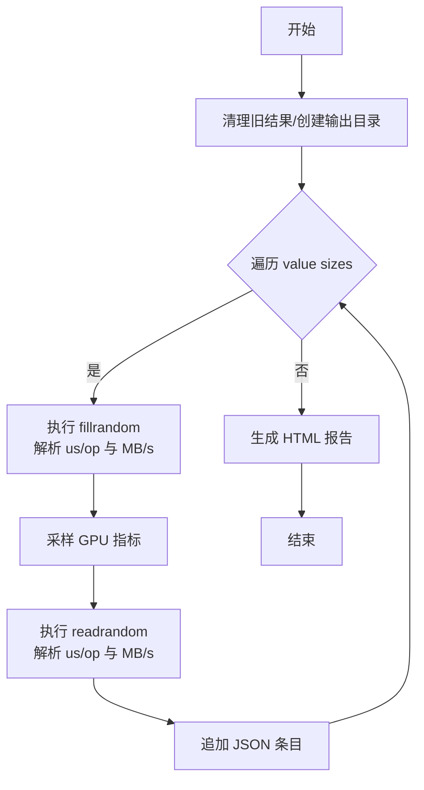
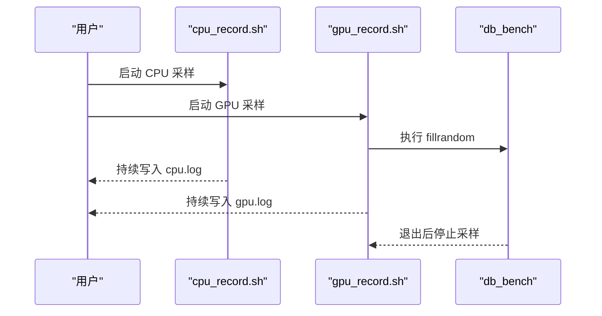
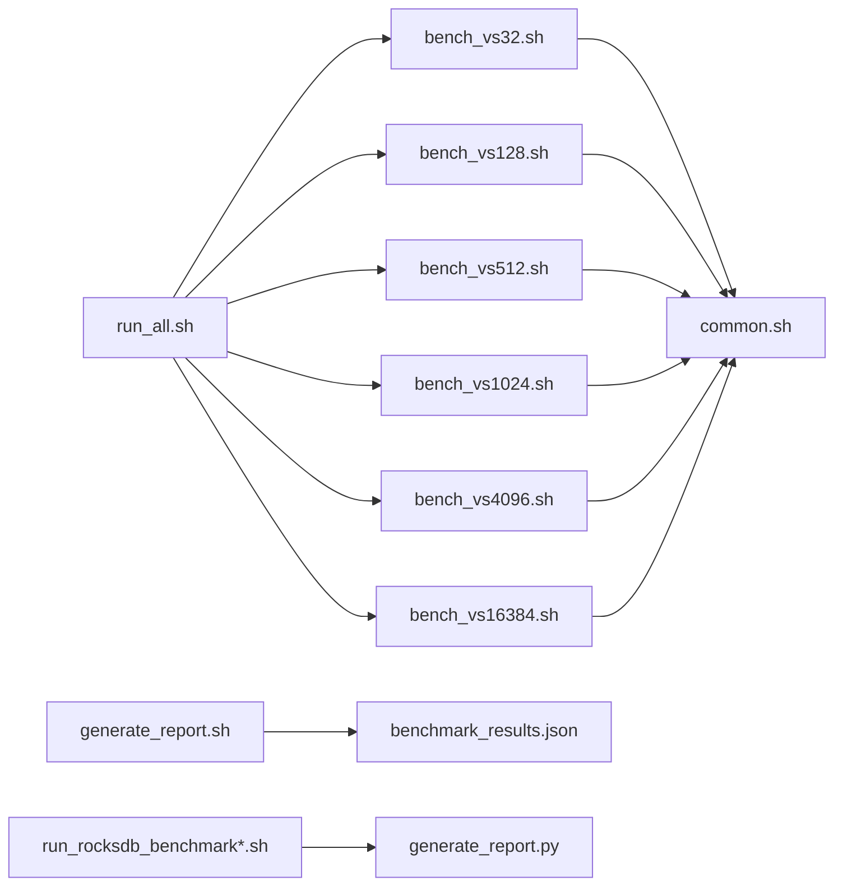

# 性能分析工具

<cite>
**本文引用的文件**   
- [common.sh](file://script/common.sh)
- [bench_vs32.sh](file://script/bench_vs32.sh)
- [run_all.sh](file://script/run_all.sh)
- [generate_report.sh](file://script/generate_report.sh)
- [run_rocksdb_benchmark.sh](file://script/run_rocksdb_benchmark.sh)
- [run_rocksdb_benchmark_v2.sh](file://script/run_rocksdb_benchmark_v2.sh)
- [cpu_record.sh](file://source/gParaKV-GC-master/scripts/Power Consumption and GPGPU Utilization/cpu_record.sh)
- [gpu_record.sh](file://source/gParaKV-GC-master/scripts/Power Consumption and GPGPU Utilization/gpu_record.sh)
</cite>

## 目录
1. [简介](#简介)
2. [项目结构](#项目结构)
3. [核心组件](#核心组件)
4. [架构总览](#架构总览)
5. [详细组件分析](#详细组件分析)
6. [依赖关系分析](#依赖关系分析)
7. [性能注意事项](#性能注意事项)
8. [故障排查指南](#故障排查指南)
9. [结论](#结论)
10. [附录](#附录)

## 简介
本指南面向使用 perf、valgrind、nsight 等工具进行系统级与 GPU 级性能分析的工程师，结合仓库中现有的 RocksDB 基准脚本与硬件采样脚本，提供从数据收集、分析到可视化的完整流程。内容涵盖：
- 使用 perf 识别 CPU 热点函数、I/O 性能分析与缓存命中率统计
- 使用 valgrind 进行内存泄漏检测与内存访问错误排查
- 使用 nsight 进行 CUDA 内核执行时间分析与内存带宽监控
- 基准测试脚本的使用与结果解读
- 性能回归的自动化检测方法

## 项目结构
本项目包含多套 RocksDB 基准脚本与硬件采样脚本，用于在不同 value size 下执行 fillrandom/readrandom 工作负载，并输出结构化 JSON 结果与汇总报告。关键路径如下：
- script: 基准与报告生成脚本
- source/gParaKV-GC-master/scripts/Power Consumption and GPGPU Utilization: CPU/GPU 功耗与利用率采样脚本

**图表来源** 
- [run_all.sh:1-19](file://script/run_all.sh#L1-L19)
- [bench_vs32.sh:1-10](file://script/bench_vs32.sh#L1-L10)
- [common.sh:1-196](file://script/common.sh#L1-L196)
- [generate_report.sh:1-59](file://script/generate_report.sh#L1-L59)
- [run_rocksdb_benchmark.sh:1-50](file://script/run_rocksdb_benchmark.sh#L1-L50)
- [run_rocksdb_benchmark_v2.sh:1-168](file://script/run_rocksdb_benchmark_v2.sh#L1-L168)
- [cpu_record.sh:1-25](file://source/gParaKV-GC-master/scripts/Power Consumption and GPGPU Utilization/cpu_record.sh#L1-L25)
- [gpu_record.sh:1-79](file://source/gParaKV-GC-master/scripts/Power Consumption and GPGPU Utilization/gpu_record.sh#L1-L79)

**章节来源**
- [run_all.sh:1-19](file://script/run_all.sh#L1-L19)
- [bench_vs32.sh:1-10](file://script/bench_vs32.sh#L1-L10)
- [common.sh:1-196](file://script/common.sh#L1-L196)
- [generate_report.sh:1-59](file://script/generate_report.sh#L1-L59)
- [run_rocksdb_benchmark.sh:1-50](file://script/run_rocksdb_benchmark.sh#L1-L50)
- [run_rocksdb_benchmark_v2.sh:1-168](file://script/run_rocksdb_benchmark_v2.sh#L1-L168)
- [cpu_record.sh:1-25](file://source/gParaKV-GC-master/scripts/Power Consumption and GPGPU Utilization/cpu_record.sh#L1-L25)
- [gpu_record.sh:1-79](file://source/gParaKV-GC-master/scripts/Power Consumption and GPGPU Utilization/gpu_record.sh#L1-L79)

## 核心组件
- 公共基准逻辑（common.sh）
  - 解析 db_bench 输出，提取 ops/sec、us/op 并计算 MB/s
  - 采集硬件信息（CPU、内存、GPU、内核版本）
  - 运行 fillrandom 与 readrandom，记录延迟尾部分位（us/op * 1.5）
  - 输出 benchmark_results.json，包含 runs 列表与 metadata/hardware
- 批量执行（run_all.sh）
  - 顺序执行不同 value size 的基准，统一产出 JSON 结果
- 报告合并（generate_report.sh）
  - 合并各 value size 的 JSON 为单一 benchmark_results.json
  - 打印摘要表格，便于快速对比
- 独立基准脚本（run_rocksdb_benchmark*.sh）
  - 直接调用 Python 脚本生成 HTML 报告
  - 或纯 Shell 实现，循环多个 value size，写入 JSON 并生成报告
- 硬件采样脚本（cpu_record.sh, gpu_record.sh）
  - 持续采集 CPU/RAPL 功耗、进程内存与 CPU 使用率
  - 通过 nvidia-smi 采样 GPU 功耗、利用率与显存占用

**章节来源**
- [common.sh:16-39](file://script/common.sh#L16-L39)
- [common.sh:41-66](file://script/common.sh#L41-L66)
- [common.sh:68-196](file://script/common.sh#L68-L196)
- [run_all.sh:1-19](file://script/run_all.sh#L1-L19)
- [generate_report.sh:1-59](file://script/generate_report.sh#L1-L59)
- [run_rocksdb_benchmark.sh:1-50](file://script/run_rocksdb_benchmark.sh#L1-L50)
- [run_rocksdb_benchmark_v2.sh:1-168](file://script/run_rocksdb_benchmark_v2.sh#L1-L168)
- [cpu_record.sh:1-25](file://source/gParaKV-GC-master/scripts/Power Consumption and GPGPU Utilization/cpu_record.sh#L1-L25)
- [gpu_record.sh:1-79](file://source/gParaKV-GC-master/scripts/Power Consumption and GPGPU Utilization/gpu_record.sh#L1-L79)

## 架构总览
下图展示了基准执行与数据采集的整体流程，包括 db_bench 执行、JSON 结果生成、HTML 报告生成以及硬件采样。

**图表来源** 
- [run_all.sh:1-19](file://script/run_all.sh#L1-L19)
- [bench_vs32.sh:1-10](file://script/bench_vs32.sh#L1-L10)
- [common.sh:68-196](file://script/common.sh#L68-L196)
- [generate_report.sh:1-59](file://script/generate_report.sh#L1-L59)
- [cpu_record.sh:1-25](file://source/gParaKV-GC-master/scripts/Power Consumption and GPGPU Utilization/cpu_record.sh#L1-L25)
- [gpu_record.sh:1-79](file://source/gParaKV-GC-master/scripts/Power Consumption and GPGPU Utilization/gpu_record.sh#L1-L79)

## 详细组件分析

### 组件A：公共基准逻辑（common.sh）
- 功能要点
  - 解析 db_bench 输出行，提取 us/op 与 ops/sec
  - 根据 key_size 与 value_size 计算 MB/s
  - 采集硬件信息（CPU型号/核数、内存、GPU型号、内核与OS）
  - 运行 fillrandom/readrandom，启用 statistics 与 histogram
  - 计算空间放大系数（磁盘大小/逻辑字节）
  - 输出 JSON 结果，包含 runs 数组与 metadata/hardware
- 复杂度与性能
  - 解析与计算均为 O(1) 操作；IO 主要受限于磁盘与 RocksDB 内部压缩/缓存
  - 尾延迟估算采用 us/op * 1.5，便于快速比较
- 错误处理
  - 若未找到 nvidia-smi，GPU 字段默认 0
  - 若解析失败，字段回退为 0.0，避免中断

**图表来源** 
- [common.sh:16-39](file://script/common.sh#L16-L39)
- [common.sh:41-66](file://script/common.sh#L41-L66)
- [common.sh:68-196](file://script/common.sh#L68-L196)

**章节来源**
- [common.sh:16-39](file://script/common.sh#L16-L39)
- [common.sh:41-66](file://script/common.sh#L41-L66)
- [common.sh:68-196](file://script/common.sh#L68-L196)

### 组件B：批量执行与报告（run_all.sh, generate_report.sh）
- run_all.sh
  - 顺序执行 bench_vs{32,128,512,1024,4096,16384}.sh
  - 统一输出至 output/vs*/benchmark_results.json
- generate_report.sh
  - 合并各 value size 的 JSON 为单一 benchmark_results.json
  - 打印摘要表，便于横向对比

**图表来源** 
- [run_all.sh:1-19](file://script/run_all.sh#L1-L19)
- [bench_vs32.sh:1-10](file://script/bench_vs32.sh#L1-L10)
- [common.sh:68-196](file://script/common.sh#L68-L196)
- [generate_report.sh:1-59](file://script/generate_report.sh#L1-L59)

**章节来源**
- [run_all.sh:1-19](file://script/run_all.sh#L1-L19)
- [generate_report.sh:1-59](file://script/generate_report.sh#L1-L59)

### 组件C：独立基准脚本（run_rocksdb_benchmark*.sh）
- run_rocksdb_benchmark.sh
  - 调用 Python 脚本 run_db_bench_benchmark.py 与 generate_report.py
  - 输出 JSON 与 HTML 报告
- run_rocksdb_benchmark_v2.sh
  - 纯 Shell 实现，循环多个 value size
  - 直接解析 db_bench 输出，写入 JSON，并调用 Python 生成 HTML

**图表来源** 
- [run_rocksdb_benchmark.sh:1-50](file://script/run_rocksdb_benchmark.sh#L1-L50)
- [run_rocksdb_benchmark_v2.sh:1-168](file://script/run_rocksdb_benchmark_v2.sh#L1-L168)

**章节来源**
- [run_rocksdb_benchmark.sh:1-50](file://script/run_rocksdb_benchmark.sh#L1-L50)
- [run_rocksdb_benchmark_v2.sh:1-168](file://script/run_rocksdb_benchmark_v2.sh#L1-L168)

### 组件D：硬件采样（cpu_record.sh, gpu_record.sh）
- cpu_record.sh
  - 每秒采集进程 RSS、CPU 使用率与 RAPL 功耗，输出到 cpu.log
- gpu_record.sh
  - 启动 db_bench 并后台 watch nvidia-smi，输出 gpu.log
  - 支持切换 GC 开关以对比不同实现

**图表来源** 
- [cpu_record.sh:1-25](file://source/gParaKV-GC-master/scripts/Power Consumption and GPGPU Utilization/cpu_record.sh#L1-L25)
- [gpu_record.sh:1-79](file://source/gParaKV-GC-master/scripts/Power Consumption and GPGPU Utilization/gpu_record.sh#L1-L79)

**章节来源**
- [cpu_record.sh:1-25](file://source/gParaKV-GC-master/scripts/Power Consumption and GPGPU Utilization/cpu_record.sh#L1-L25)
- [gpu_record.sh:1-79](file://source/gParaKV-GC-master/scripts/Power Consumption and GPGPU Utilization/gpu_record.sh#L1-L79)

## 依赖关系分析
- 脚本间依赖
  - bench_vs*.sh 依赖 common.sh 提供的 run_bench() 与解析函数
  - run_all.sh 依赖所有 bench_vs*.sh 脚本
  - generate_report.sh 依赖各 value size 的 JSON 产物
  - run_rocksdb_benchmark*.sh 依赖 Python 脚本（generate_report.py）或直接 Shell 实现
- 外部依赖
  - RocksDB db_bench（需提前构建）
  - nvidia-smi（可选，用于 GPU 采样）
  - bc、awk、sed（文本处理）
  - Python3（报告生成）

**图表来源** 
- [run_all.sh:1-19](file://script/run_all.sh#L1-L19)
- [bench_vs32.sh:1-10](file://script/bench_vs32.sh#L1-L10)
- [common.sh:1-196](file://script/common.sh#L1-L196)
- [generate_report.sh:1-59](file://script/generate_report.sh#L1-L59)
- [run_rocksdb_benchmark.sh:1-50](file://script/run_rocksdb_benchmark.sh#L1-L50)
- [run_rocksdb_benchmark_v2.sh:1-168](file://script/run_rocksdb_benchmark_v2.sh#L1-L168)

**章节来源**
- [run_all.sh:1-19](file://script/run_all.sh#L1-L19)
- [common.sh:1-196](file://script/common.sh#L1-L196)
- [generate_report.sh:1-59](file://script/generate_report.sh#L1-L59)
- [run_rocksdb_benchmark.sh:1-50](file://script/run_rocksdb_benchmark.sh#L1-L50)
- [run_rocksdb_benchmark_v2.sh:1-168](file://script/run_rocksdb_benchmark_v2.sh#L1-L168)

## 性能注意事项
- 使用 perf 进行系统级分析
  - CPU 热点函数识别：perf record -g -- ./db_bench ... 后 perf report，关注 top 函数与火焰图
  - I/O 性能分析：perf stat -e block:block_rq_issue,block:block_rq_complete,syscalls:sys_enter_* 观察块设备与系统调用
  - 缓存命中率统计：perf stat -e cache-misses,cache-references,LLC-load-misses,LLC-load-references 评估 L1/L2/L3 命中情况
- 使用 valgrind 进行内存分析
  - 内存泄漏检测：valgrind --leak-check=full --show-leak-kinds=all ./db_bench ...
  - 内存访问错误排查：valgrind --tool=memcheck ./db_bench ... 定位越界与未初始化读取
- 使用 nsight 进行 GPU 分析
  - CUDA 内核执行时间：nsys profile --trace=cuda,nvtx ./db_bench ... 查看内核耗时与调用序列
  - 内存带宽监控：nsys 导出 CSV 后分析 memory bandwidth 与 kernel occupancy
- 基准参数建议
  - 固定 threads=1 以便隔离单核热点；增大 write_buffer_size 减少落盘频率
  - 开启 statistics=true 与 histogram=true 获取更丰富的统计
- 结果解读
  - MB/s = ops/sec * (key_size + value_size) / (1024*1024)
  - 尾延迟估算 us/op * 1.5 作为近似 P95/P99 参考
  - 空间放大系数 = 磁盘大小 / 逻辑字节数，反映压缩与元数据开销

[本节为通用指导，不直接分析具体文件]

## 故障排查指南
- 常见问题
  - 未安装 nvidia-smi：GPU 字段默认为 0，不影响基准执行
  - db_bench 路径错误：确保 LD_LIBRARY_PATH 指向 rocksdb/build
  - 权限不足：对 /tmp 目录有写权限，避免“too many open files”
- 诊断步骤
  - 检查脚本输出中的解析行是否成功（grep 对应 benchmark 名称）
  - 查看 benchmark_results.json 是否存在且字段非空
  - 使用 valgrind 捕获内存问题，使用 perf 定位热点
  - 使用 nvidia-smi 确认 GPU 状态与驱动正常

**章节来源**
- [common.sh:41-66](file://script/common.sh#L41-L66)
- [run_rocksdb_benchmark_v2.sh:22-24](file://script/run_rocksdb_benchmark_v2.sh#L22-L24)
- [gpu_record.sh:50-52](file://source/gParaKV-GC-master/scripts/Power Consumption and GPGPU Utilization/gpu_record.sh#L50-L52)

## 结论
本仓库提供了完整的 RocksDB 基准与硬件采样能力，配合 perf、valgrind、nsight 可形成从 CPU、内存到 GPU 的全栈性能分析闭环。通过统一的 JSON 输出与 HTML 报告，便于横向对比与回归检测。建议在 CI 中集成脚本与阈值判定，实现自动化性能回归告警。

[本节为总结性内容，不直接分析具体文件]

## 附录
- 常用命令示例
  - 执行批量基准：bash script/run_all.sh
  - 生成合并报告：bash script/generate_report.sh
  - 独立基准与报告：bash script/run_rocksdb_benchmark.sh
  - CPU 采样：bash source/gParaKV-GC-master/scripts/Power\ Consumption\ and\ GPGPU\ Utilization/cpu_record.sh
  - GPU 采样：ENABLE_GC=1 bash source/gParaKV-GC-master/scripts/Power\ Consumption\ and\ GPGPU\ Utilization/gpu_record.sh
- 结果文件位置
  - 各 value size 的 JSON：output/vs*/benchmark_results.json
  - 合并 JSON：output/benchmark_results.json
  - HTML 报告：由 Python 脚本生成在指定输出目录

[本节为补充说明，不直接分析具体文件]