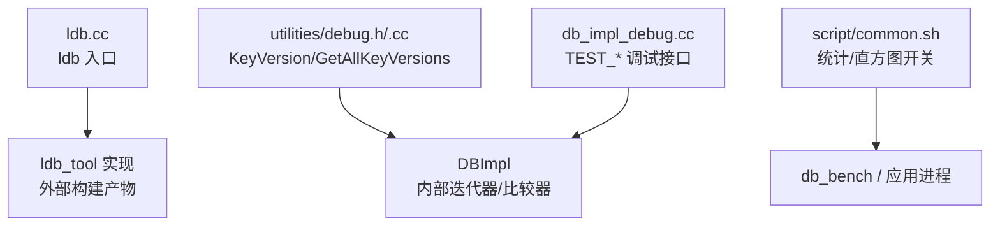
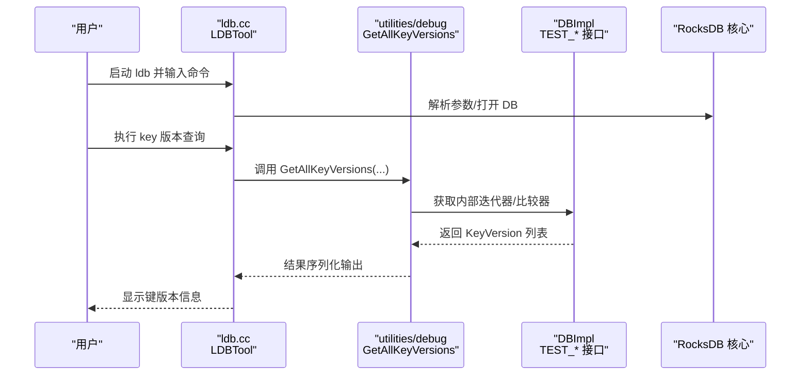
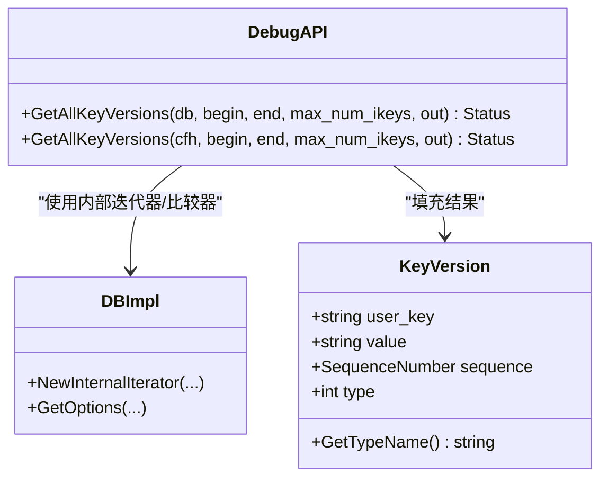
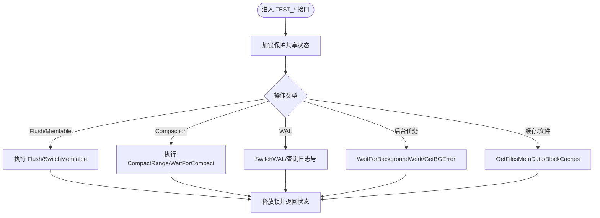
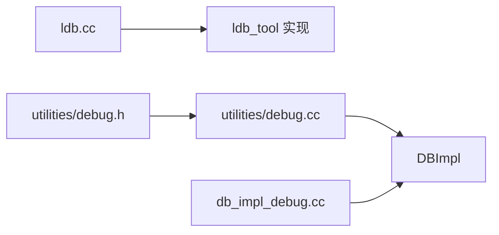

# 调试工具使用

<cite>
**本文引用的文件**
- [ldb.cc](file://source/rocksdb/tools/ldb.cc)
- [debug.h](file://source/rocksdb/include/rocksdb/utilities/debug.h)
- [debug.cc](file://source/rocksdb/utilities/debug.cc)
- [db_impl_debug.cc](file://source/rocksdb/db/db_impl/db_impl_debug.cc)
- [common.sh](file://script/common.sh)
</cite>

## 目录
1. [简介](#简介)
2. [项目结构](#项目结构)
3. [核心组件](#核心组件)
4. [架构总览](#架构总览)
5. [详细组件分析](#详细组件分析)
6. [依赖关系分析](#依赖关系分析)
7. [性能与内存分析指南](#性能与内存分析指南)
8. [GPU 调试指南](#gpu-调试指南)
9. [日志级别配置与动态调整](#日志级别配置与动态调整)
10. [故障排查指南](#故障排查指南)
11. [结论](#结论)

## 简介
本技术文档面向 RocksDB 及其周边工具的调试与诊断，覆盖以下主题：
- gdb 调试器配置与使用（断点、变量查看、堆栈跟踪）
- RocksDB 内置调试工具（ldb 命令行、状态查询接口）
- 性能分析工具（perf、valgrind、nsight）
- GPU 调试工具（cuda-gdb、nvprof/nvtx）
- 日志级别配置与动态调整
- 内存检测工具（AddressSanitizer、MemorySanitizer）
- 调试环境搭建与配置步骤

本仓库包含 RocksDB 源码及脚本，其中 ldb 入口、调试接口与测试辅助函数为调试工作提供了直接支撑。

## 项目结构
与本主题相关的代码主要位于 RocksDB 子模块与脚本目录：
- tools/ldb.cc：ldb 命令行工具入口
- utilities/debug.{h,cc}：键版本遍历等调试能力
- db/db_impl/db_impl_debug.cc：大量 TEST_* 调试与诊断方法
- script/common.sh：基准与运行脚本，展示如何启用统计与直方图输出

图表来源
- [ldb.cc:1-13](file://source/rocksdb/tools/ldb.cc#L1-L13)
- [debug.h:1-45](file://source/rocksdb/include/rocksdb/utilities/debug.h#L1-L45)
- [debug.cc:1-129](file://source/rocksdb/utilities/debug.cc#L1-L129)
- [db_impl_debug.cc:1-408](file://source/rocksdb/db/db_impl/db_impl_debug.cc#L1-L408)
- [common.sh:1-196](file://script/common.sh#L1-L196)

章节来源
- [ldb.cc:1-13](file://source/rocksdb/tools/ldb.cc#L1-L13)
- [debug.h:1-45](file://source/rocksdb/include/rocksdb/utilities/debug.h#L1-L45)
- [debug.cc:1-129](file://source/rocksdb/utilities/debug.cc#L1-L129)
- [db_impl_debug.cc:1-408](file://source/rocksdb/db/db_impl/db_impl_debug.cc#L1-L408)
- [common.sh:1-196](file://script/common.sh#L1-L196)

## 核心组件
- ldb 命令行工具：通过入口程序启动 LDBTool，提供交互式或批处理命令用于检查数据库状态、读取/写入数据、执行 compaction 等。
- 调试接口 utilities/debug：提供 KeyVersion 结构与 GetAllKeyVersions API，支持按用户键范围枚举所有版本，便于定位数据一致性与版本问题。
- DBImpl 调试接口：大量 TEST_* 方法暴露内部状态与操作（如 Flush/Memtable Switch/Compact/WAL 切换、后台任务等待、缓存信息收集等），适合在单元测试与集成测试中验证行为。
- 脚本 common.sh：演示如何开启 --statistics 与 --histogram 等关键观测开关，便于后续 perf/valgrind 等工具配合分析。

章节来源
- [ldb.cc:1-13](file://source/rocksdb/tools/ldb.cc#L1-L13)
- [debug.h:1-45](file://source/rocksdb/include/rocksdb/utilities/debug.h#L1-L45)
- [debug.cc:1-129](file://source/rocksdb/utilities/debug.cc#L1-L129)
- [db_impl_debug.cc:1-408](file://source/rocksdb/db/db_impl/db_impl_debug.cc#L1-L408)
- [common.sh:1-196](file://script/common.sh#L1-L196)

## 架构总览
下图展示了 ldb 工具与 RocksDB 内部调试接口的交互关系，以及调试接口对 DBImpl 的调用路径。

图表来源
- [ldb.cc:1-13](file://source/rocksdb/tools/ldb.cc#L1-L13)
- [debug.cc:1-129](file://source/rocksdb/utilities/debug.cc#L1-L129)
- [db_impl_debug.cc:1-408](file://source/rocksdb/db/db_impl/db_impl_debug.cc#L1-L408)

## 详细组件分析

### ldb 命令行工具
- 入口程序 main 创建 LDBTool 实例并调用 RunAndReturn，完成参数解析与命令分发。
- 典型用途：
  - 查看 SST/Manifest/Compaction 状态
  - 扫描键空间、打印值与元数据
  - 触发 Compaction/Flush 等操作进行验证

章节来源
- [ldb.cc:1-13](file://source/rocksdb/tools/ldb.cc#L1-L13)

### 键版本枚举与类型映射
- KeyVersion 结构体保存 user_key、value、sequence、type 等信息，并提供 GetTypeName 将内部类型码转为可读字符串。
- GetAllKeyVersions 基于内部迭代器与 InternalKeyComparator，支持按用户键范围枚举所有版本，限制最大条目数避免内存膨胀。

图表来源
- [debug.h:1-45](file://source/rocksdb/include/rocksdb/utilities/debug.h#L1-L45)
- [debug.cc:1-129](file://source/rocksdb/utilities/debug.cc#L1-L129)

章节来源
- [debug.h:1-45](file://source/rocksdb/include/rocksdb/utilities/debug.h#L1-L45)
- [debug.cc:1-129](file://source/rocksdb/utilities/debug.cc#L1-L129)

### DBImpl 调试接口（TEST_*）
- 提供大量以 TEST_ 开头的接口，用于：
  - 强制 Flush/Memtable 切换/Compaction
  - WAL 切换与日志号查询
  - 后台任务等待与错误获取
  - 缓存/文件元数据收集
  - 周期任务调度器访问
- 这些接口主要用于测试与调试，帮助复现与定位问题。

图表来源
- [db_impl_debug.cc:1-408](file://source/rocksdb/db/db_impl/db_impl_debug.cc#L1-L408)

章节来源
- [db_impl_debug.cc:1-408](file://source/rocksdb/db/db_impl/db_impl_debug.cc#L1-L408)

### 脚本与观测开关
- common.sh 演示了如何通过 --statistics=true 与 --histogram=true 开启统计与延迟分布，便于后续结合 perf/valgrind 进行分析。
- 脚本还采集硬件信息与 GPU 指标，有助于关联性能瓶颈。

章节来源
- [common.sh:1-196](file://script/common.sh#L1-L196)

## 依赖关系分析
- ldb.cc 依赖 ldb_tool 实现（由构建系统生成），并通过 RocksDB 命名空间调用。
- utilities/debug 依赖 DBImpl 的内部迭代器与比较器，属于“调试视图”层，不改变核心逻辑。
- db_impl_debug.cc 中的 TEST_* 方法直接访问 DBImpl 内部状态，需确保线程安全与锁持有。

图表来源
- [ldb.cc:1-13](file://source/rocksdb/tools/ldb.cc#L1-L13)
- [debug.h:1-45](file://source/rocksdb/include/rocksdb/utilities/debug.h#L1-L45)
- [debug.cc:1-129](file://source/rocksdb/utilities/debug.cc#L1-L129)
- [db_impl_debug.cc:1-408](file://source/rocksdb/db/db_impl/db_impl_debug.cc#L1-L408)

章节来源
- [ldb.cc:1-13](file://source/rocksdb/tools/ldb.cc#L1-L13)
- [debug.h:1-45](file://source/rocksdb/include/rocksdb/utilities/debug.h#L1-L45)
- [debug.cc:1-129](file://source/rocksdb/utilities/debug.cc#L1-L129)
- [db_impl_debug.cc:1-408](file://source/rocksdb/db/db_impl/db_impl_debug.cc#L1-L408)

## 性能与内存分析指南

### 使用 gdb 调试 RocksDB
- 编译要求：确保二进制包含调试符号（-g 或 CMake 的 Debug 配置）。
- 常用流程：
  - 附加到运行进程：gdb -p <pid>
  - 设置断点：break DBImpl::TEST_FlushMemTable（示例）
  - 查看变量：print var_name
  - 查看堆栈：bt / bt full
  - 条件断点：break func if cond
- 多线程：info threads、thread apply all bt
- 性能热点：结合 perf top 与 gdb 打断点定位热点路径

### 使用 perf 性能分析
- 采集 CPU 火焰图：perf record -g -F 99 -- ./your_rocksdb_app
- 生成报告：perf report / perf script
- 与 RocksDB 统计：开启 --statistics=true 与 --histogram=true，对比内核态/用户态热点与 RocksDB 内部指标

### 使用 valgrind 内存检测
- 内存泄漏检测：valgrind --leak-check=full ./your_rocksdb_app
- 未初始化读检测：valgrind --tool=memcheck ./your_rocksdb_app
- 注意：valgrind 会显著降低性能，建议仅在开发环境使用

### 使用 nsight 与 NVTX（可选）
- 针对 CUDA/GPU 路径，可使用 nsight systems/compute 采集 GPU/CPU 时间线
- 在应用中使用 nvtx 标记关键区域，便于与 RocksDB 事件对齐

章节来源
- [common.sh:1-196](file://script/common.sh#L1-L196)

## GPU 调试指南
- cuda-gdb：调试 CUDA 内核与主机端代码，设置断点于 .cu 文件，查看设备变量与寄存器
- nvprof/nvtx：采集 GPU 利用率、内存带宽、核函数耗时；在 RocksDB 的 GPU 相关路径插入 nvtx 标记，便于与 CPU 侧 RocksDB 事件对齐
- 常见问题：
  - 设备内存不足：监控 nvidia-smi 与 cuda-memcheck
  - 同步开销：关注 cudaMemcpy 与 kernel launch 的时间线

[本节为通用指导，不直接分析具体文件]

## 日志级别配置与动态调整
- RocksDB 日志：可通过 logging 子系统控制输出级别与目标（控制台/文件），常见方式包括环境变量与运行时选项
- 动态调整：部分版本支持通过监控/管理接口调整日志级别，便于在线诊断
- 实践建议：
  - 生产环境保持较低日志级别，仅在问题复现场景临时提升
  - 结合 RocksDB 统计与直方图，定位慢路径与异常

[本节为通用指导，不直接分析具体文件]

## 故障排查指南
- 使用 ldb 检查数据一致性：
  - 列出键版本：通过 GetAllKeyVersions 或 ldb 命令扫描指定范围
  - 检查 SST/Manifest：确认文件存在性与版本号
- 使用 DBImpl TEST_* 接口：
  - 强制 Flush/Compact 后观察状态变化
  - 等待后台任务完成并检查错误
- 结合 perf/valgrind/gdb：
  - 用 perf 定位热点函数
  - 用 valgrind 捕获内存错误
  - 用 gdb 打断点并查看局部变量与堆栈

章节来源
- [debug.cc:1-129](file://source/rocksdb/utilities/debug.cc#L1-L129)
- [db_impl_debug.cc:1-408](file://source/rocksdb/db/db_impl/db_impl_debug.cc#L1-L408)

## 结论
本仓库为 RocksDB 调试提供了丰富的入口与接口：ldb 命令行、utilities/debug 的键版本枚举、DBImpl 的 TEST_* 调试方法，以及脚本中对统计与直方图的启用。结合 gdb、perf、valgrind、nsight 与 GPU 工具，可形成从 CPU/GPU、内存/性能到数据一致性的完整诊断闭环。建议在开发与测试阶段建立标准化的调试流程与脚本，提高问题定位效率。