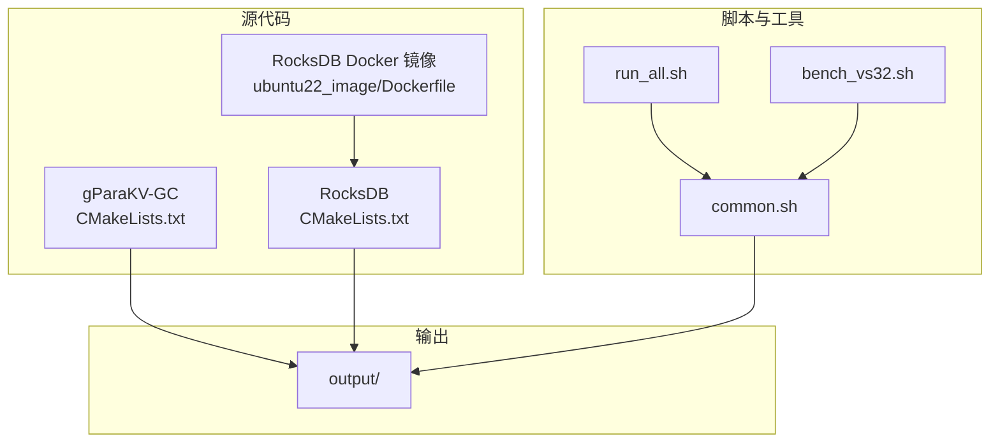
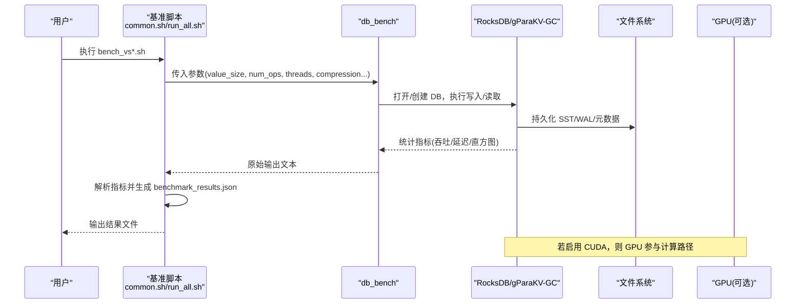
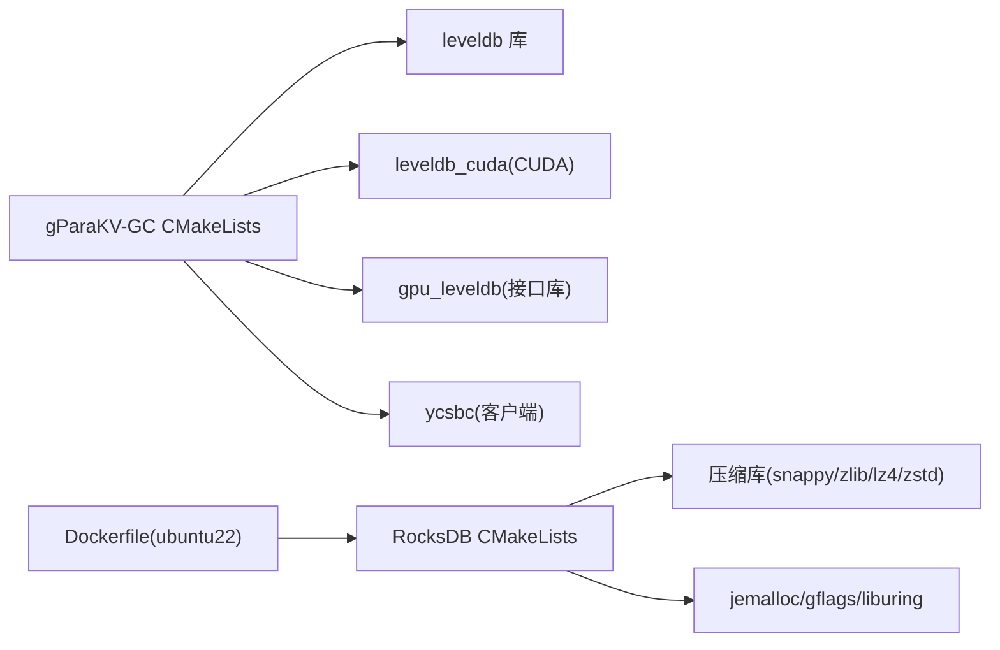

# 生产环境部署

<cite>
**本文引用的文件**   
- [source/gParaKV-GC-master/README.md](file://source/gParaKV-GC-master/README.md)
- [source/gParaKV-GC-master/CMakeLists.txt](file://source/gParaKV-GC-master/CMakeLists.txt)
- [source/rocksdb/README.md](file://source/rocksdb/README.md)
- [source/rocksdb/CMakeLists.txt](file://source/rocksdb/CMakeLists.txt)
- [source/rocksdb/build_tools/ubuntu22_image/Dockerfile](file://source/rocksdb/build_tools/ubuntu22_image/Dockerfile)
- [script/common.sh](file://script/common.sh)
- [script/run_all.sh](file://script/run_all.sh)
- [script/bench_vs32.sh](file://script/bench_vs32.sh)
</cite>

## 目录
1. [简介](#简介)
2. [项目结构](#项目结构)
3. [核心组件](#核心组件)
4. [架构总览](#架构总览)
5. [详细组件分析](#详细组件分析)
6. [依赖关系分析](#依赖关系分析)
7. [性能考虑](#性能考虑)
8. [故障排查指南](#故障排查指南)
9. [结论](#结论)
10. [附录](#附录)

## 简介
本操作指南面向生产环境部署，覆盖硬件与系统要求、依赖安装、构建配置、环境变量与配置管理、容器化（Docker/Kubernetes）、多节点集群部署、安全与网络访问控制、部署验证与健康检查等。仓库包含基于 LevelDB 的 gParaKV-GC 实现（含 CUDA 加速）以及 RocksDB 及其 Docker 构建镜像脚本，配套基准测试脚本用于性能验证与产出结构化结果。

## 项目结构
- source/gParaKV-GC-master：gParaKV-GC（LevelDB 修改版 + CUDA 内核），提供 CMake 构建与 YCSB-C 客户端
- source/rocksdb：RocksDB 源码及 CMake 构建选项，包含 Ubuntu 22 构建镜像 Dockerfile
- script：基准测试脚本集合，统一输出 JSON 结果并采集硬件信息
- output：基准测试结果输出目录
- doc/exp_design/pre_experiment：实验设计与报告（非部署相关）

**图表来源** 
- [source/gParaKV-GC-master/CMakeLists.txt](file://source/gParaKV-GC-master/CMakeLists.txt)
- [source/rocksdb/CMakeLists.txt](file://source/rocksdb/CMakeLists.txt)
- [source/rocksdb/build_tools/ubuntu22_image/Dockerfile](file://source/rocksdb/build_tools/ubuntu22_image/Dockerfile)
- [script/common.sh](file://script/common.sh)
- [script/run_all.sh](file://script/run_all.sh)
- [script/bench_vs32.sh](file://script/bench_vs32.sh)

**章节来源**
- [source/gParaKV-GC-master/README.md:1-117](file://source/gParaKV-GC-master/README.md#L1-L117)
- [source/rocksdb/README.md:1-30](file://source/rocksdb/README.md#L1-L30)

## 核心组件
- gParaKV-GC（LevelDB 变体）：支持 CUDA 加速的垃圾回收策略，提供 db_bench 与 ycsbc 目标
- RocksDB：高性能 LSM 键值存储库，支持多种压缩后端与异步 I/O
- 基准脚本：统一参数化执行 fillrandom/readrandom，解析吞吐/延迟并生成 JSON 结果

关键要点
- gParaKV-GC 使用 CMake 构建，启用 CUDA 编译与链接；默认 Release 优化
- RocksDB 通过 CMake 选项启用/禁用压缩库（snappy、zlib、lz4、zstd）、jemalloc、gflags、liburing 等
- 脚本通过 LD_LIBRARY_PATH 指向 rocksdb 构建产物目录，确保运行时动态库加载正确

**章节来源**
- [source/gParaKV-GC-master/CMakeLists.txt:1-557](file://source/gParaKV-GC-master/CMakeLists.txt#L1-L557)
- [source/rocksdb/CMakeLists.txt:1-200](file://source/rocksdb/CMakeLists.txt#L1-L200)
- [script/common.sh:1-196](file://script/common.sh#L1-L196)

## 架构总览
下图展示从基准脚本到数据库引擎的数据流与组件交互。

**图表来源** 
- [script/common.sh:68-196](file://script/common.sh#L68-L196)
- [source/gParaKV-GC-master/CMakeLists.txt:512-556](file://source/gParaKV-GC-master/CMakeLists.txt#L512-L556)
- [source/rocksdb/CMakeLists.txt:96-200](file://source/rocksdb/CMakeLists.txt#L96-L200)

## 详细组件分析

### 硬件与系统要求
- 操作系统：Ubuntu 22.04 LTS（推荐）
- 内核：6.8.0-52-generic（已验证）
- GPU 驱动：≥ 550.xx，SM 6.0（Pascal）或更新
- CUDA Toolkit：12.3（需要 nvcc）
- 编译器：gcc/g++ ≥ 11（C++17）
- CMake：≥ 3.26
- 压缩库：libsnappy-dev（可选但推荐）

说明
- 上述要求来自 gParaKV-GC 的 README 中的“System Requirements”表格与安装命令
- 对于 RocksDB 构建镜像，基础镜像为 ubuntu:22.04，预装常用编译与压缩库

**章节来源**
- [source/gParaKV-GC-master/README.md:25-46](file://source/gParaKV-GC-master/README.md#L25-L46)
- [source/rocksdb/build_tools/ubuntu22_image/Dockerfile:27-46](file://source/rocksdb/build_tools/ubuntu22_image/Dockerfile#L27-L46)

### 依赖库安装与配置
- 基础工具链：build-essential、cmake、git
- 压缩库：libsnappy-dev、zlib1g-dev、libbz2-dev、liblz4-dev、libzstd-dev（根据需求启用）
- 其他：libgflags-dev、libtbb-dev、libssl-dev、openjdk-8-jdk（YCSB Java 组件）
- GPU：nvidia-driver-550、nvidia-cuda-toolkit（CUDA 12.3）

说明
- 安装命令参考 gParaKV-GC README 中的 apt 安装步骤
- RocksDB Dockerfile 展示了完整依赖清单与版本选择

**章节来源**
- [source/gParaKV-GC-master/README.md:37-45](file://source/gParaKV-GC-master/README.md#L37-L45)
- [source/rocksdb/build_tools/ubuntu22_image/Dockerfile:39-74](file://source/rocksdb/build_tools/ubuntu22_image/Dockerfile#L39-L74)

### 构建系统与编译参数
- gParaKV-GC（LevelDB 变体）
  - CMake 最低版本：3.9
  - 语言标准：C++17，CUDA 开启
  - 构建类型：Release（默认）
  - 目标：db_bench、ycsbc、leveldb_cuda、gpu_leveldb（接口库）
  - CUDA 架构：60（Pascal）
  - 链接库：gmock、gtest、benchmark、Threads、可选 snappy/tcmalloc/crc32c

- RocksDB
  - CMake 最低版本：3.12
  - 语言标准：C++20（默认）
  - 选项：WITH_SNAPPY、WITH_ZLIB、WITH_LZ4、WITH_ZSTD、WITH_JEMALLOC、WITH_LIBURING、WITH_GFLAGS 等
  - 构建类型：Debug/RelWithDebInfo/Release（未指定时按 .git 存在与否选择）

说明
- gParaKV-GC 的 CMakeLists 明确设置 CUDA 标志、目标与链接关系
- RocksDB 的 CMakeLists 提供丰富的第三方库开关与平台适配逻辑

**章节来源**
- [source/gParaKV-GC-master/CMakeLists.txt:1-120](file://source/gParaKV-GC-master/CMakeLists.txt#L1-L120)
- [source/gParaKV-GC-master/CMakeLists.txt:512-556](file://source/gParaKV-GC-master/CMakeLists.txt#L512-L556)
- [source/rocksdb/CMakeLists.txt:35-110](file://source/rocksdb/CMakeLists.txt#L35-L110)
- [source/rocksdb/CMakeLists.txt:96-200](file://source/rocksdb/CMakeLists.txt#L96-L200)

### 环境变量与配置文件管理
- 运行期库路径：LD_LIBRARY_PATH 需包含 rocksdb 构建产物目录（脚本中显式设置）
- 基准脚本参数：value_size、num_ops、key_size、threads、write_buffer_size、compression_type、seed、cache_size、statistics、histogram、disable_wal、use_existing_db 等
- 输出格式：每个 value_size 对应一个目录 output/vs<NN>/benchmark_results.json，包含 metadata、hardware、runs 字段

说明
- common.sh 中定义了 PROJECT_DIR、OUTPUT_BASE、KEY_SIZE、NUM_OPS、COMPRESSION、THREADS、WRITE_BUFFER_SIZE、SEED 等常量，并在运行前导出 LD_LIBRARY_PATH
- run_all.sh 顺序执行多个 value_size 的基准脚本，统一输出到 output 目录

**章节来源**
- [script/common.sh:5-14](file://script/common.sh#L5-L14)
- [script/common.sh:14-14](file://script/common.sh#L14-L14)
- [script/common.sh:157-189](file://script/common.sh#L157-L189)
- [script/run_all.sh:1-19](file://script/run_all.sh#L1-L19)

### 容器化部署方案（Docker/Kubernetes）
- 构建镜像：使用 RocksDB 提供的 ubuntu22_image/Dockerfile，预装编译工具链、压缩库、clang/gcc、benchmark、glog、OpenJDK 8 等
- 镜像构建与推送：遵循 Dockerfile 注释中的 ghcr.io 登录与构建命令
- Kubernetes 部署建议：
  - 将 RocksDB/gParaKV-GC 二进制以 ConfigMap/Secret 注入或通过 initContainer 拉取
  - 使用 PersistentVolume 挂载数据目录（如 /data/rocksdb）
  - 通过资源限制 requests/limits 控制 CPU/Memory/GPU 配额
  - 健康检查：对 db_bench 或自定义 HTTP 探针返回状态码判断服务可用性

说明
- Dockerfile 展示了完整的依赖安装流程与环境变量设置（JAVA_HOME、PKG_CONFIG_PATH、PROTOC_BIN）
- 生产环境建议将构建与运行分离，镜像仅包含运行所需依赖

**章节来源**
- [source/rocksdb/build_tools/ubuntu22_image/Dockerfile:1-91](file://source/rocksdb/build_tools/ubuntu22_image/Dockerfile#L1-L91)

### 多节点集群部署指导
- 角色划分：
  - 写入节点：高写吞吐，启用 WAL 与合适的 write_buffer_size
  - 读节点：缓存命中优化，调整 cache_size 与多线程并行度
  - 监控节点：收集指标（CPU/GPU/内存/磁盘 IO）
- 数据一致性：LSM 引擎天然支持快照与并发读写，跨节点复制需结合上层协调器（如 Raft/ZK）
- 网络与存储：
  - 低延迟网络（InfiniBand/RoCE）提升跨节点同步效率
  - 独立 NVMe 分区存放 WAL/SST，避免竞争
- 扩缩容：水平扩展读节点，垂直扩容写节点（更多 CPU/内存/GPU）

说明
- 本节为通用实践建议，不直接映射具体代码文件

### 安全配置与网络访问控制
- 最小权限原则：运行账户仅拥有必要目录读写权限
- 防火墙规则：仅开放必要的端口（如监控/管理接口）
- 密钥管理：敏感配置（如认证令牌）通过 Secret 管理
- 审计日志：启用系统级审计与应用程序日志轮转

说明
- 本节为通用安全建议，不直接映射具体代码文件

### 部署验证与健康检查
- 快速验证：
  - 执行 bench_vs32.sh，确认 output/vs32/benchmark_results.json 生成且包含有效指标
  - 检查 LD_LIBRARY_PATH 是否正确指向 rocksdb 构建目录
- 健康检查：
  - 周期性运行轻量级 readrandom 测试，评估延迟与吞吐是否稳定
  - 监控 GPU 利用率与显存占用（nvidia-smi）
  - 监控磁盘空间与 IO 延迟（iostat/dstat）

**章节来源**
- [script/bench_vs32.sh:1-10](file://script/bench_vs32.sh#L1-L10)
- [script/common.sh:41-53](file://script/common.sh#L41-L53)
- [script/common.sh:55-66](file://script/common.sh#L55-L66)

## 依赖关系分析
下图展示 gParaKV-GC 与 RocksDB 的构建依赖与链接关系。

**图表来源** 
- [source/gParaKV-GC-master/CMakeLists.txt:512-556](file://source/gParaKV-GC-master/CMakeLists.txt#L512-L556)
- [source/rocksdb/CMakeLists.txt:96-200](file://source/rocksdb/CMakeLists.txt#L96-L200)
- [source/rocksdb/build_tools/ubuntu22_image/Dockerfile:39-74](file://source/rocksdb/build_tools/ubuntu22_image/Dockerfile#L39-L74)

**章节来源**
- [source/gParaKV-GC-master/CMakeLists.txt:1-120](file://source/gParaKV-GC-master/CMakeLists.txt#L1-L120)
- [source/rocksdb/CMakeLists.txt:96-200](file://source/rocksdb/CMakeLists.txt#L96-L200)

## 性能考虑
- 压缩策略：根据吞吐/空间权衡选择 snappy/zstd/lz4；生产环境建议 zstd（平衡压缩比与速度）
- 线程与缓冲：合理设置 threads、write_buffer_size、cache_size，避免过度争用
- I/O 调度：启用 liburing（若内核支持）以降低系统调用开销
- GPU 加速：在 gParaKV-GC 中启用 CUDA 路径，注意 SM 架构匹配与显存容量规划
- 监控与调优：持续采集吞吐/延迟/直方图，定位瓶颈（CPU/GPU/IO/锁竞争）

说明
- 本节为通用性能建议，不直接映射具体代码文件

## 故障排查指南
- 动态库加载失败：检查 LD_LIBRARY_PATH 是否包含 rocksdb 构建目录
- CUDA 编译错误：确认 CUDA 版本与 nvcc 可用，检查 CUDA_ARCHITECTURES 设置
- 压缩库缺失：根据 CMake 选项启用相应库（WITH_SNAPPY/WITH_ZLIB/WITH_LZ4/WITH_ZSTD）
- 基准输出为空：确认 db_bench 可执行文件路径正确，参数无误，输出目录有写权限
- GPU 指标不可用：确认 nvidia-smi 可用且驱动正常

**章节来源**
- [script/common.sh:14-14](file://script/common.sh#L14-L14)
- [source/gParaKV-GC-master/CMakeLists.txt:547-556](file://source/gParaKV-GC-master/CMakeLists.txt#L547-L556)
- [source/rocksdb/CMakeLists.txt:96-200](file://source/rocksdb/CMakeLists.txt#L96-L200)

## 结论
本指南提供了从硬件准备、依赖安装、构建配置到容器化与多节点部署的完整路径。通过标准化的基准脚本与结构化输出，便于在生产环境中进行性能基线建立与健康检查。建议在上线前完成全量价值大小的基准测试，并结合监控体系持续优化。

## 附录
- 快速启动命令示例（参考各 README 与脚本）
- 常见 CMake 选项与含义（见 RocksDB CMakeLists）
- Docker 镜像构建与推送步骤（见 ubuntu22_image/Dockerfile 注释）