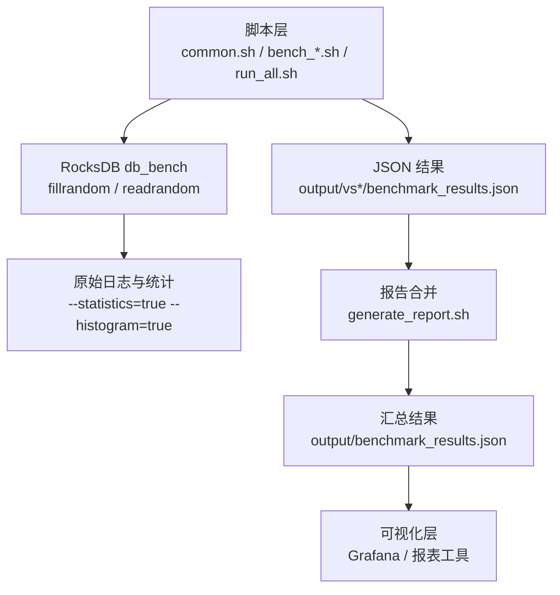
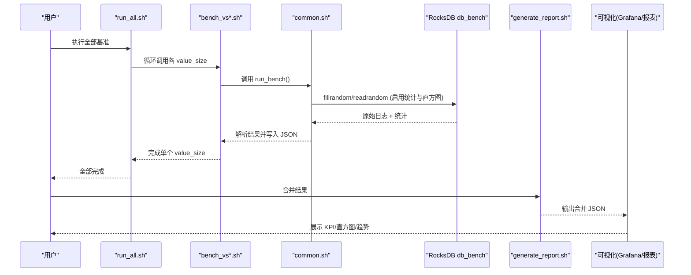
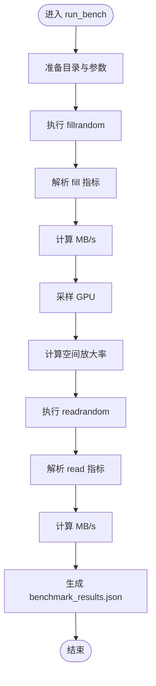
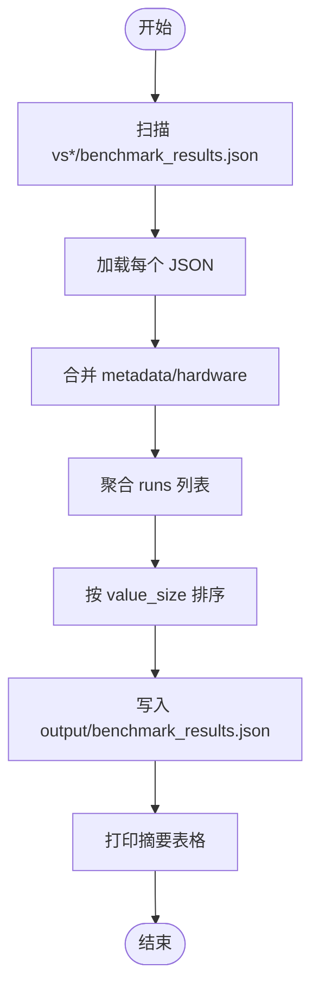
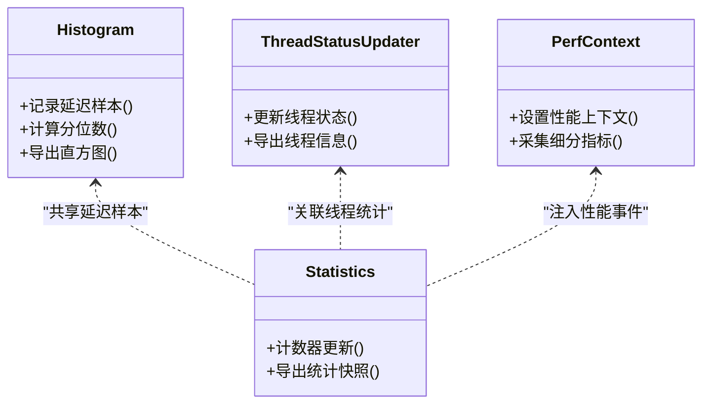
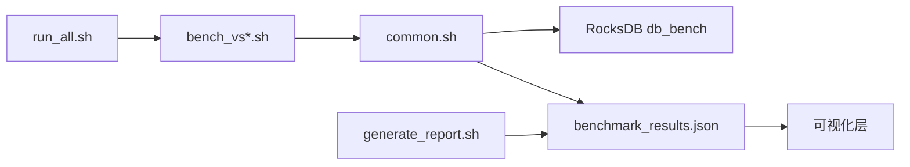

# 可视化仪表板

<cite>
**本文引用的文件**
- [script/common.sh](file://script/common.sh)
- [script/bench_vs128.sh](file://script/bench_vs128.sh)
- [script/run_all.sh](file://script/run_all.sh)
- [script/generate_report.sh](file://script/generate_report.sh)
- [source/rocksdb/monitoring/histogram.h](file://source/rocksdb/monitoring/histogram.h)
- [source/rocksdb/monitoring/histogram.cc](file://source/rocksdb/monitoring/histogram.cc)
- [source/rocksdb/monitoring/statistics.cc](file://source/rocksdb/monitoring/statistics.cc)
- [source/rocksdb/monitoring/thread_status_updater.h](file://source/rocksdb/monitoring/thread_status_updater.h)
- [source/rocksdb/monitoring/perf_context_imp.h](file://source/rocksdb/monitoring/perf_context_imp.h)
</cite>

## 目录
1. [简介](#简介)
2. [项目结构](#项目结构)
3. [核心组件](#核心组件)
4. [架构总览](#架构总览)
5. [详细组件分析](#详细组件分析)
6. [依赖关系分析](#依赖关系分析)
7. [性能考虑](#性能考虑)
8. [故障排查指南](#故障排查指南)
9. [结论](#结论)
10. [附录](#附录)

## 简介
本指南面向运维与研发人员，提供基于 RocksDB 基准测试的监控可视化仪表板的搭建与使用方案。内容涵盖：
- Grafana 仪表板模板配置与自定义图表开发
- 关键性能指标（KPI）的可视化展示方法
- 直方图数据的可视化与分析
- 实时监控大屏搭建方案
- 报告生成工具的自动化配置
- 仪表板权限管理与分享
- 常用查询语句与图表模板

本仓库通过脚本驱动 RocksDB db_bench 执行不同 value_size 的填充与随机读，输出结构化 JSON 结果，并支持合并汇总与文本摘要，便于接入 Prometheus/Grafana 或离线报表系统。

## 项目结构
- script 目录包含基准测试编排、参数解析、结果收集与报告生成的 Shell 脚本
- source/rocksdb/monitoring 提供 RocksDB 内部统计、直方图、线程状态等监控能力
- output 目录用于存放各 value_size 的 benchmark_results.json 及合并后的汇总结果

**图示来源**
- [script/common.sh:68-196](file://script/common.sh#L68-L196)
- [script/run_all.sh:1-19](file://script/run_all.sh#L1-L19)
- [script/generate_report.sh:1-59](file://script/generate_report.sh#L1-L59)

**章节来源**
- [script/common.sh:1-196](file://script/common.sh#L1-L196)
- [script/bench_vs128.sh:1-10](file://script/bench_vs128.sh#L1-L10)
- [script/run_all.sh:1-19](file://script/run_all.sh#L1-L19)
- [script/generate_report.sh:1-59](file://script/generate_report.sh#L1-L59)

## 核心组件
- 基准测试编排器：common.sh 定义统一参数、解析输出、计算吞吐与放大率、采集硬件信息、生成 JSON
- 值大小用例脚本：bench_vs*.sh 针对特定 value_size 调用 run_bench
- 批量运行器：run_all.sh 顺序执行所有 value_size 用例
- 报告合并器：generate_report.sh 合并多 runs 为单一 JSON，并打印摘要
- RocksDB 监控子系统：histogram、statistics、thread_status_updater、perf_context 等提供底层指标

**章节来源**
- [script/common.sh:16-53](file://script/common.sh#L16-L53)
- [script/common.sh:68-196](file://script/common.sh#L68-L196)
- [script/bench_vs128.sh:1-10](file://script/bench_vs128.sh#L1-L10)
- [script/run_all.sh:1-19](file://script/run_all.sh#L1-L19)
- [script/generate_report.sh:1-59](file://script/generate_report.sh#L1-L59)
- [source/rocksdb/monitoring/histogram.h](file://source/rocksdb/monitoring/histogram.h)
- [source/rocksdb/monitoring/histogram.cc](file://source/rocksdb/monitoring/histogram.cc)
- [source/rocksdb/monitoring/statistics.cc](file://source/rocksdb/monitoring/statistics.cc)
- [source/rocksdb/monitoring/thread_status_updater.h](file://source/rocksdb/monitoring/thread_status_updater.h)
- [source/rocksdb/monitoring/perf_context_imp.h](file://source/rocksdb/monitoring/perf_context_imp.h)

## 架构总览
整体数据流从脚本触发 RocksDB 基准测试开始，经过日志解析与 JSON 序列化，最终汇聚到统一的汇总 JSON，供可视化层消费。

**图示来源**
- [script/run_all.sh:1-19](file://script/run_all.sh#L1-L19)
- [script/bench_vs128.sh:1-10](file://script/bench_vs128.sh#L1-L10)
- [script/common.sh:68-196](file://script/common.sh#L68-L196)
- [script/generate_report.sh:1-59](file://script/generate_report.sh#L1-L59)

## 详细组件分析

### 基准测试编排器 common.sh
- 功能要点
  - 统一参数：KEY_SIZE、NUM_OPS、COMPRESSION、THREADS、WRITE_BUFFER_SIZE、SEED
  - 解析 db_bench 输出：parse_ops_per_sec、parse_us_per_op
  - 吞吐换算：calc_mbps = ops/sec * (key_size + value_size) / (1024*1024)
  - 硬件信息采集：CPU、内存、GPU、内核、OS
  - GPU 采样：nvidia-smi 获取利用率与显存占用
  - 空间放大率：db_size / logical_bytes
  - JSON 输出：metadata、hardware、runs（含 fill/read 吞吐、延迟、尾延迟、放大率、GPU 指标）
- 复杂度与性能
  - 解析采用 grep/sed/awk，时间复杂度 O(n) 行扫描；适合单次基准输出规模
  - bc 计算尾延迟与放大率，开销低
- 错误处理
  - 缺失字段时赋默认值（如 fill_us=0.0），避免中断
  - nvidia-smi 不可用时回退为空值

**图示来源**
- [script/common.sh:68-196](file://script/common.sh#L68-L196)

**章节来源**
- [script/common.sh:16-53](file://script/common.sh#L16-L53)
- [script/common.sh:68-196](file://script/common.sh#L68-L196)

### 值大小用例脚本 bench_vs128.sh
- 作用：以 value_size=128 为例，设置 DB_BENCH 路径并调用 run_bench
- 扩展方式：复制该脚本修改 value_size 即可快速新增用例

**章节来源**
- [script/bench_vs128.sh:1-10](file://script/bench_vs128.sh#L1-L10)

### 批量运行器 run_all.sh
- 作用：顺序执行 32/128/512/1024/4096/16384 六种 value_size 用例
- 输出位置：output/vs*/benchmark_results.json

**章节来源**
- [script/run_all.sh:1-19](file://script/run_all.sh#L1-L19)

### 报告合并器 generate_report.sh
- 作用：遍历 vs{32,128,512,1024,4096,16384} 下的 benchmark_results.json，合并 metadata/hardware/runs
- 输出：output/benchmark_results.json（按 value_size 排序）
- 摘要：打印 Value Size、Fill/Read 吞吐与延迟对比表

**图示来源**
- [script/generate_report.sh:1-59](file://script/generate_report.sh#L1-L59)

**章节来源**
- [script/generate_report.sh:1-59](file://script/generate_report.sh#L1-L59)

### RocksDB 监控子系统（直方图与统计）
- histogram：记录延迟分布，支持窗口化与持久化历史
- statistics：暴露 RocksDB 内部计数器（如缓存命中、压缩比、WAL/SSD I/O）
- thread_status_updater：线程状态更新与导出
- perf_context：性能上下文，用于细粒度性能剖析

**图示来源**
- [source/rocksdb/monitoring/histogram.h](file://source/rocksdb/monitoring/histogram.h)
- [source/rocksdb/monitoring/histogram.cc](file://source/rocksdb/monitoring/histogram.cc)
- [source/rocksdb/monitoring/statistics.cc](file://source/rocksdb/monitoring/statistics.cc)
- [source/rocksdb/monitoring/thread_status_updater.h](file://source/rocksdb/monitoring/thread_status_updater.h)
- [source/rocksdb/monitoring/perf_context_imp.h](file://source/rocksdb/monitoring/perf_context_imp.h)

**章节来源**
- [source/rocksdb/monitoring/histogram.h](file://source/rocksdb/monitoring/histogram.h)
- [source/rocksdb/monitoring/histogram.cc](file://source/rocksdb/monitoring/histogram.cc)
- [source/rocksdb/monitoring/statistics.cc](file://source/rocksdb/monitoring/statistics.cc)
- [source/rocksdb/monitoring/thread_status_updater.h](file://source/rocksdb/monitoring/thread_status_updater.h)
- [source/rocksdb/monitoring/perf_context_imp.h](file://source/rocksdb/monitoring/perf_context_imp.h)

## 依赖关系分析
- 脚本依赖 RocksDB 构建产物 db_bench，需确保 LD_LIBRARY_PATH 指向 build 目录
- 解析逻辑依赖 db_bench 输出格式（bench_name 行包含 micros/op 与 ops/sec）
- 报告合并依赖 output/vs*/benchmark_results.json 存在且结构一致

**图示来源**
- [script/run_all.sh:1-19](file://script/run_all.sh#L1-L19)
- [script/common.sh:14-14](file://script/common.sh#L14-L14)
- [script/generate_report.sh:1-59](file://script/generate_report.sh#L1-L59)

**章节来源**
- [script/common.sh:14-14](file://script/common.sh#L14-L14)
- [script/run_all.sh:1-19](file://script/run_all.sh#L1-L19)
- [script/generate_report.sh:1-59](file://script/generate_report.sh#L1-L59)

## 性能考虑
- 指标选择
  - 吞吐：ops/sec、MB/s（由脚本自动换算）
  - 延迟：us/op、尾延迟（us/op × 系数）
  - 放大率：write_amplification、space_amplification
  - GPU：利用率与显存占用（可选）
- 采样与精度
  - 直方图建议开启 --histogram=true，结合 RocksDB histogram 模块进行分位分析
  - 统计开关 --statistics=true 可导出更多内部计数器
- 资源与环境
  - 合理设置 write_buffer_size、cache_size、threads 以匹配硬件
  - 关闭压缩（none）以获得更高吞吐基线
- 可扩展性
  - 新增 value_size 只需复制 bench_vs*.sh 并调整参数
  - 合并脚本支持任意数量 runs，便于横向对比

[本节为通用指导，不直接分析具体文件]

## 故障排查指南
- 常见问题
  - db_bench 路径错误或库未加载：检查 LD_LIBRARY_PATH 与构建产物
  - 解析失败：确认 db_bench 输出包含期望的 bench_name 行
  - GPU 指标缺失：nvidia-smi 不可用或未安装驱动
  - JSON 合并失败：检查 output/vs*/benchmark_results.json 是否存在且结构正确
- 定位步骤
  - 查看对应 vs*/benchmark_results.json 的 runs 字段是否完整
  - 检查脚本输出的中间日志 tmp_fill/tmp_read 是否有异常
  - 在 generate_report.sh 中增加调试输出，确认合并流程

**章节来源**
- [script/common.sh:16-53](file://script/common.sh#L16-L53)
- [script/common.sh:68-196](file://script/common.sh#L68-L196)
- [script/generate_report.sh:1-59](file://script/generate_report.sh#L1-L59)

## 结论
通过脚本化的 RocksDB 基准测试与结构化 JSON 输出，配合 RocksDB 监控子系统，可以高效搭建可视化仪表板与报告系统。运维团队可据此快速掌握系统运行状态、识别瓶颈并进行容量规划。建议在持续集成中自动化执行基准与报告生成，形成稳定的性能基线与回归检测。

[本节为总结性内容，不直接分析具体文件]

## 附录

### Grafana 仪表板模板与自定义图表开发
- 数据源
  - 离线模式：将 output/benchmark_results.json 导入为 CSV/JSON 数据源或使用插件（如 JSON API）
  - 在线模式：通过 Exporter/Pushgateway 将指标推送到 Prometheus，再在 Grafana 中查询
- 模板变量
  - value_size、engine、compression_type、timestamp
- 推荐面板
  - KPI 卡片：ops/sec、MB/s、us/op、尾延迟、放大率
  - 折线图：吞吐与延迟随 time/value_size 变化
  - 柱状图：不同 value_size 的吞吐对比
  - 热力图：延迟分布（直方图）
- 自定义图表
  - 使用 Panel JSON 模板，绑定变量与查询
  - 对直方图数据，使用分位函数（如 quantile_over_time）或直方图面板

[本节为概念性说明，不直接分析具体文件]

### 关键性能指标（KPI）可视化展示方法
- 吞吐类：ops/sec、MB/s（脚本已换算）
- 延迟类：us/op、尾延迟（us/op × 系数）
- 放大率：write_amplification、space_amplification
- 资源类：GPU 利用率、显存占用（可选）
- 展示建议
  - 使用仪表盘顶部 KPI 卡片突出核心指标
  - 使用分组面板按 value_size 或时间维度组织
  - 添加阈值告警（如延迟超过阈值）

[本节为概念性说明，不直接分析具体文件]

### 直方图数据的可视化与分析
- 数据来源
  - RocksDB histogram 模块记录延迟样本
  - db_bench 输出中的延迟分布（若启用）
- 分析方法
  - 分位点：P50、P95、P99、P99.9
  - 分布形态：长尾、双峰、尖峰
  - 对比：不同 value_size、压缩策略、线程数
- 可视化
  - 直方图面板：横轴延迟区间，纵轴计数
  - 累积分布曲线：观察尾部延迟
  - 热力图：时间×延迟区间的密度

[本节为概念性说明，不直接分析具体文件]

### 实时监控大屏搭建方案
- 数据采集
  - RocksDB 指标：通过 stats/history 导出为 JSON/CSV
  - 系统指标：CPU、内存、磁盘 I/O、GPU（nvidia-smi）
- 存储与查询
  - Prometheus + Thanos/VictoriaMetrics 做时序存储
  - Loki 收集日志，辅助定位问题
- 展示
  - Grafana 大屏：固定布局、自动刷新、告警联动
  - 移动端适配：简化面板，聚焦核心 KPI

[本节为概念性说明，不直接分析具体文件]

### 报告生成工具的自动化配置
- 定时任务
  - cron 每日/每周执行 run_all.sh 与 generate_report.sh
- 流水线集成
  - CI/CD 中触发基准测试，上传结果至对象存储
  - 自动生成 HTML/Markdown 报告并归档
- 版本管理
  - 每次运行附带 metadata（时间、环境、参数）
  - 结果按日期与配置命名，便于回溯

**章节来源**
- [script/run_all.sh:1-19](file://script/run_all.sh#L1-L19)
- [script/generate_report.sh:1-59](file://script/generate_report.sh#L1-L59)

### 仪表板权限管理与分享
- 权限模型
  - 角色：管理员、编辑者、观察者
  - 资源：Dashboard、Folder、Data Source
- 分享机制
  - 公开链接（只读）、嵌入 iframe、导出 PNG/PDF
- 最佳实践
  - 敏感指标限制访问
  - 使用 Folder 隔离不同环境（dev/staging/prod）
  - 审计日志追踪变更

[本节为概念性说明，不直接分析具体文件]

### 常用查询语句与图表模板
- 查询示例（PromQL）
  - 吞吐：sum(rate(rocksdb_write_ops_total[5m])) by (engine,value_size)
  - 延迟：histogram_quantile(0.99, sum(rate(rocksdb_latency_bucket[5m])) by (le,engine))
  - 放大率：rocksdb_space_amplification_ratio
- 模板变量
  - $value_size、$engine、$time_range
- 面板模板
  - KPI 卡片：当前值、同比/环比
  - 折线图：趋势与异常点标注
  - 直方图：分位与分布形态

[本节为概念性说明，不直接分析具体文件]