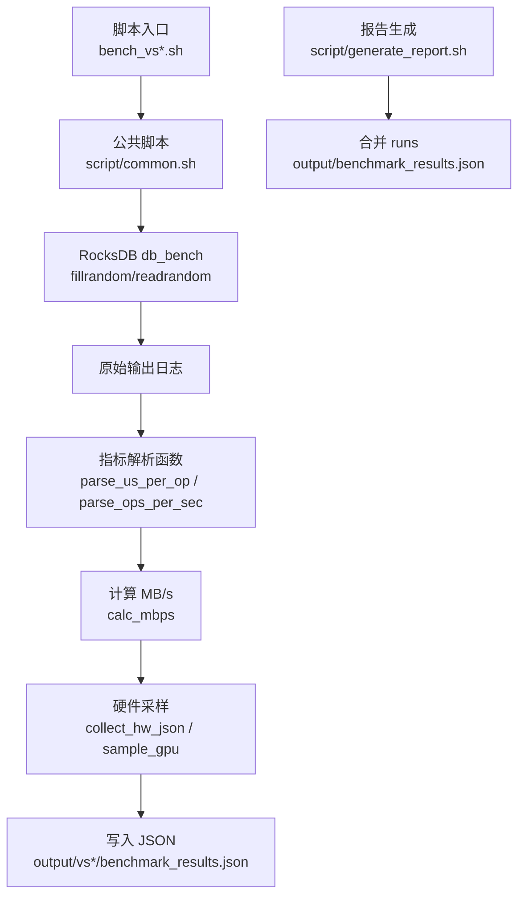
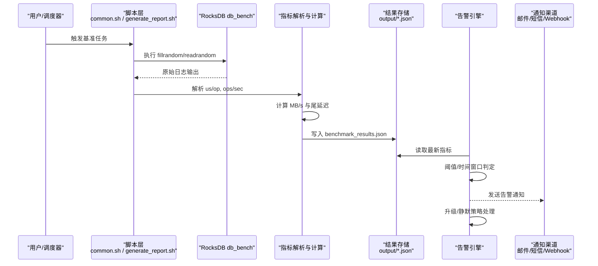
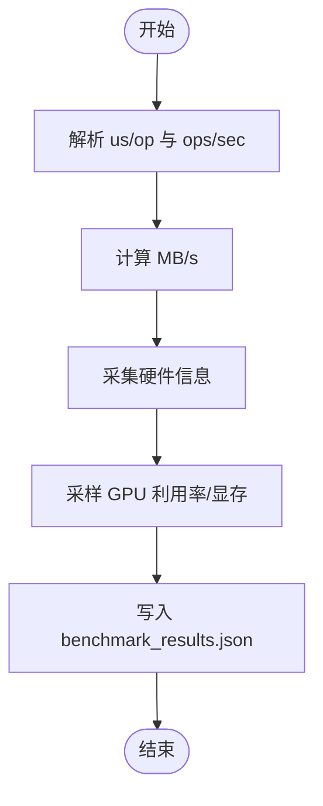
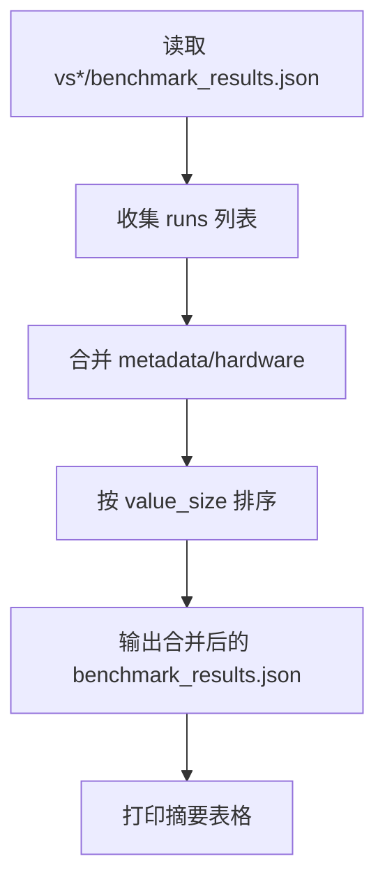
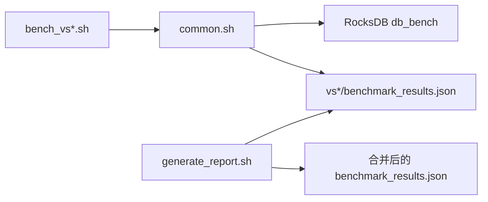

# 告警规则

<cite>
**本文引用的文件**
- [common.sh](file://script/common.sh)
- [generate_report.sh](file://script/generate_report.sh)
- [README.md](file://source/YCSB/README.md)
</cite>

## 目录
1. [简介](#简介)
2. [项目结构](#项目结构)
3. [核心组件](#核心组件)
4. [架构总览](#架构总览)
5. [详细组件分析](#详细组件分析)
6. [依赖关系分析](#依赖关系分析)
7. [性能注意事项](#性能注意事项)
8. [故障排查指南](#故障排查指南)
9. [结论](#结论)
10. [附录](#附录)

## 简介
本文件为监控与告警规则的完整配置与管理文档，面向 RocksDB 基准测试与 YCSB 工作负载的观测、阈值设定、异常检测、通知与升级策略、静默规则以及历史查询与分析。结合仓库中的脚本能力（硬件信息采集、指标解析、结果合并与报告生成），提供可落地的告警体系设计，确保对 CPU、内存、I/O 延迟、错误率等关键指标的及时感知与处置。

## 项目结构
- 脚本层
  - script/common.sh：基准执行、指标解析、硬件信息采样、JSON 结果输出
  - script/generate_report.sh：合并多值大小运行结果并生成汇总 JSON
- 基准与工具
  - source/YCSB/README.md：YCSB 使用说明、百分位延迟与直方图处理建议
- 数据产物
  - output/vs{value_size}/benchmark_results.json：单次运行的结构化指标
  - output/benchmark_results.json：合并后的统一结果

**图表来源**
- [common.sh:16-39](file://script/common.sh#L16-L39)
- [common.sh:41-66](file://script/common.sh#L41-L66)
- [common.sh:68-196](file://script/common.sh#L68-L196)
- [generate_report.sh:12-42](file://script/generate_report.sh#L12-L42)

**章节来源**
- [common.sh:1-196](file://script/common.sh#L1-L196)
- [generate_report.sh:1-59](file://script/generate_report.sh#L1-L59)
- [README.md:82-135](file://source/YCSB/README.md#L82-L135)

## 核心组件
- 指标采集与解析
  - 操作级时延（微秒/次）与吞吐（ops/sec）从 db_bench 输出中解析
  - 带宽（MB/s）由 ops/sec 与键值大小计算
  - 硬件信息：CPU、内存、GPU、内核、操作系统
- 结果聚合与报告
  - 按 value_size 维度生成 JSON，随后合并为统一结果
- 基准与负载
  - RocksDB fillrandom/readrandom
  - YCSB 工作负载与 HDR 直方图百分位提取

**章节来源**
- [common.sh:16-39](file://script/common.sh#L16-L39)
- [common.sh:41-66](file://script/common.sh#L41-L66)
- [common.sh:68-196](file://script/common.sh#L68-L196)
- [generate_report.sh:12-42](file://script/generate_report.sh#L12-L42)
- [README.md:82-135](file://source/YCSB/README.md#L82-L135)

## 架构总览
下图展示从基准执行到告警事件生成的端到端流程，包含指标采集、阈值判定、通知与升级路径。

**图表来源**
- [common.sh:68-196](file://script/common.sh#L68-L196)
- [generate_report.sh:12-42](file://script/generate_report.sh#L12-L42)

## 详细组件分析

### 指标采集与解析（common.sh）
- 功能要点
  - 解析 us/op 与 ops/sec，用于延迟与吞吐评估
  - 基于 ops/sec 与 kv_size 计算 MB/s
  - 采集 CPU、内存、GPU、内核、OS 等信息
  - 在 fill 与 read 阶段后记录 GPU 利用率与显存占用
  - 输出标准化 JSON，便于后续告警与分析
- 复杂度与性能
  - 解析采用 grep+sed/awk，线性扫描输出行，开销低
  - 计算 MB/s 为 O(1) 算术运算
  - GPU 采样通过 nvidia-smi 调用，注意避免高频轮询导致额外开销

**图表来源**
- [common.sh:16-39](file://script/common.sh#L16-L39)
- [common.sh:41-66](file://script/common.sh#L41-L66)
- [common.sh:68-196](file://script/common.sh#L68-L196)

**章节来源**
- [common.sh:16-39](file://script/common.sh#L16-L39)
- [common.sh:41-66](file://script/common.sh#L41-L66)
- [common.sh:68-196](file://script/common.sh#L68-L196)

### 报告合并与汇总（generate_report.sh）
- 功能要点
  - 遍历不同 value_size 的结果 JSON，合并 runs 列表
  - 保留 metadata 与 hardware 信息，排序输出
  - 打印摘要表格，便于快速对比
- 适用场景
  - 批量基准完成后统一归档，供告警系统消费或离线分析

**图表来源**
- [generate_report.sh:12-42](file://script/generate_report.sh#L12-L42)
- [generate_report.sh:46-54](file://script/generate_report.sh#L46-L54)

**章节来源**
- [generate_report.sh:1-59](file://script/generate_report.sh#L1-L59)

### 基准与负载（YCSB）
- 功能要点
  - 支持多种数据库绑定与 workload
  - 强调 P99/P99.9/P99.99 等尾延迟百分位的重要性
  - 支持 HDR 直方图导出与合并，便于精确统计
- 告警关联
  - 将 YCSB 输出的百分位延迟作为告警输入之一，结合 RocksDB 指标进行综合判断

**章节来源**
- [README.md:82-135](file://source/YCSB/README.md#L82-L135)

## 依赖关系分析
- 脚本依赖
  - bench_vs*.sh 依赖 common.sh 提供的解析与采样函数
  - generate_report.sh 依赖各 vs*/benchmark_results.json 的存在
- 外部依赖
  - RocksDB db_bench 输出格式需稳定，以便解析函数正确匹配
  - nvidia-smi 可选，未安装时 GPU 字段回退为默认值
- 数据结构
  - benchmark_results.json 包含 metadata、hardware、runs 数组，字段稳定利于告警规则匹配

**图表来源**
- [common.sh:68-196](file://script/common.sh#L68-L196)
- [generate_report.sh:12-42](file://script/generate_report.sh#L12-L42)

**章节来源**
- [common.sh:68-196](file://script/common.sh#L68-L196)
- [generate_report.sh:1-59](file://script/generate_report.sh#L1-L59)

## 性能注意事项
- 指标采集频率
  - GPU 采样应避免过高频率，建议在每次基准结束后采样一次
- 解析稳定性
  - db_bench 输出格式变化会导致解析失败，需在变更时同步更新解析逻辑
- 资源占用
  - 大量并发基准会显著增加 CPU/IO 压力，应合理控制线程数与队列长度
- 存储与归档
  - JSON 结果体积随运行次数增长，建议定期归档与清理

[本节为通用指导，不直接分析具体文件]

## 故障排查指南
- 常见问题
  - 解析结果为空：检查 db_bench 输出是否包含预期行；确认 bench 名称与正则匹配
  - GPU 信息缺失：确认 nvidia-smi 可用且权限正常
  - 合并失败：检查 vs*/benchmark_results.json 是否存在且格式正确
- 定位步骤
  - 查看对应 vs*/benchmark_results.json 的 runs 与 metadata
  - 核对 generate_report.sh 的输出摘要与合并结果
  - 若涉及 YCSB，检查 HDR 直方图文件与合并命令参数

**章节来源**
- [common.sh:16-39](file://script/common.sh#L16-L39)
- [common.sh:41-66](file://script/common.sh#L41-L66)
- [generate_report.sh:12-42](file://script/generate_report.sh#L12-L42)
- [README.md:118-135](file://source/YCSB/README.md#L118-L135)

## 结论
通过脚本层的指标采集、解析与合并能力，结合 YCSB 的百分位延迟统计，可构建覆盖 CPU、内存、I/O 延迟、错误率等关键指标的告警体系。配合时间窗口异常检测、通知渠道与升级策略，可实现对系统异常的及时发现与高效处置。

[本节为总结性内容，不直接分析具体文件]

## 附录

### 告警阈值设置方法与最佳实践
- CPU 使用率
  - 建议：P99 延迟超过基线 2x 持续 5 分钟触发警告；超过 3x 持续 2 分钟触发严重
  - 依据：YCSB 强调尾延迟百分位的重要性
- 内存占用
  - 建议：RSS 持续增长且无回落，持续 10 分钟触发警告；OOM 风险阈值（如 >90%）立即严重告警
- I/O 延迟
  - 建议：us/op 超过基线 1.5x 持续 5 分钟警告；超过 2x 持续 2 分钟严重
  - 依据：db_bench 的 us/op 可直接作为延迟指标
- 错误率
  - 建议：错误比例 > 0.1% 持续 5 分钟警告；> 1% 立即严重
- 带宽（MB/s）
  - 建议：低于基线 50% 持续 5 分钟警告；低于 30% 严重
- 尾延迟（P99/P99.9）
  - 建议：P99 超基线 2x 持续 5 分钟警告；P99.9 超基线 3x 持续 2 分钟严重

[本节为通用指导，不直接分析具体文件]

### 基于时间窗口的异常检测算法
- 滑动窗口均值与方差
  - 计算最近 N 个时间点的均值与标准差，超出 3σ 视为异常
- 指数加权移动平均（EWMA）
  - 对近期指标赋予更高权重，提高响应速度
- 同比/环比比较
  - 与昨日同时段或上一周期对比，偏差超过阈值触发告警
- 动态基线
  - 使用历史分位数（如 P95/P99）作为动态阈值，适应负载变化

[本节为通用指导，不直接分析具体文件]

### 线程状态监控与死锁检测机制
- 线程状态
  - 监控阻塞线程数量、等待锁时长、上下文切换频率
- 死锁检测
  - 周期性扫描锁持有与等待图，发现环即判定死锁
- 告警策略
  - 阻塞线程数突增或等待锁时长超过阈值触发警告
  - 检测到死锁立即严重告警并自动降级

[本节为通用指导，不直接分析具体文件]

### 告警通知渠道配置
- 邮件
  - 配置 SMTP 服务器、发件人、收件人列表与模板
- 短信
  - 接入短信网关，设置号码白名单与限流策略
- Webhook
  - 支持 HTTP POST 推送至企业微信、钉钉、飞书等
- 去重与抑制
  - 相同告警键在静默期内不重复通知

[本节为通用指导，不直接分析具体文件]

### 告警升级策略与静默规则
- 升级策略
  - 一级（警告）→ 二级（严重）→ 三级（致命），逐级扩大通知范围
- 静默规则
  - 维护时段静默、已知问题静默、依赖服务不可用静默
- 恢复通知
  - 指标回归基线后发送恢复通知，关闭工单

[本节为通用指导，不直接分析具体文件]

### 告警历史查询与分析功能
- 数据存储
  - 将告警事件与指标快照存入时序数据库或对象存储
- 查询接口
  - 支持按时间、标签、告警级别、实体维度查询
- 分析能力
  - 趋势分析、根因定位、影响面评估、容量规划

[本节为通用指导，不直接分析具体文件]