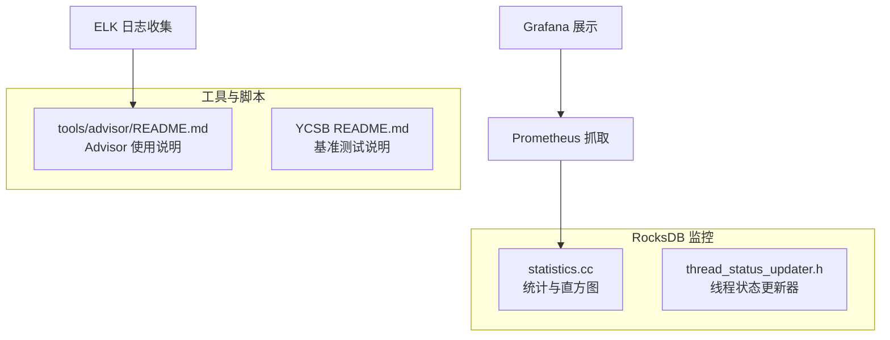
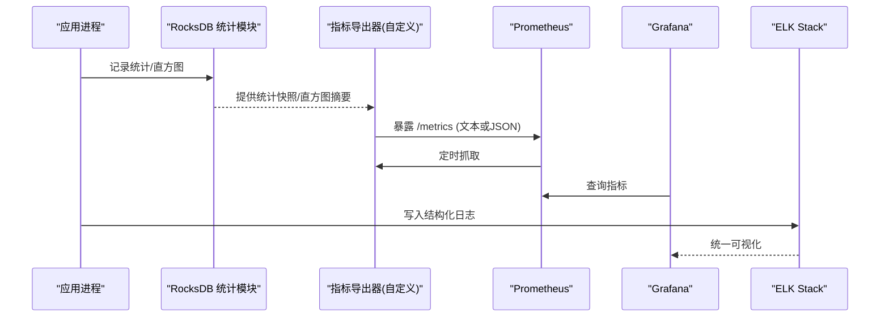
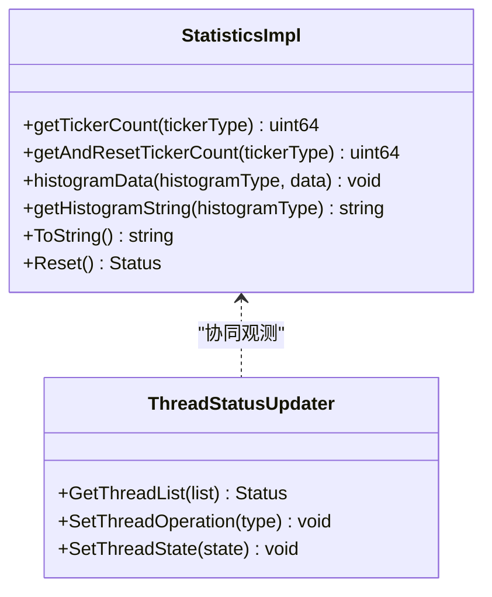
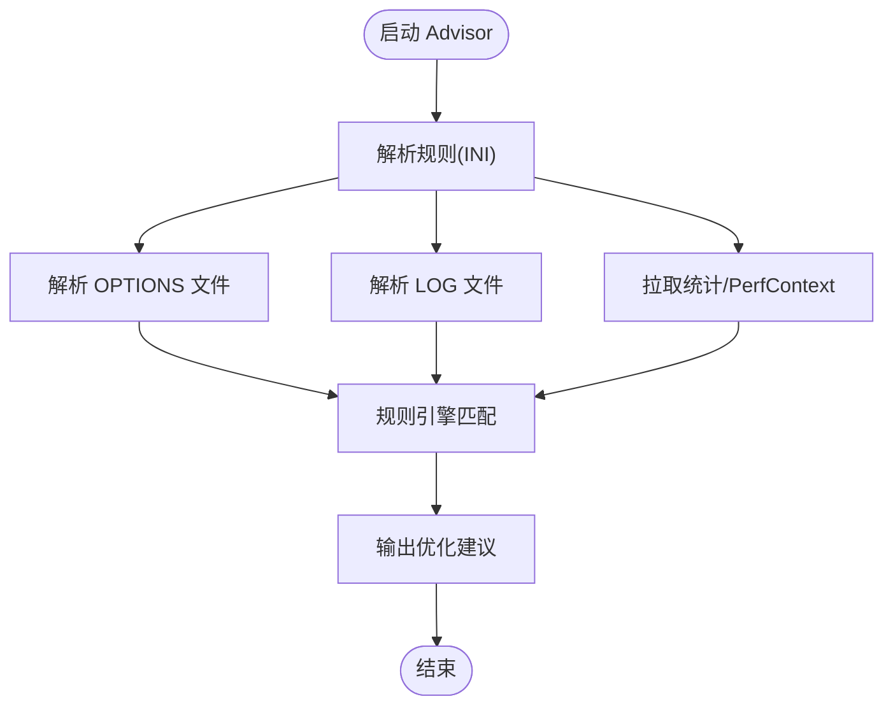
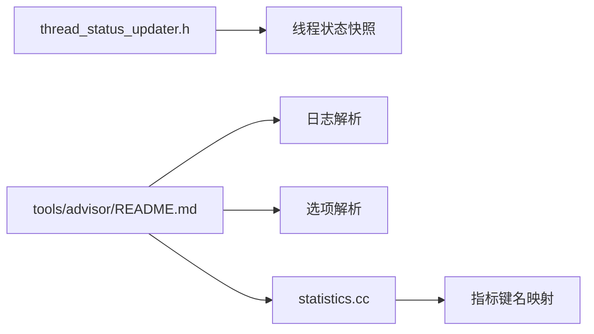

# 外部系统集成

<cite>
**本文引用的文件**   
- [source/rocksdb/monitoring/statistics.cc](file://source/rocksdb/monitoring/statistics.cc)
- [source/rocksdb/monitoring/thread_status_updater.h](file://source/rocksdb/monitoring/thread_status_updater.h)
- [source/rocksdb/tools/advisor/README.md](file://source/rocksdb/tools/advisor/README.md)
- [source/rocksdb/README.md](file://source/rocksdb/README.md)
</cite>

## 目录
1. [简介](#简介)
2. [项目结构](#项目结构)
3. [核心组件](#核心组件)
4. [架构总览](#架构总览)
5. [详细组件分析](#详细组件分析)
6. [依赖关系分析](#依赖关系分析)
7. [性能考虑](#性能考虑)
8. [故障排查指南](#故障排查指南)
9. [结论](#结论)
10. [附录](#附录)

## 简介
本指南面向监控系统与外部工具集成，聚焦 RocksDB 的指标采集、线程状态观测、日志与统计解析，以及基于这些能力构建 Prometheus/Grafana/ELK 等外部监控体系的方法。文档涵盖：
- Prometheus 指标暴露端点与数据格式转换（基于 RocksDB 统计与直方图）
- Grafana 仪表板搭建与可视化配置思路
- ELK Stack 日志收集与结构化处理方案
- 提供获取实时监控数据的 API 建议（通过 RocksDB 统计接口导出）
- 与其他监控平台的对接方法
- 数据导出与备份策略
- 高可用性与数据完整性保障

## 项目结构
仓库包含多个子项目与工具，其中与监控相关的关键路径如下：
- RocksDB 监控子系统：monitoring/ 下包含统计、直方图、线程状态更新器等实现
- 工具与脚本：tools/advisor/ 提供日志、选项、统计与时间序列解析能力
- 基准与示例：YCSB 与 benchmark 脚本可用于压测与指标采集

图表来源 
- [source/rocksdb/monitoring/statistics.cc](file://source/rocksdb/monitoring/statistics.cc)
- [source/rocksdb/monitoring/thread_status_updater.h](file://source/rocksdb/monitoring/thread_status_updater.h)
- [source/rocksdb/tools/advisor/README.md](file://source/rocksdb/tools/advisor/README.md)
- [source/YCSB/README.md](file://source/YCSB/README.md)

章节来源
- [source/rocksdb/README.md](file://source/rocksdb/README.md)

## 核心组件
- 统计与直方图（Statistics）
  - 提供 Tickers（计数器）与 Histograms（直方图）两类指标，覆盖缓存命中、压缩、WAL、Compaction、IO、事务等维度
  - 支持按名称映射到字符串键，便于外部系统消费
  - 提供聚合与重置能力，适合周期性抓取
- 线程状态更新器（ThreadStatusUpdater）
  - 维护线程操作类型、阶段、属性与状态，支持无锁读写与一致性快照
  - 可输出活跃线程列表，用于诊断与告警

章节来源
- [source/rocksdb/monitoring/statistics.cc](file://source/rocksdb/monitoring/statistics.cc)
- [source/rocksdb/monitoring/thread_status_updater.h](file://source/rocksdb/monitoring/thread_status_updater.h)

## 架构总览
下图展示了从 RocksDB 内部统计到外部监控系统的整体流程：

图表来源 
- [source/rocksdb/monitoring/statistics.cc](file://source/rocksdb/monitoring/statistics.cc)
- [source/rocksdb/monitoring/thread_status_updater.h](file://source/rocksdb/monitoring/thread_status_updater.h)

## 详细组件分析

### 统计与直方图（Statistics）
- 指标命名与分类
  - TickersNameMap：将枚举类型的计数器映射为可读字符串键，如块缓存命中/缺失、WAL 字节数、压缩/解压耗时等
  - HistogramsNameMap：将直方图类型映射为字符串键，如 GET/WRITE/SEEK 耗时、SST 读写耗时、压缩/解压耗时等
- 数据访问与聚合
  - 提供 getTickerCount/getAndResetTickerCount 等方法，支持跨核聚合与清零
  - 提供 histogramData/histogramString 等方法，返回分位数与计数信息
- 输出格式
  - ToString() 生成“键 + COUNT/P50/P95/P99/P100/COUNT/SUM”的文本行，便于直接转换为 Prometheus 文本格式

图表来源 
- [source/rocksdb/monitoring/statistics.cc](file://source/rocksdb/monitoring/statistics.cc)
- [source/rocksdb/monitoring/thread_status_updater.h](file://source/rocksdb/monitoring/thread_status_updater.h)

章节来源
- [source/rocksdb/monitoring/statistics.cc](file://source/rocksdb/monitoring/statistics.cc)
- [source/rocksdb/monitoring/thread_status_updater.h](file://source/rocksdb/monitoring/thread_status_updater.h)

### 线程状态更新器（ThreadStatusUpdater）
- 线程级观测
  - 维护 thread_id、thread_type、operation_type、state_type、op_start_time 等字段
  - 支持 SetThreadOperation/SetThreadOperationStage/SetThreadState 等操作
- 一致性保证
  - 通过原子指针与有序设置/读取顺序，确保 GetThreadList() 返回一致快照
- 用途
  - 结合统计指标，定位慢请求、阻塞线程、后台任务状态

章节来源
- [source/rocksdb/monitoring/thread_status_updater.h](file://source/rocksdb/monitoring/thread_status_updater.h)

### 日志与统计解析（Advisor）
- 功能概述
  - 解析 RocksDB 日志、OPTIONS 文件、统计与 perf context，基于规则引擎给出优化建议
- 使用要点
  - 需要 Python3；通过命令行参数指定规则文件、OPTIONS 文件、LOG 前缀与 stats_dump_period_sec
  - 支持 LOG/OPTIONS/TIME_SERIES 三类数据源

图表来源 
- [source/rocksdb/tools/advisor/README.md](file://source/rocksdb/tools/advisor/README.md)

章节来源
- [source/rocksdb/tools/advisor/README.md](file://source/rocksdb/tools/advisor/README.md)

## 依赖关系分析
- 统计模块对外暴露字符串化键名，便于 Prometheus 文本格式转换
- 线程状态更新器与统计模块解耦，但共同服务于可观测性目标
- Advisor 依赖 RocksDB 日志、统计与选项文件，作为离线分析与调优入口

图表来源 
- [source/rocksdb/monitoring/statistics.cc](file://source/rocksdb/monitoring/statistics.cc)
- [source/rocksdb/monitoring/thread_status_updater.h](file://source/rocksdb/monitoring/thread_status_updater.h)
- [source/rocksdb/tools/advisor/README.md](file://source/rocksdb/tools/advisor/README.md)

## 性能考虑
- 指标粒度与频率
  - 合理设置 stats_dump_period_sec，避免频繁序列化导致额外开销
- 直方图采样
  - 仅对关键路径启用直方图，控制内存与CPU占用
- 线程状态追踪
  - 在高频路径上谨慎开启，必要时按需开关 enable_tracking
- 导出器设计
  - 采用增量聚合与批量导出，减少锁竞争与GC压力

[本节为通用指导，不直接分析具体文件]

## 故障排查指南
- 常见问题
  - 指标缺失：确认统计级别与直方图类型是否启用
  - 延迟尖刺：检查 Compaction 与 WAL 同步耗时指标
  - 线程阻塞：通过线程状态快照定位卡住的 operation_type/state_type
- 定位步骤
  - 使用 ToString() 输出统计快照，对比历史基线
  - 使用 Advisor 解析 LOG/OPTIONS/STATS，触发规则并查看建议
  - 结合线程状态快照与指标趋势，缩小问题范围

章节来源
- [source/rocksdb/monitoring/statistics.cc](file://source/rocksdb/monitoring/statistics.cc)
- [source/rocksdb/tools/advisor/README.md](file://source/rocksdb/tools/advisor/README.md)

## 结论
通过 RocksDB 提供的统计与线程状态能力，可以构建完整的监控与可观测体系。结合 Prometheus/Grafana/ELK 等外部工具，可实现从指标采集、可视化到日志分析的闭环。建议在部署时关注指标粒度、导出频率与资源占用，并通过 Advisor 进行持续调优。

[本节为总结性内容，不直接分析具体文件]

## 附录

### Prometheus 集成指南
- 指标暴露端点
  - 在应用内调用统计接口获取快照，转换为 Prometheus 文本格式，暴露 HTTP 端点（如 /metrics）
  - 或使用 sidecar/agent 定期抓取 RocksDB 统计输出并转发至 Prometheus
- 数据格式转换
  - 将 Tickers 映射为 counter/gauge
  - 将 Histograms 映射为 histogram（P50/P95/P99 等）
- 抓取策略
  - 合理设置 scrape_interval，避免过高频率影响性能

[本节为概念性指导，不直接分析具体文件]

### Grafana 仪表板搭建
- 数据源
  - 添加 Prometheus 数据源，验证连接与权限
- 面板设计
  - 基础面板：QPS、延迟分布（P95/P99）、错误率
  - 存储面板：WAL 大小、SST 数量、Compaction 速率
  - 线程面板：活跃线程数、阻塞线程占比
- 告警规则
  - 基于阈值与趋势（如延迟突增、错误率上升）配置告警

[本节为概念性指导，不直接分析具体文件]

### ELK Stack 日志收集
- 采集
  - 使用 Filebeat/Fluentd 收集 RocksDB LOG 与应用日志
- 解析
  - 使用 Logstash 正则解析关键字段（时间戳、级别、模块、消息）
- 存储与检索
  - 索引按天滚动，保留策略与冷热分层
- 可视化
  - Kibana 创建仪表盘，关联告警与审计

[本节为概念性指导，不直接分析具体文件]

### 实时监控数据 API 建议
- 接口设计
  - GET /api/metrics?format=prometheus|json：返回当前统计快照
  - GET /api/thread-status：返回活跃线程状态列表
- 安全与限流
  - 鉴权、IP 白名单、速率限制
- 版本兼容
  - 版本号纳入响应头，向后兼容变更

[本节为概念性指导，不直接分析具体文件]

### 与其他监控平台对接
- OpenMetrics/Prometheus 兼容
  - 优先输出 OpenMetrics 文本格式，便于多平台消费
- 云原生生态
  - 与 Kubernetes Metrics Server、Service Mesh 监控集成
- 企业平台
  - 适配 Zabbix/Nagios 等插件，或通过中间层转换

[本节为概念性指导，不直接分析具体文件]

### 数据导出与备份策略
- 导出
  - 定期导出统计快照与线程状态快照，归档至对象存储
- 备份
  - RocksDB 快照与增量备份，结合 WAL 与 SST 文件一致性校验
- 恢复
  - 制定回滚与恢复演练计划，确保 RTO/RPO 达标

[本节为概念性指导，不直接分析具体文件]

### 高可用与数据完整性
- 多副本与分区
  - 数据库层面启用多副本，监控分区与脑裂
- 一致性校验
  - 定期校验校验和与元数据一致性
- 容灾演练
  - 模拟节点故障与网络分区，验证自动恢复与数据一致性

[本节为概念性指导，不直接分析具体文件]