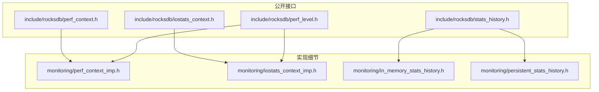
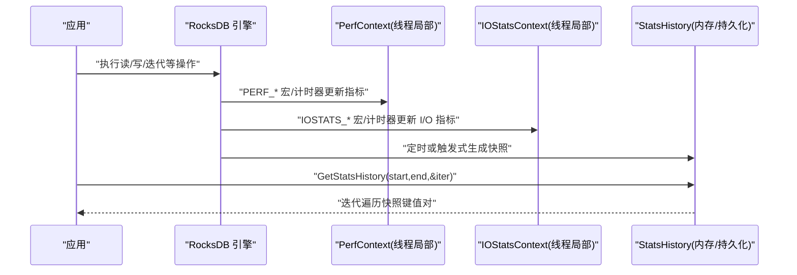
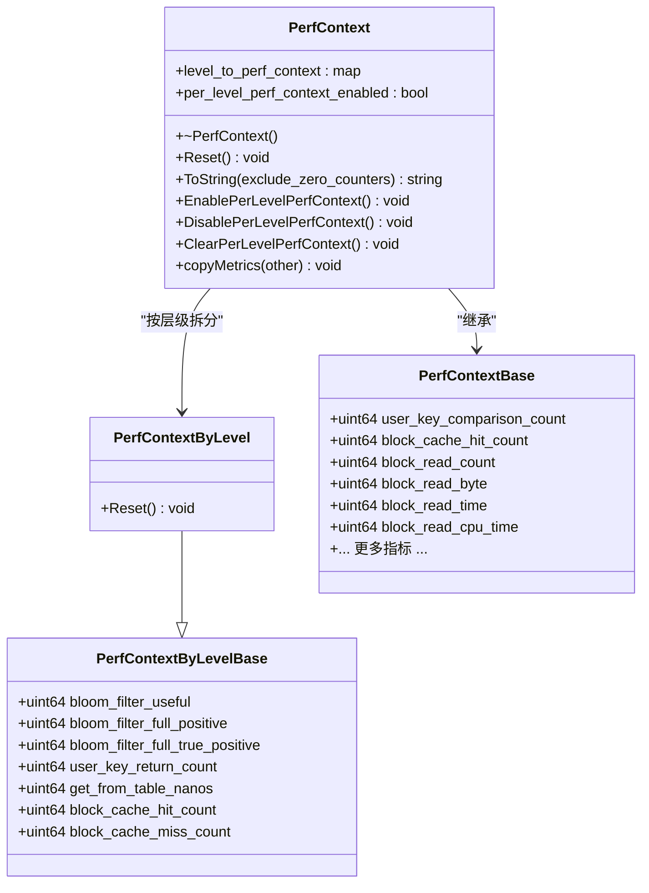
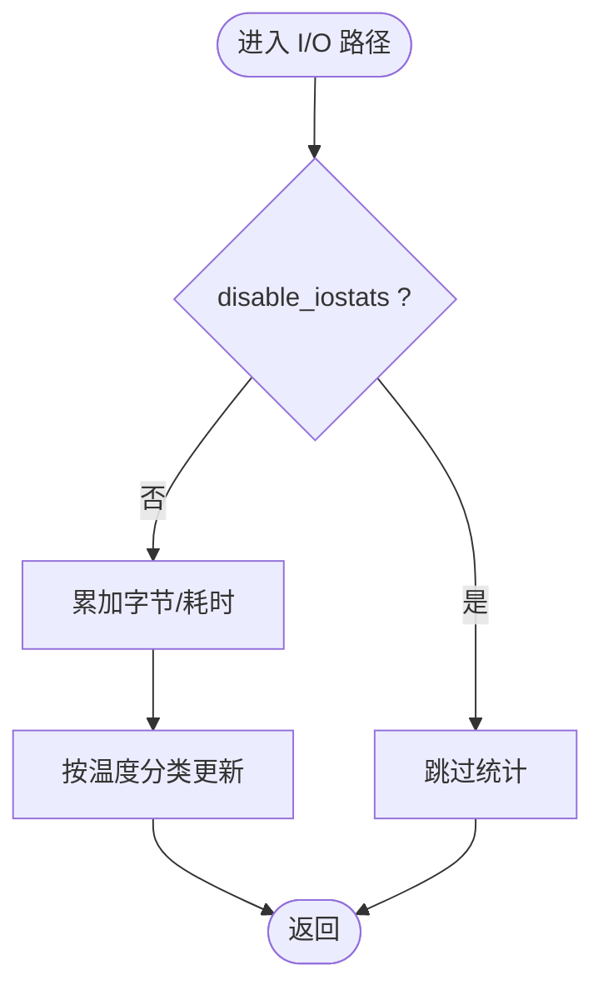
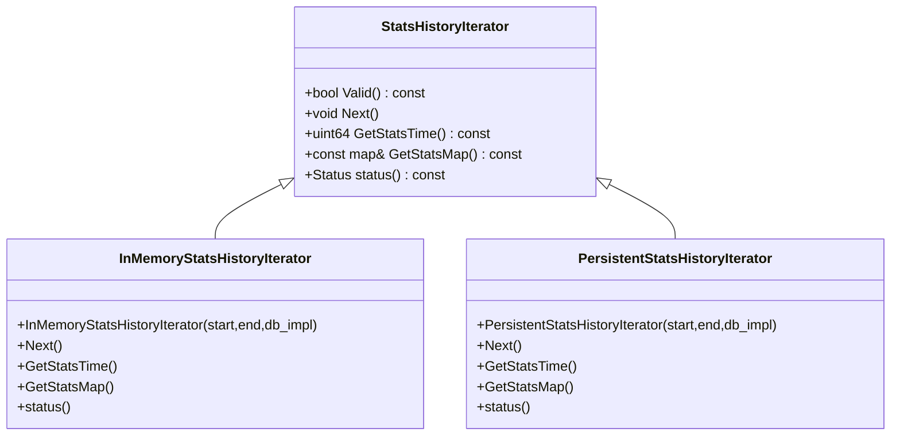
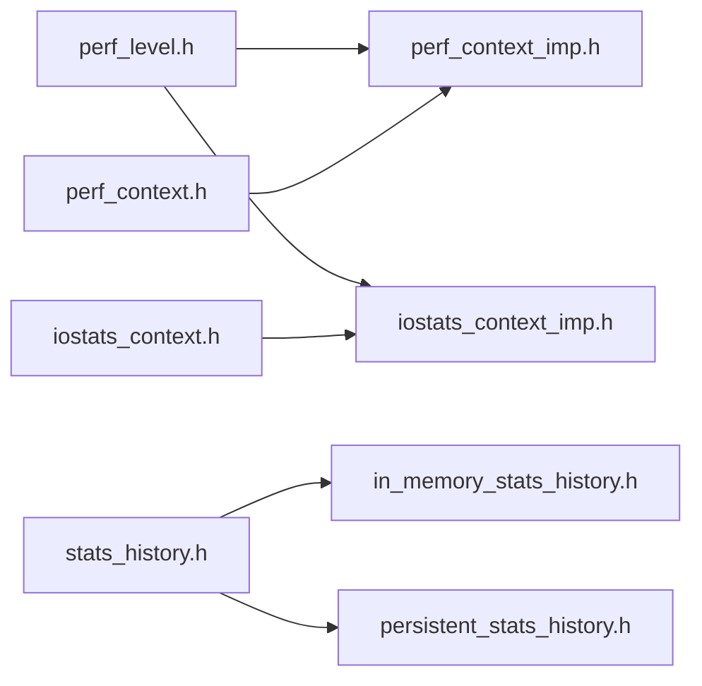

# 指标收集

<cite>
**本文引用的文件**   
- [perf_context.h](file://source/rocksdb/include/rocksdb/perf_context.h)
- [iostats_context.h](file://source/rocksdb/include/rocksdb/iostats_context.h)
- [perf_level.h](file://source/rocksdb/include/rocksdb/perf_level.h)
- [perf_context_imp.h](file://source/rocksdb/monitoring/perf_context_imp.h)
- [iostats_context_imp.h](file://source/rocksdb/monitoring/iostats_context_imp.h)
- [stats_history.h](file://source/rocksdb/include/rocksdb/stats_history.h)
- [in_memory_stats_history.h](file://source/rocksdb/monitoring/in_memory_stats_history.h)
- [persistent_stats_history.h](file://source/rocksdb/monitoring/persistent_stats_history.h)
</cite>

## 目录
1. [简介](#简介)
2. [项目结构](#项目结构)
3. [核心组件](#核心组件)
4. [架构总览](#架构总览)
5. [详细组件分析](#详细组件分析)
6. [依赖关系分析](#依赖关系分析)
7. [性能考量](#性能考量)
8. [故障排查指南](#故障排查指南)
9. [结论](#结论)
10. [附录](#附录)

## 简介
本文件面向 RocksDB 监控与指标采集，系统性说明内置统计信息的收集与导出机制，覆盖数据库操作计数器、I/O 统计、内存使用、压缩与缓存命中等关键指标；详解 perf_context 的性能上下文配置与使用方法，以及 iostats_context 的 I/O 统计能力；并提供自定义指标的添加与采集方法、指标数据格式定义与采样策略，以及不同性能级别（perf_level）的配置选项，确保能够准确捕获系统运行时的关键性能数据。

## 项目结构
RocksDB 的监控子系统位于 monitoring 与 include/rocksdb 目录下，核心由三类构件组成：
- 性能上下文 PerfContext：线程局部存储的操作级计时与计数指标集合
- I/O 上下文 IOStatsContext：线程局部的 I/O 操作耗时与字节数统计
- 统计历史 StatsHistory：按时间序列保存快照，支持内存或持久化存储

图表来源 
- [perf_context.h:1-344](file://source/rocksdb/include/rocksdb/perf_context.h#L1-L344)
- [iostats_context.h:1-134](file://source/rocksdb/include/rocksdb/iostats_context.h#L1-L134)
- [perf_level.h:1-60](file://source/rocksdb/include/rocksdb/perf_level.h#L1-L60)
- [perf_context_imp.h:1-104](file://source/rocksdb/monitoring/perf_context_imp.h#L1-L104)
- [iostats_context_imp.h:1-63](file://source/rocksdb/monitoring/iostats_context_imp.h#L1-L63)
- [stats_history.h:1-71](file://source/rocksdb/include/rocksdb/stats_history.h#L1-L71)
- [in_memory_stats_history.h:1-75](file://source/rocksdb/monitoring/in_memory_stats_history.h#L1-L75)
- [persistent_stats_history.h:1-84](file://source/rocksdb/monitoring/persistent_stats_history.h#L1-L84)

章节来源
- [perf_context.h:1-344](file://source/rocksdb/include/rocksdb/perf_context.h#L1-L344)
- [iostats_context.h:1-134](file://source/rocksdb/include/rocksdb/iostats_context.h#L1-L134)
- [perf_level.h:1-60](file://source/rocksdb/include/rocksdb/perf_level.h#L1-L60)
- [perf_context_imp.h:1-104](file://source/rocksdb/monitoring/perf_context_imp.h#L1-L104)
- [iostats_context_imp.h:1-63](file://source/rocksdb/monitoring/iostats_context_imp.h#L1-L63)
- [stats_history.h:1-71](file://source/rocksdb/include/rocksdb/stats_history.h#L1-L71)
- [in_memory_stats_history.h:1-75](file://source/rocksdb/monitoring/in_memory_stats_history.h#L1-L75)
- [persistent_stats_history.h:1-84](file://source/rocksdb/monitoring/persistent_stats_history.h#L1-L84)

## 核心组件
- 性能上下文 PerfContext：提供细粒度的操作计时与计数指标，如块缓存命中/缺失、索引/过滤块读取、解压/校验和、迭代器跳过计数、写入路径各阶段耗时、锁等待、加密解密耗时、外部文件导入耗时等。支持按层级（PerfLevel）拆分统计。
- I/O 上下文 IOStatsContext：记录线程池 ID、读写字节数、open/write/read/fsync 等系统调用耗时、CPU 时间、按温度分层的文件 I/O 统计，并支持开关以排除日志等非业务 I/O 干扰。
- 统计历史 StatsHistory：通过迭代器访问按时间戳索引的快照，支持内存与持久化两种后端，便于周期性导出与离线分析。

章节来源
- [perf_context.h:1-344](file://source/rocksdb/include/rocksdb/perf_context.h#L1-L344)
- [iostats_context.h:1-134](file://source/rocksdb/include/rocksdb/iostats_context.h#L1-L134)
- [stats_history.h:1-71](file://source/rocksdb/include/rocksdb/stats_history.h#L1-L71)

## 架构总览
下图展示了从应用调用到指标采集与导出的整体流程：应用通过 RocksDB API 执行操作，内部通过宏与计时器在关键路径上更新 PerfContext 与 IOStatsContext；上层通过 StatsHistoryIterator 获取历史快照进行导出与分析。

图表来源 
- [perf_context_imp.h:1-104](file://source/rocksdb/monitoring/perf_context_imp.h#L1-L104)
- [iostats_context_imp.h:1-63](file://source/rocksdb/monitoring/iostats_context_imp.h#L1-L63)
- [stats_history.h:1-71](file://source/rocksdb/include/rocksdb/stats_history.h#L1-L71)

## 详细组件分析

### PerfContext：性能上下文与指标体系
- 数据结构与职责
  - PerfContextBase：包含大量 uint64 指标，涵盖比较次数、块缓存命中/缺失、索引/过滤块读取、解压/校验和、迭代器跳过/合并计数、写入路径各阶段耗时、锁等待、Env 文件系统操作耗时、CPU 时间、加密解密、外部文件导入、按类别的数据块读取字节等。
  - PerfContextByLevelBase/PerfContextByLevel：按层级拆分统计，支持 Reset 与聚合。
  - PerfContext：提供 ToString、Enable/Disable/Clear Per-Level 统计、复制指标等方法。
- 启用与粒度控制
  - 通过 SetPerfLevel/GetPerfLevel 设置当前线程的性能级别，影响 PerfContext 与 IOStatsContext 的采集范围。
  - 通过 PERF_COUNTER_ADD / PERF_COUNTER_BY_LEVEL_ADD 等宏按级别条件性累加。
- 计时与 CPU 计时
  - 使用 PERF_TIMER_GUARD / PERF_CPU_TIMER_GUARD / PERF_TIMER_FOR_WAIT_GUARD 等宏自动起止计时，按 PerfLevel 决定是否采集。
- 输出与采样
  - ToString(exclude_zero_counters=false) 可输出非零指标字符串，便于调试与导出。
  - 建议结合 StatsHistory 定期快照，避免高频同步开销。

图表来源 
- [perf_context.h:1-344](file://source/rocksdb/include/rocksdb/perf_context.h#L1-L344)

章节来源
- [perf_context.h:1-344](file://source/rocksdb/include/rocksdb/perf_context.h#L1-L344)
- [perf_context_imp.h:1-104](file://source/rocksdb/monitoring/perf_context_imp.h#L1-L104)

### IOStatsContext：I/O 统计与温度分层
- 字段与职责
  - thread_pool_id：线程池标识
  - bytes_written/bytes_read：累计读写字节
  - open_nanos/allocate_nanos/write_nanos/read_nanos/range_sync_nanos/fsync_nanos/prepare_write_nanos/logger_nanos：各类系统调用耗时
  - cpu_write_nanos/cpu_read_nanos：CPU 时间
  - file_io_stats_by_temperature：按温度（热/温/冷/冰/未知）细分的文件 I/O 字节与次数
  - disable_iostats：屏蔽部分 I/O 统计（例如日志），避免污染业务指标
- 使用方式
  - 通过 IOSTATS_* 宏与计时器守卫快速插入统计点
  - 通过 get_iostats_context() 获取线程局部指针
- 输出与重置
  - ToString(exclude_zero_counters=false) 输出字符串
  - Reset() 清零所有计数器

图表来源 
- [iostats_context.h:1-134](file://source/rocksdb/include/rocksdb/iostats_context.h#L1-L134)
- [iostats_context_imp.h:1-63](file://source/rocksdb/monitoring/iostats_context_imp.h#L1-L63)

章节来源
- [iostats_context.h:1-134](file://source/rocksdb/include/rocksdb/iostats_context.h#L1-L134)
- [iostats_context_imp.h:1-63](file://source/rocksdb/monitoring/iostats_context_imp.h#L1-L63)

### PerfLevel：性能级别与采样策略
- 级别定义（递增启用）
  - kUninitialized/kDisable：关闭或未初始化
  - kEnableCount：仅计数类指标（无时间关键字）
  - kEnableWait：用户线程在 RocksDB 内等待的耗时（_wait/_delay_*_time/nanos）
  - kEnableTimeExceptForMutex：端到端操作耗时（_time/_nanos）
  - kEnableTimeAndCPUTimeExceptForMutex：操作 CPU 时间（_cpu_*_time/nanos）
  - kEnableTime：互斥量等待时间（_mutex/_condition_*_time/nanos）
- 设置与查询
  - SetPerfLevel(level)/GetPerfLevel() 控制当前线程采集粒度
- 采样策略建议
  - 生产环境默认开启 kEnableCount，按需升级至 kEnableTime 或更高
  - 压测/定位瓶颈时临时提升至 kEnableTimeAndCPUTimeExceptForMutex
  - 结合 StatsHistory 周期快照，降低频繁读取开销

章节来源
- [perf_level.h:1-60](file://source/rocksdb/include/rocksdb/perf_level.h#L1-L60)

### StatsHistory：统计历史快照与导出
- 统一接口
  - StatsHistoryIterator：Valid()/Next()/GetStatsTime()/GetStatsMap()/status()
- 内存实现
  - InMemoryStatsHistoryIterator：基于 DBImpl::stats_history_ 的内存映射，支持时间区间查询
- 持久化实现
  - PersistentStatsHistoryIterator：将快照按时间戳编码为键，落盘存储，支持版本兼容与优化
- 使用示例（概念）
  - db->GetStatsHistory(start,end,&iter)，迭代 GetStatsMap() 得到键值对快照

图表来源 
- [stats_history.h:1-71](file://source/rocksdb/include/rocksdb/stats_history.h#L1-L71)
- [in_memory_stats_history.h:1-75](file://source/rocksdb/monitoring/in_memory_stats_history.h#L1-L75)
- [persistent_stats_history.h:1-84](file://source/rocksdb/monitoring/persistent_stats_history.h#L1-L84)

章节来源
- [stats_history.h:1-71](file://source/rocksdb/include/rocksdb/stats_history.h#L1-L71)
- [in_memory_stats_history.h:1-75](file://source/rocksdb/monitoring/in_memory_stats_history.h#L1-L75)
- [persistent_stats_history.h:1-84](file://source/rocksdb/monitoring/persistent_stats_history.h#L1-L84)

## 依赖关系分析
- 头文件依赖
  - perf_context.h 依赖 perf_level.h
  - iostats_context.h 依赖 perf_level.h
  - perf_context_imp.h 依赖 perf_step_timer.h、stop_watch.h
  - iostats_context_imp.h 依赖 perf_step_timer.h
- 运行时依赖
  - 线程局部存储：PerfContext、IOStatsContext
  - 统计历史：内存或持久化后端
- 耦合与内聚
  - PerfContext/IOStatsContext 高内聚于各自领域，通过宏与计时器低耦合接入
  - StatsHistory 抽象出统一迭代接口，屏蔽存储差异

图表来源 
- [perf_level.h:1-60](file://source/rocksdb/include/rocksdb/perf_level.h#L1-L60)
- [perf_context.h:1-344](file://source/rocksdb/include/rocksdb/perf_context.h#L1-L344)
- [iostats_context.h:1-134](file://source/rocksdb/include/rocksdb/iostats_context.h#L1-L134)
- [perf_context_imp.h:1-104](file://source/rocksdb/monitoring/perf_context_imp.h#L1-L104)
- [iostats_context_imp.h:1-63](file://source/rocksdb/monitoring/iostats_context_imp.h#L1-L63)
- [stats_history.h:1-71](file://source/rocksdb/include/rocksdb/stats_history.h#L1-L71)
- [in_memory_stats_history.h:1-75](file://source/rocksdb/monitoring/in_memory_stats_history.h#L1-L75)
- [persistent_stats_history.h:1-84](file://source/rocksdb/monitoring/persistent_stats_history.h#L1-L84)

## 性能考量
- 采集成本
  - 计时与 CPU 计时在高并发下可能带来额外开销，建议仅在需要时提升 PerfLevel
  - 频繁 ToString() 会引发字符串分配，应仅在导出或调试时调用
- 采样策略
  - 使用 StatsHistory 周期快照（如每秒/每批）替代实时读取
  - 针对热点路径使用条件性计时（如 wait/mutex 相关）减少无关开销
- 内存占用
  - PerfContextByLevel 按需启用，避免常驻大对象
  - IOStatsContext.disable_iostats 可用于屏蔽日志等非业务 I/O

[本节为通用指导，不直接分析具体文件]

## 故障排查指南
- 指标未更新
  - 检查是否启用了对应 PerfLevel（kEnableCount 及以上）
  - 确认编译宏未禁用统计（如 NPERF_CONTEXT/NIOSTATS_CONTEXT）
- 指标噪声过大
  - 调整 IOStatsContext.disable_iostats 屏蔽日志 I/O
  - 降低 PerfLevel 或缩短采样窗口
- 导出失败
  - 检查 StatsHistory 时间区间是否有效
  - 确认迭代器 Valid() 状态与 status() 返回值

章节来源
- [perf_context_imp.h:1-104](file://source/rocksdb/monitoring/perf_context_imp.h#L1-L104)
- [iostats_context_imp.h:1-63](file://source/rocksdb/monitoring/iostats_context_imp.h#L1-L63)
- [stats_history.h:1-71](file://source/rocksdb/include/rocksdb/stats_history.h#L1-L71)

## 结论
RocksDB 的监控体系以 PerfContext 与 IOStatsContext 为核心，配合 PerfLevel 精细控制采集粒度，并通过 StatsHistory 提供统一的快照导出接口。合理选择 PerfLevel、利用宏与计时器在关键路径埋点、结合周期快照导出，可在保证性能的前提下获得准确的运行时性能数据，支撑容量规划、瓶颈定位与稳定性保障。

[本节为总结性内容，不直接分析具体文件]

## 附录

### 指标数据格式与导出
- 快照格式
  - 键值对：std::map<std::string, uint64_t>，键为指标名，值为计数或累计值
  - 时间戳：秒级整数，用于排序与区间查询
- 导出方式
  - 通过 StatsHistoryIterator 迭代 GetStatsMap()，逐条处理
  - 可选 exclude_zero_counters=true 过滤零值，减小体积

章节来源
- [stats_history.h:1-71](file://source/rocksdb/include/rocksdb/stats_history.h#L1-L71)

### 自定义指标添加与采集
- 在 PerfContextBase/PerfContextByLevelBase 中新增字段（遵循命名约定）
- 在 perf_context.cc 的 DEF_PERF_CONTEXT_METRICS/DEF_PERF_CONTEXT_LEVEL_METRICS 宏中添加新指标
- 在关键路径使用 PERF_COUNTER_ADD / PERF_COUNTER_BY_LEVEL_ADD 进行累加
- 如需计时，使用 PERF_TIMER_* 宏包裹代码段

章节来源
- [perf_context.h:1-344](file://source/rocksdb/include/rocksdb/perf_context.h#L1-L344)
- [perf_context_imp.h:1-104](file://source/rocksdb/monitoring/perf_context_imp.h#L1-L104)

### 常用指标分类速览
- 操作计数：user_key_comparison_count、block_cache_hit_count、block_read_count、bloom_sst_hit_count 等
- I/O 字节与时延：block_read_byte、read_nanos、fsync_nanos、env_new_sequential_file_nanos 等
- 压缩与缓存：block_decompress_time、compressed_sec_cache_compressed_bytes、block_cache_index_hit_count 等
- 迭代器行为：internal_key_skipped_count、internal_delete_skipped_count、iter_next_count 等
- 写入路径：write_wal_time、write_memtable_time、write_delay_time、write_thread_wait_nanos 等
- 锁与等待：db_mutex_lock_nanos、key_lock_wait_time、key_lock_wait_count 等

章节来源
- [perf_context.h:1-344](file://source/rocksdb/include/rocksdb/perf_context.h#L1-L344)
- [iostats_context.h:1-134](file://source/rocksdb/include/rocksdb/iostats_context.h#L1-L134)