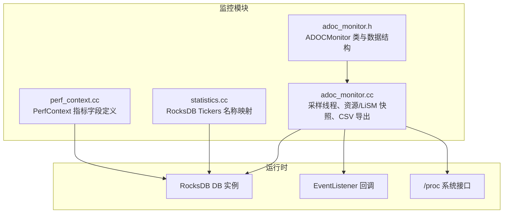
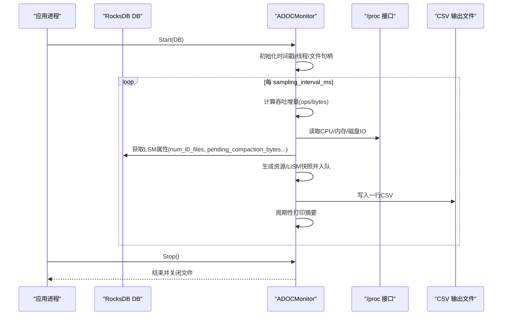
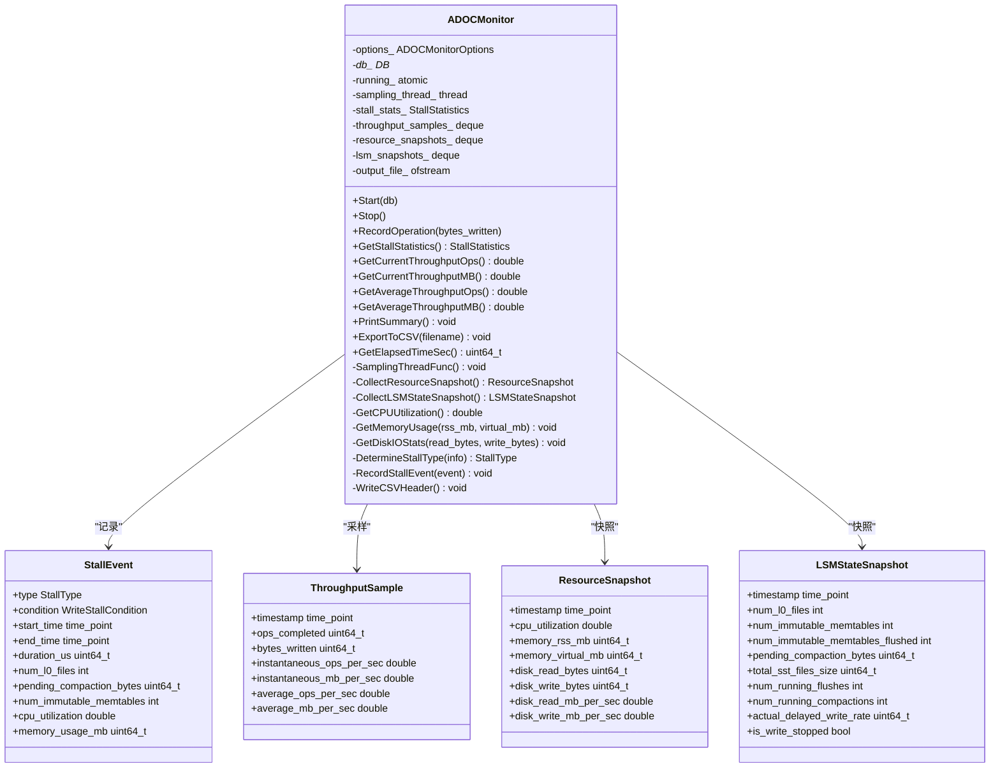
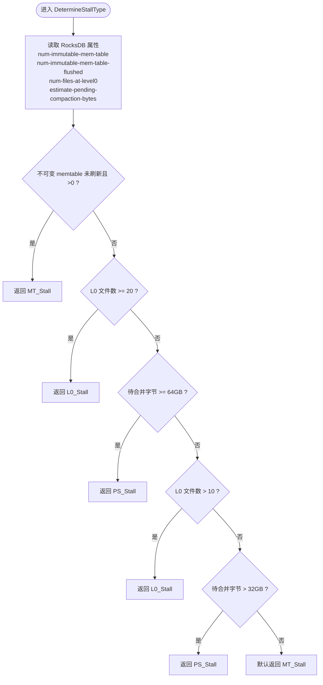
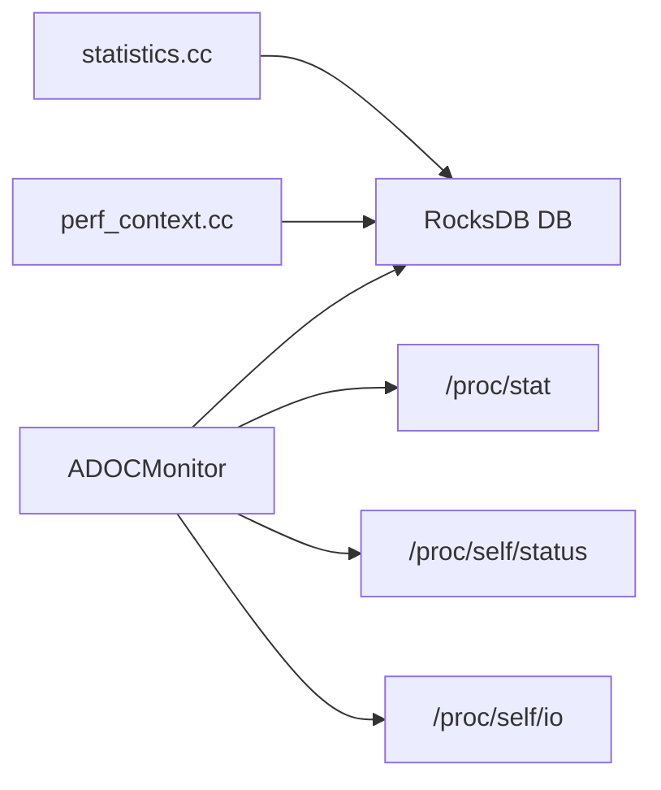

# 监控告警

<cite>
**本文引用的文件**   
- [adoc_monitor.h](file://source/rocksdb_adoc_monitor/monitoring/adoc_monitor.h)
- [adoc_monitor.cc](file://source/rocksdb_adoc_monitor/monitoring/adoc_monitor.cc)
- [statistics.cc](file://source/rocksdb_adoc_monitor/monitoring/statistics.cc)
- [perf_context.cc](file://source/rocksdb_adoc_monitor/monitoring/perf_context.cc)
</cite>

## 目录
1. [简介](#简介)
2. [项目结构](#项目结构)
3. [核心组件](#核心组件)
4. [架构总览](#架构总览)
5. [详细组件分析](#详细组件分析)
6. [依赖关系分析](#依赖关系分析)
7. [性能考量](#性能考量)
8. [故障排查指南](#故障排查指南)
9. [结论](#结论)
10. [附录](#附录)

## 简介
本指南面向运维与研发人员，提供针对 RocksDB 的监控与告警配置与管理方案。内容涵盖：
- 内置监控指标的采集与导出（RocksDB 统计、性能计数器、资源使用）
- 外部监控系统集成（Prometheus、Grafana）
- 告警规则定义与阈值设置
- 实时监控仪表板搭建
- 日志收集与分析工具配置
- 关键性能指标（KPI）定义与监控策略
- 异常检测与自动恢复机制
- 监控数据长期存储与查询优化
目标是确保团队能够及时发现并处理问题，保障系统稳定与高性能运行。

## 项目结构
仓库中与监控相关的主要代码位于 rocksdb_adoc_monitor 子模块的 monitoring 目录，包含 ADOC 监控器实现、统计与性能上下文等。

图表来源 
- [adoc_monitor.h:119-202](file://source/rocksdb_adoc_monitor/monitoring/adoc_monitor.h#L119-L202)
- [adoc_monitor.cc:31-133](file://source/rocksdb_adoc_monitor/monitoring/adoc_monitor.cc#L31-L133)
- [statistics.cc:22-200](file://source/rocksdb_adoc_monitor/monitoring/statistics.cc#L22-L200)
- [perf_context.cc:51-165](file://source/rocksdb_adoc_monitor/monitoring/perf_context.cc#L51-L165)

章节来源
- [adoc_monitor.h:119-202](file://source/rocksdb_adoc_monitor/monitoring/adoc_monitor.h#L119-L202)
- [adoc_monitor.cc:31-133](file://source/rocksdb_adoc_monitor/monitoring/adoc_monitor.cc#L31-L133)
- [statistics.cc:22-200](file://source/rocksdb_adoc_monitor/monitoring/statistics.cc#L22-L200)
- [perf_context.cc:51-165](file://source/rocksdb_adoc_monitor/monitoring/perf_context.cc#L51-L165)

## 核心组件
- ADOCMonitor 类
  - 职责：基于 RocksDB EventListener 的写停顿分析与综合监控；周期性采样吞吐、资源与 LSM 状态；记录停顿事件并导出 CSV。
  - 关键能力：启动/停止采样线程、按间隔采集 CPU/内存/磁盘 IO、读取 RocksDB 属性、判定停顿类型（MT/L0/PS）、统计与导出。
- 统计与性能上下文
  - statistics.cc：维护 RocksDB Tickers 到 Prometheus 友好名称的映射，便于统一导出。
  - perf_context.cc：定义 PerfContext 指标字段，覆盖读路径、写路径、压缩、锁等待、IO 等细粒度耗时与计数。

章节来源
- [adoc_monitor.h:119-202](file://source/rocksdb_adoc_monitor/monitoring/adoc_monitor.h#L119-L202)
- [adoc_monitor.cc:31-133](file://source/rocksdb_adoc_monitor/monitoring/adoc_monitor.cc#L31-L133)
- [statistics.cc:22-200](file://source/rocksdb_adoc_monitor/monitoring/statistics.cc#L22-L200)
- [perf_context.cc:51-165](file://source/rocksdb_adoc_monitor/monitoring/perf_context.cc#L51-L165)

## 架构总览
ADOC Monitor 作为 RocksDB 的事件监听者，结合系统 /proc 接口与 RocksDB 属性，形成“采集—聚合—导出”的闭环。

图表来源 
- [adoc_monitor.cc:31-133](file://source/rocksdb_adoc_monitor/monitoring/adoc_monitor.cc#L31-L133)
- [adoc_monitor.cc:135-170](file://source/rocksdb_adoc_monitor/monitoring/adoc_monitor.cc#L135-L170)
- [adoc_monitor.cc:172-245](file://source/rocksdb_adoc_monitor/monitoring/adoc_monitor.cc#L172-L245)
- [adoc_monitor.cc:431-455](file://source/rocksdb_adoc_monitor/monitoring/adoc_monitor.cc#L431-L455)

## 详细组件分析

### ADOCMonitor 类与数据结构
- 主要数据结构
  - StallEvent：记录一次写停顿事件的类型、条件、起止时间、持续时间、L0 文件数、待合并字节、不可变 memtable 数量、CPU 利用率与内存占用。
  - ThroughputSample：吞吐采样点，含瞬时与平均 ops/MB/s。
  - ResourceSnapshot：资源快照，含 CPU、RSS/Virtual 内存、磁盘读写累计与速率。
  - LSMStateSnapshot：LiSM 层状态快照，含 L0 文件数、不可变 memtable 数、待合并字节、SST 大小、运行中的 flush/compaction、延迟写率、是否停止写。
  - StallStatistics：各类停顿的计数与总时长统计。
  - ADOCMonitorOptions：采样间隔、输出文件、是否记录吞吐/资源/LSM、最大缓存条目、是否打印摘要与摘要间隔。
- 生命周期与线程模型
  - Start：绑定 DB、打开输出文件、启动采样线程。
  - SamplingThreadFunc：按间隔触发吞吐、资源、LSM 快照采集，写入 CSV，定期打印摘要。
  - Stop：通知并等待线程退出，关闭文件。
- 写停顿判定
  - DetermineStallType：根据不可变 memtable 未刷新、L0 文件数、待合并字节阈值判断 MT/L0/PS 停顿类型。
- 事件回调
  - OnFlushCompleted/OnCompactionCompleted：统计 flush/compaction 次数及层级分布。
  - OnStallConditionsChanged：记录停顿开始/结束，累积统计，必要时记录事件详情。

图表来源 
- [adoc_monitor.h:42-117](file://source/rocksdb_adoc_monitor/monitoring/adoc_monitor.h#L42-L117)
- [adoc_monitor.h:119-202](file://source/rocksdb_adoc_monitor/monitoring/adoc_monitor.h#L119-L202)

章节来源
- [adoc_monitor.h:42-117](file://source/rocksdb_adoc_monitor/monitoring/adoc_monitor.h#L42-L117)
- [adoc_monitor.h:119-202](file://source/rocksdb_adoc_monitor/monitoring/adoc_monitor.h#L119-L202)
- [adoc_monitor.cc:31-133](file://source/rocksdb_adoc_monitor/monitoring/adoc_monitor.cc#L31-L133)
- [adoc_monitor.cc:135-170](file://source/rocksdb_adoc_monitor/monitoring/adoc_monitor.cc#L135-L170)
- [adoc_monitor.cc:172-245](file://source/rocksdb_adoc_monitor/monitoring/adoc_monitor.cc#L172-L245)
- [adoc_monitor.cc:247-336](file://source/rocksdb_adoc_monitor/monitoring/adoc_monitor.cc#L247-L336)
- [adoc_monitor.cc:338-354](file://source/rocksdb_adoc_monitor/monitoring/adoc_monitor.cc#L338-L354)
- [adoc_monitor.cc:356-397](file://source/rocksdb_adoc_monitor/monitoring/adoc_monitor.cc#L356-L397)
- [adoc_monitor.cc:399-429](file://source/rocksdb_adoc_monitor/monitoring/adoc_monitor.cc#L399-L429)
- [adoc_monitor.cc:431-455](file://source/rocksdb_adoc_monitor/monitoring/adoc_monitor.cc#L431-L455)

### 写停顿判定流程

图表来源 
- [adoc_monitor.cc:247-265](file://source/rocksdb_adoc_monitor/monitoring/adoc_monitor.cc#L247-L265)

章节来源
- [adoc_monitor.cc:247-265](file://source/rocksdb_adoc_monitor/monitoring/adoc_monitor.cc#L247-L265)

### RocksDB 统计与性能上下文
- statistics.cc 提供 Tickers 到指标名的映射，例如块缓存命中/缺失、WAL 字节、压缩/解压、合并操作时间、BlobDB 指标等，便于统一暴露给监控系统。
- perf_context.cc 定义 PerfContext 指标字段，覆盖用户键比较、块缓存、索引/过滤器读取、压缩字典、二级缓存、锁等待、环境 IO 耗时等，用于细粒度性能剖析。

章节来源
- [statistics.cc:22-200](file://source/rocksdb_adoc_monitor/monitoring/statistics.cc#L22-L200)
- [perf_context.cc:51-165](file://source/rocksdb_adoc_monitor/monitoring/perf_context.cc#L51-L165)

## 依赖关系分析
- ADOCMonitor 依赖 RocksDB DB 实例以获取属性与事件回调。
- 通过 /proc/self/status 与 /proc/self/io 获取进程级内存与磁盘 IO 统计。
- 通过 /proc/stat 计算 CPU 利用率。
- 统计与性能上下文为上层监控提供标准化指标名与字段。

图表来源 
- [adoc_monitor.cc:172-245](file://source/rocksdb_adoc_monitor/monitoring/adoc_monitor.cc#L172-L245)
- [statistics.cc:22-200](file://source/rocksdb_adoc_monitor/monitoring/statistics.cc#L22-L200)
- [perf_context.cc:51-165](file://source/rocksdb_adoc_monitor/monitoring/perf_context.cc#L51-L165)

章节来源
- [adoc_monitor.cc:172-245](file://source/rocksdb_adoc_monitor/monitoring/adoc_monitor.cc#L172-L245)
- [statistics.cc:22-200](file://source/rocksdb_adoc_monitor/monitoring/statistics.cc#L22-L200)
- [perf_context.cc:51-165](file://source/rocksdb_adoc_monitor/monitoring/perf_context.cc#L51-L165)

## 性能考量
- 采样频率与缓冲上限
  - 采样间隔由 options_.sampling_interval_ms 控制，建议根据负载与 I/O 能力调整，避免过高频率导致额外开销。
  - 吞吐与资源快照队列有最大长度限制，防止内存膨胀。
- 系统调用开销
  - 每次采样会读取 /proc 文件，需权衡精度与开销。
- RocksDB 属性读取
  - 频繁调用 db_->GetProperty 可能带来一定开销，建议在采样线程内批量获取。
- 导出与汇总
  - CSV 写入与周期摘要打印应合理控制频率，避免阻塞主流程。

[本节为通用指导，不直接分析具体文件]

## 故障排查指南
- 写停顿定位
  - 观察停顿类型（MT/L0/PS），结合 L0 文件数、不可变 memtable 数量、待合并字节进行根因分析。
  - 关注 flush/compaction 运行数量与实际延迟写率。
- 资源瓶颈
  - CPU 利用率接近饱和时，检查压缩/解密/加密、锁等待、合并与压缩耗时。
  - 内存 RSS 增长过快，检查块缓存与二级缓存命中率。
  - 磁盘 IO 速率异常，检查 WAL 同步与 flush/compaction 写入放大。
- 指标缺失或异常
  - 确认 statistics 与 perf context 已启用，核对指标名映射是否正确。
  - 检查 CSV 输出路径权限与磁盘空间。

章节来源
- [adoc_monitor.cc:247-336](file://source/rocksdb_adoc_monitor/monitoring/adoc_monitor.cc#L247-L336)
- [adoc_monitor.cc:399-429](file://source/rocksdb_adoc_monitor/monitoring/adoc_monitor.cc#L399-L429)
- [statistics.cc:22-200](file://source/rocksdb_adoc_monitor/monitoring/statistics.cc#L22-L200)
- [perf_context.cc:51-165](file://source/rocksdb_adoc_monitor/monitoring/perf_context.cc#L51-L165)

## 结论
通过 ADOCMonitor 与 RocksDB 统计/性能上下文，可构建从底层资源到上层业务 KPI 的全链路监控体系。配合合理的阈值与告警规则，以及 Prometheus/Grafana 可视化，能够有效提升问题发现与处置效率。

[本节为总结性内容，不直接分析具体文件]

## 附录

### 内置监控指标清单与含义
- 吞吐指标
  - 瞬时/平均 ops/s、MB/s：衡量写入与读取能力。
- 资源指标
  - CPU 利用率、RSS/Virtual 内存、磁盘读写累计与速率。
- LiSM 状态
  - L0 文件数、不可变 memtable 数量、待合并字节、SST 总大小、运行中 flush/compaction 数量、实际延迟写率、是否停止写。
- RocksDB 统计（示例）
  - 块缓存命中/缺失、WAL 字节、压缩/解压、合并操作时间、BlobDB 指标等。
- 性能上下文（示例）
  - 用户键比较、块缓存、索引/过滤器读取、压缩字典、二级缓存、锁等待、环境 IO 耗时等。

章节来源
- [adoc_monitor.cc:135-170](file://source/rocksdb_adoc_monitor/monitoring/adoc_monitor.cc#L135-L170)
- [adoc_monitor.cc:172-245](file://source/rocksdb_adoc_monitor/monitoring/adoc_monitor.cc#L172-L245)
- [statistics.cc:22-200](file://source/rocksdb_adoc_monitor/monitoring/statistics.cc#L22-L200)
- [perf_context.cc:51-165](file://source/rocksdb_adoc_monitor/monitoring/perf_context.cc#L51-L165)

### 外部监控系统集成（Prometheus/Grafana）
- 指标暴露方式
  - 将 ADOCMonitor 输出的 CSV 通过 sidecar 或脚本转换为 Prometheus 文本格式，或使用 RocksDB 统计/性能上下文直接暴露 HTTP 端点。
- 抓取与存储
  - 配置 prometheus.yml 抓取目标，设置合适的 scrape_interval。
  - 使用 TSDB 长期存储，结合 retention 策略管理数据生命周期。
- 可视化
  - 在 Grafana 中导入/创建面板，展示吞吐、资源、LiSM 状态、停顿事件等。
- 告警规则
  - 基于 PromQL 定义阈值，如 L0 文件数持续超过阈值、待合并字节过大、CPU/内存/磁盘 IO 异常、停顿事件频发等。

[本节为概念性指导，不直接分析具体文件]

### 告警规则与阈值建议
- 写停顿
  - L0 文件数 > 10（警告）、>= 20（严重）
  - 待合并字节 > 32GB（警告）、>= 64GB（严重）
  - 不可变 memtable 未刷新持续增长
- 资源
  - CPU 利用率 > 80%（警告）、> 95%（严重）
  - RSS 内存增长过快或接近上限
  - 磁盘读写速率异常或达到设备上限
- 后台任务
  - 运行中 flush/compaction 长时间不下降
  - 实际延迟写率持续非零

[本节为概念性指导，不直接分析具体文件]

### 实时监控仪表板搭建
- 面板建议
  - 吞吐趋势（ops/s、MB/s）
  - 资源使用（CPU、内存、磁盘 IO）
  - LiSM 状态（L0 文件数、不可变 memtable、待合并字节、运行中任务）
  - 停顿事件（频次、持续时间、类型分布）
- 交互与联动
  - 支持时间范围选择、多实例对比、下钻到具体指标明细。

[本节为概念性指导，不直接分析具体文件]

### 日志收集与分析工具配置
- 日志来源
  - ADOCMonitor 控制台输出（停顿开始/结束、摘要）
  - RocksDB 日志（可选）
- 采集与解析
  - 使用 filebeat/fluentd 收集日志，正则解析关键字段（停顿类型、持续时间、资源峰值）。
- 分析
  - 在 ELK/Opensearch 中建立索引与看板，关联指标与日志进行根因分析。

[本节为概念性指导，不直接分析具体文件]

### 关键性能指标（KPI）定义与监控策略
- KPI 定义
  - 吞吐：ops/s、MB/s（瞬时与平均）
  - 延迟：写停顿持续时间、flush/compaction 耗时
  - 稳定性：停顿事件频次与占比、资源饱和度
  - 容量：SST 总大小、待合并字节
- 监控策略
  - 分层监控（进程/子系统/组件）
  - 实时+历史结合，短期窗口用于告警，长期窗口用于容量规划

[本节为概念性指导，不直接分析具体文件]

### 异常检测与自动恢复机制
- 异常检测
  - 基于阈值与滑动窗口检测异常（如 L0 堆积、内存泄漏迹象、IO 抖动）。
- 自动恢复
  - 触发限流/降级（降低写入速率、暂停非关键任务）
  - 动态调整 RocksDB 参数（如 compaction 优先级、memtable 大小）
  - 重启或重建相关服务（谨慎评估影响）

[本节为概念性指导，不直接分析具体文件]

### 监控数据长期存储与查询优化
- 存储策略
  - 原始高保真数据短期保留，聚合后长期归档
  - 分区与降采样（按小时/天聚合）
- 查询优化
  - 预聚合表、物化视图
  - 合理索引与标签设计，减少扫描范围

[本节为概念性指导，不直接分析具体文件]