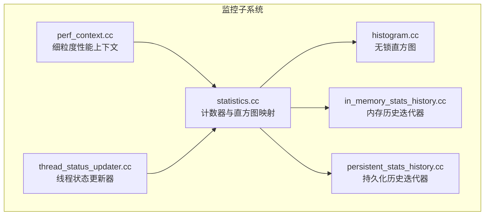
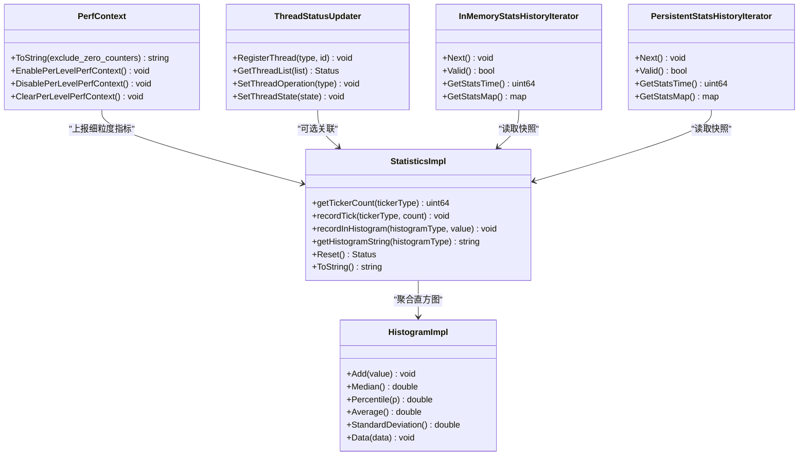
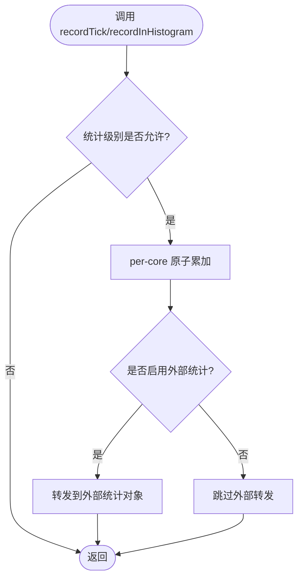
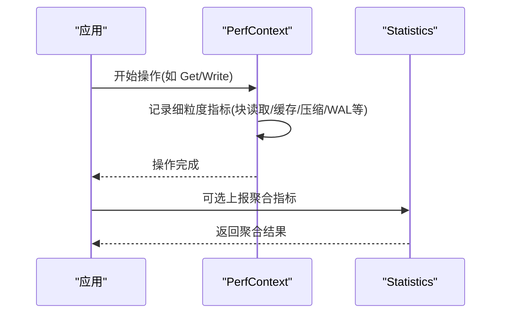
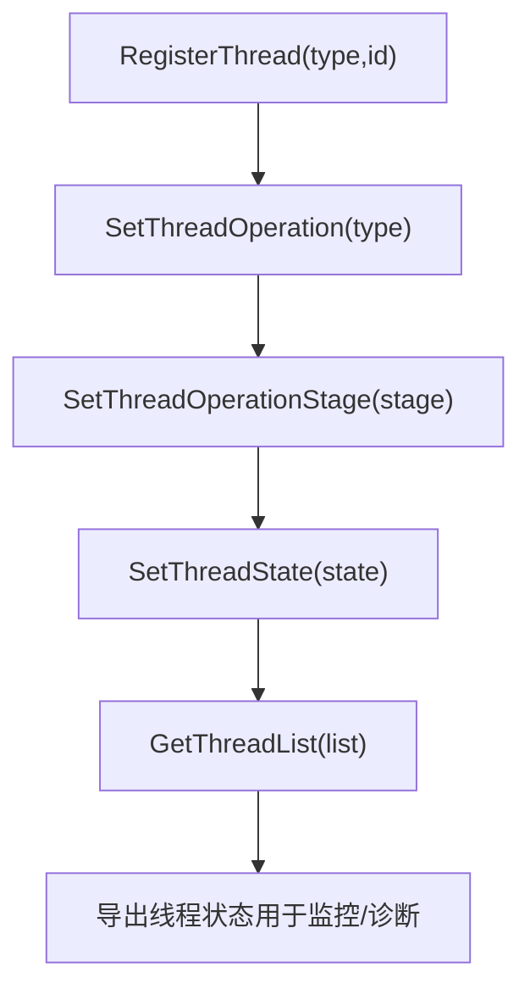
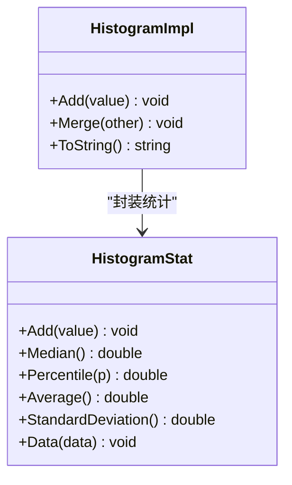
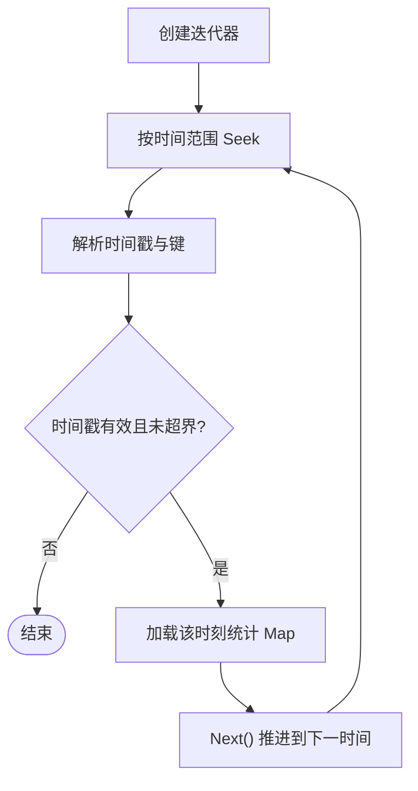
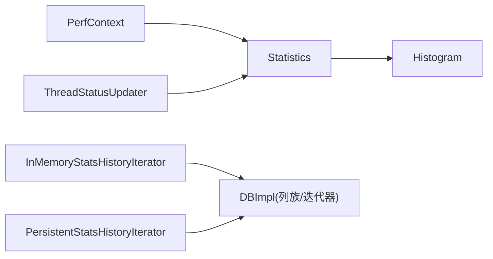

# 健康检查和监控

<cite>
**本文引用的文件**   
- [statistics.cc](file://source/rocksdb/monitoring/statistics.cc)
- [perf_context.cc](file://source/rocksdb/monitoring/perf_context.cc)
- [thread_status_updater.cc](file://source/rocksdb/monitoring/thread_status_updater.cc)
- [in_memory_stats_history.cc](file://source/rocksdb/monitoring/in_memory_stats_history.cc)
- [persistent_stats_history.cc](file://source/rocksdb/monitoring/persistent_stats_history.cc)
- [histogram.cc](file://source/rocksdb/monitoring/histogram.cc)
</cite>

## 目录
1. [简介](#简介)
2. [项目结构](#项目结构)
3. [核心组件](#核心组件)
4. [架构总览](#架构总览)
5. [详细组件分析](#详细组件分析)
6. [依赖关系分析](#依赖关系分析)
7. [性能考虑](#性能考虑)
8. [故障排查指南](#故障排查指南)
9. [结论](#结论)
10. [附录](#附录)

## 简介
本文件面向 RocksDB 监控与健康检查体系，聚焦以下目标：
- 关键性能指标定义与采集方法：读写延迟、吞吐量、CPU 利用率、内存使用情况。
- 系统健康检查点：WAL 文件大小监控、MemTable 状态检查、Compaction 队列监控。
- 告警规则配置：阈值设定与通知机制建议。
- 实时监控工具集成：Prometheus、Grafana 使用指南。
- 日志分析与故障诊断：错误日志解析、性能瓶颈识别。
- 容量预测与趋势分析：基于历史统计数据的工具与方法。

## 项目结构
RocksDB 的监控子系统位于 monitoring 目录，包含统计计数器、直方图、线程状态、性能上下文以及历史数据持久化等能力。核心文件包括：
- statistics.cc：统一定义 Tickers（计数）与 Histograms（直方图），并提供聚合与导出接口。
- perf_context.cc：按操作粒度记录细粒度性能指标，支持按层级拆分。
- thread_status_updater.cc：线程级运行状态与操作阶段追踪。
- histogram.cc：无锁直方图实现，提供分位数、标准差等统计。
- in_memory_stats_history.cc / persistent_stats_history.cc：内存与持久化的历史快照迭代器。

图表来源 
- [statistics.cc:22-305](file://source/rocksdb/monitoring/statistics.cc#L22-L305)
- [perf_context.cc:23-165](file://source/rocksdb/monitoring/perf_context.cc#L23-L165)
- [thread_status_updater.cc:17-220](file://source/rocksdb/monitoring/thread_status_updater.cc#L17-L220)
- [histogram.cc:23-102](file://source/rocksdb/monitoring/histogram.cc#L23-L102)
- [in_memory_stats_history.cc:25-48](file://source/rocksdb/monitoring/in_memory_stats_history.cc#L25-L48)
- [persistent_stats_history.cc:60-174](file://source/rocksdb/monitoring/persistent_stats_history.cc#L60-L174)

章节来源
- [statistics.cc:22-305](file://source/rocksdb/monitoring/statistics.cc#L22-L305)
- [perf_context.cc:23-165](file://source/rocksdb/monitoring/perf_context.cc#L23-L165)
- [thread_status_updater.cc:17-220](file://source/rocksdb/monitoring/thread_status_updater.cc#L17-L220)
- [histogram.cc:23-102](file://source/rocksdb/monitoring/histogram.cc#L23-L102)
- [in_memory_stats_history.cc:25-48](file://source/rocksdb/monitoring/in_memory_stats_history.cc#L25-L48)
- [persistent_stats_history.cc:60-174](file://source/rocksdb/monitoring/persistent_stats_history.cc#L60-L174)

## 核心组件
- 统计计数器与直方图（Statistics）
  - 提供 TickersNameMap 与 HistogramsNameMap，覆盖缓存命中/缺失、WAL、压缩、合并、IO、事务、BlobDB、错误处理等广泛指标。
  - 支持 per-core 聚合、重置、字符串导出与 Map 导出。
- 性能上下文（PerfContext）
  - 以操作维度记录 block cache、索引/过滤块读取、压缩/解压、WAL/MemTable 写入、锁等待、环境 IO 等细粒度耗时与计数。
  - 支持按层级（Level）拆分统计。
- 线程状态（ThreadStatusUpdater）
  - 维护线程类型、ID、操作类型、阶段、状态、属性与耗时，支持列族信息关联。
- 直方图（Histogram）
  - 无锁桶化统计，提供中位数、分位数、均值、标准差、可视化字符串输出。
- 历史快照（InMemory/Persistent Stats History）
  - 内存与持久化两种迭代器，按时间窗口遍历统计快照，用于趋势分析与容量规划。

章节来源
- [statistics.cc:22-305](file://source/rocksdb/monitoring/statistics.cc#L22-L305)
- [statistics.cc:384-416](file://source/rocksdb/monitoring/statistics.cc#L384-L416)
- [statistics.cc:424-542](file://source/rocksdb/monitoring/statistics.cc#L424-L542)
- [perf_context.cc:23-165](file://source/rocksdb/monitoring/perf_context.cc#L23-L165)
- [perf_context.cc:276-303](file://source/rocksdb/monitoring/perf_context.cc#L276-L303)
- [thread_status_updater.cc:17-220](file://source/rocksdb/monitoring/thread_status_updater.cc#L17-L220)
- [histogram.cc:23-102](file://source/rocksdb/monitoring/histogram.cc#L23-L102)
- [histogram.cc:184-229](file://source/rocksdb/monitoring/histogram.cc#L184-L229)
- [in_memory_stats_history.cc:25-48](file://source/rocksdb/monitoring/in_memory_stats_history.cc#L25-L48)
- [persistent_stats_history.cc:60-174](file://source/rocksdb/monitoring/persistent_stats_history.cc#L60-L174)

## 架构总览
监控子系统通过 Statistics 统一暴露计数器与直方图，PerfContext 在热点路径上记录细粒度指标，ThreadStatusUpdater 提供线程级可观测性，历史迭代器支撑离线分析与容量规划。

图表来源 
- [statistics.cc:424-542](file://source/rocksdb/monitoring/statistics.cc#L424-L542)
- [perf_context.cc:276-303](file://source/rocksdb/monitoring/perf_context.cc#L276-L303)
- [thread_status_updater.cc:174-220](file://source/rocksdb/monitoring/thread_status_updater.cc#L174-L220)
- [histogram.cc:244-278](file://source/rocksdb/monitoring/histogram.cc#L244-L278)
- [in_memory_stats_history.cc:25-48](file://source/rocksdb/monitoring/in_memory_stats_history.cc#L25-L48)
- [persistent_stats_history.cc:123-171](file://source/rocksdb/monitoring/persistent_stats_history.cc#L123-L171)

## 详细组件分析

### 统计计数器与直方图（Statistics）
- 指标分类
  - 计数器（Tickers）：涵盖块缓存、Bloom 过滤器、MemTable、L0/L1/L2+ 命中、压缩/解压、WAL、合并、IO、事务、错误处理、BlobDB、冷热读、预取等。
  - 直方图（Histograms）：覆盖 DB 读写/seek/multiget、compaction、表同步、WAL/Manifest 同步、SST 读写、压缩/解压、异步 IO、多扫描等耗时分布。
- 采集与聚合
  - per-core 独立计数，聚合时加锁汇总；支持 getAndResetTickerCount 获取并清零。
  - 直方图按 core 合并，提供 P50/P95/P99/P100、SUM、COUNT 等统计。
- 导出方式
  - ToString 输出键值对文本；getTickerMap 输出 Map，便于外部抓取。

图表来源 
- [statistics.cc:505-529](file://source/rocksdb/monitoring/statistics.cc#L505-L529)
- [statistics.cc:488-503](file://source/rocksdb/monitoring/statistics.cc#L488-L503)
- [statistics.cc:551-583](file://source/rocksdb/monitoring/statistics.cc#L551-L583)

章节来源
- [statistics.cc:22-305](file://source/rocksdb/monitoring/statistics.cc#L22-L305)
- [statistics.cc:384-416](file://source/rocksdb/monitoring/statistics.cc#L384-L416)
- [statistics.cc:424-542](file://source/rocksdb/monitoring/statistics.cc#L424-L542)
- [statistics.cc:551-583](file://source/rocksdb/monitoring/statistics.cc#L551-L583)

### 性能上下文（PerfContext）
- 指标范围
  - 用户键比较、block cache hit/miss、索引/过滤块读取、压缩字典、二次缓存、内部键跳过、快照/合并、WAL/MemTable 写入、锁等待、环境 IO、加密/解密、异步 seek、文件 ingestion 等。
- 层级拆分
  - 支持 EnablePerLevelPerfContext，按 Level 维度记录 bloom_filter_useful、block_cache_hit_count 等。
- 输出
  - ToString 支持排除零计数器，便于精简输出。

图表来源 
- [perf_context.cc:23-165](file://source/rocksdb/monitoring/perf_context.cc#L23-L165)
- [perf_context.cc:276-303](file://source/rocksdb/monitoring/perf_context.cc#L276-L303)

章节来源
- [perf_context.cc:23-165](file://source/rocksdb/monitoring/perf_context.cc#L23-L165)
- [perf_context.cc:276-303](file://source/rocksdb/monitoring/perf_context.cc#L276-L303)

### 线程状态（ThreadStatusUpdater）
- 功能要点
  - 注册/注销线程、设置操作类型与阶段、状态、属性、起始时间。
  - 获取线程列表，包含 db_name、cf_name、操作耗时、阶段、属性数组。
  - 维护 ColumnFamily 信息与数据库信息的映射，保证一致性视图。
- 适用场景
  - 定位慢操作线程、识别阻塞阶段、分析并发竞争。

图表来源 
- [thread_status_updater.cc:22-48](file://source/rocksdb/monitoring/thread_status_updater.cc#L22-L48)
- [thread_status_updater.cc:74-116](file://source/rocksdb/monitoring/thread_status_updater.cc#L74-L116)
- [thread_status_updater.cc:174-220](file://source/rocksdb/monitoring/thread_status_updater.cc#L174-L220)

章节来源
- [thread_status_updater.cc:17-220](file://source/rocksdb/monitoring/thread_status_updater.cc#L17-L220)

### 直方图（Histogram）
- 设计特点
  - 无锁桶化统计，适合热点路径高频 Add。
  - 提供 Median、Percentile、Average、StandardDeviation、Data 导出。
- 用途
  - 延迟分布、吞吐波动、资源占用分布等可视化与分析。

图表来源 
- [histogram.cc:23-102](file://source/rocksdb/monitoring/histogram.cc#L23-L102)
- [histogram.cc:184-229](file://source/rocksdb/monitoring/histogram.cc#L184-L229)
- [histogram.cc:244-278](file://source/rocksdb/monitoring/histogram.cc#L244-L278)

章节来源
- [histogram.cc:23-102](file://source/rocksdb/monitoring/histogram.cc#L23-L102)
- [histogram.cc:184-229](file://source/rocksdb/monitoring/histogram.cc#L184-L229)
- [histogram.cc:244-278](file://source/rocksdb/monitoring/histogram.cc#L244-L278)

### 历史快照（InMemory/Persistent Stats History）
- 内存迭代器
  - 基于 DBImpl::stats_history_ 的时间顺序迭代，避免 GC 导致的跳跃。
- 持久化迭代器
  - 将统计快照按秒级时间戳编码为 key，支持版本兼容性与格式校验。
  - 提供 OptimizeForPersistentStats 优化参数。

图表来源 
- [in_memory_stats_history.cc:25-48](file://source/rocksdb/monitoring/in_memory_stats_history.cc#L25-L48)
- [persistent_stats_history.cc:60-174](file://source/rocksdb/monitoring/persistent_stats_history.cc#L60-L174)

章节来源
- [in_memory_stats_history.cc:25-48](file://source/rocksdb/monitoring/in_memory_stats_history.cc#L25-L48)
- [persistent_stats_history.cc:60-174](file://source/rocksdb/monitoring/persistent_stats_history.cc#L60-L174)

## 依赖关系分析
- 组件耦合
  - Statistics 依赖 Histogram 进行延迟分布统计；PerfContext 在热点路径上报细粒度指标；ThreadStatusUpdater 提供线程上下文，可与 Statistics 联动。
  - 历史迭代器依赖 DBImpl 提供的列族与迭代器能力。
- 外部依赖
  - 可通过 ObjectLibrary 动态加载自定义 Statistics 实现，便于对接 Prometheus 等外部监控系统。

图表来源 
- [statistics.cc:384-416](file://source/rocksdb/monitoring/statistics.cc#L384-L416)
- [persistent_stats_history.cc:123-171](file://source/rocksdb/monitoring/persistent_stats_history.cc#L123-L171)

章节来源
- [statistics.cc:384-416](file://source/rocksdb/monitoring/statistics.cc#L384-L416)
- [persistent_stats_history.cc:123-171](file://source/rocksdb/monitoring/persistent_stats_history.cc#L123-L171)

## 性能考虑
- 低开销采集
  - 直方图采用无锁桶化，计数器使用原子累加，减少热点锁竞争。
- 聚合策略
  - per-core 独立计数，聚合时集中加锁，降低频繁锁争用。
- 导出成本
  - ToString 与 getTickerMap 适用于周期性导出，不建议在热路径频繁调用。
- 历史存储
  - 持久化历史需权衡写入频率与存储空间，建议使用优化参数以减少压缩与 compaction 压力。

[本节为通用指导，不直接分析具体文件]

## 故障排查指南
- 错误日志解析
  - 关注错误处理器相关计数器：ERROR_HANDLER_BG_ERROR_COUNT、ERROR_HANDLER_BG_IO_ERROR_COUNT、ERROR_HANDLER_AUTORESUME_* 等，辅助定位后台 IO 错误与自动恢复情况。
- 性能瓶颈识别
  - 通过 PerfContext 的 write_wal_time、write_memtable_time、block_read_time、env_* 系列指标，识别 WAL/MemTable/IO 瓶颈。
  - 使用直方图观察 DB_GET、DB_WRITE、COMPACTION_TIME 等延迟分布，定位尾部延迟。
- 线程与锁问题
  - 借助 ThreadStatusUpdater 获取线程操作阶段与状态，结合 db_mutex_lock_nanos、key_lock_wait_time 判断锁竞争。
- 健康检查点
  - WAL 文件大小监控：WAL_FILE_BYTES、WAL_FILE_SYNCED、WAL_FILE_SYNC_MICROS。
  - MemTable 状态：MEMTABLE_HIT、MEMTABLE_MISS、MEMTABLE_PAYLOAD_BYTES_AT_FLUSH、MEMTABLE_GARBAGE_BYTES_AT_FLUSH。
  - Compaction 队列：COMPACTION_CANCELLED、COMPACTION_ABORTED、COMPACT_READ_BYTES、COMPACT_WRITE_BYTES、NUM_SUBCOMPACTIONS_SCHEDULED。

章节来源
- [statistics.cc:209-218](file://source/rocksdb/monitoring/statistics.cc#L209-L218)
- [statistics.cc:123-136](file://source/rocksdb/monitoring/statistics.cc#L123-L136)
- [statistics.cc:219-222](file://source/rocksdb/monitoring/statistics.cc#L219-L222)
- [statistics.cc:307-382](file://source/rocksdb/monitoring/statistics.cc#L307-L382)
- [perf_context.cc:107-115](file://source/rocksdb/monitoring/perf_context.cc#L107-L115)
- [perf_context.cc:126-148](file://source/rocksdb/monitoring/perf_context.cc#L126-L148)
- [thread_status_updater.cc:174-220](file://source/rocksdb/monitoring/thread_status_updater.cc#L174-L220)

## 结论
RocksDB 监控子系统提供了从细粒度性能上下文到全局统计、线程状态与历史快照的完整可观测能力。通过合理选择指标、设置阈值与告警、结合 Prometheus/Grafana 可视化，可实现对延迟、吞吐、CPU、内存及健康状态的全面监控与快速排障。历史数据可用于容量规划与趋势分析，保障系统稳定扩展。

[本节为总结性内容，不直接分析具体文件]

## 附录

### 关键性能指标定义与采集方法
- 读写延迟
  - 指标：DB_GET、DB_WRITE、DB_SEEK、FILE_READ_GET_MICROS、FILE_WRITE_FLUSH_MICROS、WAL_FILE_SYNC_MICROS。
  - 采集：通过 Statistics 的 Histograms 与 PerfContext 的对应字段记录。
- 吞吐量
  - 指标：BYTES_WRITTEN、BYTES_READ、NUMBER_KEYS_WRITTEN、NUMBER_KEYS_READ、MULTISCAN_IO_REQUESTS。
  - 采集：Statistics 的 Tickers 累计值，周期内差分计算吞吐。
- CPU 利用率
  - 指标：COMPACTION_CPU_TOTAL_TIME、get_cpu_nanos、iter_next_cpu_nanos 等。
  - 采集：PerfContext 与 Statistics 的 CPU 计时指标，结合系统采样估算。
- 内存使用情况
  - 指标：BLOCK_CACHE_DATA_BYTES_INSERT、BLOCK_CACHE_INDEX_BYTES_INSERT、BLOCK_CACHE_FILTER_BYTES_INSERT、SECONDARY_CACHE_*、PREFETCH_MEMORY_BYTES_*。
  - 采集：Statistics 的缓存与预取字节计数，结合进程 RSS 监控。

章节来源
- [statistics.cc:97-136](file://source/rocksdb/monitoring/statistics.cc#L97-L136)
- [statistics.cc:307-382](file://source/rocksdb/monitoring/statistics.cc#L307-L382)
- [perf_context.cc:148-164](file://source/rocksdb/monitoring/perf_context.cc#L148-L164)

### 系统健康检查点
- WAL 文件大小监控
  - 指标：WAL_FILE_BYTES、WAL_FILE_SYNCED、WAL_FILE_SYNC_MICROS。
  - 阈值建议：WAL 大小超过阈值或同步延迟升高触发告警。
- MemTable 状态检查
  - 指标：MEMTABLE_HIT/MISS、MEMTABLE_PAYLOAD_BYTES_AT_FLUSH、MEMTABLE_GARBAGE_BYTES_AT_FLUSH。
  - 阈值建议：垃圾比例过高或命中率异常下降时预警。
- Compaction 队列监控
  - 指标：COMPACTION_CANCELLED/ABORTED、COMPACT_READ/WRITE_BYTES、NUM_SUBCOMPACTIONS_SCHEDULED。
  - 阈值建议：取消/中止率升高或子合并数量激增时告警。

章节来源
- [statistics.cc:123-136](file://source/rocksdb/monitoring/statistics.cc#L123-L136)
- [statistics.cc:219-222](file://source/rocksdb/monitoring/statistics.cc#L219-L222)
- [statistics.cc:307-382](file://source/rocksdb/monitoring/statistics.cc#L307-L382)

### 告警规则配置方法与通知机制
- 阈值设定
  - 延迟：P95/P99 超过基线（如 2x 历史均值）。
  - 吞吐：单位时间内 BYTES_WRITTEN/BYTES_READ 突降或突增。
  - CPU：COMPACTION_CPU_TOTAL_TIME 持续高位。
  - 内存：缓存插入字节持续增长且回收不足。
- 通知机制
  - 通过 Prometheus Alertmanager 配置规则，结合 Webhook/邮件/IM 渠道。
  - 使用 Statistics 的 getTickerMap 或 ToString 定期导出至监控系统。

[本节为通用指导，不直接分析具体文件]

### 实时监控工具集成（Prometheus、Grafana）
- 数据采集
  - 使用 Statistics 的 getTickerMap/ToString 暴露指标端点，或由 exporter 拉取。
- 可视化
  - Grafana 面板展示延迟分布（直方图）、吞吐趋势、CPU/内存曲线、健康检查点仪表盘。
- 最佳实践
  - 合理采样间隔，避免高频导出影响性能；使用标签区分 db/cf/实例。

[本节为通用指导，不直接分析具体文件]

### 日志分析与故障诊断方法
- 错误日志解析
  - 关注 ERROR_HANDLER_* 计数器与日志中的 IO 错误、自动恢复事件。
- 性能瓶颈识别
  - 结合 PerfContext 的 env_*、write_*、read_* 指标定位 IO/锁/压缩瓶颈。
- 线程状态分析
  - 使用 ThreadStatusUpdater 获取线程操作阶段与耗时，识别阻塞点。

章节来源
- [statistics.cc:209-218](file://source/rocksdb/monitoring/statistics.cc#L209-L218)
- [perf_context.cc:126-164](file://source/rocksdb/monitoring/perf_context.cc#L126-L164)
- [thread_status_updater.cc:174-220](file://source/rocksdb/monitoring/thread_status_updater.cc#L174-L220)

### 容量预测与趋势分析方法
- 历史数据
  - 使用 InMemory/Persistent Stats History 迭代器按时间窗口拉取统计快照。
- 趋势分析
  - 基于 BYTES_WRITTEN/BYTES_READ、WAL_FILE_BYTES、COMPACT_READ/WRITE_BYTES 的趋势拟合，预测磁盘与 WAL 增长。
- 工具建议
  - 结合时序数据库（如 Prometheus/TimescaleDB）与可视化工具进行容量规划。

章节来源
- [in_memory_stats_history.cc:25-48](file://source/rocksdb/monitoring/in_memory_stats_history.cc#L25-L48)
- [persistent_stats_history.cc:60-174](file://source/rocksdb/monitoring/persistent_stats_history.cc#L60-L174)