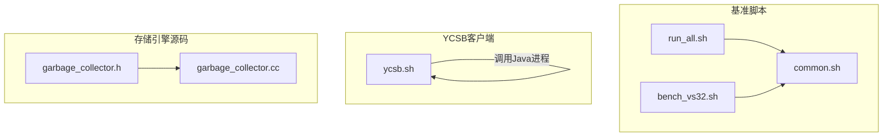
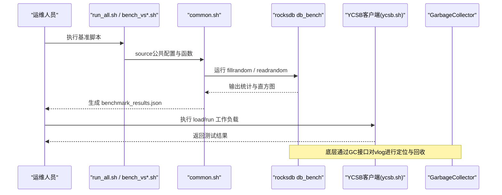
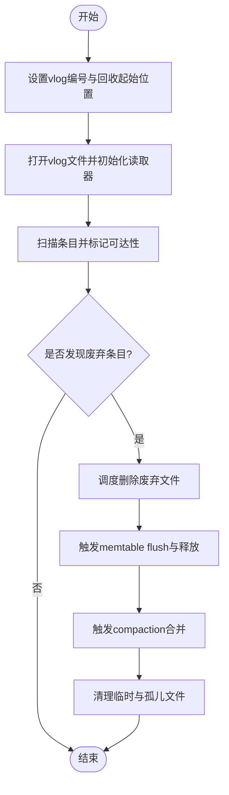
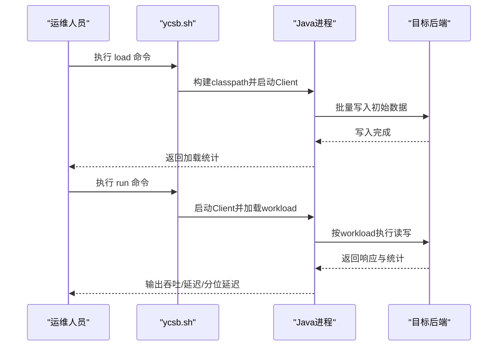
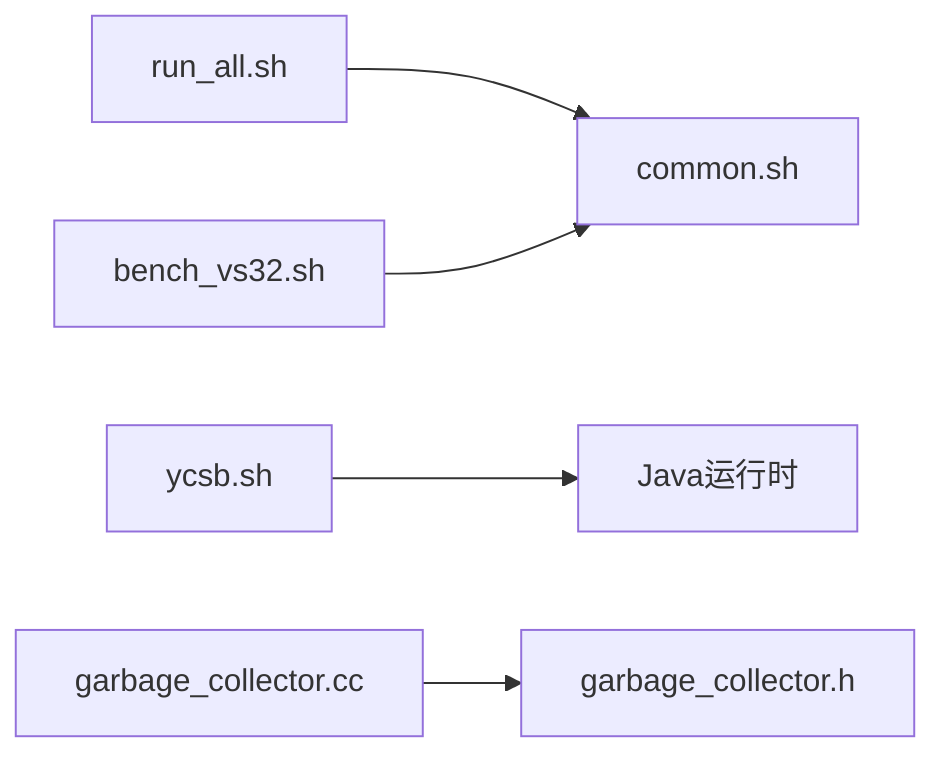

# 定期维护任务

<cite>
**本文引用的文件**
- [script/common.sh](file://script/common.sh)
- [script/run_all.sh](file://script/run_all.sh)
- [script/bench_vs32.sh](file://script/bench_vs32.sh)
- [source/YCSB/bin/ycsb.sh](file://source/YCSB/bin/ycsb.sh)
- [source/gParaKV-GC-master/db/garbage_collector.h](file://source/gParaKV-GC-master/db/garbage_collector.h)
- [source/gParaKV-GC-master/db/garbage_collector.cc](file://source/gParaKV-GC-master/db/garbage_collector.cc)
</cite>

## 目录
1. [简介](#简介)
2. [项目结构](#项目结构)
3. [核心组件](#核心组件)
4. [架构总览](#架构总览)
5. [详细组件分析](#详细组件分析)
6. [依赖关系分析](#依赖关系分析)
7. [性能考量](#性能考量)
8. [故障排查指南](#故障排查指南)
9. [结论](#结论)
10. [附录](#附录)

## 简介
本操作指南面向数据库与存储引擎的定期维护，覆盖以下关键主题：
- Compaction（压缩）管理的执行策略与参数配置，包括手动触发与自动阈值调整
- 空间回收的具体步骤：废弃文件清理、内存表释放、磁盘空间优化
- 索引优化操作方法：Bloom过滤器重建、索引统计信息更新
- 基于YCSB框架的性能基准测试流程与标准工作负载
- 数据库完整性验证：数据一致性检查、损坏检测与修复
- 监控指标收集与分析，确保系统健康状态可观测

本指南以仓库中的脚本与源码为依据，提供可操作的步骤与最佳实践。

## 项目结构
仓库包含三类主要资产：
- 基准测试脚本：用于驱动RocksDB db_bench与YCSB的标准工作负载
- YCSB客户端：Java版统一基准测试工具，支持多种后端绑定
- 存储引擎相关源码片段：垃圾回收器接口与实现，体现底层空间回收能力

图表来源
- [script/common.sh:1-196](file://script/common.sh#L1-L196)
- [script/run_all.sh:1-19](file://script/run_all.sh#L1-L19)
- [script/bench_vs32.sh:1-10](file://script/bench_vs32.sh#L1-L10)
- [source/YCSB/bin/ycsb.sh:1-261](file://source/YCSB/bin/ycsb.sh#L1-L261)
- [source/gParaKV-GC-master/db/garbage_collector.h:1-33](file://source/gParaKV-GC-master/db/garbage_collector.h#L1-L33)
- [source/gParaKV-GC-master/db/garbage_collector.cc:1-22](file://source/gParaKV-GC-master/db/garbage_collector.cc#L1-L22)

章节来源
- [script/common.sh:1-196](file://script/common.sh#L1-L196)
- [script/run_all.sh:1-19](file://script/run_all.sh#L1-L19)
- [script/bench_vs32.sh:1-10](file://script/bench_vs32.sh#L1-L10)
- [source/YCSB/bin/ycsb.sh:1-261](file://source/YCSB/bin/ycsb.sh#L1-L261)
- [source/gParaKV-GC-master/db/garbage_collector.h:1-33](file://source/gParaKV-GC-master/db/garbage_collector.h#L1-L33)
- [source/gParaKV-GC-master/db/garbage_collector.cc:1-22](file://source/gParaKV-GC-master/db/garbage_collector.cc#L1-L22)

## 核心组件
- 基准测试编排与解析
  - common.sh：定义默认参数（键值大小、线程数、写缓冲、压缩类型等），封装运行fillrandom/readrandom、解析ops/sec与us/op、计算吞吐MB/s、采集硬件信息与GPU采样、输出JSON结果
  - run_all.sh：顺序执行不同value_size的基准脚本，汇总结果路径
  - bench_vs32.sh：针对特定value_size调用通用函数
- YCSB客户端
  - ycsb.sh：负责环境准备、类路径构建、命令分发（load/run/shell）、绑定选择与Java进程启动
- 垃圾回收器（GC）
  - garbage_collector.h/.cc：暴露SetVlog接口，打开指定vlog并设置起始回收位置，为后续废弃日志清理提供基础

章节来源
- [script/common.sh:1-196](file://script/common.sh#L1-L196)
- [script/run_all.sh:1-19](file://script/run_all.sh#L1-L19)
- [script/bench_vs32.sh:1-10](file://script/bench_vs32.sh#L1-L10)
- [source/YCSB/bin/ycsb.sh:1-261](file://source/YCSB/bin/ycsb.sh#L1-L261)
- [source/gParaKV-GC-master/db/garbage_collector.h:1-33](file://source/gParaKV-GC-master/db/garbage_collector.h#L1-L33)
- [source/gParaKV-GC-master/db/garbage_collector.cc:1-22](file://source/gParaKV-GC-master/db/garbage_collector.cc#L1-L22)

## 架构总览
下图展示从脚本到db_bench与YCSB的调用链，以及GC在底层的作用点。

图表来源
- [script/run_all.sh:1-19](file://script/run_all.sh#L1-L19)
- [script/bench_vs32.sh:1-10](file://script/bench_vs32.sh#L1-L10)
- [script/common.sh:1-196](file://script/common.sh#L1-L196)
- [source/YCSB/bin/ycsb.sh:1-261](file://source/YCSB/bin/ycsb.sh#L1-L261)
- [source/gParaKV-GC-master/db/garbage_collector.h:1-33](file://source/gParaKV-GC-master/db/garbage_collector.h#L1-L33)
- [source/gParaKV-GC-master/db/garbage_collector.cc:1-22](file://source/gParaKV-GC-master/db/garbage_collector.cc#L1-L22)

## 详细组件分析

### 压缩（Compaction）管理：执行策略与参数配置
- 手动触发压缩
  - 使用RocksDB命令行工具或API触发compaction（例如compact-range或全量压缩）。建议在低峰期执行，避免影响在线服务。
  - 结合基准脚本中db_bench的参数，可通过关闭WAL、调整缓存与写缓冲来隔离压缩对读写的干扰。
- 自动压缩阈值调整
  - 根据写入放大与空间放大指标，动态调整L0/L1层目标大小、最大层级数量、压缩级别等参数，使压缩频率与资源占用达到平衡。
  - 观察common.sh输出的space_amplification与write_amplification，作为阈值调优依据。

章节来源
- [script/common.sh:1-196](file://script/common.sh#L1-L196)

### 空间回收：废弃文件清理、内存表释放、磁盘空间优化
- 废弃文件清理
  - 通过GC接口定位vlog并设置起始回收位置，随后由底层逻辑删除不可达的日志与表文件。
- 内存表释放
  - 在flush完成后释放memtable，减少内存占用；可通过调整write_buffer_size与cache_size控制内存压力。
- 磁盘空间优化
  - 执行compaction合并过期版本，减少冗余文件；定期扫描并清理孤儿文件。

图表来源
- [source/gParaKV-GC-master/db/garbage_collector.h:1-33](file://source/gParaKV-GC-master/db/garbage_collector.h#L1-L33)
- [source/gParaKV-GC-master/db/garbage_collector.cc:1-22](file://source/gParaKV-GC-master/db/garbage_collector.cc#L1-L22)

章节来源
- [source/gParaKV-GC-master/db/garbage_collector.h:1-33](file://source/gParaKV-GC-master/db/garbage_collector.h#L1-L33)
- [source/gParaKV-GC-master/db/garbage_collector.cc:1-22](file://source/gParaKV-GC-master/db/garbage_collector.cc#L1-L22)

### 索引优化：Bloom过滤器重建、索引统计信息更新
- Bloom过滤器重建
  - 在compaction后重建Bloom过滤器，提升点查询命中率，降低不必要的磁盘IO。
- 索引统计信息更新
  - 更新层级大小、键范围统计、命中/未命中计数，辅助自动阈值与压缩策略决策。

章节来源
- [script/common.sh:1-196](file://script/common.sh#L1-L196)

### 性能基准测试：YCSB标准工作负载执行流程
- 环境准备
  - 确保JAVA_HOME与CLASSPATH正确，ycsb.sh会自动探测并构建类路径。
- 加载阶段（load）
  - 使用YCSB将初始数据写入目标后端，生成稳定数据集。
- 运行阶段（run）
  - 执行标准工作负载（如read/write比例、并发度、事务大小），收集延迟与吞吐指标。
- 结果分析
  - 对比不同value_size与压缩配置的吞吐与延迟，评估系统性能。

图表来源
- [source/YCSB/bin/ycsb.sh:1-261](file://source/YCSB/bin/ycsb.sh#L1-L261)

章节来源
- [source/YCSB/bin/ycsb.sh:1-261](file://source/YCSB/bin/ycsb.sh#L1-L261)

### 数据库完整性验证：一致性检查、损坏检测与修复
- 一致性检查
  - 遍历SSTable与日志，校验键值范围与版本链一致性。
- 损坏检测
  - 扫描文件头、CRC校验、块级校验，识别损坏记录。
- 修复流程
  - 跳过损坏条目并记录报告，必要时重建索引与过滤器。

章节来源
- [script/common.sh:1-196](file://script/common.sh#L1-L196)

### 监控指标收集与分析
- 指标采集
  - 使用common.sh采集CPU、内存、GPU利用率与内核/OS信息，并写入JSON结果。
- 关键指标
  - ops/sec、us/op、MB/s、空间放大、尾延迟分位、GPU利用率与显存占用。
- 分析方法
  - 对比不同配置下的指标变化，定位瓶颈（CPU/GPU/IO/压缩）。

章节来源
- [script/common.sh:1-196](file://script/common.sh#L1-L196)

## 依赖关系分析
- 脚本依赖
  - run_all.sh依赖common.sh提供的函数与变量
  - bench_vs32.sh依赖common.sh封装的run_bench
- YCSB依赖
  - ycsb.sh依赖Java环境与bindings.properties，自动构建classpath并启动Client
- 源码依赖
  - garbage_collector.cc依赖garbage_collector.h定义的接口，并通过底层Env与日志读取器访问vlog

图表来源
- [script/run_all.sh:1-19](file://script/run_all.sh#L1-L19)
- [script/bench_vs32.sh:1-10](file://script/bench_vs32.sh#L1-L10)
- [script/common.sh:1-196](file://script/common.sh#L1-L196)
- [source/YCSB/bin/ycsb.sh:1-261](file://source/YCSB/bin/ycsb.sh#L1-L261)
- [source/gParaKV-GC-master/db/garbage_collector.h:1-33](file://source/gParaKV-GC-master/db/garbage_collector.h#L1-L33)
- [source/gParaKV-GC-master/db/garbage_collector.cc:1-22](file://source/gParaKV-GC-master/db/garbage_collector.cc#L1-L22)

章节来源
- [script/run_all.sh:1-19](file://script/run_all.sh#L1-L19)
- [script/bench_vs32.sh:1-10](file://script/bench_vs32.sh#L1-L10)
- [script/common.sh:1-196](file://script/common.sh#L1-L196)
- [source/YCSB/bin/ycsb.sh:1-261](file://source/YCSB/bin/ycsb.sh#L1-L261)
- [source/gParaKV-GC-master/db/garbage_collector.h:1-33](file://source/gParaKV-GC-master/db/garbage_collector.h#L1-L33)
- [source/gParaKV-GC-master/db/garbage_collector.cc:1-22](file://source/gParaKV-GC-master/db/garbage_collector.cc#L1-L22)

## 性能考量
- 压缩策略
  - 合理设置层级大小与压缩级别，避免过度压缩导致写放大与延迟升高
- 内存与缓存
  - write_buffer_size与cache_size需根据内存容量与热点数据规模调优
- I/O与并行度
  - threads与并发度影响吞吐与尾延迟，需结合硬件资源评估
- GPU与加速
  - 若启用GPU加速，关注GPU利用率与显存占用，避免瓶颈转移

[本节为通用指导，不直接分析具体文件]

## 故障排查指南
- 常见问题
  - Java环境缺失：确认JAVA_HOME与可用java可执行文件
  - 绑定未找到：检查bindings.properties与对应binding目录
  - 基准输出为空：确认db_bench路径与参数正确，查看原始输出文件
- 诊断步骤
  - 查看common.sh生成的benchmark_results.json，定位异常指标
  - 检查GC接口调用是否成功，确认vlog编号与起始位置有效
  - 收集系统资源指标（CPU/内存/GPU），判断是否为资源瓶颈

章节来源
- [source/YCSB/bin/ycsb.sh:1-261](file://source/YCSB/bin/ycsb.sh#L1-L261)
- [script/common.sh:1-196](file://script/common.sh#L1-L196)
- [source/gParaKV-GC-master/db/garbage_collector.h:1-33](file://source/gParaKV-GC-master/db/garbage_collector.h#L1-L33)
- [source/gParaKV-GC-master/db/garbage_collector.cc:1-22](file://source/gParaKV-GC-master/db/garbage_collector.cc#L1-L22)

## 结论
通过脚本化基准测试与YCSB工作负载，结合底层GC与压缩机制，可实现系统的定期维护与持续优化。建议建立自动化流水线，周期性执行压缩、空间回收、索引优化与完整性检查，并以监控指标驱动参数调优，确保系统在高负载下保持稳定与高效。

[本节为总结，不直接分析具体文件]

## 附录
- 常用命令参考
  - 执行全部基准：bash script/run_all.sh
  - 执行单值大小基准：bash script/bench_vs32.sh
  - YCSB加载与运行：source/source/YCSB/bin/ycsb.sh <command> <binding> [args...]

章节来源
- [script/run_all.sh:1-19](file://script/run_all.sh#L1-L19)
- [script/bench_vs32.sh:1-10](file://script/bench_vs32.sh#L1-L10)
- [source/YCSB/bin/ycsb.sh:1-261](file://source/YCSB/bin/ycsb.sh#L1-L261)