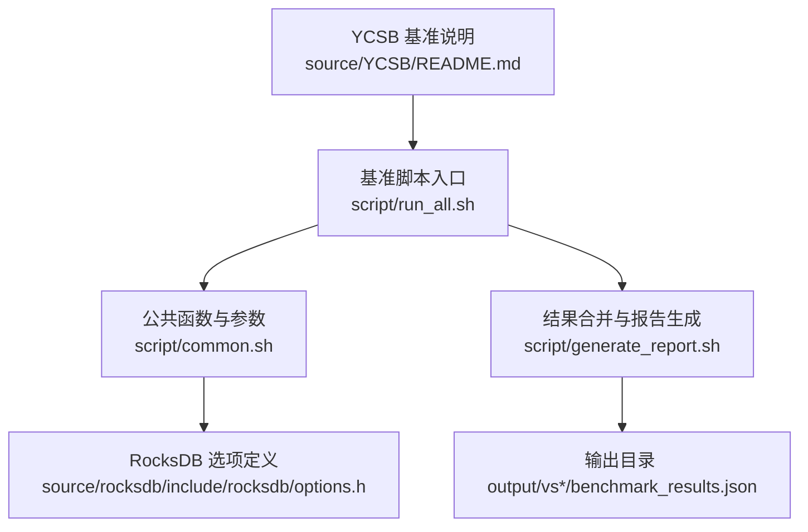
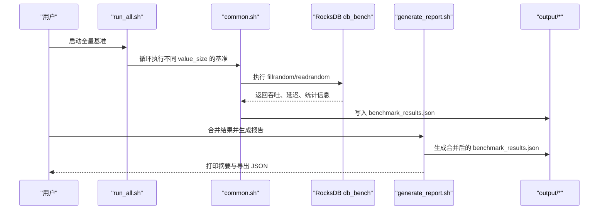
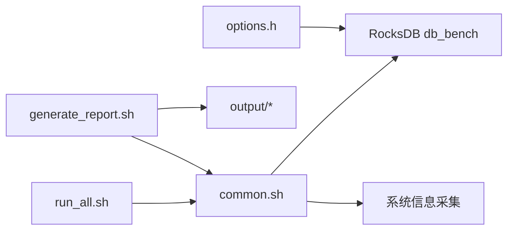

# 容量规划和扩容

<cite>
**本文引用的文件**   
- [YCSB/README.md](file://source/YCSB/README.md)
- [common.sh](file://script/common.sh)
- [run_all.sh](file://script/run_all.sh)
- [generate_report.sh](file://script/generate_report.sh)
- [options.h](file://source/rocksdb/include/rocksdb/options.h)
</cite>

## 目录
1. [简介](#简介)
2. [项目结构](#项目结构)
3. [核心组件](#核心组件)
4. [架构总览](#架构总览)
5. [详细组件分析](#详细组件分析)
6. [依赖关系分析](#依赖关系分析)
7. [性能考虑](#性能考虑)
8. [故障排查指南](#故障排查指南)
9. [结论](#结论)
10. [附录](#附录)

## 简介
本指导面向存储系统的容量规划与扩容实践，结合仓库中的基准测试脚本与 RocksDB 选项定义，提供数据增长预测、存储空间估算、I/O 性能需求分析方法；给出水平扩容（节点添加、分片重平衡、负载均衡配置）与垂直扩容（内存/CPU/存储介质升级）的操作步骤；总结基于实际工作负载的性能调优最佳实践；建立容量监控与预警机制及扩容触发条件；并给出灾难恢复与业务连续性保障方案，确保扩容过程中的服务可用性。

## 项目结构
仓库包含 YCSB 基准框架、RocksDB 源码与选项头文件，以及用于多值大小基准测试的脚本集。这些脚本通过 RocksDB 的 db_bench 工具执行 fillrandom/readrandom 等基准，输出吞吐、延迟、空间放大率等指标，并汇总为 JSON 报告，便于容量评估与趋势分析。

**图表来源**
- [YCSB/README.md:1-135](file://source/YCSB/README.md#L1-L135)
- [run_all.sh:1-19](file://script/run_all.sh#L1-L19)
- [common.sh:1-196](file://script/common.sh#L1-L196)
- [generate_report.sh:1-59](file://script/generate_report.sh#L1-L59)
- [options.h:1-200](file://source/rocksdb/include/rocksdb/options.h#L1-L200)

**章节来源**
- [YCSB/README.md:1-135](file://source/YCSB/README.md#L1-L135)
- [run_all.sh:1-19](file://script/run_all.sh#L1-L19)
- [common.sh:1-196](file://script/common.sh#L1-L196)
- [generate_report.sh:1-59](file://script/generate_report.sh#L1-L59)
- [options.h:1-200](file://source/rocksdb/include/rocksdb/options.h#L1-L200)

## 核心组件
- 基准执行与数据采集：通过脚本调用 RocksDB 的 db_bench，执行填充与读取基准，采集吞吐、延迟、空间放大率等关键指标。
- 硬件与环境信息收集：自动采集 CPU、内存、GPU、内核与操作系统信息，作为容量规划的基线参考。
- 结果聚合与报告：将不同值大小的测试结果合并为统一 JSON，便于趋势分析与可视化。
- 引擎选项：RocksDB 的 ColumnFamilyOptions 定义了影响吞吐、延迟、空间放大率的关键参数，如 write_buffer_size、压缩类型、缓存大小等。

**章节来源**
- [common.sh:1-196](file://script/common.sh#L1-L196)
- [generate_report.sh:1-59](file://script/generate_report.sh#L1-L59)
- [options.h:1-200](file://source/rocksdb/include/rocksdb/options.h#L1-L200)

## 架构总览
下图展示了从基准执行到报告生成的端到端流程，以及各组件之间的依赖关系。该流程可用于容量评估与扩容决策的数据支撑。

**图表来源**
- [run_all.sh:1-19](file://script/run_all.sh#L1-L19)
- [common.sh:1-196](file://script/common.sh#L1-L196)
- [generate_report.sh:1-59](file://script/generate_report.sh#L1-L59)

## 详细组件分析

### 容量规划方法
- 数据增长预测
  - 使用历史吞吐与延迟趋势拟合线性或指数增长模型，结合业务增长率（日增记录数、平均键值大小）预测未来 N 个月的存储需求。
  - 利用基准输出的 MB/s、ops/sec、us/op 与 space_amplification 指标，推算单位时间内的物理存储增量。
- 存储空间估算
  - 逻辑数据量 = 记录数 × (key_size + value_size)。
  - 物理存储量 ≈ 逻辑数据量 × space_amplification（由脚本计算）。
  - 预留冗余：建议预留 20%-30% 余量以应对碎片、元数据与后台任务开销。
- I/O 性能需求分析
  - 根据目标吞吐（MB/s）与延迟（us/op）反推所需磁盘带宽与并发度。
  - 结合线程数、write_buffer_size、cache_size 等参数进行压测，验证是否满足 SLA。

**章节来源**
- [common.sh:34-39](file://script/common.sh#L34-L39)
- [common.sh:118-125](file://script/common.sh#L118-L125)
- [generate_report.sh:45-54](file://script/generate_report.sh#L45-L54)

### 水平扩容操作步骤
- 节点添加
  - 准备新节点：安装相同版本的 RocksDB 与依赖库，校验 CPU/内存/GPU/OS 一致性。
  - 初始化数据库实例：按现有集群配置创建 ColumnFamily 与路径，确保 key 比较器与版本兼容。
- 数据分片重平衡
  - 依据键空间划分策略（哈希/范围）将部分分片迁移到新节点。
  - 在迁移过程中保持读写可用，启用只读模式与限流，避免写放大峰值。
- 负载均衡配置
  - 调整客户端路由策略，使请求均匀分布至各节点。
  - 监控各节点吞吐与延迟，动态调整权重或分片边界。

[本节为概念性指导，不直接分析具体代码文件]

### 垂直扩容指导
- 内存扩展
  - 增大 write_buffer_size 与 cache_size，提升吞吐并降低随机读延迟。
  - 注意内存预算与 OOM 风险，结合系统内存与进程限制设置上限。
- CPU 资源调整
  - 增加线程数以提升并行度，但需评估锁竞争与调度开销。
  - 针对热点路径优化编译选项与 NUMA 绑定。
- 存储介质升级
  - 从 HDD 升级到 SSD/NVMe，显著改善随机读写与压缩吞吐。
  - 关注 IOPS、顺序吞吐与延迟曲线变化，重新校准参数。

**章节来源**
- [options.h:174-200](file://source/rocksdb/include/rocksdb/options.h#L174-L200)

### 性能调优最佳实践
- 基于工作负载特征选择压缩算法与 compaction 风格。
- 合理设置 write_buffer_size、max_write_buffer_number、cache_size，平衡内存与吞吐。
- 开启统计与直方图，定位尾延迟与瓶颈点。
- 控制 WAL 与 flush 频率，减少写放大与抖动。

**章节来源**
- [options.h:174-200](file://source/rocksdb/include/rocksdb/options.h#L174-L200)
- [common.sh:86-101](file://script/common.sh#L86-L101)
- [common.sh:129-143](file://script/common.sh#L129-L143)

### 容量监控与预警机制
- 监控指标
  - 吞吐（MB/s、ops/sec）、延迟（us/op、P99/P999）、空间放大率、WAL 大小、Compaction 队列长度。
- 预警阈值
  - 当空间使用率超过 80%、吞吐下降超过 20%、延迟 P99 超过 SLA 时触发预警。
- 自动化扩容
  - 基于阈值触发水平扩容流程（新增节点、迁移分片、更新负载均衡）。

**章节来源**
- [common.sh:157-189](file://script/common.sh#L157-L189)
- [generate_report.sh:45-54](file://script/generate_report.sh#L45-L54)

### 灾难恢复与业务连续性保障
- 备份策略
  - 定期快照与增量备份，保留多版本以便回滚。
- 故障切换
  - 主备或多副本架构下，快速切换流量至健康节点。
- 扩容过程可用性
  - 分阶段迁移与灰度发布，保证读写不中断。
  - 预演练与回滚预案，确保失败可逆。

[本节为概念性指导，不直接分析具体代码文件]

## 依赖关系分析
基准脚本依赖 RocksDB 的 db_bench 工具与系统环境（CPU/内存/GPU），并通过 JSON 输出供报告脚本聚合。RocksDB 的选项头文件定义了影响性能与容量的关键参数。

**图表来源**
- [run_all.sh:1-19](file://script/run_all.sh#L1-L19)
- [common.sh:1-196](file://script/common.sh#L1-L196)
- [generate_report.sh:1-59](file://script/generate_report.sh#L1-L59)
- [options.h:1-200](file://source/rocksdb/include/rocksdb/options.h#L1-L200)

**章节来源**
- [run_all.sh:1-19](file://script/run_all.sh#L1-L19)
- [common.sh:1-196](file://script/common.sh#L1-L196)
- [generate_report.sh:1-59](file://script/generate_report.sh#L1-L59)
- [options.h:1-200](file://source/rocksdb/include/rocksdb/options.h#L1-L200)

## 性能考虑
- 吞吐与延迟权衡：增大缓冲区与缓存可提升吞吐，但可能增加延迟与内存占用。
- 压缩与空间放大：压缩降低存储占用，但增加 CPU 开销；空间放大率反映物理与逻辑存储比例。
- 并发与锁竞争：线程数增加带来并行优势，但也可能引发锁竞争与上下文切换开销。
- I/O 子系统：磁盘类型、RAID 配置与文件系统对随机读写影响显著。

[本节为通用性能讨论，不直接分析具体文件]

## 故障排查指南
- 基准无输出或解析失败
  - 检查 db_bench 路径与权限，确认输出格式一致。
  - 核对 parse_ops_per_sec 与 parse_us_per_op 的正则匹配。
- 空间放大率异常
  - 检查压缩配置与 compaction 策略，确认未出现过度碎片。
- GPU 采样为空
  - 确认 nvidia-smi 可用且驱动正常，必要时禁用 GPU 相关采样。

**章节来源**
- [common.sh:16-32](file://script/common.sh#L16-L32)
- [common.sh:41-66](file://script/common.sh#L41-L66)
- [common.sh:118-125](file://script/common.sh#L118-L125)

## 结论
通过仓库中的基准脚本与 RocksDB 选项定义，可以系统化地进行容量规划与扩容操作。结合吞吐、延迟、空间放大率等指标，制定数据增长预测与存储估算模型；依据工作负载特征调优参数；建立监控与预警机制，实现自动化扩容；并通过备份与故障切换保障业务连续性。建议在每次扩容前进行压测与演练，确保变更可控与回滚可行。

[本节为总结性内容，不直接分析具体文件]

## 附录
- 常用命令与路径
  - 运行全量基准：bash script/run_all.sh
  - 生成报告：bash script/generate_report.sh
  - 结果位置：output/vs*/benchmark_results.json
- 关键参数参考
  - write_buffer_size、cache_size、compression_type、threads、seed 等

**章节来源**
- [run_all.sh:1-19](file://script/run_all.sh#L1-L19)
- [generate_report.sh:1-59](file://script/generate_report.sh#L1-L59)
- [common.sh:1-196](file://script/common.sh#L1-L196)