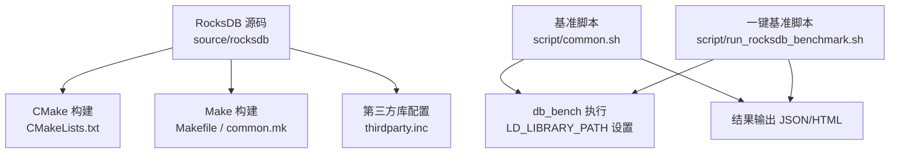
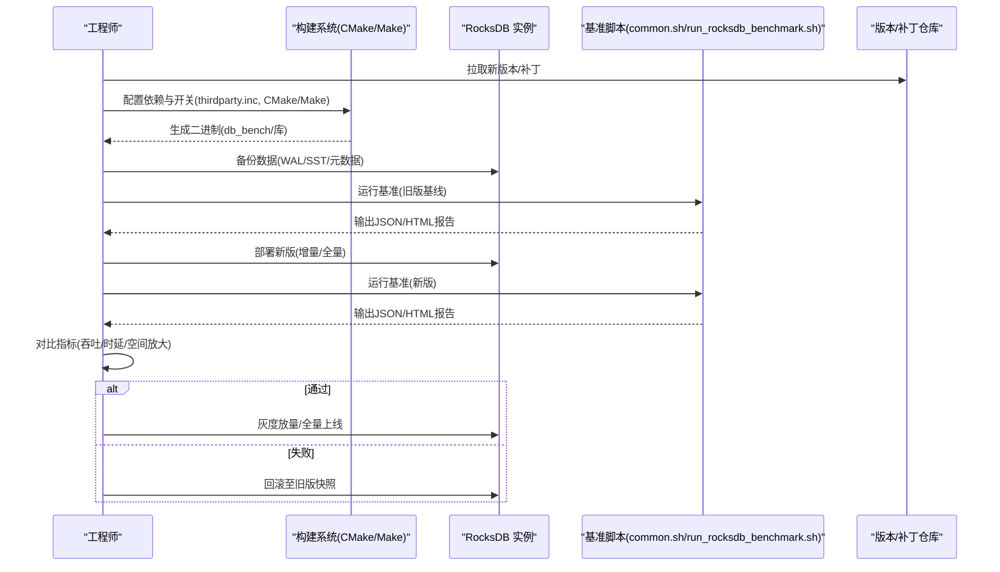
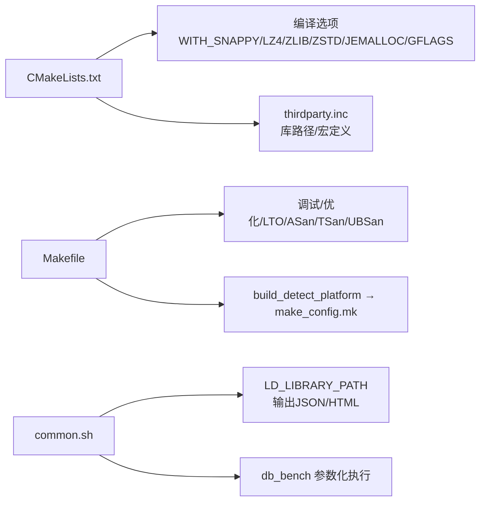

# 版本升级和补丁管理

<cite>
**本文引用的文件**   
- [CMakeLists.txt](file://source/rocksdb/CMakeLists.txt)
- [Makefile](file://source/rocksdb/Makefile)
- [common.mk](file://source/rocksdb/common.mk)
- [thirdparty.inc](file://source/rocksdb/thirdparty.inc)
- [common.sh](file://script/common.sh)
- [run_rocksdb_benchmark.sh](file://script/run_rocksdb_benchmark.sh)
</cite>

## 目录
1. [简介](#简介)
2. [项目结构](#项目结构)
3. [核心组件](#核心组件)
4. [架构总览](#架构总览)
5. [详细组件分析](#详细组件分析)
6. [依赖关系分析](#依赖关系分析)
7. [性能考虑](#性能考虑)
8. [故障排查指南](#故障排查指南)
9. [结论](#结论)
10. [附录](#附录)

## 简介
本操作手册面向 RocksDB 及其周边工具链的版本升级与补丁管理，覆盖以下关键主题：
- 升级前准备：依赖库兼容性检查、构建系统配置迁移（CMake/Make）、第三方库路径与开关。
- 升级策略：增量升级与全量升级的适用场景、数据备份与恢复流程。
- 补丁应用：安全补丁与性能补丁的评估、灰度发布与回滚策略。
- 验证测试：功能回归、性能基线对比、GPU/压缩等特性验证。
- 第三方库更新：CUDA、Snappy/LZ4/Zlib/Zstd 等压缩库的版本管理与约束。

本手册基于仓库中的构建脚本与基准测试脚本，确保步骤可落地、可复现。

## 项目结构
仓库包含多个 RocksDB 分支/变体以及配套的基准测试脚本。与版本升级相关的关键位置如下：
- source/rocksdb：RocksDB 源码与构建入口（CMakeLists.txt、Makefile、common.mk、thirdparty.inc）。
- script：基准测试与报告生成脚本，用于升级前后性能对比与结果归档。

图表来源
- [CMakeLists.txt:35-110](file://source/rocksdb/CMakeLists.txt#L35-L110)
- [Makefile:1-120](file://source/rocksdb/Makefile#L1-L120)
- [common.mk:1-31](file://source/rocksdb/common.mk#L1-L31)
- [thirdparty.inc:1-200](file://source/rocksdb/thirdparty.inc#L1-L200)
- [common.sh:1-60](file://script/common.sh#L1-L60)
- [run_rocksdb_benchmark.sh:1-30](file://script/run_rocksdb_benchmark.sh#L1-L30)

章节来源
- [CMakeLists.txt:35-110](file://source/rocksdb/CMakeLists.txt#L35-L110)
- [Makefile:1-120](file://source/rocksdb/Makefile#L1-L120)
- [common.mk:1-31](file://source/rocksdb/common.mk#L1-L31)
- [thirdparty.inc:1-200](file://source/rocksdb/thirdparty.inc#L1-L200)
- [common.sh:1-60](file://script/common.sh#L1-L60)
- [run_rocksdb_benchmark.sh:1-30](file://script/run_rocksdb_benchmark.sh#L1-L30)

## 核心组件
- 构建系统与编译选项
  - CMake 入口负责启用/禁用压缩库、内存分配器、JNI、协程等特性，并处理平台差异。
  - Makefile 提供传统构建流程，支持调试级别、静态/动态库模式、LTO、ASan/TSan/UBSan 等。
- 第三方库集成
  - thirdparty.inc 集中定义 GFlags、Snappy、LZ4、Zlib、Zstd、XPress 等库的路径与开关。
- 基准测试与报告
  - common.sh 封装 db_bench 调用参数、解析输出、计算吞吐与时延、采集硬件信息并输出 JSON。
  - run_rocksdb_benchmark.sh 统一入口，驱动 Python 脚本生成 HTML 报告。

章节来源
- [CMakeLists.txt:96-200](file://source/rocksdb/CMakeLists.txt#L96-L200)
- [Makefile:44-120](file://source/rocksdb/Makefile#L44-L120)
- [thirdparty.inc:15-200](file://source/rocksdb/thirdparty.inc#L15-L200)
- [common.sh:16-66](file://script/common.sh#L16-L66)
- [run_rocksdb_benchmark.sh:1-30](file://script/run_rocksdb_benchmark.sh#L1-L30)

## 架构总览
升级与补丁管理的端到端流程如下：

图表来源
- [CMakeLists.txt:35-110](file://source/rocksdb/CMakeLists.txt#L35-L110)
- [Makefile:44-120](file://source/rocksdb/Makefile#L44-L120)
- [thirdparty.inc:15-200](file://source/rocksdb/thirdparty.inc#L15-L200)
- [common.sh:68-196](file://script/common.sh#L68-L196)
- [run_rocksdb_benchmark.sh:1-30](file://script/run_rocksdb_benchmark.sh#L1-L30)

## 详细组件分析

### 构建系统与编译选项（CMake/Make）
- CMake 关键点
  - 指定 C++ 标准、默认构建类型、可选特性开关（WITH_SNAPPY/LZ4/ZLIB/ZSTD/JEMALLOC/GFLAGS 等）。
  - Windows 与 Linux 差异化处理，包含第三方库发现逻辑。
- Make 关键点
  - 调试级别(DEBUG_LEVEL)、库模式(LIB_MODE)、优化选项(OPTIMIZE_LEVEL)、LTO、编译器检测。
  - 通过 build_detect_platform 生成 make_config.mk，再 include 以完成平台适配。

建议
- 升级前记录当前构建参数（特别是 WITH_* 开关、DEBUG_LEVEL、LIB_MODE），便于在新版本中保持一致性。
- 若引入新压缩库或内存分配器，优先在测试环境验证后再进入生产。

章节来源
- [CMakeLists.txt:96-200](file://source/rocksdb/CMakeLists.txt#L96-L200)
- [Makefile:44-120](file://source/rocksdb/Makefile#L44-L120)
- [common.mk:1-31](file://source/rocksdb/common.mk#L1-L31)

### 第三方库与依赖管理（thirdparty.inc）
- 支持的库：GFlags、Snappy、LZ4、Zlib、Zstd、XPress（Windows）。
- 路径与环境变量：THIRDPARTY_HOME、各库 INCLUDE/LIB_DEBUG/LIB_RELEASE 环境变量覆盖。
- 开关控制：WITH_GFLAGS/WITH_SNAPPY/WITH_LZ4/WITH_ZLIB/WITH_ZSTD 等。

建议
- 使用 THIRDPARTY_HOME 统一管理第三方库版本，避免硬编码路径。
- 升级压缩库时，需同步确认 RocksDB 编译宏与运行时 ABI 兼容。

章节来源
- [thirdparty.inc:15-200](file://source/rocksdb/thirdparty.inc#L15-L200)

### 基准测试与结果采集（common.sh）
- 参数化：键值大小、线程数、写缓冲、压缩类型、种子、WAL 开关、缓存大小等。
- 指标解析：ops/sec、us/op、MB/s、空间放大率、GPU 利用率与显存占用。
- 输出：JSON 结构化结果，便于自动化对比与报告生成。

建议
- 固定 KEY_SIZE、NUM_OPS、SEED、THREADS 等参数，保证可比性。
- 在升级前后分别运行相同 workload，比较吞吐与时延变化。

章节来源
- [common.sh:1-66](file://script/common.sh#L1-L66)
- [common.sh:68-196](file://script/common.sh#L68-L196)

### 一键基准脚本（run_rocksdb_benchmark.sh）
- 统一入口：设置 LD_LIBRARY_PATH、调用 Python 脚本执行 db_bench、生成 HTML 报告。
- 输出：benchmark_results.json 与 report.html，便于评审与归档。

建议
- 将脚本纳入 CI，每次提交触发基准对比，自动告警性能退化。

章节来源
- [run_rocksdb_benchmark.sh:1-30](file://script/run_rocksdb_benchmark.sh#L1-L30)

### 增量升级与全量升级策略
- 增量升级
  - 适用：小版本/补丁升级，保持数据格式兼容。
  - 步骤：停止写入→备份 WAL/SST→替换二进制→启动→观察 compaction/IO 指标→逐步放量。
- 全量升级
  - 适用：跨大版本或数据格式变更。
  - 步骤：停机→全量备份→清理或迁移数据→部署新版→冷启动校验→灰度→全量切换。

注意
- 升级前务必核对 RocksDB 版本历史与兼容性矩阵（如 SST 文件格式、WAL 格式、选项变更）。
- 对 GPU/压缩等新特性，先在隔离环境验证。

[本节为通用策略说明，不直接分析具体文件]

### 数据备份与恢复流程
- 备份范围
  - 数据文件：SST、MANIFEST、CURRENT、OPTIONS、LOCK。
  - 日志：WAL 文件。
  - 元数据：配置文件、构建产物清单。
- 备份方式
  - 在线：使用 RocksDB 提供的快照/导出工具（如有），或文件系统快照。
  - 离线：停机后打包目录，校验完整性。
- 恢复步骤
  - 停服务→恢复备份→校验 MANIFEST/OPTIONS→启动→一致性检查→业务验证。

[本节为通用流程说明，不直接分析具体文件]

### 补丁应用（安全/性能）
- 安全补丁
  - 优先级高，影响面小；建议在维护窗口内快速回滚验证。
  - 重点验证：权限、输入校验、加密/签名、崩溃恢复。
- 性能补丁
  - 通过基准脚本对比吞吐/时延/空间放大；必要时调整编译选项（如 LTO、压缩库）。
- 灰度与回滚
  - 先灰度少量节点，监控错误率与延迟 P99/P999；异常立即回滚。

[本节为通用流程说明，不直接分析具体文件]

### 升级后验证测试
- 功能测试
  - 读写一致性、事务/快照、压缩/解压、WAL 恢复、Compaction 行为。
- 性能回归
  - 固定 workload，对比 ops/sec、us/op、MB/s、空间放大率、CPU/GPU 占用。
- GPU/压缩特性
  - 开启 Snappy/LZ4/Zstd 等，验证吞吐下降与 CPU 占用变化。
  - 若有 GPU 路径，验证显存占用与利用率是否合理。

章节来源
- [common.sh:68-196](file://script/common.sh#L68-L196)
- [run_rocksdb_benchmark.sh:1-30](file://script/run_rocksdb_benchmark.sh#L1-L30)

### 第三方库更新指导（CUDA、压缩库）
- CUDA
  - 确认驱动与 CUDA Toolkit 版本匹配；重新编译 GPU 相关模块；验证内核加载与显存分配。
- 压缩库
  - 升级 Snappy/LZ4/Zlib/Zstd 时，需同步更新 thirdparty.inc 路径与编译宏；验证压缩比与速度。
- 内存分配器
  - 切换 Jemalloc 时需验证内存布局与泄漏情况；对比 GC 压力与峰值内存。

章节来源
- [thirdparty.inc:15-200](file://source/rocksdb/thirdparty.inc#L15-L200)
- [CMakeLists.txt:96-200](file://source/rocksdb/CMakeLists.txt#L96-L200)

## 依赖关系分析
构建期依赖与开关关系如下：

图表来源
- [CMakeLists.txt:96-200](file://source/rocksdb/CMakeLists.txt#L96-L200)
- [thirdparty.inc:15-200](file://source/rocksdb/thirdparty.inc#L15-L200)
- [Makefile:44-120](file://source/rocksdb/Makefile#L44-L120)
- [common.mk:1-31](file://source/rocksdb/common.mk#L1-L31)
- [common.sh:1-60](file://script/common.sh#L1-L60)

章节来源
- [CMakeLists.txt:96-200](file://source/rocksdb/CMakeLists.txt#L96-L200)
- [thirdparty.inc:15-200](file://source/rocksdb/thirdparty.inc#L15-L200)
- [Makefile:44-120](file://source/rocksdb/Makefile#L44-L120)
- [common.mk:1-31](file://source/rocksdb/common.mk#L1-L31)
- [common.sh:1-60](file://script/common.sh#L1-L60)

## 性能考虑
- 构建优化
  - Release 模式关闭断言与调试代码；启用 LTO 提升内联与跨单元优化。
  - 根据目标平台选择合适优化等级与编译器标志。
- 运行时调优
  - 调整 write_buffer_size、cache_size、压缩算法、线程数，结合 workload 特征。
  - 关注 Compaction 引发的 IO 尖峰与 CPU 占用。
- 基准对比
  - 固定参数集，多次运行取稳定值；对比吞吐、时延、空间放大率。

章节来源
- [Makefile:112-196](file://source/rocksdb/Makefile#L112-L196)
- [common.sh:68-196](file://script/common.sh#L68-L196)

## 故障排查指南
- 构建失败
  - 检查第三方库路径与宏定义是否正确；确认编译器与 C++ 标准满足要求。
  - 查看 CMake/Make 输出日志，定位缺失头文件或链接错误。
- 运行时崩溃
  - 启用 ASan/TSan/UBSan 定位内存与并发问题；收集 core dump 与日志。
  - 检查 WAL/SST 一致性与磁盘空间。
- 性能退化
  - 对比新旧版本基准报告；检查压缩库、内存分配器、线程数、缓存大小。
  - 关注 Compaction 频率与 IO 瓶颈。

章节来源
- [Makefile:147-196](file://source/rocksdb/Makefile#L147-L196)
- [common.sh:16-66](file://script/common.sh#L16-L66)

## 结论
通过统一的构建系统（CMake/Make）、集中的第三方库配置（thirdparty.inc）与标准化的基准脚本（common.sh/run_rocksdb_benchmark.sh），可实现 RocksDB 版本升级与补丁管理的可控、可测、可回滚。建议将升级流程纳入 CI/CD，结合自动化基准与告警机制，降低风险并提高交付效率。

## 附录
- 常用命令参考
  - CMake 构建：按 CMakeLists.txt 注释示例配置 WITH_* 开关。
  - Make 构建：设置 DEBUG_LEVEL、LIB_MODE、USE_LTO 等变量。
  - 基准运行：执行 run_rocksdb_benchmark.sh 生成 JSON/HTML 报告。
- 回滚要点
  - 保留旧版二进制与数据快照；回滚时优先恢复数据，再切换二进制。
- 合规与安全
  - 安全补丁优先评估与发布；对外部依赖进行漏洞扫描与版本锁定。

[本节为补充说明，不直接分析具体文件]