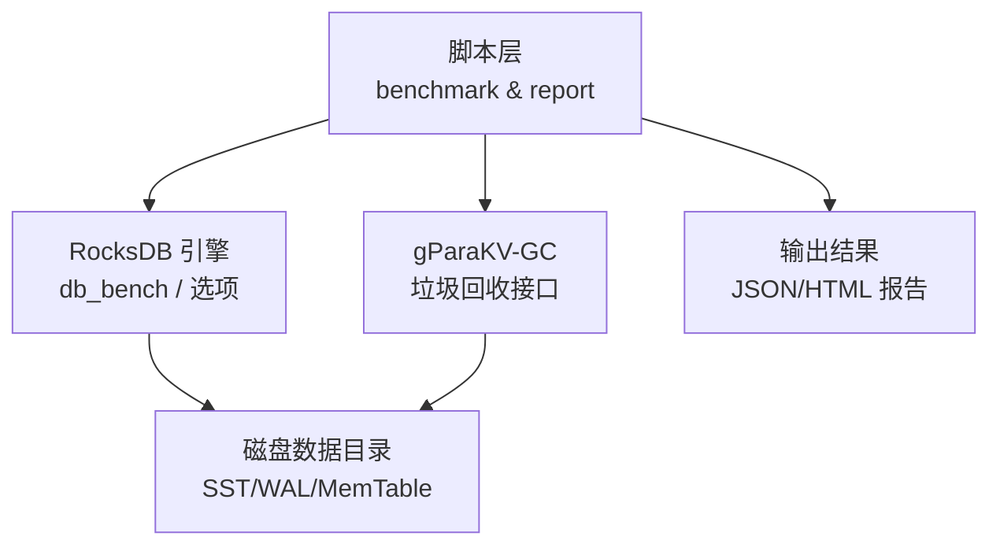
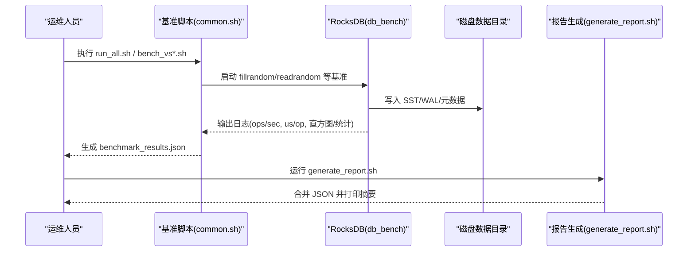
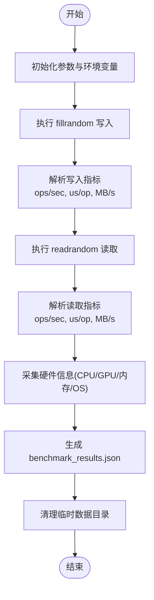
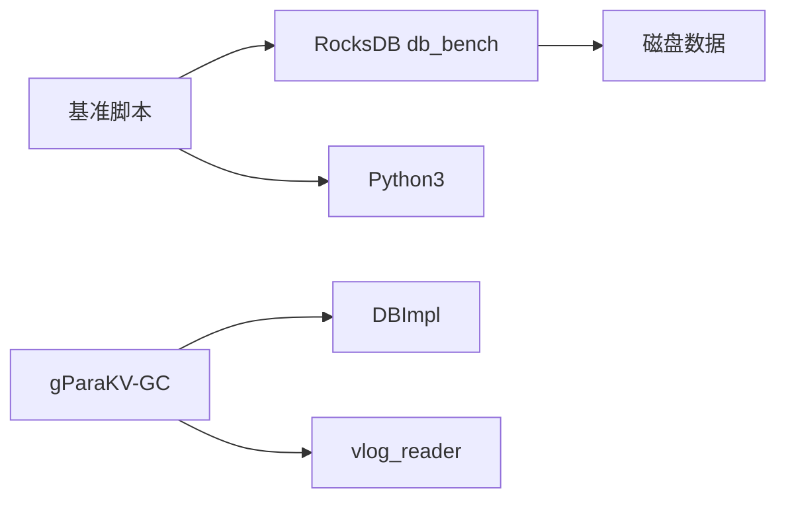

# 维护操作

<cite>
**本文引用的文件**   
- [common.sh](file://script/common.sh)
- [run_all.sh](file://script/run_all.sh)
- [bench_vs128.sh](file://script/bench_vs128.sh)
- [generate_report.sh](file://script/generate_report.sh)
- [options.h](file://source/rocksdb/include/rocksdb/options.h)
- [garbage_collector.h](file://source/gParaKV-GC-master/db/garbage_collector.h)
</cite>

## 目录
1. [简介](#简介)
2. [项目结构](#项目结构)
3. [核心组件](#核心组件)
4. [架构总览](#架构总览)
5. [详细组件分析](#详细组件分析)
6. [依赖分析](#依赖分析)
7. [性能考虑](#性能考虑)
8. [故障排查指南](#故障排查指南)
9. [结论](#结论)
10. [附录](#附录)

## 简介
本手册面向运维与平台工程师，提供针对 RocksDB 及 gParaKV-GC 相关子系统的定期维护操作指南。内容覆盖：
- 定期维护任务：Compaction 管理、空间回收、索引优化
- 健康检查与状态监控步骤
- 数据库清理与垃圾回收操作指导
- 版本升级与补丁更新流程
- 性能基准测试与回归测试执行方法
- 容量规划与扩容操作指导
- 安全更新与漏洞修复流程
- 日常巡检与预防性维护任务

本仓库提供了基于 RocksDB 的基准脚本与报告生成工具，以及 gParaKV-GC 的垃圾回收接口定义，可作为维护与优化的实践基础。

## 项目结构
- script：基准测试与报告生成脚本（RocksDB db_bench 封装）
- source/rocksdb：RocksDB 源码与选项定义（含 Compaction、压缩、统计等关键配置）
- source/gParaKV-GC-*：gParaKV-GC 系列实现与变体（包含垃圾回收相关头文件）
- output：基准测试结果输出目录
- .cache：缓存目录

图表来源
- [common.sh:1-196](file://script/common.sh#L1-L196)
- [run_all.sh:1-19](file://script/run_all.sh#L1-L19)
- [bench_vs128.sh:1-10](file://script/bench_vs128.sh#L1-L10)
- [generate_report.sh:1-59](file://script/generate_report.sh#L1-L59)
- [options.h:1-200](file://source/rocksdb/include/rocksdb/options.h#L1-L200)
- [garbage_collector.h:1-33](file://source/gParaKV-GC-master/db/garbage_collector.h#L1-L33)

章节来源
- [common.sh:1-196](file://script/common.sh#L1-L196)
- [run_all.sh:1-19](file://script/run_all.sh#L1-L19)
- [bench_vs128.sh:1-10](file://script/bench_vs128.sh#L1-L10)
- [generate_report.sh:1-59](file://script/generate_report.sh#L1-L59)
- [options.h:1-200](file://source/rocksdb/include/rocksdb/options.h#L1-L200)
- [garbage_collector.h:1-33](file://source/gParaKV-GC-master/db/garbage_collector.h#L1-L33)

## 核心组件
- 基准测试与报告脚本
  - common.sh：统一参数、解析输出、计算吞吐/延迟、采集硬件信息、生成 JSON 结果
  - run_all.sh：顺序执行多 value size 基准
  - bench_vs*.sh：按 value size 调用通用函数
  - generate_report.sh：合并多轮结果并打印摘要
- RocksDB 选项与能力
  - options.h：ColumnFamilyOptions 暴露 Compaction、压缩、统计、写入缓冲等关键调优点
- gParaKV-GC 垃圾回收
  - garbage_collector.h：定义 GC 入口与 vlog 读取器关联

章节来源
- [common.sh:1-196](file://script/common.sh#L1-L196)
- [run_all.sh:1-19](file://script/run_all.sh#L1-L19)
- [bench_vs128.sh:1-10](file://script/bench_vs128.sh#L1-L10)
- [generate_report.sh:1-59](file://script/generate_report.sh#L1-L59)
- [options.h:1-200](file://source/rocksdb/include/rocksdb/options.h#L1-L200)
- [garbage_collector.h:1-33](file://source/gParaKV-GC-master/db/garbage_collector.h#L1-L33)

## 架构总览
下图展示“基准脚本 → RocksDB 引擎 → 存储介质”的数据流，以及“报告生成”的聚合过程。

图表来源
- [common.sh:1-196](file://script/common.sh#L1-L196)
- [run_all.sh:1-19](file://script/run_all.sh#L1-L19)
- [bench_vs128.sh:1-10](file://script/bench_vs128.sh#L1-L10)
- [generate_report.sh:1-59](file://script/generate_report.sh#L1-L59)

## 详细组件分析

### 基准测试与报告脚本
- 功能要点
  - 统一环境变量与路径（LD_LIBRARY_PATH、PROJECT_DIR、OUTPUT_BASE）
  - 解析 db_bench 输出，提取 ops/sec、us/op，换算 MB/s
  - 采集 CPU/GPU/内存/内核/OS 信息
  - 生成结构化 JSON 结果（含 metadata、hardware、runs）
  - 顺序执行不同 value size 的基准，便于回归对比
  - 合并多轮结果，输出汇总摘要
- 维护价值
  - 作为性能基线与回归测试的基础
  - 为容量规划与扩缩容决策提供量化依据
  - 通过统计/直方图辅助定位热点与抖动问题

图表来源
- [common.sh:1-196](file://script/common.sh#L1-L196)
- [bench_vs128.sh:1-10](file://script/bench_vs128.sh#L1-L10)
- [run_all.sh:1-19](file://script/run_all.sh#L1-L19)
- [generate_report.sh:1-59](file://script/generate_report.sh#L1-L59)

章节来源
- [common.sh:1-196](file://script/common.sh#L1-L196)
- [bench_vs128.sh:1-10](file://script/bench_vs128.sh#L1-L10)
- [run_all.sh:1-19](file://script/run_all.sh#L1-L19)
- [generate_report.sh:1-59](file://script/generate_report.sh#L1-L59)

### RocksDB 选项与 Compaction/压缩/统计
- 关键可调项（来自 options.h）
  - write_buffer_size：影响批量写入与恢复时间
  - compaction_filter / compaction_filter_factory：在 Compaction 期间过滤/删除键值
  - compression_type：块压缩算法选择
  - OptimizeLevelStyleCompaction / OptimizeUniversalStyleCompaction：针对不同场景的预置优化
  - Statistics/Histogram：用于性能分析与问题定位
- 维护建议
  - 根据工作负载选择 Level/Universal 风格 Compaction
  - 开启统计与直方图，结合基准脚本输出进行对比
  - 使用 CompactionFilter 做过期/删除策略，降低写放大

章节来源
- [options.h:1-200](file://source/rocksdb/include/rocksdb/options.h#L1-L200)

### gParaKV-GC 垃圾回收接口
- 职责边界
  - GarbageCollector 持有 vlog 读取器与 DBImpl 引用，支持设置 vlog 编号与起始回收位置
- 维护意义
  - 配合 WAL/vlog 生命周期管理，避免无效数据占用空间
  - 与 Compaction 协同释放不可达 SST/LOB 文件

章节来源
- [garbage_collector.h:1-33](file://source/gParaKV-GC-master/db/garbage_collector.h#L1-L33)

## 依赖分析
- 脚本层依赖 RocksDB 构建产物（db_bench），并通过 LD_LIBRARY_PATH 指向库路径
- 报告生成脚本依赖 Python3 与 JSON 处理
- gParaKV-GC 模块依赖底层 DBImpl 与 vlog 读写器

图表来源
- [common.sh:1-196](file://script/common.sh#L1-L196)
- [generate_report.sh:1-59](file://script/generate_report.sh#L1-L59)
- [garbage_collector.h:1-33](file://source/gParaKV-GC-master/db/garbage_collector.h#L1-L33)

章节来源
- [common.sh:1-196](file://script/common.sh#L1-L196)
- [generate_report.sh:1-59](file://script/generate_report.sh#L1-L59)
- [garbage_collector.h:1-33](file://source/gParaKV-GC-master/db/garbage_collector.h#L1-L33)

## 性能考虑
- 基准设计
  - 固定 key_size，遍历多种 value_size，评估吞吐与延迟变化
  - 启用 statistics/histogram，便于定位尾部延迟与抖动
- 吞吐换算
  - MB/s = ops/sec × (key_size + value_size) / (1024×1024)
- 空间放大
  - 通过 db_dir 大小与逻辑字节数估算 space_amplification
- 硬件采样
  - 采集 CPU/GPU/内存/内核/OS，确保结果可复现与可比对

章节来源
- [common.sh:1-196](file://script/common.sh#L1-L196)
- [generate_report.sh:1-59](file://script/generate_report.sh#L1-L59)

## 故障排查指南
- 常见问题
  - 找不到 db_bench 或库路径错误：检查 LD_LIBRARY_PATH 与 PROJECT_DIR
  - 输出为空或解析失败：确认 db_bench 输出格式与正则匹配
  - JSON 合并失败：检查各 vs*/benchmark_results.json 是否存在且格式正确
- 快速定位
  - 查看脚本标准输出与 stderr
  - 使用 generate_report.sh 打印摘要，核对异常行
  - 检查磁盘空间与权限，避免写入失败

章节来源
- [common.sh:1-196](file://script/common.sh#L1-L196)
- [generate_report.sh:1-59](file://script/generate_report.sh#L1-L59)

## 结论
本仓库提供了以 RocksDB 为核心的基准测试与报告工具链，以及 gParaKV-GC 的垃圾回收接口。借助这些工具，可以系统化地执行性能基线、回归测试、容量规划与优化验证。结合 RocksDB 的 Compaction/压缩/统计能力，可有效提升系统稳定性与性能表现。

## 附录

### 定期维护任务清单
- Compaction 管理
  - 根据工作负载选择 Level/Universal 风格；观察 compaction 频率与耗时
  - 使用 CompactionFilter 清理过期键值，降低写放大
- 空间回收
  - 定期触发 compact 与清理无用 SST/LOB；结合 vlog 生命周期回收
- 索引优化
  - 调整 block_cache、memtable 大小与压缩策略，减少读放大
- 健康检查与监控
  - 采集 CPU/GPU/内存/内核/OS；监控磁盘 I/O、WAL/SST 数量与大小
  - 关注统计与直方图，识别尾部延迟与抖动
- 数据库清理与垃圾回收
  - 停止写入后执行 compact；清理历史快照与未引用文件
  - 使用 GC 接口回收 vlog 中不可达记录
- 版本升级与补丁更新
  - 备份数据与配置；灰度升级；回归基准测试；回滚预案
- 性能基准与回归测试
  - 使用 run_all.sh 执行多 value size 基准；保存 JSON 结果
  - 通过 generate_report.sh 合并与对比，建立趋势
- 容量规划与扩容
  - 基于 space_amplification 与吞吐/延迟曲线，预估增长
  - 横向扩展节点或纵向提升资源（CPU/内存/IO）
- 安全更新与漏洞修复
  - 跟踪上游安全公告；最小化变更范围；验证兼容性
- 日常巡检与预防性维护
  - 日志轮转、磁盘告警、备份校验、性能基线比对

### 健康检查与状态监控步骤
- 环境与健康
  - 检查进程存活、端口监听、磁盘可用空间与 IO 延迟
  - 采集硬件信息（CPU/GPU/内存/内核/OS）
- 数据库状态
  - 查看 SST/WAL/LOB 数量与大小；Compaction 队列长度与耗时
  - 统计与直方图：P50/P95/P99 延迟、吞吐波动
- 监控指标
  - 写入/读取吞吐、延迟、命中率、压缩比、GC 回收量

### 数据库清理与垃圾回收操作指导
- 清理前准备
  - 评估业务低峰期；通知相关服务；准备回滚方案
- 执行步骤
  - 触发 compact；等待完成；清理历史快照与无用文件
  - 调用 GC 接口回收 vlog 中的不可达记录
- 验证与回滚
  - 校验数据一致性；回放部分请求；必要时回滚

### 版本升级与补丁更新流程
- 准备阶段
  - 备份数据与配置；拉取新版本；编译/安装依赖
- 灰度发布
  - 单节点试点；运行基准与回归测试；观察指标
- 全量发布
  - 分批滚动升级；持续监控；异常快速回滚

### 性能基准测试与回归测试执行方法
- 执行基准
  - 运行 run_all.sh 或单个 bench_vs*.sh；确保 LD_LIBRARY_PATH 正确
- 结果收集
  - 生成 benchmark_results.json；使用 generate_report.sh 合并与摘要
- 回归判定
  - 对比历史基线；阈值告警；定位差异原因

### 容量规划与扩容操作指导
- 容量规划
  - 基于 space_amplification、吞吐/延迟曲线、增长预测
- 扩容策略
  - 纵向：增加 CPU/内存/IO；调整 RocksDB 选项
  - 横向：分片/副本；负载均衡；数据迁移

### 安全更新与漏洞修复流程
- 跟踪与评估
  - 订阅安全公告；评估影响面与风险等级
- 修复与验证
  - 最小化变更；单元测试/集成测试；回归基准
- 发布与回滚
  - 灰度发布；监控告警；回滚预案

### 日常巡检与预防性维护任务
- 日志与告警
  - 日志轮转；错误率/延迟/吞吐阈值告警
- 备份与演练
  - 定时备份；恢复演练；数据一致性校验
- 性能优化
  - 定期运行基准；调整参数；复盘优化效果