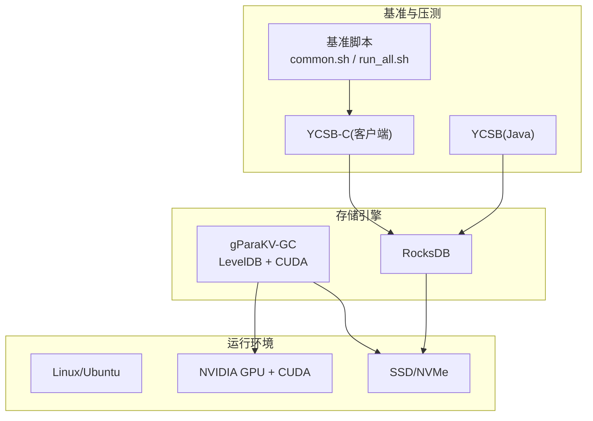
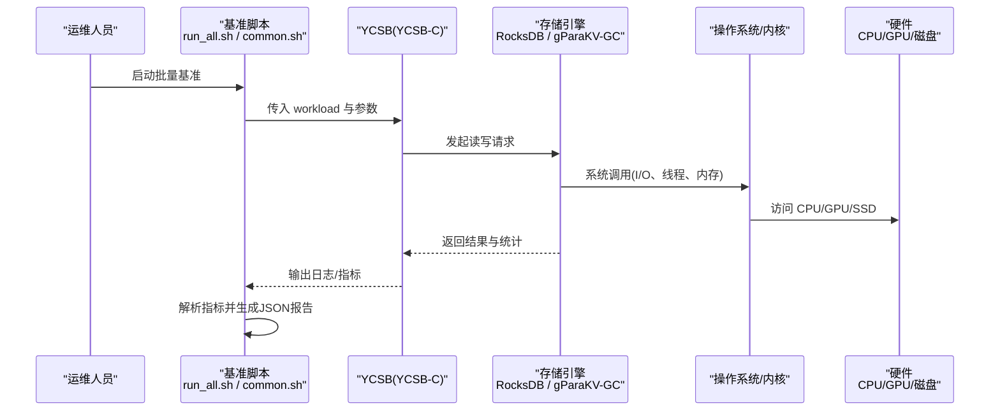
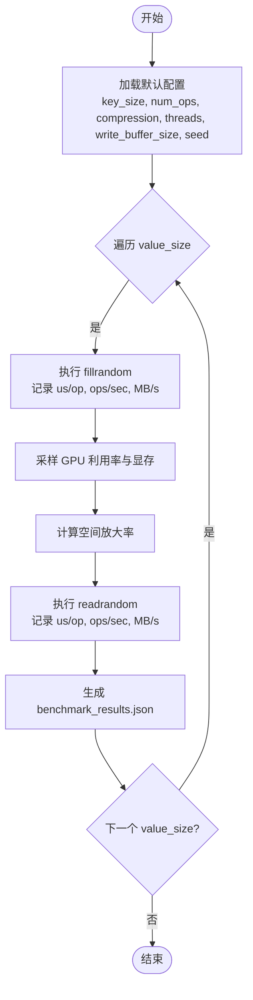
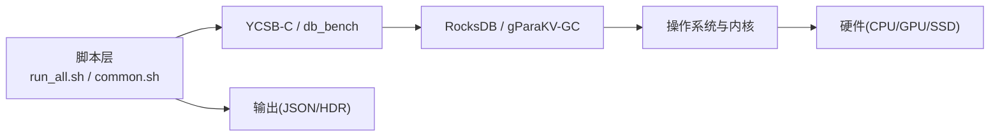

# 部署和运维

<cite>
**本文引用的文件**   
- [YCSB/README.md](file://source/YCSB/README.md)
- [rocksdb/README.md](file://source/rocksdb/README.md)
- [gParaKV-GC-master/README.md](file://source/gParaKV-GC-master/README.md)
- [script/common.sh](file://script/common.sh)
- [script/run_all.sh](file://script/run_all.sh)
</cite>

## 目录
1. [简介](#简介)
2. [项目结构](#项目结构)
3. [核心组件](#核心组件)
4. [架构总览](#架构总览)
5. [详细组件分析](#详细组件分析)
6. [依赖关系分析](#依赖关系分析)
7. [性能与容量规划](#性能与容量规划)
8. [监控与告警](#监控与告警)
9. [备份与恢复](#备份与恢复)
10. [故障排查与诊断](#故障排查与诊断)
11. [维护与健康检查](#维护与健康检查)
12. [灾难恢复与业务连续性](#灾难恢复与业务连续性)
13. [结论](#结论)

## 简介
本指南面向生产环境的部署与运维，覆盖硬件要求、系统配置、网络设置、性能调优（内存管理、I/O优化、压缩）、监控与告警、备份与恢复、故障排查、容量规划与扩展、定期维护与健康检查，以及灾难恢复与业务连续性保障。内容基于仓库中的 RocksDB、YCSB、gParaKV-GC 及基准脚本等实际材料整理而成，确保可操作性与可追溯性。

## 项目结构
仓库包含三类关键资产：
- 存储引擎与增强实现：RocksDB、gParaKV-GC（基于 LevelDB 的 GPU 加速 GC 版本）
- 基准与压测工具：YCSB（Java）与 YCSB-C（C++）
- 自动化脚本：批量执行不同值大小的基准测试并输出结构化结果

图表来源
- [rocksdb/README.md:1-30](file://source/rocksdb/README.md#L1-L30)
- [gParaKV-GC-master/README.md:25-46](file://source/gParaKV-GC-master/README.md#L25-L46)
- [YCSB/README.md:31-62](file://source/YCSB/README.md#L31-L62)
- [script/common.sh:1-196](file://script/common.sh#L1-L196)
- [script/run_all.sh:1-19](file://script/run_all.sh#L1-L19)

章节来源
- [rocksdb/README.md:1-30](file://source/rocksdb/README.md#L1-L30)
- [gParaKV-GC-master/README.md:25-46](file://source/gParaKV-GC-master/README.md#L25-L46)
- [YCSB/README.md:31-62](file://source/YCSB/README.md#L31-L62)
- [script/common.sh:1-196](file://script/common.sh#L1-L196)
- [script/run_all.sh:1-19](file://script/run_all.sh#L1-L19)

## 核心组件
- RocksDB：高性能持久化键值存储，LSM 设计，支持多线程合并，适合多 TB 级数据。
- gParaKV-GC：在 LevelDB 基础上引入并行 GPGPU 加速的垃圾回收策略，降低开销并改善空间放大。
- YCSB：通用工作负载基准框架，提供多种数据库绑定与标准 workload。
- YCSB-C：C++ 实现的轻量客户端，便于与 RocksDB/gParaKV 集成进行压测。
- 基准脚本：统一参数、采集指标、生成 JSON 报告，便于回归与对比。

章节来源
- [rocksdb/README.md:1-30](file://source/rocksdb/README.md#L1-L30)
- [gParaKV-GC-master/README.md:1-23](file://source/gParaKV-GC-master/README.md#L1-L23)
- [YCSB/README.md:31-62](file://source/YCSB/README.md#L31-L62)
- [script/common.sh:1-196](file://script/common.sh#L1-L196)

## 架构总览
下图展示从压测驱动到存储引擎的数据流与组件交互，适用于 RocksDB 与 gParaKV-GC 两种路径。

图表来源
- [script/run_all.sh:1-19](file://script/run_all.sh#L1-L19)
- [script/common.sh:1-196](file://script/common.sh#L1-L196)
- [YCSB/README.md:31-62](file://source/YCSB/README.md#L31-L62)
- [rocksdb/README.md:1-30](file://source/rocksdb/README.md#L1-L30)
- [gParaKV-GC-master/README.md:25-46](file://source/gParaKV-GC-master/README.md#L25-L46)

## 详细组件分析

### 存储引擎：RocksDB
- 定位与特性：LSM 结构、多线程合并、高吞吐写入与稳定延迟，适合大规模 KV 场景。
- 构建与示例：参考根目录 README 与 examples 路径；公开接口位于 include/ 目录。
- 适用场景：作为后端存储承载元数据卸载、热点索引或时序数据等。

章节来源
- [rocksdb/README.md:1-30](file://source/rocksdb/README.md#L1-L30)

### 存储引擎：gParaKV-GC（GPU 加速 GC）
- 目标与优势：通过并行 GPU 加速垃圾回收，降低碎片与空间放大，提升整体效率。
- 系统要求：Ubuntu 22.04、内核 6.8.0-52-generic、NVIDIA 驱动 ≥ 550.xx、CUDA 12.3、gcc/g++ ≥ 11、CMake ≥ 3.26、可选 libsnappy-dev。
- 构建与运行：使用 CMake 构建 db_bench 与 ycsbc 目标；提供 YCSB-C workload 示例。

章节来源
- [gParaKV-GC-master/README.md:25-46](file://source/gParaKV-GC-master/README.md#L25-L46)
- [gParaKV-GC-master/README.md:58-95](file://source/gParaKV-GC-master/README.md#L58-L95)

### 基准与压测：YCSB 与 YCSB-C
- YCSB（Java）：下载发布包，准备数据库绑定，按 workload 执行 load/run。
- YCSB-C：通过命令行指定文件名、数据库类型、配置文件与工作负载，输出 CSV/JSON 结果。
- 百分位与直方图：关注 P99/P99.9/P99.99，支持 HDR 直方图导出与合并。

章节来源
- [YCSB/README.md:31-62](file://source/YCSB/README.md#L31-L62)
- [YCSB/README.md:82-135](file://source/YCSB/README.md#L82-L135)
- [gParaKV-GC-master/README.md:87-101](file://source/gParaKV-GC-master/README.md#L87-L101)

### 自动化脚本：common.sh 与 run_all.sh
- common.sh：定义默认参数（键大小、操作数、压缩、线程、写缓冲、种子），封装解析 ops/us/op、计算 MB/s、采集硬件信息、采样 GPU 利用率与显存、执行 fillrandom/readrandom 并输出 JSON 报告。
- run_all.sh：顺序遍历不同 value_size（32/128/512/1024/4096/16384），逐个调用对应脚本，汇总输出至 output/vs*/benchmark_results.json。

图表来源
- [script/common.sh:1-196](file://script/common.sh#L1-L196)
- [script/run_all.sh:1-19](file://script/run_all.sh#L1-L19)

章节来源
- [script/common.sh:1-196](file://script/common.sh#L1-L196)
- [script/run_all.sh:1-19](file://script/run_all.sh#L1-L19)

## 依赖关系分析
- 运行时依赖
  - Linux/Ubuntu、内核版本、NVIDIA 驱动与 CUDA（针对 gParaKV-GC）
  - gcc/g++、CMake、libsnappy-dev（可选但推荐）
- 软件依赖
  - YCSB（Java/Maven）用于 Java 绑定压测
  - YCSB-C 与 RocksDB/gParaKV 构建产物链接
- 输入与输出
  - 输入：workload 配置文件、基准参数
  - 输出：CSV/JSON 报告、HDR 直方图（可选）

图表来源
- [script/run_all.sh:1-19](file://script/run_all.sh#L1-L19)
- [script/common.sh:1-196](file://script/common.sh#L1-L196)
- [rocksdb/README.md:1-30](file://source/rocksdb/README.md#L1-L30)
- [gParaKV-GC-master/README.md:25-46](file://source/gParaKV-GC-master/README.md#L25-L46)

章节来源
- [script/common.sh:1-196](file://script/common.sh#L1-L196)
- [script/run_all.sh:1-19](file://script/run_all.sh#L1-L19)
- [rocksdb/README.md:1-30](file://source/rocksdb/README.md#L1-L30)
- [gParaKV-GC-master/README.md:25-46](file://source/gParaKV-GC-master/README.md#L25-L46)

## 性能与容量规划
- 关键指标
  - 吞吐：ops/sec、MB/s
  - 延迟：us/op，关注 P99/P99.9/P99.99
  - 放大率：空间放大率（磁盘占用/逻辑字节数）
- 参数建议
  - 写缓冲与缓存：write_buffer_size、cache_size 需结合内存与 I/O 能力调整
  - 压缩：compression_type 影响 CPU 与吞吐，权衡选择 none/snappy/zstd 等
  - WAL：disable_wal=false 保证一致性，开启时注意磁盘写入放大
  - 并发：threads 与系统核数匹配，避免过度竞争
- 容量估算
  - 空间放大率 = 物理占用 / (num_keys × (key_size + value_size))
  - 根据历史运行结果与增长趋势，预留 20%-30% 冗余
- 扩展策略
  - 水平扩展：分库分表/分区，按 key 哈希路由
  - 垂直扩展：提升 CPU/GPU、内存、NVMe 带宽
  - 分层存储：热数据 SSD，冷数据对象存储

章节来源
- [script/common.sh:1-196](file://script/common.sh#L1-L196)
- [YCSB/README.md:82-135](file://source/YCSB/README.md#L82-L135)

## 监控与告警
- 系统级监控
  - CPU/内存/磁盘 I/O：iostat、vmstat、sar、pidstat
  - 网络：ss/netstat、iftop、nethogs
- 应用级监控
  - RocksDB/gParaKV：启用 statistics/histogram，采集 ops/sec、us/op、放大率
  - GPU：nvidia-smi 采样利用率与显存
- 指标采集与可视化
  - 将 JSON 报告导入 Prometheus/Grafana 或时序数据库
  - 对 P99 延迟、吞吐下降、放大率异常设置阈值告警
- 日志与追踪
  - 集中收集引擎与应用日志，关联 trace_id
  - 关键路径埋点，定位慢查询与瓶颈

章节来源
- [script/common.sh:1-196](file://script/common.sh#L1-L196)
- [YCSB/README.md:82-135](file://source/YCSB/README.md#L82-L135)

## 备份与恢复
- 备份策略
  - 快照/增量：利用文件系统快照或存储引擎快照机制
  - 离线备份：停止写入后拷贝数据目录，确保一致性
  - 异地容灾：跨机房/云同步，设置 RPO/RTO
- 恢复流程
  - 校验完整性（checksum/哈希）
  - 按版本回滚，验证数据一致性与服务可用性
  - 灰度切换流量，观察指标与错误率
- 注意事项
  - 备份窗口与 IO 影响评估
  - 恢复演练周期化，确保流程有效

章节来源
- [script/common.sh:1-196](file://script/common.sh#L1-L196)

## 故障排查与诊断
- 常见问题
  - 吞吐骤降：检查磁盘 I/O 饱和、GC/Compaction 风暴、锁竞争
  - 延迟尖刺：WAL 刷盘、后台任务、系统抖动
  - 空间放大率升高：碎片化严重，触发手动 compaction
- 诊断步骤
  - 查看引擎统计与直方图，定位热点与尾部延迟
  - 采样 GPU/CPU/内存，识别资源瓶颈
  - 复现问题：最小化 workload，隔离变量
- 应急措施
  - 限流/降级，保护核心链路
  - 扩容节点或临时关闭非关键后台任务

章节来源
- [script/common.sh:1-196](file://script/common.sh#L1-L196)
- [YCSB/README.md:82-135](file://source/YCSB/README.md#L82-L135)

## 维护与健康检查
- 定期任务
  - 健康检查：进程存活、端口监听、磁盘空间、错误日志
  - 指标巡检：吞吐、延迟、放大率、队列长度
  - 清理归档：日志轮转、旧快照清理
- 变更管理
  - 灰度发布、回滚预案、变更审计
- 容量巡检
  - 月度容量评估，预测增长趋势，提前扩容

章节来源
- [script/common.sh:1-196](file://script/common.sh#L1-L196)

## 灾难恢复与业务连续性
- 架构设计
  - 多活/主备、跨地域复制、自动故障转移
- 恢复目标
  - RPO：数据丢失窗口（秒/分钟级）
  - RTO：恢复时间（分钟/小时级）
- 演练与改进
  - 季度演练，复盘优化预案与自动化脚本

章节来源
- [script/common.sh:1-196](file://script/common.sh#L1-L196)

## 结论
本指南围绕 RocksDB 与 gParaKV-GC 的生产部署与运维展开，结合 YCSB/YCSB-C 与自动化脚本形成完整的压测与观测闭环。通过合理的硬件选型、系统配置、性能调优与监控告警，配合完善的备份恢复与灾难恢复计划，可有效保障系统的稳定性、可扩展性与业务连续性。