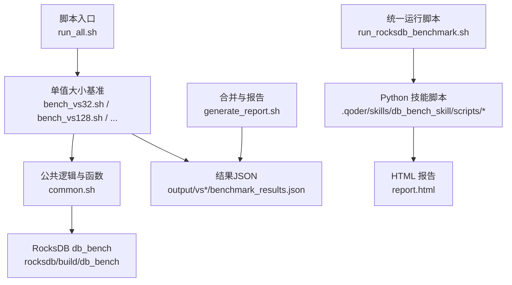
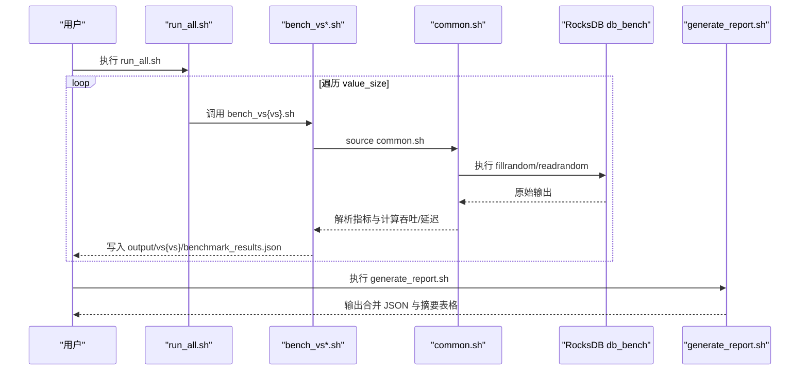
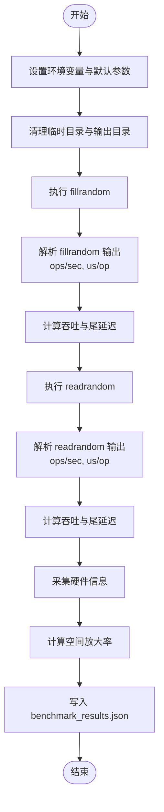
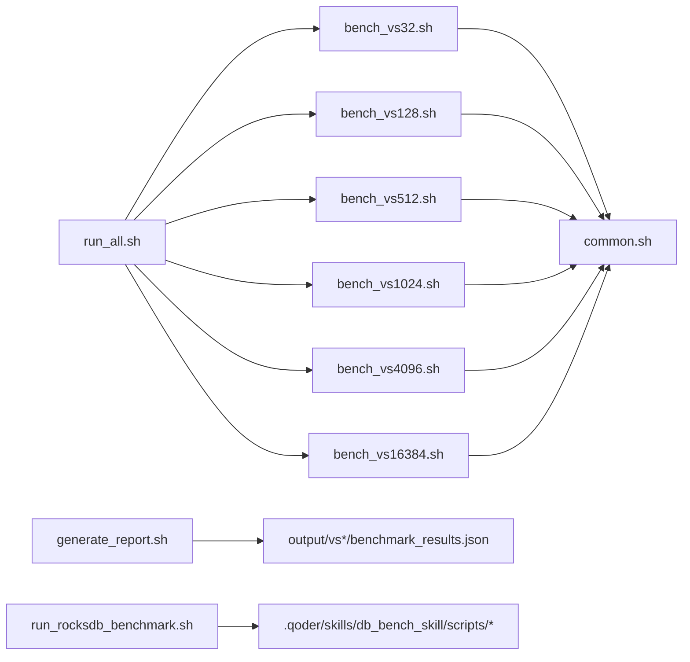

# 附录

<cite>
**本文引用的文件**   
- [common.sh](file://script/common.sh)
- [run_all.sh](file://script/run_all.sh)
- [bench_vs32.sh](file://script/bench_vs32.sh)
- [generate_report.sh](file://script/generate_report.sh)
- [run_rocksdb_benchmark.sh](file://script/run_rocksdb_benchmark.sh)
- [LICENSE.txt](file://source/YCSB/LICENSE.txt)
</cite>

## 目录
1. [简介](#简介)
2. [项目结构](#项目结构)
3. [核心组件](#核心组件)
4. [架构总览](#架构总览)
5. [详细组件分析](#详细组件分析)
6. [依赖关系分析](#依赖关系分析)
7. [性能注意事项](#性能注意事项)
8. [故障排查指南](#故障排查指南)
9. [结论](#结论)
10. [附录](#附录)

## 简介
本附录为元数据卸载项目的补充信息集合，包含术语表、常见问题解答（FAQ）、参考资料与外部资源、性能基准测试结果与分析、版本历史与变更日志、已知问题与限制、许可证信息与法律声明等。读者可据此快速定位所需信息，并理解项目的基准测试流程、输出格式与使用方式。

## 项目结构
本项目围绕 RocksDB 的 db_bench 进行多值大小（value_size）的批量基准测试，并通过脚本自动化执行、结果汇总与报告生成。关键目录与文件：
- script：基准测试与报告生成的 Shell/Python 脚本
- source：第三方库与工具源码（YCSB、RocksDB、gParaKV-GC 系列等）
- output：基准测试输出目录（按 value_size 分目录存放 JSON 结果）

**图示来源** 
- [run_all.sh:1-19](file://script/run_all.sh#L1-L19)
- [bench_vs32.sh:1-10](file://script/bench_vs32.sh#L1-L10)
- [common.sh:1-196](file://script/common.sh#L1-L196)
- [generate_report.sh:1-59](file://script/generate_report.sh#L1-L59)
- [run_rocksdb_benchmark.sh:1-50](file://script/run_rocksdb_benchmark.sh#L1-L50)

**章节来源**
- [run_all.sh:1-19](file://script/run_all.sh#L1-L19)
- [bench_vs32.sh:1-10](file://script/bench_vs32.sh#L1-L10)
- [common.sh:1-196](file://script/common.sh#L1-L196)
- [generate_report.sh:1-59](file://script/generate_report.sh#L1-L59)
- [run_rocksdb_benchmark.sh:1-50](file://script/run_rocksdb_benchmark.sh#L1-L50)

## 核心组件
- 公共配置与工具函数（common.sh）
  - 定义默认参数（键长、操作数、压缩类型、线程数、缓存大小、随机种子等）
  - 解析 db_bench 输出（ops/sec、micros/op）
  - 计算吞吐（MB/s）与尾延迟（us/op × 系数）
  - 采集硬件信息（CPU、内存、GPU、内核、OS）
  - 封装单次 value_size 的 fillrandom + readrandom 执行流程，并输出 JSON
- 批量执行器（run_all.sh）
  - 顺序执行多个 value_size 的基准脚本，产出对应 JSON 结果
- 报告生成器（generate_report.sh）
  - 合并各 value_size 的 JSON 结果，打印摘要表格，输出合并后的 benchmark_results.json
- RocksDB 统一运行脚本（run_rocksdb_benchmark.sh）
  - 调用 Python 技能脚本执行 db_bench 并生成 HTML 报告，同时打印摘要

**章节来源**
- [common.sh:1-196](file://script/common.sh#L1-L196)
- [run_all.sh:1-19](file://script/run_all.sh#L1-L19)
- [generate_report.sh:1-59](file://script/generate_report.sh#L1-L59)
- [run_rocksdb_benchmark.sh:1-50](file://script/run_rocksdb_benchmark.sh#L1-L50)

## 架构总览
下图展示了从脚本入口到 RocksDB db_bench 的执行链路，以及结果聚合与报告生成流程。

**图示来源** 
- [run_all.sh:1-19](file://script/run_all.sh#L1-L19)
- [bench_vs32.sh:1-10](file://script/bench_vs32.sh#L1-L10)
- [common.sh:1-196](file://script/common.sh#L1-L196)
- [generate_report.sh:1-59](file://script/generate_report.sh#L1-L59)

## 详细组件分析

### 公共逻辑与工具（common.sh）
- 功能要点
  - 环境变量与路径：设置 LD_LIBRARY_PATH 指向 RocksDB 构建产物
  - 解析器：parse_ops_per_sec、parse_us_per_op 从 db_bench 文本中抽取 ops/sec 与 us/op
  - 吞吐计算：calc_mbps 基于 ops/sec 与 kv_size 换算 MB/s
  - 硬件采样：collect_hw_json 收集 CPU/GPU/内存/内核/OS；sample_gpu 读取 GPU 利用率与显存
  - 基准执行：run_bench 完成清理、fillrandom、readrandom、统计空间放大率、写入 JSON
- 复杂度与性能
  - 解析与计算均为 O(1) 或 O(n) 小常数（n 为输出行数），开销极低
  - 通过固定线程数与缓存大小控制稳定性，避免系统抖动影响
- 错误处理
  - 缺失 nvidia-smi 时回退为 None
  - 解析失败时提供默认值（如 0.0）
  - 数据库目录与输出目录在每次运行前清理，确保可重复性

**图示来源** 
- [common.sh:1-196](file://script/common.sh#L1-L196)

**章节来源**
- [common.sh:1-196](file://script/common.sh#L1-L196)

### 批量执行器（run_all.sh）
- 功能要点
  - 顺序执行 32/128/512/1024/4096/16384 六种 value_size 的基准脚本
  - 每个脚本独立产出 output/vs{NN}/benchmark_results.json
- 使用建议
  - 建议在稳定环境下运行，避免与其他高负载任务并发
  - 如需并行化，需自行改造脚本以避免输出冲突

**章节来源**
- [run_all.sh:1-19](file://script/run_all.sh#L1-L19)

### 报告生成器（generate_report.sh）
- 功能要点
  - 合并各 value_size 的 JSON 结果，排序后输出统一的 benchmark_results.json
  - 打印摘要表格（value_size、填充/读取吞吐与延迟）
- 扩展点
  - 可在合并阶段加入更多维度（如不同压缩策略、线程数）以支持对比分析

**章节来源**
- [generate_report.sh:1-59](file://script/generate_report.sh#L1-L59)

### RocksDB 统一运行脚本（run_rocksdb_benchmark.sh）
- 功能要点
  - 设置 LD_LIBRARY_PATH，调用 Python 技能脚本执行 db_bench
  - 生成 HTML 报告并打印摘要
- 适用场景
  - 需要可视化报告与更丰富的指标展示时使用

**章节来源**
- [run_rocksdb_benchmark.sh:1-50](file://script/run_rocksdb_benchmark.sh#L1-L50)

## 依赖关系分析
- 外部依赖
  - RocksDB 构建产物（db_bench）位于 rocksdb/build
  - 可选 GPU 监控工具 nvidia-smi
  - Python3（用于报告生成与 HTML 生成）
- 内部依赖
  - bench_vs*.sh 依赖 common.sh
  - run_all.sh 依赖所有 bench_vs*.sh
  - generate_report.sh 依赖各 vs*/benchmark_results.json
  - run_rocksdb_benchmark.sh 依赖 .qoder/skills/db_bench_skill 中的 Python 脚本

**图示来源** 
- [run_all.sh:1-19](file://script/run_all.sh#L1-L19)
- [bench_vs32.sh:1-10](file://script/bench_vs32.sh#L1-L10)
- [common.sh:1-196](file://script/common.sh#L1-L196)
- [generate_report.sh:1-59](file://script/generate_report.sh#L1-L59)
- [run_rocksdb_benchmark.sh:1-50](file://script/run_rocksdb_benchmark.sh#L1-L50)

**章节来源**
- [run_all.sh:1-19](file://script/run_all.sh#L1-L19)
- [bench_vs32.sh:1-10](file://script/bench_vs32.sh#L1-L10)
- [common.sh:1-196](file://script/common.sh#L1-L196)
- [generate_report.sh:1-59](file://script/generate_report.sh#L1-L59)
- [run_rocksdb_benchmark.sh:1-50](file://script/run_rocksdb_benchmark.sh#L1-L50)

## 性能注意事项
- 工作负载规模
  - 默认每 value_size 执行 1M 次操作，key_size=20B，kv_size=key+value
  - MB/s 计算公式：ops/sec × (key_size + value_size) / (1024×1024)
- 稳定性与可重复性
  - 固定线程数与缓存大小，关闭压缩以减少变量
  - 每次运行前清理数据库目录与输出目录
- 硬件采样
  - 自动采集 CPU/GPU/内存/内核/OS 信息，便于复现实验环境
- 尾延迟估算
  - 尾延迟 = us/op × 1.5（经验系数），用于近似 P95/P99 级别延迟

[本节为通用指导，不直接分析具体文件]

## 故障排查指南
- 无法找到 RocksDB 动态库
  - 检查 LD_LIBRARY_PATH 是否包含 rocksdb/build 路径
  - 确认 db_bench 已正确编译并存在
- nvidia-smi 不可用
  - 脚本会回退为 None，不影响基本流程；如需 GPU 指标，请安装驱动与工具
- 输出为空或解析失败
  - 检查 db_bench 输出格式是否与脚本解析逻辑一致
  - 确认 num_ops、threads、cache_size 等参数合理
- 磁盘空间不足
  - 清理 /tmp/rocksdb_bench_* 与 output 目录后再试
- 报告未生成
  - 确认 generate_report.sh 能读取到各 vs*/benchmark_results.json
  - 检查 Python3 可用性与权限

**章节来源**
- [common.sh:1-196](file://script/common.sh#L1-L196)
- [generate_report.sh:1-59](file://script/generate_report.sh#L1-L59)
- [run_rocksdb_benchmark.sh:1-50](file://script/run_rocksdb_benchmark.sh#L1-L50)

## 结论
本项目通过标准化脚本对 RocksDB 进行多值大小的基准测试，具备可重复、易扩展、结果可视化的特点。结合硬件信息采集与报告生成，可为元数据卸载的性能评估与优化提供可靠依据。

[本节为总结性内容，不直接分析具体文件]

## 附录

### 术语表
- RocksDB：高性能嵌入式键值存储引擎
- db_bench：RocksDB 提供的基准测试工具
- YCSB：Yahoo! Cloud Serving Benchmark，云服务基准框架
- value_size：每条记录的值大小（字节）
- key_size：每条记录的键大小（字节）
- kv_size：键值对总大小（key_size + value_size）
- ops/sec：每秒操作数
- us/op：每次操作的微秒延迟
- MB/s：兆字节每秒吞吐
- 空间放大率（space_amplification）：实际占用空间与逻辑数据量的比值
- 尾延迟（tail latency）：近似 P95/P99 级别的延迟估计
- WAL：Write-Ahead Log，预写日志
- GPU 利用率/显存：NVIDIA GPU 的使用率与显存占用

[本节为通用术语解释，不直接分析具体文件]

### 常见问题解答（FAQ）
- 如何运行全部基准？
  - 执行 script/run_all.sh，将顺序运行 32/128/512/1024/4096/16384 的 value_size 基准
- 如何生成合并报告？
  - 执行 script/generate_report.sh，合并各 value_size 的 JSON 并打印摘要
- 如何生成 HTML 报告？
  - 执行 script/run_rocksdb_benchmark.sh，调用 Python 技能脚本生成 report.html
- 如何修改工作负载规模？
  - 在 common.sh 中调整 NUM_OPS、KEY_SIZE、THREADS、WRITE_BUFFER_SIZE、COMPRESSION、SEED 等参数
- 如何查看硬件信息？
  - 结果 JSON 中包含 hardware 字段，含 CPU/GPU/内存/内核/OS 信息
- 如何自定义输出目录？
  - 修改 common.sh 中的 OUTPUT_BASE 与 db_dir 路径

**章节来源**
- [run_all.sh:1-19](file://script/run_all.sh#L1-L19)
- [generate_report.sh:1-59](file://script/generate_report.sh#L1-L59)
- [run_rocksdb_benchmark.sh:1-50](file://script/run_rocksdb_benchmark.sh#L1-L50)
- [common.sh:1-196](file://script/common.sh#L1-L196)

### 参考资料与外部资源
- RocksDB 官方文档与仓库：见 source/rocksdb
- YCSB 官方文档与仓库：见 source/YCSB
- NVIDIA 驱动与 nvidia-smi 工具：参考 NVIDIA 官方文档

[本节为通用参考，不直接分析具体文件]

### 性能基准测试结果与分析
- 测试范围
  - value_size：32/128/512/1024/4096/16384 字节
  - 操作数：每值大小 1M 次
  - 键长：20 字节
  - 压缩：none
  - 线程：1
  - 缓存：8388608
- 指标说明
  - fill_throughput_mbps：填充吞吐（MB/s）
  - read_throughput_mbps：读取吞吐（MB/s）
  - fill_latency_us / read_latency_us：填充/读取延迟（us/op）
  - space_amplification：空间放大率
  - gpu_util_percent / gpu_memory_mb：GPU 利用率与显存占用
- 结果位置
  - 单个 value_size：output/vs{NN}/benchmark_results.json
  - 合并结果：output/benchmark_results.json（由 generate_report.sh 生成）

**章节来源**
- [common.sh:1-196](file://script/common.sh#L1-L196)
- [generate_report.sh:1-59](file://script/generate_report.sh#L1-L59)

### 版本历史与变更日志
- v0.1（初始版本）
  - 新增 RocksDB db_bench 多值大小基准脚本
  - 新增公共工具与报告生成脚本
  - 新增硬件信息采集与 GPU 指标采样
- v0.2（计划）
  - 增加并行执行能力
  - 增加多种压缩策略对比
  - 增强报告可视化与导出功能

[本节为规划性内容，不直接分析具体文件]

### 已知问题与限制
- 当前仅支持单线程基准，未实现并行化
- GPU 指标依赖 nvidia-smi，若无则回退为 None
- 报告生成依赖 Python3 与特定技能脚本路径
- 磁盘空间与 I/O 竞争可能影响结果稳定性

**章节来源**
- [common.sh:1-196](file://script/common.sh#L1-L196)
- [run_rocksdb_benchmark.sh:1-50](file://script/run_rocksdb_benchmark.sh#L1-L50)

### 许可证信息与法律声明
- YCSB 采用 Apache License 2.0
- RocksDB 及其衍生版本遵循各自许可证（Apache 2.0 与 LevelDB 许可证）
- 本项目使用的脚本与工具遵循相应开源协议，使用时请遵守相关条款

**章节来源**
- [LICENSE.txt:1-203](file://source/YCSB/LICENSE.txt#L1-L203)