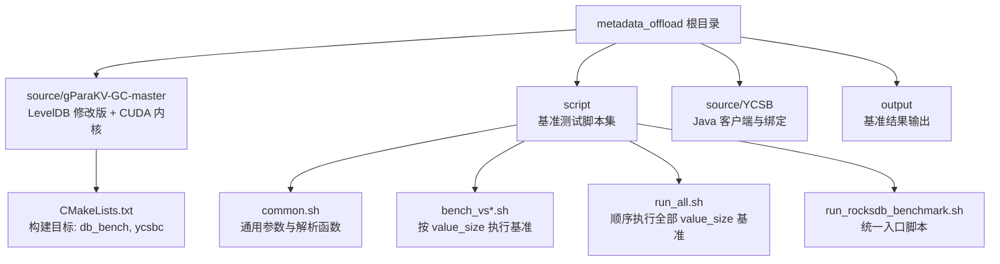
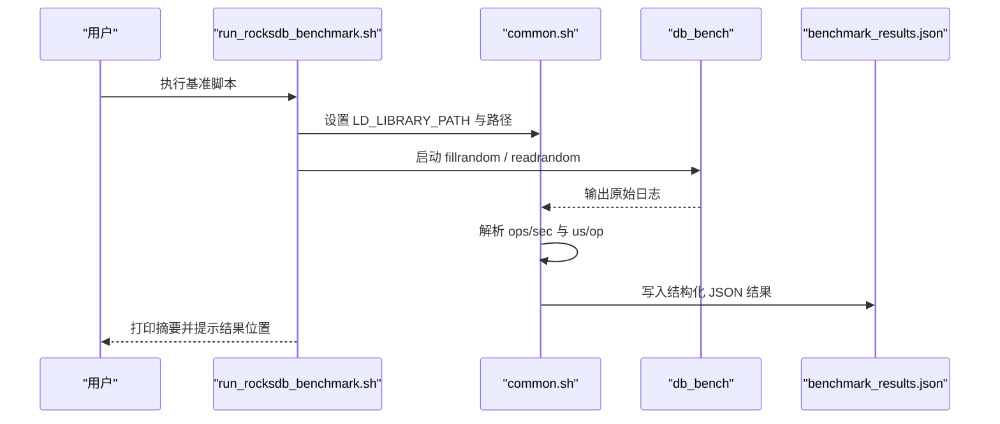
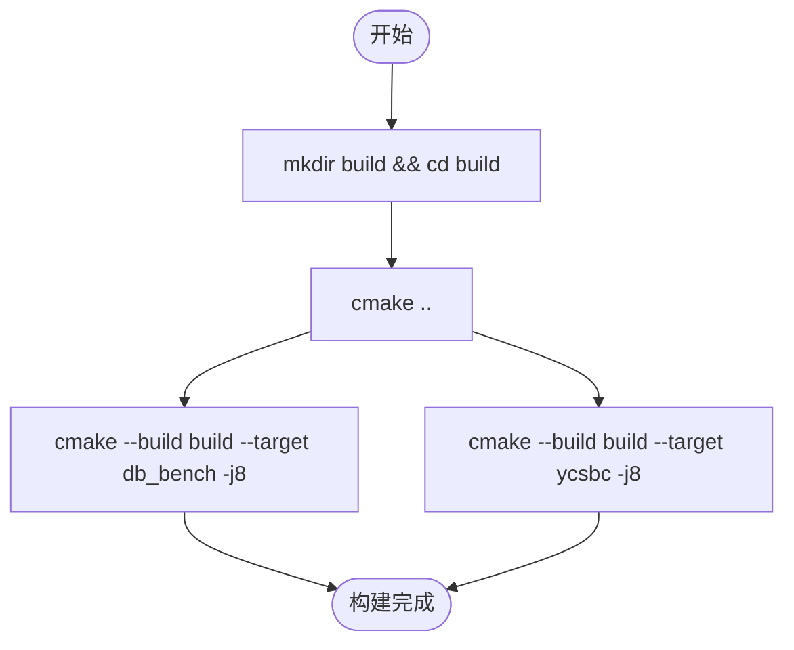
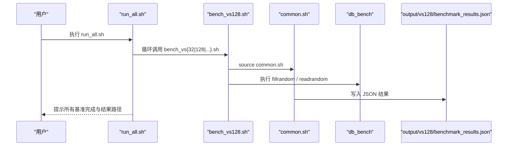
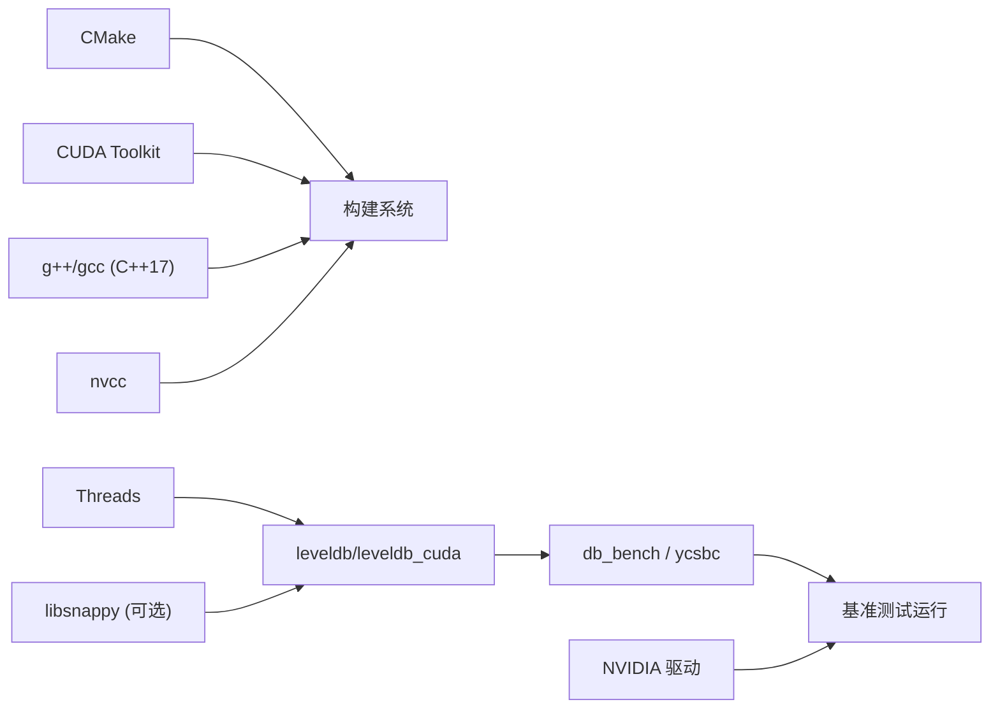

# 快速开始

<cite>
**本文引用的文件**   
- [source/gParaKV-GC-master/README.md](file://source/gParaKV-GC-master/README.md)
- [source/gParaKV-GC-master/CMakeLists.txt](file://source/gParaKV-GC-master/CMakeLists.txt)
- [script/common.sh](file://script/common.sh)
- [script/bench_vs128.sh](file://script/bench_vs128.sh)
- [script/run_all.sh](file://script/run_all.sh)
- [script/run_rocksdb_benchmark.sh](file://script/run_rocksdb_benchmark.sh)
- [source/YCSB/README.md](file://source/YCSB/README.md)
- [source/YCSB/rocksdb/README.md](file://source/YCSB/rocksdb/README.md)
</cite>

## 目录
1. [简介](#简介)
2. [项目结构](#项目结构)
3. [核心组件](#核心组件)
4. [架构总览](#架构总览)
5. [详细组件分析](#详细组件分析)
6. [依赖分析](#依赖分析)
7. [性能注意事项](#性能注意事项)
8. [故障排除指南](#故障排除指南)
9. [结论](#结论)
10. [附录](#附录)

## 简介
本快速开始指南面向首次接触 metadata_offload 项目的用户，目标是帮助你在最短时间内完成环境准备、构建与运行第一个基准测试。你将学会：
- 安装 CUDA Toolkit、CMake、YCSB 等依赖
- 配置并编译 RocksDB 与 gParaKV（含 GPU 支持）
- 使用脚本执行 fillrandom/readrandom 基准测试并查看结果
- 通过 YCSB 对 RocksDB 进行简单压测
- 常见问题的排查方法

## 项目结构
本项目包含以下关键部分：
- source/gParaKV-GC-master：基于 LevelDB 的修改版实现，提供 CUDA 内核与 CMake 构建系统，生成 db_bench 与 ycsbc 可执行文件
- script：RocksDB 基准测试脚本集合，封装了参数、输出与报告生成流程
- source/YCSB：YCSB Java 客户端及 RocksDB binding，用于端到端负载测试
- output：基准测试结果输出目录（由脚本自动生成）

图表来源 
- [source/gParaKV-GC-master/CMakeLists.txt:1-557](file://source/gParaKV-GC-master/CMakeLists.txt#L1-L557)
- [script/common.sh:1-196](file://script/common.sh#L1-L196)
- [script/bench_vs128.sh:1-10](file://script/bench_vs128.sh#L1-L10)
- [script/run_all.sh:1-19](file://script/run_all.sh#L1-L19)
- [script/run_rocksdb_benchmark.sh:1-50](file://script/run_rocksdb_benchmark.sh#L1-L50)

章节来源
- [source/gParaKV-GC-master/README.md:1-117](file://source/gParaKV-GC-master/README.md#L1-L117)

## 核心组件
- gParaKV（CUDA 加速）：在 LevelDB 基础上集成 CUDA 内核，提供 GPU 加速能力；CMake 构建系统负责编译 leveldb、leveldb_cuda、ycsbc 等目标
- RocksDB 基准工具：通过脚本调用 build/db_bench 执行 fillrandom 与 readrandom 测试，自动解析吞吐与延迟指标，生成 JSON 结果
- YCSB 客户端：Java 实现的通用负载框架，内置 RocksDB binding，适合端到端工作负载验证

章节来源
- [source/gParaKV-GC-master/CMakeLists.txt:1-557](file://source/gParaKV-GC-master/CMakeLists.txt#L1-L557)
- [script/common.sh:1-196](file://script/common.sh#L1-L196)
- [source/YCSB/README.md:1-135](file://source/YCSB/README.md#L1-L135)
- [source/YCSB/rocksdb/README.md:1-52](file://source/YCSB/rocksdb/README.md#L1-L52)

## 架构总览
下图展示了从脚本到 RocksDB 基准工具的调用关系与数据流向：

图表来源 
- [script/run_rocksdb_benchmark.sh:1-50](file://script/run_rocksdb_benchmark.sh#L1-L50)
- [script/common.sh:1-196](file://script/common.sh#L1-L196)

## 详细组件分析

### 环境准备（CUDA、CMake、YCSB）
- 操作系统与驱动：Ubuntu 22.04 LTS，NVIDIA 驱动版本需满足 SM 6.0（Pascal）或更高
- CUDA Toolkit：需要 nvcc 可用，推荐版本与驱动匹配
- CMake：≥ 3.26
- 编译器：gcc/g++ ≥ 11（启用 C++17）
- 可选库：libsnappy-dev（压缩优化）
- YCSB：Maven 3 构建，可直接使用仓库内 bin/ycsb.sh

章节来源
- [source/gParaKV-GC-master/README.md:25-45](file://source/gParaKV-GC-master/README.md#L25-L45)
- [source/YCSB/README.md:68-76](file://source/YCSB/README.md#L68-L76)

### 构建过程（含 GPU 支持）
- 进入 gParaKV 源码目录，创建 build 目录并使用 cmake 配置
- 指定构建目标：
  - db_bench：微基准测试工具
  - ycsbc：C 语言 YCSB 客户端
- CMake 会启用 CUDA 编译选项，并链接必要的库（如 Threads、可选 snappy/crc32c/tcmalloc）

图表来源 
- [source/gParaKV-GC-master/CMakeLists.txt:1-557](file://source/gParaKV-GC-master/CMakeLists.txt#L1-L557)
- [source/gParaKV-GC-master/README.md:58-72](file://source/gParaKV-GC-master/README.md#L58-L72)

章节来源
- [source/gParaKV-GC-master/CMakeLists.txt:1-557](file://source/gParaKV-GC-master/CMakeLists.txt#L1-L557)
- [source/gParaKV-GC-master/README.md:58-72](file://source/gParaKV-GC-master/README.md#L58-L72)

### 运行 RocksDB 基准测试
- 使用脚本 run_rocksdb_benchmark.sh 作为统一入口，会自动设置库路径、清理旧结果、执行基准并生成 HTML 报告
- 也可通过 bench_vs*.sh 针对特定 value_size 执行 fillrandom 与 readrandom，结果以 JSON 形式输出到 output/vs*/benchmark_results.json

图表来源 
- [script/run_all.sh:1-19](file://script/run_all.sh#L1-L19)
- [script/bench_vs128.sh:1-10](file://script/bench_vs128.sh#L1-L10)
- [script/common.sh:1-196](file://script/common.sh#L1-L196)

章节来源
- [script/run_rocksdb_benchmark.sh:1-50](file://script/run_rocksdb_benchmark.sh#L1-L50)
- [script/bench_vs128.sh:1-10](file://script/bench_vs128.sh#L1-L10)
- [script/common.sh:1-196](file://script/common.sh#L1-L196)

### 运行 YCSB 基准测试
- 使用仓库内的 YCSB 二进制脚本 bin/ycsb.sh
- 先 load 数据，再 run 工作负载，指定 rocksdb.dir 指向数据目录
- 可通过 workloads/workloada 等默认工作负载快速验证

章节来源
- [source/YCSB/README.md:31-62](file://source/YCSB/README.md#L31-L62)
- [source/YCSB/rocksdb/README.md:18-52](file://source/YCSB/rocksdb/README.md#L18-L52)

## 依赖分析
- 构建期依赖：CMake、CUDA Toolkit、g++/gcc（C++17）、Threads、可选 snappy/crc32c/tcmalloc
- 运行期依赖：RocksDB 动态库（LD_LIBRARY_PATH 指向 build 目录）、GPU 驱动与 CUDA 运行时
- 脚本依赖：bash、awk、sed、bc、nvidia-smi（可选，用于采集 GPU 利用率与显存）

图表来源 
- [source/gParaKV-GC-master/CMakeLists.txt:1-557](file://source/gParaKV-GC-master/CMakeLists.txt#L1-L557)
- [script/common.sh:1-196](file://script/common.sh#L1-L196)

章节来源
- [source/gParaKV-GC-master/CMakeLists.txt:1-557](file://source/gParaKV-GC-master/CMakeLists.txt#L1-L557)
- [script/common.sh:1-196](file://script/common.sh#L1-L196)

## 性能注意事项
- 线程数与写缓冲：脚本中默认 THREADS=1，WRITE_BUFFER_SIZE=67108864，可根据硬件调整
- 压缩类型：默认 COMPRESSION="none"，如需开启请修改脚本变量
- 缓存大小：cache_size=8388608，建议根据内存容量调优
- GPU 采样：脚本通过 nvidia-smi 采集 GPU 利用率与显存占用，确保命令可用
- 空间放大率：脚本计算 space_amplification，关注磁盘占用与逻辑字节比

章节来源
- [script/common.sh:1-196](file://script/common.sh#L1-L196)

## 故障排除指南
- 找不到 nvidia-smi：确认已安装 NVIDIA 驱动且 PATH 中包含 nvidia-smi；若无需 GPU 统计，可忽略该功能
- 动态库加载失败：检查 LD_LIBRARY_PATH 是否包含 RocksDB 构建目录；脚本已设置但需保证路径正确
- CUDA 编译失败：确认 CUDA 版本与驱动兼容，nvcc 可用；必要时调整 CUDA_ARCHITECTURES
- 权限问题：确保输出目录与数据库目录有读写权限
- YCSB 构建错误：确保 Maven 3 可用，网络可访问依赖仓库

章节来源
- [script/common.sh:1-196](file://script/common.sh#L1-L196)
- [source/gParaKV-GC-master/README.md:25-45](file://source/gParaKV-GC-master/README.md#L25-L45)

## 结论
通过以上步骤，你应能顺利完成环境搭建、构建与运行第一个 RocksDB 基准测试，并使用 YCSB 进行简单负载验证。建议在后续实验中逐步调整线程数、缓存与压缩策略，以获得更贴近实际场景的性能数据。

## 附录
- 常用命令速查
  - 构建 db_bench 与 ycsbc：参考 CMake 构建目标
  - 运行全部 value_size 基准：执行 script/run_all.sh
  - 运行单个 value_size 基准：执行 script/bench_vs128.sh（或其他 vs*.sh）
  - 统一入口脚本：script/run_rocksdb_benchmark.sh
  - YCSB 快速压测：source/YCSB/bin/ycsb.sh

章节来源
- [script/run_all.sh:1-19](file://script/run_all.sh#L1-L19)
- [script/bench_vs128.sh:1-10](file://script/bench_vs128.sh#L1-L10)
- [script/run_rocksdb_benchmark.sh:1-50](file://script/run_rocksdb_benchmark.sh#L1-L50)
- [source/YCSB/README.md:31-62](file://source/YCSB/README.md#L31-L62)