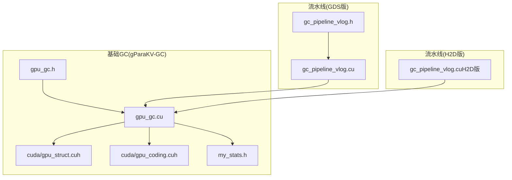
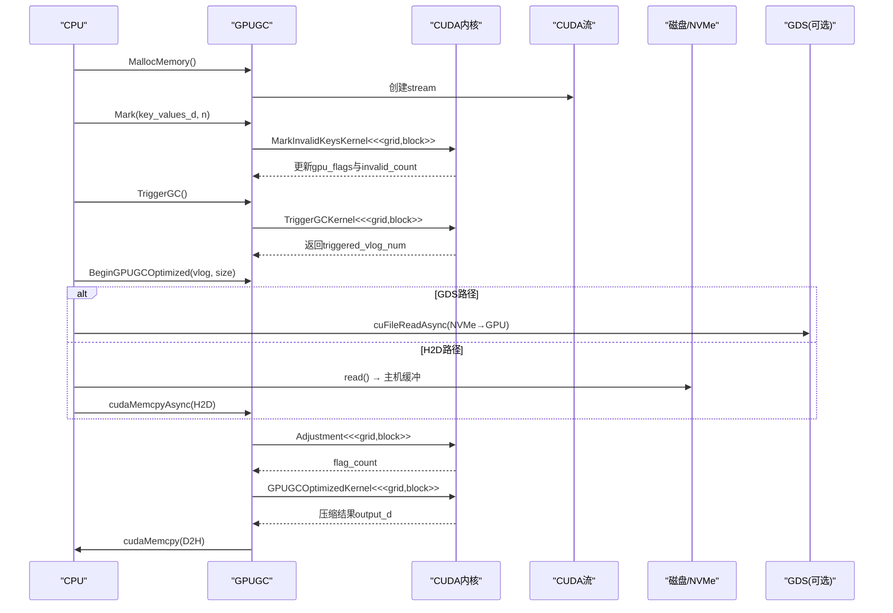
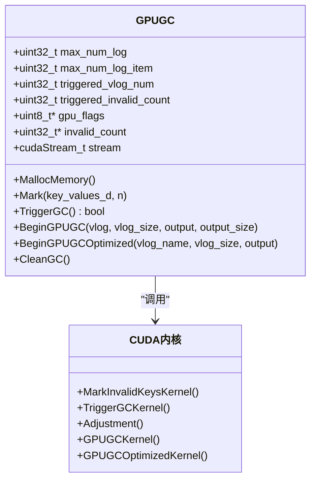
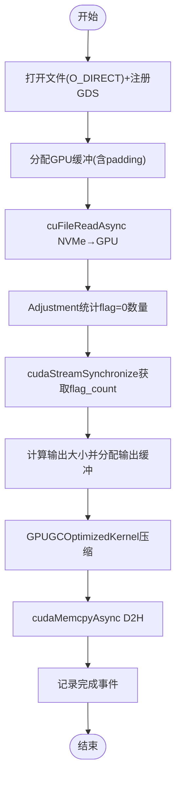
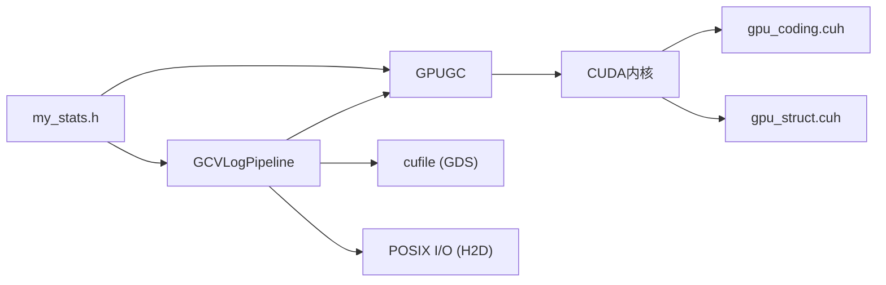

# GPU加速架构

<cite>
**本文引用的文件**   
- [gpu_gc.h](file://source/gParaKV-GC-master/db/gpu_gc.h)
- [gpu_gc.cu](file://source/gParaKV-GC-master/db/gpu_gc.cu)
- [gpu_struct.cuh](file://source/gParaKV-GC-master/db/cuda/gpu_struct.cuh)
- [gpu_coding.cuh](file://source/gParaKV-GC-master/db/cuda/gpu_coding.cuh)
- [my_stats.h](file://source/gParaKV-GC-master/db/my_stats.h)
- [gc_pipeline_vlog.cu](file://source/gParaKV-GC-pipeline/db/cuda_pipeline_gc/gc_pipeline_vlog.cu)
- [gc_pipeline_vlog.h](file://source/gParaKV-GC-pipeline/db/cuda_pipeline_gc/gc_pipeline_vlog.h)
- [gc_pipeline_vlog.cu（H2D版）](file://source/gParaKV-GC-pipeline-h2d/db/cuda_pipeline_gc/gc_pipeline_vlog.cu)
</cite>

## 目录
1. [简介](#简介)
2. [项目结构](#项目结构)
3. [核心组件](#核心组件)
4. [架构总览](#架构总览)
5. [详细组件分析](#详细组件分析)
6. [依赖关系分析](#依赖关系分析)
7. [性能考量](#性能考量)
8. [故障排查指南](#故障排查指南)
9. [结论](#结论)
10. [附录](#附录)

## 简介
本技术文档围绕GPU加速的元数据垃圾回收与压缩流水线展开，重点阐述CUDA内核设计模式、GPU-CPU流水线架构、数据传输优化与内存管理策略。文档覆盖三种实现变体：gParaKV-GC（基础GC）、pipeline（基于GDS零拷贝I/O的并行流水线）、h2d（兼容型H2D版本）。同时给出CUDA编程模型、线程块组织、内存层次结构的说明，并提供性能优化建议与故障排查方法。

## 项目结构
仓库包含多个子工程，其中与GPU GC相关的关键代码集中在以下路径：
- gParaKV-GC-master：基础GPU GC实现，包含标记、触发、压缩等内核与类封装
- gParaKV-GC-pipeline：引入GPUDirect Storage（GDS）的VLog级流水线并行GC
- gParaKV-GC-pipeline-h2d：不依赖GDS的H2D版本，保持相同流水线接口

**图表来源** 
- [gpu_gc.h:1-53](file://source/gParaKV-GC-master/db/gpu_gc.h#L1-L53)
- [gpu_gc.cu:1-256](file://source/gParaKV-GC-master/db/gpu_gc.cu#L1-L256)
- [gpu_struct.cuh:1-87](file://source/gParaKV-GC-master/db/cuda/gpu_struct.cuh#L1-L87)
- [gpu_coding.cuh:1-80](file://source/gParaKV-GC-master/db/cuda/gpu_coding.cuh#L1-L80)
- [my_stats.h:1-65](file://source/gParaKV-GC-master/db/my_stats.h#L1-L65)
- [gc_pipeline_vlog.h:1-213](file://source/gParaKV-GC-pipeline/db/cuda_pipeline_gc/gc_pipeline_vlog.h#L1-L213)
- [gc_pipeline_vlog.cu:1-529](file://source/gParaKV-GC-pipeline/db/cuda_pipeline_gc/gc_pipeline_vlog.cu#L1-L529)
- [gc_pipeline_vlog.cu（H2D版）:1-200](file://source/gParaKV-GC-pipeline-h2d/db/cuda_pipeline_gc/gc_pipeline_vlog.cu#L1-L200)

**章节来源**
- [gpu_gc.h:1-53](file://source/gParaKV-GC-master/db/gpu_gc.h#L1-L53)
- [gpu_gc.cu:1-256](file://source/gParaKV-GC-master/db/gpu_gc.cu#L1-L256)
- [gc_pipeline_vlog.h:1-213](file://source/gParaKV-GC-pipeline/db/cuda_pipeline_gc/gc_pipeline_vlog.h#L1-L213)
- [gc_pipeline_vlog.cu:1-529](file://source/gParaKV-GC-pipeline/db/cuda_pipeline_gc/gc_pipeline_vlog.cu#L1-L529)
- [gc_pipeline_vlog.cu（H2D版）:1-200](file://source/gParaKV-GC-pipeline-h2d/db/cuda_pipeline_gc/gc_pipeline_vlog.cu#L1-L200)

## 核心组件
- GPUGC类：负责GPU端位图与无效计数管理、GC触发判断、以及两种压缩流程（基础版与优化版）
- 内核函数族：
  - MarkInvalidKeysKernel：并行标记重复/无效键值对，更新位图与每vlog无效计数
  - TriggerGCKernel：阈值比较与原子选择首个触发GC的vlog
  - Adjustment：统计某vlog段内flag=0的数量（用于计算输出大小）
  - GPUGCKernel/GPUGCOptimizedKernel：按位图过滤并压缩有效条目到输出缓冲区
- GCVLogPipeline（GDS/H2D）：VLog级流水线调度器，使用多CUDA流并行处理多个VLog，支持GDS零拷贝或传统H2D拷贝

关键数据结构与常量：
- SSTableInfo、GPUBlockHandle、InputFile：SSTable与输入文件描述
- MyStats：全局统计与配置参数（clean_threshold、var_key_value_size、max_num_log_item等）

**章节来源**
- [gpu_gc.h:1-53](file://source/gParaKV-GC-master/db/gpu_gc.h#L1-L53)
- [gpu_gc.cu:1-256](file://source/gParaKV-GC-master/db/gpu_gc.cu#L1-L256)
- [gpu_struct.cuh:1-87](file://source/gParaKV-GC-master/db/cuda/gpu_struct.cuh#L1-L87)
- [gpu_coding.cuh:1-80](file://source/gParaKV-GC-master/db/cuda/gpu_coding.cuh#L1-L80)
- [my_stats.h:1-65](file://source/gParaKV-GC-master/db/my_stats.h#L1-L65)

## 架构总览
整体架构由“CPU控制 + GPU计算”组成，数据流从磁盘经CPU或GDS进入GPU显存，执行标记与压缩内核后回写主机内存。

**图表来源** 
- [gpu_gc.cu:1-256](file://source/gParaKV-GC-master/db/gpu_gc.cu#L1-L256)
- [gc_pipeline_vlog.cu:1-529](file://source/gParaKV-GC-pipeline/db/cuda_pipeline_gc/gc_pipeline_vlog.cu#L1-L529)
- [gc_pipeline_vlog.cu（H2D版）:1-200](file://source/gParaKV-GC-pipeline-h2d/db/cuda_pipeline_gc/gc_pipeline_vlog.cu#L1-L200)

## 详细组件分析

### GPUGC类与内核设计
- 内存分配与生命周期：在MallocMemory中分配gpu_flags与invalid_count，并在析构时释放；使用独立stream进行异步执行
- 标记阶段：MarkInvalidKeysKernel通过相邻键值对比识别重复项，解码value中的vlog号与位置信息，更新对应位图与无效计数
- 触发阶段：TriggerGCKernel使用atomicCAS确保仅一个线程成功选择首个满足阈值的vlog，避免竞争
- 压缩阶段：Adjustment统计flag=0数量，GPUGCOptimizedKernel以每个线程处理固定数量的条目，使用atomicAdd生成紧凑输出

**图表来源** 
- [gpu_gc.h:1-53](file://source/gParaKV-GC-master/db/gpu_gc.h#L1-L53)
- [gpu_gc.cu:1-256](file://source/gParaKV-GC-master/db/gpu_gc.cu#L1-L256)

**章节来源**
- [gpu_gc.h:1-53](file://source/gParaKV-GC-master/db/gpu_gc.h#L1-L53)
- [gpu_gc.cu:1-256](file://source/gParaKV-GC-master/db/gpu_gc.cu#L1-L256)

### GCVLogPipeline（GDS版）
- 设计目标：利用GPUDirect Storage将NVMe数据直接读入GPU显存，绕过CPU内存，降低延迟与带宽占用
- 流水线步骤：
  1) 打开文件(O_DIRECT)并注册GDS句柄
  2) cuFileReadAsync异步读取至GPU缓冲（含64KB padding规避驱动越界写入）
  3) Adjustment统计无效flag数量
  4) 中间同步获取flag_count（必须，用于计算输出大小）
  5) GPUGCOptimizedKernel压缩有效条目
  6) D2H拷贝结果回主机端
  7) 记录完成事件
- 并行策略：3路worker流轮询分配VLog，实现VLog间I/O与计算重叠

**图表来源** 
- [gc_pipeline_vlog.cu:1-529](file://source/gParaKV-GC-pipeline/db/cuda_pipeline_gc/gc_pipeline_vlog.cu#L1-L529)
- [gc_pipeline_vlog.h:1-213](file://source/gParaKV-GC-pipeline/db/cuda_pipeline_gc/gc_pipeline_vlog.h#L1-L213)

**章节来源**
- [gc_pipeline_vlog.cu:1-529](file://source/gParaKV-GC-pipeline/db/cuda_pipeline_gc/gc_pipeline_vlog.cu#L1-L529)
- [gc_pipeline_vlog.h:1-213](file://source/gParaKV-GC-pipeline/db/cuda_pipeline_gc/gc_pipeline_vlog.h#L1-L213)

### GCVLogPipeline（H2D版）
- 差异点：不使用GDS，采用传统read()+cudaMemcpyAsync进行H2D传输，兼容性更好
- 其他流程与GDS版一致：Adjustment→sync→Compact→D2H
- 适用场景：无GDS驱动环境或需要快速部署

**章节来源**
- [gc_pipeline_vlog.cu（H2D版）:1-200](file://source/gParaKV-GC-pipeline-h2d/db/cuda_pipeline_gc/gc_pipeline_vlog.cu#L1-L200)

### CUDA编程模型与内存层次
- 线程块组织：
  - MarkInvalidKeysKernel：threadsPerBlock=1024，blocksPerGrid=(n+TPB-1)/TPB
  - TriggerGCKernel：threadsPerBlock=256，blocksPerGrid=(max_num_log+TPB-1)/TPB
  - Adjustment/GPUGCOptimizedKernel：根据max_num_log_item与process_num_per_thread划分网格
- 内存层次：
  - 全局内存：gpu_flags、invalid_count、vlog_d、output_d
  - 共享内存：未显式使用，可通过寄存器与局部变量优化热点访问
  - 常量内存：编码/解码工具函数提供host/device双端实现
- 流与事件：
  - 每个GPUGC实例拥有独立stream，保证操作顺序
  - Pipeline使用多worker流与cudaEvent实现跨VLog并行

**章节来源**
- [gpu_gc.cu:1-256](file://source/gParaKV-GC-master/db/gpu_gc.cu#L1-L256)
- [gpu_coding.cuh:1-80](file://source/gParaKV-GC-master/db/cuda/gpu_coding.cuh#L1-L80)
- [gpu_struct.cuh:1-87](file://source/gParaKV-GC-master/db/cuda/gpu_struct.cuh#L1-L87)

## 依赖关系分析
- GPUGC依赖cuda_runtime与thrust迭代器（用于计数/统计）
- Pipeline依赖cufile（GDS）或POSIX I/O（H2D）
- 所有内核依赖gpu_coding.cuh提供的编解码工具函数
- 配置与统计通过my_stats.h暴露全局变量

**图表来源** 
- [gpu_gc.cu:1-256](file://source/gParaKV-GC-master/db/gpu_gc.cu#L1-L256)
- [gpu_coding.cuh:1-80](file://source/gParaKV-GC-master/db/cuda/gpu_coding.cuh#L1-L80)
- [gpu_struct.cuh:1-87](file://source/gParaKV-GC-master/db/cuda/gpu_struct.cuh#L1-L87)
- [my_stats.h:1-65](file://source/gParaKV-GC-master/db/my_stats.h#L1-L65)
- [gc_pipeline_vlog.cu:1-529](file://source/gParaKV-GC-pipeline/db/cuda_pipeline_gc/gc_pipeline_vlog.cu#L1-L529)
- [gc_pipeline_vlog.cu（H2D版）:1-200](file://source/gParaKV-GC-pipeline-h2d/db/cuda_pipeline_gc/gc_pipeline_vlog.cu#L1-L200)

**章节来源**
- [gpu_gc.cu:1-256](file://source/gParaKV-GC-master/db/gpu_gc.cu#L1-L256)
- [gpu_coding.cuh:1-80](file://source/gParaKV-GC-master/db/cuda/gpu_coding.cuh#L1-L80)
- [gpu_struct.cuh:1-87](file://source/gParaKV-GC-master/db/cuda/gpu_struct.cuh#L1-L87)
- [my_stats.h:1-65](file://source/gParaKV-GC-master/db/my_stats.h#L1-L65)
- [gc_pipeline_vlog.cu:1-529](file://source/gParaKV-GC-pipeline/db/cuda_pipeline_gc/gc_pipeline_vlog.cu#L1-L529)
- [gc_pipeline_vlog.cu（H2D版）:1-200](file://source/gParaKV-GC-pipeline-h2d/db/cuda_pipeline_gc/gc_pipeline_vlog.cu#L1-L200)

## 性能考量
- 数据传输优化：
  - GDS零拷贝可显著降低CPU参与与内存复制开销
  - H2D版本需权衡兼容性与时延，适合无GDS环境
- 内核并行度：
  - 调整threadsPerBlock与grid尺寸以匹配数据规模
  - process_num_per_thread=100可减少atomicAdd竞争
- 内存对齐与边界：
  - GDS要求4KB对齐，H2D无需特殊对齐
  - 注意libcufile驱动越界写入问题，预留padding
- 同步点最小化：
  - 仅在需要flag_count时进行同步，避免阻塞流水线
- 统计与监控：
  - 使用my_stats记录data_transfer_time、compaction_time等指标

[本节为通用指导，不直接分析具体文件]

## 故障排查指南
- CUDA错误检查：
  - CHECK宏会打印错误信息与位置，便于定位
- GDS初始化失败：
  - 确认cuFileDriverOpen成功，驱动版本兼容
- 文件打开失败：
  - O_DIRECT需要文件系统支持，检查权限与挂载选项
- 越界写入警告：
  - libcufile已知bug，确保分配额外padding
- 输出大小异常：
  - 若output_size > file_size，跳过该VLog并记录日志
- 流同步问题：
  - 确保在需要flag_count处调用cudaStreamSynchronize

**章节来源**
- [gpu_struct.cuh:1-87](file://source/gParaKV-GC-master/db/cuda/gpu_struct.cuh#L1-L87)
- [gc_pipeline_vlog.cu:1-529](file://source/gParaKV-GC-pipeline/db/cuda_pipeline_gc/gc_pipeline_vlog.cu#L1-L529)
- [gc_pipeline_vlog.cu（H2D版）:1-200](file://source/gParaKV-GC-pipeline-h2d/db/cuda_pipeline_gc/gc_pipeline_vlog.cu#L1-L200)

## 结论
本架构通过GPU加速的GC与压缩流水线，结合GDS零拷贝与多流并行，显著提升了元数据处理吞吐。不同实现变体覆盖了从高性能GDS到兼容H2D的多场景需求。合理配置线程块、内存对齐与同步点，是获得稳定性能的关键。

[本节为总结性内容，不直接分析具体文件]

## 附录
- CUDA编程模型要点：
  - 线程束（warp）执行SIMT，注意分支发散
  - 共享内存可用于减少全局内存访问，但需注意bank冲突
  - 常量内存适合广播只读配置
- 内存层次结构：
  - 寄存器 > L1/L2缓存 > 全局内存 > 设备内存
  - 合理使用__restrict__指针与向量化访问提升带宽利用率
- 调试工具：
  - cuda-gdb、nsight compute、nvprof等用于性能分析与调试

[本节为通用指导，不直接分析具体文件]