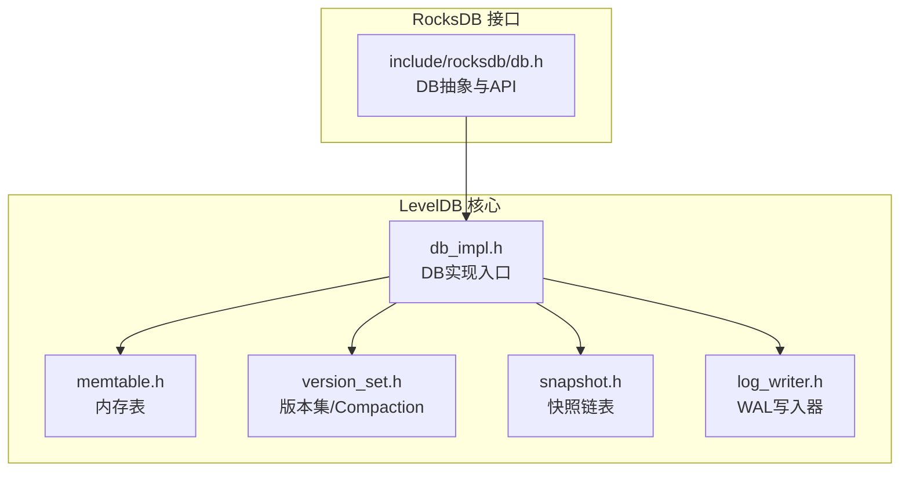
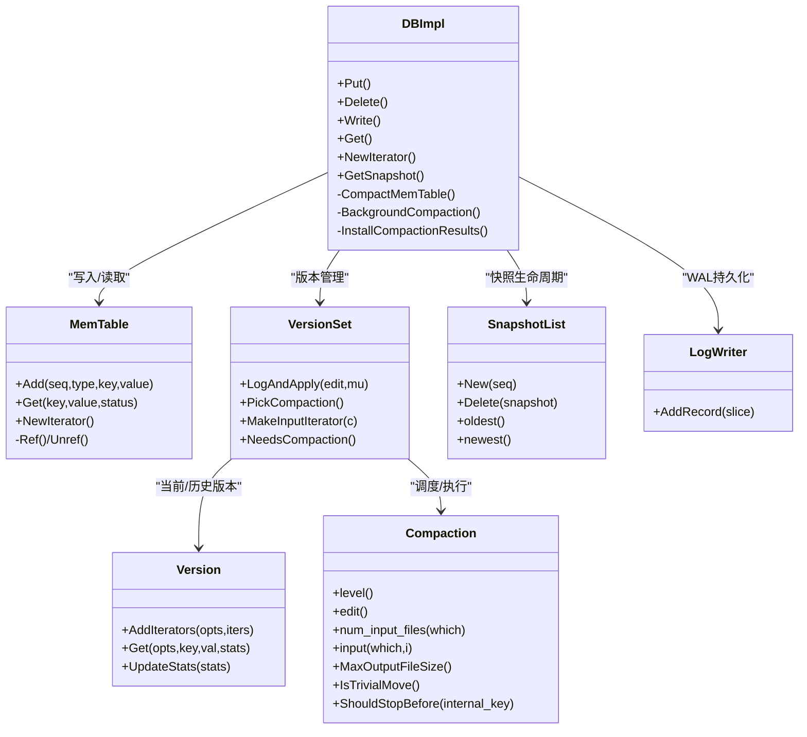
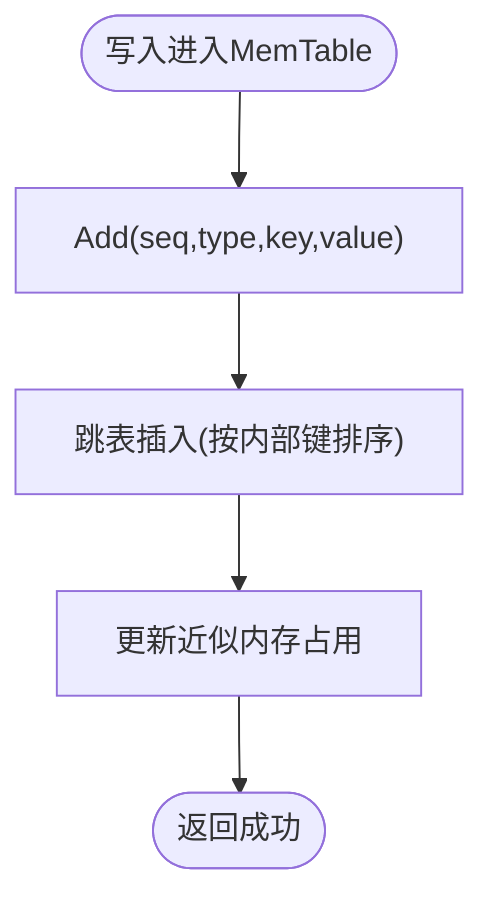
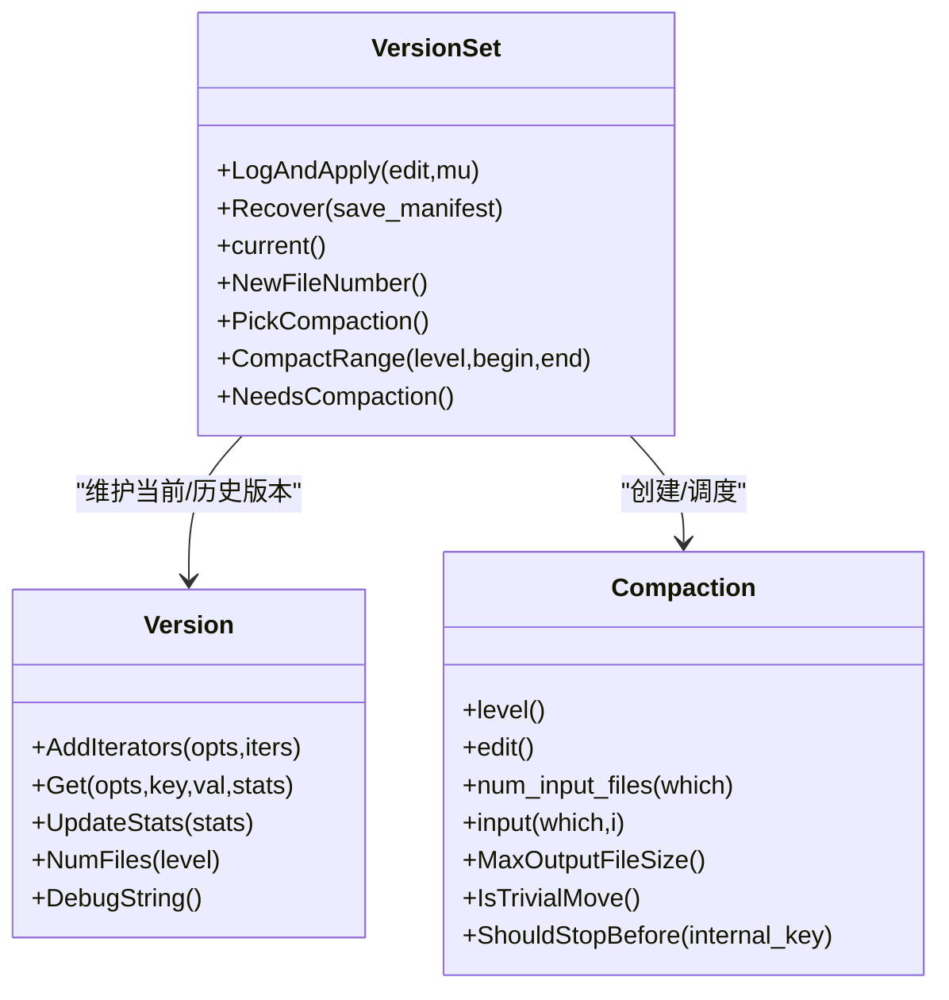
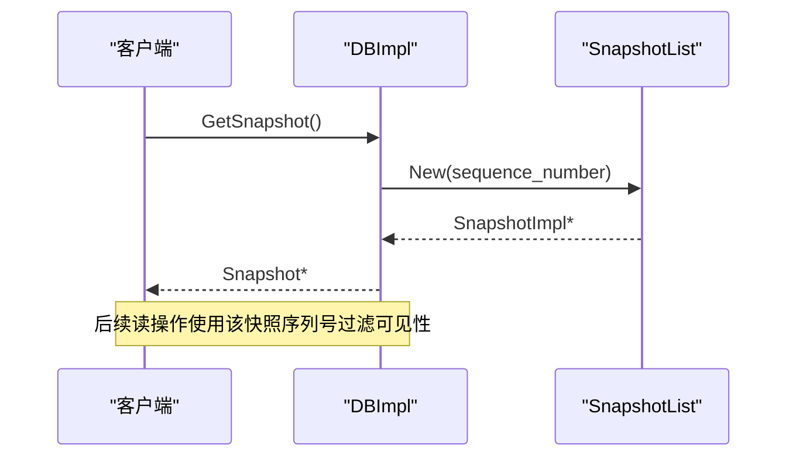
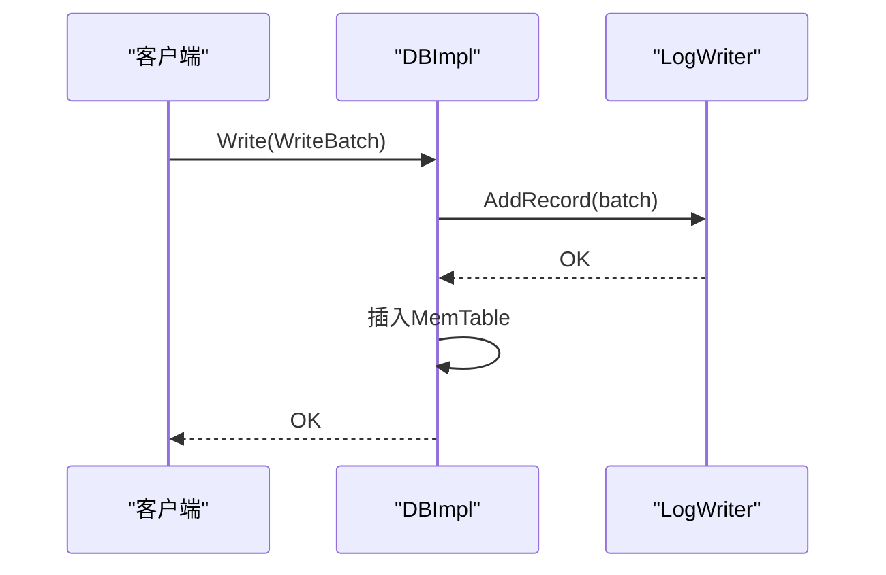
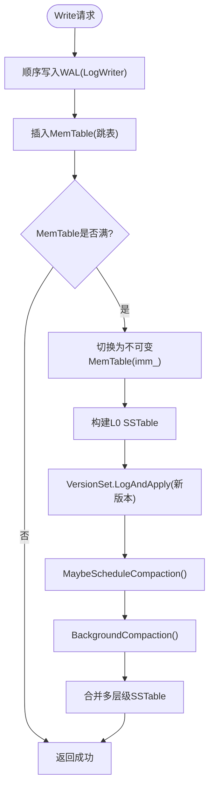
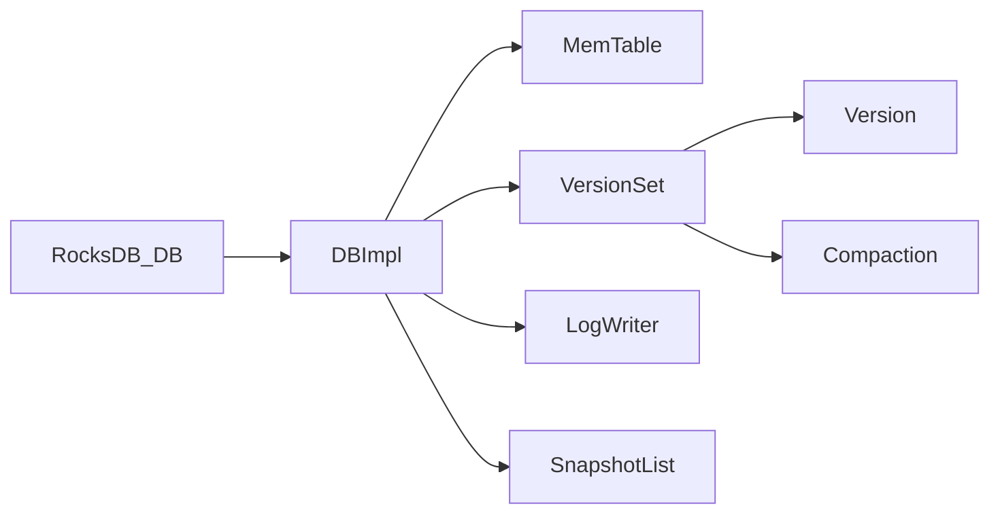

# LSM树架构设计

<cite>
**本文引用的文件**   
- [leveldb-main/db/memtable.h](file://source/leveldb-main/db/memtable.h)
- [leveldb-main/db/version_set.h](file://source/leveldb-main/db/version_set.h)
- [leveldb-main/db/snapshot.h](file://source/leveldb-main/db/snapshot.h)
- [leveldb-main/db/db_impl.h](file://source/leveldb-main/db/db_impl.h)
- [leveldb-main/db/log_writer.h](file://source/leveldb-main/db/log_writer.h)
- [rocksdb/include/rocksdb/db.h](file://source/rocksdb/include/rocksdb/db.h)
</cite>

## 目录
1. [简介](#简介)
2. [项目结构](#项目结构)
3. [核心组件](#核心组件)
4. [架构总览](#架构总览)
5. [详细组件分析](#详细组件分析)
6. [依赖关系分析](#依赖关系分析)
7. [性能考量](#性能考量)
8. [故障排查指南](#故障排查指南)
9. [结论](#结论)
10. [附录](#附录)

## 简介
本技术文档围绕LSM（Log-Structured-Merge）树架构展开，结合仓库中的LevelDB与RocksDB源码片段，系统阐述MemTable、SSTable与Compaction机制的工作原理；完整描述数据写入路径（WAL→MemTable→SSTable），并解释版本管理、快照机制与一致性保证。文档既为初学者提供概念性理解，也为有经验的开发者提供实现细节与优化策略。

## 项目结构
仓库包含多个数据库引擎的实现与基准测试脚本，其中与LSM树最相关的核心代码位于：
- LevelDB实现：db层（memtable、version_set、snapshot、db_impl、log_writer等）
- RocksDB接口：include/rocksdb/db.h等对外API定义

图表来源
- [leveldb-main/db/db_impl.h:1-218](file://source/leveldb-main/db/db_impl.h#L1-L218)
- [leveldb-main/db/memtable.h:1-88](file://source/leveldb-main/db/memtable.h#L1-L88)
- [leveldb-main/db/version_set.h:1-394](file://source/leveldb-main/db/version_set.h#L1-L394)
- [leveldb-main/db/snapshot.h:1-96](file://source/leveldb-main/db/snapshot.h#L1-L96)
- [leveldb-main/db/log_writer.h:1-55](file://source/leveldb-main/db/log_writer.h#L1-L55)
- [rocksdb/include/rocksdb/db.h:1-200](file://source/rocksdb/include/rocksdb/db.h#L1-L200)

章节来源
- [leveldb-main/db/db_impl.h:1-218](file://source/leveldb-main/db/db_impl.h#L1-L218)
- [leveldb-main/db/memtable.h:1-88](file://source/leveldb-main/db/memtable.h#L1-L88)
- [leveldb-main/db/version_set.h:1-394](file://source/leveldb-main/db/version_set.h#L1-L394)
- [leveldb-main/db/snapshot.h:1-96](file://source/leveldb-main/db/snapshot.h#L1-L96)
- [leveldb-main/db/log_writer.h:1-55](file://source/leveldb-main/db/log_writer.h#L1-L55)
- [rocksdb/include/rocksdb/db.h:1-200](file://source/rocksdb/include/rocksdb/db.h#L1-L200)

## 核心组件
- MemTable：基于跳表的内存有序表，支持高并发插入与迭代，作为WAL落盘前的缓冲。
- VersionSet/Version：维护多版本SSTable集合、层级结构与Compaction决策。
- Compaction：将多层级SSTable合并，消除过期键、减少读放大与写放大。
- Snapshot：通过序列号与双向链表维持一致读视图。
- WAL（Log Writer）：顺序追加日志，保障崩溃恢复与原子提交。
- DBImpl：协调写入、刷新、后台Compaction与版本切换。

章节来源
- [leveldb-main/db/memtable.h:1-88](file://source/leveldb-main/db/memtable.h#L1-L88)
- [leveldb-main/db/version_set.h:1-394](file://source/leveldb-main/db/version_set.h#L1-L394)
- [leveldb-main/db/snapshot.h:1-96](file://source/leveldb-main/db/snapshot.h#L1-L96)
- [leveldb-main/db/db_impl.h:1-218](file://source/leveldb-main/db/db_impl.h#L1-L218)
- [leveldb-main/db/log_writer.h:1-55](file://source/leveldb-main/db/log_writer.h#L1-L55)

## 架构总览
LSM树将随机写转化为顺序写，通过多级不可变SSTable与后台Compaction控制存储形态与查询性能。

图表来源
- [leveldb-main/db/db_impl.h:1-218](file://source/leveldb-main/db/db_impl.h#L1-L218)
- [leveldb-main/db/memtable.h:1-88](file://source/leveldb-main/db/memtable.h#L1-L88)
- [leveldb-main/db/version_set.h:1-394](file://source/leveldb-main/db/version_set.h#L1-L394)
- [leveldb-main/db/snapshot.h:1-96](file://source/leveldb-main/db/snapshot.h#L1-L96)
- [leveldb-main/db/log_writer.h:1-55](file://source/leveldb-main/db/log_writer.h#L1-L55)

## 详细组件分析

### MemTable（内存表）
- 数据结构：内部使用跳表组织Key-Value，按内部键排序，支持高效查找与迭代。
- 线程安全：引用计数管理生命周期，外部需保证迭代期间对象存活。
- 写入路径：接收带序列号的记录，用于后续合并与冲突消解。
- 复杂度：插入O(log N)，查找O(log N)，近似内存占用估算可用。

图表来源
- [leveldb-main/db/memtable.h:1-88](file://source/leveldb-main/db/memtable.h#L1-L88)

章节来源
- [leveldb-main/db/memtable.h:1-88](file://source/leveldb-main/db/memtable.h#L1-L88)

### VersionSet与Version（版本与层级管理）
- Version：保存每个层级的SSTable文件列表，提供合并迭代器、范围重叠判断、统计采样等能力。
- VersionSet：维护当前版本与历史版本链，负责应用版本变更（LogAndApply）、选择Compaction输入、生成迭代器等。
- Compaction：封装一次合并任务，包括输入文件选择、输出大小限制、停止条件、增量编辑等。

图表来源
- [leveldb-main/db/version_set.h:1-394](file://source/leveldb-main/db/version_set.h#L1-L394)

章节来源
- [leveldb-main/db/version_set.h:1-394](file://source/leveldb-main/db/version_set.h#L1-L394)

### Snapshot（快照与一致性）
- 快照以序列号为标识，保存在双向循环链表中，确保读操作可看到一致的数据视图。
- 创建快照时记录当前最大序列号，删除时从链表移除并释放资源。

图表来源
- [leveldb-main/db/snapshot.h:1-96](file://source/leveldb-main/db/snapshot.h#L1-L96)
- [leveldb-main/db/db_impl.h:1-218](file://source/leveldb-main/db/db_impl.h#L1-L218)

章节来源
- [leveldb-main/db/snapshot.h:1-96](file://source/leveldb-main/db/snapshot.h#L1-L96)
- [leveldb-main/db/db_impl.h:1-218](file://source/leveldb-main/db/db_impl.h#L1-L218)

### WAL写入器（Log Writer）
- 将记录顺序追加到持久化文件，提供CRC校验与类型头，确保崩溃后可恢复。
- 写入路径在DBImpl中调用，先写WAL再入MemTable，保证原子性与持久性。

图表来源
- [leveldb-main/db/log_writer.h:1-55](file://source/leveldb-main/db/log_writer.h#L1-L55)
- [leveldb-main/db/db_impl.h:1-218](file://source/leveldb-main/db/db_impl.h#L1-L218)

章节来源
- [leveldb-main/db/log_writer.h:1-55](file://source/leveldb-main/db/log_writer.h#L1-L55)
- [leveldb-main/db/db_impl.h:1-218](file://source/leveldb-main/db/db_impl.h#L1-L218)

### 数据写入路径（WAL→MemTable→SSTable）
- 写入流程：
  1) 将WriteBatch序列化后顺序写入WAL（LogWriter）。
  2) 将记录插入当前MemTable（跳表）。
  3) 当MemTable达到阈值或触发Flush，切换到不可变MemTable（imm_）。
  4) 后台线程将imm_刷成L0的SSTable，并通过VersionSet安装新版本。
  5) 后台Compaction逐步将L0/L1/...合并至更高层，降低读放大。

图表来源
- [leveldb-main/db/db_impl.h:1-218](file://source/leveldb-main/db/db_impl.h#L1-L218)
- [leveldb-main/db/log_writer.h:1-55](file://source/leveldb-main/db/log_writer.h#L1-L55)
- [leveldb-main/db/version_set.h:1-394](file://source/leveldb-main/db/version_set.h#L1-L394)

章节来源
- [leveldb-main/db/db_impl.h:1-218](file://source/leveldb-main/db/db_impl.h#L1-L218)
- [leveldb-main/db/log_writer.h:1-55](file://source/leveldb-main/db/log_writer.h#L1-L55)
- [leveldb-main/db/version_set.h:1-394](file://source/leveldb-main/db/version_set.h#L1-L394)

### 版本管理与一致性保证
- 版本链：VersionSet维护当前版本与历史版本，迭代器与快照持有相应版本的引用，避免被回收。
- 一致性：快照基于序列号，读路径根据快照序列号决定可见的记录（MemTable与SSTable均按序列号过滤）。
- 原子性：WAL先于MemTable写入，崩溃恢复时重放WAL；版本切换通过LogAndApply原子更新manifest。

章节来源
- [leveldb-main/db/version_set.h:1-394](file://source/leveldb-main/db/version_set.h#L1-L394)
- [leveldb-main/db/snapshot.h:1-96](file://source/leveldb-main/db/snapshot.h#L1-L96)
- [leveldb-main/db/db_impl.h:1-218](file://source/leveldb-main/db/db_impl.h#L1-L218)

### Compaction机制
- 触发条件：Version::UpdateStats与ReadSample积累统计，VersionSet.NeedsCompaction判定是否需要合并。
- 输入选择：PickCompaction/CompactRange确定要合并的文件集合与目标层级。
- 合并过程：按内部键归并，去重与删除标记处理，生成新SSTable；完成后通过InstallCompactionResults更新版本。
- 优化点：IsTrivialMove快速移动文件；ShouldStopBefore控制输出边界；grandparent重叠字节控制写放大。

章节来源
- [leveldb-main/db/version_set.h:1-394](file://source/leveldb-main/db/version_set.h#L1-L394)
- [leveldb-main/db/db_impl.h:1-218](file://source/leveldb-main/db/db_impl.h#L1-L218)

### RocksDB接口与扩展
- RocksDB的DB抽象提供了更丰富的API（列族、事务、监听器等），但底层LSM原理与LevelDB一致。
- 可通过RocksDB选项调整MemTable、SSTable、Compaction行为，以获得更好的吞吐与延迟。

章节来源
- [rocksdb/include/rocksdb/db.h:1-200](file://source/rocksdb/include/rocksdb/db.h#L1-L200)

## 依赖关系分析
- DBImpl依赖MemTable进行写入缓冲，依赖VersionSet进行版本与Compaction调度，依赖LogWriter进行WAL持久化，依赖SnapshotList管理快照。
- VersionSet依赖Version与Compaction完成层级管理与合并。
- RocksDB DB接口向上暴露统一API，向下对接具体实现。

图表来源
- [leveldb-main/db/db_impl.h:1-218](file://source/leveldb-main/db/db_impl.h#L1-L218)
- [leveldb-main/db/version_set.h:1-394](file://source/leveldb-main/db/version_set.h#L1-L394)
- [leveldb-main/db/memtable.h:1-88](file://source/leveldb-main/db/memtable.h#L1-L88)
- [leveldb-main/db/log_writer.h:1-55](file://source/leveldb-main/db/log_writer.h#L1-L55)
- [leveldb-main/db/snapshot.h:1-96](file://source/leveldb-main/db/snapshot.h#L1-L96)
- [rocksdb/include/rocksdb/db.h:1-200](file://source/rocksdb/include/rocksdb/db.h#L1-L200)

章节来源
- [leveldb-main/db/db_impl.h:1-218](file://source/leveldb-main/db/db_impl.h#L1-L218)
- [leveldb-main/db/version_set.h:1-394](file://source/leveldb-main/db/version_set.h#L1-L394)
- [leveldb-main/db/memtable.h:1-88](file://source/leveldb-main/db/memtable.h#L1-L88)
- [leveldb-main/db/log_writer.h:1-55](file://source/leveldb-main/db/log_writer.h#L1-L55)
- [leveldb-main/db/snapshot.h:1-96](file://source/leveldb-main/db/snapshot.h#L1-L96)
- [rocksdb/include/rocksdb/db.h:1-200](file://source/rocksdb/include/rocksdb/db.h#L1-L200)

## 性能考量
- 写入路径优化：WAL顺序写+跳表插入，避免随机IO；合理设置MemTable大小与批大小以降低锁竞争。
- 读路径优化：利用Version.AddIterators构造分层迭代器，配合Bloom Filter（若启用）减少磁盘访问。
- Compaction调优：控制层级数量、文件大小、Grandparent重叠阈值，平衡写放大与读放大。
- 缓存与I/O：TableCache与Block Cache命中提升读性能；异步后台线程避免阻塞前台读写。

[本节为通用指导，不直接分析具体文件]

## 故障排查指南
- WAL损坏或截断：检查LogWriter写入状态与文件完整性，必要时从最近Manifest恢复。
- MemTable泄漏：确认Ref/Unref配对，避免迭代器持有引用导致无法释放。
- Compaction风暴：监控VersionSet.NeedsCompaction与统计采样，调整参数避免频繁合并。
- 快照未释放：确保ReleaseSnapshot及时调用，防止SnapshotList膨胀。

章节来源
- [leveldb-main/db/log_writer.h:1-55](file://source/leveldb-main/db/log_writer.h#L1-L55)
- [leveldb-main/db/memtable.h:1-88](file://source/leveldb-main/db/memtable.h#L1-L88)
- [leveldb-main/db/version_set.h:1-394](file://source/leveldb-main/db/version_set.h#L1-L394)
- [leveldb-main/db/snapshot.h:1-96](file://source/leveldb-main/db/snapshot.h#L1-L96)
- [leveldb-main/db/db_impl.h:1-218](file://source/leveldb-main/db/db_impl.h#L1-L218)

## 结论
LSM树通过WAL、MemTable与SSTable的分层设计，将随机写转换为顺序写，并以后台Compaction控制存储形态与查询效率。版本管理与快照机制保证了强一致性与可重复读。结合LevelDB与RocksDB的实现细节，可在不同场景下通过参数调优获得最佳性能。

[本节为总结性内容，不直接分析具体文件]

## 附录
- 术语对照：
  - WAL：预写日志（Write-Ahead Log）
  - MemTable：内存有序表（跳表）
  - SSTable：不可变排序表（Sorted String Table）
  - Compaction：合并压缩
  - VersionSet：版本集合
  - Snapshot：快照

[本节为概念性说明，不直接分析具体文件]