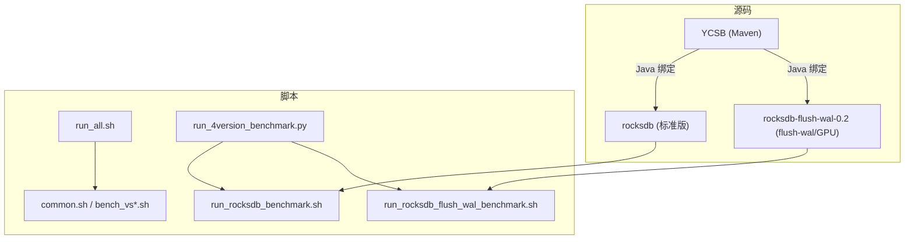
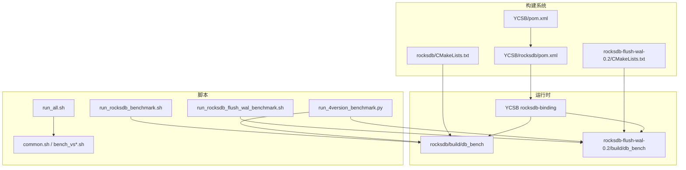
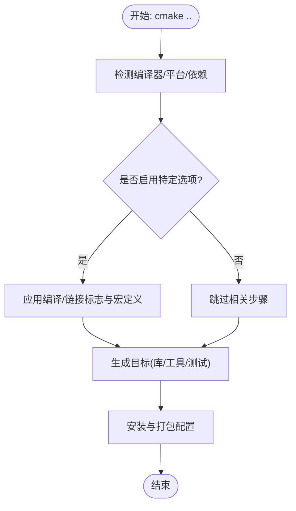
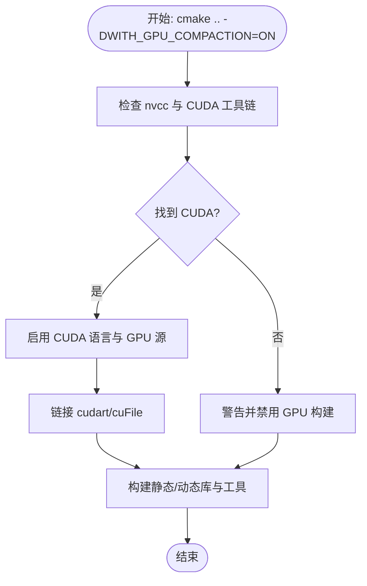
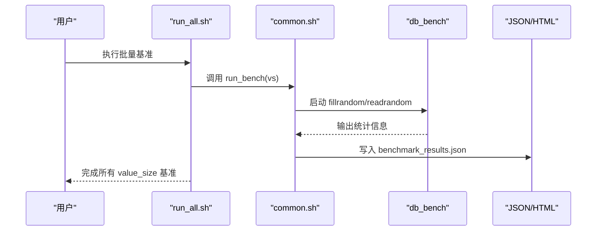
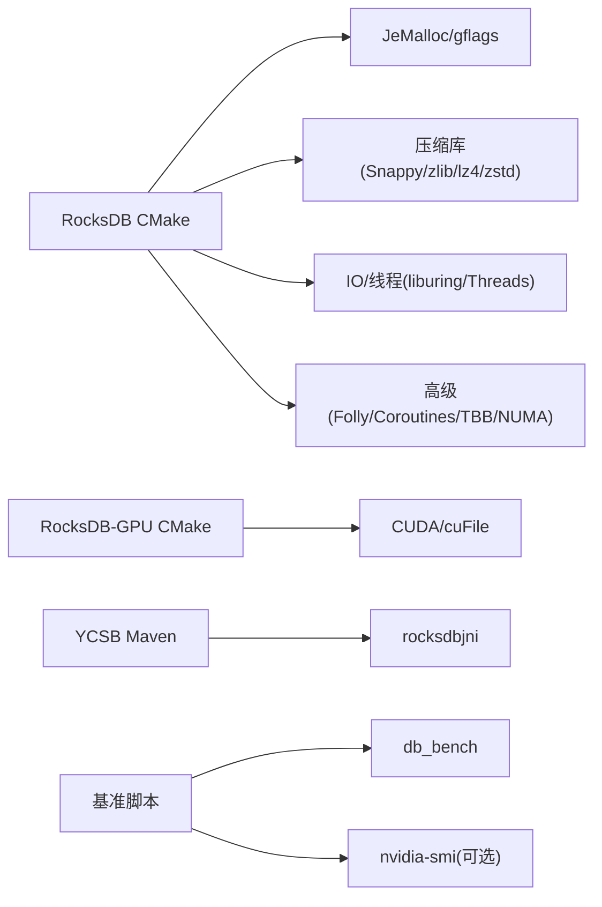

# 多版本管理架构

<cite>
**本文引用的文件**   
- [CMakeLists.txt](file://source/rocksdb/CMakeLists.txt)
- [CMakeLists.txt](file://source/rocksdb-flush-wal-0.2/CMakeLists.txt)
- [pom.xml](file://source/YCSB/pom.xml)
- [pom.xml](file://source/YCSB/rocksdb/pom.xml)
- [run_all.sh](file://script/run_all.sh)
- [common.sh](file://script/common.sh)
- [bench_vs1024.sh](file://script/bench_vs1024.sh)
- [run_rocksdb_benchmark.sh](file://script/run_rocksdb_benchmark.sh)
- [run_rocksdb_flush_wal_benchmark.sh](file://script/run_rocksdb_flush_wal_benchmark.sh)
- [run_4version_benchmark.py](file://script/run_4version_benchmark.py)
</cite>

## 目录
1. [简介](#简介)
2. [项目结构](#项目结构)
3. [核心组件](#核心组件)
4. [架构总览](#架构总览)
5. [详细组件分析](#详细组件分析)
6. [依赖关系分析](#依赖关系分析)
7. [性能考量](#性能考量)
8. [故障排查指南](#故障排查指南)
9. [结论](#结论)
10. [附录](#附录)

## 简介
本技术文档面向“多版本管理架构”，聚焦于如何构建与管理多个 RocksDB 变体（标准版、flush-wal 优化版、GPU 加速版等），并说明 CMake 构建选项与依赖库版本控制策略。同时，文档阐述 YCSB 基准测试框架的集成方式与配置管理，提供版本兼容性矩阵与迁移指南，以及开发环境搭建与版本切换的最佳实践。

## 项目结构
仓库采用“源码 + 脚本”的分层组织：
- source/rocksdb：RocksDB 标准版源码与 CMake 构建定义
- source/rocksdb-flush-wal-0.2：RocksDB flush-wal 优化版源码与 CMake 构建定义（含 GPU 编译开关）
- source/YCSB：YCSB 多模块 Maven 工程，包含 rocksdb-binding 子模块
- script：基准测试与报告生成脚本（Shell/Python）



**图示来源** 
- [CMakeLists.txt](file://source/rocksdb/CMakeLists.txt)
- [CMakeLists.txt](file://source/rocksdb-flush-wal-0.2/CMakeLists.txt)
- [pom.xml](file://source/YCSB/pom.xml)
- [run_all.sh](file://script/run_all.sh)
- [common.sh](file://script/common.sh)
- [bench_vs1024.sh](file://script/bench_vs1024.sh)
- [run_rocksdb_benchmark.sh](file://script/run_rocksdb_benchmark.sh)
- [run_rocksdb_flush_wal_benchmark.sh](file://script/run_rocksdb_flush_wal_benchmark.sh)
- [run_4version_benchmark.py](file://script/run_4version_benchmark.py)

**章节来源**
- [CMakeLists.txt](file://source/rocksdb/CMakeLists.txt)
- [CMakeLists.txt](file://source/rocksdb-flush-wal-0.2/CMakeLists.txt)
- [pom.xml](file://source/YCSB/pom.xml)
- [run_all.sh](file://script/run_all.sh)
- [common.sh](file://script/common.sh)
- [bench_vs1024.sh](file://script/bench_vs1024.sh)
- [run_rocksdb_benchmark.sh](file://script/run_rocksdb_benchmark.sh)
- [run_rocksdb_flush_wal_benchmark.sh](file://script/run_rocksdb_flush_wal_benchmark.sh)
- [run_4version_benchmark.py](file://script/run_4version_benchmark.py)

## 核心组件
- RocksDB 标准版构建系统：通过 CMake 管理编译选项、第三方依赖与目标产物（静态/动态库、工具）。
- RocksDB flush-wal/GPU 版构建系统：在标准版基础上增加 GPU 编译开关与 CUDA 依赖处理。
- YCSB 构建系统：Maven 聚合工程，统一管理各 binding 版本，其中 rocksdb-binding 依赖 rocksdbjni。
- 基准测试脚本：Shell 与 Python 脚本组合，驱动 db_bench 执行不同 value_size 场景，输出 JSON/HTML 报告。

**章节来源**
- [CMakeLists.txt](file://source/rocksdb/CMakeLists.txt)
- [CMakeLists.txt](file://source/rocksdb-flush-wal-0.2/CMakeLists.txt)
- [pom.xml](file://source/YCSB/pom.xml)
- [pom.xml](file://source/YCSB/rocksdb/pom.xml)
- [run_all.sh](file://script/run_all.sh)
- [common.sh](file://script/common.sh)
- [bench_vs1024.sh](file://script/bench_vs1024.sh)
- [run_rocksdb_benchmark.sh](file://script/run_rocksdb_benchmark.sh)
- [run_rocksdb_flush_wal_benchmark.sh](file://script/run_rocksdb_flush_wal_benchmark.sh)
- [run_4version_benchmark.py](file://script/run_4version_benchmark.py)

## 架构总览
下图展示多版本 RocksDB 与 YCSB、基准脚本之间的交互关系。



**图示来源** 
- [CMakeLists.txt](file://source/rocksdb/CMakeLists.txt)
- [CMakeLists.txt](file://source/rocksdb-flush-wal-0.2/CMakeLists.txt)
- [pom.xml](file://source/YCSB/pom.xml)
- [pom.xml](file://source/YCSB/rocksdb/pom.xml)
- [run_all.sh](file://script/run_all.sh)
- [common.sh](file://script/common.sh)
- [bench_vs1024.sh](file://script/bench_vs1024.sh)
- [run_rocksdb_benchmark.sh](file://script/run_rocksdb_benchmark.sh)
- [run_rocksdb_flush_wal_benchmark.sh](file://script/run_rocksdb_flush_wal_benchmark.sh)
- [run_4version_benchmark.py](file://script/run_4version_benchmark.py)

## 详细组件分析

### RocksDB 标准版构建系统（CMake）
- 语言与编译器：默认 C++20；支持 GCC/Clang/MSVC；可启用 ccache 加速。
- 关键选项：WITH_JEMALLOC、WITH_SNAPPY、WITH_LZ4、WITH_ZLIB、WITH_ZSTD、WITH_LIBURING、WITH_GFLAGS、USE_FOLLY、USE_COROUTINES、ROCKSDB_BUILD_SHARED、WITH_TESTS、WITH_BENCHMARK_TOOLS、WITH_CORE_TOOLS、WITH_TOOLS、WITH_JNI 等。
- 平台特性检测：原子操作、fallocate、sync_file_range、pthread 自适应互斥、NUMA、TBB、ASan/TSan/UBSan 等。
- 产物：静态库、共享库、工具（如 db_bench）、安装与打包配置。



**图示来源** 
- [CMakeLists.txt](file://source/rocksdb/CMakeLists.txt)

**章节来源**
- [CMakeLists.txt](file://source/rocksdb/CMakeLists.txt)

### RocksDB flush-wal/GPU 版构建系统（CMake）
- 新增 GPU 编译开关：WITH_GPU_COMPACTION，启用后引入 CUDA 语言支持与 cuFile（GDS）库查找。
- 条件编译：当 WITH_GPU_COMPACTION=ON 时，添加 GPU 源文件并链接 CUDA/cuFile；否则回退到纯 CPU 构建。
- 其余构建流程与标准版一致（依赖检测、选项、产物）。



**图示来源** 
- [CMakeLists.txt](file://source/rocksdb-flush-wal-0.2/CMakeLists.txt)

**章节来源**
- [CMakeLists.txt](file://source/rocksdb-flush-wal-0.2/CMakeLists.txt)

### YCSB 构建系统与 RocksDB 绑定
- 顶层 pom.xml：聚合 core、binding-parent、distribution 与各数据库 binding 模块；集中声明依赖版本（如 rocksdb.version）。
- rocksdb-binding/pom.xml：依赖 org.rocksdb:rocksdbjni，版本由父 POM 属性 ${rocksdb.version} 控制。
- 构建流程：Maven 统一编译打包，便于 Java 应用以 YCSB 形式调用 RocksDB。

```mermaid
classDiagram
class YCSBRoot {
+modules : ["core","binding-parent","distribution", ...]
+properties : {rocksdb.version}
}
class RocksDBBinding {
+artifactId : "rocksdb-binding"
+dependencies : ["rocksdbjni", "core", "slf4j"]
}
YCSBRoot --> RocksDBBinding : "包含模块"
```

**图示来源** 
- [pom.xml](file://source/YCSB/pom.xml)
- [pom.xml](file://source/YCSB/rocksdb/pom.xml)

**章节来源**
- [pom.xml](file://source/YCSB/pom.xml)
- [pom.xml](file://source/YCSB/rocksdb/pom.xml)

### 基准测试脚本与数据流
- run_all.sh：顺序执行不同 value_size 的基准脚本，产出 output/vs*/benchmark_results.json。
- common.sh：封装参数解析、db_bench 执行、指标解析、JSON 结果写入与硬件信息采集。
- bench_vs1024.sh：调用 common.sh 运行 1KB value 场景。
- run_rocksdb_benchmark.sh / run_rocksdb_flush_wal_benchmark.sh：分别针对标准版与 flush-wal 版执行 2GB 数据集基准并生成 HTML 报告。
- run_4version_benchmark.py：并行/串行对比多个 RocksDB 版本（标准版、flush-gpu、flush-wal、flush-wal-0.2），汇总 JSON 并生成对比 HTML。



**图示来源** 
- [run_all.sh](file://script/run_all.sh)
- [common.sh](file://script/common.sh)
- [bench_vs1024.sh](file://script/bench_vs1024.sh)
- [run_rocksdb_benchmark.sh](file://script/run_rocksdb_benchmark.sh)
- [run_rocksdb_flush_wal_benchmark.sh](file://script/run_rocksdb_flush_wal_benchmark.sh)
- [run_4version_benchmark.py](file://script/run_4version_benchmark.py)

**章节来源**
- [run_all.sh](file://script/run_all.sh)
- [common.sh](file://script/common.sh)
- [bench_vs1024.sh](file://script/bench_vs1024.sh)
- [run_rocksdb_benchmark.sh](file://script/run_rocksdb_benchmark.sh)
- [run_rocksdb_flush_wal_benchmark.sh](file://script/run_rocksdb_flush_wal_benchmark.sh)
- [run_4version_benchmark.py](file://script/run_4version_benchmark.py)

## 依赖关系分析
- RocksDB 依赖：可选 JeMalloc、gflags、Snappy、zlib、lz4、zstd、liburing、NUMA、TBB、Folly/Coroutines、Threads、CUDA（GPU 版）。
- YCSB 依赖：rocksdbjni（版本由父 POM 属性管理）、core、日志与测试依赖。
- 脚本依赖：db_bench 二进制、nvidia-smi（可选）、Python3、Maven（YCSB 构建）。



**图示来源** 
- [CMakeLists.txt](file://source/rocksdb/CMakeLists.txt)
- [CMakeLists.txt](file://source/rocksdb-flush-wal-0.2/CMakeLists.txt)
- [pom.xml](file://source/YCSB/pom.xml)
- [pom.xml](file://source/YCSB/rocksdb/pom.xml)

**章节来源**
- [CMakeLists.txt](file://source/rocksdb/CMakeLists.txt)
- [CMakeLists.txt](file://source/rocksdb-flush-wal-0.2/CMakeLists.txt)
- [pom.xml](file://source/YCSB/pom.xml)
- [pom.xml](file://source/YCSB/rocksdb/pom.xml)

## 性能考量
- 构建优化：启用 ccache、选择合适 BUILD_TYPE（Release/RelWithDebInfo/Debug）、按需开启 RTTI/ASAN/TSAN/UBSAN。
- 指令集与平台：PORTABLE 控制最小 CPU 架构；x86_64 下可使用 AVX2/SSE4.2/PCLMUL；ARMv8 可用 crc/crypto 扩展。
- I/O 与内存：liburing 提升异步 I/O；JeMalloc 改善内存分配性能；NUMA/TBB 提升多线程吞吐。
- GPU 加速：WITH_GPU_COMPACTION 启用后，compaction 路径使用 GPU 计算与可能的 GDS（cuFile）直存。
- 基准一致性：固定 key/value size、threads、compression、seed，确保跨版本可比性。

[本节为通用指导，不直接分析具体文件]

## 故障排查指南
- 找不到 CUDA/nvcc：确认 CUDA_HOME 或 PATH；若未找到将自动禁用 GPU 构建并给出警告。
- 链接失败（缺少库）：检查 WITH_* 选项对应的依赖是否安装且路径正确（如 Snappy、zstd、lz4、jemalloc、gflags、folly）。
- 运行时库加载错误：确保 LD_LIBRARY_PATH 指向对应版本的 build 目录（脚本中已设置）。
- YCSB 构建失败：确认 Maven 版本与 JDK 版本满足要求；rocksdb.version 需与绑定的 rocksdbjni 兼容。
- 基准输出为空：检查 db_bench 路径与权限；确认输出目录可写；查看 stderr 输出定位问题。

**章节来源**
- [CMakeLists.txt](file://source/rocksdb-flush-wal-0.2/CMakeLists.txt)
- [run_rocksdb_benchmark.sh](file://script/run_rocksdb_benchmark.sh)
- [run_rocksdb_flush_wal_benchmark.sh](file://script/run_rocksdb_flush_wal_benchmark.sh)
- [run_4version_benchmark.py](file://script/run_4version_benchmark.py)

## 结论
本项目通过 CMake 与 Maven 双构建体系，实现了对 RocksDB 多版本（标准版、flush-wal/GPU 版）的统一管理与灵活构建。脚本层提供了标准化的基准测试流程与报告生成能力，便于在不同版本间进行性能对比与回归验证。建议在生产与研发环境中严格管理依赖版本与构建选项，并通过自动化脚本保障一致性。

[本节为总结性内容，不直接分析具体文件]

## 附录

### 构建与运行要点
- 标准版构建：进入 source/rocksdb，创建 build 目录，执行 cmake .. 与 make；产物位于 build/db_bench。
- GPU 版构建：进入 source/rocksdb-flush-wal-0.2，cmake .. -DWITH_GPU_COMPACTION=ON 并构建。
- YCSB 构建：在 source/YCSB 根目录执行 mvn 构建；rocksdb-binding 依赖 rocksdbjni 版本由父 POM 属性控制。
- 基准执行：使用 script 下的脚本执行不同 value_size 或 2GB 数据集基准，结果输出至 output 或 /tmp 目录。

**章节来源**
- [CMakeLists.txt](file://source/rocksdb/CMakeLists.txt)
- [CMakeLists.txt](file://source/rocksdb-flush-wal-0.2/CMakeLists.txt)
- [pom.xml](file://source/YCSB/pom.xml)
- [run_all.sh](file://script/run_all.sh)
- [common.sh](file://script/common.sh)
- [bench_vs1024.sh](file://script/bench_vs1024.sh)
- [run_rocksdb_benchmark.sh](file://script/run_rocksdb_benchmark.sh)
- [run_rocksdb_flush_wal_benchmark.sh](file://script/run_rocksdb_flush_wal_benchmark.sh)
- [run_4version_benchmark.py](file://script/run_4version_benchmark.py)

### 版本兼容性矩阵（基于仓库现状）
- RocksDB 标准版：C++20，GCC>=11/Clang>=10，可选依赖按 WITH_* 选项启用。
- RocksDB flush-wal/GPU 版：额外需要 CUDA 工具链；WITH_GPU_COMPACTION=ON 时启用 GPU 编译与链接。
- YCSB：Maven 构建，rocksdb.version 由父 POM 属性管理（当前示例为 6.2.2），需与 rocksdbjni 版本匹配。

**章节来源**
- [CMakeLists.txt](file://source/rocksdb/CMakeLists.txt)
- [CMakeLists.txt](file://source/rocksdb-flush-wal-0.2/CMakeLists.txt)
- [pom.xml](file://source/YCSB/pom.xml)
- [pom.xml](file://source/YCSB/rocksdb/pom.xml)

### 迁移指南（从标准版到 flush-wal/GPU 版）
- 代码与构建：切换到 source/rocksdb-flush-wal-0.2，启用 WITH_GPU_COMPACTION 并安装 CUDA。
- 依赖与环境：更新 LD_LIBRARY_PATH 指向新 build 目录；确保 nvidia-smi 可用（如需 GPU 采样）。
- 基准脚本：使用 run_rocksdb_flush_wal_benchmark.sh 或 run_4version_benchmark.py 进行对比。
- YCSB 绑定：保持 rocksdb.version 与 rocksdbjni 一致，必要时升级父 POM 属性。

**章节来源**
- [CMakeLists.txt](file://source/rocksdb-flush-wal-0.2/CMakeLists.txt)
- [run_rocksdb_flush_wal_benchmark.sh](file://script/run_rocksdb_flush_wal_benchmark.sh)
- [run_4version_benchmark.py](file://script/run_4version_benchmark.py)
- [pom.xml](file://source/YCSB/pom.xml)
- [pom.xml](file://source/YCSB/rocksdb/pom.xml)

### 开发环境与版本切换最佳实践
- 隔离构建目录：每个版本独立 build 目录，避免库冲突。
- 环境变量管理：通过脚本统一设置 LD_LIBRARY_PATH，避免手动维护。
- 自动化对比：使用 run_4version_benchmark.py 一键生成对比报告，减少人为误差。
- 版本锁定：在 POM 与 CMake 选项中明确依赖版本，确保可重复构建。

**章节来源**
- [run_4version_benchmark.py](file://script/run_4version_benchmark.py)
- [run_rocksdb_benchmark.sh](file://script/run_rocksdb_benchmark.sh)
- [run_rocksdb_flush_wal_benchmark.sh](file://script/run_rocksdb_flush_wal_benchmark.sh)
- [pom.xml](file://source/YCSB/pom.xml)
- [CMakeLists.txt](file://source/rocksdb/CMakeLists.txt)
- [CMakeLists.txt](file://source/rocksdb-flush-wal-0.2/CMakeLists.txt)