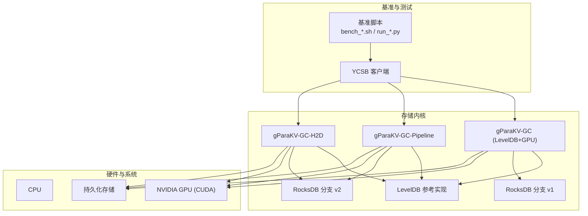
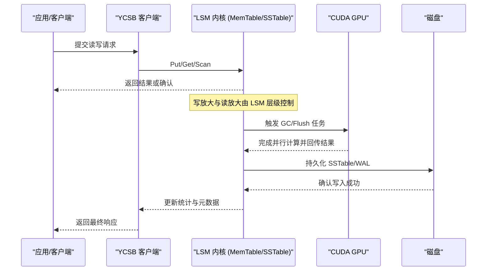
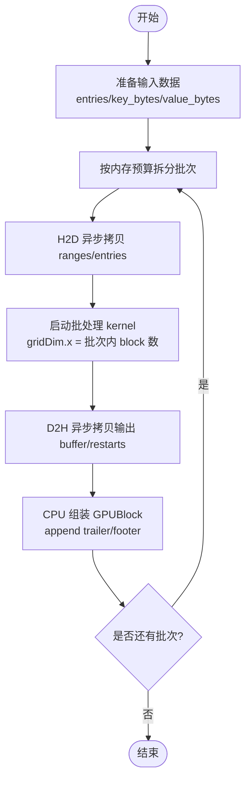
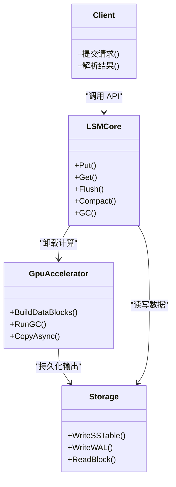
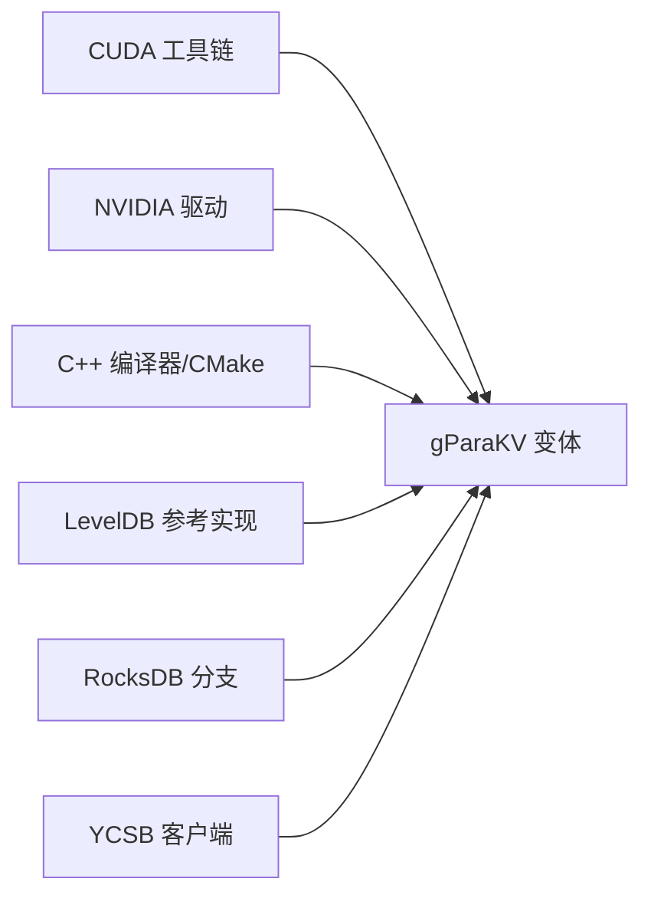

# 技术架构概览

<cite>
**本文引用的文件**   
- [README.md](file://source/gParaKV-GC-master/README.md)
- [README.md](file://source/gParaKV-GC-pipeline/README.md)
- [README.md](file://source/gParaKV-GC-pipeline-h2d/README.md)
- [修改建议.txt](file://source/rocksdb-flush-wal-0.2/修改建议.txt)
</cite>

## 目录
1. [引言](#引言)
2. [项目结构](#项目结构)
3. [核心组件](#核心组件)
4. [架构总览](#架构总览)
5. [详细组件分析](#详细组件分析)
6. [依赖关系分析](#依赖关系分析)
7. [性能考量](#性能考量)
8. [故障排查指南](#故障排查指南)
9. [结论](#结论)
10. [附录](#附录)

## 引言
本技术架构概览面向 metadata_offload 项目，聚焦以下目标：
- 基于 LSM 树的设计模式与 Log-Structured-Merge-Tree 的工作原理和优势
- CUDA GPU 加速的集成方式，包括内存管理、数据传输与并行处理策略
- 多版本 RocksDB 支持的架构设计，涵盖不同版本代码库与配置的管理思路
- 组件间的交互关系与数据流向
- 为初学者提供架构层面的理解，为有经验的开发者提供可落地的技术细节

本项目围绕 LevelDB/RocksDB 的 LSM 内核进行扩展，引入 GPU 加速的垃圾回收（GC）与 flush 构建路径，并通过 YCSB 等基准工具验证吞吐、延迟与空间放大指标。仓库内包含多个 gParaKV 变体与 RocksDB 分支，便于对比实验与演进优化。

## 项目结构
仓库采用“多子模块 + 多版本”的组织方式：
- source/YCSB：YCSB 客户端与多种后端绑定，用于端到端基准测试
- source/gParaKV-GC-*：基于 LevelDB 1.23 的 gParaKV 实现，含 CUDA 内核与 GC 能力
- source/leveldb-main：上游 LevelDB 参考实现
- source/rocksdb*：多个 RocksDB 分支，用于 flush/WAL/GPU 压缩等特性探索
- script：基准脚本与报告生成工具

图表来源 
- [README.md](file://source/gParaKV-GC-master/README.md)
- [README.md](file://source/gParaKV-GC-pipeline/README.md)
- [README.md](file://source/gParaKV-GC-pipeline-h2d/README.md)

章节来源
- [README.md](file://source/gParaKV-GC-master/README.md)
- [README.md](file://source/gParaKV-GC-pipeline/README.md)
- [README.md](file://source/gParaKV-GC-pipeline-h2d/README.md)

## 核心组件
- LSM 内核与 MemTable/SSTable：写入路径将键值对追加到 MemTable，达到阈值后触发 Compaction/Flush，生成不可变的 SSTable；读路径通过多级索引与缓存定位数据
- GPU 加速 GC：利用 CUDA 并行计算加速垃圾回收，降低空间放大与回收开销
- GPU 加速 Flush/Block 构建：在 flush 阶段将数据块构建过程卸载到 GPU，减少 CPU 负担并提升吞吐
- 多版本支持：同时维护 gParaKV 的不同变体与 RocksDB 分支，便于对比与渐进式改进
- 基准与评估：通过 db_bench 与 YCSB-C 执行标准工作负载，输出吞吐、延迟与空间放大结果

章节来源
- [README.md](file://source/gParaKV-GC-master/README.md)
- [README.md](file://source/gParaKV-GC-pipeline/README.md)
- [README.md](file://source/gParaKV-GC-pipeline-h2d/README.md)

## 架构总览
下图展示从应用层到存储层的整体数据流与组件交互：

图表来源 
- [README.md](file://source/gParaKV-GC-master/README.md)
- [README.md](file://source/gParaKV-GC-pipeline/README.md)
- [README.md](file://source/gParaKV-GC-pipeline-h2d/README.md)

## 详细组件分析

### LSM 树设计与工作原理
- 写入路径：新写入进入 MemTable（有序结构），达到大小阈值后触发 flush，生成不可变 SSTable
- 读取路径：根据 key 查找 MemTable、SSTable 与索引，结合 Bloom Filter 减少磁盘访问
- 合并与清理：Compaction 将多层 SSTable 合并，消除过期条目，GC 负责回收无效数据，降低空间放大

优势：
- 高吞吐写入：顺序写为主，避免随机写放大
- 可控的读放大：通过索引与缓存优化
- 灵活的清理策略：后台 GC/Compaction 异步执行

章节来源
- [README.md](file://source/gParaKV-GC-master/README.md)
- [README.md](file://source/gParaKV-GC-pipeline/README.md)
- [README.md](file://source/gParaKV-GC-pipeline-h2d/README.md)

### CUDA GPU 加速集成（内存管理、数据传输与并行策略）
- 内存管理：GPU 侧分配连续缓冲区存放 entries、key_bytes、value_bytes 与输出 buffer；按 batch 切分以控制峰值显存
- 数据传输：H2D/D2H 使用异步拷贝，尽量批量传输以减少往返次数；必要时采用双缓冲或重叠 compute/copy
- 并行策略：将 data block 间并行映射到 grid 维度，每个 block 对应一个线程束；batch 内并行，batch 间串行以保证内存可控
- 回退机制：若 GPU 路径失败，自动回退到 CPU 路径，保持接口与语义不变

图表来源 
- [修改建议.txt](file://source/rocksdb-flush-wal-0.2/修改建议.txt)

章节来源
- [修改建议.txt](file://source/rocksdb-flush-wal-0.2/修改建议.txt)

### 多版本 RocksDB 支持与配置管理
- 多分支并存：仓库中包含多个 RocksDB 分支（如 rocksdb、rocksdb-flush-wal-0.2、rocksdb_adoc_monitor），便于在不同特性集上进行实验
- 配置差异：各分支可能启用不同的选项（如 WAL、flush、monitoring），需通过构建参数与运行时配置区分
- 版本隔离：通过独立目录与 CMakeLists 管理编译产物，避免冲突；基准脚本针对不同版本调用相应二进制
- 迁移策略：优先在轻量改动分支验证，再逐步合并到主干；保留回退路径与兼容性测试

章节来源
- [README.md](file://source/gParaKV-GC-master/README.md)
- [README.md](file://source/gParaKV-GC-pipeline/README.md)
- [README.md](file://source/gParaKV-GC-pipeline-h2d/README.md)

### 组件交互与数据流
- 客户端（YCSB/db_bench）发起请求，LSM 内核处理读写
- 后台任务（GC/Compaction/Flush）由 LSM 调度，必要时卸载到 GPU
- GPU 完成并行计算后，结果回传到 CPU 进行组装与持久化
- 监控与统计由 LSM 收集，供基准脚本汇总与可视化

图表来源 
- [README.md](file://source/gParaKV-GC-master/README.md)
- [README.md](file://source/gParaKV-GC-pipeline/README.md)
- [README.md](file://source/gParaKV-GC-pipeline-h2d/README.md)

章节来源
- [README.md](file://source/gParaKV-GC-master/README.md)
- [README.md](file://source/gParaKV-GC-pipeline/README.md)
- [README.md](file://source/gParaKV-GC-pipeline-h2d/README.md)

## 依赖关系分析
- 外部依赖：CUDA Toolkit、NVIDIA 驱动、C++ 编译器、CMake、可选压缩库（libsnappy）
- 内部依赖：gParaKV 变体依赖 LevelDB 参考实现；RocksDB 分支作为替代内核；YCSB 作为统一客户端
- 构建依赖：各子模块独立 CMakeLists，产物分离，避免符号冲突

图表来源 
- [README.md](file://source/gParaKV-GC-master/README.md)
- [README.md](file://source/gParaKV-GC-pipeline/README.md)
- [README.md](file://source/gParaKV-GC-pipeline-h2d/README.md)

章节来源
- [README.md](file://source/gParaKV-GC-master/README.md)
- [README.md](file://source/gParaKV-GC-pipeline/README.md)
- [README.md](file://source/gParaKV-GC-pipeline-h2d/README.md)

## 性能考量
- 写入吞吐：LSM 的顺序写与 GPU 加速的 flush/GC 显著提升吞吐
- 延迟控制：通过批处理与异步拷贝降低尾部延迟
- 空间放大：GC 有效回收无效数据，降低 SSTable 膨胀
- 内存峰值：按批次切分与 chunked 构建控制 GPU 显存占用
- 兼容性：保留 CPU 回退路径，确保稳定性

[本节为通用指导，不直接分析具体文件]

## 故障排查指南
- 构建问题：检查 CUDA 工具链、驱动版本与编译器要求；确认 CMake 配置正确
- 运行异常：观察基准脚本输出与日志；确认 GPU 可用性与显存充足
- 性能退化：检查是否触发 CPU 回退路径；评估批次大小与内存预算
- 数据一致性：验证 block 顺序与 trailer/footer 构造是否正确；确保 fallback 逻辑未改变语义

章节来源
- [README.md](file://source/gParaKV-GC-master/README.md)
- [README.md](file://source/gParaKV-GC-pipeline/README.md)
- [README.md](file://source/gParaKV-GC-pipeline-h2d/README.md)
- [修改建议.txt](file://source/rocksdb-flush-wal-0.2/修改建议.txt)

## 结论
metadata_offload 项目以 LSM 树为核心，结合 CUDA GPU 加速的 GC 与 flush 构建，显著提升了写入吞吐与空间效率。通过多版本 RocksDB 与 gParaKV 变体的并存，项目实现了灵活的特性演进与对比实验。清晰的组件交互与数据流设计，为后续优化与扩展奠定了坚实基础。

[本节为总结性内容，不直接分析具体文件]

## 附录
- 环境要求：Ubuntu 22.04、Linux 内核 6.8.0-52-generic、NVIDIA 驱动 ≥ 550.xx、CUDA Toolkit 12.3、gcc/g++ ≥ 11、CMake ≥ 3.26、可选 libsnappy-dev
- 构建与运行：参考各 README 中的 cmake 与 benchmark 命令
- 基准工具：db_bench 与 YCSB-C，输出 CSV 结果并可绘图

章节来源
- [README.md](file://source/gParaKV-GC-master/README.md)
- [README.md](file://source/gParaKV-GC-pipeline/README.md)
- [README.md](file://source/gParaKV-GC-pipeline-h2d/README.md)