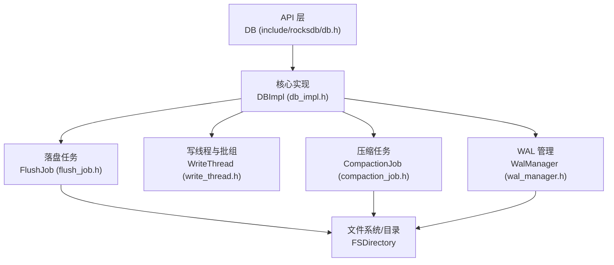
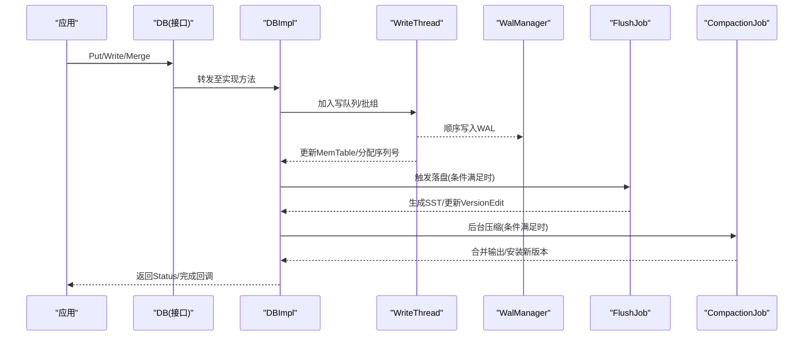
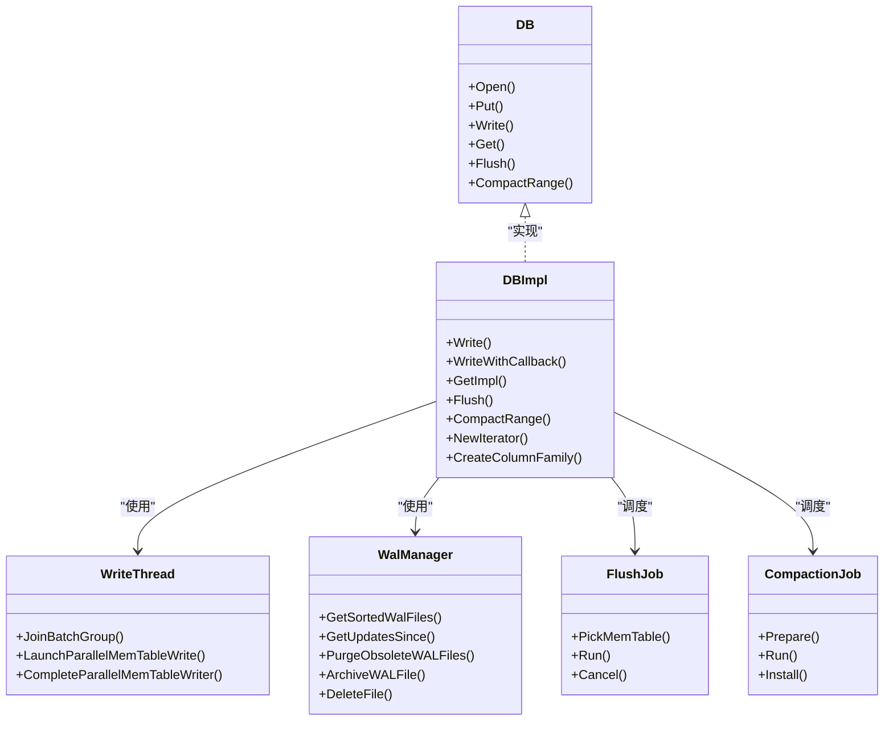
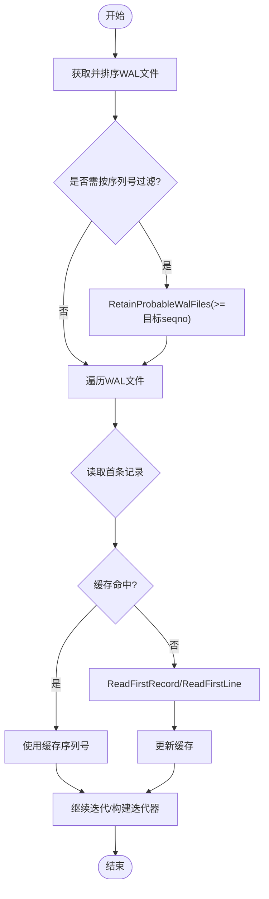
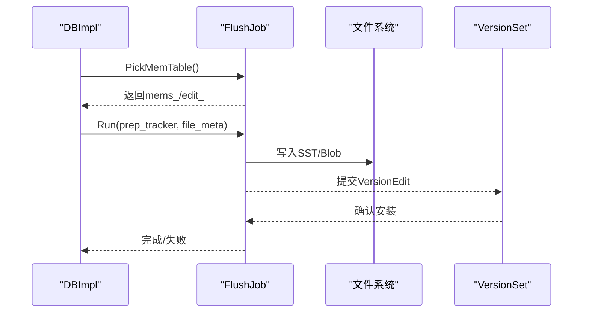
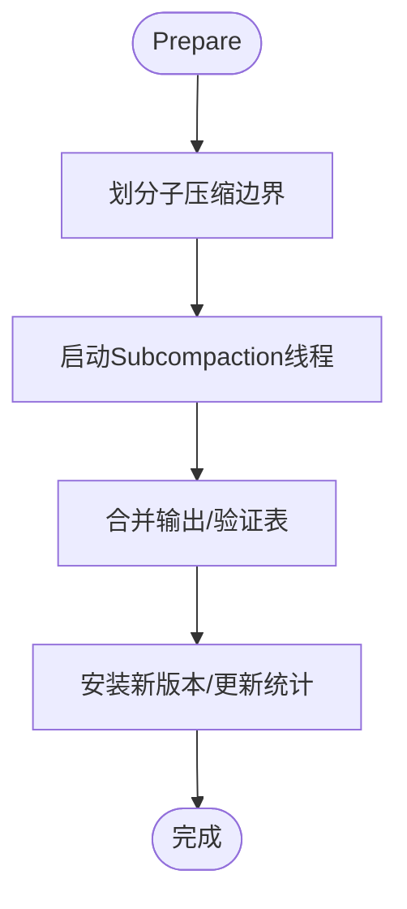
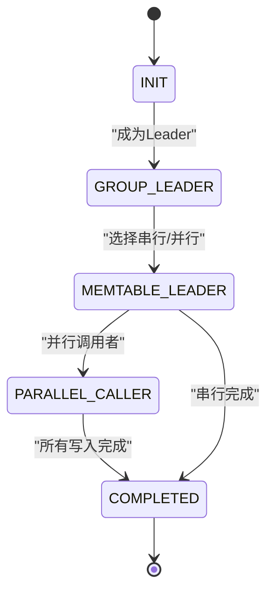
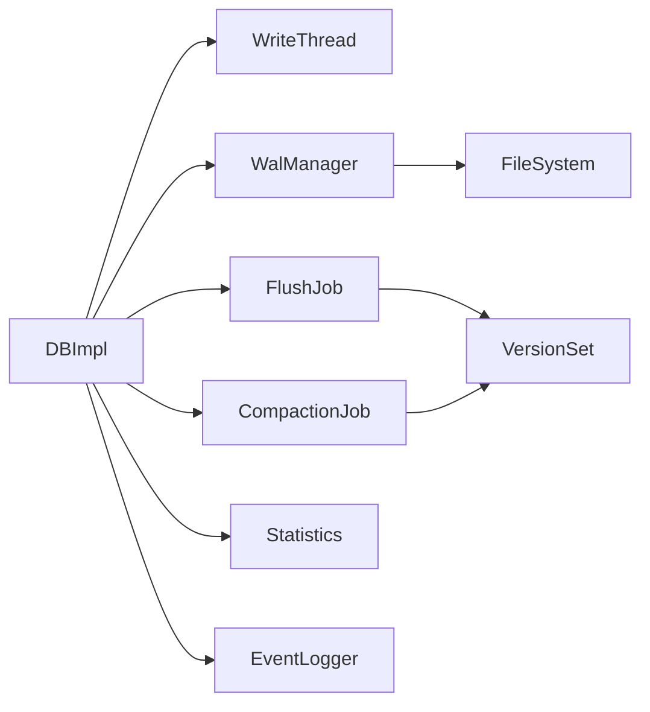

# 组件交互设计

<cite>
**本文引用的文件**   
- [db_impl.h](file://source/rocksdb/db/db_impl/db_impl.h)
- [wal_manager.h](file://source/rocksdb/db/wal_manager.h)
- [flush_job.h](file://source/rocksdb/db/flush_job.h)
- [compaction_job.h](file://source/rocksdb/db/compaction/compaction_job.h)
- [write_thread.h](file://source/rocksdb/db/write_thread.h)
- [db.h](file://source/rocksdb/include/rocksdb/db.h)
</cite>

## 目录
1. [简介](#简介)
2. [项目结构](#项目结构)
3. [核心组件](#核心组件)
4. [架构总览](#架构总览)
5. [详细组件分析](#详细组件分析)
6. [依赖关系分析](#依赖关系分析)
7. [性能考量](#性能考量)
8. [故障排查指南](#故障排查指南)
9. [结论](#结论)
10. [附录](#附录)

## 简介
本技术文档围绕 RocksDB 数据库核心组件的交互设计展开，重点说明 DBImpl、WalManager、FlushJob、CompactionJob、WriteThread 等关键组件的职责分工与协作模式。文档从 API 层抽象（DB）出发，梳理写路径、WAL 管理、MemTable 落盘（Flush）、后台压缩（Compaction）以及错误处理与生命周期管理，并通过序列图与类图展示组件间的调用关系和数据流向。同时给出扩展点与自定义实现的指导，帮助读者在保持兼容性的前提下进行二次开发。

## 项目结构
RocksDB 的核心代码位于 source/rocksdb 目录中，本次文档聚焦以下关键头文件：
- db/db_impl/db_impl.h：DB 接口的具体实现入口，协调 WAL、MemTable、版本集、调度器等子系统
- db/wal_manager.h：WAL 文件的统一读写与清理归档抽象
- db/flush_job.h：将 MemTable 持久化为 SST 的任务对象
- db/compaction/compaction_job.h：执行 Compaction 的任务对象
- db/write_thread.h：写线程与批组聚合、并发写入 MemTable 的管理器
- include/rocksdb/db.h：对外暴露的 DB 抽象接口与类型定义

图表来源 
- [db_impl.h:1-120](file://source/rocksdb/db/db_impl/db_impl.h#L1-L120)
- [wal_manager.h:1-60](file://source/rocksdb/db/wal_manager.h#L1-L60)
- [flush_job.h:1-80](file://source/rocksdb/db/flush_job.h#L1-L80)
- [compaction_job.h:1-60](file://source/rocksdb/db/compaction/compaction_job.h#L1-L60)
- [write_thread.h:1-60](file://source/rocksdb/db/write_thread.h#L1-L60)
- [db.h:120-200](file://source/rocksdb/include/rocksdb/db.h#L120-L200)

章节来源
- [db_impl.h:1-120](file://source/rocksdb/db/db_impl/db_impl.h#L1-L120)
- [db.h:120-200](file://source/rocksdb/include/rocksdb/db.h#L120-L200)

## 核心组件
- DB（接口层）
  - 职责：定义 Open/Close、Put/Delete/Merge/Write、Get/MultiGet、Flush、CompactRange、Snapshot、Iterator 等标准键值接口；提供 ColumnFamily 管理与属性查询能力
  - 特点：面向用户与上层框架，屏蔽底层实现细节
- DBImpl（核心实现）
  - 职责：实现 DB 接口，协调 WriteThread、WalManager、VersionSet、MemTableList、Flush/Compaction 调度、统计与事件上报
  - 关键点：维护数据库状态、序列号分配、可见性控制、事务日志与快照一致性
- WalManager（WAL 管理器）
  - 职责：以统一抽象打开/读取 WAL 文件，支持排序获取、按序列号回溯、归档与删除过期文件
  - 关键点：缓存首条记录、支持压缩 WAL、与 VersionSet 协同确定保留集合
- WriteThread（写线程与批组）
  - 职责：聚合多个写请求为批组，选择 Leader 串行化 WAL 写入与 MemTable 更新，支持并行 MemTable 写入以提升吞吐
  - 关键点：Writer 状态机、Group 生命周期、回调与同步语义
- FlushJob（落盘任务）
  - 职责：挑选待落盘的 MemTable，生成 SST，更新 VersionEdit，必要时触发 Manifest 提交与目录同步
  - 关键点：可选 MemPurge 优化、Blob 文件协同、IO 统计与事件通知
- CompactionJob（压缩任务）
  - 职责：准备子压缩边界，并行执行 Subcompaction，合并输出并安装新版本，更新统计与监听器
  - 关键点：进度持久化、异常恢复、多级别输出统计

章节来源
- [db.h:120-200](file://source/rocksdb/include/rocksdb/db.h#L120-L200)
- [db_impl.h:180-260](file://source/rocksdb/db/db_impl/db_impl.h#L180-L260)
- [wal_manager.h:30-90](file://source/rocksdb/db/wal_manager.h#L30-L90)
- [write_thread.h:30-120](file://source/rocksdb/db/write_thread.h#L30-L120)
- [flush_job.h:57-120](file://source/rocksdb/db/flush_job.h#L57-L120)
- [compaction_job.h:143-200](file://source/rocksdb/db/compaction/compaction_job.h#L143-L200)

## 架构总览
下图展示了从 API 到核心组件的调用链路与数据流：

图表来源 
- [db.h:120-200](file://source/rocksdb/include/rocksdb/db.h#L120-L200)
- [db_impl.h:200-320](file://source/rocksdb/db/db_impl/db_impl.h#L200-L320)
- [write_thread.h:30-120](file://source/rocksdb/db/write_thread.h#L30-L120)
- [wal_manager.h:30-90](file://source/rocksdb/db/wal_manager.h#L30-L90)
- [flush_job.h:57-120](file://source/rocksdb/db/flush_job.h#L57-L120)
- [compaction_job.h:143-200](file://source/rocksdb/db/compaction/compaction_job.h#L143-L200)

## 详细组件分析

### DBImpl 组件分析
- 职责与协作
  - 作为 DB 的具体实现，封装 Put/Delete/Merge/Write、Get/MultiGet、Flush、CompactRange、Snapshot、Iterator 等接口
  - 通过 WriteThread 聚合写请求，确保 WAL 顺序写入与 MemTable 原子更新
  - 根据阈值或外部触发创建 FlushJob，将 MemTable 落盘为 SST，并更新 VersionSet
  - 调度 CompactionJob 合并 SST，提升读性能与空间利用率
  - 维护序列号、可见性、时间戳映射、统计与事件上报
- 关键流程
  - 写路径：Write -> WriteWithCallback -> WriteThread -> WAL 写入 -> MemTable 插入 -> 回调/同步
  - 读路径：Get/MultiGet -> SuperVersion/快照 -> MemTable 扫描 -> SST 查找 -> 结果合并
  - 落盘：Flush -> FlushJob.PickMemTable -> Run -> 生成 SST -> VersionEdit -> Manifest 提交
  - 压缩：CompactionJob.Prepare -> Run -> Install -> 更新 VersionSet
- 错误处理
  - Status 贯穿各接口，失败时回滚或标记背景错误
  - ErrorHandler 用于捕获并上报 IO/解析/校验错误
  - 支持暂停/恢复后台工作，保障一致性

图表来源 
- [db.h:120-200](file://source/rocksdb/include/rocksdb/db.h#L120-L200)
- [db_impl.h:180-320](file://source/rocksdb/db/db_impl/db_impl.h#L180-L320)
- [write_thread.h:30-120](file://source/rocksdb/db/write_thread.h#L30-L120)
- [wal_manager.h:30-90](file://source/rocksdb/db/wal_manager.h#L30-L90)
- [flush_job.h:57-120](file://source/rocksdb/db/flush_job.h#L57-L120)
- [compaction_job.h:143-200](file://source/rocksdb/db/compaction/compaction_job.h#L143-L200)

章节来源
- [db_impl.h:180-320](file://source/rocksdb/db/db_impl/db_impl.h#L180-L320)

### WalManager 组件分析
- 职责
  - 统一管理 WAL 文件的打开、排序、读取与清理归档
  - 支持按序列号回溯变更（GetUpdatesSince），供恢复与增量同步
  - 维护 read_first_record_cache_ 加速空/压缩 WAL 的首条记录判断
- 关键方法
  - GetSortedWalFiles：按序号排序获取活跃 WAL 列表
  - GetUpdatesSince：基于目标序列号筛选可能包含更新的 WAL
  - PurgeObsoleteWALFiles：周期性清理过期 WAL
  - ArchiveWALFile/DeleteFile：归档或删除 WAL 文件
- 数据流
  - 读取 WAL：Reader -> ReadFirstRecord/ReadFirstLine -> 序列号提取 -> 迭代器构建
  - 清理策略：结合 VersionSet 与 TTL/大小限制决定保留集合

图表来源 
- [wal_manager.h:50-110](file://source/rocksdb/db/wal_manager.h#L50-L110)

章节来源
- [wal_manager.h:30-110](file://source/rocksdb/db/wal_manager.h#L30-L110)

### FlushJob 组件分析
- 职责
  - 挑选待落盘的 MemTable（按 ID 递增顺序）
  - 生成 SST 文件，收集 Blob 文件变更，更新 VersionEdit
  - 控制 Manifest 写入与目录同步（原子落盘场景）
  - 可选 MemPurge 优化，减少 SSD 写入
- 关键流程
  - PickMemTable：初始化 edit_、base_、mems_
  - Run：写入 L0 表、处理 Blob、统计 IO、事件上报
  - Cancel：取消未完成的落盘任务
- 数据流
  - MemTable -> SST -> VersionEdit -> VersionSet -> Manifest

图表来源 
- [flush_job.h:57-120](file://source/rocksdb/db/flush_job.h#L57-L120)

章节来源
- [flush_job.h:57-120](file://source/rocksdb/db/flush_job.h#L57-L120)

### CompactionJob 组件分析
- 职责
  - Prepare：划分子压缩边界，组织 seqno <-> time 信息
  - Run：并行执行 Subcompaction，合并输出，验证表可用性
  - Install：统一安装结果，更新 VersionSet 与统计
- 关键特性
  - 进度持久化与恢复（CompactionProgress）
  - 多级别输出统计（普通输出与 proximal level）
  - 异常处理与手动中断支持

图表来源 
- [compaction_job.h:143-200](file://source/rocksdb/db/compaction/compaction_job.h#L143-L200)

章节来源
- [compaction_job.h:143-200](file://source/rocksdb/db/compaction/compaction_job.h#L143-L200)

### WriteThread 组件分析
- 职责
  - 聚合写请求为批组（WriteGroup），选择 Leader 串行化 WAL 写入
  - 支持并行 MemTable 写入（STATE_PARALLEL_MEMTABLE_WRITER）
  - 维护 Writer 状态机，处理回调、同步与错误传播
- 关键状态
  - STATE_INIT -> STATE_GROUP_LEADER -> STATE_MEMTABLE_WRITER_LEADER
  - STATE_PARALLEL_MEMTABLE_CALLER/WRITE -> STATE_COMPLETED
- 数据流
  - 应用写请求 -> WriteThread.JoinBatchGroup -> WAL 写入 -> MemTable 更新 -> 回调/同步

图表来源 
- [write_thread.h:30-120](file://source/rocksdb/db/write_thread.h#L30-L120)

章节来源
- [write_thread.h:30-120](file://source/rocksdb/db/write_thread.h#L30-L120)

## 依赖关系分析
- 组件耦合
  - DBImpl 强依赖 WriteThread、WalManager、VersionSet、FlushJob、CompactionJob
  - FlushJob 依赖 FileOptions、VersionSet、EventLogger、Statistics
  - CompactionJob 依赖 TableCache、VersionSet、CompactionOutputs
  - WalManager 依赖 FileSystem、Env、IOTracer
- 潜在循环依赖
  - 通过前向声明与接口解耦避免循环（如 DBImpl 对 CompactionJob/FlushJob 的前置声明）
- 外部依赖
  - Env/FileSystem：I/O 抽象
  - Statistics/EventLogger：监控与事件
  - IOTracer：追踪 I/O 行为

图表来源 
- [db_impl.h:1-120](file://source/rocksdb/db/db_impl/db_impl.h#L1-L120)
- [flush_job.h:1-80](file://source/rocksdb/db/flush_job.h#L1-L80)
- [compaction_job.h:1-60](file://source/rocksdb/db/compaction/compaction_job.h#L1-L60)
- [wal_manager.h:1-60](file://source/rocksdb/db/wal_manager.h#L1-L60)

章节来源
- [db_impl.h:1-120](file://source/rocksdb/db/db_impl/db_impl.h#L1-L120)

## 性能考量
- 写路径优化
  - 批组聚合与并行 MemTable 写入降低锁竞争
  - WAL 顺序写入与可选禁用 WAL（disable_wal）提升吞吐
- 落盘与压缩
  - MemPurge 针对高覆盖写场景减少无效 IO
  - 原子落盘减少 Manifest 频繁同步
  - 压缩并行化与进度持久化提高稳定性
- 监控与调优
  - 利用 Statistics/EventLogger 定位瓶颈
  - 调整 flush/compaction 阈值与线程优先级

[本节为通用性能建议，不直接分析具体文件]

## 故障排查指南
- 常见问题
  - WAL 损坏或截断：使用 GetUpdatesSince 与 ReadFirstRecord 检查序列号连续性
  - 落盘失败：检查 FlushJob.Run 返回值与 ErrorHandler 上报
  - 压缩卡住：查看 CompactionJob 进度与 Subcompaction 状态
- 调试手段
  - 启用 IOTracer 与 EventLogger 追踪 I/O 与事件
  - 使用 PauseBackgroundWork/ContinueBackgroundWork 暂停/恢复后台任务
  - 检查 VersionSet 与 MANIFEST 一致性

章节来源
- [wal_manager.h:50-110](file://source/rocksdb/db/wal_manager.h#L50-L110)
- [flush_job.h:80-120](file://source/rocksdb/db/flush_job.h#L80-L120)
- [compaction_job.h:143-200](file://source/rocksdb/db/compaction/compaction_job.h#L143-L200)

## 结论
RocksDB 通过 DBImpl 统一协调写线程、WAL 管理、落盘与压缩等核心组件，形成高吞吐、一致性强、可扩展的存储引擎。理解各组件职责与协作模式，有助于在实际工程中优化性能、定制功能与快速定位问题。

[本节为总结性内容，不直接分析具体文件]

## 附录
- 扩展点与自定义实现指导
  - 自定义 DB 包装：继承 DB 接口，内部持有 DBImpl，重写特定方法（如事务封装）
  - 自定义 MemTable 表示：实现 MemTableRep 接口，替换默认哈希表
  - 自定义压缩过滤器：实现 CompactionFilter，按需丢弃/修改键值
  - 自定义事件监听：实现 EventListener，监听 Flush/Compaction 事件
  - 自定义 I/O 抽象：实现 Env/FileSystem，适配特殊存储介质
- 最佳实践
  - 合理配置 WAL 大小与刷新阈值，平衡延迟与吞吐
  - 使用 Snapshot 保证读一致性，避免长事务阻塞
  - 定期监控统计指标，动态调参

[本节为概念性内容，不直接分析具体文件]