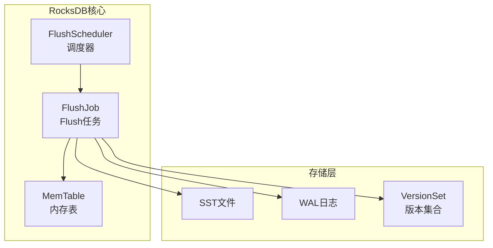
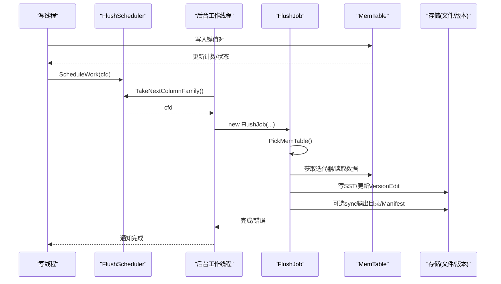
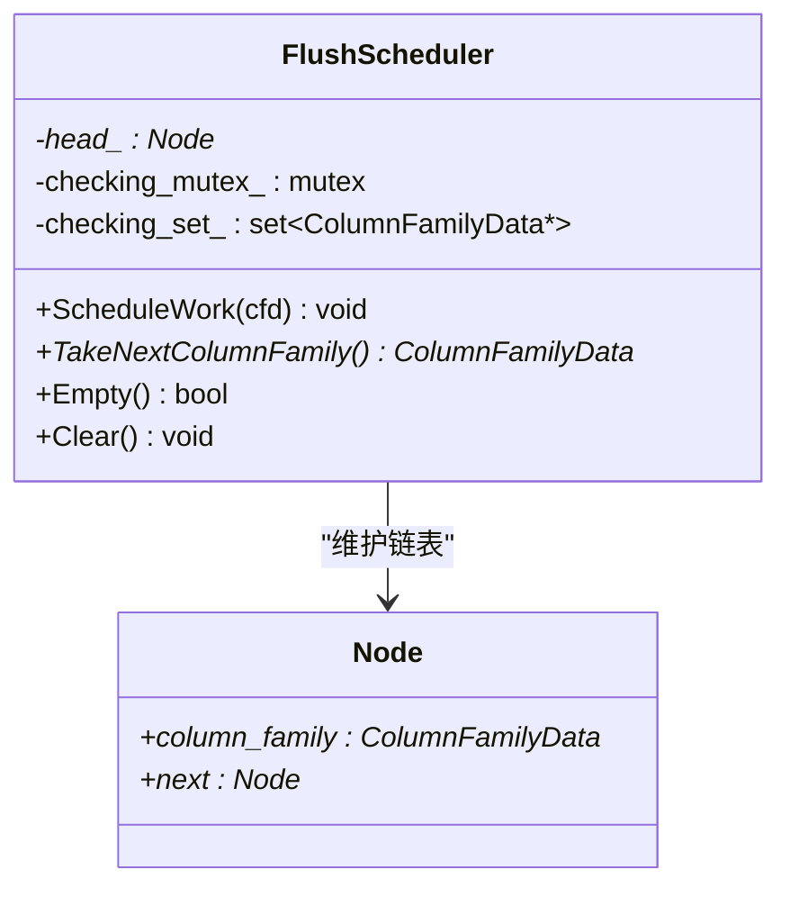
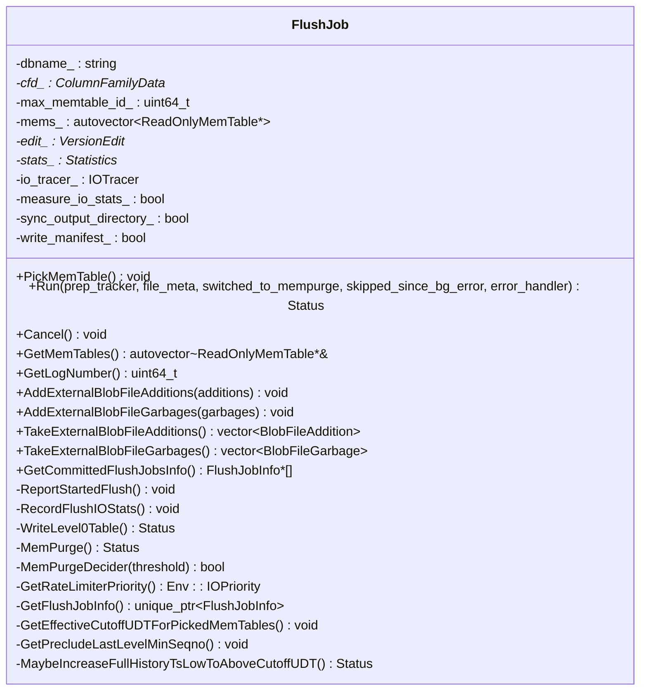
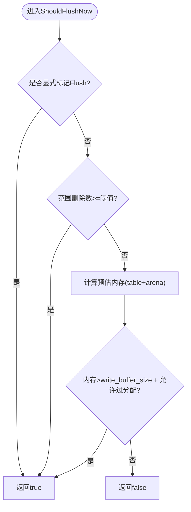
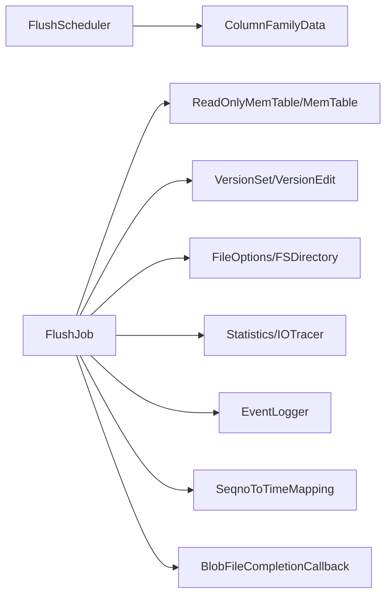

# Flush操作优化

<cite>
**本文引用的文件**   
- [flush_scheduler.h](file://source/rocksdb/db/flush_scheduler.h)
- [flush_job.h](file://source/rocksdb/db/flush_job.h)
- [memtable.h](file://source/rocksdb/db/memtable.h)
- [memtable.cc](file://source/rocksdb/db/memtable.cc)
</cite>

## 目录
1. [简介](#简介)
2. [项目结构](#项目结构)
3. [核心组件](#核心组件)
4. [架构总览](#架构总览)
5. [详细组件分析](#详细组件分析)
6. [依赖关系分析](#依赖关系分析)
7. [性能考虑](#性能考虑)
8. [故障排查指南](#故障排查指南)
9. [结论](#结论)
10. [附录](#附录)

## 简介
本技术文档聚焦于Flush操作的优化实现，围绕以下目标展开：
- 内存表选择算法的改进与批量写入机制优化
- I/O统计增强与监控指标完善
- Flush调度器的工作原理（触发条件、资源分配策略、并发控制）
- 内存表生命周期管理、数据持久化流程与性能监控
- 配置参数说明、性能调优建议与故障排查方法
- 典型使用场景与最佳实践

## 项目结构
本项目在RocksDB代码库基础上进行扩展，涉及Flush相关的核心头文件位于db目录。关键文件包括：
- flush_scheduler.h：Flush调度器的接口定义，维护需要Flush的列族队列
- flush_job.h：Flush任务定义与执行流程，负责从MemTable生成SST并更新版本
- memtable.h/cc：内存表抽象与实现，包含是否应Flush的判断逻辑与状态机

图表来源
- [flush_scheduler.h:1-56](file://source/rocksdb/db/flush_scheduler.h#L1-L56)
- [flush_job.h:1-276](file://source/rocksdb/db/flush_job.h#L1-L276)
- [memtable.h:1-800](file://source/rocksdb/db/memtable.h#L1-L800)

章节来源
- [flush_scheduler.h:1-56](file://source/rocksdb/db/flush_scheduler.h#L1-L56)
- [flush_job.h:1-276](file://source/rocksdb/db/flush_job.h#L1-L276)
- [memtable.h:1-800](file://source/rocksdb/db/memtable.h#L1-L800)
- [memtable.cc:1-300](file://source/rocksdb/db/memtable.cc#L1-L300)

## 核心组件
- FlushScheduler：维护一个无锁链表，记录可能已满且需要Flush的ColumnFamilyData；提供ScheduleWork/TakeNextColumnFamily/Empty/Clear等接口，支持多线程并发入队与单线程消费。
- FlushJob：封装一次Flush任务的完整生命周期，包括PickMemTable选择待Flush的MemTable、Run执行持久化（写SST、更新VersionEdit、可选同步输出目录与Manifest）、Cancel取消任务、以及I/O统计记录与RateLimiter优先级动态调整。
- MemTable：实现ReadOnlyMemTable接口，维护写入计数、大小估计、范围删除计数、Flush状态机（FLUSH_NOT_REQUESTED/FLUSH_REQUESTED/FLUSH_SCHEDULED），并提供ShouldFlushNow/MarkFlushScheduled等判断与标记方法。

章节来源
- [flush_scheduler.h:1-56](file://source/rocksdb/db/flush_scheduler.h#L1-L56)
- [flush_job.h:1-276](file://source/rocksdb/db/flush_job.h#L1-L276)
- [memtable.h:1-800](file://source/rocksdb/db/memtable.h#L1-L800)
- [memtable.cc:1-300](file://source/rocksdb/db/memtable.cc#L1-L300)

## 架构总览
Flush的整体流程如下：
- 写路径中，当MemTable达到阈值或显式标记时，调用FlushScheduler::ScheduleWork将ColumnFamilyData加入队列
- 后台线程通过TakeNextColumnFamily取出下一个需要Flush的列族
- 构造FlushJob，调用PickMemTable选择要Flush的MemTable列表（按ID递增顺序）
- Run执行持久化：迭代MemTable写入SST，更新VersionEdit，必要时同步输出目录与Manifest，记录I/O统计
- 完成后释放资源，必要时触发后续Compaction

图表来源
- [flush_scheduler.h:1-56](file://source/rocksdb/db/flush_scheduler.h#L1-L56)
- [flush_job.h:1-276](file://source/rocksdb/db/flush_job.h#L1-L276)
- [memtable.h:1-800](file://source/rocksdb/db/memtable.h#L1-L800)

## 详细组件分析

### FlushScheduler（调度器）
- 数据结构：原子指针head_指向链表节点Node，每个节点持有ColumnFamilyData*与next指针；调试模式下有checking_mutex_与checking_set_辅助校验
- 并发模型：ScheduleWork允许多线程并发调用；TakeNextColumnFamily由单线程消费；Empty/Clear可并发调用但可能与ScheduleWork存在时序上的“遗漏”
- 职责：维护待Flush的列族集合，过滤已丢弃的列族，返回引用计数的cfd供客户端Unref

图表来源
- [flush_scheduler.h:1-56](file://source/rocksdb/db/flush_scheduler.h#L1-L56)

章节来源
- [flush_scheduler.h:1-56](file://source/rocksdb/db/flush_scheduler.h#L1-L56)

### FlushJob（Flush任务）
- 构造参数：包含dbname、cfd、ImmutableDBOptions、MutableCFOptions、max_memtable_id、FileOptions、VersionSet、db_mutex、shutting_down、JobContext、FlushReason、LogBuffer、FSDirectory、压缩类型、Statistics、EventLogger、measure_io_stats、sync_output_directory、write_manifest、线程优先级、IOTracer、SeqnoToTimeMapping、db_id/session_id、full_history_ts_low、BlobFileCompletionCallback、fast_sst_open等
- 关键方法：
  - PickMemTable：根据max_memtable_id选择待Flush的MemTable列表（按ID升序）
  - Run：执行持久化，包括写Level0表、记录I/O统计、处理外部blob文件、更新VersionEdit、可选同步输出目录与Manifest
  - Cancel：取消任务
  - GetRateLimiterPriority：动态确定I/O优先级
  - RecordFlushIOStats：记录Flush期间的I/O统计
- 内部状态：mems_（待Flush的ReadOnlyMemTable列表）、edit_（VersionEdit）、base_（基版本）、thread_pri_、io_tracer_、clock_、full_history_ts_low_、external_blob_file_additions_/garbages_、seqno_to_time_mapping_、cutoff_udt_、preclude_last_level_min_seqno_等

图表来源
- [flush_job.h:1-276](file://source/rocksdb/db/flush_job.h#L1-L276)

章节来源
- [flush_job.h:1-276](file://source/rocksdb/db/flush_job.h#L1-L276)

### MemTable（内存表）
- 状态机：flush_state_为原子枚举，支持FLUSH_NOT_REQUESTED/FLUSH_REQUESTED/FLUSH_SCHEDULED；ShouldScheduleFlush检查是否请求Flush；MarkFlushScheduled尝试CAS切换至已调度；HasFlushScheduled检查是否已调度
- 阈值判断：ShouldFlushNow综合以下因素：
  - 显式标记IsMarkedForFlush
  - 范围删除数量超过阈值memtable_max_range_deletions_
  - 内存使用量估算（table近似内存+arena已分配）与write_buffer_size的比较，允许一定比例的over-allocation
- 统计与元数据：NumEntries/NumDeletion/NumRangeDeletion/DataSize/ApproximateMemoryUsage等；first_seqno_、earliest_seqno_用于序列号追踪；atomic_flush_seqno_用于原子Flush语义
- 其他能力：NewIterator/NewTimestampStrippingIterator、MultiGet、Update/UpdateCallback、BatchPostProcess、ProtectSealedBlobFiles等

图表来源
- [memtable.cc:1-300](file://source/rocksdb/db/memtable.cc#L1-L300)
- [memtable.h:1-800](file://source/rocksdb/db/memtable.h#L1-L800)

章节来源
- [memtable.h:1-800](file://source/rocksdb/db/memtable.h#L1-L800)
- [memtable.cc:1-300](file://source/rocksdb/db/memtable.cc#L1-L300)

## 依赖关系分析
- FlushScheduler依赖ColumnFamilyData以标识需要Flush的列族
- FlushJob依赖：
  - ReadOnlyMemTable/MemTable：读取数据、获取迭代器
  - VersionSet/VersionEdit：更新版本信息
  - FileOptions/FSDirectory：文件写入与目录同步
  - Statistics/IOTracer：I/O统计与追踪
  - EventLogger：事件日志
  - SeqnoToTimeMapping：时间映射（可选）
  - BlobFileCompletionCallback：blob文件回调（可选）
- MemTable依赖WriteBufferManager/Arena/内部表实现（如SkipList）等

图表来源
- [flush_scheduler.h:1-56](file://source/rocksdb/db/flush_scheduler.h#L1-L56)
- [flush_job.h:1-276](file://source/rocksdb/db/flush_job.h#L1-L276)
- [memtable.h:1-800](file://source/rocksdb/db/memtable.h#L1-L800)

章节来源
- [flush_scheduler.h:1-56](file://source/rocksdb/db/flush_scheduler.h#L1-L56)
- [flush_job.h:1-276](file://source/rocksdb/db/flush_job.h#L1-L276)
- [memtable.h:1-800](file://source/rocksdb/db/memtable.h#L1-L800)

## 性能考虑
- 内存表选择算法优化：
  - 基于max_memtable_id的增量选择，避免全量扫描
  - 结合MemTable的ShouldFlushNow与显式标记，减少不必要的Flush
  - 支持MemPurge实验特性，针对高覆盖写负载减少SSD读写
- 批量写入机制：
  - WriteBatch在MemTable中的批量后处理（BatchPostProcess）合并计数器更新，降低锁竞争
  - MultiGet与迭代器优化，减少重复计算
- I/O统计增强：
  - RecordFlushIOStats与IOTracer配合，记录Flush期间读/写延迟、吞吐、错误码分布
  - measure_io_stats开关控制统计开销
- 并发控制：
  - FlushScheduler无锁入队、单线程出队，避免热点锁
  - MemTable状态机使用原子操作，避免竞态
- 资源分配策略：
  - GetRateLimiterPriority动态调整I/O优先级，平衡前台/后台任务
  - sync_output_directory与write_manifest按需启用，减少fsync开销

[本节为通用性能讨论，不直接分析具体文件]

## 故障排查指南
- 常见问题定位：
  - Flush频繁触发：检查MemTable的write_buffer_size与ShouldFlushNow阈值，确认范围删除阈值memtable_max_range_deletions设置
  - I/O延迟升高：查看RecordFlushIOStats与IOTracer统计，关注磁盘带宽与随机写比例
  - 版本不一致：检查VersionEdit更新与Manifest同步逻辑，确认sync_output_directory与write_manifest配置
  - 内存泄漏：关注MemTable的Ref/Unref计数与Blob文件保护列表释放
- 诊断步骤：
  - 启用详细日志（EventLogger）与统计（Statistics）
  - 使用IOTracer捕获I/O路径耗时
  - 检查FlushScheduler队列长度与TakeNextColumnFamily消费速率
  - 验证MemTable状态机转换是否符合预期

章节来源
- [flush_job.h:1-276](file://source/rocksdb/db/flush_job.h#L1-276)
- [memtable.cc:1-300](file://source/rocksdb/db/memtable.cc#L1-300)

## 结论
通过对FlushScheduler、FlushJob与MemTable的协同优化，实现了高效的内存表选择、批量写入与I/O统计增强。合理的触发条件判断、资源分配策略与并发控制机制，确保了在高负载下的稳定性能。结合配置参数调优与故障排查方法，可进一步提升系统的吞吐量与稳定性。

[本节为总结性内容，不直接分析具体文件]

## 附录
- 配置参数建议：
  - write_buffer_size：根据内存容量与写入模式调整，避免过小导致频繁Flush
  - memtable_max_range_deletions：针对范围删除负载调优，平衡内存与Flush频率
  - measure_io_stats：生产环境谨慎开启，避免统计开销影响延迟
  - sync_output_directory/write_manifest：原子Flush场景下需谨慎配置，确保一致性
- 最佳实践：
  - 合理设置Flush阈值，避免抖动
  - 使用IOTracer监控I/O瓶颈
  - 定期评估MemTable大小与Flush频率，动态调整参数
  - 在高覆盖写场景下考虑启用MemPurge（实验特性）

[本节为通用指导，不直接分析具体文件]