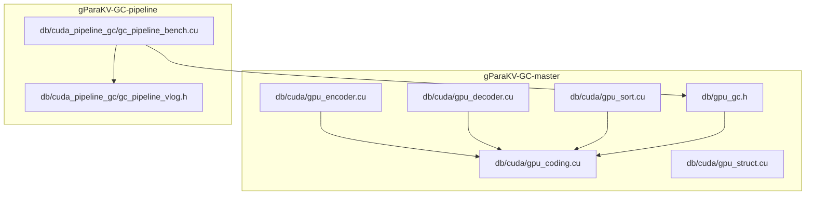
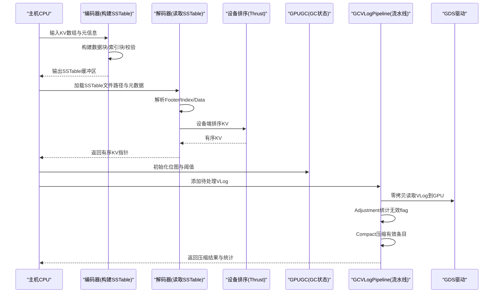
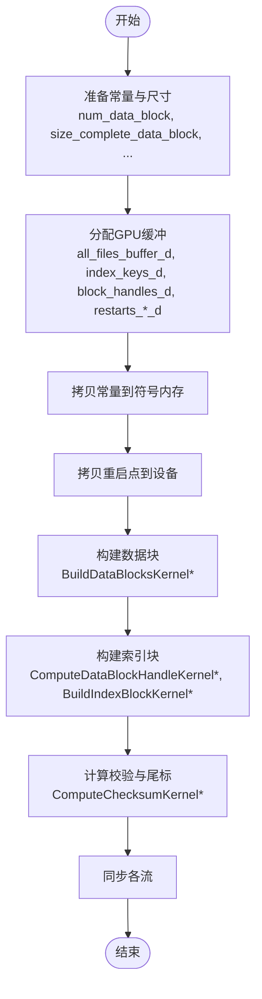
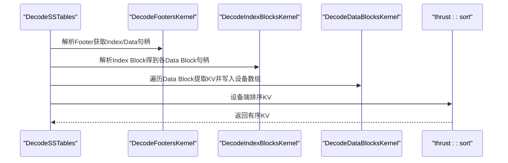
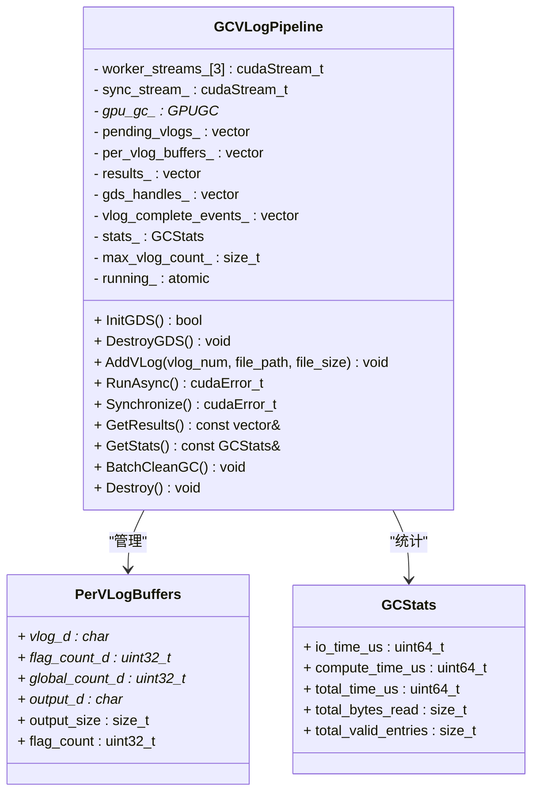
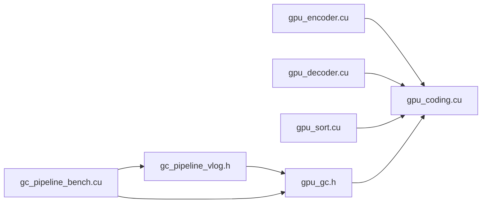

# GPU加速实现

<cite>
**本文引用的文件**   
- [gpu_encoder.cu](file://source/gParaKV-GC-master/db/cuda/gpu_encoder.cu)
- [gpu_decoder.cu](file://source/gParaKV-GC-master/db/cuda/gpu_decoder.cu)
- [gpu_coding.cu](file://source/gParaKV-GC-master/db/cuda/gpu_coding.cu)
- [gpu_sort.cu](file://source/gParaKV-GC-master/db/cuda/gpu_sort.cu)
- [gpu_struct.cu](file://source/gParaKV-GC-master/db/cuda/gpu_struct.cu)
- [gpu_gc.h](file://source/gParaKV-GC-master/db/gpu_gc.h)
- [gc_pipeline_bench.cu](file://source/gParaKV-GC-pipeline/db/cuda_pipeline_gc/gc_pipeline_bench.cu)
- [gc_pipeline_vlog.h](file://source/gParaKV-GC-pipeline/db/cuda_pipeline_gc/gc_pipeline_vlog.h)
</cite>

## 目录
1. [简介](#简介)
2. [项目结构](#项目结构)
3. [核心组件](#核心组件)
4. [架构总览](#架构总览)
5. [详细组件分析](#详细组件分析)
6. [依赖关系分析](#依赖关系分析)
7. [性能考量](#性能考量)
8. [故障排查指南](#故障排查指南)
9. [结论](#结论)
10. [附录](#附录)

## 简介
本技术文档围绕GPU加速的垃圾回收与SSTable构建/解码流水线展开，重点阐述CUDA内核设计、压缩与解压算法的并行实现、H2D/D2H数据传输优化、内存管理与线程块调度策略。同时给出GPU压缩管道的整体架构（数据预处理、并行计算、后处理），并说明CUDA编程模型的使用要点（核函数编写、内存访问模式、性能优化技巧）。最后提供环境配置、编译设置与调试方法，以及基准测试示例与结果解读建议。

## 项目结构
仓库中与GPU加速相关的核心代码主要分布在以下位置：
- gParaKV-GC-master: 基础GPU实现（编码、解码、排序、结构体、GC接口）
- gParaKV-GC-pipeline: 引入GDS零拷贝I/O与多流流水线的版本，含基准测试与流水线头文件

图表来源 
- [gpu_encoder.cu](file://source/gParaKV-GC-master/db/cuda/gpu_encoder.cu)
- [gpu_decoder.cu](file://source/gParaKV-GC-master/db/cuda/gpu_decoder.cu)
- [gpu_coding.cu](file://source/gParaKV-GC-master/db/cuda/gpu_coding.cu)
- [gpu_sort.cu](file://source/gParaKV-GC-master/db/cuda/gpu_sort.cu)
- [gpu_struct.cu](file://source/gParaKV-GC-master/db/cuda/gpu_struct.cu)
- [gpu_gc.h](file://source/gParaKV-GC-master/db/gpu_gc.h)
- [gc_pipeline_bench.cu](file://source/gParaKV-GC-pipeline/db/cuda_pipeline_gc/gc_pipeline_bench.cu)
- [gc_pipeline_vlog.h](file://source/gParaKV-GC-pipeline/db/cuda_pipeline_gc/gc_pipeline_vlog.h)

章节来源
- [gpu_encoder.cu](file://source/gParaKV-GC-master/db/cuda/gpu_encoder.cu)
- [gpu_decoder.cu](file://source/gParaKV-GC-master/db/cuda/gpu_decoder.cu)
- [gpu_coding.cu](file://source/gParaKV-GC-master/db/cuda/gpu_coding.cu)
- [gpu_sort.cu](file://source/gParaKV-GC-master/db/cuda/gpu_sort.cu)
- [gpu_struct.cu](file://source/gParaKV-GC-master/db/cuda/gpu_struct.cu)
- [gpu_gc.h](file://source/gParaKV-GC-master/db/gpu_gc.h)
- [gc_pipeline_bench.cu](file://source/gParaKV-GC-pipeline/db/cuda_pipeline_gc/gc_pipeline_bench.cu)
- [gc_pipeline_vlog.h](file://source/gParaKV-GC-pipeline/db/cuda_pipeline_gc/gc_pipeline_vlog.h)

## 核心组件
- 编码器与SSTable构建：负责将键值对按行格式写入数据块，生成索引块与校验尾标，支持完整与非完整数据块，使用常量参数与异步流组织多阶段核函数。
- 解码器与SSTable读取：解析Footer与Index Block，定位Data Block，提取KV并对内部Key进行序列号与类型解析，最终在设备上排序。
- 编码/解码原语：Varint/Fixed编解码、CRC校验、热值解析等，供编码与解码流程复用。
- 排序与去重：基于Thrust的设备端排序、去重与计数聚合，用于合并与标记重复键。
- GC接口与状态管理：维护GPU位图与无效计数，提供触发GC、开始GC、清理等接口。
- 流水线GC：基于GDS零拷贝I/O与多CUDA流，实现VLog级并行处理，覆盖I/O与计算重叠，提升吞吐。

章节来源
- [gpu_encoder.cu](file://source/gParaKV-GC-master/db/cuda/gpu_encoder.cu)
- [gpu_decoder.cu](file://source/gParaKV-GC-master/db/cuda/gpu_decoder.cu)
- [gpu_coding.cu](file://source/gParaKV-GC-master/db/cuda/gpu_coding.cu)
- [gpu_sort.cu](file://source/gParaKV-GC-master/db/cuda/gpu_sort.cu)
- [gpu_gc.h](file://source/gParaKV-GC-master/db/gpu_gc.h)
- [gc_pipeline_vlog.h](file://source/gParaKV-GC-pipeline/db/cuda_pipeline_gc/gc_pipeline_vlog.h)

## 架构总览
下图展示了从SSTable构建到解码、再到GC流水线的端到端数据流与控制流。

图表来源 
- [gpu_encoder.cu](file://source/gParaKV-GC-master/db/cuda/gpu_encoder.cu)
- [gpu_decoder.cu](file://source/gParaKV-GC-master/db/cuda/gpu_decoder.cu)
- [gpu_sort.cu](file://source/gParaKV-GC-master/db/cuda/gpu_sort.cu)
- [gpu_gc.h](file://source/gParaKV-GC-master/db/gpu_gc.h)
- [gc_pipeline_vlog.h](file://source/gParaKV-GC-pipeline/db/cuda_pipeline_gc/gc_pipeline_vlog.h)

## 详细组件分析

### 编码器与SSTable构建（gpu_encoder.cu）
- 数据块构建：每个数据块包含变长头部、键值对、重启点数组与尾部校验；支持完整与非完整数据块。
- 索引块构建：记录每个数据块的偏移与大小，并附带重启点偏移，便于快速定位。
- 校验与尾标：为数据块与索引块分别计算校验和并写入尾标。
- 多流执行：通过多个cudaStream_t组织不同阶段的核函数调用，减少同步开销。
- 常量与全局变量：使用符号内存传递块大小、数量等常量，避免每次内核启动时重复传参。

图表来源 
- [gpu_encoder.cu](file://source/gParaKV-GC-master/db/cuda/gpu_encoder.cu)

章节来源
- [gpu_encoder.cu](file://source/gParaKV-GC-master/db/cuda/gpu_encoder.cu)

### 解码器与SSTable读取（gpu_decoder.cu）
- Footer解析：从文件末尾读取索引块与数据块的句柄。
- Index Block解析：遍历索引项，得到每个数据块的偏移与大小。
- Data Block解析：逐条读取KV，解析内部Key中的序列号与类型，使用原子计数器写入全局KV数组。
- 设备排序：使用Thrust在设备上排序，便于后续合并或去重。

图表来源 
- [gpu_decoder.cu](file://source/gParaKV-GC-master/db/cuda/gpu_decoder.cu)

章节来源
- [gpu_decoder.cu](file://source/gParaKV-GC-master/db/cuda/gpu_decoder.cu)

### 编码/解码原语（gpu_coding.cu）
- Varint编解码：高效处理变长整数，适用于长度与偏移字段。
- Fixed编解码：固定宽度整数的读写，保证对齐与顺序。
- CRC与校验：计算内置校验和，确保数据完整性。
- 工具函数：如GPUPutFixed64Fixed32、GPUEncodeVarint64等，简化复杂结构的序列化。

章节来源
- [gpu_coding.cu](file://source/gParaKV-GC-master/db/cuda/gpu_coding.cu)

### 排序与去重（gpu_sort.cu）
- 设备排序与去重：基于Thrust的sort与unique，快速获得有序且无重复的KV集合。
- 计数聚合：reduce_by_key统计键出现次数，配合copy_if过滤重复键。
- 位置排序：对位置数组进行排序与去重，辅助GC定位。

章节来源
- [gpu_sort.cu](file://source/gParaKV-GC-master/db/cuda/gpu_sort.cu)

### GC接口与状态管理（gpu_gc.h）
- 类成员：最大日志数、每日志最大条目数、触发日志编号、无效计数、GPU位图与无效计数数组。
- 关键方法：内存分配、标记、触发GC、开始GC（含优化版本）、清理。
- 流对象：单流stream用于串行操作。

章节来源
- [gpu_gc.h](file://source/gParaKV-GC-master/db/gpu_gc.h)

### 流水线GC与GDS零拷贝（gc_pipeline_vlog.h + gc_pipeline_bench.cu）
- 流水线设计：3路worker流轮询分配VLog，每个VLog执行“GDS读取 -> Adjustment -> sync -> Compact -> D2H”的流水线步骤，不同VLog在不同流上并行。
- GDS集成：使用cuFileReadAsync实现NVMe到GPU直通，要求4KB对齐；打开文件O_DIRECT并注册GDS句柄。
- 统计与结果：统计I/O与计算耗时、总读取字节数、有效条目数；返回每个VLog的压缩结果。
- 基准测试：合成VLog文件，对比Serial GC与Pipeline GC的总耗时、吞吐与速度比。

图表来源 
- [gc_pipeline_vlog.h](file://source/gParaKV-GC-pipeline/db/cuda_pipeline_gc/gc_pipeline_vlog.h)

章节来源
- [gc_pipeline_bench.cu](file://source/gParaKV-GC-pipeline/db/cuda_pipeline_gc/gc_pipeline_bench.cu)
- [gc_pipeline_vlog.h](file://source/gParaKV-GC-pipeline/db/cuda_pipeline_gc/gc_pipeline_vlog.h)

## 依赖关系分析
- 编码器依赖编码原语（gpu_coding.cu）与结构体定义（gpu_struct.cuh），并通过常量符号内存传递运行时参数。
- 解码器依赖编码原语与Thrust库进行设备排序。
- 排序模块依赖Thrust进行设备端排序、去重与聚合。
- GC接口依赖统计模块（my_stats.h）与编码/排序原语。
- 流水线GC依赖GDS驱动（cufile.h）与GPUGC接口。

图表来源 
- [gpu_encoder.cu](file://source/gParaKV-GC-master/db/cuda/gpu_encoder.cu)
- [gpu_decoder.cu](file://source/gParaKV-GC-master/db/cuda/gpu_decoder.cu)
- [gpu_coding.cu](file://source/gParaKV-GC-master/db/cuda/gpu_coding.cu)
- [gpu_sort.cu](file://source/gParaKV-GC-master/db/cuda/gpu_sort.cu)
- [gpu_gc.h](file://source/gParaKV-GC-master/db/gpu_gc.h)
- [gc_pipeline_vlog.h](file://source/gParaKV-GC-pipeline/db/cuda_pipeline_gc/gc_pipeline_vlog.h)
- [gc_pipeline_bench.cu](file://source/gParaKV-GC-pipeline/db/cuda_pipeline_gc/gc_pipeline_bench.cu)

章节来源
- [gpu_encoder.cu](file://source/gParaKV-GC-master/db/cuda/gpu_encoder.cu)
- [gpu_decoder.cu](file://source/gParaKV-GC-master/db/cuda/gpu_decoder.cu)
- [gpu_coding.cu](file://source/gParaKV-GC-master/db/cuda/gpu_coding.cu)
- [gpu_sort.cu](file://source/gParaKV-GC-master/db/cuda/gpu_sort.cu)
- [gpu_gc.h](file://source/gParaKV-GC-master/db/gpu_gc.h)
- [gc_pipeline_bench.cu](file://source/gParaKV-GC-pipeline/db/cuda_pipeline_gc/gc_pipeline_bench.cu)
- [gc_pipeline_vlog.h](file://source/gParaKV-GC-pipeline/db/cuda_pipeline_gc/gc_pipeline_vlog.h)

## 性能考量
- 内存访问模式
  - 尽量使用合并访问（coalesced memory access），例如按线程块顺序读取连续的数据块与索引项。
  - 利用常量内存缓存块尺寸、数量等不变参数，减少寄存器压力与带宽占用。
- 流与异步
  - 使用多个cudaStream_t组织独立阶段（数据构建、索引构建、校验计算），避免不必要的同步。
  - 在流水线中，I/O与计算通过不同流重叠，最大化GPU利用率。
- 原子与竞争
  - 使用atomicAdd进行全局计数时，注意热点导致的竞争；可考虑分块归约后再汇总。
- 对齐与零拷贝
  - GDS要求4KB对齐，所有I/O大小与偏移需向上对齐；使用O_DIRECT与cuFileReadAsync实现零拷贝。
- 核函数粒度
  - 合理划分线程块与网格，使每个SM有足够的工作负载；避免过小的block导致资源浪费。
- 统计与测量
  - 使用高精度计时区分I/O与计算时间，评估流水线效果与瓶颈。

[本节为通用指导，不直接分析具体文件]

## 故障排查指南
- CUDA错误检查
  - 在所有CUDA API调用后添加CHECK宏，捕获失败并打印错误码与堆栈。
- 流同步问题
  - 若出现数据竞争或结果不一致，检查流间依赖是否正确，必要时插入cudaStreamSynchronize。
- GDS I/O失败
  - 确认文件以O_DIRECT打开，路径正确，权限允许；检查对齐是否符合4KB要求。
- 内存不足
  - 估算总内存需求（数据块+索引块+句柄+重启点），避免过度分配；使用cudaMallocAsync按需分配。
- 校验失败
  - 核对CRC与尾标计算逻辑，确保类型与长度一致；检查变长编码边界条件。

章节来源
- [gpu_encoder.cu](file://source/gParaKV-GC-master/db/cuda/gpu_encoder.cu)
- [gpu_decoder.cu](file://source/gParaKV-GC-master/db/cuda/gpu_decoder.cu)
- [gc_pipeline_bench.cu](file://source/gParaKV-GC-pipeline/db/cuda_pipeline_gc/gc_pipeline_bench.cu)

## 结论
本项目实现了完整的GPU加速GC与SSTable构建/解码流水线。编码器与解码器通过高效的编码原语与设备排序，结合多流异步执行，显著提升吞吐。流水线GC借助GDS零拷贝I/O与多流并行，将I/O与计算重叠，进一步降低延迟并提高资源利用率。建议在大规模数据集上持续优化内存布局与核函数粒度，并结合基准测试验证性能收益。

[本节为总结性内容，不直接分析具体文件]

## 附录

### CUDA环境配置与编译设置
- 驱动与CUDA Toolkit
  - 安装与GPU架构匹配的CUDA Toolkit与驱动版本。
- GDS支持
  - 启用cuFile库，确保系统支持GPUDirect Storage；文件描述符需以O_DIRECT打开。
- 编译选项
  - 指定目标架构（-arch=sm_XX），链接cuFile与Thrust库；开启优化（-O3）。
- 调试工具
  - 使用cuda-gdb、Nsight Systems/Compute进行性能分析与调试。

[本节为通用指导，不直接分析具体文件]

### 基准测试与结果解读
- 运行基准
  - 使用gc_pipeline_bench生成合成VLog，设置条目数、无效比例、记录大小与重复次数。
- 指标采集
  - 关注总耗时、I/O耗时、计算耗时、吞吐（MB/s）与速度比（Serial vs Pipeline）。
- 结果分析
  - 当I/O成为瓶颈时，流水线优势明显；若计算为主，则需优化核函数与内存访问。

章节来源
- [gc_pipeline_bench.cu](file://source/gParaKV-GC-pipeline/db/cuda_pipeline_gc/gc_pipeline_bench.cu)