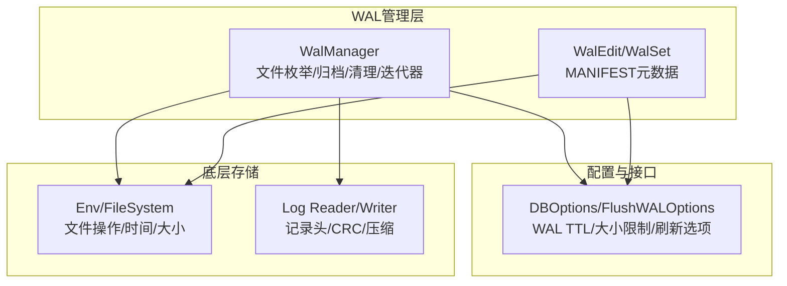
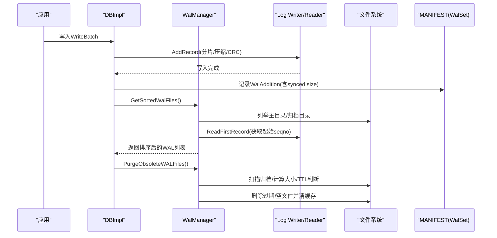
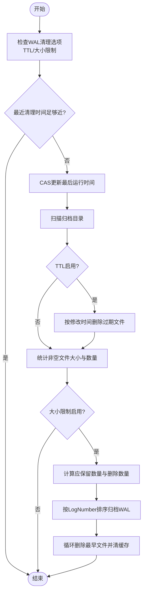
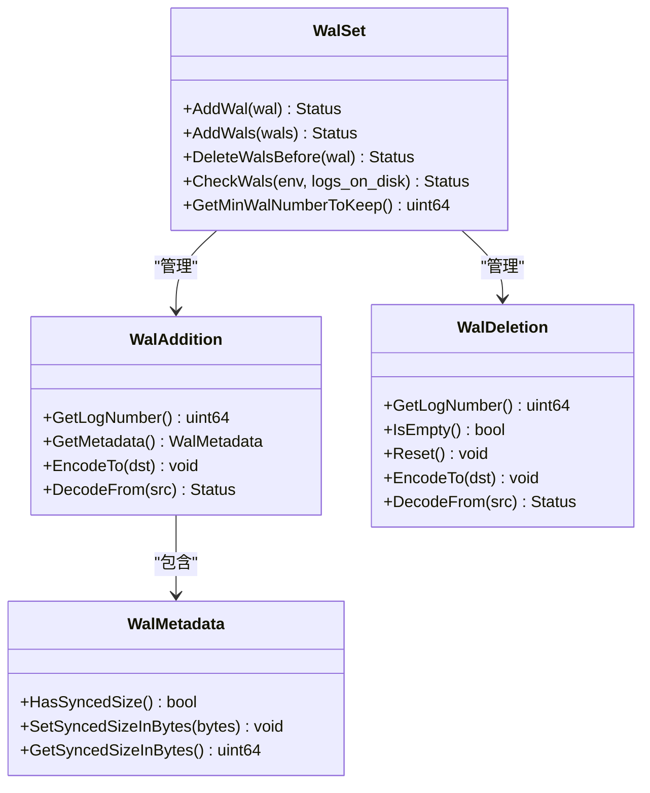
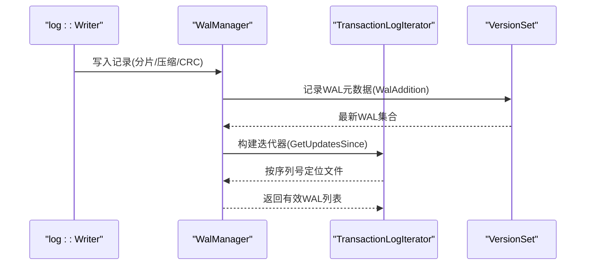
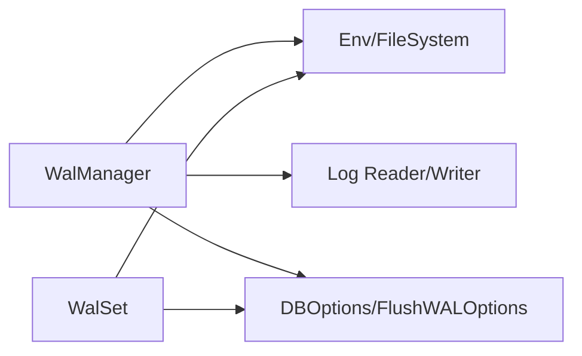

# WAL管理优化

<cite>
**本文引用的文件**   
- [wal_manager.h](file://source/rocksdb/db/wal_manager.h)
- [wal_manager.cc](file://source/rocksdb/db/wal_manager.cc)
- [wal_edit.h](file://source/rocksdb/db/wal_edit.h)
- [wal_edit.cc](file://source/rocksdb/db/wal_edit.cc)
- [options.h](file://source/rocksdb/include/rocksdb/options.h)
- [03_wal.md](file://source/rocksdb/docs/components/write_flow/03_wal.md)
- [wal_manager_test.cc](file://source/rocksdb/db/wal_manager_test.cc)
</cite>

## 目录
1. [简介](#简介)
2. [项目结构](#项目结构)
3. [核心组件](#核心组件)
4. [架构总览](#架构总览)
5. [详细组件分析](#详细组件分析)
6. [依赖关系分析](#依赖关系分析)
7. [性能考量](#性能考量)
8. [故障排查指南](#故障排查指南)
9. [结论](#结论)
10. [附录](#附录)

## 简介
本技术文档聚焦于WAL（预写日志）管理优化，围绕以下改进点展开：
- 文件删除策略的优化：基于TTL与大小限制的归档清理、并发安全与缓存一致性。
- 更新迭代器的增强：按序列号快速定位WAL文件的二分查找与“保留可能相关”的文件集合。
- WAL生命周期管理：创建、写入、同步、归档与清理的全链路流程。
- 配置选项与参数调优：WAL TTL、大小限制、刷新与同步行为等。
- 与RocksDB核心组件的集成：VersionSet/WalSet、MANIFEST跟踪、链式校验、IO路径与压缩元记录处理。
- 常见问题与解决方案：空文件、压缩头记录、竞态条件、时钟回拨等。

## 项目结构
与WAL管理相关的核心代码集中在RocksDB源码的db层与include/options中，关键文件如下：
- WalManager：WAL文件枚举、排序、归档、清理、按序列号获取更新迭代器。
- WalEdit/WalSet：WAL元数据在MANIFEST中的增删与一致性检查。
- Options：WAL清理策略（TTL、大小限制）、FlushWALOptions等。
- Write Flow文档：WAL格式、读写路径、回收与链式校验说明。

图表来源 
- [wal_manager.h:35-135](file://source/rocksdb/db/wal_manager.h#L35-L135)
- [wal_manager.cc:140-285](file://source/rocksdb/db/wal_manager.cc#L140-L285)
- [wal_edit.h:131-175](file://source/rocksdb/db/wal_edit.h#L131-L175)
- [options.h:1050-1067](file://source/rocksdb/include/rocksdb/options.h#L1050-L1067)

章节来源
- [wal_manager.h:35-135](file://source/rocksdb/db/wal_manager.h#L35-L135)
- [wal_manager.cc:140-285](file://source/rocksdb/db/wal_manager.cc#L140-L285)
- [wal_edit.h:131-175](file://source/rocksdb/db/wal_edit.h#L131-L175)
- [options.h:1050-1067](file://source/rocksdb/include/rocksdb/options.h#L1050-L1067)

## 核心组件
- WalManager
  - 职责：列举并排序WAL文件（主目录与归档目录），按序列号过滤，提供GetUpdatesSince迭代器；执行PurgeObsoleteWALFiles清理过期或超大小的归档WAL；归档与删除WAL文件；读取首条记录以获取起始序列号。
  - 关键方法：GetSortedWalFiles、RetainProbableWalFiles、ReadFirstRecord/ReadFirstLine、ArchiveWALFile、DeleteFile、GetLiveWalFile。
- WalEdit/WalSet
  - 职责：维护WAL的增删事件（WalAddition/WalDeletion），持久化到MANIFEST；支持最小保留编号与已同步大小追踪；提供CheckWals对磁盘状态进行一致性校验。
- Options
  - 职责：定义WAL清理策略（WAL_ttl_seconds、WAL_size_limit_MB）、FlushWALOptions（sync、rate_limiter_priority）等。

章节来源
- [wal_manager.h:35-135](file://source/rocksdb/db/wal_manager.h#L35-L135)
- [wal_manager.cc:140-285](file://source/rocksdb/db/wal_manager.cc#L140-L285)
- [wal_edit.h:30-175](file://source/rocksdb/db/wal_edit.h#L30-L175)
- [wal_edit.cc:14-105](file://source/rocksdb/db/wal_edit.cc#L14-L105)
- [options.h:1050-1067](file://source/rocksdb/include/rocksdb/options.h#L1050-L1067)
- [options.h:2481-2496](file://source/rocksdb/include/rocksdb/options.h#L2481-L2496)

## 架构总览
WAL管理的整体流程包括：
- 写入路径：WriteBatch先落盘WAL，再插入memtable；WAL通过log::Writer分片写入，支持压缩与CRC校验。
- 恢复路径：根据MANIFEST与WAL链信息重建memtable；WAL链校验可检测缺失或截断。
- 清理路径：后台定时触发PurgeObsoleteWALFiles，依据TTL与大小限制删除归档WAL，保持缓存一致。

图表来源 
- [03_wal.md:55-132](file://source/rocksdb/docs/components/write_flow/03_wal.md#L55-L132)
- [wal_manager.cc:140-285](file://source/rocksdb/db/wal_manager.cc#L140-L285)
- [wal_edit.cc:14-105](file://source/rocksdb/db/wal_edit.cc#L14-L105)

## 详细组件分析

### WalManager：WAL文件管理与清理
- 文件枚举与排序
  - 先枚举主目录kAliveLogFile，再枚举归档目录kArchivedLogFile，合并并按LogNumber排序，避免竞态导致重复或遗漏。
  - 需要序列号时调用ReadFirstRecord读取首条记录的序列号，空文件或仅含压缩元记录的特殊处理。
- 更新迭代器增强
  - RetainProbableWalFiles使用二分查找，基于StartSequence快速定位目标序列号所在文件，裁剪掉早于目标的文件，减少打开与扫描开销。
- 清理策略优化
  - 支持WAL_ttl_seconds与WAL_size_limit_MB两种策略，二者可独立或同时启用。
  - 清理频率控制：当仅启用TTL时，每TTL/2秒执行一次；仅启用大小时，每10分钟执行一次；两者都启用时取较小值。
  - 并发安全：使用原子变量purge_wal_files_last_run_与CAS确保同一时刻只有一个线程执行清理。
  - 缓存一致性：删除文件后从read_first_record_cache_移除对应条目，避免脏读。
- 归档与删除
  - ArchiveWALFile将活跃WAL移动到归档目录；DeleteFile直接删除并清理缓存。
  - 针对WAL与DB同路径场景，删除时可选择是否强制前台同步。

图表来源 
- [wal_manager.cc:140-285](file://source/rocksdb/db/wal_manager.cc#L140-L285)

章节来源
- [wal_manager.h:51-135](file://source/rocksdb/db/wal_manager.h#L51-L135)
- [wal_manager.cc:45-101](file://source/rocksdb/db/wal_manager.cc#L45-L101)
- [wal_manager.cc:140-285](file://source/rocksdb/db/wal_manager.cc#L140-L285)
- [wal_manager.cc:368-392](file://source/rocksdb/db/wal_manager.cc#L368-L392)
- [wal_manager.cc:394-438](file://source/rocksdb/db/wal_manager.cc#L394-L438)
- [wal_manager.cc:468-544](file://source/rocksdb/db/wal_manager.cc#L468-L544)

### WalEdit/WalSet：MANIFEST中的WAL元数据
- WalAddition/WalDeletion：记录WAL新增与删除事件，支持同步大小字段（synced size）。
- WalSet：维护当前WAL集合与最小保留编号，支持批量添加与删除；CheckWals校验磁盘上的WAL是否存在且大小不小于已同步大小。
- 与VersionSet协作：在WAL关闭或sync后记录到MANIFEST，用于恢复时的完整性验证。

图表来源 
- [wal_edit.h:30-175](file://source/rocksdb/db/wal_edit.h#L30-L175)
- [wal_edit.cc:14-105](file://source/rocksdb/db/wal_edit.cc#L14-L105)

章节来源
- [wal_edit.h:30-175](file://source/rocksdb/db/wal_edit.h#L30-L175)
- [wal_edit.cc:14-105](file://source/rocksdb/db/wal_edit.cc#L14-L105)

### 配置选项与参数调优
- WAL清理策略
  - WAL_ttl_seconds：归档WAL超过该时间将被删除；仅启用TTL时清理频率为TTL/2秒。
  - WAL_size_limit_MB：归档WAL总大小超过限制时，从最早的开始删除直到低于限制；仅启用大小时清理频率为10分钟。
  - 两者同时启用时，清理频率取较小值。
- FlushWALOptions
  - sync：是否在FlushWAL后调用SyncWAL。
  - rate_limiter_priority：为FlushWAL相关IO指定优先级，默认禁用速率限制计费。
- 其他相关
  - wal_bytes_per_sync：WAL文件的增量同步间隔。
  - track_and_verify_wals_in_manifest / track_and_verify_wals：MANIFEST跟踪与WAL链校验开关。

章节来源
- [options.h:1050-1067](file://source/rocksdb/include/rocksdb/options.h#L1050-L1067)
- [options.h:2481-2496](file://source/rocksdb/include/rocksdb/options.h#L2481-L2496)
- [options.h:1237-1245](file://source/rocksdb/include/rocksdb/options.h#L1237-L1245)

### 与RocksDB核心组件的集成与数据流
- 写入路径
  - log::Writer将WriteBatch分片写入WAL，支持压缩与CRC校验；Meta记录如kSetCompressionType由Reader内部消费。
- 恢复路径
  - 通过MANIFEST中的WalAddition/WalDeletion与WAL链信息（PredecessorWALInfo）进行完整性校验，防止缺失或截断。
- 迭代器路径
  - WalManager.GetUpdatesSince结合VersionSet与TransactionLogIterator，按序列号快速定位并构建迭代器。

图表来源 
- [03_wal.md:55-132](file://source/rocksdb/docs/components/write_flow/03_wal.md#L55-L132)
- [wal_manager.cc:103-130](file://source/rocksdb/db/wal_manager.cc#L103-L130)

章节来源
- [03_wal.md:55-132](file://source/rocksdb/docs/components/write_flow/03_wal.md#L55-L132)
- [wal_manager.cc:103-130](file://source/rocksdb/db/wal_manager.cc#L103-L130)

### 更新迭代器的增强功能
- 二分查找定位
  - RetainProbableWalFiles基于StartSequence进行二分搜索，避免打开所有文件，显著降低I/O与CPU开销。
- 空文件与压缩元记录处理
  - ReadFirstLine对仅含kSetCompressionType的空文件设置sequence=1，保证这些WAL被纳入迭代器范围。
- 测试覆盖
  - wal_manager_test.cc验证了ReadFirstRecord缓存命中与空文件行为。

章节来源
- [wal_manager.cc:368-392](file://source/rocksdb/db/wal_manager.cc#L368-L392)
- [wal_manager.cc:468-544](file://source/rocksdb/db/wal_manager.cc#L468-L544)
- [wal_manager_test.cc:131-173](file://source/rocksdb/db/wal_manager_test.cc#L131-L173)

## 依赖关系分析
WalManager依赖Env/FileSystem进行文件操作，依赖log::Reader/Writer处理WAL记录；WalSet依赖Env进行磁盘校验；Options提供清理策略与刷新行为。

图表来源 
- [wal_manager.cc:140-285](file://source/rocksdb/db/wal_manager.cc#L140-L285)
- [wal_edit.cc:169-200](file://source/rocksdb/db/wal_edit.cc#L169-L200)
- [options.h:1050-1067](file://source/rocksdb/include/rocksdb/options.h#L1050-L1067)

章节来源
- [wal_manager.cc:140-285](file://source/rocksdb/db/wal_manager.cc#L140-L285)
- [wal_edit.cc:169-200](file://source/rocksdb/db/wal_edit.cc#L169-L200)
- [options.h:1050-1067](file://source/rocksdb/include/rocksdb/options.h#L1050-L1067)

## 性能考量
- I/O优化
  - 二分查找减少文件打开次数；ReadFirstRecord缓存避免重复读取首条记录。
  - 归档目录扫描与大小统计仅在必要时执行，清理频率受配置控制。
- 压缩与元记录
  - WAL压缩可减少磁盘占用，但需正确处理kSetCompressionType元记录，避免误判为空文件。
- 并发与锁
  - 清理过程使用原子变量与CAS避免重复执行；删除文件后及时清理缓存，保证一致性。
- 同步策略
  - wal_bytes_per_sync与FlushWALOptions.sync影响持久性与时延，需根据业务权衡。

[本节为通用指导，不直接分析具体文件]

## 故障排查指南
- 空文件与压缩元记录
  - 现象：GetSortedWalFiles跳过仅含kSetCompressionType的文件。
  - 解决：ReadFirstLine将此类文件sequence设为1，确保纳入迭代器范围。
- 竞态条件
  - 现象：文件在主目录与归档目录之间移动导致重复或遗漏。
  - 解决：GetSortedWalFiles优先主目录再归档目录，并在合并时忽略重复项。
- 时钟回拨
  - 现象：now_seconds - file_m_time无符号下溢。
  - 解决：清理逻辑显式比较time_m_time <= now_seconds后再做差值。
- 缺失或损坏WAL
  - 现象：CheckWals发现磁盘上缺少WAL或大小小于已同步大小。
  - 解决：根据MANIFEST与WAL链信息进行恢复或告警。

章节来源
- [wal_manager.cc:468-544](file://source/rocksdb/db/wal_manager.cc#L468-L544)
- [wal_manager.cc:140-285](file://source/rocksdb/db/wal_manager.cc#L140-L285)
- [wal_edit.cc:169-200](file://source/rocksdb/db/wal_edit.cc#L169-L200)

## 结论
通过对WAL文件删除策略的优化与更新迭代器的增强，系统在清理效率、I/O开销与一致性方面得到显著提升。结合MANIFEST跟踪与WAL链校验，增强了恢复阶段的健壮性。合理配置WAL TTL与大小限制、FlushWALOptions等参数，可在持久性与性能之间取得平衡。

[本节为总结，不直接分析具体文件]

## 附录
- 使用建议
  - 高吞吐场景：适当增大WAL_size_limit_MB，降低清理频率；谨慎开启sync。
  - 强持久性场景：启用wal_bytes_per_sync与FlushWALOptions.sync；开启track_and_verify_wals_in_manifest。
  - 监控与诊断：关注PurgeObsoleteWALFiles的执行频率与删除数量；检查ReadFirstRecord缓存命中率。
- 参考实现路径
  - WalManager清理逻辑：[wal_manager.cc:140-285](file://source/rocksdb/db/wal_manager.cc#L140-L285)
  - 更新迭代器二分查找：[wal_manager.cc:368-392](file://source/rocksdb/db/wal_manager.cc#L368-L392)
  - WAL链校验与MANIFEST跟踪：[03_wal.md:97-115](file://source/rocksdb/docs/components/write_flow/03_wal.md#L97-L115)