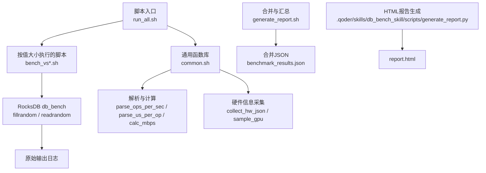
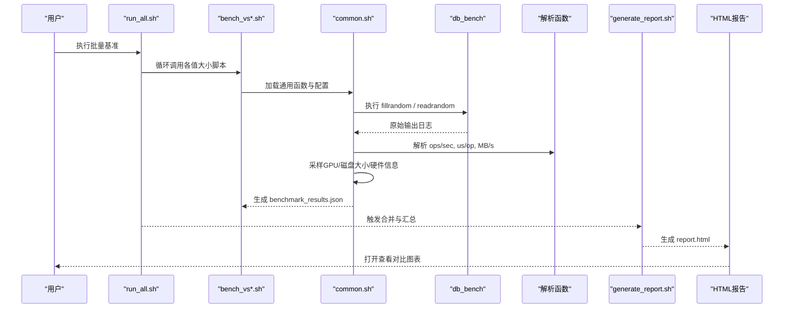
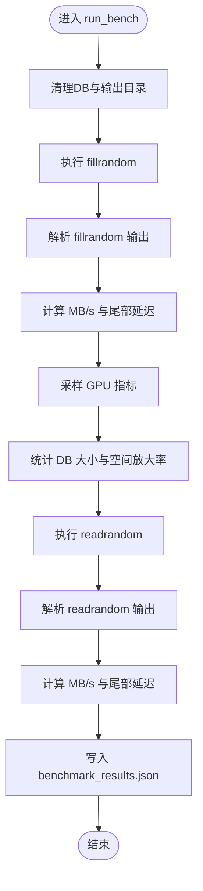
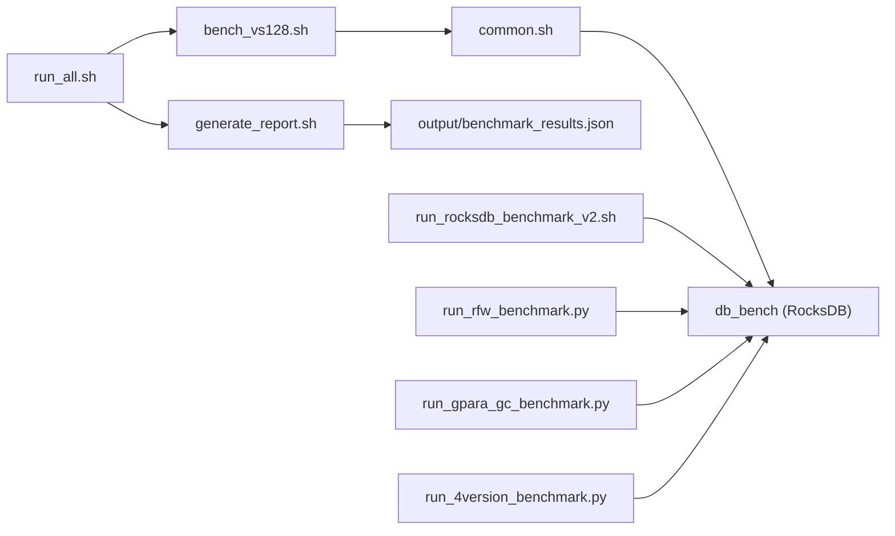
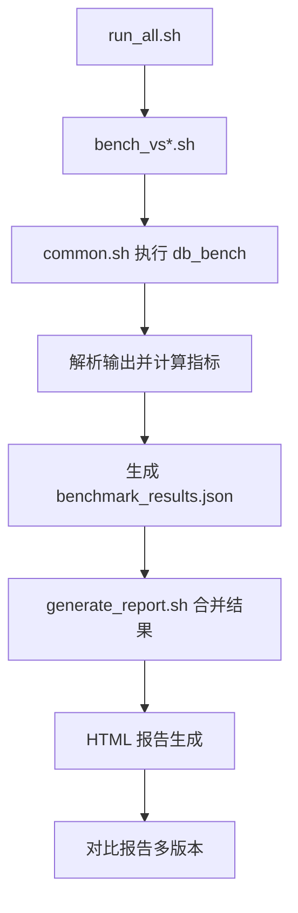

# 多版本对比分析

<cite>
**本文引用的文件**   
- [common.sh](file://script/common.sh)
- [bench_vs128.sh](file://script/bench_vs128.sh)
- [run_all.sh](file://script/run_all.sh)
- [generate_report.sh](file://script/generate_report.sh)
- [run_rocksdb_benchmark.sh](file://script/run_rocksdb_benchmark.sh)
- [run_rocksdb_benchmark_v2.sh](file://script/run_rocksdb_benchmark_v2.sh)
- [run_rfw_benchmark.py](file://script/run_rfw_benchmark.py)
- [run_rocksdb_flush_wal_benchmark.sh](file://script/run_rocksdb_flush_wal_benchmark.sh)
- [run_4version_benchmark.py](file://script/run_4version_benchmark.py)
- [run_gpara_gc_benchmark.py](file://script/run_gpara_gc_benchmark.py)
</cite>

## 目录
1. [简介](#简介)
2. [项目结构](#项目结构)
3. [核心组件](#核心组件)
4. [架构总览](#架构总览)
5. [详细组件分析](#详细组件分析)
6. [依赖关系分析](#依赖关系分析)
7. [性能指标与采集方法](#性能指标与采集方法)
8. [自动化测试流程](#自动化测试流程)
9. [使用示例](#使用示例)
10. [常见问题与排障](#常见问题与排障)
11. [扩展指南：新增版本与自定义场景](#扩展指南新增版本与自定义场景)
12. [结论](#结论)

## 简介
本仓库提供一套面向 RocksDB 及其衍生/定制版本的基准测试与多版本对比分析工具。通过统一的脚本体系，可自动执行不同值大小（value_size）的写入与读取基准，收集吞吐量、延迟、空间放大率、GPU 利用率等关键指标，并生成 JSON 与 HTML 报告，便于进行版本间性能差异分析与回归检测。

## 项目结构
- script：基准测试与报告生成的核心脚本集合，包含通用函数、批量执行、单版本/多版本对比、HTML 报告生成等。
- source：被评测的数据库实现或相关工具源码（如 rocksdb、rocksdb-flush-wal、gParaKV-GC 等），以及其自带的脚本与文档。
- output：运行结果输出目录（按 value_size 分目录存放 benchmark_results.json）。

图表来源 
- [run_all.sh:1-19](file://script/run_all.sh#L1-L19)
- [common.sh:1-196](file://script/common.sh#L1-L196)
- [generate_report.sh:1-59](file://script/generate_report.sh#L1-L59)

章节来源
- [run_all.sh:1-19](file://script/run_all.sh#L1-L19)
- [common.sh:1-196](file://script/common.sh#L1-L196)
- [generate_report.sh:1-59](file://script/generate_report.sh#L1-L59)

## 核心组件
- 通用函数库 common.sh：定义默认参数、环境变量、解析函数、MB/s 换算、硬件信息采样、单次值大小的完整基准流程（fillrandom + readrandom）及 JSON 输出。
- 批量执行 run_all.sh：顺序遍历多个 value_size，调用对应 bench_vs*.sh 完成全部基准。
- 报告合并 generate_report.sh：将各 value_size 的 JSON 合并为统一 benchmark_results.json，并打印摘要表格。
- 单版本基准脚本：
  - run_rocksdb_benchmark.sh：基于 .qoder/skills/db_bench_skill 的 Python 驱动执行 RocksDB 2GB 基准并生成 HTML。
  - run_rocksdb_benchmark_v2.sh：纯 Shell 实现，直接调用 db_bench 并生成 JSON + HTML。
  - run_rocksdb_flush_wal_benchmark.sh：针对 rocksdb-flush-wal 版本的专用入口。
- 多版本对比：
  - run_4version_benchmark.py：对四个 RocksDB 变体并行/串行执行，生成对比 HTML 与 combined JSON。
  - run_rfw_benchmark.py：针对 rocksdb-flush-wal 的多场景（随机/顺序/混合读写）基准。
  - run_gpara_gc_benchmark.py：针对 gParaKV-GC 的多场景基准，含 GPU 限制说明。

章节来源
- [common.sh:1-196](file://script/common.sh#L1-L196)
- [run_all.sh:1-19](file://script/run_all.sh#L1-L19)
- [generate_report.sh:1-59](file://script/generate_report.sh#L1-L59)
- [run_rocksdb_benchmark.sh:1-50](file://script/run_rocksdb_benchmark.sh#L1-L50)
- [run_rocksdb_benchmark_v2.sh:1-168](file://script/run_rocksdb_benchmark_v2.sh#L1-L168)
- [run_rocksdb_flush_wal_benchmark.sh:1-50](file://script/run_rocksdb_flush_wal_benchmark.sh#L1-L50)
- [run_4version_benchmark.py:1-358](file://script/run_4version_benchmark.py#L1-L358)
- [run_rfw_benchmark.py:1-311](file://script/run_rfw_benchmark.py#L1-L311)
- [run_gpara_gc_benchmark.py:1-304](file://script/run_gpara_gc_benchmark.py#L1-L304)

## 架构总览
整体流程分为“执行层”“采集层”“解析层”“聚合层”“展示层”。

图表来源 
- [run_all.sh:1-19](file://script/run_all.sh#L1-L19)
- [bench_vs128.sh:1-10](file://script/bench_vs128.sh#L1-L10)
- [common.sh:1-196](file://script/common.sh#L1-L196)
- [generate_report.sh:1-59](file://script/generate_report.sh#L1-L59)

## 详细组件分析

### 通用函数库 common.sh
- 默认参数与环境：KEY_SIZE、NUM_OPS、COMPRESSION、THREADS、WRITE_BUFFER_SIZE、SEED、LD_LIBRARY_PATH。
- 解析函数：parse_ops_per_sec、parse_us_per_op；MB/s 换算 calc_mbps。
- 硬件采样：collect_hw_json（CPU、内存、GPU、OS、内核）、sample_gpu（GPU 利用率与显存）。
- 基准流程 run_bench：清理环境、执行 fillrandom/readrandom、解析输出、计算吞吐/延迟/尾部延迟、统计空间放大率、采样 GPU、输出 JSON。

图表来源 
- [common.sh:68-196](file://script/common.sh#L68-L196)

章节来源
- [common.sh:1-196](file://script/common.sh#L1-L196)

### 批量执行 run_all.sh
- 顺序遍历 value_size：32、128、512、1024、4096、16384。
- 依次调用 bench_vs*.sh，最终在 output/vs*/benchmark_results.json 生成结果。

章节来源
- [run_all.sh:1-19](file://script/run_all.sh#L1-L19)

### 报告合并 generate_report.sh
- 读取 output/vs*/benchmark_results.json，合并 runs 列表，排序后输出到 output/benchmark_results.json。
- 打印摘要表格，显示各 value_size 的吞吐与延迟。

章节来源
- [generate_report.sh:1-59](file://script/generate_report.sh#L1-L59)

### 单版本基准脚本
- run_rocksdb_benchmark.sh：调用 .qoder/skills/db_bench_skill 的 Python 驱动执行 RocksDB 2GB 基准，随后生成 HTML 报告。
- run_rocksdb_benchmark_v2.sh：纯 Shell 实现，直接调用 db_bench，解析输出，生成 JSON 与 HTML。
- run_rocksdb_flush_wal_benchmark.sh：针对 rocksdb-flush-wal 版本的专用入口，同样依赖 .qoder/skills/db_bench_skill 驱动。

章节来源
- [run_rocksdb_benchmark.sh:1-50](file://script/run_rocksdb_benchmark.sh#L1-L50)
- [run_rocksdb_benchmark_v2.sh:1-168](file://script/run_rocksdb_benchmark_v2.sh#L1-L168)
- [run_rocksdb_flush_wal_benchmark.sh:1-50](file://script/run_rocksdb_flush_wal_benchmark.sh#L1-L50)

### 多版本对比 run_4version_benchmark.py
- 支持四个 RocksDB 变体：rocksdb、rocksdb-flush-gpu、rocksdb-flush-wal、rocksdb-flush-wal-0.2。
- 每个版本独立设置 LD_LIBRARY_PATH，确保加载正确的 librocksdb.so。
- 生成 combined_results.json 与 comparison_report.html，包含吞吐、延迟、ops/sec 曲线与对比表格。

章节来源
- [run_4version_benchmark.py:1-358](file://script/run_4version_benchmark.py#L1-L358)

### 多场景基准 run_rfw_benchmark.py
- 针对 rocksdb-flush-wal，覆盖三种场景：随机读写、顺序读写、混合读写。
- 处理 RocksDB 输出的 \r 回车问题，解析 micros/op 与 MB/s，采样 GPU 指标，计算空间放大率。
- 输出 JSON 与 HTML 报告，并按场景分组打印摘要。

章节来源
- [run_rfw_benchmark.py:1-311](file://script/run_rfw_benchmark.py#L1-L311)

### gParaKV-GC 基准 run_gpara_gc_benchmark.py
- 针对 gParaKV-GC，支持随机/顺序/混合读写场景。
- 由于 GPU GC 内存限制，num_keys 上限为 2M，避免 CUDA illegal memory access。
- 输出 JSON 与 HTML 报告，并在 metadata 中记录限制说明。

章节来源
- [run_gpara_gc_benchmark.py:1-304](file://script/run_gpara_gc_benchmark.py#L1-L304)

## 依赖关系分析
- 脚本依赖：
  - bench_vs*.sh 依赖 common.sh 提供的函数与默认参数。
  - run_all.sh 依赖所有 bench_vs*.sh。
  - generate_report.sh 依赖 output/vs*/benchmark_results.json。
  - run_rocksdb_benchmark.sh 与 run_rocksdb_flush_wal_benchmark.sh 依赖 .qoder/skills/db_bench_skill 的 Python 驱动（未在本仓库内列出，但路径已固定）。
  - run_rocksdb_benchmark_v2.sh 不依赖外部 Python 驱动，仅依赖系统命令与 nvidia-smi。
- 运行时依赖：
  - RocksDB 构建产物 db_bench 与动态库 librocksdb.so（通过 LD_LIBRARY_PATH 指定）。
  - nvidia-smi（可选，用于 GPU 指标采集）。

图表来源 
- [run_all.sh:1-19](file://script/run_all.sh#L1-L19)
- [bench_vs128.sh:1-10](file://script/bench_vs128.sh#L1-L10)
- [common.sh:1-196](file://script/common.sh#L1-L196)
- [generate_report.sh:1-59](file://script/generate_report.sh#L1-L59)
- [run_rocksdb_benchmark_v2.sh:1-168](file://script/run_rocksdb_benchmark_v2.sh#L1-L168)
- [run_rfw_benchmark.py:1-311](file://script/run_rfw_benchmark.py#L1-L311)
- [run_gpara_gc_benchmark.py:1-304](file://script/run_gpara_gc_benchmark.py#L1-L304)
- [run_4version_benchmark.py:1-358](file://script/run_4version_benchmark.py#L1-L358)

章节来源
- [run_all.sh:1-19](file://script/run_all.sh#L1-L19)
- [bench_vs128.sh:1-10](file://script/bench_vs128.sh#L1-L10)
- [common.sh:1-196](file://script/common.sh#L1-L196)
- [generate_report.sh:1-59](file://script/generate_report.sh#L1-L59)
- [run_rocksdb_benchmark_v2.sh:1-168](file://script/run_rocksdb_benchmark_v2.sh#L1-L168)
- [run_rfw_benchmark.py:1-311](file://script/run_rfw_benchmark.py#L1-L311)
- [run_gpara_gc_benchmark.py:1-304](file://script/run_gpara_gc_benchmark.py#L1-L304)
- [run_4version_benchmark.py:1-358](file://script/run_4version_benchmark.py#L1-L358)

## 性能指标与采集方法
- 吞吐（Throughput）
  - ops/sec：从 db_bench 输出行解析，单位操作每秒。
  - MB/s：由 ops/sec 与键值大小计算得出，公式为 MB/s = ops/sec × (key_size + value_size) / (1024×1024)。
- 延迟（Latency）
  - us/op：微秒每操作，直接从 db_bench 输出解析。
  - 尾部延迟：us/op × 1.5（近似估计 P95/P99 级别）。
- 资源利用率
  - GPU 利用率与显存占用：通过 nvidia-smi 查询 utilization.gpu 与 memory.used。
  - 空间放大率：DB 目录大小 / 逻辑数据大小（num_keys × (key_size + value_size)）。
- 硬件信息
  - CPU 型号与核心数、内存总量、操作系统与内核版本、GPU 型号。

章节来源
- [common.sh:16-39](file://script/common.sh#L16-L39)
- [common.sh:41-66](file://script/common.sh#L41-L66)
- [common.sh:157-189](file://script/common.sh#L157-L189)
- [run_rocksdb_benchmark_v2.sh:27-48](file://script/run_rocksdb_benchmark_v2.sh#L27-L48)
- [run_rfw_benchmark.py:33-68](file://script/run_rfw_benchmark.py#L33-L68)
- [run_gpara_gc_benchmark.py:31-66](file://script/run_gpara_gc_benchmark.py#L31-L66)

## 自动化测试流程
- 执行阶段
  - run_all.sh 顺序遍历 value_size，调用 bench_vs*.sh。
  - bench_vs*.sh 加载 common.sh，执行 fillrandom 与 readrandom，解析输出并生成 JSON。
- 采集阶段
  - common.sh 解析 db_bench 输出，计算吞吐与延迟，采样 GPU 指标，统计空间放大率。
- 聚合阶段
  - generate_report.sh 合并各 value_size 的 JSON，生成统一 benchmark_results.json 与摘要表格。
- 展示阶段
  - 通过 .qoder/skills/db_bench_skill 的 generate_report.py 生成 HTML 报告（包含图表与表格）。
  - 多版本对比脚本生成对比 HTML 与 combined JSON。

图表来源 
- [run_all.sh:1-19](file://script/run_all.sh#L1-L19)
- [bench_vs128.sh:1-10](file://script/bench_vs128.sh#L1-L10)
- [common.sh:68-196](file://script/common.sh#L68-L196)
- [generate_report.sh:1-59](file://script/generate_report.sh#L1-L59)
- [run_4version_benchmark.py:75-292](file://script/run_4version_benchmark.py#L75-L292)

章节来源
- [run_all.sh:1-19](file://script/run_all.sh#L1-L19)
- [common.sh:68-196](file://script/common.sh#L68-L196)
- [generate_report.sh:1-59](file://script/generate_report.sh#L1-L59)
- [run_4version_benchmark.py:75-292](file://script/run_4version_benchmark.py#L75-L292)

## 使用示例
- 环境准备
  - 确保 RocksDB 已构建，db_bench 二进制位于 rocksdb/build/db_bench。
  - 设置 LD_LIBRARY_PATH 指向构建目录，以便加载正确的 librocksdb.so。
  - 若需 GPU 指标，安装并启用 nvidia-smi。
- 执行单值大小基准
  - 运行 bench_vs128.sh（或其他 bench_vs*.sh），将在 output/vs128/benchmark_results.json 生成结果。
- 执行全部值大小基准
  - 运行 run_all.sh，将顺序执行 32/128/512/1024/4096/16384 的基准，结果保存在 output/vs*/benchmark_results.json。
- 合并与汇总
  - 运行 generate_report.sh，合并结果为 output/benchmark_results.json，并打印摘要表格。
- 单版本 2GB 基准（Python 驱动）
  - 运行 run_rocksdb_benchmark.sh，生成 JSON 与 HTML 报告。
- 单版本 2GB 基准（Shell 直调）
  - 运行 run_rocksdb_benchmark_v2.sh，直接调用 db_bench 并生成 JSON 与 HTML。
- 多版本对比
  - 运行 run_4version_benchmark.py，生成 combined_results.json 与 comparison_report.html。
- 多场景基准（rocksdb-flush-wal）
  - 运行 run_rfw_benchmark.py，覆盖随机/顺序/混合读写场景。
- gParaKV-GC 基准
  - 运行 run_gpara_gc_benchmark.py，注意 num_keys 上限与 GPU 限制。

章节来源
- [bench_vs128.sh:1-10](file://script/bench_vs128.sh#L1-L10)
- [run_all.sh:1-19](file://script/run_all.sh#L1-L19)
- [generate_report.sh:1-59](file://script/generate_report.sh#L1-L59)
- [run_rocksdb_benchmark.sh:1-50](file://script/run_rocksdb_benchmark.sh#L1-L50)
- [run_rocksdb_benchmark_v2.sh:1-168](file://script/run_rocksdb_benchmark_v2.sh#L1-L168)
- [run_4version_benchmark.py:1-358](file://script/run_4version_benchmark.py#L1-L358)
- [run_rfw_benchmark.py:1-311](file://script/run_rfw_benchmark.py#L1-L311)
- [run_gpara_gc_benchmark.py:1-304](file://script/run_gpara_gc_benchmark.py#L1-L304)

## 常见问题与排障
- 找不到 db_bench 二进制
  - 检查 rocksdb/build/db_bench 是否存在，确认 LD_LIBRARY_PATH 正确设置。
- 动态库加载失败
  - 确保 LD_LIBRARY_PATH 包含构建目录，且 librocksdb.so 存在。
- GPU 指标为空
  - 确认 nvidia-smi 可用，且当前用户有权限查询 GPU 状态。
- 基准超时
  - 对于大值大小或大量 key，适当调整线程数、write_buffer_size 或增加超时时间。
- CUDA 错误（gParaKV-GC）
  - 受 GPU GC 内存限制，num_keys 上限为 2M，避免非法内存访问。
- 输出解析失败
  - 检查 db_bench 输出格式是否匹配正则表达式，必要时调整解析逻辑。

章节来源
- [run_rocksdb_benchmark.sh:1-50](file://script/run_rocksdb_benchmark.sh#L1-L50)
- [run_rocksdb_benchmark_v2.sh:1-168](file://script/run_rocksdb_benchmark_v2.sh#L1-L168)
- [run_rfw_benchmark.py:71-105](file://script/run_rfw_benchmark.py#L71-L105)
- [run_gpara_gc_benchmark.py:155-169](file://script/run_gpara_gc_benchmark.py#L155-L169)

## 扩展指南：新增版本与自定义场景
- 新增 RocksDB 版本
  - 在 run_4version_benchmark.py 的 VERSIONS 字典中添加新版本路径。
  - 确保 build 目录与 LD_LIBRARY_PATH 正确设置。
- 自定义值大小与场景
  - 修改 bench_vs*.sh 或 common.sh 中的 VALUE_SIZES 与基准参数。
  - 在 run_rfw_benchmark.py 或 run_gpara_gc_benchmark.py 中添加新的 benchmark_pair。
- 自定义指标采集
  - 在 common.sh 或 Python 脚本中扩展解析逻辑，添加新的指标字段。
  - 更新 generate_report.sh 以支持新字段的合并与展示。
- 自定义报告模板
  - 替换 .qoder/skills/db_bench_skill/scripts/generate_report.py 的模板，生成符合需求的 HTML。

章节来源
- [run_4version_benchmark.py:16-28](file://script/run_4version_benchmark.py#L16-L28)
- [common.sh:68-196](file://script/common.sh#L68-L196)
- [run_rfw_benchmark.py:220-240](file://script/run_rfw_benchmark.py#L220-L240)
- [run_gpara_gc_benchmark.py:211-231](file://script/run_gpara_gc_benchmark.py#L211-L231)

## 结论
本工具链提供了完整的 RocksDB 多版本基准测试与对比分析能力，涵盖吞吐、延迟、资源利用率等关键指标，并通过 JSON 与 HTML 报告实现可视化与自动化。通过模块化脚本设计，用户可以轻松扩展新版本与自定义场景，满足持续集成与性能回归的需求。