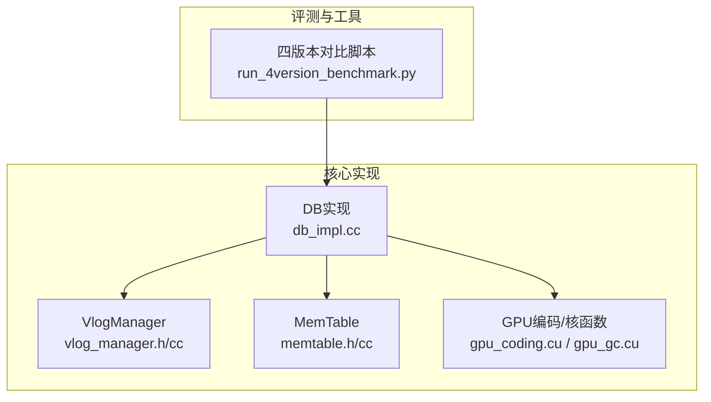
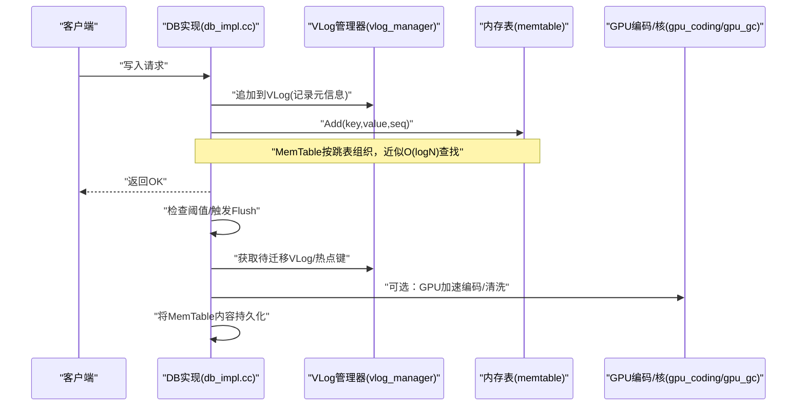
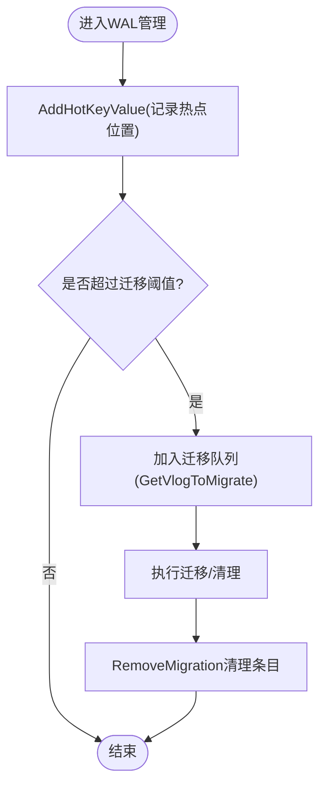
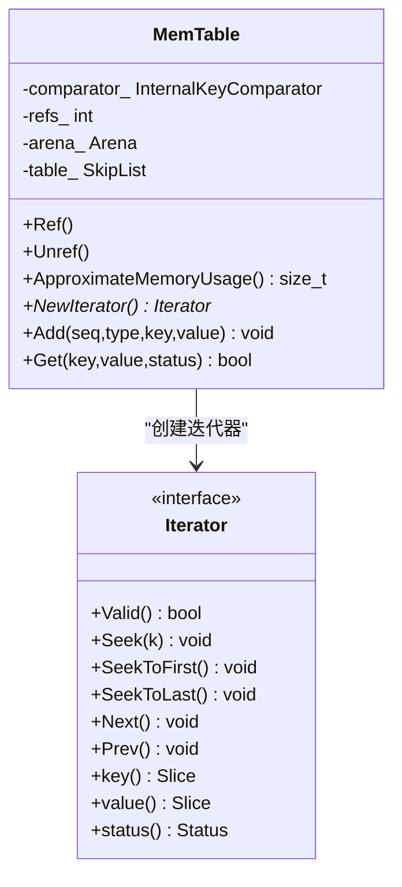
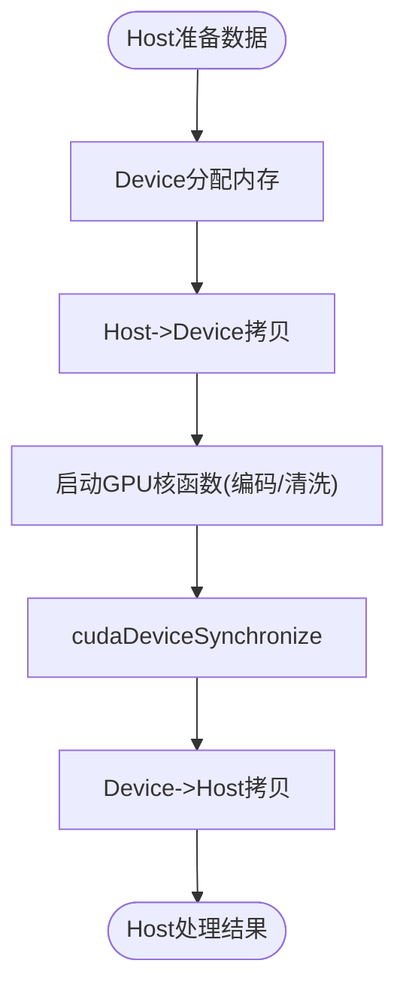
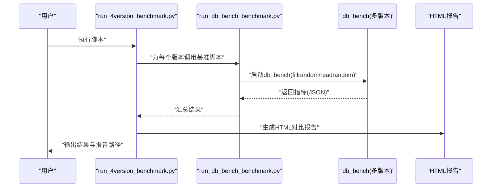
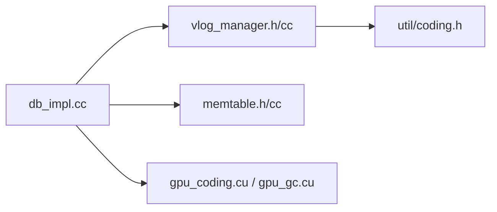

# 核心特性

<cite>
**本文引用的文件**   
- [vlog_manager.h](file://source/gParaKV-GC-master/db/vlog_manager.h)
- [vlog_manager.cc](file://source/gParaKV-GC-master/db/vlog_manager.cc)
- [memtable.h](file://source/gParaKV-GC-master/db/memtable.h)
- [memtable.cc](file://source/gParaKV-GC-master/db/memtable.cc)
- [gpu_gc.cu](file://source/gParaKV-GC-master/db/cuda/gpu_gc.cu)
- [gpu_coding.cu](file://source/gParaKV-GC-master/db/cuda/gpu_coding.cu)
- [db_impl.cc](file://source/gParaKV-GC-master/db/db_impl.cc)
- [run_4version_benchmark.py](file://script/run_4version_benchmark.py)
</cite>

## 目录
1. [简介](#简介)
2. [项目结构](#项目结构)
3. [核心组件](#核心组件)
4. [架构总览](#架构总览)
5. [详细组件分析](#详细组件分析)
6. [依赖关系分析](#依赖关系分析)
7. [性能考量](#性能考量)
8. [故障排查指南](#故障排查指南)
9. [结论](#结论)
10. [附录](#附录)

## 简介
本文件面向metadata_offload项目的开发者，系统化阐述以下核心特性：
- WAL管理优化：预写日志管理的改进与文件删除策略
- Flush操作优化：内存表选择与批量写入机制
- GPU加速压缩：CUDA内核设计与流水线处理思路
- 多版本对比分析工具：使用方法与输出解读

文档以代码库术语为准，提供实现原理、配置要点与使用示例，帮助读者快速理解并高效使用。

## 项目结构
本项目围绕LevelDB/RocksDB的扩展与优化展开，关键源码位于source目录下多个分支/子工程，其中gParaKV-GC系列包含WAL与Flush相关实现，GPU相关内核位于cuda子目录，脚本用于多版本基准测试与报告生成。

图表来源
- [vlog_manager.h:1-57](file://source/gParaKV-GC-master/db/vlog_manager.h#L1-L57)
- [vlog_manager.cc:1-68](file://source/gParaKV-GC-master/db/vlog_manager.cc#L1-L68)
- [memtable.h:1-89](file://source/gParaKV-GC-master/db/memtable.h#L1-L89)
- [memtable.cc:1-136](file://source/gParaKV-GC-master/db/memtable.cc#L1-L136)
- [db_impl.cc:1487-1749](file://source/gParaKV-GC-master/db/db_impl.cc#L1487-L1749)
- [gpu_coding.cu:1-120](file://source/gParaKV-GC-master/db/cuda/gpu_coding.cu#L1-L120)
- [gpu_gc.cu:1-73](file://source/gParaKV-GC-master/db/cuda/gpu_gc.cu#L1-L73)
- [run_4version_benchmark.py:1-358](file://script/run_4version_benchmark.py#L1-L358)

章节来源
- [vlog_manager.h:1-57](file://source/gParaKV-GC-master/db/vlog_manager.h#L1-L57)
- [vlog_manager.cc:1-68](file://source/gParaKV-GC-master/db/vlog_manager.cc#L1-L68)
- [memtable.h:1-89](file://source/gParaKV-GC-master/db/memtable.h#L1-L89)
- [memtable.cc:1-136](file://source/gParaKV-GC-master/db/memtable.cc#L1-L136)
- [db_impl.cc:1487-1749](file://source/gParaKV-GC-master/db/db_impl.cc#L1487-L1749)
- [gpu_coding.cu:1-120](file://source/gParaKV-GC-master/db/cuda/gpu_coding.cu#L1-L120)
- [gpu_gc.cu:1-73](file://source/gParaKV-GC-master/db/cuda/gpu_gc.cu#L1-L73)
- [run_4version_benchmark.py:1-358](file://script/run_4version_benchmark.py#L1-L358)

## 核心组件
- VlogManager：维护多版本日志（VLog）集合，记录热键位置，支持迁移阈值判断与清理。
- MemTable：基于跳表的内存表，负责追加、查找与迭代，是Flush前的数据暂存单元。
- DB实现：协调VLog与MemTable，触发Compaction/Flush流程，统计字节数与状态。
- GPU编码/核函数：提供GPU侧编解码与标记等原语，为后续压缩/清洗流水线提供基础。
- 多版本对比脚本：统一执行不同版本的db_bench，汇总指标并生成HTML报告。

章节来源
- [vlog_manager.h:15-52](file://source/gParaKV-GC-master/db/vlog_manager.h#L15-L52)
- [vlog_manager.cc:7-65](file://source/gParaKV-GC-master/db/vlog_manager.cc#L7-L65)
- [memtable.h:21-84](file://source/gParaKV-GC-master/db/memtable.h#L21-L84)
- [memtable.cc:19-133](file://source/gParaKV-GC-master/db/memtable.cc#L19-L133)
- [db_impl.cc:590-639](file://source/gParaKV-GC-master/db/db_impl.cc#L590-L639)
- [gpu_coding.cu:8-120](file://source/gParaKV-GC-master/db/cuda/gpu_coding.cu#L8-L120)
- [gpu_gc.cu:1-73](file://source/gParaKV-GC-master/db/cuda/gpu_gc.cu#L1-L73)
- [run_4version_benchmark.py:16-51](file://script/run_4version_benchmark.py#L16-L51)

## 架构总览
下图展示WAL与Flush在主流程中的交互关系：写入先入WAL与MemTable；达到阈值后触发Flush，将MemTable落盘；VlogManager跟踪VLog与热点键，辅助迁移与清理。

图表来源
- [db_impl.cc:1487-1749](file://source/gParaKV-GC-master/db/db_impl.cc#L1487-L1749)
- [vlog_manager.h:15-52](file://source/gParaKV-GC-master/db/vlog_manager.h#L15-L52)
- [vlog_manager.cc:39-65](file://source/gParaKV-GC-master/db/vlog_manager.cc#L39-L65)
- [memtable.cc:74-97](file://source/gParaKV-GC-master/db/memtable.cc#L74-L97)
- [gpu_coding.cu:8-120](file://source/gParaKV-GC-master/db/cuda/gpu_coding.cu#L8-L120)

## 详细组件分析

### WAL管理优化：预写日志管理与文件删除策略
- 设计要点
  - VlogManager维护VLog集合与热点键位置映射，支持按阈值判定是否进行迁移或清理。
  - AddHotKeyValue累计某VLog中热点键位置，超过migrate_threshold且非当前活跃VLog时加入迁移队列。
  - GetVlogToMigrate/RemoveMigration配合上层完成迁移与清理。
- 关键接口与数据结构
  - VlogInfo/VlogManager内部哈希表管理VLog句柄与计数。
  - KeyValueInfo保存keyValuesPos_向量，count()返回条目数。
  - clean_threshold_/migrate_threshold_控制清理与迁移行为。
- 文件删除策略
  - 通过IsMigration与GetVlogToMigrate识别可迁移/可清理目标，结合阈值避免误删活跃VLog。
  - RemoveMigration在迁移完成后清理对应条目，释放内存并重置计数。
- 使用示例
  - 初始化VlogManager时传入clean_threshold与migrate_threshold。
  - 写入路径中调用AddHotKeyValue累积热点位置。
  - 后台任务轮询IsMigration，若为真则取出待迁移VLog并完成迁移与清理。

图表来源
- [vlog_manager.h:15-52](file://source/gParaKV-GC-master/db/vlog_manager.h#L15-L52)
- [vlog_manager.cc:39-65](file://source/gParaKV-GC-master/db/vlog_manager.cc#L39-L65)

章节来源
- [vlog_manager.h:15-52](file://source/gParaKV-GC-master/db/vlog_manager.h#L15-L52)
- [vlog_manager.cc:7-65](file://source/gParaKV-GC-master/db/vlog_manager.cc#L7-L65)

### Flush操作优化：内存表选择与批量写入
- 设计要点
  - MemTable作为写入热点缓存，采用跳表存储，支持高效的Add与Get。
  - db_impl在合适时机触发TEST_CompactMemTable/Flush，将不可变MemTable转为持久化表。
  - 批量写入通过一次Add序列减少锁竞争与拷贝开销。
- 关键流程
  - Add：将键值与序列号编码后插入跳表。
  - Get：根据LookupKey定位内部键，解析tag区分Value/Deletion。
  - Flush：选择不可变MemTable，构建新表并替换，更新统计bytes_flush_write。
- 使用示例
  - 构造MemTable时传入InternalKeyComparator。
  - 写入路径反复调用Add，达到阈值后由DB层触发Flush。
  - 读取路径通过NewIterator遍历或Get精确查找。

图表来源
- [memtable.h:21-84](file://source/gParaKV-GC-master/db/memtable.h#L21-L84)
- [memtable.cc:44-72](file://source/gParaKV-GC-master/db/memtable.cc#L44-L72)

章节来源
- [memtable.h:21-84](file://source/gParaKV-GC-master/db/memtable.h#L21-L84)
- [memtable.cc:74-133](file://source/gParaKV-GC-master/db/memtable.cc#L74-L133)
- [db_impl.cc:590-639](file://source/gParaKV-GC-master/db/db_impl.cc#L590-L639)

### GPU加速压缩：CUDA内核设计与流水线处理
- 设计要点
  - gpu_coding.cu提供GPU侧编解码原语（如Varint/Fixed系列），便于在GPU上对键值进行紧凑编码。
  - gpu_gc.cu展示了GPU清洗/标记的骨架（含设备内存分配、核函数启动与同步），可用于后续压缩流水线。
- 关键能力
  - GPUEncodeVarint32/64、GPUPutFixedXxx/GPUDecodeFixedXxx等原子编解码。
  - 核函数模板：计算线程ID、边界检查、原子累加与结果写入。
- 流水线思路
  - Host端准备输入数据与缓冲区，Device端并行编码/清洗，最后同步并回传结果。
  - 可与VlogManager/Flush流程集成：在Flush前将MemTable数据送入GPU进行压缩，再落盘。

图表来源
- [gpu_coding.cu:8-120](file://source/gParaKV-GC-master/db/cuda/gpu_coding.cu#L8-L120)
- [gpu_gc.cu:20-44](file://source/gParaKV-GC-master/db/cuda/gpu_gc.cu#L20-L44)

章节来源
- [gpu_coding.cu:8-120](file://source/gParaKV-GC-master/db/cuda/gpu_coding.cu#L8-L120)
- [gpu_gc.cu:1-73](file://source/gParaKV-GC-master/db/cuda/gpu_gc.cu#L1-L73)

### 多版本对比分析工具：使用方法与输出
- 功能概述
  - run_4version_benchmark.py统一运行四个RocksDB版本的db_bench，收集fill/read吞吐与延迟，生成JSON与HTML对比报告。
- 配置项
  - VERSIONS：指定各版本二进制路径。
  - VALUE_SIZES：测试的值大小集合。
  - TOTAL_DATA_GB/KEY_SIZE/THREADS/COMPRESSION/SEED：基准参数。
  - build_env_for_version：设置LD_LIBRARY_PATH加载对应so。
- 使用步骤
  - 确保各版本已构建出db_bench二进制。
  - 运行脚本，自动执行填充与随机读基准，输出benchmark_results.json与comparison_report.html。
  - 查看HTML报告中的表格与图表，比较不同版本在各指标上的表现。

图表来源
- [run_4version_benchmark.py:16-51](file://script/run_4version_benchmark.py#L16-L51)
- [run_4version_benchmark.py:75-150](file://script/run_4version_benchmark.py#L75-L150)
- [run_4version_benchmark.py:295-358](file://script/run_4version_benchmark.py#L295-L358)

章节来源
- [run_4version_benchmark.py:16-51](file://script/run_4version_benchmark.py#L16-L51)
- [run_4version_benchmark.py:75-150](file://script/run_4version_benchmark.py#L75-L150)
- [run_4version_benchmark.py:295-358](file://script/run_4version_benchmark.py#L295-L358)

## 依赖关系分析
- 模块耦合
  - db_impl.cc依赖VlogManager与MemTable，协调写入、Flush与Compaction。
  - VlogManager依赖编码工具（util/coding.h）解析VLog中的位置信息。
  - GPU模块独立提供编解码原语，供上层在Flush前调用。
- 外部依赖
  - LevelDB/RocksDB基础设施（跳表、迭代器、状态码等）。
  - CUDA运行时（设备内存分配、核函数启动、同步）。
- 潜在循环依赖
  - 当前结构无直接循环依赖；VlogManager与MemTable被DB实现聚合，GPU模块被DB实现调用。

图表来源
- [db_impl.cc:1487-1749](file://source/gParaKV-GC-master/db/db_impl.cc#L1487-L1749)
- [vlog_manager.cc:1-10](file://source/gParaKV-GC-master/db/vlog_manager.cc#L1-L10)
- [memtable.cc:1-10](file://source/gParaKV-GC-master/db/memtable.cc#L1-L10)
- [gpu_coding.cu:1-10](file://source/gParaKV-GC-master/db/cuda/gpu_coding.cu#L1-L10)

章节来源
- [db_impl.cc:1487-1749](file://source/gParaKV-GC-master/db/db_impl.cc#L1487-L1749)
- [vlog_manager.cc:1-10](file://source/gParaKV-GC-master/db/vlog_manager.cc#L1-L10)
- [memtable.cc:1-10](file://source/gParaKV-GC-master/db/memtable.cc#L1-L10)
- [gpu_coding.cu:1-10](file://source/gParaKV-GC-master/db/cuda/gpu_coding.cu#L1-L10)

## 性能考量
- WAL与Flush
  - 合理设置clean_threshold与migrate_threshold，平衡迁移频率与I/O压力。
  - MemTable大小与批量化写入可减少锁竞争与系统调用次数。
- GPU加速
  - 充分利用设备并行度，合理划分block/grid，避免频繁Host-Device拷贝。
  - 在Flush前进行GPU压缩可降低落盘体积，提升吞吐。
- 基准对比
  - 使用run_4version_benchmark.py在不同值大小下评估吞吐与延迟，关注ops/sec曲线与分位数延迟。

[本节为通用指导，不直接分析具体文件]

## 故障排查指南
- VLog相关问题
  - 检查AddHotKeyValue是否正确累计热点位置，确认migrate_threshold未被误触发。
  - 若迁移失败，检查GetVlogToMigrate返回值与RemoveMigration清理逻辑。
- MemTable问题
  - 若Get返回NotFound，确认Add的序列号与类型编码正确，以及LookupKey匹配。
  - 迭代器越界或无效状态需检查Seek/Next/Prev调用顺序。
- GPU问题
  - cudaDeviceSynchronize失败通常表示核函数异常，检查线程边界与内存访问。
  - 编解码错误可通过打印中间变量或使用调试工具定位。
- 基准脚本
  - 若某版本无结果，检查二进制路径与LD_LIBRARY_PATH设置。
  - HTML报告未生成，确认benchmark_results.json存在且格式正确。

章节来源
- [vlog_manager.cc:39-65](file://source/gParaKV-GC-master/db/vlog_manager.cc#L39-L65)
- [memtable.cc:99-133](file://source/gParaKV-GC-master/db/memtable.cc#L99-L133)
- [gpu_gc.cu:20-44](file://source/gParaKV-GC-master/db/cuda/gpu_gc.cu#L20-L44)
- [run_4version_benchmark.py:295-358](file://script/run_4version_benchmark.py#L295-L358)

## 结论
本项目在WAL管理、Flush优化与GPU加速方面提供了清晰的实现路径与可扩展点。通过VlogManager精细化控制日志生命周期，MemTable高效承载写入热点，GPU编解码为压缩流水线奠定基础。配合多版本对比工具，可快速验证优化效果并指导调优方向。

[本节为总结性内容，不直接分析具体文件]

## 附录
- 常用配置建议
  - clean_threshold：根据磁盘空间与清理成本设定，避免频繁清理。
  - migrate_threshold：依据热点密度与迁移代价调整，降低不必要的迁移。
  - MemTable大小：依据内存预算与写入模式调优，平衡命中率与内存占用。
- 参考路径
  - WAL管理：vlog_manager.h/cc
  - 内存表：memtable.h/cc
  - GPU内核：gpu_coding.cu / gpu_gc.cu
  - 基准脚本：run_4version_benchmark.py

[本节为补充说明，不直接分析具体文件]