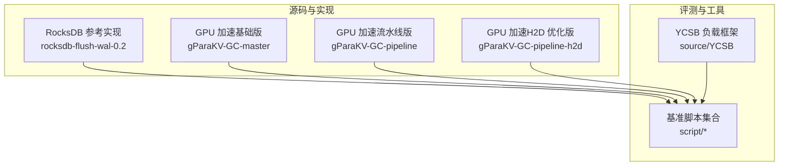
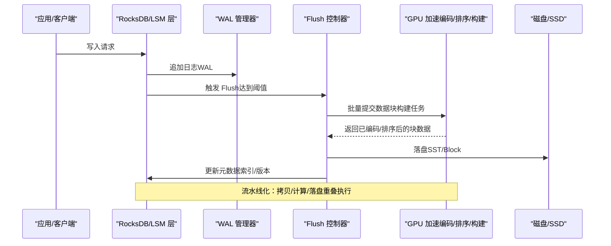
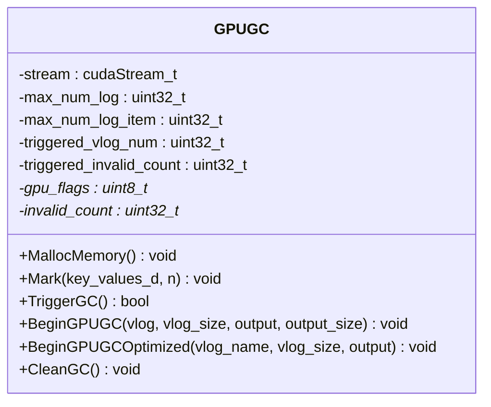
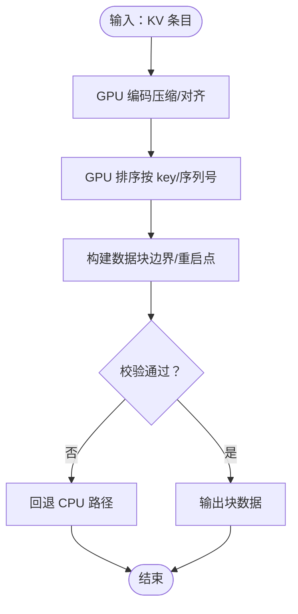
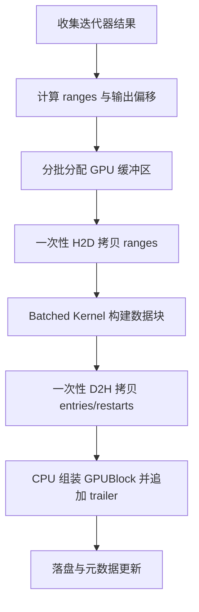
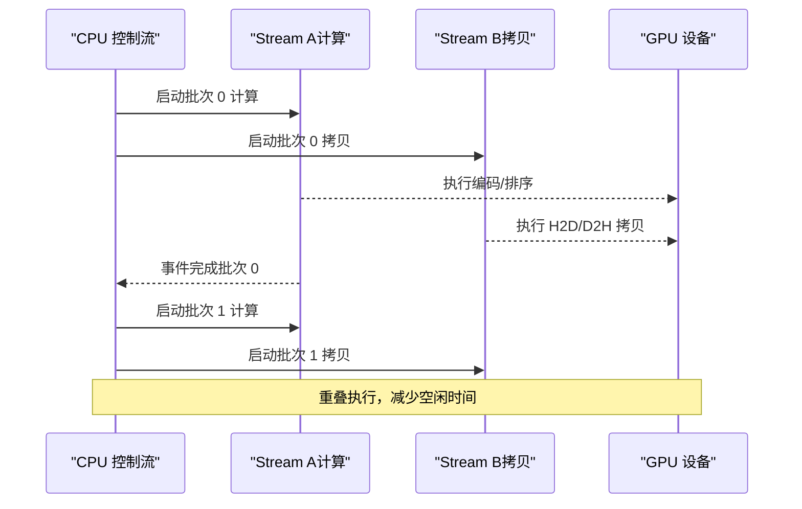
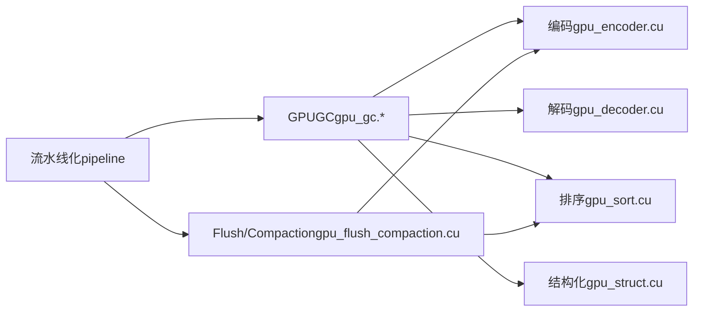

# 项目介绍

<cite>
**本文引用的文件**   
- [rocksdb-flush-wal-0.2/README.md](file://source/rocksdb-flush-wal-0.2/README.md)
- [修改建议.txt](file://source/rocksdb-flush-wal-0.2/修改建议.txt)
- [gpu_gc.h（gParaKV-GC-master）](file://source/gParaKV-GC-master/db/gpu_gc.h)
- [gpu_gc.cu（gParaKV-GC-master）](file://source/gParaKV-GC-master/db/cuda/gpu_gc.cu)
- [gpu_encoder.cu（gParaKV-GC-master）](file://source/gParaKV-GC-master/db/cuda/gpu_encoder.cu)
- [gpu_decoder.cu（gParaKV-GC-master）](file://source/gParaKV-GC-master/db/cuda/gpu_decoder.cu)
- [gpu_sort.cu（gParaKV-GC-master）](file://source/gParaKV-GC-master/db/cuda/gpu_sort.cu)
- [gpu_struct.cu（gParaKV-GC-master）](file://source/gParaKV-GC-master/db/cuda/gpu_struct.cu)
- [gpu_flush_compaction.cu（gParaKV-GC-master）](file://source/gParaKV-GC-master/db/cuda/gpu_flush_compaction.cu)
- [gpu_gc.h（gParaKV-GC-pipeline）](file://source/gParaKV-GC-pipeline/db/gpu_gc.h)
- [gpu_gc.cu（gParaKV-GC-pipeline）](file://source/gParaKV-GC-pipeline/db/cuda/gpu_gc.cu)
- [gc_pipeline_bench.cu（gParaKV-GC-pipeline）](file://source/gParaKV-GC-pipeline/db/cuda_pipeline_gc/gc_pipeline_bench.cu)
- [gc_pipeline_db_bench.cu（gParaKV-GC-pipeline）](file://source/gParaKV-GC-pipeline/db/cuda_pipeline_gc/gc_pipeline_db_bench.cu)
- [run_rocksdb_flush_wal_benchmark.sh](file://script/run_rocksdb_flush_wal_benchmark.sh)
- [run_rfw_benchmark.py](file://script/run_rfw_benchmark.py)
- [run_4version_benchmark.py](file://script/run_4version_benchmark.py)
</cite>

## 目录
1. [引言](#引言)
2. [项目结构](#项目结构)
3. [核心组件](#核心组件)
4. [架构总览](#架构总览)
5. [详细组件分析](#详细组件分析)
6. [依赖关系分析](#依赖关系分析)
7. [性能考量](#性能考量)
8. [故障排查指南](#故障排查指南)
9. [结论](#结论)
10. [附录](#附录)

## 引言
metadata_offload 是一个面向 RocksDB 键值存储引擎元数据卸载与 GPU 加速优化的研究项目。项目的核心目标包括：
- 改进 WAL（Write-Ahead Log）管理与 Flush 操作的性能，降低主机端开销并提升吞吐；
- 实现 GPU 加速的数据块构建与压缩，利用 GPU 的大规模并行能力加速编码、排序与转储；
- 提供流水线化优化，将拷贝、计算与落盘等阶段重叠执行，减少同步等待；
- 支持多版本对比分析，便于评估不同实现路径与参数配置对延迟、吞吐与资源占用的影响。

现代存储系统在高并发写入与海量数据场景下，WAL 的持久化与 LSM 结构的 Flush/Compaction 成为关键瓶颈。通过把 CPU 密集且可并行的任务卸载到 GPU，并在合适的位置进行流水线编排，可以显著降低主线程阻塞、减少内存拷贝与调度开销，从而提升整体吞吐并稳定延迟。本项目围绕这些痛点展开工程实践与实验验证，为研究者与工程师提供可复现的基线与优化方案。

## 项目结构
仓库包含多个子模块与基准脚本，覆盖 RocksDB 原生实现、带 GPU 加速的版本以及流水线化变体，并提供统一的评测脚本集。
- source/rocksdb-flush-wal-0.2：RocksDB 相关研究与修改建议文档，聚焦 Flush/WAL 优化思路与实施计划；
- source/gParaKV-GC-*：基于 LevelDB/RocksDB 风格的 GPU 加速实现，包含基础版、流水线版与 H2D 优化版；
- script：基准测试与报告生成脚本，涵盖不同块大小与多版本对比；
- YCSB：通用负载生成器，用于端到端压测与对比。

图表来源
- [rocksdb-flush-wal-0.2/README.md:1-30](file://source/rocksdb-flush-wal-0.2/README.md#L1-L30)
- [gpu_gc.h（gParaKV-GC-master）:1-53](file://source/gParaKV-GC-master/db/gpu_gc.h#L1-L53)
- [gpu_gc.h（gParaKV-GC-pipeline）:1-53](file://source/gParaKV-GC-pipeline/db/gpu_gc.h#L1-L53)
- [run_rocksdb_flush_wal_benchmark.sh](file://script/run_rocksdb_flush_wal_benchmark.sh)

章节来源
- [rocksdb-flush-wal-0.2/README.md:1-30](file://source/rocksdb-flush-wal-0.2/README.md#L1-L30)

## 核心组件
- GPU 垃圾回收与标记（GPUGC）：负责在 GPU 上标记无效 KV、统计无效计数，并触发后续清理流程。接口包括分配内存、标记、触发 GC、开始处理与清理等。
- GPU 编码/解码与排序：针对数据块内条目进行高效编码、解码与排序，以适配 RocksDB/LevelDB 的 block 格式与查找结构。
- Flush/Compaction 加速：将 flush 过程中的数据块构建、压缩与落盘等步骤迁移至 GPU，并通过批处理与流水线技术提升吞吐。
- 流水线化与 H2D 优化：通过分块批处理、双缓冲与异步拷贝，减少 Host/GPU 往返与同步点，提高整体效率。

章节来源
- [gpu_gc.h（gParaKV-GC-master）:1-53](file://source/gParaKV-GC-master/db/gpu_gc.h#L1-L53)
- [gpu_gc.h（gParaKV-GC-pipeline）:1-53](file://source/gParaKV-GC-pipeline/db/gpu_gc.h#L1-L53)
- [gpu_encoder.cu（gParaKV-GC-master）](file://source/gParaKV-GC-master/db/cuda/gpu_encoder.cu)
- [gpu_decoder.cu（gParaKV-GC-master）](file://source/gParaKV-GC-master/db/cuda/gpu_decoder.cu)
- [gpu_sort.cu（gParaKV-GC-master）](file://source/gParaKV-GC-master/db/cuda/gpu_sort.cu)
- [gpu_struct.cu（gParaKV-GC-master）](file://source/gParaKV-GC-master/db/cuda/gpu_struct.cu)
- [gpu_flush_compaction.cu（gParaKV-GC-master）](file://source/gParaKV-GC-master/db/cuda/gpu_flush_compaction.cu)

## 架构总览
下图展示了从应用写入到 WAL/Flush/GC 的关键路径，以及 GPU 加速与流水线化的介入点。CPU 侧负责控制流与元数据处理，GPU 侧承担高并行的编码、排序与数据块构建。

图表来源
- [rocksdb-flush-wal-0.2/README.md:1-30](file://source/rocksdb-flush-wal-0.2/README.md#L1-L30)
- [gpu_flush_compaction.cu（gParaKV-GC-master）](file://source/gParaKV-GC-master/db/cuda/gpu_flush_compaction.cu)
- [gpu_encoder.cu（gParaKV-GC-master）](file://source/gParaKV-GC-master/db/cuda/gpu_encoder.cu)
- [gpu_sort.cu（gParaKV-GC-master）](file://source/gParaKV-GC-master/db/cuda/gpu_sort.cu)

## 详细组件分析

### GPUGC 类（GPU 垃圾回收）
GPUGC 是 GPU 侧垃圾回收的核心抽象，封装了内存分配、标记、触发与清理等生命周期管理。其设计强调位图标记与无效计数统计，以便在后续阶段精准清理无效 KV 并释放空间。

图表来源
- [gpu_gc.h（gParaKV-GC-master）:1-53](file://source/gParaKV-GC-master/db/gpu_gc.h#L1-L53)
- [gpu_gc.h（gParaKV-GC-pipeline）:1-53](file://source/gParaKV-GC-pipeline/db/gpu_gc.h#L1-L53)

章节来源
- [gpu_gc.h（gParaKV-GC-master）:1-53](file://source/gParaKV-GC-master/db/gpu_gc.h#L1-L53)
- [gpu_gc.h（gParaKV-GC-pipeline）:1-53](file://source/gParaKV-GC-pipeline/db/gpu_gc.h#L1-L53)

### GPU 编码/解码与排序
编码与解码模块负责将 KV 条目转换为紧凑的二进制表示，并支持反向解析；排序模块则对 key 或内部标识进行高效重排，以满足 block 有序性与查找需求。这些模块通常以 CUDA kernel 形式实现，充分利用 GPU 并行度。

图表来源
- [gpu_encoder.cu（gParaKV-GC-master）](file://source/gParaKV-GC-master/db/cuda/gpu_encoder.cu)
- [gpu_decoder.cu（gParaKV-GC-master）](file://source/gParaKV-GC-master/db/cuda/gpu_decoder.cu)
- [gpu_sort.cu（gParaKV-GC-master）](file://source/gParaKV-GC-master/db/cuda/gpu_sort.cu)

章节来源
- [gpu_encoder.cu（gParaKV-GC-master）](file://source/gParaKV-GC-master/db/cuda/gpu_encoder.cu)
- [gpu_decoder.cu（gParaKV-GC-master）](file://source/gParaKV-GC-master/db/cuda/gpu_decoder.cu)
- [gpu_sort.cu（gParaKV-GC-master）](file://source/gParaKV-GC-master/db/cuda/gpu_sort.cu)

### Flush/Compaction 加速与流水线
Flush/Compaction 加速模块将数据块构建、压缩与落盘等步骤迁移至 GPU，并通过批处理与流水线技术提升吞吐。推荐的分阶段实施计划包括：
- 第一阶段：batched kernel，不改 block 格式，保持现有接口与 fallback 语义；
- 第二阶段：减少 Host/GPU 往返，避免无意义的 D2H copy；
- 第三阶段：compute/copy overlap，使用双缓冲或多 stream 重叠执行。

图表来源
- [修改建议.txt:1-434](file://source/rocksdb-flush-wal-0.2/修改建议.txt#L1-L434)

章节来源
- [修改建议.txt:1-434](file://source/rocksdb-flush-wal-0.2/修改建议.txt#L1-L434)

### 流水线化与 H2D 优化
流水线化版本在基础 GPU 加速之上引入更细粒度的阶段划分与异步执行，结合 H2D 优化减少不必要的拷贝与同步。该版本通过分块批处理与事件驱动的方式，最大化设备利用率。

图表来源
- [gpu_gc.cu（gParaKV-GC-pipeline）](file://source/gParaKV-GC-pipeline/db/cuda/gpu_gc.cu)
- [gpu_gc.h（gParaKV-GC-pipeline）:1-53](file://source/gParaKV-GC-pipeline/db/gpu_gc.h#L1-L53)

章节来源
- [gpu_gc.cu（gParaKV-GC-pipeline）](file://source/gParaKV-GC-pipeline/db/cuda/gpu_gc.cu)
- [gpu_gc.h（gParaKV-GC-pipeline）:1-53](file://source/gParaKV-GC-pipeline/db/gpu_gc.h#L1-L53)

## 依赖关系分析
项目中的 GPU 组件相互依赖，形成清晰的层次结构：
- GPUGC 作为入口，依赖编码、解码、排序与结构化工具；
- 编码/解码与排序模块被 Flush/Compaction 加速模块调用；
- 流水线化版本在此基础上增加异步与事件机制；
- 基准脚本统一调用各版本，产出对比报告。

图表来源
- [gpu_gc.h（gParaKV-GC-master）:1-53](file://source/gParaKV-GC-master/db/gpu_gc.h#L1-L53)
- [gpu_encoder.cu（gParaKV-GC-master）](file://source/gParaKV-GC-master/db/cuda/gpu_encoder.cu)
- [gpu_decoder.cu（gParaKV-GC-master）](file://source/gParaKV-GC-master/db/cuda/gpu_decoder.cu)
- [gpu_sort.cu（gParaKV-GC-master）](file://source/gParaKV-GC-master/db/cuda/gpu_sort.cu)
- [gpu_struct.cu（gParaKV-GC-master）](file://source/gParaKV-GC-master/db/cuda/gpu_struct.cu)
- [gpu_flush_compaction.cu（gParaKV-GC-master）](file://source/gParaKV-GC-master/db/cuda/gpu_flush_compaction.cu)
- [gpu_gc.h（gParaKV-GC-pipeline）:1-53](file://source/gParaKV-GC-pipeline/db/gpu_gc.h#L1-L53)

## 性能考量
- 批处理与并行度：通过 batched kernel 提升单个 flush 内的并行度，避免过多小 kernel 带来的调度开销；
- 内存峰值控制：采用 chunked batches 限制单次处理的 blocks 数量，平衡并行度与 GPU 内存占用；
- 拷贝与计算重叠：使用双缓冲或多 stream 实现 compute/copy overlap，减少同步等待；
- 回退策略：当 GPU 路径失败时，自动回退到 CPU 路径，保证稳定性；
- 指标对比：通过多版本基准脚本对比延迟、吞吐、内存占用与 GPU 利用率，指导参数调优。

[本节为通用性能讨论，不直接分析具体文件]

## 故障排查指南
- 正确性检查：确保 block 顺序与 iterator 一致，first_key/last_key 由 CPU 构造，trailer/footer 保留 CPU 处理；
- 内存问题：监控 GPU 内存峰值，必要时减小 batch size 或调整 memory pool 上限；
- 回退路径：确认失败时能正确释放 GPU 内存并返回非 OK 状态，触发 CPU 路径；
- 基准脚本：使用提供的脚本运行不同块大小与负载，定位性能瓶颈与异常行为。

章节来源
- [修改建议.txt:1-434](file://source/rocksdb-flush-wal-0.2/修改建议.txt#L1-L434)
- [run_rocksdb_flush_wal_benchmark.sh](file://script/run_rocksdb_flush_wal_benchmark.sh)
- [run_rfw_benchmark.py](file://script/run_rfw_benchmark.py)
- [run_4version_benchmark.py](file://script/run_4version_benchmark.py)

## 结论
metadata_offload 项目围绕 RocksDB 的 WAL 管理与 Flush 优化，结合 GPU 加速与流水线化技术，提供了系统的工程实践与实验验证。通过批处理、内存控制、拷贝/计算重叠与稳健的回退策略，项目在提升吞吐与稳定延迟方面展现出明确收益。多版本对比与丰富的基准脚本为研究者与工程师提供了可靠的评估平台，有助于推动现代存储系统在高性能与高可扩展性方向的发展。

[本节为总结性内容，不直接分析具体文件]

## 附录
- 应用场景：大规模写入密集型工作负载（如日志聚合、时序数据、缓存后端）、需要低延迟与高吞吐的键值服务；
- 目标用户：存储系统研究者、数据库内核开发者、性能优化工程师；
- 使用方法：通过脚本运行不同块大小与负载，比较各版本性能指标，选择最优配置。

[本节为概念性内容，不直接分析具体文件]